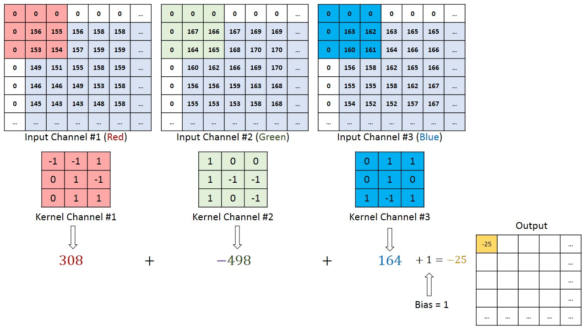
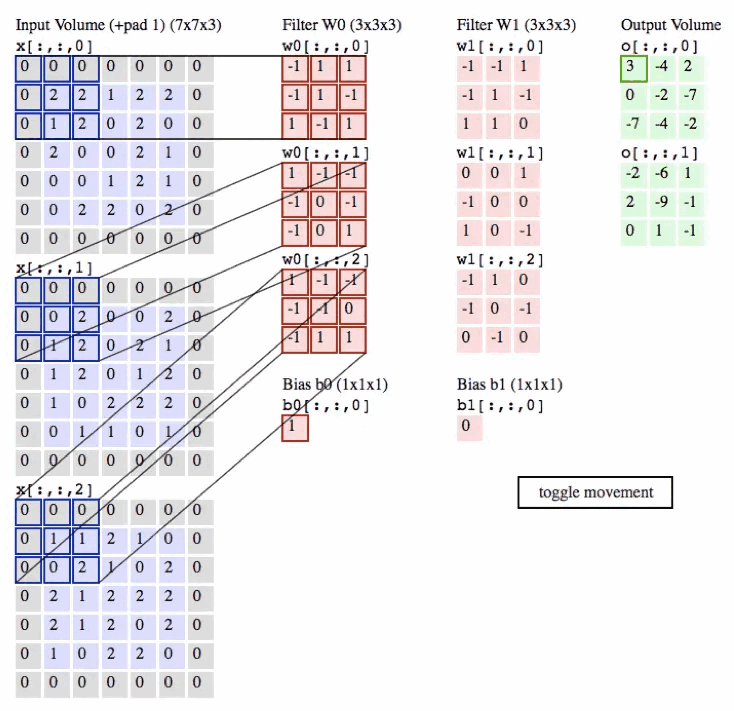

# Chapter 2 CNN Basics

>This tutorial will take CNN network as the basic point to lead you to appreciate the charm of model compression. Students who have some basics should have known about CNN, so can you distinguish the differences between terms such as channel, convolution kernel, filter, feature map, layer, etc.? If you can't distinguish, please read this tutorial with doubts.

## 2.1 Introduction to CNN

&emsp;&emsp;CNN network, namely Convolutional Neural Network, is a type of deep learning network specially designed for processing data with grid-like structure, such as images (2D grid) and sound signals (1D grid). CNN has achieved remarkable success in image and video recognition, image classification, medical image analysis and other fields.

### 2.1.1 Core composition
&emsp;&emsp;The core idea of ​​CNN is to use convolutional layers to automatically and effectively extract the features of input data without manual feature extraction. These features are gradually abstracted and combined through multiple layers of the network to perform tasks such as classification, detection or segmentation. CNN usually contains the following types of layers:

1. **Convolutional Layers**:
These layers extract local features of the input data through convolution operations. Each convolutional layer has multipleConvolution kernels can generate different feature maps.

2. **Activation Layers**:
Usually follow the convolution layer, introduce nonlinearity, so that the network can learn more complex features. The most commonly used activation function is ReLU (Rectified Linear Unit).

3. **Pooling Layers**:
These layers are used to reduce the spatial size of the feature map, reduce the number of parameters and calculations of subsequent layers, and make feature detection more stable.

4. **Fully Connected Layers**:
Usually located at the end of CNN, it converts the high-dimensional feature vector output by the convolution layer or pooling layer into the final output, such as the classification label.

### 2.1.2 Advantages
&emsp;&emsp;CNN can automatically and effectively learn useful feature representations from raw data through the superposition and combination of layers, avoiding the tedious process of manual feature extraction in traditional machine learning methods. It has the following advantages:
1. Parameter sharing: By reusing the same set of parameters in the convolutional kernels in the convolutional layer, CNN can process large-scale input data with fewer parameters.
2. Local connection: The neurons in the convolutional layer are only connected to a local area of ​​the input data, which allows the network to focus on local features.And enhance the spatial utilization of the model.
3. Translation invariance: Through the pooling layer, CNN can remain invariant to small-scale translation of the input data, which is particularly important for identifying objects in images.

&emsp;&emsp;The figure below is a visual example, please refer to [cnn-explainer](https://poloclub.github.io/cnn-explainer)

## 2.2 Interpretation of related terms

- Channel: Usually refers to the depth dimension of data. For example, a color image has three color channels: red, green, and blue (RGB). In CNN, the number of channels in the input layer corresponds to the number of color channels of the image, while the number of channels in the hidden layer corresponds to the number of filters in the layer, that is, the number of feature maps generated by each filter.
- Convolution kernel: A small matrix used for feature extraction in the convolution layer. When performing a convolution operation, the convolution kernel slides over each area of ​​the input data, performs element-wise multiplication with the corresponding local area, and then sums them up to form an element of the convolution output. The convolution kernel can capture local features of the data, such as edges, textures, etc.
- Filter: It consists of multiple convolution kernels, the number of which is equal to the number of channels of the input data. For example, for aFor a color image with three color channels, RGB, a filter will contain three convolution kernels, one for each color channel. When the entire filter acts on the input data, a two-dimensional feature map will be generated. Filters can detect specific types of features, and different filters can capture different features.
- Feature Map: refers to the feature representation extracted from the input data (such as an image) through a specific convolution filter. When the input data passes through a convolution layer, each filter of this layer is independently applied to the input data to generate a new two-dimensional array, which is the feature map.
- Layer: CNN consists of multiple layers, each of which can be a convolution layer, a pooling layer, a fully connected layer, etc. Each convolution layer consists of multiple filters, each filter generates a feature map through a convolution operation, and all feature maps are stacked together to form the output of the layer.

**Connection and Difference:**

- Kernel is the basic unit that constitutes the filter. When convolving multi-channel input, each channel has its corresponding kernel, and their collection constitutes a filter.
- Filter is a set of Kernel, which is used to extract a specific feature set from the input data.
- Channel refers to the depth dimension of the data, where the ChaNnel usually corresponds to the color channel of a natural image, and the number of channels output by the convolution layer is determined by the number of filters in the layer.
- Layer is a component unit in CNN, and there are various types of layers according to their functions. Convolution layer is one of them, using filters for feature extraction.
- Kernel/Filter focuses on the extraction of local features, Channel focuses on the diversity and representation of features, and Layer is a component of the network structure.

The following figure shows a convolution operation on a 3-channel image:

&emsp;&emsp;There are three convolution kernel (also called filter) channels with dimensions of `3 × 3 × 3`, representing the height, width and depth of the convolution kernel. The convolution operation first performs convolution operations on the three input channels, then adds the convolution results, and finally outputs a feature map.

&emsp;&emsp;Below is an example. Since 3D data is difficult to visualize, all data (input data volume is blue, weight data volume is red, and output data volume is green) are displayed by arranging the depth slices in columns.

&emsp;&emsp;The convolution operation is essentially a dot product between the filter and the local area of ​​the input data. Common implementations of convolutional layersThe current method is to take advantage of this and turn the forward propagation of the convolutional layer into a huge matrix multiplication.

## 2.3 Common evaluation indicators for model compression

&emsp;&emsp;Model compression is a technique to reduce the size and computation of deep learning models. Its purpose is to reduce resource consumption while maintaining model performance, making the model more suitable for deployment on resource-constrained devices. Common evaluation indicators for model compression include:

### 2.3.1 Accuracy

&emsp;&emsp;Accuracy refers to the accuracy of a model on a specific task before and after compression, such as classification accuracy, detection accuracy, etc. Although compression may sacrifice a certain degree of accuracy, the goal is to compress while maintaining acceptable accuracy.

### 2.3.2 Parameters

&emsp;&emsp;Parameters refer to the total number of trainable parameters in a model, usually the total number of all weights and biases that make up a deep learning model. The number of model parameters after compression is usually significantly reduced.

### 2.3.3 Model Size

&emsp;&emsp;Model size is the most intuitive indicator for measuring compression effect, usually measured by the storage size of the model file (such as MB). Its calculation formula is: `Size = Parameters * Bandwidth`

&emsp;&emsp;For example, the parameter size of a model is 61M, assuming that 32-bit floating point numbers are used for storagestorage, then the model size is: 
$$ 61M * 4Bytes(32bits) = 224MB(224 * 10^6 Bytes) $$

### 2.3.4 MACs

&emsp;&emsp;MACs (Number of Multiply-Accumulate Operations) represents the number of multiplication-accumulation operations. It is the basic unit for computers to perform floating-point operations, including a multiplication operation and an accumulation (addition) operation. In deep learning, MACs are used to describe the computational amount of convolution operations in convolutional neural networks (CNNs). Specifically, when we perform forward propagation in the convolution layer, each convolution kernel performs a dot product (element-wise multiplication) with the local area of ​​the input feature map, and then accumulates the results of all dot products to obtain a value on the output feature map. Each multiplication and subsequent accumulation operation in this process constitutes a MAC.

### 2.3.5 FLOPs

&emsp;&emsp;FLOPs (Number of Floating Point Operations, FLOPs) refers to the number of floating point operations required for a model to perform a forward inference. FLOPs is proportional to the computing resources required by the model.

### 2.3.6 Compression Ratio

&emsp;&emsp;The compression ratio is the ratio of the original model size to the compressed model size. A higher compression ratio means a smaller model size, but may also be accompanied by performance loss.

### 2.3.7 Inference Speed

&emsp;&emsp;Inference speed refers to the time required for the model to perform a forward propagation. Model compression usually improves inference speed because it reduces the amount of computation and model size.

## Reference Links

- <https://blog.csdn.net/weixin_38481963/article/details/109906338>
- <https://cs231n.github.io/convolutional-networks/>
- <https://poloclub.github.io/cnn-explainer/>