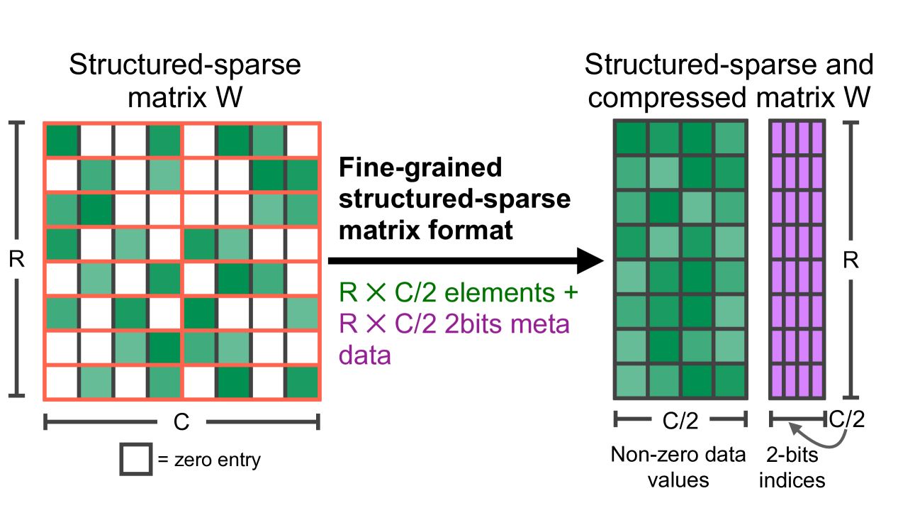
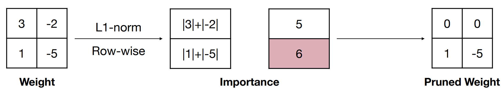
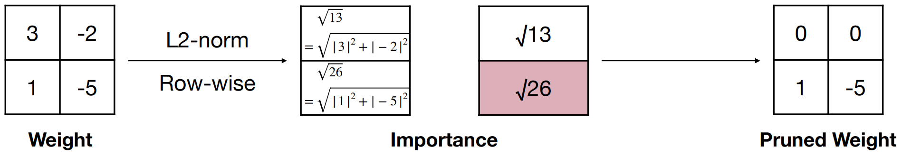

# Chapter 3 Model Pruning

## 3.1 Introduction to Model Pruning

&emsp;&emsp;Model pruning is an important technology in model compression. Its basic idea is to prune unimportant weights and branches in the model, sparse the network structure, and then obtain a model with smaller parameters, reduce memory overhead, and make inference faster. This is especially important for applications that need to run models on devices with limited resources. However, pruning may also lead to a decrease in model performance, so it is necessary to find a balance between model size and performance. The connection of neurons in a neural network is mathematically represented as a weight matrix, so pruning is to change some elements in the weight matrix to zero elements. These matrices with a large number of zero elements after pruning are called sparse matrices, and conversely, matrices with most non-zero elements are called dense matrices. The pruning process is shown in the figure below. The purpose is to subtract unimportant synapses or neurons.

&emsp;&emsp;In a neural network, model weights usually refer to the connections between neurons, i.e. synapses. When "removing weights" in model pruning, it usually means reducing the number of connections between neurons, rather than removing the neurons themselves. For a simple linear neural network, the formula can be expressed as:

$$
Y=W X
$$

&emsp;&emsp;Wherein, $W$ is the weight, $X$ is the input, i.e., the neuron. The specific implementation of pruning is to change some elements in the weight matrix to zero elements. These matrices with a large number of zero elements after pruning are called sparse matrices, whereas matrices with most elements non-zero are called dense matrices.

## 3.2 What is Pruning?

&emsp;&emsp;Pruning can be divided according to different standards. The following mainly describes the three aspects of pruning type, pruning range, and pruning granularity.

### 3.2.1 Pruning Type
&emsp;&emsp;According to the pruning type, pruning is divided into unstructured pruning and structured pruning.

#### 3.2.1.1 Unstructured Pruning

&emsp;&emsp;Unstructured pruning removes unimportant neurons. Accordingly, the connections between the pruned neurons and other neurons will be ignored during calculation. Since the pruned model is usually very sparse and destroys the structure of the original model, this type of method is called unstructured pruning. Unstructured pruning does not care about the position of the weight in the network, but only decides whether to remove the weight based on some criteria (for example, the absolute value of the weight). After removing the weight, the remaining weight distribution is sparse, that is, most of the weights are zero. Unstructured pruning can greatly reduce the number of model parameters and theoretical calculations, but the calculation method of the existing hardware architecture cannot be used for this purpose.To accelerate it, special hardware or software support is usually required to effectively utilize the sparsity of the resulting model. Therefore, the actual running speed cannot be improved, and specific hardware needs to be designed to accelerate it.

#### 3.2.1.2 Structured pruning

&emsp;&emsp;Structured pruning focuses more on the organizational structure of the model, and it attempts to identify and remove those parts that are not important in the entire model structure. This pruning method may involve removing entire neurons, convolution kernels, layers, or more complex structures. Usually, pruning is performed on filters or entire network layers as basic units. When a filter is pruned, its previous feature map and the next feature map will change accordingly, but the structure of the model is not destroyed and can still be accelerated by GPU or other hardware, so this type of method is called structured pruning.

&emsp;&emsp;Unstructured pruning focuses on removing a single unimportant weight, causing the weight matrix to become sparse, while structured pruning focuses on removing entire neural units or filters, resulting in changes in the network structure, such as reducing the number of layers or channels. In practical applications, structured pruning usually provides better performance and compression ratio because it can better utilize the intrinsic structure of the model. However, the implementation of structured pruning is usually more complicated and requires more computing resources and a deep understanding of the model. Unstructured pruning is relatively simple, but may not achieve the same compression effect as structured pruning.

### 3.2.2 Pruning scope
&emsp;&emsp;According to the pruning scope, pruning is divided into local pruning and global pruning.

#### 3.2.2.1 Local pruning

&emsp;&emsp;Local pruning focuses on individual weights or parameters in the model. This pruning method usually evaluates each weight in the model and then decides whether to set it to zero. The purpose of local pruning is to remove weights that have little impact on the model output. This method can be weight pruning, neuron pruning, or even channel pruning (removing the entire convolution channel in a convolutional neural network). The characteristic of local pruning is that it operates independently on each part of the model without relying on other parts of the model.

### 3.2.2.2 Global pruning

&emsp;&emsp;Global pruning considers the overall structure and performance of the model. This pruning method may remove entire neurons, convolution kernels, layers, or more complex structures, such as convolution kernel groups. The goal of global pruning is to optimize the performance of the entire model while reducing the complexity of the model. Global pruning usually requires a deep understanding of the overall structure of the model and may involve redesigning the model architecture. This approach may have a greater impact on the final performance of the model because it changes the overall feature extraction capability of the model.

### 3.2.3 Pruning granularity
&emsp;&emsp;According to the pruning granularity, pruning can be divided into fine-grained pruning (Fine-grained Pruning), pattern-based Pruning, vector-level Pruning, kernel-level Pruning and channel-level Pruning.

&emsp;&emsp;As shown in the figure below, it shows the pruning from fine-grained pruning to channel-level pruning, and the pruning becomes more and more regular and structured.

#### 3.2.3.1 Fine-grained pruning

&emsp;&emsp;Fine-grained pruning removes any value in the weight matrix. Fine-grained pruning can achieve high compression ratios, but it is not hardware-friendly, so the speed gain is limited.

#### 3.2.3.2 Pattern-based pruning

&emsp;&emsp;N:M sparsity represents the sparsity of DNN. N:M sparsity requires that at most N of every M consecutive weights are non-zero. It can take advantage of NVIDIA's Sparse Tensor Cores to accelerate matrix multiplication in practice. Nvidia Ampere A100 is equipped with Sparse Tensor Cores to accelerate the fine-grained sparsity of the 2:4 structure, taking full advantage of the fine-grained sparsity of the network weights. They provideUp to 2 times the maximum throughput of dense math without sacrificing the accuracy of the matrix multiplication and accumulation operations at the heart of deep learning.

&emsp;&emsp;The sparse matrix W is first compressed, and the compressed matrix stores the non-zero data values, while the metadata stores the index information of the corresponding non-zero elements in the original matrix W. Specifically, the metadata compresses the row and column numbers of the non-zero elements in W into two independent one-dimensional arrays, which are the index information stored in the metadata. As shown below:

&emsp;&emsp;Here, take NVIDIA 2:4 as an example and create a pattern. As shown below, since it is 2:4, that is, 2 out of 4 are taken and set to 0, a total of 6 different patterns can be calculated; then the weight matrix is ​​transformed into nx4 format for convenient matrix operation with pattern. The result of the operation is an nx6 matrix. Perform argmax on the dimension of n to obtain the largest index (index corresponds to pattern), and then fill the pattern value corresponding to the index into the mask.

### 3.2.3.3 Vector-level pruning

&emsp;&emsp;Vector-level pruning prunes weights in units of rows or columns.

### 3.2.3.4 Kernel-level pruning

&emsp;&emsp;Kernel-level pruning prunes weights in units of convolution kernels (filters).

### 3.2.3.5 Channel-level pruning

&emsp;&emsp;Channel-level pruning prunes weights in units of channels.

> Note: Fine-grained, pattern-based pruning, vector-level, and kernel-level pruning methods achieve a certain balance between the number of parameters and model performance, but the topology of the network itself has changed, and a special algorithm design is required to support this sparse operation, which belongs to unstructured pruning.
> Channel-level pruning changes the number of filter groups and feature channels in the network. The obtained model can run without special algorithm design, which belongs to structured pruning.

## 3.3 Why Pruning?

&emsp;&emsp;Why can models be pruned? Model pruning is effective mainly because it can identify and remove parameters that have little impact on model performance, thereby reducing the complexity and computational cost of the model. This process usually does not significantly affect the accuracy of the model, especially when the model itself may be overfitting, and pruning can help the model generalize better to new data.

- Han Song, et al. (2015) proposed a pruning method in the paper "Learning both Weights and Connections for Efficient Neural Networks" that reduces the number of model parameters by gradually removing connections with smaller weights during training. Experimental results show that the pruned model significantly reduces the complexity of the model while maintaining similar performance.
- Liu Z, et al. (2016) proposed a gradient-based pruning method in "Learning Efficient Convolutional Networks through Network Slimming" that determines which weights can be removed by calculating the gradient of the weights. This method significantly reduces the number of model parameters while maintaining model performance.
- He Y, et al. (2017)In "Filter Pruning via Geometric Median for Deep Convolutional Neural Networks Acceleration", a pruning method based on geometric median is proposed, which determines which filters can be removed by calculating the geometric median of each filter. Experimental results show that this method can significantly reduce the computational complexity of the model while maintaining model performance.
- Zhu M, et al. (2017) explored the effectiveness of model pruning in "To prune, or not to prune: exploring the efficacy of pruning for model compression" and proposed a new progressive pruning technique. This work compares the performance of large sparse models with small dense models and proves that pruning can significantly reduce model size while maintaining or even improving model accuracy.

## 3.4 How to prune?

&emsp;&emsp;How to determine which ones to remove? This involves the pruning criteria. The current mainstream pruning standards include the following methods:

### 3.4.1 Based on weight size

&emsp;&emsp;The simplest way is to directlyThe importance of weights is calculated based on the absolute value of each element's weight. The basic idea is to remove weights with smaller absolute values ​​in the neural network based on a single element. This pruning method is based on the assumption that the smaller the absolute value of the weight, the smaller the impact of the weight on the model's output, so removing them will also have a smaller impact on the model's performance. The way this method calculates importance can be written as the following formula:

$$
\text { Importance }=|W|
$$

Where $Importance$ represents importance, and $W$ is the weight. The pruning process is shown in the figure below.

&emsp;&emsp;L1 and L2 regularization are commonly used regularization techniques in machine learning. They prevent model overfitting by adding additional penalty terms to the loss function. These two regularization methods can also be used to guide model pruning, that is, to influence the size of the weight through the regularization term, thereby achieving pruning. The basic idea of ​​L1 and L2 regularization is to calculate the importance of each row in units of rows and remove those rows with less importance in the weight. L1 regularization calculates the sum of the absolute values ​​of the elements in each row. The way to calculate the importance can be written as the following formula:

$$
\text { Importance }=\sum_{i \in S}\left|w_i\right|
$$

&emsp;&emsp;The pruning process is shown in the figure below.

&emsp;&emsp;L2 regularization calculates the square root of the sum of the squares of the absolute values ​​of the elements in each row. The way to calculate importance can be written as the following formula:

$$
\text { Importance }=\sqrt{\sum_{i \in S}\left|w_i\right|^2}
$$

&emsp;&emsp;The pruning process is shown in the figure below.

### 3.4.2 Based on gradient size

&emsp;&emsp;The pruning algorithm based on weight size as the basis of importance can easily prune important weights. Taking face recognition as an example, among the many features of the face, subtle changes in the eyes such as color, size, and shape have a great impact on the results of face recognition. Corresponding to the weights in the deep network, even if the weight itself is small, its slight change will have a great impact on the result, and such weights should not be pruned. The gradient is the partial derivative of the loss function with respect to the weight, reflecting the sensitivity of the loss to the weight. The gradient-based pruning algorithm is a method that analyzes the weight gradient in the model to determine the importance of the weight and remove the weights with smaller gradients. The core idea of ​​this method is that during the model training process, the gradient of the weight reflects the weight's influence on the input.The influence of the output loss, a larger gradient means that the weight has a greater impact on the output loss, so it is more important; a smaller gradient means that the weight has a smaller impact on the output loss, so it is less important. By removing weights with smaller gradients, the size of the model can be reduced while maintaining the accuracy of the model.

## 3.5 Pruning frequency (How often?)

&emsp;&emsp;Model pruning methods can be divided into iterative and one-shot pruning according to the pruning frequency.

### 3.5.1 Iterative Pruning

&emsp;&emsp;Iterative pruning is a progressive model pruning method that involves multiple cycles of pruning and fine-tuning steps. This process gradually reduces the weights in the model instead of pruning a large number of weights at once. The basic idea of ​​iterative pruning is that by gradually removing weights, the impact of each pruning on the model performance can be evaluated more carefully, and the model is allowed to have the opportunity to adjust the remaining weights to compensate for the pruned weights.

&emsp;&emsp;Iterative pruning usually follows these steps:
- Train the model: First train a full, unpruned model to a good level of performance on the training data.
- Prune: Use a predetermined pruning strategy (e.g. based on weight size) to slightly prune the network, removing a small portion of the weights.
- Fine-tune: Fine-tune the pruned model, whichUsually involves retraining the model using the original training dataset to recover the performance loss caused by pruning.
- Evaluation: Evaluate the performance of the pruned model on the validation set to ensure that the model still maintains good performance.
- Repeat: Repeat steps 2 to 4, pruning more weights each iteration and fine-tuning until a predetermined performance standard or pruning ratio is reached.

### 3.5.2 One-Shot Pruning

&emsp;&emsp;One-shot pruning performs a one-time pruning operation on the model after training. This pruning method is characterized by being efficient and direct, and it does not require multiple iterations between pruning and retraining. In one-shot pruning, the model is first trained to convergence, and then some pruning criteria (such as the absolute value of the weight) are used to determine which parameters can be removed. These parameters are usually those that have a small impact on the model output.

&emsp;&emsp;Single pruning is greatly affected by noise, while iterative pruning is much better because it only removes a small amount of weights after each iteration, and then repeats other rounds of evaluation and deletion, which can reduce the impact of noise on the entire pruning process to a certain extent. However, for large models, due to the high cost of fine-tuning, single pruning is more preferred.

## 3.6 When to prune?

### 3.6.1 Post-training pruning

&emsp;&emsp;The basic idea of ​​post-training pruning is to first train a model, then prune the model, and finally fine-tune the pruned model. The core idea is to train the model once to learn which neural connections are actually important, prune those that are not important (low weight), and then train again to learn the final value of the weights. Here are the detailed steps:

- Initial training: First, the neural network is trained using the standard back-propagation algorithm. In this process, the network learns the weights (i.e. the strength of the connections) and the network structure.
- Identify important connections: After training is completed, the network has learned which connections have a significant impact on the output of the model. Generally, connections with larger weights are considered important.
- Set threshold: Choose a threshold that is used to determine which connections are important. All connections with weights below this threshold will be considered unimportant.
- Pruning: Remove all connections with weights below the threshold. This usually involves converting fully connected layers into sparse layers because most of the connections are removed.
- Retraining: After pruning, the capacity of the network is reduced, and in order to compensate for this change, the network needs to be retrained. During this process, the network adjusts the weights of the remaining connections to adapt to the new structure while maintaining accuracy.
- Iterative pruning: The process of pruning and retraining can be done iteratively. Each iteration removes more connections until an equilibrium point is reached where the network can maintain accuracy without significant loss of accuracy.Reduce connections as much as possible under the circumstances.

### 3.6.2 Pruning during training

&emsp;&emsp;The basic idea of ​​pruning during training is to perform pruning directly during the model training process and finally fine-tune the pruned model. Compared with post-training pruning, connections are dynamically deactivated during training according to their importance, but weights are allowed to adapt and possibly reactivate. Pruning during training can produce more effective models because unnecessary connections are pruned as early as possible, which may reduce memory and computational requirements during training. However, it needs to be handled with care to avoid sudden changes in network structure and the risk of over-pruning, which may harm performance. Dropout, which is commonly used in deep learning, is actually a pruning method during training. During the training process, random neurons are "dropped out" or set to zero with a certain probability. The training process of pruning during training includes the following detailed steps, taking the CNN network as an example:
- Initialize model parameters: First, initialize the weights of the neural network using a standard initialization method.
- Training loop: At the beginning of each training cycle (epoch), the training data is forward-propagated and back-propagated using the complete model parameters to update the model weights.
- Calculate importance: At the end of each training cycle, the importance of all filters in each convolutional layer is calculated.
- Select filters for pruning: According to a pre-set pruning rate, the filters with the least importance are selected for pruning. These filters are considered unimportant because they have no effect on the model.The contribution of the model output is small.
- Prune filters: Set the weights of the selected filters to zero so that the contribution of these filters is not calculated in the subsequent forward propagation.
- Rebuild the model: After pruning the filters, continue one training cycle. At this stage, through backpropagation, the weights of the previously pruned filters are allowed to update, thereby restoring the capacity of the model.
- Iterative process: Repeat the above steps until the predetermined number of training cycles is reached or the model converges.

### 3.6.3 Pre-training pruning

&emsp;&emsp;The basic idea of ​​pre-training pruning is to prune the model before training, and then train the pruned model from scratch. Here we have to mention the lottery hypothesis, that is, any randomly initialized dense feedforward network contains a sub-network with the following properties-when trained independently, the initialized sub-network can achieve a test accuracy similar to the original network after at most the same number of iterations as the original network. In the lottery hypothesis, the pruned network does not need to be fine-tuned, but the "winning" sub-network is reset to the network's original weights and retrained, and the final result can catch up with or even exceed the original dense network. To sum up in one sentence: A randomly initialized dense neural network contains a sub-network that is initialized so that when trained alone, it can match the test accuracy of the original network after training for at most the same number of iterations.

&emsp;&emsp;Initially, the neural network is trained using a predefined frameworkThe network is created with a random structure and randomly initialized weights. This forms the starting point for pruning. Based on some criteria or heuristics, specific connections or weights are identified for pruning. Then there is a question, we haven't started training the model yet, so how do we know which connections are not important?

The current common approach is generally to use random pruning methods during the initialization phase. Randomly selected connections are pruned, and the process is repeated multiple times to create various sparse network architectures. The idea behind this is that if pruning is done in multiple ways before training, it may be possible to skip the process of finding lottery tickets.

### 3.6.4 Summary of Pruning Timing

**Post-training pruning (static sparsity):** Pruning after the initial training phase involves removing connections or filters from the trained model in a separate post-processing step. This allows the model to fully converge without any interruptions during training, ensuring that the learned representations are well established. After pruning, the model can be further fine-tuned to recover from any potential performance degradation caused by the pruning process. Post-training pruning is generally more stable and less likely to cause overfitting. It is suitable for scenarios where pre-trained models are fine-tuned for specific tasks.

**Training-time pruning (dynamic sparsity):** In this approach, pruning is integrated into the optimization process as an additional regularization technique. During training iterations, less important connections are dynamically removed or pruned based on some criteria or heuristics. This allows the model to explore different levels of sparsity and adapt its architecture throughout the training process.. Dynamic sparsity can lead to more efficient models because unimportant connections are pruned early, potentially reducing memory and computational requirements. However, it needs to be handled with care to avoid abrupt changes in the network structure and the risk of over-pruning, which can hurt performance.

**Pre-training pruning:** Pre-training pruning involves pruning certain connections or weights from a neural network before the training process begins. The advantage is that training can be done faster because the initial model size is reduced, and the network can converge faster. However, it requires careful selection of the pruning criteria to avoid removing important connections too aggressively.

## 3.7 Practice

- [Pruning granularity practice](https://github.com/datawhalechina/awesome-compression/blob/main/docs/notebook/ch03/1.pruning_granularity.ipynb)
- [Pruning standard practice](https://github.com/datawhalechina/awesome-compression/blob/main/docs/notebook/ch03/2.pruning_criteria.ipynb)
- [Pruning timing practice](https://github.com/datawhalechina/awesome-compression/blob/main/docs/notebook/ch03/2.pruning_criteria.ipynb)a/awesome-compression/blob/main/docs/notebook/ch03/3.pruning_timing.ipynb)
- [Pruning algorithm practice in torch](https://github.com/datawhalechina/awesome-compression/blob/main/docs/notebook/ch03/4.torch_prune.ipynb)