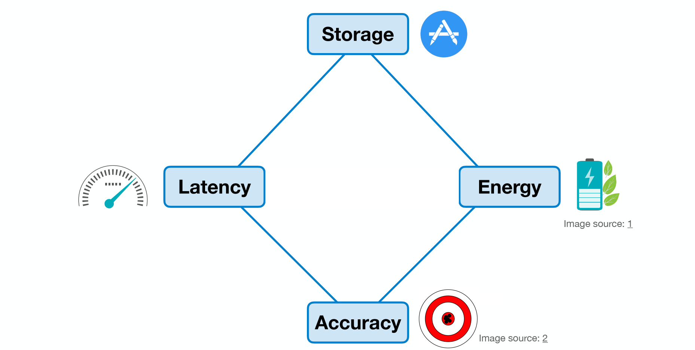
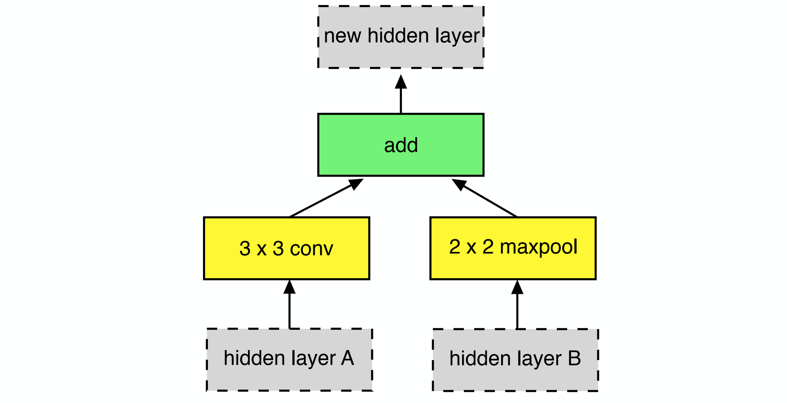
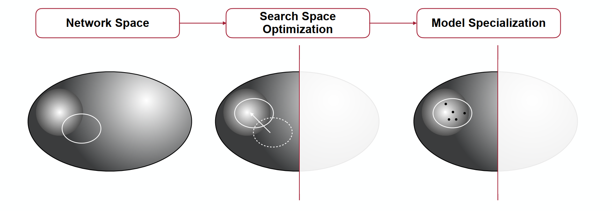
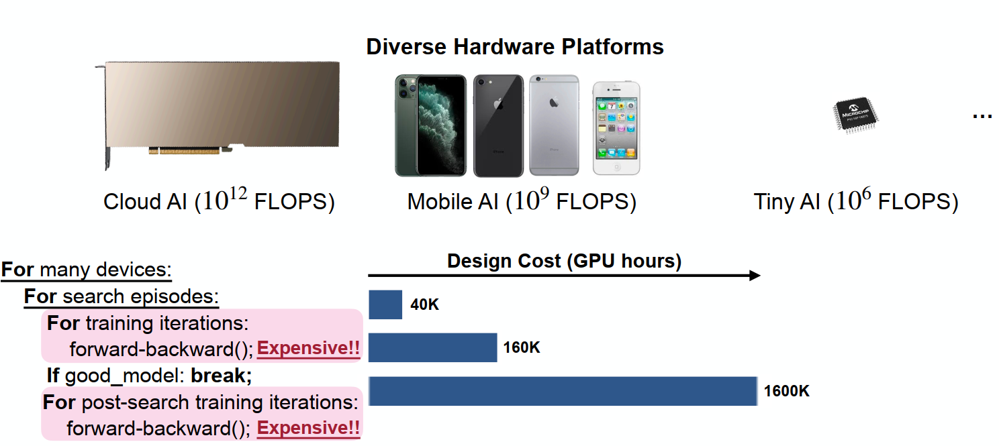
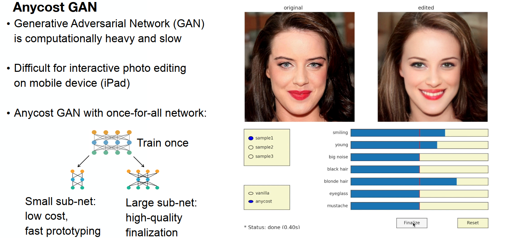

# 第5章 神经网络架构搜索

&emsp;&emsp;本章我们将在 5.1 节介神经网络架构搜索、在5.2节介绍神经网络架构搜索的基本概念、5.3节介绍搜索空间的概念、5.4节介绍搜索策略、5.5介绍几个低成本的模型性能评估方法，5.6节介绍带硬件限制的神经网络架构搜索，以及在5.7节介绍神经网络架构搜索后的应用。这些内容构成了本章的主要内容。

## 5.1 神经网络架构搜索介绍

&emsp;&emsp; 前几章的剪枝和量化，主要是针对已有的模型上所发展出来的模型压缩技术。那么是否存在某种方法能够直接得到一个小模型且该小模型兼顾性能好、参数量小和高效的特点？

&emsp;&emsp; 目前，一个比较直接的方式就是，将神经网络的结构，参数量，组合方式当做搜索空间，利用相关的搜索算法配合对搜索过程的模型评估以此来快速搜索到合适的神经网络架构与参数。我们把这种技术叫做“**神经网络架构搜索**”(Neural Architecture Search, NAS)。

&emsp;&emsp; 回到一开始的目标，构建一个“有效模型”需要满足“**延时低**、**存储少**、**消耗少**，同时还要保持**模型精度**等几个目标。

&emsp;&emsp; 对于多个目标，如果直接使用手工设计的方式，往往会比较难以满足不同的目标。所以，如果能够将上述的目标转换为“优化目标”，就能够通过某种优化方法，使得模型尽可能满足上述的所有目标。

&emsp;&emsp; 所以，从这个角度来说，“神经网络架构搜索”，在一定程度上，扩展了搜索空间，使得整个网络有更大的空间来完成上述的目标。

## 5.2 神经网络架构搜索的基本概念

### 5.2.1 基础网络模型回顾

&emsp;&emsp; 首先，对之前的基础网络模型进行回顾，有：线性变换操作，卷积操作，分组卷积操作等。

&emsp;&emsp; 这些基础的网络模型有对应的参数量和计算量。

### 5.2.2 网络模块介绍

&emsp;&emsp; 现代的深度学习模型，除了基础的网络之外，还有相关的模型架构嵌套设计，比如ResNet的残差结构。

&emsp;&emsp; 通过这种连接方式，一方面能够减少计算量，降低模型训练的难度；另一方面也是一种新型且有效的模块化设计。

&emsp;&emsp; 除了ResNet之外，还有一类有效的网络模块是：Transformer中的多头注意力架构：

&emsp;&emsp; 该模块有一个比较好的性质是，多个模块能够并行计算，加速了模型的计算速度。

## 5.3 搜索空间的介绍

&emsp;&emsp; 回到一开始的问题，传统的网络模型设计，主要集中在人工进行相关架构的设计，那么是否能够利用计算机自动化搜索到合适的网络架构和参数？

&emsp;&emsp; 除此之外，回顾一开始的目标，是否存在这样的模型即满足参数量少，还保持模型的准确性呢？

&emsp;&emsp; 从上述的实验效果图可以看到，传统人工设计的模型存在参数越来越大，性能越来越好的趋势，但实际上，也可以看到，存在一些方法，能够在降低的模型参数的前提下与模型参数比较大的模型精度接近。

&emsp;&emsp; 所以，在当前的研究下，神经网络架构搜索确实能够一定程度上满足上述的要求。

### 5.3.1 神经网络架构搜索的基本流程

&emsp;&emsp; 其流程可以被看做是传统神经网络优化的扩展形式。首先先规定一个搜索空间$\mathcal{A}$，然后给定一些搜索策略，能够得到对应的神经网络架构模型，通过数据集评估该模型的性能，再将该结果反馈给搜索策略，给出迭代后的新神经网络架构。

### 5.3.2 搜索空间

&emsp;&emsp; 对于一个单独的神经网络来说，其搜索空间为每一个神经元可能的所有取值的组合。而对于神经网络架构搜索的搜索空间来说，则是不同基本网络模型的组合。所以从理论上来说，其组合的可能也为无穷多个。

&emsp;&emsp; 为了方便讨论，对于搜索空间，可以划分为：“单元级搜索空间”和“网络级搜索空间”，前者主要针对不同基础结构进行组合，后者主要针对模块/网络进行组合。

1. 单元级搜索空间

&emsp;&emsp; 以CNN为例：

&emsp;&emsp; 为了展示其组合可能性的大小，在这里做一个简单的数学题：假设我们有两个候选类型输入A和B(指不同的输入形状)，有$M$个不同的变换操作(比如线性层，卷积层等)以及$N$种组合隐藏层的操作(比如求和或平均)，如果整个网络有$L$层，那么该搜索空间有多大？

&emsp;&emsp; 如上图所示，对于每一层来说，每一个输入都有两种情况，每一个输入都有$M$种基础模型，以及有$N$种合并方式，所以最后的搜索空间为：

$$
\text{Search Space} = (2*2*M*M*N)^{L} = 4^LM^{2L}N^L。
$$

&emsp;&emsp; 假设我们令，$M=5,N=2,L=5$，也就是有5种基础模型，2种组合方式，以及5层网络层，其最后的搜索空间为$3.2\times10^{11}$，即$10^{11}$的数量级的大小。

2. 网络级搜索空间

&emsp;&emsp; 除此之外，类似ResNet等有效的网络组合，也需要对其做搜索。

&emsp;&emsp; 如上图所示，可以针对残差结构中的深度进行搜索；可以对图像的解析度进行搜索；哈可以对每一层的输入输出维度进行搜索。

### 5.3.3 搜索空间与硬件设备之间的关系

&emsp;&emsp; 上述主要针对网络与任务进行神经网络架构搜索空间的讨论，其背后的一个基本假设是**计算资源是无穷的**，即快速计算，无限存储。但是在实际应用中，不同的设备会有不同的计算速度和存储速度。

&emsp;&emsp; 如何能够在考虑设备计算速度、存储限制的情况下，针对硬件设备本身进行网络架构搜索呢？

&emsp;&emsp; 为此，就需要针对硬件设备的限制对搜索空间做限制。

## 5.4 搜索策略的介绍

&emsp;&emsp; 在规定好神经网络架构的搜索空间以后，为了能够找到符合目标的神经网络架构，就需要不同的搜索策略。在本小节，主要介绍5种搜索策略，分别是：网格搜索(Grid search)、随机搜索(Random search)、强化学习(Reinforcement learning)、梯度下降(Gradient descent)以及进化算法(Evolutionary search)。

1. 网格搜索

&emsp;&emsp; 该方法顾名思义，将不同的组合都列出来能够组成一张“网格”，通过在网格上进行搜索，以找到最好的结果。

&emsp;&emsp; 以上图为例，将图像解析度和网络宽度作为搜索变量，对其进行网格化处理，通过数据验证能够得到对应的准确度(如图像分类)，则在满足时延限制下的结果进行比较，选择最好的神经网络架构。

2. 随机搜索

&emsp;&emsp; 如果说，网格搜索是按照顺序的方式进行搜索，那么随机搜索在网格搜索的基础上打乱搜索顺序，有可能能够更快地找到合适的神经网络架构。

3. 强化学习

&emsp;&emsp; 对于网格搜索和随机搜索来说，其计算量仍然是巨大的。如果能够通过某种学习方式学习网络架构的设计，能够在一定程度上减少计算量，所以利用强化学习尝试对其进行求解。

&emsp;&emsp; 如上图所示的一种强化学习方法。左图展示的是，通过一个网络架构生成器(某种RNN变体)，通过概率采样生成一个网络架构，再将该网络架构在具体的数据集上训练，评估得到准确率，将该准确率反馈到该控制器进行调整。而右图则是规定了生成一个网络架构的顺序。

4. 梯度下降

&emsp;&emsp; 如果能够将不同的层的选择，与最后的目标函数关联起来就能够利用梯度下降来得到一个神经网络架构。

&emsp;&emsp; 如上图所示。对每一层确定不同网络层的选择，对每一个选择给定一个概率，当网络传播的时候则通过概率采样得到对应的网络层，再在最后的目标函数对概率和网络层参数进行优化，得到该神经网络架构。

5. 进化算法

&emsp;&emsp; 有时候梯度信息是难以设计和得到的，但我们仍然有一个目标函数，所以可以通过进化算法对其进行优化。

&emsp;&emsp; 如上图所示，我们希望模型能够既兼顾时延，同时也兼顾准确率。首先，在原来的网络架构中采样出子网络，对其进行训练和评估得到时延和准确率的信息，通过进化算法判断是否需要丢弃还是保留。然后对保留的字网络进行，比如变异，交叉等操作，模拟细胞分裂时基因的行为。最终选择最优的“基因”，即子网络作为最优的神经网络架构结果。

## 5.5 模型性能评估

&emsp;&emsp;  在上几节，对于得到的神经网络架构模型的评估，主要还是通过在在数据集上进行评估得到模型性能的表现，但是这种方法成本会比较大，因为每一次都需要重新训练模型。在本小节，还将介绍几种方法，在降低成本的同时还能够对模型进行评估，想过方法有：权重继承(Inherit weight)和超网络(Hypernetwork)。

1. 权重继承

&emsp;&emsp; 顾名思义，当新的神经网络架构得到的时候，其权重能够从上一个架构继承，使其减少训练成本。

&emsp;&emsp; 以上图的两个模型Net2Wider和Net2Deeper为例，两个模型主要是对原始网络做宽和深的拓展搜索。对于Net2Wider来说，其对某一层拓宽以后，其权值也进行了复制，但也要保持输入和输出的一致；对于Net2Deeper来说，其对模型拓宽深度以后，拓宽的模型参数可以从之前的网络中直接映射过去。

1. 超网络

&emsp;&emsp; 超网络，这里以某个工作为例，该工作将神经网络架构和参数看做是某一个生成网络的结果，在某一损失函数下进行优化。

&emsp;&emsp; 如上图所示。其过程为，在每一个训练阶段，都从搜索空间随机采样一个神经网络架构。利用上述图中的图传播得到每一个节点的嵌入向量，再利用MLP生成网络参数，最后利用损失函数进行参数优化。

&emsp;&emsp; 所以该网络并不需要额外对其得到的神经网络架构结果进行训练，因为其已经生成了对应的模型参数。

## 5.6 以硬件为主的神经网络架构搜索

&emsp;&emsp; 上述的神经网络架构搜索方法并不针对特殊的硬件进行优化，即对任意的硬件都可以通过上述的方法得到对应的模型。

&emsp;&emsp; 但是这种方法相对是昂贵的，比如NASNet在Cifar数据集上需要48,000个GPU小时，在单个GPU下需要运行约5年，DARTS方法直接运行在ImageNet需要100GB的内存。所以这些方法都会增加“代理任务”(provxy tasks)。

&emsp;&emsp; 虽然“代理任务”能够降低计算量，但是得到的是次优的结果。所以在这里设计了一种无代理的神经网络搜索方法，ProxylessNAS：

&emsp;&emsp; 该方法构建一个过量参数的模型，在单个训练过程中采样对应的NAS架构对模型参数进行训练，在架构参数上剪枝掉额外的路径。最后将架构参数二值化，使其只有一条路径是活动的，此时的内存就从O(N)下降到O(1)。

1. MACs不等于真实的硬件效率

&emsp;&emsp; 我们再回到传统的NAS来看，由于模型并不考虑具体的硬件，所以一般是默认在比较强大的GPU上进行搜索，但是这会导致一个硬件上不兼容的问题：

&emsp;&emsp; 如上图可以看到，传统的NAS搜索的方法将MAC当做目标，所以会有一个较低的MAC数值，但是在手机硬件中的时延却仍然比针对该设备所设计的模型要高很多。这是因为在PC上的GPU存在隐藏维度的增加时延不增加，而模型层数的增加，时延才增加的现象。所以在PC上的GPU进行NAS，NAS很自然会增加隐藏层维度来降低时延。

&emsp;&emsp; 但是在小型硬件上则不是这种规律，由上图所示，当隐藏层增加，其时延也增加很多，而GPU则并不受其影响。

2. 在小型设备评估存在慢的问题

&emsp;&emsp; 既然如此，我们直接将NAS在这类设备上评估对应的时延和准确率以此来优化模型不就好了？但是现实情况还存在一个问题是，小型设备由于其设备性能的限制，对相关模型的评估效率也有很大的影响，评估也需要大量的时间进行反馈。

&emsp;&emsp; 那么，我们很自然就会想到，如果在一个设备上评估效率低，那采用多个设备不就好了？这样确实可以，但是相对的，购买设备的资金也就比较庞大的，比如相应的设备是iPhone的话。

&emsp;&emsp; 所以，为了降低上述所提到的成本问题，在这里，我们可以构建一个新的网络，该网络用来预测当前模型的参数在新设备上的性能如何，这些性能预测是通过已有预测的数据进行模型训练，具有一定的预测能力。这种方式能够一定程度降低使用相关设备评估的成本，从而提高评估效率。

3. 同一个模型在不同设备的应用

&emsp;&emsp; 除此之外，在现实场景中，我们还会遇到这么一种情况，那就是一个应用，比如图像识别，能够在不同设备上都能正常的运行，但是不同的设备的计算资源如上文所述，存在不同方面的限制和性质。

&emsp;&emsp; 如果对于不同的设备，都要进行架构的搜索和训练，这样的成本也是昂贵的。是否存在一种方法，能够使得该能力能够对不同设备进行调整呢？

&emsp;&emsp; 通关对传统的NAS的过程进行观察可以发现，传统的NAS直接针对一个模型进行训练才调整该模型架构，而如果遇到多个设备的时候，只需要在一个更大的模型中采样出某个模型，进行训练和评估即可。这样的NAS过程，相当于考虑到了多个不同设备的情况，从而能够训练一个兼顾不同设备的NAS模型。

&emsp;&emsp; 该模型就能够针对不同的设备，或者是同一系列设备不同性能，甚至是同一设备不同效率采用不同的网络执行相关的任务。

## 5.7 神经网络架构搜索的应用介绍

&emsp;&emsp; 主要以Once-for-All模型的应用为例子：

1. 在NLP上的应用

&emsp;&emsp; 从上图可以看到，通过对Transformer进行架构搜索，能够在不同的设备上进行运行，使得模型的时延和大小都能够大幅度下降。

2. 点云理解的应用

3. GAN生成的应用

&emsp;&emsp; 该方法能够在不同设备上使用，同时保持能够接受的时延。

4. 姿态检测

## 实践
本次实践中，以网格搜索方法，在限制模型的参数大小下尽可能搜索准确率较高的网络。
示例代码： [神经网络架构搜索实践](https://github.com/datawhalechina/awesome-compression/blob/main/docs/notebook/ch05/1.NAS.ipynb)