# Chapter 5 Neural Network Architecture Search

&emsp;&emsp;In this chapter, we will introduce neural network architecture search in Section 5.1, the basic concepts of neural network architecture search in Section 5.2, the concept of search space in Section 5.3, the search strategy in Section 5.4, several low-cost model performance evaluation methods in Section 5.5, neural network architecture search with hardware restrictions in Section 5.6, and the application after neural network architecture search in Section 5.7. These contents constitute the main content of this chapter.

## 5.1 Introduction to Neural Network Architecture Search

&emsp;&emsp; The pruning and quantization in the previous chapters are mainly aimed at the model compression technology developed on the existing models. So is there a way to directly get a small model that has good performance, small parameters and high efficiency?

&emsp;&emsp; At present, a more direct way is to use the structure, parameter amount and combination of neural networks as the search space, and use relevant search algorithms to cooperate with the model evaluation of the search process to quickly search for suitable neural network architectures and parameters. We call this technology "Neural Architecture Search" (NAS).

&emsp;&emsp; Back to the original goal, building an "effective model" requires "low latency and less storage", **less consumption**, and at the same time maintaining **model accuracy** and other goals.

&emsp;&emsp; For multiple goals, if you directly use manual design, it is often difficult to meet different goals. Therefore, if the above goals can be converted into "optimization goals", you can use some optimization methods to make the model meet all the above goals as much as possible.

&emsp;&emsp; So, from this perspective, "neural network architecture search" has, to a certain extent, expanded the search space, giving the entire network more space to complete the above goals.

## 5.2 Basic concepts of neural network architecture search

### 5.2.1 Review of basic network models

&emsp;&emsp; First, review the previous basic network models, including: linear transformation operations, convolution operations, grouped convolution operations, etc.

&emsp;&emsp; These basic network models have corresponding parameters and calculations.

### 5.2.2 Introduction to network modules

&emsp;&emsp; Modern deep learning models, in addition to the basic network, also have related model architecture nesting designs, such as ResNet’s residualDifferent structure.

&emsp;&emsp; This connection method can reduce the amount of calculation and the difficulty of model training on the one hand; on the other hand, it is also a new and effective modular design.

&emsp;&emsp; In addition to ResNet, there is another type of effective network module: the multi-head attention architecture in Transformer:

&emsp;&emsp; One of the good properties of this module is that multiple modules can be calculated in parallel, which speeds up the calculation speed of the model.

## 5.3 Introduction to search space

&emsp;&emsp; Back to the original question, traditional network model design mainly focuses on the manual design of related architectures, so can we use computers to automatically search for suitable network architectures and parameters?

&emsp;&emsp; In addition, looking back at the initial goal, is there such a model that satisfies the requirement of small number of parameters and maintains the accuracy of the model?

&emsp;&emsp; From the aboveThe experimental effect diagram shows that the traditional manually designed models have a trend of increasing parameters and improving performance. However, in fact, it can also be seen that there are some methods that can approach the accuracy of models with larger model parameters under the premise of reducing model parameters.

&emsp;&emsp; Therefore, under the current research, neural network architecture search can indeed meet the above requirements to a certain extent.

### 5.3.1 Basic process of neural network architecture search

&emsp;&emsp; Its process can be regarded as an extended form of traditional neural network optimization. First, a search space $\mathcal{A}$ is specified, and then some search strategies are given to obtain the corresponding neural network architecture model. The performance of the model is evaluated through the data set, and the result is fed back to the search strategy to give a new neural network architecture after iteration.

### 5.3.2 Search Space

&emsp;&emsp; For a single neural network, its search space is the combination of all possible values ​​of each neuron. As for the search space of neural network architecture search, it is a combination of different basic network models. So theoretically, the possible combinations are infinite.

&emsp;&emsp; For the convenience of discussion, the search space can be divided into: "Unit-level search"Space" and "network-level search space", the former is mainly for the combination of different infrastructures, and the latter is mainly for the combination of modules/networks.

1. Cell-level search space

&emsp;&emsp; Take CNN as an example:

&emsp;&emsp; To show the size of its combination possibilities, here is a simple math problem: Suppose we have two candidate input types A and B (referring to different input shapes), there are $M$ different transformation operations (such as linear layers, convolutional layers, etc.) and $N$ types of combined hidden layer operations (such as summation or averaging), if the entire network has $L$ layers, how big is the search space?

&emsp;&emsp; As shown in the figure above, for each layer, each input has two cases, each input has $M$ basic models, and $N$ merging methods, so the final search space is:

$$
\text{Search Space} = (2*2*M*M*N)^{L} = 4^LM^{2L}N^L.
$$

&emsp;&emsp; Assume that we set $M=5,N=2,L=5$, that is,5 basic models, 2 combinations, and 5 network layers, the final search space is $3.2\times10^{11}$, which is the order of magnitude of $10^{11}$.

2. Network-level search space

&emsp;&emsp; In addition, effective network combinations such as ResNet also need to be searched.

&emsp;&emsp; As shown in the figure above, the depth in the residual structure can be searched; the resolution of the image can be searched; and the input and output dimensions of each layer can be searched.

### 5.3.3 Relationship between search space and hardware devices

&emsp;&emsp; The above discussion mainly focuses on the search space of neural network architecture for networks and tasks. A basic assumption behind it is that **computing resources are infinite**, that is, fast computing and unlimited storage. However, in actual applications, different devices have different computing speeds and storage speeds.

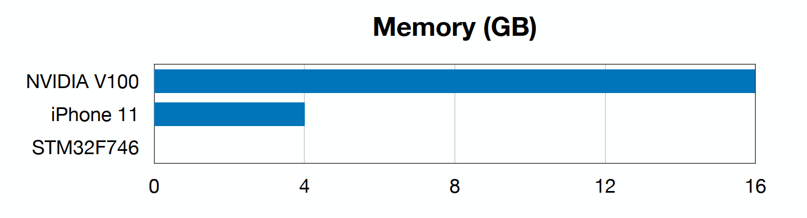

&emsp;&emsp; How can we perform network architecture search for the hardware device itself while considering the device's computing speed and storage limitations?

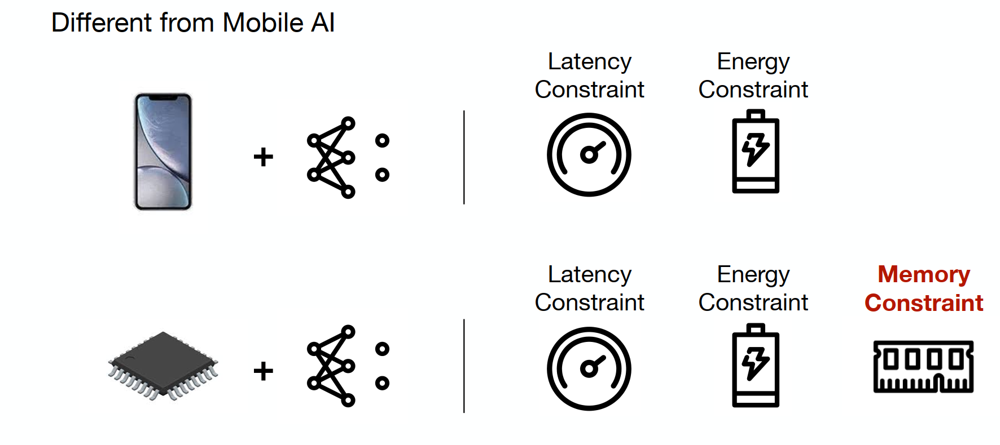

&emsp;&emsp; To this end, it is necessary to limit the search space according to the limitations of the hardware device.
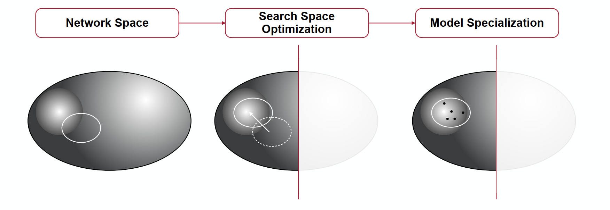

## 5.4 Introduction to search strategies

&emsp;&emsp; After defining the search space of the neural network architecture, different search strategies are required to find a neural network architecture that meets the target. In this section, five search strategies are mainly introduced, namely: grid search, random search, reinforcement learning, gradient descent, and evolutionary search.

1. Grid search

&emsp;&emsp; As the name suggests, this method lists different combinations to form a "grid" and searches on the grid to find the best result.

&emsp;&emsp; Taking the above picture as an example, the image resolution and network bandwidth areThe degree is used as the search variable, and the grid is processed. The corresponding accuracy (such as image classification) can be obtained through data verification. The results under the delay limit are compared to select the best neural network architecture.

2. Random search

&emsp;&emsp; If the grid search is searched in a sequential manner, then the random search disrupts the search order on the basis of the grid search, and it is possible to find a suitable neural network architecture faster.

3. Reinforcement learning

&emsp;&emsp; For grid search and random search, the amount of calculation is still huge. If the design of the network architecture can be learned through some learning method, the amount of calculation can be reduced to a certain extent, so reinforcement learning is used to try to solve it.

&emsp;&emsp; A reinforcement learning method as shown in the figure above. The left picture shows that a network architecture is generated through probability sampling through a network architecture generator (some RNN variant), and then the network architecture is trained on a specific data set, the accuracy is evaluated, and the accuracy is fed back to the controller for adjustment. The right picture specifies the generation of a network architectureorder.

4. Gradient descent

&emsp;&emsp; If the selection of different layers can be associated with the final objective function, a neural network architecture can be obtained by gradient descent.

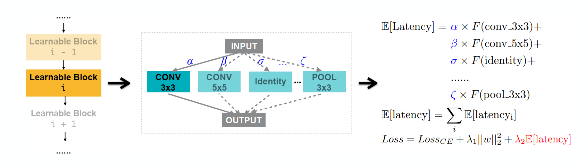

&emsp;&emsp; As shown in the figure above. Determine the selection of different network layers for each layer, give a probability to each selection, and obtain the corresponding network layer through probability sampling when the network propagates. Then, optimize the probability and network layer parameters in the final objective function to obtain the neural network architecture.

5. Evolutionary algorithm

&emsp;&emsp; Sometimes gradient information is difficult to design and obtain, but we still have an objective function, so it can be optimized through evolutionary algorithms.

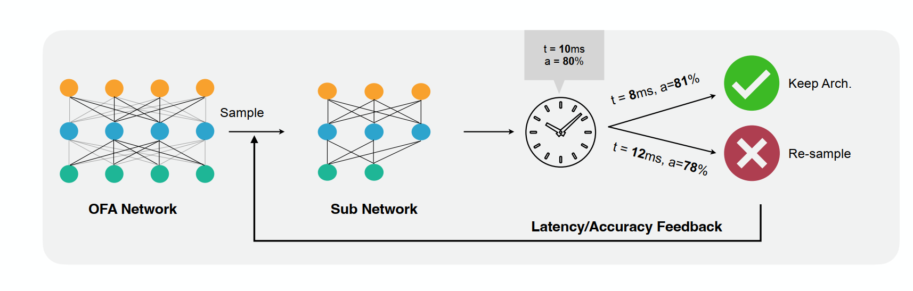

&emsp;&emsp; As shown in the figure above, we hope that the model can take into account both latency and accuracy. First, a sub-network is sampled from the original network architecture, and it is trained and evaluated to obtain information on latency and accuracy. The evolutionary algorithm is then used to determine whether it needs to be discarded or retained. Then, operations such as mutation and crossover are performed on the retained sub-network to simulate the behavior of genes during cell division.Finally, the optimal "gene", that is, the sub-network, is selected as the optimal neural network architecture result.

## 5.5 Model performance evaluation

&emsp;&emsp; In the previous sections, the evaluation of the obtained neural network architecture model is mainly obtained by evaluating the model performance on the data set, but this method is costly because the model needs to be retrained every time. In this section, several methods will be introduced to reduce the cost while evaluating the model. The methods are: weight inheritance (Inherit weight) and hypernetwork (Hypernetwork).

1. Weight inheritance

&emsp;&emsp; As the name suggests, when a new neural network architecture is obtained, its weight can be inherited from the previous architecture to reduce the training cost.

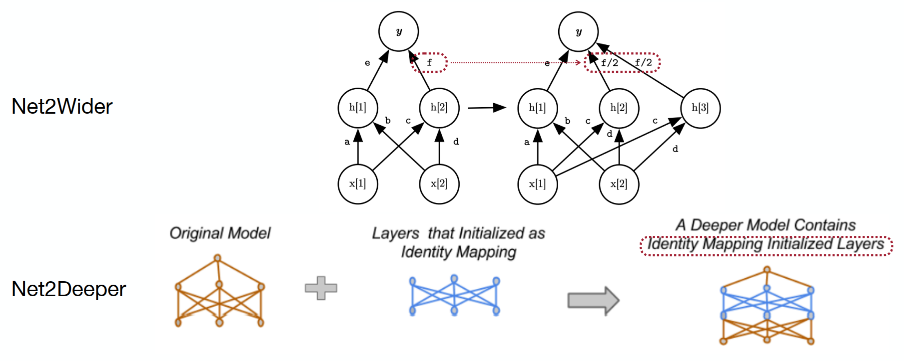

&emsp;&emsp; Taking the two models Net2Wider and Net2Deeper in the above figure as examples, the two models mainly perform wide and deep expansion searches on the original network. For Net2Wider, after widening a certain layer, its weights are also copied, but the input and output must be kept consistent; for Net2Deeper, after widening the depth of the model, the widened model parameters can be directly mapped from the previous network.1. Hypernetwork

&emsp;&emsp; Hypernetwork, here we take a certain work as an example, this work regards the neural network architecture and parameters as the result of a certain generated network, and optimizes them under a certain loss function.

&emsp;&emsp; As shown in the figure above. The process is that in each training stage, a neural network architecture is randomly sampled from the search space. The embedding vector of each node is obtained by using the graph propagation in the above figure, and then the network parameters are generated by MLP, and finally the parameters are optimized by the loss function.

&emsp;&emsp; Therefore, the network does not need to train the neural network architecture results obtained by it, because it has generated the corresponding model parameters.

## 5.6 Hardware-based neural network architecture search

&emsp;&emsp; The above neural network architecture search method is not optimized for special hardware, that is, the corresponding model can be obtained for any hardware through the above method.

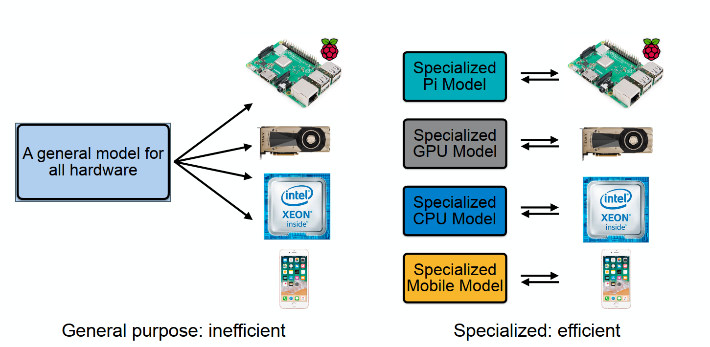

&emsp;&emsp; However, this method is relatively expensive. For example, NASNet requires 48,000 GPU hours on the Cifar dataset and about5 years, the DARTS method requires 100GB of memory to run directly on ImageNet. Therefore, these methods will increase "proxy tasks" (provxy tasks).

&emsp;&emsp; Although "proxy tasks" can reduce the amount of calculation, the obtained results are suboptimal. Therefore, a proxy-free neural network search method, ProxylessNAS, is designed here:

&emsp;&emsp; This method builds a model with excess parameters, samples the corresponding NAS architecture in a single training process to train the model parameters, and prunes the extra paths on the architecture parameters. Finally, the architecture parameters are binarized so that only one path is active, and the memory at this time is reduced from O(N) to O(1).

1. MACs are not equal to the actual hardware efficiency

&emsp;&emsp; Let's go back to the traditional NAS. Since the model does not consider the specific hardware, it usually defaults to searching on a more powerful GPU, but this will lead to a hardware incompatibility problem:

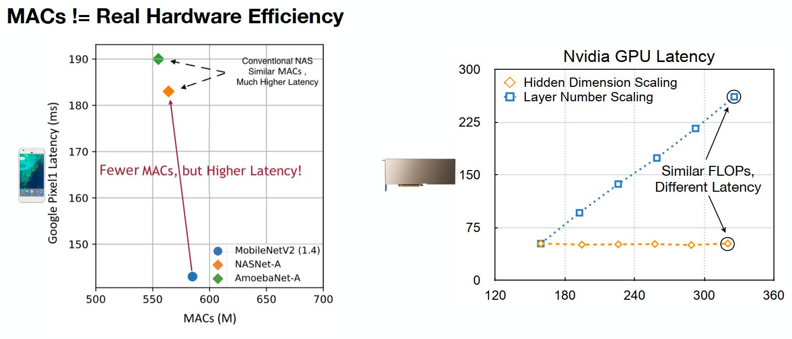

&emsp;&emsp; As shown in the figure above, the traditional NAS search method takes MAC as the target, so there will be a lower MAC value, but the latency in the mobile phone hardware is still much higher than the model designed for the device. This is because the GPU on the PC has the phenomenon that the latency does not increase with the increase of hidden dimensions, but the latency increases with the increase of model layers. Therefore, when the GPU on the PC performs NAS, NAS will naturally increase the hidden layer dimension to reduce latency.

&emsp;&emsp; However, this is not the case on small hardware. As shown in the figure above, when the hidden layer increases, its latency also increases a lot, while the GPU is not affected by it.

2. There is a slow evaluation problem on small devices

&emsp;&emsp; In this case, wouldn’t it be better for us to directly use NAS to evaluate the corresponding latency and accuracy on such devices to optimize the model? However, there is still a problem in reality. Due to the limitations of its equipment performance, small devices also have a great impact on the evaluation efficiency of related models, and the evaluation also requires a lot of time for feedback. 

&emsp;&emsp; Then, it is natural for us to think that if the evaluation efficiency is low on a device, thenWouldn't it be better to use multiple devices? This is indeed possible, but the funds for purchasing the devices are relatively large, such as if the corresponding device is an iPhone.

&emsp;&emsp; Therefore, in order to reduce the cost problem mentioned above, here we can build a new network, which is used to predict the performance of the parameters of the current model on the new device. These performance predictions are trained by the model through the existing predicted data, and have certain predictive capabilities. This method can reduce the cost of using related equipment for evaluation to a certain extent, thereby improving the evaluation efficiency.

3. Application of the same model on different devices

&emsp;&emsp; In addition, in real scenarios, we will encounter such a situation, that is, an application, such as image recognition, can run normally on different devices, but the computing resources of different devices have different limitations and properties as mentioned above.

&emsp;&emsp; If architecture search and training are required for different devices, the cost is also expensive. Is there a way to makeCan this capability be adjusted for different devices?

&emsp;&emsp; By observing the traditional NAS process, it can be found that the traditional NAS directly trains a model before adjusting the model architecture. If there are multiple devices, it only needs to sample a model from a larger model for training and evaluation. Such a NAS process is equivalent to taking into account the situation of multiple different devices, so that a NAS model that takes into account different devices can be trained.

&emsp;&emsp; This model can use different networks to perform related tasks for different devices, or different performances of the same series of devices, or even different efficiencies of the same device.

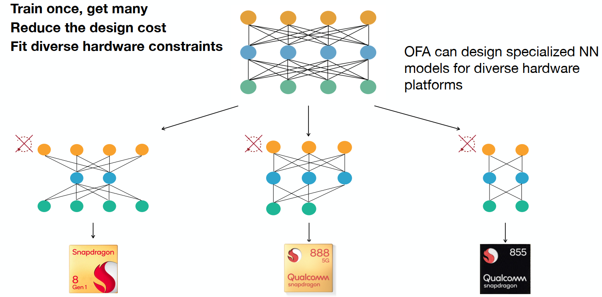

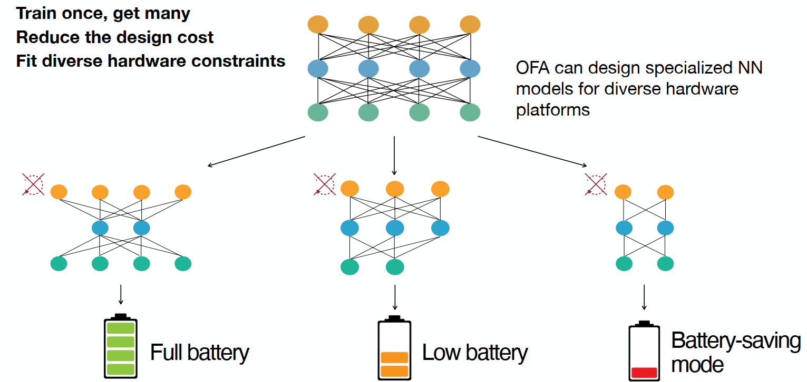

## 5.7 Introduction to the Application of Neural Network Architecture Search

&emsp;&emsp; Mainly taking the application of the Once-for-All model as an example:

1. Application in NLP

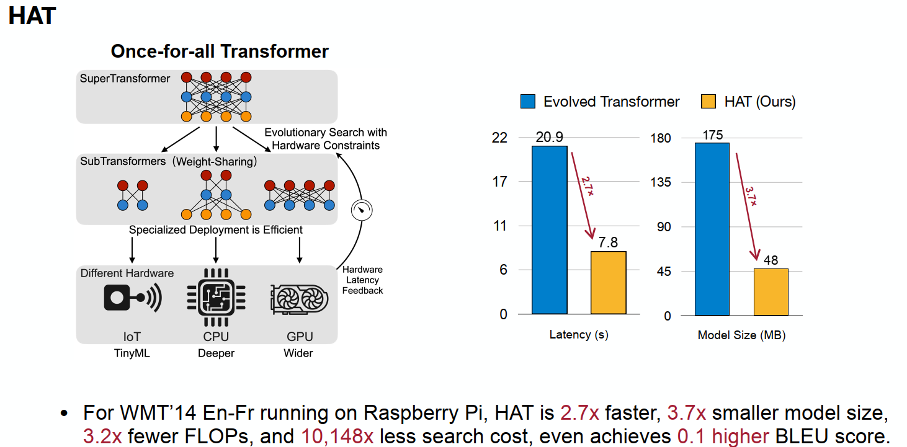

&emsp;&emsp; As can be seen from the above figure, by searching the Transformer architecture, it can be run on different devices, which greatly reduces the latency and size of the model.

2. Application of point cloud understanding

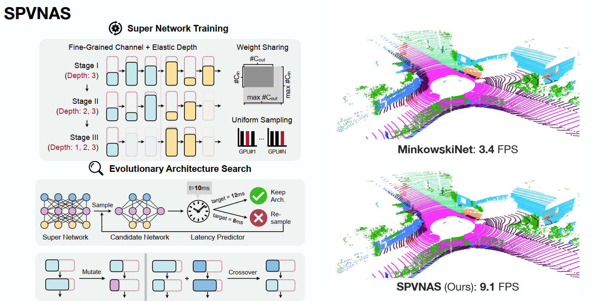

3. Application of GAN generation

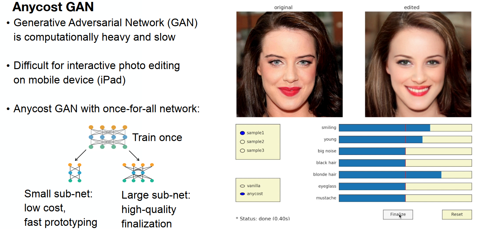

&emsp;&emsp; This method can be used on different devices while maintaining acceptable latency.

4. Posture Detection

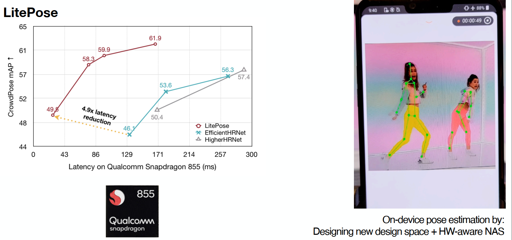

## Practice
In this practice, the grid search method is used to search for networks with higher accuracy as much as possible while limiting the parameter size of the model.
Sample code: [Neural Network Architecture Search Practice](https://github.com/datawhalechina/awesome-compression/blob/main/docs/notebook/ch05/1.NAS.ipynb)