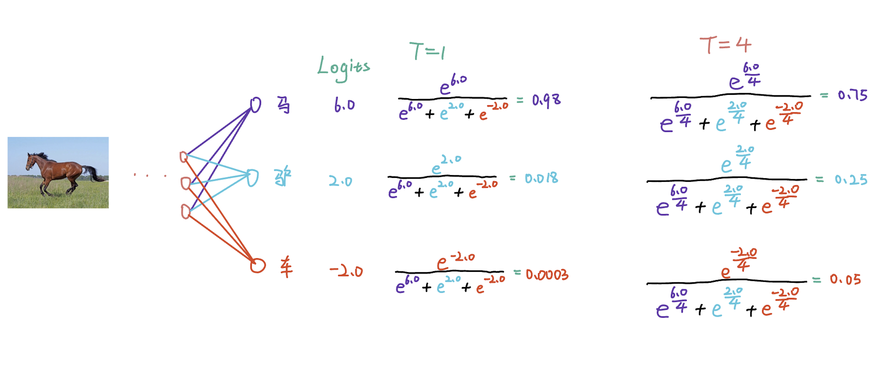

# Chapter 6 Knowledge Distillation

## 6.1 Introduction

  Generally speaking, for the same machine learning task, complex networks tend to have more parameters and more computational complexity, but usually perform better. In contrast, simple networks tend to have fewer parameters and less computational complexity, but their performance may be relatively poor. Knowledge Distillation (KD) is a model compression technique that transfers knowledge from a large (teacher) model to a small (student) model. It helps the student model learn better by learning the output (Logits) distribution or feature map (Feature Map) of the teacher model, thereby improving the accuracy and efficiency of the student model.

### Main Concepts

#### Teacher Model
- A pre-trained complex model that usually performs well but has high computational overhead.
- Provides soft labels or information from the intermediate layers as "knowledge".

#### Student Model
- A smaller, simpler model designed to learn and imitate the behavior of the teacher model.
- By learning the "knowledge" of the teacher model, the student model is able to achieve performance close to that of the teacher model on a smaller scale.

####Soft Target
- The probability distribution output by the teacher model usually contains more information than the hard label (i.e., One-Hot Label).
- The output probability distribution is softened by temperature adjustment, so that the student model can better learn the relative relationship between probabilities.

## 6.2 Specific process of knowledge distillation

   The basic architecture of knowledge distillation is shown in the figure above, where the teacher model is a trained model and the student model is a model that needs to be trained.

   Assuming that the current task is an image classification task, in the training stage, for a training image $\mathbf x$ and its corresponding true label $y$ (also called hard label). Feed the image $\mathbf{x}$ into the teacher and learning model respectively, and get two output Logits of the same size: $\mathbf{u} = [u_1, u_2, ..., u_K]\in \mathbb{R}^{1\times K}$ and $\mathbf{v} = [v_1, v_2, ..., v_K] \in \mathbb{R}^{1\times K}$, where $K$ represents the total number of categories corresponding to the dataset of the classification task. Subsequently, the two Logits are processed by the Softmax function to obtain the final predictions of the two models on the input $\mathbf{x}$, $\mathbf{p} = [p_1, p_2, ..., p_K]$ and $\mathbf{q} = [q_1, q_2, ..., q_K]$.

   Since the output of the teacher model is usually more confident, this will cause the unprocessed $\mathbf{p}$ to tend to be close to a one-hot vector ($[0, 0, 1, 0, ..., 0, 0]$). In order to soften the predicted probability of the teacher model, the usual practice is to introduce the temperature $\tau$ in the softmax function for softening, and perform KL divergence calculation Loss on the softened Logits, which becomes Soft Loss.

   At the same time, during distillation, the student model also receives supervision from the new supervision number (Hard Label). At this time, the loss is no different from the normal classification task training loss. The cross entropy loss can be directly calculated for the output $\mathbf{v}$ of the student model and the hard label $y$. This part of the loss is called Hard Loss (hard loss), and finally the model distillation is carried out under the joint action of Soft Loss and Hard Loss.

## 6.2 Temperature

### What is temperature

   Temperature is used to adjust the probability distribution of the teacher model output in knowledge distillation, so as to better guide the learning of the student model.

### Why is temperature needed

   The output of the teacher model is usually a category probability distribution, generated by the Softmax function. For the Softmax output without adjusting the temperature, the probability of a certain category is usually close to 1, while the probability of other categories is close to 0. This sharp distribution is not friendly to the student model because it only provides information about the correct answer and ignores the information of other categories. (And at this time, the probability distribution output by the teacher model is very close to the label Hard Label). After adjusting the temperature, a relatively "soft" probability distribution can be obtained, called "soft label". This adjustment process is called "softening". For example: 

| Tags | Horse | Donkey | Car |
| :--------: | :--: | :--: | :--: |
|img|  | | |
| Network output | 6.0 | 2.0 | -2.0 |
| Softmax | 0.98 | 0.018 | 0.0003 |
| Hard Label (true label) | 1 | 0 | 0 |
| Soft Label (softened by temperature) | 0.75 | 0.25 | 0.05 |

   It can be found that the probability distribution of the original output of the network after Softmax is almost the same as the true label. The distribution at this time ignores the potential relationship between categories. For example, "horse" is more like "donkey" and less like "car". Although the Softmax probability distribution of the original output can also reflect this relationship, the difference is not very obvious. The soft label obtained after temperature softening can clearly show the difference between different categories and well reflect the relative relationship between different categories. This detail can help the student model better understand the complete information of the input sample, rather than just learning the hard label.

### Temperature calculation process

   Assume a modelThe output of the model is $z = [z_1, z_2, ..., z_K]$, where $K$ is the number of categories. The traditional Softmax is

$$
\frac{\exp {z_i}}{\sum _ {j=1} ^ K \exp {z_j}}
$$

   The calculation method of Softmax with temperature is 

$$
\frac{\exp {z_i / \tau}}{\sum _ {j=1} ^ K \exp {z_j / \tau}}
$$

   Where $\tau$ represents the temperature. Then the traditional Softmax can also be regarded as a special case where the temperature $\tau$ is 1.

   A more specific example, as shown in the table: 

<!--  -->

| Class | Logits (direct output of the network) | Softmax (T=1) | Softmax(T=4)  Softening with temperature |
| :--:| :--------------------: | :--------------------------------------------------------: | :----------------------------------------------------------: |
| Horse | 6.0 | $\frac{e^{6.0}}{e ^ {6.0} + e ^ {2.0}+ e^{-2.0}} = 0.98$ | $\frac{e^{\frac{6.0}{4}}}{e^{\frac{6.0}{4}} + e^{\frac{2.0}{4}} + e^{\frac{-2.0}{4}} }= 0.75$ |
| Donkey | 2.0 | $\frac{e^{2.0}}{e ^ {6.0} + e ^ {2.0}+ e^{-2.0}} = 0.018$ | $\frac{e^{\frac{2.0}{4}}}{e^{\frac{6.0}{4}} + e^{\frac{2.0}{4}}+ e^{\frac{-2.0}{4}} } = 0.25$ |
| Car | -2.0 | $\frac{e^{-2.0}}{e ^ {6.0} + e ^ {2.0}+ e^{-2.0}} = 0.002$ | $\frac{e^{\frac{-2.0}{4}}}{e^{\frac{6.0}{4}} + e^{\frac{2.0}{4}} + e^{\frac{-2.0}{4}}}=0.05$ |

&emsp;&emsp;In practice, we usually also soften the output of the student model. Finally, the soft labels of the softened teacher model and student model are $\mathbf{p}(\tau) = [p_1(\tau), p_2(\tau), ..., p_K(\tau)]$ and $\mathbf{q}(\tau) = [q_1(\tau), q_2(\tau), ..., q_K(\tau)]$ respectively.

&emsp;&emsp;$p_i(\tau)$ and $q_i(\tau)$ are defined as follows: 
$$
\begin{aligned}
p_{i}(\tau) = \frac{\exp(u_i / \tau)}{\sum_{i=1}^K \exp(u_i / \tau)} \\
q_{i}(\tau) = \frac{\exp(v_i / \tau)}{\sum_{i=1}^K \exp(v_i / \tau)} 
\end{aligned}
$$
&emsp;&emsp;Wherein, $\tau$ represents the temperature used in the distillation process. When the temperature $\tau$ is 1, the results of $\mathbf p(\tau)$ and $\mathbf q(\tau)$ are consistent with the results of the general Softmax function.

### The effect of temperature on the softening degree of Logits

&emsp;&emsp; The size of the temperature $\tau$ controls the softening degree of the predicted probability. Smaller $\tau$ will result in a sharper softening effect, while larger $\tau$ will result in a smoother softening effect. As shown in the figure above, the Origin on the far left represents the distribution of the output Logits of a classification network for any image. The horizontal axis represents the specific category number, and the vertical axis represents the network's predicted value for a specific type. The rightmost is the Argmax(). 

&emsp;&emsp; It can be found that when the temperature is very high (for example, $\tau = 14$), the distribution of the softened Logits is almost the same, and when the temperature is very low (for example, $\tau = 0.5$), the distribution of the softened Logits is almost equivalent to the result of Arg max(). In other words, when the temperature is very high, the softened Logits of the teacher network are close to the average value, and the student model cannot learn knowledge from the teacher model, because the prediction probability of the teacher model's Logits for each category is consistent. When the temperature is very low, distillation loses its meaning, because the knowledge passed by the teacher model to the student can be regarded as equivalent to Hard Label. Therefore, choosing the right temperature is crucial for distillation. Generally, the temperature used on the CIFAR-10/100 dataset is $4$, while on the ImageNet dataset, the temperature generally used is $1$.

### Distillation results of different sizes and temperatures

&emsp;&emsp; The teacher model in the figure is Res32x4, and the student model is Res8x4. The data set selected for the experiment is CIFAR-100.The vertical axis represents the temperature used in distillation, and the vertical axis represents the distillation results on the CIFAR-100 validation set. It can be found that different temperatures have a relatively large impact on the results of distillation. When practicing on your own, readers should try different temperatures instead of just relying on empirical settings.

## 6.3 Loss function of knowledge distillation

&emsp;&emsp;The loss function of knowledge distillation is composed of a linear combination of soft loss and hard loss, and the specific definition is as follows:

&emsp;&emsp;**Soft loss**

$$
\mathcal{L}_{\operatorname{KL}} = \operatorname {KL}(\mathbf{q}(\tau), \mathbf{p}(\tau)) = \sum_j \ p_j(\tau) \log \frac{p_j(\tau)}{q_j(\tau)}
$$

&emsp;&emsp;**Hard loss**

$$
\mathcal L_{CE} = \operatorname {CE}(\mathbf q(\tau = 1), \mathbf y) = \sum _ {j} - y_j \log q_j(1)
$$

&emsp;&emsp;where $\mathbf{p}$ and $\mathbf{q}$ represent the output Logits of the teacher model and the student model respectively, while $\tau$ represents the temperature used for distillation. The final loss function is 
$$
Loss = \alpha \cdot \mathcal L_{CE} + \beta \cdot \tau ^ 2 \cdot \mathcal L_{KL}\\
= \alpha \cdot \operatorname {CE}(\mathbf q(\tau = 1), \mathbf y) + \beta \cdot \tau ^ 2 \cdot \operatorname {KL}(\mathbf{q}(\tau), \mathbf{p}(\tau))
$$

&emsp;&emsp; In general, keep $\alpha + \beta = 1$. In practice, $\alpha$ is usually $0.1$, and $\beta$ is usually $0.9$. As for why we need to multiply $\operatorname {KL}$ of the soft loss by $\tau ^ 2$, the simple explanation is to keep the gradient balance between the soft loss and the hard loss. Please choose the specific explanation.Reading [6.4]()

## 6.4 Derivation of loss function (optional)

### 6.4.1 Derivation of Softmax function

&emsp;&emsp;Assume that for an arbitrary Logits vector $\mathbf z = [z_1, z_2, ..., z_{K}]\in \mathbb{R}^{1\times K}$, where $K$ is the number of categories in the dataset. After calculating the vector $\mathbf s = [s_1(\tau), s_2(\tau), ..., s_K(\tau)]$ by the Softmax function with temperature, $s_i(\tau)$ is defined as: 
$$
s_i(\tau) = \frac{e^{z_i/ \tau}}{\sum_{j=1}^K e^{z_j / \tau}}
$$

&emsp;&emsp;For any $z_k \in \mathbf z$ , the partial derivative of $s_i(\tau)$ with respect to $z_k$ can be divided into two cases:

&emsp;&emsp; When $i = k$ , there is
$$
\begin{align*}
\frac{\partial s_i(\tau)}{\partial z_k}
&= \frac{\partial}{\partial z_k}\frac{e^{z_k / \tau}}{\sum_{j=1}^K e^{z_j / \tau}} \\ 
&= \frac{\frac{\partial}{\partial z_k}e^{z_k / \tau}\ \sum_{j=1}^K e^{z_j / \tau} - e^{z_k / \tau}\ \frac{\partial}{\partial z_k}\sum_{j=1}^K e^{z_j / \tau}}{\left( \sum_{j=1}^K e^{z_j / \tau}\right) ^ 2} \\
&= \frac{\frac{1}{\tau}\ e^{z_k/ \tau}}{\sum_{j=1}^K e^{z_j / \tau}} - \frac{e^{z_k/ \tau }\ \frac{1}{\tau}\ e^{z_k/ \tau }}{\left( \sum_{j=1}^K e^{z_j / \tau}\right) ^ 2}\\ 
&= \frac{1}{\tau}(s_k(\tau) - s_k(\tau)\ s_k(\tau)) \\
&= \frac{1}{\tau}\ s_k(\tau)\ (1 - s_k(\tau))
\end{align*}
$$

&emsp;&emsp; When $i \neq k$, there is
$$
\begin{align*}
\frac{\partial s_i(\tau)}{\partial z_k}
&= \frac{\partial}{\partial z_k}\frac{e^{z_i / \tau}}{\sum_{j=1}^K e^{z_j / \tau}} \\ 
&= \frac{\frac{\partial}{\partial z_k}e^{z_i / \tau}\ \sum_{j=1}^K e^{z_j / \tau} - e^{z_i / \tau}\ \frac{\partial}{\partial z_k}\sum_{j=1}^K e^{z_j / \tau}}{\left( \sum_{j=1}^K e^{z_j / \tau}\right) ^ 2} \\
&= 0- \frac{e^{z_i/ \tau }\frac{1}{\tau}e^{z_k/ \tau }}{\left(\sum_{j=1}^K e^{z_j / \tau}\right) ^ 2}\\ 
&= -\frac{1}{\tau}\ s_i(\tau)\ s_k(\tau)
\end{align*}
$$

&emsp;&emsp; Therefore, for the partial derivative of $\varphi (z_i)$ with respect to $z_k$, we have
$$
\frac{\partial s_i(\tau)}{\partial z_k} =
\left\{
\begin{matrix}
\frac{1}{\tau}\ s_k(\tau)\ (1 - s_k(\tau))& \text{if } i = k \\
-\frac{1}{\tau}\ s_i(\tau)\ s_k(\tau) & \text{if } i \neq k
\end{matrix}
\right.
$$

### 6.4.2 Hard Loss CE Derivative

&emsp;&emsp;For the output logits of the student model $\mathbf{v} = [v_1, v_2, ..., v_K] \in \mathbb{R}^{1\times K}$ For any $v_k$ in $v_k$ , the gradient of the hard loss $ \mathcal L_{CE}$ with respect to $v_k$ is:
$$
\begin{align*}
\mathcal L_{CE} &= \operatorname {CE}(\mathbf q(\tau = 1), \mathbf y) \\ 
&= \sum _ {j=1}^K - y_j \log q_j(\tau = 1) \\
\frac{\partial \mathcal L_{CE}}{\partial v_k} &= \frac{\partial}{\partial v_k}\sum _ {j=1}^K - y_j \log q_j(\tau = 1)\\
&= \frac{\partial}{\partial v_k}\sum _ {j=1, j\neq k}^K - y_{j} \log q_j(\tau = 1) + \frac{\partial}{\partial v_k} - y_k \log q_k(\tau = 1)\\
&= \sum_ {j=1, j\neq k}^K - y_{j} \frac{1}{q_j(\tau=1)}\ \frac{-1}{\tau=1}q_j(\tau=1)q_k(\tau=1) \\ &\ \ \ \ \ \ - y_k \frac{1}{q_k(\tau=1)}\frac{1}{\tau=1}q_k(\tau=1)(1-q_k(\tau=1))\\
&= \frac{1}{1}(1-y_k)q_k(\tau=1) - \frac{1}{1}y_k(1-q_k(\tau=1))\\
&= q_k(\tau=1) - y_k \\
\end{align*}
$$

### 6.4.3 KL derivative of soft loss

&emsp;&emsp;The soft loss $\mathcal L_{KL}$ is the KL divergence of the soft label $\mathbf p(\tau)$ of the teacher model and the soft label $\mathbf q(\tau)$ of the student model. The gradient of $\mathcal L_{KL}$ for any $v_k$ in the output of the student model is
$$
\begin{align*}
\mathcal{L}_{\operatorname{KL}} &= \operatorname {KL}(\mathbf{q}(\tau), \mathbf{p}(\tau)) \\
&= \sum_{j=1}^{K} \ p_j(\tau) \log \frac{p_j(\tau)}{q_j(\tau)} \\
\frac{\partial \mathcal{L}_{\operatorname{KL}}}{\partial v_k} &= \frac{\partial}{\partial v_k} \sum_{j=1}^{K} \ p_j(\tau) \log \frac{p_j(\tau)}{q_j(\tau)} \\
&= \frac{\partial}{\partial v_k} \sum_{j=1}^{K} \left( \ p_j(\tau) \log {p_j(\tau)} - p_j(\tau)\log{q_j(\tau)} \right) \\
&= \frac{\partial}{\partial v_k} \left(\sum_{j=1}^{K} - p_j(\tau)\log{q_j(\tau)}\right) \\
&= \frac{\partial}{\partial v_k} \left( \sum_{j=1, j\neq k} ^ K -p_j(\tau) \log q_j(\tau) -p_k(\tau) \log q_k(\tau) \right) \\
&= \sum_{j=1, j\neq k}^K \left( -p_j(\tau) \frac{\partial}{\partial v_k} \log q_j(\tau)\right) - \frac{\partial}{\partial v_k} p_k(\tau) \log q_k(\tau)\\
&= \sum_{j=1, j\neq k}^K -\frac{p_j(\tau)}{q_j(\tau)}\left[ -\frac{1}{\tau}q_j(\tau)q_k(\tau) \right] - \frac{p_k(\tau)}{q_k(\tau)}\left[ \frac{1}{\tau} q_k(\tau)(1 - q_k(\tau))\right]\\ 
&= \frac{1}{\tau} \sum_{j=1, j\neq k}^K p_j(\tau) q_k(\tau) - \frac{1}{\tau} p_k(\tau)(1 - q_k(\tau)) \ \ \ \text{where} \sum_{j=1}^K p_j(\tau)=1\\
&= \frac{1}{\tau} (1 - p_k(\tau))q_k(\tau) - \frac{1}{\tau} p_k(\tau)(1 - q_k(\tau)) \\
&= \frac{1}{\tau} \left[ q_k(\tau) - p_k(\tau)q_k(\tau) - p_k(\tau) + p_k(\tau)q_k(\tau)\right] \\
&= \frac{q_k(\tau) - p_k(\tau)}{\tau}
\end{align*}
$$

### 6.4.4 Taylor approximation

&emsp;&emsp;For $e^x$, when $x$ approaches 0, $e^x \approx 1 + x + ...$

&emsp;&emsp;Finally, the gradients of hard loss CE and soft loss KL for $v_k$ are:
$$
\left\{
\begin{matrix}
\frac{\partial \mathcal L_{CE}}{\partial v_k} = q_k(\tau=1) - y_k
\\
\frac{\partial \mathcal{L}_{\operatorname{KL}}}{\partial v_k} = \frac{1}{\tau}(q_k(\tau) - p_k(\tau))
\end{matrix}
\right.
$$

&emsp;&emsp;For $\frac{\partial \mathcal L_{CE}}{\partial v_k}$, the expansion is:
$$
\begin{align*}
\frac{\partial \mathcal L_{CE}}{\partial v_k} &= q_k(\tau=1)-y_k\\
&= \frac{e^{v_k}}{\sum_{j=1}^K e^{v_j}} - y_k \\
&\approx \frac{1+v_k}{\sum_{j=1}^K 1 + v_j} - y_k , \text{where} \sum v_j = 0\\
&= \frac{1+v_k}{K} - y_k\\
\end{align*}
$$
​
&emsp;&emsp;For $\frac{\partial \mathcal{L}_{\operatorname{KL}}}{\partial v_k}$, the expansion is:
$$
\begin{align*}
\frac{\partial \mathcal{L}_{\operatorname{KL}}}{\partial v_k} &= \frac{1}{\tau}(q_k(\tau) - p_k(\tau))\\
&= \frac{1}{\tau} (\frac{e^{v_k/\tau}}{\sum_{j=1}^K e^{v_j / \tau}} - \frac{e^{u_k/ \tau}}{\sum_{j=1}^K e^{u_k/\tau}}) \\
&\approx \frac{1}{\tau}(\frac{1 + v_k/\tau}{\sum_{j=1}^K (1 + v_j/\tau)} - \frac{1+u_k/\tau}{\sum_{j=1}^K (1+u_j/ \tau)})\\
&= \frac{1}{\tau}(\frac{v_k/\tau - u_k}{K}) \\
&= \frac{1}{K \ \tau^2} v_k - \frac{u_k}{K\tau}
\end{align*}
$$

&emsp;&emsp;At this point, it can be found that the gradient of the hard loss for $v_k$ is $\tau ^ 2$ times the gradient of the soft loss for $v_k$, so when the loss function Loss is finally calculated, $\mathcal{L}_{\operatorname{KL}}$ needs to be multiplied by $\tau ^ 2$ to balance the gradient between the two losses.

## 6.5 More types of knowledge distillation

### 6.5.1 Decoupled knowledge distillation

&emsp;&emsp;Decoupled Knowledge Distillation([DKD](https://arxiv.org/abs/2203.08679)). Decouple the ordinary KD (Knowledge Distillation) loss to obtain Target Class Knowledge Distillation (TCKD) and Non-target Class Distillation (TCKD).s Knowledge Distillation (NCKD). A new distillation loss is proposed to strengthen the NCKD part. 

### 6.5.2 FitNet

&emsp;&emsp; [FitNet](https://arxiv.org/abs/1412.6550) Trains by matching the features of the teacher network and the student network in the middle layer, rather than just matching the final output. This method of using the middle layer for distillation is like teaching the student model the teacher model's thinking process for the input, rather than just telling the thinking result. However, since the dimensions of the middle layer of the two are often mismatched, it is often necessary to add a new reference to adjust the dimension of the student model.

### 6.5.3 ReviewKD

&emsp;&emsp; [ReviewKD](https://arxiv.org/abs/2104.09044) It is believed that it is not reasonable to let the student model learn the deep abstract semantic information of the teacher model in the early stage of training. This paper solves this problem by introducing the knowledge review method. For details, please see [Zhihu](https://zhuanlan.zhihu.com/p/363994781).

### 6.5.4 Results Comparison

&emsp;&emsp; Compare the distillation methods mentioned in this section on the CIFAR-100 dataset.

| | Teacher: ResNet32x4, Acc: 79.42 Student: ResNet8x4, Acc: 72.50 | Teacher: VGG13, Acc: 74.64 Student: VGG8, Acc: 70.36 | Teacher: ResNet32x4, Acc: 79.42 Student: ShuffleNetV2, Acc: 71.82 |
| :------: | :----------------------------------------------------------: | :-----------------------------------------------------: | :----------------------------------------------------------: |
| KD | 73.33|                          72.98                          |                            74.45                             |
|  FitNet  |                            73.50                             |                          71.02                          |                            73.54                             |
| ReviewKD |                            75.63                             |                        **74.84**                        |**77.78** |
| DKD | **76.32** | 74.68 | 77.07 |

### 6.5.5 Knowledge distillation for target detection

&emsp;&emsp; Compared with knowledge distillation for classification tasks, knowledge distillation for target detection is more complicated. Because 1) the label categories in classification tasks are relatively balanced, while in target detection tasks, there is a problem of category imbalance. 2) The task of target detection is more complicated, including both classification tasks and position regression tasks. As shown in the figure, distillation is mainly carried out through the loss function of three parts. At the same time, in order to solve the problem of imbalance between the front and back backgrounds, a weighted cross entropy loss is further proposed.

## 6.6 Practice

- [KD Knowledge Distillation](https://github.com/datawhalechina/awesome-compression/blob/main/docs/notebook/ch06/1.kd.ipynb)
- [DKD Decoupled Knowledge Distillation](https://github.com/datawhalechina/awesome-compression/blob/main/docs/notebook/ch06/2.dkd.ipynb)

## 6.7 More KD Materials

- [Code Library](https://github.com/megvii-research/mdistiller)