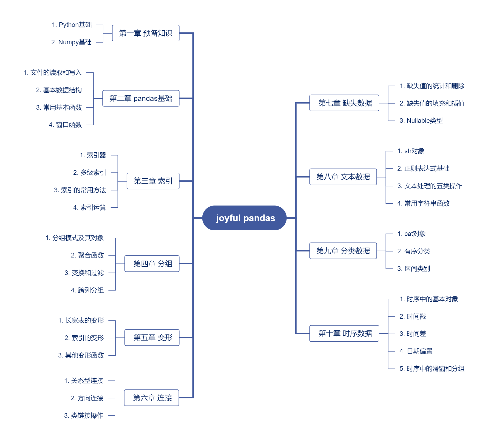

# Joyful-Pandas

> [!IMPORTANT]
> The address of this project has been changed from the original **joyfulpandas.datawhale.club** to [https://inter.joyfulpandas.datawhale.club](https://inter.joyfulpandas.datawhale.club)

> [!NOTE]
> Zhihai Platform: https://aiplusx.momodel.cn/classroom/class/658d379f891ad518e0274bc2?activeKey=intro

The paper version of the book based on the Joyful Pandas tutorial has been launched on major online platforms, welcome to purchase. This book uses the new version 1.4.0, and has made a lot of revisions to the web version of the tutorial (based on 1.2.0), including content additions and exercises updates, and also added three chapters on data visualization, feature engineering, and performance optimization. There are 121 design exercises in this book and 41 exercises at the end of each chapter. The distribution of each chapter and the table of contents are shown below. For any questions about this book and pandas, you can raise an issue in this repository, or add the QR code at the end to join the discussion group to ask questions.

Purchase link:

* [Dangdang](http://product.dangdang.com/29434656.html)

* [Jingdong](https://item.jd.com/13268767.html)

During the writing period, the author of this book actively participated in the development of pandas and community building. Click [here](https://github.com/pandas-dev/pandas/pulls?q=is%3Apr+author%3AGYHHAHA+is%3Aclosed) to view open source contributions. At the same time, Joyful Pandas was also selected by pandas as a [community recommended tutorial](https://pandas.pydata.org/docs/dev/getting_started/tutorials.html#joyful-pandas). We would like to express our gratitude to the pandas core development team for their long-term maintenance and community building over the years!

### Paper version

- Dataset: [Download](https://pan.baidu.com/s/16fgy9qYXo0JOsz3GIXQeKA) (extraction code: 9e8r)
- Reference answers: [link](https://gyhhaha.github.io/pd-book/)
- Errata revision: [link](http://inter.joyfulpandas.datawhale.club/pandas%E6%95%B0%E6%8D%AE%E5%A4%84%E7%90%86%E4%B8%8E%E5%88%86%E6%9E%90.html#id3)
- Practice and exercises

| Chapter | Practice (number of questions) | Exercises (\*New for paper version) |
| ---- | ---- | ---- |
| Chapter 1 Preliminary knowledge | 15 | 1. Using list derivation to implement matrix multiplication  2. Calculating the chi-square statistic \* 3. Count the monthly sales of a store |
| Chapter 2 Pandas Basics | 8 | \* 1. Organize the merchandise of a clothing store \* 2. Summarize the total student ratings of a course 3. Implement exponential weighted windows |
| Chapter 3 Index | 6 | \* 1. Implement the sample() function 2. Index operations for company employee data 3. Chocolate evaluation data|
| Chapter 4 Grouping | 10 | 1. Grouping analysis of automobile data \* 2. Distribution study of a marine species in three major sea areas 3. Implementing the transform() function |
| Chapter 5 Transformation | 9 | \* 1. Inventory statistics of a chain store \* 2. Organizing fossil fuel data in a certain area 3. Special wide_to_long() method |
| Chapter 6 Connection | 5 | 1. Merge employee information tables 2. Implement join() function \* 3. Conditional connection |
| Chapter 7 Missing data | 6 | \* 1. Missing data screening 2. K nearest neighbor filling \* 3. Conditional nearest neighbor interpolation |
| Chapter 8 Text data | 3 | 1. Text extraction of house data \* 2. Age statistics of Baroque composers \* 3. Summarize the results of graphics card tests |
| Chapter 9 Classification data | 2 | 1. Counting categories that do not appear 2. Category construction of diamond data \* 3. Logistic regression under ordered categories |
| Chapter 10 Time Series Data | 10 | 1. Time Series Analysis of Solar Radiation Data 2. Fruit Sales Analysis \* 3. Time Series Forecasting Using Prophet |
| Chapter 11 Data Observation |15 | \* 1. Picture drawing \* 2. Data observation practice \* 3. Anomaly detection based on PyOD library |
| Chapter 12 Feature Engineering | 12 | \* 1. Chi-square binning \* 2. Label-based feature construction \* 3. Feature engineering of credit card fraud data |
| Chapter 13 Performance Optimization | 20 | \* 1. Base sequence processing of DNA chain \* 2. Capturing the activation state interval of electrical signals \* 3. Correlation analysis of drug targets \* 4. Index detection of substance concentration \* 5. Design of sliding window class |

- Three new chapters

| | | |
| ---- | ---- | ---- |
| Chapter 11 Data Observation | 11.1 Visualization method | 11.1.1 Basic drawing |
| | | 11.1.2 Element control |
| | | 11.1.3 Subgraph control |
| | 11.2 Data Observation Methods | 11.2.1 Data Types |
| | | 11.2.2 Data Statistics |
| | | 11.2.3 Data Distribution |
| | | 11.2.4 Observation Based on Data Reports |
| | 11.3 Exercises | / |
| Chapter 12 Feature Engineering |12.1 Single feature construction | 12.1.1 Feature transformation |
| | | 12.1.2 Text data features |
| | | 12.1.3 Time series data features |
| | | 12.1.4 General method of single feature construction |
| | 12.2 Multi-feature construction | 12.2.1 Grouping technology |
| | | 12.2.2 Feature dimensionality reduction |
| | 12.3 Feature selection | 12.3.1 Selection based on statistics |
| | | 12.3.2 Selection based on models |
| | 12.4 Exercises | / |
| Chapter 13 Performance optimization | 13.1 Pandasic code essentials | / |
| | 13.2 Multi-process acceleration | 13.2.1 Multi-process and multi-threading |
| | | 13.2.2 Multi-process traps |
| | | 13.2.3 Asynchronous processes |
| | | 13.2.4 Data sharing in processes |
| | | 13.2.5 Using multiple processes in pandas |
| | 13.3 Acceleration using Cython | 13.3.1 Introduction to Cython |
| | | 13.3.2 Optimization strategies |
| | | 13.3.3 Multithreading acceleration |
| | | 13.3.4 Cython classes and their applications || | | 13.3.5 Module construction |
| | 13.4 Acceleration using Numba | 13.4.1 noPython mode |
| | | 13.4.2 ufunc and vectorization |
| | | 13.4.3 jitclass and its application |
| | 13.5 Exercises | / |

### Web version

http://inter.joyfulpandas.datawhale.club/

### File content

* data: Web version tutorial dataset

* ebook: Web version tutorial electronic version

* notebook: Web version tutorial notebook

### References

* [Python for Data Analysis](<https://www.amazon.com/Python-Data-Analysis-Wrangling-IPython/dp/1491957662/ref=sr_1_2?keywords=wes+mckinney&qid=1656348228&sprefix=wes+mc%2Caps%2C107&sr=8-2>) Wes McKinney* [Pandas Cookbook](<https://www.amazon.com/Pandas-1-x-Cookbook-scientific-exploratory/dp/1839213108/ref=sr_1_1_sspa?crid=9V843I0IED24&keywords= pandas+cookbook&qid=1656348206&sprefix=pandas+cookbook%2Caps%2C153&sr=8-1-spons&psc=1&s pLa=ZW5jcnlwdGVkUXVhbGlmaWVyPUEyVDZUTUUxQ0RFUVRZJmVuY3J5cHRlZElkPUEwNjkzMDczMjdXSFNaM0YzQ1NKRyZlbmNyeXB0ZWRBZElkPUEwNjczNDI3MVFZSTA0M0xWSzZKWiZ3aWRnZXROYW1lPXNwX2F0ZiZhY3Rpb249Y2xpY2tSZWRpcmVjdCZkb05vdExvZ0NsaWNrPXRydWU=>) By Theodore Petrou

* [User Guide](<https://pandas.pydata.org/docs/user_guide/index.html#user-guide>) Written by Pandas development team

### Communication group

Follow Datawhale public account, reply keyword "panda" to get QR code

### LICENSE

</a> This work is licensed under <a rel="license" href="http://creativecommons.org/license/by-nc-sa/4.0/">Creative Commons Attribution-Non-Commercial-Share Alike 4.0 International License</a>