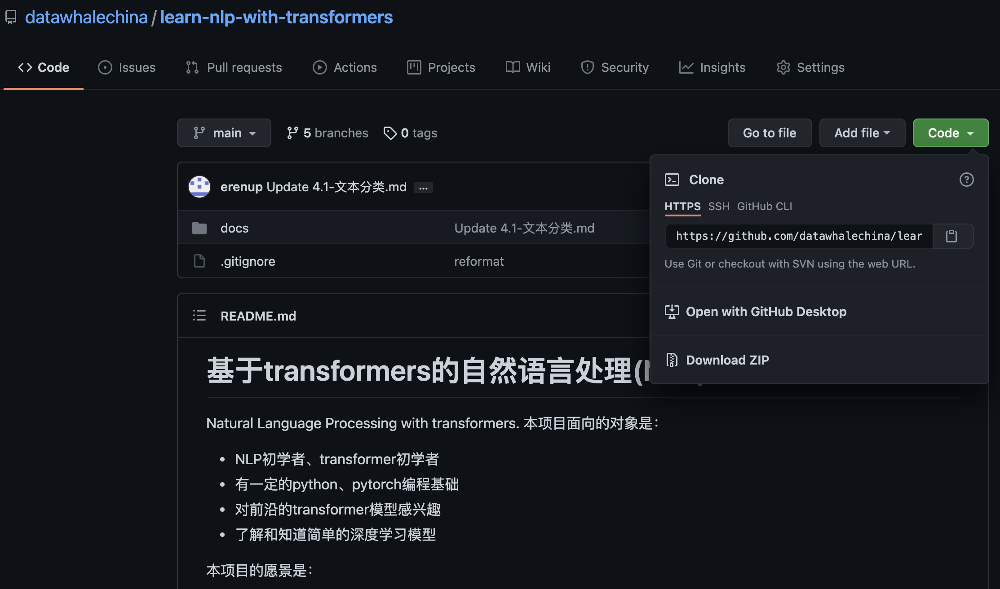
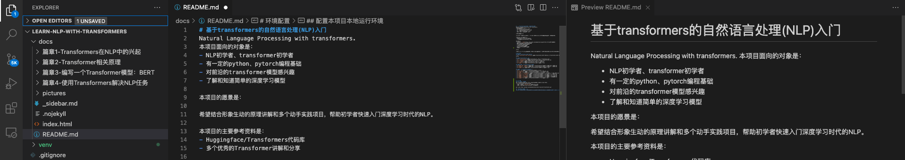
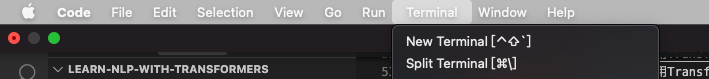
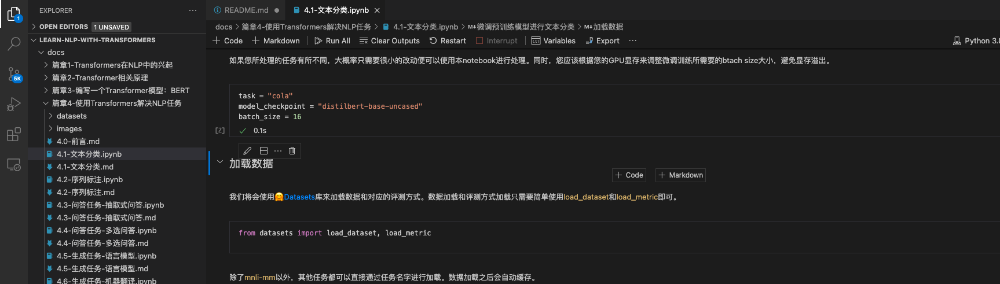
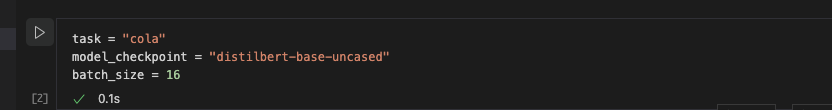
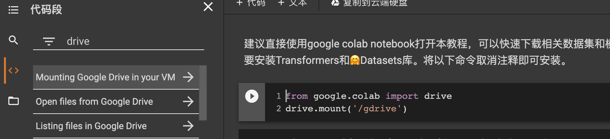

# Environment configuration
## Download all files of this project
Click the Github logo in the upper right corner of this page, enter the github page, and find the download/clone link:

- Option 1: Click `Download ZIP` directly to download all contents
- Option 2: Taking Mac as an example, clone the code base in Terminal
```
git clone https://github.com/datawhalechina/learn-nlp-with-transformers.git
```
## Configure the local running environment of this project
### Open the project folder with local vscode
It is recommended to open the project folder with vscode software. vscode can directly preview the Markdown format document, as shown in the far right of the following figure:

### Local environment configuration (taking Mac as an example)
1. Create a new Terminal in vscode to install a new Python environment and corresponding Python dependency packages:

2. In Terminal, use `vvirtualenv` software installs the python environment to the `venv` folder:
```
virtualenv -p python3 venv
```
3. Activate the python environment:
```
source activate venv/bin/activate
```
4. After activating the python environment, the Terminal will display `(venv)` on the far left. You can use the `which python` command to view the location of the python software used in the current Terminal window, and make sure that python is in the `your_path/learn-nlp-with-transformers/venv/bin/python` location. Finally, install the dependency package:
```
pip install -r requirements.txt
```
5. The files ending with `.md` in the project are in Markdown format and can be read directly by vscode. The `.ipynb` files involved in the programming process are in jupyter notebook format. vscode can directly open and run these files. Use jupyter notebook to open these files:

6. Place the mouse onOn the code box, there will be a ▶️ symbol on the left. Click it to run. When running, you will be prompted to select the python to be run. Please select the python path pointed to by `which python` in step 4.

7. If it prompts that some python packages do not exist (such as transformers), use `pip install transformers` in the Terminal terminal.

## Upload to Google Colab to open
This tutorial can also be opened in Google Colab. You can use its free cpu and gpu resources. Upload the file ending with ipynb in the code library directly to Google Drive, and then double-click to open it. If you need to download large files, you can mount Google Drive, which is free for 15G. Larger files need to be upgraded by yourself.
