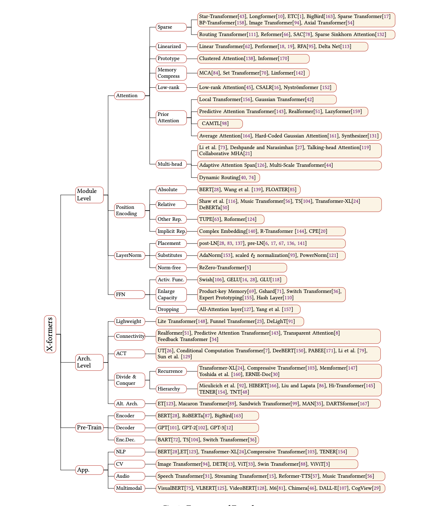
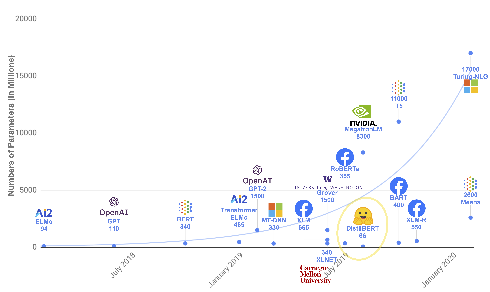

## Natural Language Processing (NLP)
Natural Language Processing (NLP) is an important artificial intelligence (AI) technology. We can see the application of NLP technology everywhere, such as web search, advertising, email, intelligent customer service, machine translation, intelligent news broadcasting, etc. In recent years, NLP technology based on deep learning (DL) has achieved good results in various tasks. These NLP task solutions based on deep learning models usually do not use traditional, task-specific feature engineering but only use an end-to-end neural network model to achieve good results. This tutorial will solve several classic tasks in NLP based on the most cutting-edge deep learning model structure (transformers). Through the study of this tutorial, we will be able to understand the relevant principles of transformers, skillfully use transformer-related deep learning models to solve practical problems in NLP, and achieve good results in various tasks.

Course recommendation for natural language and deep learning: [CS224n: Natural Language Processing with Deep Learning](http://web.stanford.edu/class/cs224n/)

Recommended books on natural language processing: [Speech and Language Processing](https://web.stanford.edu/~jurafsky/slp3/)

## Common NLP tasks
This tutorial divides NLP tasks into 4 categories: 1. Text classification, 2. Sequence labeling, 3. Question-answering tasks - extractive question-answering and multiple-choice question-answering, 4. Generative tasks - language model, machine translation and summary generation.

* Text classification: Classify single, two or more texts. For example: "This tutorial is great!" The sentiment of this text is positive, and the two texts "I am learning transformer" and "How to learn transformer" are similar.

* Sequence labeling: Classify tokens, characters or words in a text sequence. For example: "I am learning transformer at the **National Library**." The **National Library** in this text is a **place**, which can be labeled to facilitate the machine's understanding of the text.
* Question answering tasks - Extractive question answering and multiple choice question answering: 1. Extractive question answering finds the answer from a given text based on the question. The answer must be a small paragraph of the given text. Example: Question "How long does primary school take?" and a text "Primary education is generally six years.", the answer is "six years". 2. Multiple-choice questions and answers, choose a correct answer from multiple options. For example: "Which of the following model structures works best in question-answering? "and 4 options "A, MLP, B, CNN, C, LSTM, D, transformer", then the answer option is D.
* Generative tasks - language model, machine translation and summary generation: generating a word from an existing text is usually called a language model, generating a small summary text from a large text is usually called summary generation, and translating the source language such as Chinese sentences into the target language such as English is usually called machine translation.

Although various transformer-based deep learning models have performed well in multiple artificially constructed NLP tasks, due to the profoundness of human language, deep learning models still have a long way to go.

## The rise of Transformer

In 2017, the paper [Attention Is All You Need](https://arxiv.org/pdf/1706.03762.pdf) first proposed the **Transformer** model structure and achieved The State of the Art (SOTA, best) results on machine translation tasks. In 2018, [BERT: Pre-tr[[aining of Deep Bidirectional Transformers for
Language Understanding](https://arxiv.org/pdf/1810.04805.pdf)] used the Transformer model structure to pre-train a large-scale language model, and then fine-tuned it in multiple NLP downstream tasks, which set a new record for the highest score in the list of major NLP tasks. From 2019 to 2021, researchers combined the Transformer model structure with the pre-training + fine-tuning training method, and proposed a series of improvements to the Transformer model structure and training methods (such as transformer-xl, XLnet, Roberta, etc.). As shown in the figure below, improvements to various Transformers continue to emerge.

Figure: Various Transformer improvements, source: [A Survey of Transformers](https://arxiv.org/pdf/2106.04554.pdf)

In addition, due to TrThe excellent model structure of ansformer makes its parameters very large to accommodate more information. Therefore, the ability of the Transformer model continues to improve with pre-training. With the improvement of computing power in recent years, more and more pre-trained models and better Transformers continue to emerge. Simple statistics can be seen from the following figure: 

 Figure: Pre-trained model parameters continue to increase, source [Huggingface](https://huggingface.co/course/chapter1/4?fw=pt)

Although there are many studies on various types of Transformers, in general, classic and popular Transformer models can be obtained and used for free through [HuggingFace/Transformers, 48.9k Star](https://github.com/huggingface/transformers), which provides great help for beginners and researchers.

This tutorial will also be based on [HuggingFace/Transformers, 48.9k Star](https://github.com/huggingface/transformersformers) to carry out specific programming and task solution implementation.

Pre-training + fine-tuning training method in NLP Recommended reading:
[How to scientifically "fine-tune" pre-training models in 2021?
](https://zhuanlan.zhihu.com/p/363802308) and [From Word Embedding to Bert Model - History of Pre-training Technology Development in Natural Language Processing](https://zhuanlan.zhihu.com/p/49271699)