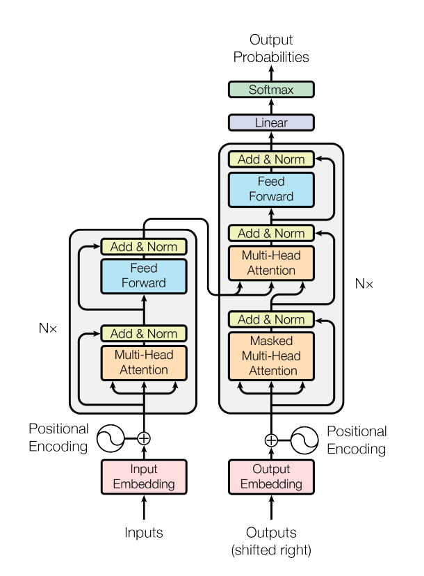

# Transformer source code explanation in PyTorch
After reading [2.2-Illustrated transformer](./Chapter 2-Transformer related principles/2.2-Illustrated transformer.md), I hope you can have a vivid understanding of the design and calculation of each module of transformer. In this section, we will implement a transformer based on pytorch to help you further learn this complex model. Unlike 2.2.1, this article implements the transformer in the order of input-model-output. For your reference.
**Chapter**

- [Word Embedding](#embed)
- [Position Encoding](#pos)
- [Multi-Head Attention](#multihead)
- [Build Transformer](#build)



Figure: Transformer Structure

## **<div id='embed'>Word Embedding</div>**

As shown in the figure above, the left side of the Transformer diagram is the Encoder, and the right side is the Decoder. The Encoder inputs the source language sequence, and the Decoder inputs the language text to be translated (During training). A text often consists of many sequences. The common operation is to perform some preprocessing (such as word segmentation) on the sequence to turn it into a list. The elements of a list of sequences are usually the smallest words that cannot be segmented in the vocabulary. The entire text is a large list, and the elements are lists composed of sequences one by one. For example, after segmentation, a sequence becomes ["am", "##ro", "##zi", "meets", "his", "father"]. Next, they are converted according to their corresponding indexes in the vocabulary. Assume that the result is [23, 94, 13, 41, 27, 96]. If the entire text has a total of 100 sentences, then there are 100 lists as its elements. Because the length of each sequence is different, the maximum length needs to be set. Here, it may be set to 128. Then, after converting the entire text into an array, the shape is 100 x 128, which corresponds to batch_size and seq_length.

After the input, the word embedding process is performed immediately. Word embedding is to map each word with a pre-trained vector.

Word embedding is implemented in torch based on `torch.nn.Embedding`. The parameters that need to be set when instantiating are the size of the vocabulary and the dimension of the vector being mapped, such as `embed = nn.Embedding(10,8)`. The dimension of a vector is simply the number of numbers in the vector. Note that the first parameter is the size of the vocabulary.Small, if you currently have a maximum of 8 words, usually fill in 10 (one more position for unk and pad), if you enter a word different from these 8 words later, it will be mapped to unk, and the sequence padding part will be mapped to pad.

If we plan to map to 8 dimensions (num_features or embed_dim), then the shape of the entire text becomes 100 x 128 x 8. Next, let's take a small example to explain: Suppose our vocabulary has a total of 10 words (including unk and pad), there are 2 sentences in the text, each sentence has 4 words, and we want to map each word to an 8-dimensional vector. So 2, 4, and 8 correspond to batch_size, seq_length, and embed_dim (if the batch is in the first dimension).

In addition, general deep learning tasks only change num_features, so the dimension is generally for the dimension where the last feature is located.

Start programming:

Import all required packages:

```python
import torch
import torch.nn as nn
from torch.nn.parameter import Parameter
from torch.nn.init import xavier_uniform_
from torch.nn.init import constant_
from torch.nn.init import xavier_normal_
import torch.nn.functional as F
from typing import Optional, Tuple, Any
from typing import List, Optional, Tuple
import math
import warnings
```

```python
X = torch.zeros((2,4),dtype=torch.long)
embed = nn.Embedding(10,8)
print(embed(X).shape)
```

torch.Size([2, 4, 8])

## **<div id='pos'>Position encoding</div>**

Word embedding is followed by position encoding, which is used to distinguish between different words and the relationship between different features of the same word. Note in the code: X_ is just an initialized matrix, not an input; a dropout is added after completing the position encoding. In addition, the position encoding is added last, so the input and output shapes remain unchanged.

```python
Tensor = torch.Tensor
def positional_encoding(X, num_features, dropout_p=0.1, max_len=512) -> Tensor:
r'''
Add positional encoding to input
Parameters:
- num_features: the dimension of the input
- dropout_p: the probability of dropout, when it is non-zero, perform dropout
- max_len: the maximum length of the sentence, default is 512

Shape:
- Input: [batch_size, seq_length, num_features]
- Output: [batch_size, seq_length, num_features]

Example:
>>> X = torch.randn((2,4,10))
>>> X = positional_encoding(X, 10)
>>> print(X.shape)
>>> torch.Size([2, 4, 10])
'''

dropout = nn.Dropout(dropout_p)
P = torch.zeros((1,max_len,num_features))
X_ = torch.arange(max_len,dtype=torch.float32).reshape(-1,1) / torch.pow(
10000,
torch.arange(0,num_features,2,dtype=torch.float32) /num_features)
P[:,:,0::2] = torch.sin(X_)
P[:,:,1::2] = torch.cos(X_)
X = X + P[:,:X.shape[1],:].to(X.device)
return dropout(X)
```

```python
# Positional encoding example
X = torch.randn((2,4,10))
X = positional_encoding(X, 10)
print(X.shape)
```

torch.Size([2, 4, 10])

## **<div id='multihead'>Multi-head Attention</div>**

### Take a look at the multi-head attention mechanism
**The class of the complete version of the multi-head attention mechanism is in the back. Let's take a look at the complete: Multi-head Attention Mechanism-MultiheadAttention section and then come back to read the following explanations one by one. **

The main components of the multi-head attention class are: parameter initialization, multi_head_attention_forward

#### Initialization parameters
```python
if self._qkv_same_embed_dim is False:
# The shape remains unchanged before and after initialization
# (seq_length x embed_dim) x (embed_dim x embed_dim) ==> (seq_length x embed_dim)
self.q_proj_weight = Parameter(torch.empty((embed_dim, embed_dim)))
self.k_proj_weight = Parameter(torch.emptyy((embed_dim, self.kdim)))
self.v_proj_weight = Parameter(torch.empty((embed_dim, self.vdim)))
self.register_parameter('in_proj_weight', None)
else:
self.in_proj_weight = Parameter(torch.empty((3 * embed_dim, embed_dim)))
self.register_parameter('q_proj_weight', None)
self.register_parameter('k_proj_weight', None)
self.register_parameter('v_proj_weight', None)

if bias:
self.in_proj_bias = Parameter(torch.empty(3 * embed_dim))
else:
self.register_parameter('in_proj_bias', None)
# All heads' attention will be concatenated together and then multiplied by the weight matrix output
# out_proj is for later preparation
self.out_proj = nn.Linear(embed_dim, embed_dim, bias=bias)
self._reset_parameters()
```

torch.empty forms the corresponding tensor according to the given shape, and the characteristic is that the filled value has not been initialized, similar to torch.randn (standard normal distribution), which is a way of initialization. In PyTorch, if the variable type is tensor, the value cannot be modified, and the Parameter() function can be regarded as a type conversion function, which converts the unchangeable tensor into a trainable and modifiable model parameter, that is, it is bound to model.parameters. register_parameter means whether to put this parameter in model.parameters, and None means that there is no such parameter.

There is an if judgment here to determine whether the last dimension of q, k, and v is consistent. If they are consistent, a large weight matrix is ​​multiplied and then divided. If not, each is initialized separately. In fact, initialization will not change the original shape (such as, see comments).

You can find that there is a _reset_parameters() function at the end, which is used to initialize the parameter values. xavier_uniform means randomly sampling values ​​from [continuous uniform distribution](https://zh.wikipedia.org/wiki/%E9%80%A3%E7%BA%8C%E5%9E%8B%E5%9D%87%E5%8B%BB%E5%88%86%E5%B8%83) as the initialization value, and the distribution of xavier_normal_ sampling is normal distribution. Because the initialization value is very important when training neural networks, these two functions are needed.

constant_ means to fill the input vector with the given value.

In addition, in the source code of PyTorch, it seems that projection represents a linear transformation, and in_proj_bias means the bias of the initial linear transformation

```python
def _reset_parameters(self):
if self._qkv_same_embed_dim:
xavier_uniform_(self.in_proj_weight)
else:
xavier_uniform_(self.q_proj_weight)
xavier_uniform_(self.k_proj_weight)
xavier_uniform_(self.v_proj_weight)
if self.in_proj_bias is not None:
constant_(self.in_proj_bias, 0.)
constant_(self.out_proj.bias, 0.)

```

#### multi_head_attention_forward
This function is shown in the following code, which is mainly divided into 3 parts:
- query, key, value are transformed into q, k, v through _in_projection_packed
- occlusion mechanism
- dot product attention

```python
import torch
Tensor = torch.Tensor
def multi_head_attention_forward(
query: Tensor,key: Tensor,
value: Tensor,
num_heads: int,
in_proj_weight: Tensor,
in_proj_bias: Optional[Tensor],
dropout_p: float,
out_proj_weight: Tensor,
out_proj_bias: Optional[Tensor],
training: bool = True,
key_padding_mask: Optional[Tensor] = None,
need_weights: bool = True,
attn_mask: Optional[Tensor] = None,
use_seperate_proj_weight = None,
q_proj_weight: Optional[Tensor] = None,
k_proj_weight: Optional[Tensor] = None,
v_proj_weight: Optional[Tensor] = None,
) -> Tuple[Tensor, Optional[Tensor]]:
r'''
Shape:
Input:
- query: `(L, N, E)`
- key: `(S, N, E)`
- value: `(S, N, E)`
- key_padding_mask: `(N, S)`
- attn_mask: `(L, S)` or `(N * num_heads, L, S)`
Output:
- attn_output:`(L, N, E)`
- attn_output_weights:`(N, L, S)`
'''
tgt_len, bsz, embed_dim = query.shape
src_len, _, _ = key.shape
head_dim = embed_dim // num_heads
q, k, v = _in_projection_packed(query, key, value, in_proj_weight, in_proj_bias)

if attn_mask is not None:
if attn_mask.dtype == torch.uint8:
warnings.warn("Byte tensor for attn_mask in nn.MultiheadAttention is deprecated. Use bool tensor instead.")
attn_mask = attn_mask.to(torch.bool)
else:
assert attn_mask.is_floating_point() or attn_mask.dtype == torch.bool, \
f"Only float, byte, and bool types are supported for attn_mask, not {attn_mask.dtype}"if attn_mask.dim() == 2:
correct_2d_size = (tgt_len, src_len)
if attn_mask.shape != correct_2d_size:
raise RuntimeError(f"The shape of the 2D attn_mask is {attn_mask.shape}, but should be {correct_2d_size}.")
attn_mask = attn_mask.unsqueeze(0)
elif attn_mask.dim() == 3:
correct_3d_size = (bsz * num_heads, tgt_len, src_len)
if attn_mask.shape != correct_3d_size:
raise RuntimeError(f"The shape of the 2D attn_mask is {attn_mask.shape}, but should be {correct_2d_size}.")pe of the 3D attn_mask is {attn_mask.shape}, but should be {correct_3d_size}.")
else:
raise RuntimeError(f"attn_mask's dimension {attn_mask.dim()} is not supported")

if key_padding_mask is not None and key_padding_mask.dtype == torch.uint8:
warnings.warn("Byte tensor for key_padding_mask in nn.MultiheadAttention is deprecated. Use bool tensor instead.")
key_padding_mask = key_padding_mask.to(torch.bool)

# reshape q,k,v to put Batch in the first dimension to fit dot product attention
# at the same timeFor multi-head mechanism, different heads are put together to form a layer
q = q.contiguous().view(tgt_len, bsz * num_heads, head_dim).transpose(0, 1)
k = k.contiguous().view(-1, bsz * num_heads, head_dim).transpose(0, 1)
v = v.contiguous().view(-1, bsz * num_heads, head_dim).transpose(0, 1)
if key_padding_mask is not None:
assert key_padding_mask.shape == (bsz, src_len), \
f"expecting key_padding_mask shape of {(bsz, src_len)}, but got {key_padding_mask.shape}"
key_padding_mask = key_padding_mask.view(bsz, 1, 1, src_len). \
expand(-1, num_heads, -1, -1).reshape(bsz * num_heads, 1, src_len)
if attn_mask is None:
attn_mask = key_padding_mask
elif attn_mask.dtype == torch.bool:
attn_mask = attn_mask.logical_or(key_padding_mask)
else:
attn_mask = attn_mask.masked_fill(key_padding_mask, float("-inf"))
# If attn_mask value is a boolean value, convert mask to float
if attn_mask is not None and attn_mask.dtype == torch.bool:
new_attn_mask = torch.zeros_like(attn_mask, dtype=torch.float)
new_attn_mask.masked_fill_(attn_mask, float("-inf"))
attn_mask = new_attn_mask

# Apply dropout only if training is True
if not training:
dropout_p = 0.0
attn_output, attn_output_weights = _scaled_dot_product_attention(q, k, v, attn_mask, dropout_p)
attn_output = attn_output.transpose(0, 1).contiguous().view(tgt_len, bsz, embed_dim)
attn_output = nn.functional.linear(attn_output, out_proj_weight, out_proj_bias)
if need_weights:
# average attention weights over heads
attn_output_weights = attn_output_weights.view(bsz, num_heads, tgt_len, src_len)
return attn_output, attn_output_weights.sum(dim=1) / num_heads
else:
return attn_output, None
```

##### query, key, value are transformed by _in_projection_packed to get q, k, v
```
q, k, v = _in_projection_packed(query, key, value, in_proj_weight, in_proj_bias)
```

For the `nn.functional.linear` function, it is actually a linear transformation. Unlike `nn.Linear`, the former can provide weight matrix and bias, and execute, and the latter can freely determine the output dimension.

```python
def _in_projection_packed(
q: Tensor,
k: Tensor,
v: Tensor,
w: Tensor,
b: Optional[Tensor] = None,
) -> List[Tensor]:
r"""
Linear transformation with a large weight parameter matrix

Parameters:
q, k, v: For self-attention, all three are src; for seq2seq models, k and v are the same tensor.
But their last dimension (num_features or embed_dim) must be consistent.
w: A large matrix for linear transformation, compressed into a tensor in the order of q, k, v.
b: A bias for linear transformation, compressed into a tensor in the order of q, k, v.

Shape:
Input:
- q: shape:`(..., E)`, E is the dimension of word embedding (E appears below for this purpose).
- k: shape:`(..., E)`
- v: shape:`(..., E)`
- w: shape:`(E * 3, E)`
- b: shape:`E * 3`

Output:
- Output list:`[q', k', v']`, q, k, v have the same shape before and after linear transformation.
"""
E = q.size(-1)
# If it is self-attention, then q = k = v = src, so their reference variables are all src
# That is, k is v and q is k are both True
# If it is seq2seq, k = v, so k is v is True
if k is v:
if q is k:
return F.linear(q, w, b).chunk(3, dim=-1)
else:
# seq2seq model
w_q, w_kv = w.split([E, E * 2])
if b is None:
b_q = b_kv = None
else:
b_q, b_kv = b.split([E, E * 2])
return (F.linear(q, w_q, b_q),) + F.linear(k, w_kv, b_kv).chunk(2, dim=-1)
else:
w_q, w_k, w_v = w.chunk(3)
if b is None:
b_q = b_k = b_v = None
else:
b_q, b_k, b_v = b.chunk(3)
return F.linear(q, w_q, b_q), F.linear(k, w_k, b_k), F.linear(v, w_v, b_v)

# q, k, v = _in_projection_packed(query, key, value, in_proj_weight, in_proj_bias)
```

***

##### Masking mechanism

For attn_mask, if it is 2D, the shape is like `(L, S)`, L and S represent the target language and source language sequence lengths respectively; if it is 3D, the shape is like `(N * num_heads, L, S)`, N represents batch_size, and num_heads represents the number of attention heads. If the dtype of attn_mask is ByteTensor, non-zero positions will be ignored and no attention will be paid; if it is BoolTensor, the position corresponding to True will be ignored; if it is a numerical value, it will be directly added to attn_weights.

Because when the decoder is decoding, it can only see the position and the one before it. If it sees the back, it will be a violation, so attn_mask needs to be blocked.

The following function directly copies PyTorch's, which means ensuring the correct mask shape of different dimensions and different types of conversions

```python
if attn_mask is not None:
if attn_mask.dtype == torch.uint8:
warnings.warn("Byte tensor for attn_mask in nn.MultiheadAttention is deprecated. Use bool tensor instead.")
attn_mask = attn_mask.to(torch.bool)
else:
assert attn_mask.is_floating_point() or attn_mask.dtype == torch.bool, \
f"Only float, byte, and bool types are supported for attn_mask, not {attn_mask.dtype}"
# Shape determination for different dimensions
if attn_mask.dim() == 2:
correct_2d_size = (tgt_len, src_len)
if attn_mask.shape != correct_2d_size:
raise RuntimeError(f"The shapeof the 2D attn_mask is {attn_mask.shape}, but should be {correct_2d_size}.")
attn_mask = attn_mask.unsqueeze(0)
elif attn_mask.dim() == 3:
correct_3d_size = (bsz * num_heads, tgt_len, src_len)
if attn_mask.shape != correct_3d_size:
raise RuntimeError(f"The shape of the 3D attn_mask is {attn_mask.shape}, but should be {correct_3d_size}.")
else:
raise RuntimeError(f"attn_mask's dimension {attn_mask.dim()} is not supported")

```
With `attn_mask`The difference is that `key_padding_mask` is used to mask the value in the key, which should be `<PAD>` in detail. The situation of being ignored is the same as attn_mask.

```python
# Change the key_padding_mask value to a Boolean value
if key_padding_mask is not None and key_padding_mask.dtype == torch.uint8:
warnings.warn("Byte tensor for key_padding_mask in nn.MultiheadAttention is deprecated. Use bool tensor instead.")
key_padding_mask = key_padding_mask.to(torch.bool)
```

First introduce two small functions, `logical_or`, input two tensors, and perform `logical or` operation on the values ​​in the two tensors. It is `False` only when both values ​​are 0, and `True` otherwise. The other is `masked_fill`, which inputs a mask and the value to be filled. Mask consists of 1 and 0, the value of position 0 remains unchanged, and the position of 1 is filled with the new value.
```python
a = torch.tensor([0,1,10,0],dtype=torch.int8)
b = torch.tensor([4,0,1,0],dtype=torch.int8)
print(torch.logical_or(a,b))
# tensor([ True, True, True, False])
```

```python
r = torch.tensor([[0,0,0,0],[0,0,0,0]])
mask = torch.tensor([[1,1,1,1],[0,0,0,0]])
print(r.masked_fill(mask,1))
# tensor([[1, 1, 1, 1],
# [0, 0, 0, 0]])
```
In fact, attn_mask and key_padding_mask are sometimes the same object, so sometimes you can look at them together. `-inf` will be 0 after softmax, i.e. ignored.
```python
if key_padding_mask is not None:
assert key_padding_mask.shape == (bsz, src_len), \
f"expecting key_padding_mask shape of {(bsz, src_len)}, but got {key_padding_mask.shape}"
key_padding_mask = key_padding_mask.view(bsz, 1, 1, src_len). \
expand(-1, num_heads, -1, -1).reshape(bsz * num_heads, 1, src_len)
# If attn_mask is empty, use key_padding_mask directly
if attn_mask is None:
attn_mask = key_padding_mask
elif attn_mask.dtype == torch.bool:
attn_mask = attn_mask.logical_or(key_padding_mask)
else:attn_mask = attn_mask.masked_fill(key_padding_mask, float("-inf"))

# If attn_mask value is a boolean value, convert mask to float
if attn_mask is not None and attn_mask.dtype == torch.bool:
new_attn_mask = torch.zeros_like(attn_mask, dtype=torch.float)
new_attn_mask.masked_fill_(attn_mask, float("-inf"))
attn_mask = new_attn_mask

```

***
##### Dot Product Attention

```python
from typing import Optional, Tuple, Any
def _scaled_dot_product_attention(
q: Tensor,
k: Tensor,
v: Tensor,
attn_mask: Optional[Tensor] = None,
dropout_p: float = 0.0,
) -> Tuple[Tensor, Tensor]:
r'''
Compute dot product attention on query, key, value, use attention mask if any, and apply a dropout with probability dropout_p

Parameters:
- q: shape:`(B, Nt, E)` B represents batch size, Nt is the target language sequence length, E is the feature dimension after embedding
- key: shape:`(B, Ns, E)` Ns is the source language sequence length
- value: shape:`(B, Ns, E)` is the same shape as key
- attn_mask: either a 3D tensor with shape:`(B, Nt, Ns)` or a 2D tensor with shape like:`(Nt, Ns)`

- Output: attention values: shape:`(B, Nt, E)`, same shape as q; attention weights: shape:`(B, Nt, Ns)`Example: 
>>> q = torch.randn((2,3,6))
>>> k = torch.randn((2,4,6))
>>> v = torch.randn((2,4,6))
>>> out = scaled_dot_product_attention(q, k, v)
>>> out[0].shape, out[1].shape
>>> torch.Size([2, 3, 6]) torch.Size([2, 3, 4])
'''
B, Nt, E = q.shape
q = q / math.sqrt(E)
# (B, Nt, E) x (B, E, Ns) -> (B, Nt, Ns)
attn = torch.bmm(q, k.transpose(-2,-1))
if attn_mask is not None:
attn += attn_mask 
# attn means that each word in the target sequence isAttention for language sequence
attn = F.softmax(attn, dim=-1)
if dropout_p:
attn = F.dropout(attn, p=dropout_p)
# (B, Nt, Ns) x (B, Ns, E) -> (B, Nt, E)
output = torch.bmm(attn, v)
return output, attn 

```

### Complete multi-head attention mechanism-MultiheadAttention

```python
class MultiheadAttention(nn.Module):
r'''
Parameters:
embed_dim: word embedding dimension
num_heads: number of parallel heads
batch_first: if `True`, it is (batch, seq, feature), if it is `False`, it is (seq, batch, feature)

Example:
>>> multihead_attn = MultiheadAttention(embed_dim, num_heads)
>>> attn_output, attn_output_weights = multihead_attn(query, key, value)
'''
def __init__(self, embed_dim, num_heads, dropout=0., bias=True,
kdim=None, vdim=None, batch_first=False) -> None:
# factory_kwargs = {'device': device, 'dtype': dtype}
super(MultiheadAttention, self).__init__()
self.embed_dim = embed_dim
self.kdim = kdim if kdim is not None else embed_dim
self.vdim = vdim if vdimis not None else embed_dim
self._qkv_same_embed_dim = self.kdim == embed_dim and self.vdim == embed_dim

self.num_heads = num_heads
self.dropout = dropout
self.batch_first = batch_first
self.head_dim = embed_dim // num_heads
assert self.head_dim * num_heads == self.embed_dim, "embed_dim must be divisible by num_heads"

if self._qkv_same_embed_dim is False:
self.q_proj_weight = Parameter(torch.empty((embed_dim, embed_dim)))self.k_proj_weight = Parameter(torch.empty((embed_dim, self.kdim)))
self.v_proj_weight = Parameter(torch.empty((embed_dim, self.vdim)))
self.register_parameter('in_proj_weight', None)
else:
self.in_proj_weight = Parameter(torch.empty((3 * embed_dim, embed_dim)))
self.register_parameter('q_proj_weight', None)
self.register_parameter('k_proj_weight', None)
self.register_parameter('v_proj_weight', None)if bias:
self.in_proj_bias = Parameter(torch.empty(3 * embed_dim))
else:
self.register_parameter('in_proj_bias', None)
self.out_proj = nn.Linear(embed_dim, embed_dim, bias=bias)

self._reset_parameters()

def _reset_parameters(self):
if self._qkv_same_embed_dim:
xavier_uniform_(self.in_proj_weight)
else:
xavier_uniform_(self.q_proj_weight)
xavier_uniform_(self.k_proj_weight)
xavier_uniform_(self.v_proj_weight)

if self.in_proj_bias is not None:
constant_(self.in_proj_bias, 0.)
constant_(self.out_proj.bias, 0.)

def forward(self, query: Tensor, key: Tensor, value: Tensor, key_padding_mask: Optional[Tensor] = None,
need_weights: bool = True, attn_mask: Optional[Tensor] = None) -> Tuple[Tensor, Optional[Tensor]]:
if self.batch_first:
query, key, value = [x.transpose(1, 0) for x in (query, key, value)]if not self._qkv_same_embed_dim:
attn_output, attn_output_weights = multi_head_attention_forward(
query, key, value, self.num_heads,
self.in_proj_weight, self.in_proj_bias,
self.dropout, self.out_proj.weight, self.out_proj.bias,
training=self.training,
key_padding_mask=key_padding_mask, need_weights=need_weights,
attn_mask=attn_mask, use_separate_proj_weight=True,q_proj_weight=self.q_proj_weight, k_proj_weight=self.k_proj_weight,
v_proj_weight=self.v_proj_weight)
else:
attn_output, attn_output_weights = multi_head_attention_forward(
query, key, value, self.num_heads,
self.in_proj_weight, self.in_proj_bias,
self.dropout, self.out_proj.weight, self.out_proj.bias,
training=self.training,
key_padding_mask=key_padding_mask, need_weights=need_weights,
attn_mask=attn_mask)
if self.batch_first:
return attn_output.transpose(1, 0), attn_output_weights
else:
return attn_output, attn_output_weights
```

Next, you can practice and add the position encoding. You can find that the shape before and after adding position encoding and multi-head attention will not change.

```python
# Because batch_first is False, the shape of src is: `(seq, batch, embed_dim)`
src = torch.randn((2,4,100))
src = positional_encoding(src,100,0.1)
print(src.shape)
multihead_attn = MultiheadAttention(100, 4, 0.1)
attn_output, attn_output_weights = multihead_attn(src,src,src)
print(attn_output.shape, attn_output_weights.shape)

# torch.Size([2, 4, 100])
# torch.Size([2, 4, 100]) torch.Size([4, 2, 2])
```

torch.Size([2, 4, 100])
torch.Size([2, 4, 100]) torch.Size([4, 2, 2])

***
## **<div id='build'>Build Transformer</div>**
- Encoder Layer


```python
class TransformerEncoderLayer(nn.Module):
r'''
Parameters:
d_model: Dimension of word embedding (required)
nhead: number of parallel heads in multi-head attention (required)
dim_feedforward: fully connectedThe number of neurons in the layer, also known as the dimension of the input through this layer (Default = 2048)
dropout: the probability of dropout (Default = 0.1)
activation: the activation function between two linear layers, default relu or gelu
lay_norm_eps: a small amount in layer normalization to prevent the denominator from being 0 (Default = 1e-5)
batch_first: if `True`, it is (batch, seq, feature), if it is `False`, it is (seq, batch, feature) (Default: False)

Example:
>>> encoder_layer = TransformerEncoderLayer(d_model=512, nhead=8)
>>> src = torch.randn((32, 10, 512))
>>> out = encoder_layer(src)
'''

def __init__(self, d_model, nhead, dim_feedforward=2048, dropout=0.1, activation=F.relu,
layer_norm_eps=1e-5, batch_first=False) -> None:
super(TransformerEncoderLayer, self).__init__()
self.self_attn = MultiheadAttention(d_model, nhead, dropout=dropout, batch_first=batch_first)
self.linear1 = nn.Linear(d_model, dim_feedforward)
self.dropout = nn.Dropout(dropout)
self.linear2 = nn.Linear(dim_feedforward, d_model)

self.norm1 = nn.LayerNorm(d_model, eps=layer_norm_eps)
self.norm2 = nn.LayerNorm(d_model, eps=layer_norm_eps)
self.dropout1 = nn.Dropout(dropout)
self.dropout2 = nn.Dropout(dropout)
self.activation = activation

def forward(self, src: Tensor, src_mask: Optional[Tensor] = None, src_key_padding_mask: Optional[Tensor] = None) -> Tensor:
src = positional_encoding(src, src.shape[-1])
src2 = self.self_attn(src, src, src, attn_mask=src_mask, 
key_padding_mask=src_key_padding_mask)[0]
src = src + self.dropout1(src2)
src = self.norm1(src)
src2 = self.linear2(self.dropout(self.activation(self.linear1(src))))
src = src + self.dropout(src2)
src = self.norm2(src)
return src

```

```python
# Take a look at a small example
encoder_layer = TransformerEncoderLayer(d_model=512, nhead=8)
src = torch.randn((32, 10, 512))
out = encoder_layer(src)
print(out.shape)
# torch.Size([32, 10, 512])
```

torch.Size([32, 10, 512])

### Transformer layer composed of Encoder

```python
class TransformerEncoder(nn.Module):
r'''
Parameters:
encoder_layer (required)
num_layers: number of encoder_layer layers (required)
norm: normalization choice (optional)

Example:
>>> encoder_layer = TransformerEncoderLayer(d_model=512, nhead=8)
>>> transformer_encoder = TransformerEncoder(encoder_layer, num_layers=6)
>>> src = torch.randn((10, 32, 512))
>>> out = transformer_encoder(src)
'''

def __init__(self, encoder_layer, num_layers, norm=None):
super(TransformerEncoder, self).__init__()
self.layer = encoder_layer
self.num_layers = num_layers
self.norm = norm

def forward(self, src: Tensor, mask: Optional[Tensor] = None, src_key_padding_mask: Optional[Tensor] = None) -> Tensor:
output = positional_encoding(src, src.shape[-1])
for _ in range(self.num_layers):
output = self.layer(output, src_mask=mask, src_key_padding_mask=src_key_padding_mask)

if self.norm is notNone:
output = self.norm(output)

return output
```

```python
# Example
encoder_layer = TransformerEncoderLayer(d_model=512, nhead=8)
transformer_encoder = TransformerEncoder(encoder_layer, num_layers=6)
src = torch.randn((10, 32, 512))
out = transformer_encoder(src)
print(out.shape)
# torch.Size([10, 32, 512])
```

torch.Size([10, 32, 512])

***
## Decoder Layer:

```python
class TransformerDecoderLayer(nn.Module):
r'''
Parameters:
d_model: word embedding dimension (required)nhead: the number of parallel heads in multi-head attention (required)
dim_feedforward: the number of neurons in the fully connected layer, also known as the dimension of the input through this layer (Default = 2048)
dropout: the probability of dropout (Default = 0.1)
activation: the activation function between two linear layers, default relu or gelu
lay_norm_eps: a small amount in layer normalization to prevent the denominator from being 0 (Default = 1e-5)
batch_first: if `True`, it is (batch, seq, feature), if `False`, it is (seq, batch, feature) (Default: False)

Example:
>>> decoder_layer = TransformerDecoderLayer(d_model=512, nhead=8)
>>> memory = torch.randn((10, 32, 512))
>>>tgt = torch.randn((20, 32, 512))
>>> out = decoder_layer(tgt, memory)
'''
def __init__(self, d_model, nhead, dim_feedforward=2048, dropout=0.1, activation=F.relu,
layer_norm_eps=1e-5, batch_first=False) -> None:
super(TransformerDecoderLayer, self).__init__()
self.self_attn = MultiheadAttention(d_model, nhead, dropout=dropout, batch_first=batch_first)
self.multihead_attn = MultiheadAttention(d_model, nhead, dropout=dropout, batch_first=batch_first)

self.linear1 = nn.Linear(d_model, dim_feedforward)
self.dropout = nn.Dropout(dropout)
self.linear2 = nn.Linear(dim_feedforward, d_model)

self.norm1 = nn.LayerNorm(d_model, eps=layer_norm_eps)
self.norm2 = nn.LayerNorm(d_model, eps=layer_norm_eps)
self.norm3 = nn.LayerNorm(d_model, eps=layer_norm_eps)
self.dropout1 = nn.Dropout(dropout)
self.dropout2 = nn.Dropout(dropout)
self.dropout3 = nn.Dropout(dropout)self.activation = activation

def forward(self, tgt: Tensor, memory: Tensor, tgt_mask: Optional[Tensor] = None, 
memory_mask: Optional[Tensor] = None, tgt_key_padding_mask: Optional[Tensor] = None, memory_key_padding_mask: Optional[Tensor] = None) -> Tensor:
r'''
Parameters:
tgt: target language sequence (required)
memory: sentence from the last encoder_layer (required)
tgt_mask: mask of target language sequence (optional)
memory_mask (optional)
tgt_key_padding_mask (optional)
memory_key_padding_mask (optional)
'''
tgt2 = self.self_attn(tgt, tgt, tgt, attn_mask=tgt_mask,
key_padding_mask=tgt_key_padding_mask)[0]
tgt = tgt + self.dropout1(tgt2)
tgt = self.norm1(tgt)
tgt2 = self.multihead_attn(tgt, memory, memory, attn_mask=memory_mask,
key_padding_mask=memory_key_padding_mask)[0]
tgt = tgt + self.dropout2(tgt2)
tgt = self.norm2(tgt)
tgt2 = self.linear2(self.dropout(self.activation(self.linear1(tgt))))
tgt = tgt + self.dropout3(tgt2)
tgt = self.norm3(tgt)
return tgt
```

```python
# Cute little example
decoder_layer = nn.TransformerDecoderLayer(d_model=512, nhead=8)
memory = torch.randn((10, 32, 512))
tgt = torch.randn((20, 32, 512))
out = decoder_layer(tgt, memory)
print(out.shape)
# torch.Size([20, 32, 512])
```

torch.Size([20, 32, 512])

```python
## Decoder
```

```python
class TransformerDecoder(nn.Module):
r'''Parameters:
decoder_layer (required)
num_layers: number of layers of decoder_layer (required)
norm: normalization selection

Example:
>>> decoder_layer = TransformerDecoderLayer(d_model=512, nhead=8)
>>> transformer_decoder = TransformerDecoder(decoder_layer, num_layers=6)
>>> memory = torch.rand(10, 32, 512)
>>> tgt = torch.rand(20, 32, 512)
>>> out = transformer_decoder(tgt, memory)
'''
def __init__(self, decoder_layer, num_layers, norm=None):
super(TransformerDecoder, self).__init__()
self.layer = decoder_layer
self.num_layers = num_layers
self.norm = norm

def forward(self, tgt: Tensor, memory: Tensor, tgt_mask: Optional[Tensor] = None,
memory_mask: Optional[Tensor] = None, tgt_key_padding_mask: Optional[Tensor] = None,
memory_key_padding_mask: Optional[Tensor] = None) -> Tensor:
output = tgt
for _ in range(self.num_layers):
output = self.layer(output, memory, tgt_mask=tgt_mask,
memory_mask=memory_mask,
tgt_key_padding_mask=tgt_key_padding_mask,
memory_key_padding_mask=memory_key_padding_mask)
if self.norm is not None:
output = self.norm(output)

return output
```

```python
# Cute little example
decoder_layer = TransformerDecoderLayer(d_model=512, nhead=8)
transformer_decoder = TransformerDecoder(decoder_layer, num_layers=6)
memory = torch.rand(10, 32, 512)
tgt = torch.rand(20, 32, 512)
out = transformer_decoder(tgt, memory)
print(out.shape)
# torch.Size([20, 32, 512])
```

torch.Size([20, 32, 512])

To summarize, after position encoding and multi-head attention, the shapes of Encoder Layer and Decoder Layer will not change, while Encoder and Decoder are consistent with the shapes of src and tgt respectively

## Transformer

```python
class Transformer(nn.Module):
r'''
Parameters:
d_model: word embedding dimension (required) (Default=512)
nhead: number of parallel heads in multi-head attention (required) (Default=8)
num_encoder_layers: number of encoding layers (Default=8)
num_decoder_layers: number of decoding layers (Default=8)
dim_feedforward:The number of neurons in the fully connected layer, also known as the dimension of the input through this layer (Default = 2048)
dropout: the probability of dropout (Default = 0.1)
activation: the activation function between two linear layers, default relu or gelu
custom_encoder: custom encoder (Default=None)
custom_decoder: custom decoder (Default=None)
lay_norm_eps: a small amount in layer normalization to prevent the denominator from being 0 (Default = 1e-5)
batch_first: if `True`, it is (batch, seq, feature), if `False`, it is (seq, batch, feature) (Default: False)

Example:
>>> transformer_model = Transformer(nhead=16, num_encoder_layers=12)
>>> src = torch.rand((10, 32, 512))
>>> tgt = torch.rand((20, 32, 512))
>>> out = transformer_model(src, tgt)
'''
def __init__(self, d_model: int = 512, nhead: int = 8, num_encoder_layers: int = 6,
num_decoder_layers: int = 6, dim_feedforward: int = 2048, dropout: float = 0.1,
activation = F.relu, custom_encoder: Optional[Any] = None, custom_decoder: Optional[Any] = None,
layer_norm_eps: float = 1e-5, batch_first: bool = False) -> None:
super(Transformer, self).__init__()
if custom_encoder is not None:
self.encoder = custom_encoder
else:
encoder_layer = TransformerEncoderLayer(d_model, nhead, dim_feedforward, dropout,
activation, layer_norm_eps, batch_first)
encoder_norm = nn.LayerNorm(d_model, eps=layer_norm_eps)
self.encoder = TransformerEncoder(encoder_layer, num_encoder_layers)

if ccustom_decoder is not None:
self.decoder = custom_decoder
else:
decoder_layer = TransformerDecoderLayer(d_model, nhead, dim_feedforward, dropout,
activation, layer_norm_eps, batch_first)
decoder_norm = nn.LayerNorm(d_model, eps=layer_norm_eps)
self.decoder = TransformerDecoder(decoder_layer, num_decoder_layers, decoder_norm)

self._reset_parameters()

self.d_model = d_modelself.nhead = nhead

self.batch_first = batch_first

def forward(self, src: Tensor, tgt: Tensor, src_mask: Optional[Tensor] = None, tgt_mask: Optional[Tensor] = None,
memory_mask: Optional[Tensor] = None, src_key_padding_mask: Optional[Tensor] = None,
tgt_key_padding_mask: Optional[Tensor] = None, memory_key_padding_mask: Optional[Tensor] = None) -> Tensor:
r'''
Parameters:
src: source language sequence (sent to Encoder) (required)
tgt: target language sequence (sent toDecoder) (required)
src_mask: (optional)
tgt_mask: (optional)
memory_mask: (optional)
src_key_padding_mask: (optional)
tgt_key_padding_mask: (optional)
memory_key_padding_mask: (optional)

Shape:
- src: shape:`(S, N, E)`, `(N, S, E)` if batch_first.
- tgt: shape:`(T, N, E)`, `(N, T, E)` if batch_first.
- src_mask: shape:`(S, S)`.
- tgt_mask: shape:`(T, T)`.
- memory_mask: shape:`(T, S)`.- src_key_padding_mask: shape:`(N, S)`.
- tgt_key_padding_mask: shape:`(N, T)`.
- memory_key_padding_mask: shape:`(N, S)`.

[src/tgt/memory]_mask ensures that some positions are not seen. For example, when decoding, only the position and the previous position can be seen, but not the ones after.
If it is ByteTensor, non-zero positions will be ignored and no attention will be paid; if it is BoolTensor, the positions corresponding to True will be ignored;
If it is a numerical value, it will be directly added to attn_weights

[src/tgt/memory]_key_padding_mask makes some elements in the key not participate in the attention calculation. The three cases are the same as above

- output: shape:`(T, N, E)`, `(N, T, E)` if batch_first.

Note:The last dimension of src and tgt needs to be equal to d_model, and the dimension of batch needs to be equal

Example:
>>> output = transformer_model(src, tgt, src_mask=src_mask, tgt_mask=tgt_mask)
'''
memory = self.encoder(src, mask=src_mask, src_key_padding_mask=src_key_padding_mask)
output = self.decoder(tgt, memory, tgt_mask=tgt_mask, memory_mask=memory_mask,
tgt_key_padding_mask=tgt_key_padding_mask,
memory_key_padding_mask=memory_key_padding_mask)
return output

def generate_square_subsequent_mask(self, sz: int) -> Tensor:
r'''Generate a mask about the sequence, the masked area is assigned to `-inf`, and the unmasked area is assigned to `0`'''
mask = (torch.triu(torch.ones(sz, sz)) == 1).transpose(0, 1)
mask = mask.float().masked_fill(mask == 0, float('-inf')).masked_fill(mask == 1, float(0.0))
return mask

def _reset_parameters(self):
r'''Initialize parameters with normal distribution'''
for p in self.parameters():
if p.dim() > 1:
xavier_uniform_(p)
```

```python
# Small example
transformer_model = Transformer(nhead=16, num_encoder_layers=12)
src = torch.rand((10, 32, 512))
tgt = torch.rand((20, 32, 512))
out = transformer_model(src, tgt)
print(out.shape)
# torch.Size([20, 32, 512])
```

torch.Size([20, 32, 512])

So far, we have fully implemented the Transformer library of PyTorch. Compared with the official version, this handwritten one has fewer judgment statements.
## Acknowledgements
This article was written by Tai Yunpeng and reorganized by the project members. Finally, I look forward to your reading feedback and star, thank you.