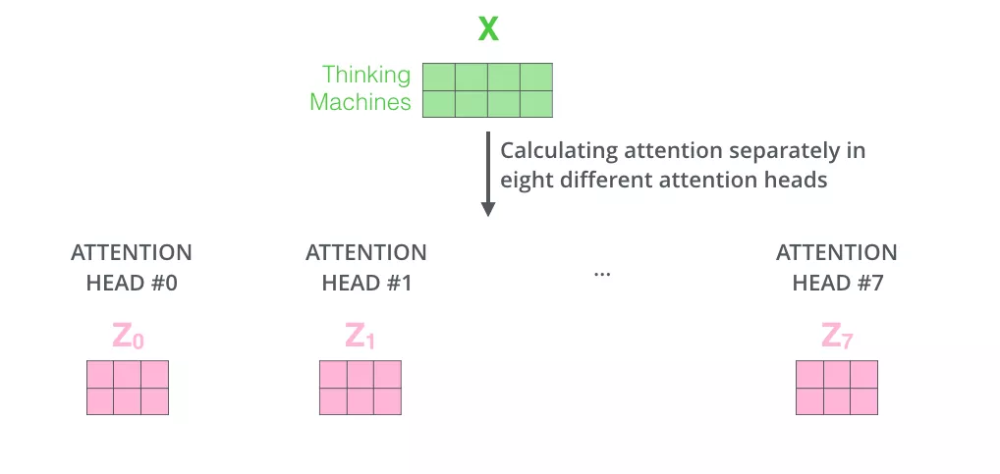
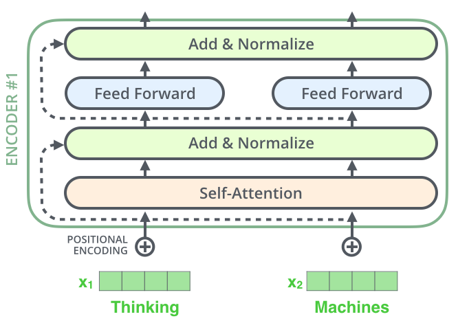
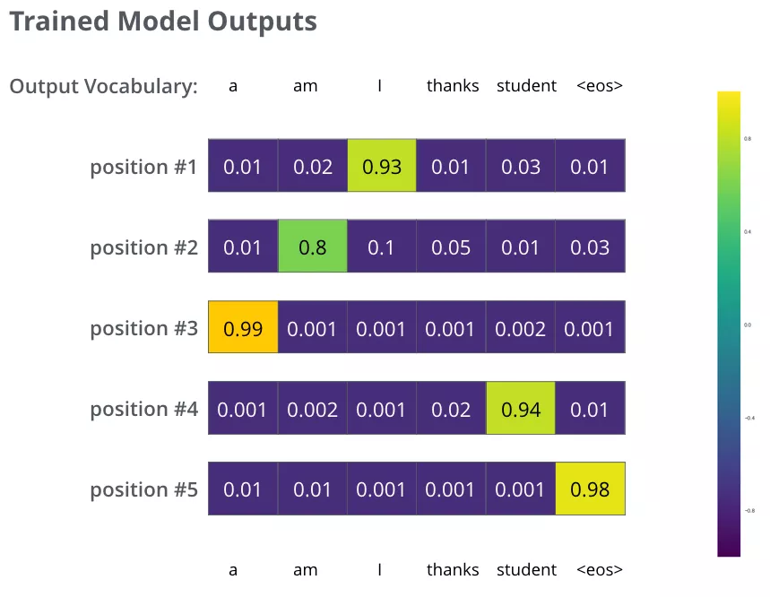

# Transformer diagram

Content organization:
- Transformer diagram
- Transformer macro structure
- Transformer structure details
- Input processing
- Word vector
- Position vector
- Encoder
- Self-Attention layer
- Multi-head attention mechanism
- Attention code example
- Residual connection
- Decoder
- Linear layer and softmax
- Loss function
- Additional materials
- Acknowledgements

After studying [Attention diagram](./2.1-Attention diagram.md), we know the advantages that attention brings to recurrent neural networks. So is there a neural network structure that is directly based on attention and no longer relies on RNN, LSTM or CNN network structures? The answer is: Transformer. Therefore, we will explore the details involved in Transformer in this section.

The Transformer model was proposed by Google in 2017, directly based on the Self-Attention structure, replaced the RNN neural network structure commonly used in previous NLP tasks, and achieved the SOTA at the time in both WMT2014 Englishto-German and WMT2014 English-to-French machine translation tasks.

Compared with neural network structures such as RNN, a huge advantage of Transformer is that: ** When processing sequence input, the model can perform parallel calculations on the entire sequence input, and does not need to recursively process the input sequence according to the time step. ** Chapter 2.1 details how the RNN neural network recursively processes the input sequence. Readers are welcome to review it.

The figure below is the overall structure of Transformer. Similar to the seq2seq model introduced in Chapter 2.1, the left half of the Transformer model structure is the encoder, and the right half is the decoder. Let's disassemble Transformer step by step.


Figure: Transformer model structure

Notes and references: This article will disassemble and explain the Transformer in a general-specific way, hoping to help beginners understand the Transformer model structure.This article mainly refers to [illustrated-transformer](http://jalammar.github.io/illustrated-transformer).

## Transformer macro structure

Note: This section is explained in the following way: general-specific, first the whole, then the part.

Transformer was first proposed to solve the machine translation task, so it can be regarded as a kind of seq2seq model. This section will first ignore the specific details of the structure in the Transformer model and first study the macro structure of Transformer from the perspective of seq2seq. Taking the machine translation task as an example, first regard the special seqseq model of Transformer as a black box, the input of the black box is the French text sequence, and the output is the English text sequence (compared with the seq2seq framework knowledge in Chapter 2.1, we can find that the Transformer macro structure belongs to the seq2seq category, except that the encoder and decoder in the previous seq2seq are replaced from the RNN model to the Transformer model).


Figure: Transformer black box input and output

Replace the middle part of the above figure "THE TRANSFORMER" is disassembled into the standard seq2seq structure, and the following figure is obtained: the left side is the encoder part, and the right side is the decoder part.

Figure: encoder-decoder

Next, the details of the encoder and decoder in the above figure are drawn to obtain the following figure. We can see that the encoder part (encoders) is composed of multiple layers of encoders (the Transformer paper uses a 6-layer encoder, and the number of layers 6 here is not Fixed, you can also modify the number of layers according to the experimental results). Similarly, the decoding part (decoders) is also composed of multiple layers of decoders (the paper also uses a 6-layer decoder). The network structure of each encoder layer is the same, and the network structure of each decoder layer is also the same. The network structures of encoders and decoders at different layers do not share parameters.


Figure: 6-layer encoder and 6-layer decoder

Next, let's take a look at a single-layer encoder. A single-layer encoder is mainly composed of the following two parts, as shown in the figure below
- Self-Attention Layer
- Feed Forward Neural Networktwork (Feedforward Neural Network, abbreviated as FFNN)

The encoder's input text sequence $w_1, w_2,...,w_n$ first needs to undergo embedding transformation to obtain the vector representation of each word $x_1, x_2,...,x_n$, where $x_i \in \mathbb{R}^{d}$ is a vector of dimension $d$, and then all vectors are transformed and information exchanged through a Self-Attention neural network layer to obtain $h_1, h_2,...h_n$, where $h_i \in \mathbb{R}^{d}$ is a vector of dimension $d$. When the self-attention layer processes a word vector, it not only uses the information of the word itself, but also uses the information of other words in the sentence (you can compare it to: when we translate a word, we not only pay attention to the current word, but also pay attention to the information of other words in the context of the word). The output of the Self-Attention layer will pass through the feedforward neural network to obtain new $x_1, x_2,..,x_n$, which are still $n$ vectors of dimension $d$. These vectors will be sent to the next layer of encoder and continue the same operation.


Figure: Single-layer encoder

Corresponding to the encoder, as shown in the figure below, the decoder is encodingAn Encoder-Decoder Attention layer is inserted between the self-attention and FFNN of the decoder, which helps the decoder focus on the most relevant part of the input sequence (similar to the Attention in the seq2seq model).


Figure: Single-layer decoder

To summarize, we basically understand that Transformer consists of an encoding part and a decoding part, and the encoding part and the decoding part are composed of multiple encoding layers and decoding layers with the same network structure. Each encoding layer consists of self-attention and FFNN, and each decoding layer consists of self-attention, FFN and encoder-decoder attention.

The above is the macro structure of Transformer. Let's start to look at the model details in the macro structure.

## Transformer structure details

After understanding the macro structure of Transformer. Next, let's take a look at how Transformer converts the input text sequence into a vector representation, and how to process these vector representations layer by layer to get the final output.

Therefore, the main contents of this section include:
- Input processing
- Word vector
- Position vector
- Encoder
- Decoder### Input Processing

#### Word Vectors
As with common NLP tasks, we first use the word embedding algorithm to convert each word in the input text sequence into a word vector. In practical applications, the vector is generally 256 or 512 dimensional. But for simplicity, we use 4-dimensional word vectors for explanation.

As shown in the figure below, assuming that our input text is a sequence containing 3 words, each word can get a 4-dimensional vector through the word embedding algorithm, so the entire input is converted into a vector sequence. In practical applications, we usually input multiple sentences to the model at the same time. If the length of each sentence is different, we will choose a suitable length as the maximum length of the input text sequence: if a sentence does not reach this length, it will be padded with a special "padding" word; if the sentence exceeds this length, it will be truncated. The maximum sequence length is a hyperparameter, and it is usually hoped that the larger the better, but longer sequences often take up more training memory/memory, so it needs to be decided according to the situation when training the model.


Figure: 3 words and corresponding word vectors

Each word in the input sequence is converted into a word vector representation and the position vector is added to get the final vector representation of the word.

#### Position vector

As shown in the figure below, TransformThe er model adds a position vector to each input word vector. These vectors help determine the position characteristics of each word, or the distance characteristics between different words in a sentence. The intuition behind adding position vectors to word vectors is that adding these vectors representing positions to word vectors can provide more meaningful information to the model, such as the position of words, the distance between words, etc.


Figure: Position Encoding Vector

Still assuming that the dimension of word vectors and position vectors is 4, we show a possible position vector + word vector in the figure below:


Figure: Position Encoding Vector

So what pattern does the vector with position encoding information follow? The design expression given in the original paper is: 
$$
PE_{(pos,2i)} = sin(pos / 10000^{2i/d_{\text{model}}}) \\ PE_{(pos,2i+1)} = cos(pos / 10000^{2i/d_{\text{model}}}) 
$$
The above tableIn the expression, $pos$ represents the position of the word, $d_{model}$ represents the dimension of the position vector, and $i \in [0, d_{model})$ represents the $i$th dimension of the $d_{model}$th position vector. So according to the above formula, we can get the $d_{model}$th position vector at the $pos$th position. In the figure below, we plot the numerical values ​​of a position vector at different positions in the 4th, 5th, 6th, and 7th dimensions. The horizontal axis represents the position subscript, and the vertical axis represents the numerical value.


Figure: Numerical diagram of position encoding at positions 0-100 in 4th, 5th, 6th, and 7th dimensions

Of course, the above formula is not the only way to generate position encoding vectors. But the advantage of this method is that it can be extended to unknown sequence lengths. For example, when our model needs to translate a sentence, and the length of this sentence is greater than the length of all sentences in the training set, this position encoding method can also generate position encoding vectors of the same length.

### Encoder

After the input text sequence of the encoding part is processed, a vector sequence is obtained. This vector sequence will be sent to the first layer encoder. The output of the first layer encoder is also a vector sequence, which is then sent to the next layer encoder: the input of the first layer encoder is the word vector fused with the position vector, * the upper layer encoderThe input is the output of the previous encoder*.

The figure below shows the flow of vector sequences in a single-layer encoder: the word vectors that fuse position information enter the self-attention layer, and the vectors of each position output by self-attention are then input into the FFN neural network to obtain new vectors for each position.


Figure: Sequence vector flow of a single-layer encoder

Let's take a look at an example of two words:


Figure: Example of two words: $x_1, x_2 \to z_1, z_2 \to r_1, r_2$

### Self-Attention layer

Let's analyze the specific mechanism of the Self-Attention layer in the above figure.

##### Overview of Self-Attention 

Suppose we want to translate the sentence:
```
The animal didn't cross the street because it was too tired
```
In this sentence, *it* is a pronoun, so what does *it* refer to? Does it refer to *animal* or *street*? This question is very simple for humans, but not so easy for models. However, if the model introduces the *Self Attention* mechanism, it can make the model associate it with animal. Similarly, when the model processes other words in the sentence, the *Self Attention* mechanism can also make the model pay attention not only to the word at the current position, but also to the related words at other positions in the sentence, so as to better understand the word at the current position.

Compared with the RNN mentioned in Section 2.1: When RNN processes a word in a sequence, it will consider the *hidden state* passed by the previous word in the sentence, and the *hidden state* contains the information of the previous word; while the *Self Attention* mechanism is that the current word will directly pay attention to all the related words before and after its own sentence, as shown in the example of *it* in the figure below:


Figure: Attention of a word and other words

The *it* shown in the figure above is a real example, which is the state when the Transformer encodes "it" in the 5th layer encoder. After visualization, it shows that *it* has part of its attention focused on "The animal" and merged the information of these two words into "it".

##### Self-Attention Details

First, let's understand through a simple example: What is "self-attention mechanism"? Suppose a sentence contains two words: Thinking Machines. One understanding of self-attention is: Thinking-Thinking, Thinking-Machines, Machines-Thinking, Machines-Machines, a total of $2^2$ two-by-two attention. So how to calculate it specifically? Suppose the two words Thinking and Machines are vectored by the word vector algorithm to get vectors $X_1, X_2$​:
$$
1: q_1 = X_1 W^Q, q_2 = X_2 W^Q; k_1 = X_1 W^K, k_2 = X_2 W^K;v_1 = X_1 W^V, v_2 = X_2 W^V, W^Q, W^K, W^K \in \mathbb{R}^{d_x \times d_k}\\
2-3: score_{11} = \frac{q_1 \cdot q_1}{\sqrt{d_k}} , score_{12} = \frac{q_1 \cdot q_2}{\sqrt{d_k}} ; score_{21} = \frac{q_2 \cdot q_1}{\sqrt{d_k}}, score_{22} = \frac{q_2 \cdot q_2}{\sqrt{d_k}}; \\
4: score_{11} = \frac{e^{score_{11}}}{e^{score_{11}} + e^{score_{12}}},score_{12} = \frac{e^{score_{12}}}{e^{score_{11}} + e^{score_{12}}}; score_{21} = \frac{e^{score_{21}}}{e^{score_{21}} + e^{score_{22}}},score_{22} = \frac{e^{score_{22}}}{e^{score_{21}} + e^{score_{22}}} \\
5-6: z_1 = v_1 \times score_{11} + v_2 \times score_{12}; z_2 = v_1 \times score_{21} + v_2 \times score_{22}
$$
Below,We visualize the six steps of the self-attention calculation above.

Step 1: Linearly transform the word vector of the input encoder to obtain: Query vector: $q_1, q_2$, Key vector: $k_1, k_2$, Value vector: $v_1, v_2$. These three vectors are obtained by multiplying the word vector with three parameter matrices, and this matrix is ​​also the parameter to be learned by the model.

Figure: Calculation of Query vector: $q_1, q_2$, Key vector: $k_1, k_2$, Value vector: $v_1, v_2$.

What do Query vector, Key vector, and Value vector mean?

In fact, they are just three vectors. Giving them a name can help us better understand the calculation process and logic of Self-Attention. The logic of attention calculation can often be described as: **Query and key calculate correlation or attention score, and then weighted sum the value according to the attention score. **

Step 2: Calculate the Attention Score. Suppose we now calculate the Attention Score of the first word *Thinking*), we need to calculate a score for all other word vectors in the sentence based on the word vector corresponding to *Thinking*. These scores determine the weights we need to give to the word vectors at other positions in the sentence when encoding the word *Thinking*.

The attention score is obtained by performing a dot product between the query vector corresponding to "*Thinking*" and the key vector of each word at other positions. The first attention score of Thinking is the inner product of $q_1$ and $k_1$, and the second score is the dot product of $q_1$ and $k_2$. This calculation process is shown in the figure below, where the specific score data is customized for ease of expression.


Figure: Attention Score calculation for Thinking

Step 3: Divide each score by $\sqrt{d_k}$, where $d_{k}$ is the dimension of the key vector. You can also divide by other numbers. Dividing by a number is to make the gradient more stable during backpropagation.

Step 4: Then pass these scores through a Softmax function, which can normalize the scores so that they are all positive and add up to 1, as shown in the figure below.
These scores determine the word vector of Thinking, and the word vector of other words.How much attention do the word vectors at all positions have?


Figure: Attention Score calculation of Thinking

Step 5: After getting the score of each word vector, multiply the score by the corresponding Value vector. The intuitive understanding behind this approach is: for positions with high scores, the larger the multiplication value is, we pay more attention to them; for positions with low scores, the smaller the multiplication value is, and the words at these positions may not be very relevant.

Step 6: Add the Value vectors obtained in step 5 to get the output corresponding to Self Attention at the current position (the first position in this example).

Finally, the figure below shows the whole process of calculating Self Attention for the word vector at the first position. The final word vector of the current position (the first position in this example) will continue to be input into the feedforward neural network. Note: The above 6 steps can only calculate the output vector of one position at a time. In the actual code implementation, the calculation process of Self Attention is quickly calculated using matrices, and the output vectors of all positions are obtained at one time.


Figure: Thinking vector representation after attention $z_1$

##### Self-Attention Matrix Calculation

Put the vectors in the 6 steps of self-attention calculation together, such as $X=[x_1;x_2]$​, and you can perform matrix calculation. Below, we still show the matrix calculation method of self-attention step by step.
$$
X = [X_1;X_2] \\
Q = X W^Q, K = X W^K, V=X W^V \\
Z = softmax(\frac{QK^T}{\sqrt{d_k}}) V
$$
Step 1: Calculate the matrix of Query, Key, and Value. First, we put all the word vectors into a matrix X, and then multiply them with the three weight matrices $W^Q, W^K W^V$ to get the Q, K, and V matrices. Each row in the matrix X represents the word vector of each word in the sentence. Each row in the Q, K, V matrices represents the Query vector, Key vector, and Value vector, and the vector dimension is $d_k$.

Figure: QKV matrix multiplication

Step 2: Since we use matrices to calculate, we can compress steps 2 to 6 above into one step and directly get the output of Self Attention.


Figure: Output $Z$

#### Multi-head attention mechanism

The Transformer paper further improved Self-Attention by adding a multi-head attention mechanism (a group of attention is called an attention head). This mechanism enhances the ability of the attention layer in the following two ways:

- **It expands the model's ability to pay attention to different positions**. In the example above, the output $z_1$​ at the first position contains a small part of the information of each other position in the sentence, but $z_1$​ is just a single vector, so it may be dominated by the information of the first position only. When we translate the sentence: `The animal didn’t cross the street because it was too tired`, we want the model to pay attention not only to "it" itself, but also to "The" and "animal", and even to "tired". At this time, the multi-head attention mechanism will help.
- **The multi-head attention mechanism gives the attention layer multiple "sub-representation spaces"**. As we will see below, the multi-head attention mechanism has multiple sets of $W^Q, W^K W^V$​ weight matrices (in the Transformer paper, 8Group attention), so $X$​ can be transformed to more seed spaces for representation. Next, we also use 8 groups of attention heads. The weight matrix of each group of attention is randomly initialized, but after training, the weights of each group of attention $W^Q, W^K W^V$​ can map the input vector to a corresponding "sub-representation space".


Figure: Multi-head attention mechanism

In the multi-head attention mechanism, we set a separate WQ, WK, WV parameter matrix for each group of attention. Multiply the input X and the WQ, WK, WV of each group of attention to get 8 groups of Q, K, V matrices.

Next, we calculate the Z matrix of each group of K, Q, V, and get 8 Z matrices.


Figure: 8 Z matrices

Since the feedforward neural network layer receives 1 matrix (where each row of the vector represents a word) instead of 8 matrices, we directly concatenate the 8 sub-matrices to get a large matrix, and then multiply it with another weight matrix $W^O$ to perform a transformation to map it to the dimensions required by the feedforward neural network layer.


Figure: Concatenate 8 sub-matrices and perform mapping transformation

To summarize:
1. Concatenate 8 matrices {Z0, Z1..., Z7}
2. Multiply the concatenated matrix with the WO weight matrix
3. Get the final matrix Z, which contains the information of all attention heads. This matrix will be input to the FFNN (Feed Forward Neural Network) layer.

The above is all about multi-head attention. Finally, put all the content in one picture:


Figure: Matrix operation of multi-head attention mechanism

After learning the multi-head attention mechanism, let's take a look at what the "it" corresponding to the different attention heads pays attention to when we mentioned the it example above. The green and orange lines in the figure below represent two different sets of attentin heads:


Figure: `it`'s attention

When we encode the word "it", one of the attention heads (the orange attention head) focuses most on "the animal", and the other green attention head focuses on "tired". So in a sense, the representation of "it" in the model combines some expressions of "animal" and "tire".

#### Attention code example
In the following code implementation, the first dimension of the tensor is the batch size, and the second dimension is the sentence length. The code is annotated and explained in detail.

```
class MultiheadAttention(nn.Module):
# n_heads: the number of multi-head attention
# hid_dim: the vector dimension of each word output
def __init__(self, hid_dim, n_heads, dropout):
super(MultiheadAttention, self).__init__()
self.hid_dim = hid_dim
self.n_heads = n_heads

# Force hid_dim to be divisible by h
assert hid_dim % n_heads == 0
# Define W_q matrixself.w_q = nn.Linear(hid_dim, hid_dim)
# Define W_k matrix
self.w_k = nn.Linear(hid_dim, hid_dim)
# Define W_v matrix
self.w_v = nn.Linear(hid_dim, hid_dim)
self.fc = nn.Linear(hid_dim, hid_dim)
self.do = nn.Dropout(dropout)
# Scaling
self.scale = torch.sqrt(torch.FloatTensor([hid_dim // n_heads]))

def forward(self, query, key, value, mask=None):
# Note that the values ​​of Q, K, and V in the dimension of sentence length can be the same or different.
# K: [64,10,300], assuming batch_size is 64, there are 10 words, eachThe query vector of each word is 300-dimensional
# V: [64,10,300], assuming batch_size is 64, there are 10 words, and the query vector of each word is 300-dimensional
# Q: [64,12,300], assuming batch_size is 64, there are 12 words, and the query vector of each word is 300-dimensional
bsz = query.shape[0]
Q = self.w_q(query)
K = self.w_k(key)
V = self.w_v(value)
# Here, the K Q V matrix is ​​split into multiple groups of attention
# The last dimension is obtained using self.hid_dim // self.n_heads, which indicates the vector length of each group of attention. The vector length of each head is: 300/6=50
# 64 indicates batch size, 6 indicates 6 groups of attention, and 10 indicates 10 words, 50 represents the vector length of each attention group word
# K: [64,10,300] Split multiple attention groups-> [64,10,6,50] Transpose -> [64,6,10,50]
# V: [64,10,300] Split multiple attention groups -> [64,10,6,50] Transpose -> [64,6,10,50]
# Q: [64,12,300] Split multiple attention groups -> [64,12,6,50] Transpose -> [64,6,12,50]
# Transpose is to put the number of attention 6 in front and 10 and 50 in the back to facilitate the following calculations
Q = Q.view(bsz, -1, self.n_heads, self.hid_dim //
self.n_heads).permute(0, 2, 1, 3)
K = K.view(bsz, -1, self.n_heads, self.hid_dim //
self.n_heads).permute(0, 2, 1, 3)
V = V.view(bsz, -1, self.n_heads, self.hid_dim //
self.n_heads).permute(0, 2, 1, 3)

# Step 1: Q multiplied by the transpose of K, divided by scale
# [64,6,12,50] * [64,6,50,10] = [64,6,12,10]
# attention: [64,6,12,10]
attention = torch.matmul(Q, K.permute(0, 1, 3, 2)) / self.scale

# If mask is not empty, then set the attention score of the position where mask is 0 to -1e10. Here, "0" is used to indicate which word vectors cannot be paid attention to, such as padding positions. Of course, "1" or other numbers can also be used to indicate. The main design is the changes in the following two lines of code.
if mask is not None:
attention = attention.masked_fill(mask == 0, -1e10)

#Step 2: Calculate the softmax of the result of the previous step, and then pass dropout to get attention.
# Note that here we do softmax on the last dimension, that is, we do softmax on the dimension of the input sequence
# attention: [64,6,12,10]
attention = self.do(torch.softmax(attention, dim=-1))

# Step 3, multiply the attention result by V to get the result of multi-head attention
# [64,6,12,10] * [64,6,10,50] = [64,6,12,50]
# x: [64,6,12,50]
x = torch.matmul(attention, V)

# Because query has 12 words, put 12 in front and 50 and 6 in the back to facilitate the concatenation of multiple groups of results
# x: [64,6,12,50] transpose -> [64,12,6,50]
x = x.permute(0, 2, 1, 3).contiguous()
# The matrix conversion here is: concatenate the results of multiple attention groups
# The final result is [64,12,300]
# x: [64,12,6,50] -> [64,12,300]
x = x.view(bsz, -1, self.n_heads * (self.hid_dim // self.n_heads))
x = self.fc(x)
return x
# batch_size is 64, there are 12 words, and the Query vector of each word is 300 dimensions
query = torch.rand(64, 12, 300)
# batch_size is 64, there are 12 words, and the Key vector of each word is 300 dimensions
key = torch.rand(64, 10, 300)
# batch_size is 64, there are 10 words, and the Value vector of each word is 300 dimensions The vector is 300-dimensional
value = torch.rand(64, 10, 300)
attention = MultiheadAttention(hid_dim=300, n_heads=6, dropout=0.1)
output = attention(query, key, value)
## output: torch.Size([64, 12, 300])
print(output.shape)

```

#### Residual connection

So far, we have calculated the output vector of self-attention. There are two important operations in the single-layer encoder: residual connection and normalization.

Each sublayer of the encoder (Self Attention layer and FFNN) has a residual connection and layer normalization, as shown in the figure below.


Figure: Residual connection

The layer normalization of the Self-Attention layer and the details of the vector calculation involved are visualized as follows:


Figure: Normalization details

The encoder and decoder sublayers have layer normalization. Assume that a Transformer is composed of 2The encoder consists of a layer encoder and two layers of decoders, showing all the internal details as shown in the figure below.


Figure: 2-layer Transformer diagram

## Decoder

Now we have introduced most of the concepts in the encoder, and we also basically know the principles of the encoder. Now let's take a look at how the encoder and decoder work together.

The encoder generally has multiple layers. The input of the first encoder is a sequence text, and the output of the last encoder is a set of sequence vectors. This set of sequence vectors will be used as the K and V inputs of the decoder, where K=V=the sequence vector output by the decoder. These attention vectors will be input to the Encoder-Decoder Attention layer of each decoder, which helps the decoder focus on the appropriate position of the input sequence, as shown in the figure below.


Each time step in the decoding phase outputs a translated word (the example here is English translation), and the output of the decoder at the current time step is used as the input Q and the output of the encoder K and V as the input of the decoder at the next time step. Then repeat this process until an end symbol is output. As shown in the figure below:


Dynamic graph: decoder dynamic graph

The difference between the Self Attention layer in the decoder and the Self Attention layer in the encoder:

1. In the decoder, the Self Attention layer is only allowed to focus on words before the current position in the output sequence. The specific approach is: before the Self Attention score passes through the Softmax layer, the positions after the current position are masked (the attention score is set to -inf).

2. The decoder Attention layer uses the output of the previous layer to construct the Query matrix, while the Key matrix and Value matrix come from the final output of the encoder.

## Linear layer and softmax

The final output of the decoder is a vector, in which each element is a floating point number. How do we convert this vector into words? This is done by the linear layer and softmax.

The linear layer is a normal fully connected neural network that maps the vector output by the decoder to a larger vector called a logits vector: Assuming our model has 10,000 English words (the output vocabulary of the model), this logits vector will have 10,000 numbers, each representing the score of a word.

Then, SoftmaxThe ax layer converts these scores into probabilities (convert all scores into positive numbers and add them up to 1). Then the word corresponding to the number with the highest probability is selected, which is the output word of this time step.


Figure: Linear layer

## Loss function

When training Transformer, the output of the decoder and the label need to be fed into the loss function together to obtain the loss, and the model will finally propagate in the direction according to the loss. In this section, we use a simple example to illustrate the loss calculation of the training process: translating "merci" into "thanks".

We hope that the probability distribution of the model decoder's final output will point to the word "thanks" (the probability of the word "thanks" is the highest). However, at the beginning, the model has not been trained well, and the probability distribution it outputs may be far from the probability distribution we hope for. As shown in the figure below, the correct probability distribution should be that the probability of the word "thanks" is the highest. However, since the parameters of the model are randomly initialized, the probability of all words predicted by the model at the beginning is almost random.


Figure: Probability distribution

As long as the Transformer decoder predicts a set of probabilities, we can compare this set of probabilities with the correct output probabilities and then use backpropagation toAdjust the weights of the model so that the output probability distribution is closer to the integer output.

So how do we compare two probability distributions? : We can simply use the spatial distance between the two sets of probability vectors as the loss (vector subtraction, then square sum, and then square root), of course, we can also use cross-entropy and KL divergence. Readers can further search and read related knowledge, and the knowledge of loss function is not expanded in this section.

Since the example with only one word above is too simple, we can look at a more complex sentence. The sentence input is: "je suis étudiant" and the output is: "i am a student". This means that our transformer model decoder has to output probability distribution vectors multiple times:

- Each probability distribution output is a vector with a length of vocab_size (the maximum vocab size, that is, the vector length is 6, is agreed upon earlier, but the actual vocab size is more likely to be 30,000 or 50,000)
- In the probability distribution of the first output, the word with the highest probability is "i"
- In the probability distribution of the second output, the word with the highest probability is "am"
- And so on, until the fifth probability distribution, the word with the highest probability is "\<eos>", which meansIt indicates that there is no next word.

So the probability distribution of our target looks like this:


Figure: Target probability distribution

We train the model with the sentences in the example, hoping to produce the probability distribution shown in the figure

After our model is trained for a long enough time on a large enough dataset, we hope to output the probability distribution shown in the figure below:


Figure: Multiple probability distributions output after model training

We hope that the probability distribution that the model can output after training will correspond to the correct translation. Of course, if the sentence you want to translate is part of the training set, the output result does not mean anything. We hope that the model can accurately translate sentences that it has never seen.

Additionally mention the concepts of greedy decoding and beam search:

- Greedy decoding: Since the model only produces one output per time step, we think of it this way: the model selects the word with the highest probability from the probability distribution and discards other words. This method is called greedy decoding.
- Beam search: retain the k highest probability output words at each time step, and then in the next time step, determine which k words should be retained based on the k words retained in the previous time step. Assume k=2, the two words with the highest probability in the first position are "I" and "a", both of which are retained, and then the probability distribution of the word in the second position is calculated based on the first word, and then the two words with the highest probability in the second position are taken out. For the third and fourth positions, we also repeat this process. This method is called beam search.

## Additional information

I hope the above content can help you understand the main concepts in Transformer. If you want to understand more deeply, I suggest you refer to the following:

- Read the Transformer paper:
"Attention Is All You Need"
Link: https://arxiv.org/abs/1706.03762
- Read the Transformer blog post:
"Transformer: A Novel Neural Network Architecture for Language Understanding"
Link: https://ai.googleblog.com/2017/08/transformer-novel-neural-network.html
Read the "Tensor2Tensor announcement"- Link: https://ai.googleblog.com/2017/06/accelerating-deep-learning-research.html
- Watch the video [Łukasz Kaiser’s talk] to understand the model and its details
Link: https://www.youtube.com/watch?v=rBCqOTEfxvg
Run this code: [Jupyter Notebook provided as part of the Tensor2Tensor repo]
- Link: https://colab.research.google.com/github/tensorflow/tensor2tensor/blob/master/tensor2tensor/notebooks/hello_t2t.ipynb.
- Check out this project: [Tensor2Tensor repo]
Link: https://github.com/tensorflow/tensor2tensor

## Acknowledgements
This article was mainly translated and written by Zhang Xian from Harbin Institute of Technology, and reorganized by Duoduo and datawhale project students. Finally,Looking forward to your reading feedback and stars, thank you.