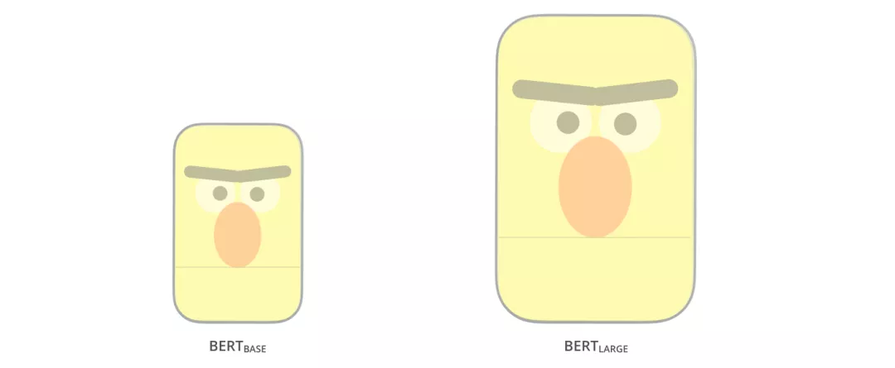
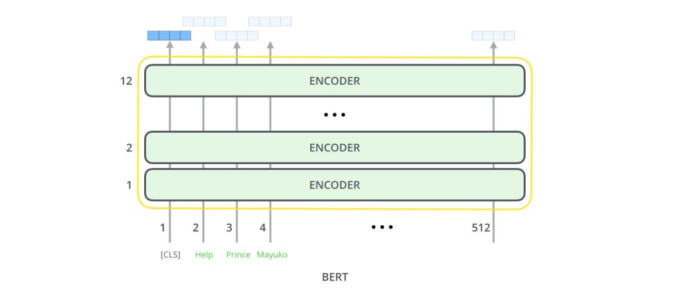
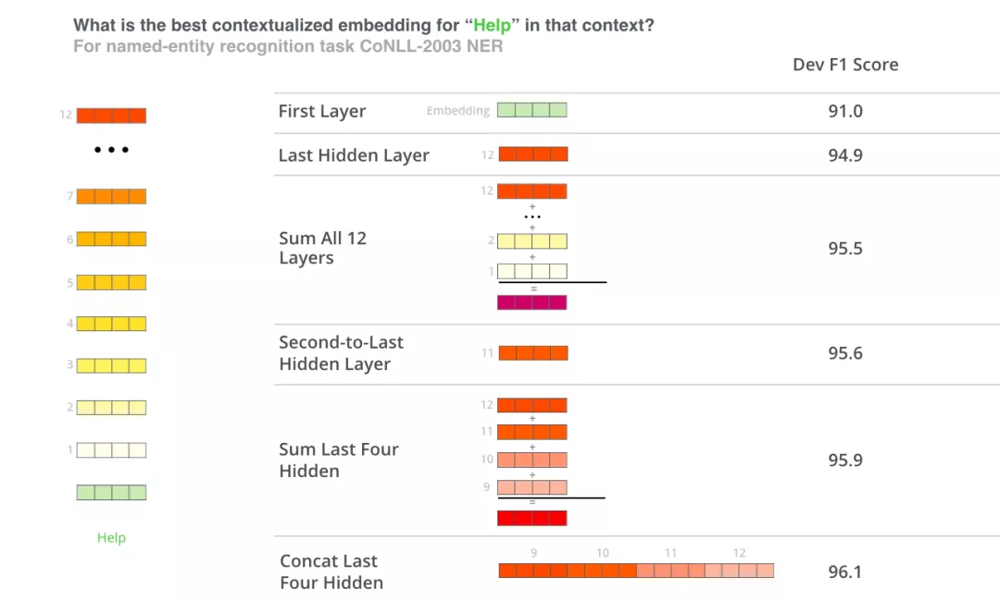
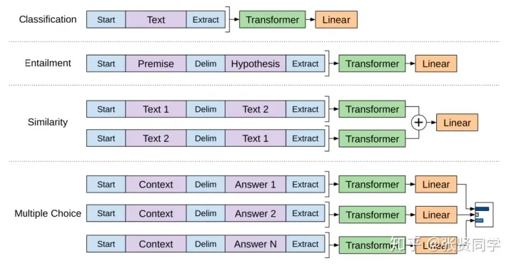

# BERT Illustrated

Content organization;
- BERT Illustrated
- BERT Sentence Classification
- Model Structure
- Model Input
- Model Output
- Pre-training Task: Masked Language Model
- Pre-training Task: Adjacent Sentence Judgment
- Application of BERT
- BERT Feature Extraction
- Further Reading
- Comparison with CNN
- Word Embedding Progress
- Review of Word Embedding
- Contextual Issues
- Transformer: Beyond LSTM
- OpenAI Transformer: Pre-training a Transformer Decoder for Language Modeling
- BERT: Decoder to Encoder
- Acknowledgements

After learning about the Transformer in Chapter 2.2, let's learn about a classic model that promotes the Transformer model structure: BERT.

From the perspective of 2021, 2018 was a turning point in natural language processing technology, and the ability to process text using deep learning technology was greatly utilized through pre-trained models. At the same time, with the contribution of the NLP open source community, many powerful models have been packaged into components, allowing NLP beginners toThere is a chance to achieve very good results on various NLP tasks. Among the many NLP pre-training models, the most classic ones are BERT and GPT, so this article will start to learn about BERT (the citation of a single article is close to 20,000).

BERT was proposed in 2018, and the BERT model broke the best records of multiple natural language processing tasks as soon as it appeared. Shortly after the BERT paper was released, the BERT team made the model code public and provided a model download pre-trained based on a large-scale new book dataset. The open source of BERT's model code and model parameters allows any NLP practitioner to build their own NLP system based on this powerful model component, and also saves the time, energy, knowledge and resources required to train a language processing model from scratch.

So what exactly does BERT do? As shown in the figure below, BERT first pre-trains on a large-scale unsupervised corpus, then adds a task-related neural network layer based on the pre-trained parameters, and fine-tunes the training on the data of the task, and finally achieves very good results. The training process of BERT can be briefly described as: pre-training + fine-tuning, which has become the most popular paradigm for NLP solutions in recent years.

 Figure: BERT training and fine-tuning

## BERT sentence classification
To be veryTo understand BERT well, it is best to first understand the usage scenarios of BERT, clarify the input and output, and finally learn the internal model structure and training methods of BERT in detail. Therefore, before introducing the BERT-related concepts involved in the model itself, let's take a look at how to apply BERT directly.
- Download the BERT model pre-trained on unsupervised corpus, which generally corresponds to 3 files: BERT model configuration file (used to determine the number of layers of Transformer, hidden layer size, etc.), BERT model parameters, BERT vocabulary (all tokens that BERT can process).
- For specific task needs, add a task-related neural network to the BERT model, such as a simple classifier, and then fine-tune the training on the specific task supervision data. (One understanding of fine-tuning: a small learning rate, a small number of training epochs, and a slight adjustment of the overall model parameters)

First, let's take a look at how to use BERT for sentence classification.
Suppose our sentence classification task is: to determine whether an email is "spam" or "non-spam", as shown in the figure below. Of course, in addition to spam judgment, it can also be other NLP tasks, such as:

- Input: movie or product evaluation. Output: Determine whether this review is positive or negative.
- Input: Two sentences. Output: Whether the two sentences have the same meaning.

Figure: Spam Classification

As shown in the figure below, in order to use BERT for sentence classification, we add a simple classifier layer to the BERT model. Since this layer of neural network parameters is newly added, its parameters can only be randomly initialized at the beginning, so the classifier needs to be trained with corresponding supervision data. Since the classifier is connected to the BERT model, the parameters of BERT can also be updated during training.

Figure: BERT Sentence Classification

## Model Structure

Through the above examples, we understand how to use BERT. Next, let's take a deeper look at how it works. The original BERT paper proposed two models, BERT-base and BERT-large. The number of parameters of base is less than that of large, which can be vividly represented as shown in the figure below.

 Figure: BERT base and large

Reviewing the Transformer in Chapter 2.2, the BERT model structure is basically the encoder part of the Transformer. BERT-base corresponds to a 12-layer encoder, and BERT-large corresponds toIt is a 24-layer encoder.

Figure: BERT-base is a 12-layer encoder

## Model input

Next, let's take a look at the model input and output: The BERT model input has a special feature in that a [CLS] token is concatenated at the beginning of a sentence, as shown in the figure below. The vector representation of this special [CLS] token obtained by BERT is usually used as the current sentence representation. Except for this special [CLS] token, the rest of the input words are similar to the Transformer in Chapter 2.2. BERT takes a string of words as input, and these words continue to flow upward in the multi-layer encoder, and each layer will pass through the Self-Attention and feedforward neural network.

Figure: Model input

## Model output

After all tokens of BERT input are encoded by BERT, a vector of size hidden_size (768 in BERT-base) will be output at each position.

Figure: BERT output

ForIn the example of sentence classification mentioned above, we directly use the vector output of the first position (corresponding to [CLS]) to pass it into the classifier network, and then perform the classification task, as shown in the figure below.

Figure: BERT connected to classifier

## Pre-training task: Masked Language Model

Knowing the model input, output, and Transformer structure, how is BERT trained unsupervised? How to obtain effective word and sentence representation information? Previous NLP pre-training is usually based on language models, such as given the first three words of the language model, let the model predict the fourth word. However, BERT is pre-trained based on the Masked language model: some (15%) words in the input text sequence are randomly masked, and BERT is used to predict these masked words. As shown in the following figure:
Figure: BERT mask

This training method can be traced back to the Word2Vec era. The typical Word2Vec algorithm is: predict word C based on words A, B and D, E on both sides of word C.
## Pre-training task: adjacent sentence judgment

In addition to maskedlanguage model, BERT also introduced a new task during pre-training: judging whether two sentences are adjacent sentences. As shown in the figure below: the input is sentence A and sentence B. After BERT encoding, the vector representation of [CLS] token is used to predict whether the two sentences are adjacent sentences.

Figure: 2 sentence tasks

Note: For the convenience of this article, the BERT tokenize process is omitted in the previous description, but readers need to note that BERT actually uses WordPieces as the smallest processing unit (using the wordpiece algorithm for word segmentation): token, rather than the word itself. In WordPiece, some words are split into smaller parts. Regarding WordPiece word segmentation, this article will not expand too much. Interested readers can read and learn [subword tokenizer](https://towardsdatascience.com/a-comprehensive-guide-to-subword-tokenisers-4bbd3bad9a7c). In addition, the task of judging whether two sentences are adjacent has been gradually weakened in later studies, such asWhen the roberta model was proposed, it no longer used this task for pre-training.

## BERT Application

The BERT paper shows the application of BERT in various tasks, as shown in the figure below. It can be used to determine whether two sentences are similar, determine the sentiment of a single sentence, do extractive question answering, and do sequence labeling.

Figure: BERT Application

## BERT Feature Extraction

Since the BERT model can obtain the vector representation of all tokens corresponding to the input sequence, it is not only possible to use the output of the last layer of BERT to connect the task network for fine-tuning, but also to directly use the vectors of these tokens as features. For example, the token representation of each layer of encoder can be directly extracted as a feature and input into the existing task-specific neural network for training.

Figure: BERT Feature Extraction

So do we use the vector representation of the last layer, the previous layers, or both? The following figure shows an experimental result:

Figure: BERT feature selection

## Further reading

### Comparison with CNN

For those who have a planFor people with a computer vision background, the encoding process of BERT reminds us of the convolutional neural network + fully connected network used in computer vision for classification tasks, as shown in the figure below. The basic training method and process are similar.

Figure: CNN

### Word Embedding Progress

#### Review of Word Embedding

Words cannot be directly input into machine learning models, but require some kind of numerical representation so that the model can use them in calculations. With Word2Vec, we can use a vector (a set of numbers) to properly represent words and capture the semantics of words and the relationship between words (for example, whether words are similar or opposite, or whether a pair of words like "Stockholm" and "Sweden" have the same relationship as the pair of words "Cairo" and "Egypt"), as well as syntactic and grammatical relationships (for example, the relationship between "had" and "has" is the same as the relationship between "was" and "is").

People soon realized that it was better to use pre-trained word embeddings on large-scale text data than to train word embeddings together with the model on a small dataset. Therefore, we can download the word lists and their word embeddings pre-trained by Word2Vec and GloVe.Below is an example of a Glove embedding for the word "stick" (embedding length is 200).

Figure: wrod vector

Glove embedding for the word "stick": a vector of 200 floating point numbers (rounded to 2 decimal places).

Since these vectors are long and all numbers, I use the following basic shapes to represent the vectors in this article:

Figure: vector

#### The Context Problem

If we use Glove's word embedding representation, the word "stick" will only be represented as a single vector regardless of the context. Some researchers have pointed out that words like "stick" have multiple meanings. Why can't we learn word embeddings based on the context in which it is used? This captures both the semantic information of the word and the semantic information of the context. Thus, the contextualized word embedding model came into being: ELMo.

Figure: ELMo

Contextualized word embedding can assign context to words according to their meaning in the context of a sentence.Different word embeddings are given to each word.

Instead of using fixed word embeddings for each word, ELMo looks at the entire sentence and incorporates contextual information before assigning a word embedding to each word. It uses a bidirectional LSTM trained on a specific task to create these word embeddings.

Figure: ELMo embedding

ELMo is a major step forward in contextualized pre-training. The ELMo LSTM is trained on a large dataset, and then we can use it as part of other language processing models to handle natural language tasks.

So what is the secret of ELMo?

ELMo gained language understanding capabilities by training to predict the next word in a sequence of words, a task known as language modeling. ELMo is convenient to implement because we have a lot of text data that the model can learn from without the need for additional labels.

Figure: ELMo training

The ELMo pre-training process is a typical language model: take "Let's stick to" as input and predict the next most likely word. When we train on a large dataset, the model begins to learn the patterns of the language. For example, in "hang" , the model will give "out" a higher probability (because "hang out" is a phrase) instead of outputting "camera".

In the figure above, we can see that the hidden layer state vector of each step of LSTM is displayed above the ELMo head. After this pre-training process is completed, these hidden layer states come in handy in the word embedding process.

Figure: ELMo training

ELMo achieves contextualized word embedding by combining the hidden layer representation vectors of the LSTM model (and the initialized word embedding) in a certain way (weighted sum after vector concatenation).

Figure: ELMO training

#### Transformer: Beyond LSTM

With the release of Transformer papers and codes, and its achievements in tasks such as machine translation, people began to think that it is a substitute for LSTM. Part of the reason is: 1. Because Transformer can be better than LSTM can better handle long-term dependencies. 2. Transformer can perform parallel operations on inputs.

In 2017, based on Transformer's Encoder-Decoder shows its power in machine translation. But how can it be used for text classification? How can you use it to pre-train a language model and fine-tune it on other tasks (downstream tasks refer to supervised learning tasks that can use pre-trained models)?

#### OpenAI Transformer: Pre-train a Transformer Decoder for Language Modeling

Following the path of LSTM language model pre-training, after replacing LSTM with Transformer structure (equivalent to), the parameters of the language model pre-training are directly fine-tuned with downstream task supervision data. Compared with the Transformer used for seq2seq translation at the beginning, it is equivalent to using only the Decoder part. With the Transformer structure and language model task design, large-scale unlabeled data is directly used to continuously predict the next word: just throw the text of 7,000 books to the model one by one, and then let it continuously learn to generate the next word.

 Figure: Open ai model predicts the next word

Now, OpenAI Transformer has been pre-trained, and its network layer library has been adjusted many times and can be well represented by vectorsText, we start using it to handle downstream tasks. Let's first look at the sentence classification task (classifying emails as "spam" or "non-spam"):

Figure: open ai model for sentence classification

For a variety of NLP tasks, OpenAI's paper lists a series of input transformation methods that can handle inputs of different task types. The following picture is from the paper and shows the model structure and corresponding input transformations for processing different tasks.

Figure: open ai fine-tuning

#### BERT: Decoder to Encoder

OpenAI Transformer provides us with a pre-trained network based on Transformer. But in the process of replacing LSTM with Transformer, something is lost. For example, the previous ELMo language model is bidirectional, but OpenAI Transformer only trains a forward language model. Can we build a Transformer-based language model that looks both forward and backward (in technical terms - incorporates information from previous and following contexts)? AnswerIt is BERT: a bidirectional Transformer-based encoder, pre-trained on a masked language model, and finally achieved SOTA results in multiple NLP downstream tasks.

## Acknowledgements
This article was mainly translated by Zhang Xian from Harbin Institute of Technology (with the authorization of the original author), and reorganized and sorted by Duoduo. Thanks to Jacob Devlin, Matt Gardner, Kenton Lee, Mark Neumann and [Matthew Peters](https://twitter.com/mattthemathman) for providing feedback on early versions of this article.