# GPT diagram
Content organization:
- GPT diagram
- What is a language model
- Auto-encoder language model
- Auto-regressive language model
- Transformer-based language model
- Transformer evolution
- GPT2 overview
- GPT2 detailed explanation
- Input encoding
- Multi-layer decoder
- Self-Attention in decoder
- Self-Attention detailed explanation
- Visualization of Self-Attention
- Masked Self-attention diagram
- Self-Attention in GPT2
- GPT2 fully connected neural network
- Language model application
- Machine translation
- Generate summary
- Transfer learning
- Music generation
- Summary
- Acknowledgements

In addition to BERT, another pre-trained model GPT has also brought a lot of sensation to the NLP field. This section also gives a detailed explanation of GPT.

GPT-2 model proposed by OpenAI (https://openai.com/blog/better-language-models/) can write coherent and high-quality articles, which is much better than the previous language model. GPT-2 is built on Transformer. Compared with the previous NLP language model, it is based on the Transformer large model and pre-trained on a huge data set. In this chapter, we will analyze the structure of GPT-2, learn about the application of GPT-2, and deeply analyze the self-attention structure involved. This article can be regarded as a supplement to the illustration of Transformer in chapter 2.2 and the illustration of BERT in chapter 2.3.

This article is translated from [GPT2](http://jalammar.github.io/illustrated-gpt2).

## Language model and GPT-2

### What is a language model
This article mainly describes and compares two language models:
- Auto-encoder language model
- Auto-regressive language model

First look at the auto-encoder language model.
The typical representative of the auto-encoder language model is BERT described in chapter 2.3. As shown in the figure below, the autoencoder language model randomly masks some of the words input, and then the pre-training goal is to predict the masked words, which can not only incorporate the previous information, but also naturally integrate the following information.Figure: BERT mask

Advantages and disadvantages of autoencoder language model:
- Advantages: Naturally integrated into the bidirectional language model, and the context of the predicted word can be seen at the same time
- Disadvantages: Inconsistency between training and prediction. The [Mask] tag is introduced into the input during training, but this [Mask] tag is often not present during the prediction phase, resulting in inconsistency between the pre-training phase and the fine-tuning phase.

Next, let's take a look at what is a commonly used auto-regressive language model: the language model predicts the next word based on a part of the text of the input sentence. The most common language model in daily life is the input method prompt, which can prompt the next word based on what you input.


Figure: Input prompt

Advantages and disadvantages of auto-regressive language model:
- Advantages: For generative NLP tasks, such as text summarization, machine translation, etc., the content is generated from left to right, which is naturally consistent with the auto-regressive language model.
- Disadvantages: Since it is usually from left to right (of course it can also be from right to left), it can only use the information of the previous or the following context, but not both.

GPT-2 is an autoregressive language model. Compared with the input prompts on mobile apps, GPT-2 is more complex and more powerful. Because OpenAI researchers crawled 40GB of WebText dataset from the Internet and trained the GPT-2 model with it. We can try the GPT-2 model directly on the [AllenAI GPT-2 Explorer website](https://gpt2.apps.allenai.org/?text=Joel).
Figure: Autoregressive GPT-2

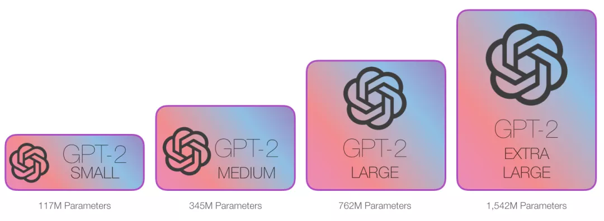Figure: Various GPT models
### Transformer-based language model

As we learned in the Transformer diagram, the original Transformer model is composed of the Encoder part and the Decoder part, both of which are stacked by multiple layers of transformers. The original Transformer's seq2seq structure is very suitable for machine translation, because machine translation is to translate a text sequence into a text sequence in another language.

 Figure: Original Transformer structure

However, if you want to use Transformer to solve language model tasks, you don’t need the complete Encoder and Decoder parts. Therefore, in many research works after the original Transformer, people tried to use only Transformer Encoder or Decoder, and stack them as high as possible, and then use a large amount of training corpus and a large amount of computing resources (hundreds of thousands of dollars are used to train these models) for pre-training. For example, BERT only uses the Encoder part for masked language model (self-encoding) training, and GPT-2 only uses the Decoder part for autoregressive language model training.
 Figure: GPT, BERT, Transformer-XL

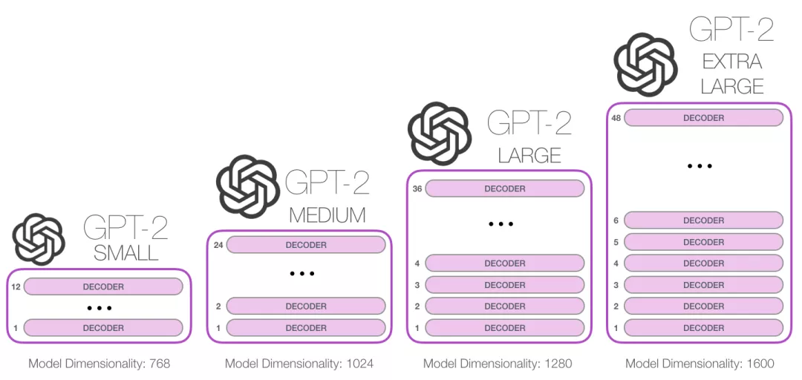 Figure: GPT2 model with more and more layers

### Transformer evolution
Transformer’s Encoder evolved into BERT, and Decoder evolved into GPT2.

First, let's look at the Encoder part.

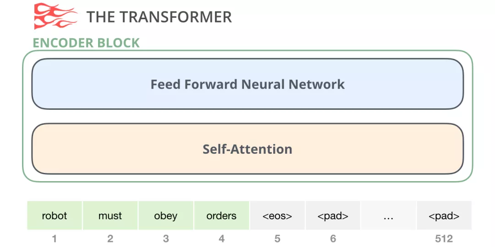

Figure: encoder

The Encoder part in the original Transformer paper accepts input of a specific length (such as 512 tokens). If an input sequence is shorter than this limit, we can use pad to fill the rest of the sequence. As mentioned in Chapter 2.3, BERT directly uses the Encoder part.

Let's review the Decoder part

Compared with the Encoder, the Decoder part has an additional Encoder-Decoder self-attention layer, which allows the Decoder to pay attention to the specific information encoded by the Encoder.

Figure: decoder

The Masked Self-Attention in the Decoder will mask future tokens. Specifically, it does not directly change the input word to a mask randomly like BERT, but masks future word information by changing the calculation of Self-Attention.

For example, if we want to calculate the attention of position 4, we are only allowed to see the tokens before and at position 4.

Figure: The decoder can only see the previous and current tokens

Since GPT2 is built on the decoder, an important difference between BERT and GPT comes: Since BERT is built on the encoder, BERT uses the Self Attention layer, while GPT2 is built on the decoder, and GPT-2 uses masked Self Attention. A normal Self Attention allows a position to pay attention to the information on both sides of it, while masked Self Attention only allows the model to see the information on the left:

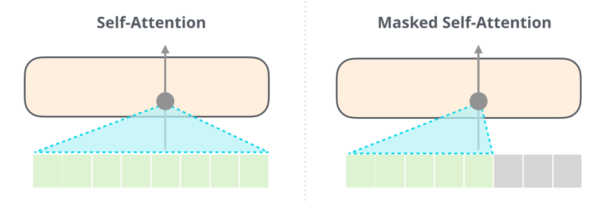Figure: self attention vs mask self attention

So what does the decoder in GPT2 look like? First, let's talk about the article [Generating Wikipedia by Summarizing Long Sequences](https://arxiv.org/pdf/1801.10198.pdf), which first proposed language model training based on the Transformer-Decoder part. Because of removingThe Encoder part is removed, so the Encoder-Decoder self attention is no longer needed, and the new Transformer-Decoder model is shown in the figure below:

Figure: transformer-decoder

OpenAI's GPT2 then also uses the Transformer-Decoder structure shown above.

### GPT2 Overview

Now let's disassemble a trained GPT-2 and see how it works.

Figure: Disassembling GPT2

GPT-2 can process 1024 tokens. Each token passes through all the Decoder layers along its own path. The easiest way to try out a trained GPT-2 model is to let it generate text on its own (this is technically called: generating unconditional text). Alternatively, we can give it a hint to let it talk about a certain topic (i.e. generating interactive conditional samples).

In the case of aimlessness, we can simply feed it a special \<s> initial token to let it start generating words. As shown below:

Figure: GPT2 initial token

Since the model has only one input, there is only one active path. The \<s> token is processed in all Decoder layers in turn, and a vector is generated along this path. A score is calculated for all possible words based on this vector and the model's vocabulary. In the example below, we chose the one with the highest probability, the. Next, we add the output of the first step to our input sequence and ask the model to make the next prediction.

Dynamic graph: Disassembling GPT2

Note that the second path is the only active path in this calculation. Each layer of GPT-2 retains the information it encoded about the first token and uses it directly when processing the second token: GPT-2 does not recalculate the first token based on the second token.

Repeating the above steps over and over again can generate more words.

### GPT2 Detailed Explanation
#### Input Encoding

Now let's learn more about GPT, starting with the input. Like other NLP models we discussed before, GPT-2 looks up the corresponding embedding vector of the input word in the embedding matrix. As shown in the figure below: Each row is the embedding of a wordding: This is a numeric vector that represents a word and captures some meaning. The size of this vector varies in different GPT-2 models. The smallest model uses an embedding size of 768.

Figure: token embedding

So at the beginning, we will look up the embedding of the first token \<s> in the embedding matrix. Before passing this embedding to the first module of the model, we also need to incorporate positional encoding (refer to Chapter 2.2 for detailed explanation of Transformer), which can indicate the order of words in the sequence.

Figure: Position encoding

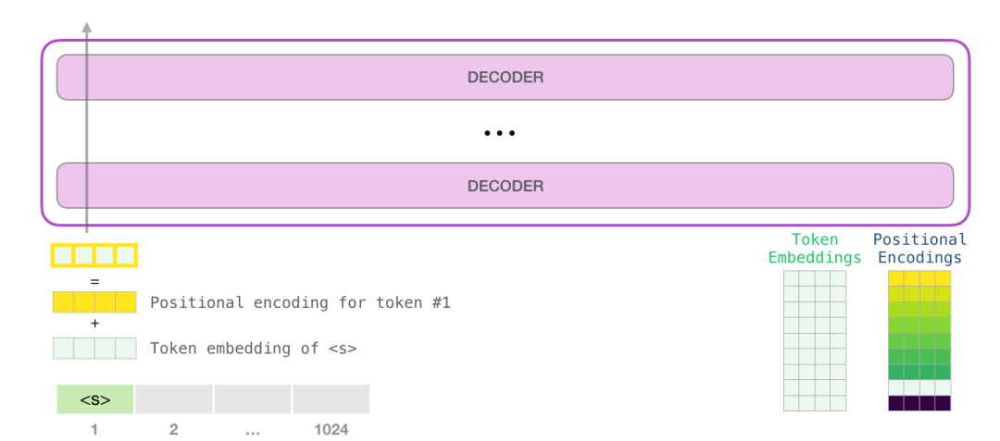Figure: token+position

So the input is processed: get word vector + position encoding

#### Multi-layer Decoder

The first layer of Decoder can now process the vector corresponding to the \<s> token: first through the Self Attention layer, then through the fully connected neural network. Once TransformThe first decoder of ormer processes the \<s> token and still gets a vector, which is sent to the next decoder again.

Figure: Multi-layer encoding

#### Self-Attention in Decoder

The decoder contains Masked Self-Attention. Since the Mask operation can be performed independently, let's review the self-attention operation independently. Language is heavily dependent on context. Here is an example:

```
The Second Law of Robotics: A robot must obey the orders given to it by humans, except when those orders conflict with the First Law.
```

The example sentence contains multiple pronouns. These words cannot be understood or processed without considering the context to which they refer. When a model processes this sentence, it must be able to know:

- It refers to the robot
- The command refers to the previous part of this law, that is, the command given to it by humans
- The first law refers to the first law of robotics

What self-attention does is: it scores the relevance of each word in the sentence fragment and sums the representation vectors of these words weighted by the relevance, so that the model can fuse the information of the word with other related word vectors.For example, as shown in the figure below, the Self Attention layer in the top-level Decoder pays attention to `a robot` when processing the word `it`. Therefore, the `it` vector passed by self-attention to the subsequent neural network is the weighted sum of the vectors corresponding to the three words and their respective scores.

 Figure: it's attention

**Self-Attention Process**

Self-Attention is processed along each token in the sentence, and the main components include 3 vectors.

- Query: The Query vector is obtained by the vector representation of the current word and is used to score all other words (using the key vectors of these words).

- Key: The Key vector is obtained by the vector representation of all words in the sentence and can be regarded as an identification vector.

- Value: The Value vector is actually the same as the Key vector in self-attention.

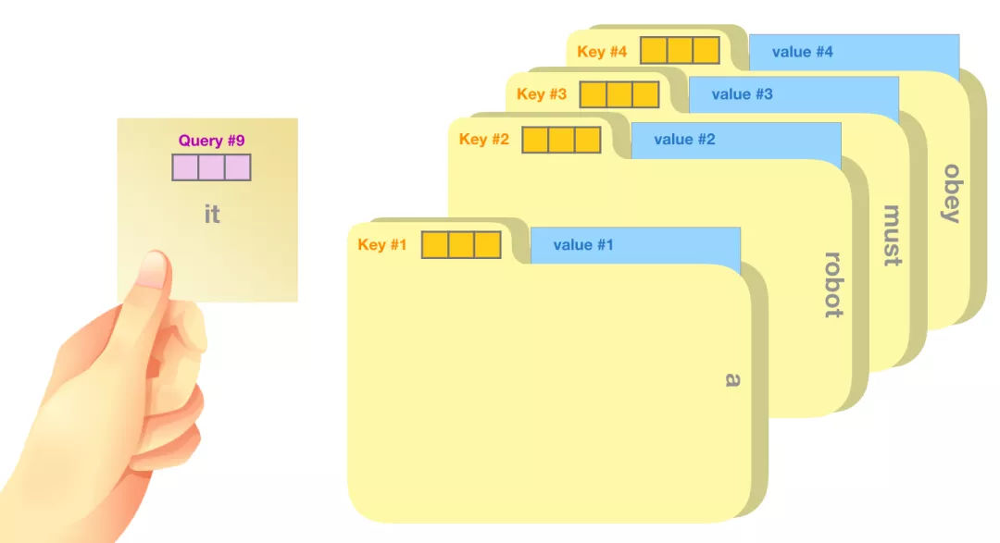Figure: query

A rough analogy is to think of it as searching in a file cabinet, the Query vector is a sticky note that says what you are searching for.The query vector is the topic of research, and the key vector is like the label of the folder in the cabinet. When you match the note to the label, we take out the contents of the folders that match, and these contents are the value vectors. But you are not just looking for one value vector, you are looking for a series of value vectors.

Multiplying the query vector with the key vector of each folder will produce a score for each folder (technically: dot product followed by softmax).

Figure: score

We multiply each value vector by the corresponding score and sum it up to get the output of self attention.

Figure: self attention output

These weighted value vectors will result in a vector, such as the one above, which pays 50% attention to the word robot, 30% attention to the word a, and 19% attention to the word it.

The so-called Masked self attention refers to: turning the attention score corresponding to the mask position into a very small numberWords or 0, so that other words are not considered when self-attention (weighted sum) occurs.

**Model output**

When the decoder layer at the top of the model produces an output vector (this vector is obtained by the self attention layer and the neural network layer), the model multiplies this vector by a huge embedding matrix (vocab size x embedding size) to calculate the correlation score between this vector and all word embedding vectors.

Figure: The top module produces output

Recall that each row in the embedding matrix corresponds to a word in the model vocabulary. The result of this multiplication is interpreted as the score of each word in the model vocabulary, which is converted into a probability after softmax.

Figure: Token probability

We can choose the token with the highest score (top_k=1), or we can consider other words at the same time (top k). Assuming that k tokens are output at each position and n tokens are output in total, the output sequence selected based on the joint probability of n words will be better.

 Figure: top 1 Select output

This way, the model completes one iteration and outputs one word. The model will continue to iterate until all words have been generated or until a token indicating the end of the sentence is output.

## Detailed explanation of Self-Attention

Now we have a basic understanding of how GPT-2 works. If you want to know what is going on inside the Self Attention layer, then the additional section below the article is for you. I added this additional section to explain Self Attention with more visualizations.

Here are some oversimplifications in the article:

- I use tokens and words interchangeably in the article. But in fact, GPT-2 uses Byte Pair Encoding to create tokens in the vocabulary. This means that tokens are usually parts of words.

- The example we show is running in inference mode. That's why it only processes one token at a time. During training, the model will be trained on longer text sequences and process multiple tokens at the same time. Also, during training, the model will process a larger batch size instead of the batch size of 1 used during inference.
- To make it easier to explain the principle, I generally use row vectors in the pictures in this article. But someVectors are actually column vectors. You need to pay attention to the form of these vectors in the code implementation.
- Transformers use a lot of layer normalization, which is important. We touched on this a little bit in the Transformer diagram, but in this post, we’ll focus more on Self-Attention.
- Sometimes I need more boxes to represent a vector, like this:

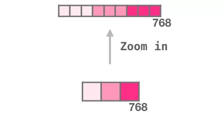Figure: Input and output dimensions

### Visualizing Self-Attention

Earlier in this post, we used this image to show how Self-Attention works on the word `it`.

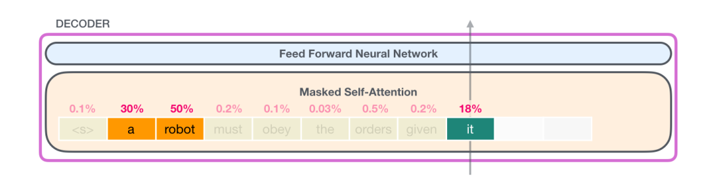Figure: it's attention

In this section, we’ll go into more detail on how to do this. Notice that we’re going to be very clear about what’s happening with each word. That’s why we show a lot of individual vectors, but the actual code implementation is done with giant matrix multiplications.

Let’s look at a simple Transformer that can only process 4 tokens at a time.

Self-AttentionThis is done in 3 steps:

- Create Query, Key, Value matrices for each path.
- For each input token, use its Query vector to score all other Key vectors.
- Multiply the Value vectors by their corresponding scores and sum them.

Figure: 3 steps

(1) Create Query, Key, and Value vectors

Let’s focus on the first path. We will use its Query vector and compare all Key vectors. This will produce a score for each Key vector. The first step of Self Attention is to calculate 3 vectors for each token’s path.

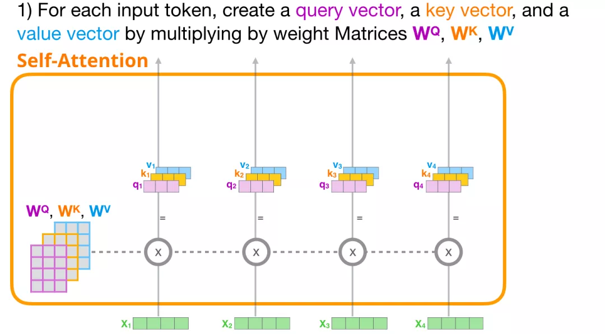Figure: Step 1

(2) Calculate the scores

Now that we have these vectors, we only use the Query and Value vectors for step 2. Since we are interested in the vector of the first token, we multiply the query vector of the first token with the key vectors of all other tokens to get the scores of the four tokens.

Figure: Step 2

(3) Computing the sum

We can now multiply these scores with the Value vector. After we add them together, a Value vector with a high score will take up a large portion of the resulting vector.

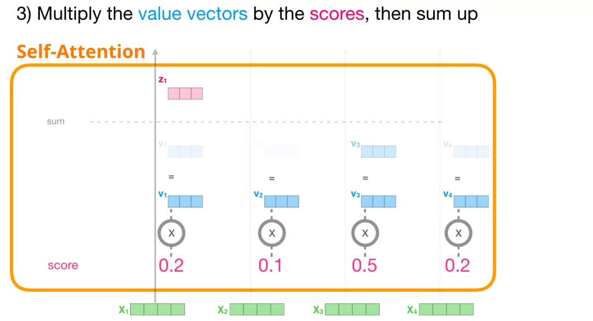Figure: Step 3

The lower the score, the more transparent the Value vector. This is to illustrate that multiplying by a small number dilutes the Value vector.

If we perform the same operation for each path, we will get a vector that represents each token with appropriate contextual information for each token. These vectors are fed into the next sublayer of the Transformer module (the feedforward neural network).

Figure: Summary

### Diagram of Masked Self-attention

Now that we have understood the Self Attention step of the Transformer, let us move on to masked Self Attention. Masked Self Attention is the same as Self Attention except for the second step.

Now suppose the model has 2 tokens as input and we are observing (atIn this case, the last 2 tokens are masked. So the model interferes with the scoring step. It always sets the future token score to 0, so the model cannot see future words, as shown in the figure below:

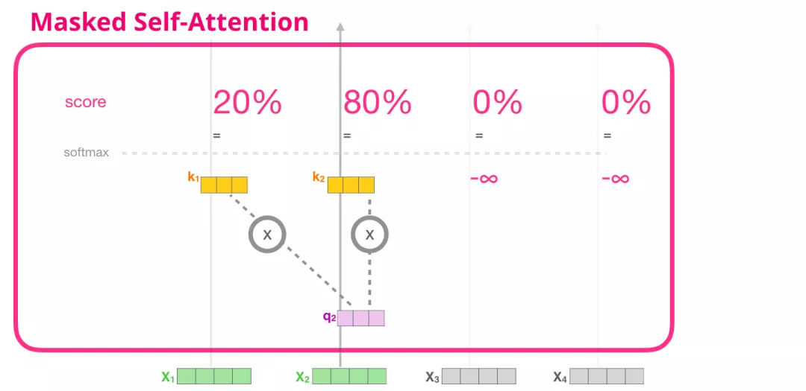Figure: masked self attention

This masking is often implemented with a matrix, called an attention mask matrix. Let's take a sequence of 4 words as an example (e.g. robot must obay orders). In a language modeling scenario, this sequence will be processed in 4 steps: one word per step (assuming that each word is a token now). In addition, since the model works in the form of batch size, we can assume that the batch size of this simple model is 4, and it will process 4 sequence generation tasks as a batch, as shown in the figure below, with input on the left and label on the right.

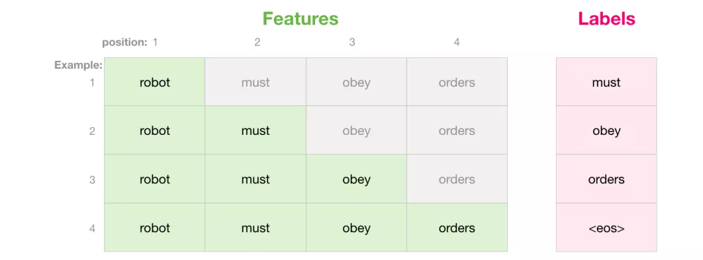Figure: Batch input and output

In matrix form, we use the Query matrix andKey matrix to calculate the score. It can be visualized as follows. But note that words cannot be directly matrix-operated, so the words in the figure below need to be mapped to a vector.

Figure: Correlation matrix of Query and Keys

After the multiplication, we add the triangular attention mask. It sets the cells we want to mask to negative infinity or a very large negative number (such as negative billion in GPT-2):

Figure: Add attetnion mask

Then apply softmax to each row, which will produce the actual score, which we will use for Self Attention.

Figure: softmax

The meaning of this score table is as follows:

- When the model processes the first data in the dataset (row 1), which contains only one word (robot), it focuses 100% of its attention on this word.
- When the model processes the second data in the dataset (row 2), which contains the word (robot must). When the model processes the wordmust, it focuses 48% of its attention on robot and 52% on must.
- And so on, continue to process the following words.

So far, we have understood masked self attention.

### Self-Attention in GPT2

Let's take a closer look at GPT-2's masked self attention.

*When the model predicts: one token at a time*

But when we use the model to predict, the model only adds a new word after each iteration, so for the token that has been processed, it is inefficient to recalculate Self Attention along the previous path. So how does GPT-2 achieve efficient processing?

First process the first token a, as shown in the figure below (ignore \<s> for now).

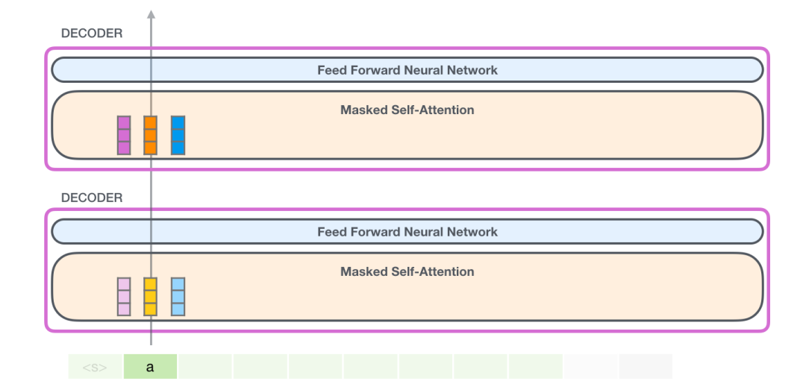Figure: gpt2 first token

GPT-2 saves the Key vector and Value vector of token `a`. Each Self Attention layer holds the Key vector and Value vector corresponding to this token:

Figure: gpt2 word a

Now in the next iteration, when the model processes the word robot, it does not need to generate the Query, Value, and Key vectors for token a. It just needs to reuse the corresponding vectors saved in the first iteration:

Figure: gpt2 word robot

`(1) Create Query, Key, and Value matrices`

Let's assume that the model is processing the word `it`. Before entering the Decoder, the input corresponding to this token is the embedding of `it` plus the positional encoding of the 9th position:

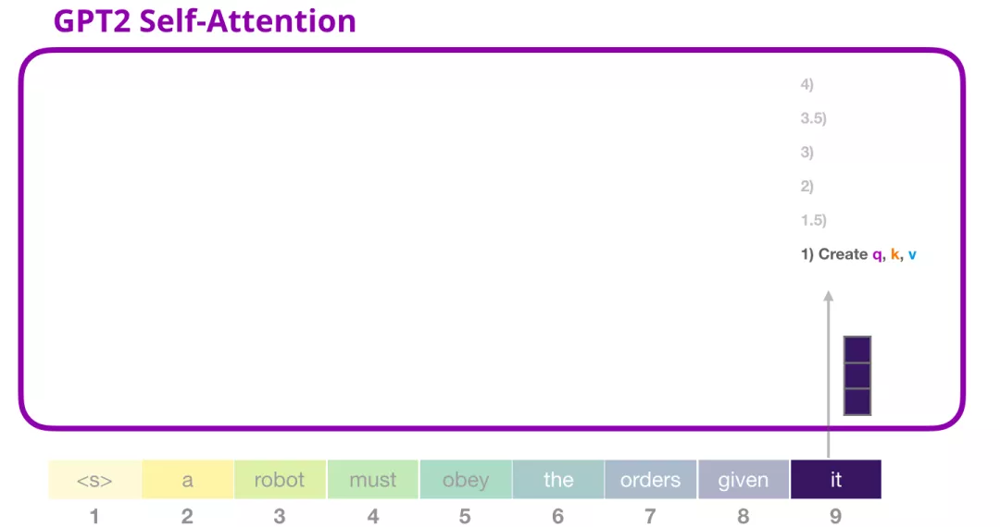Figure: Processing it

Each layer in the Transformer has its own parameter matrix (which will be disassembled and shown later). The weight matrix of the embedding vector we first encounter is used to create the Query, Key, and Value vectors.

Figure: Process it

Self-Attention multiplies its input by the weight matrix (and adds a bias vector, not shown here)This multiplication will result in a vector, which is the concatenation of the Query, Key, and Value vectors.
Figure: Query, Key, and Value

After obtaining the Query, Key, and Value vectors, we split them into multi-head, as shown in the figure below. In essence, it is to split a large vector into multiple small vectors.

Figure: multi head

To better understand multi head, we will show it as follows:

Figure: multi head

`(2) Scoring`

We can now proceed with scoring, assuming that we only focus on one attention head (other attention heads are also performing similar operations).

Figure: Scoring

Now, this token can be scored based on the key vectors of all other tokens (these key vectors are calculated by the first attention head in the previous iteration)):

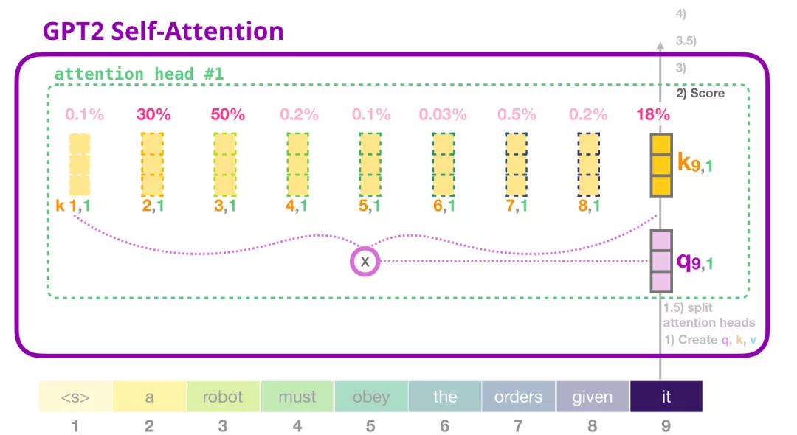Figure: Weighted sum

`(3) Sum`

As we have seen before, we now multiply each Value vector by the corresponding score and then add them up to get the Self Attention result of the first attention head:

Figure:

`Merge attention heads`

Multi head corresponds to multiple weighted sum vectors, and we concatenate them again:

Figure: Concatenate multiple weighted sum vectors of multi head

Then the obtained vector is subjected to a linear mapping to obtain the desired dimension and then input into the fully connected network.

`(4) Mapping (projection)`

We will let the model learn how to convert the concatenated Self Attention results into input that can be processed by the feedforward neural network. Here, we use a second huge weight matrix to map the results of the attention heads to the output vector of the Self Attention sublayer:

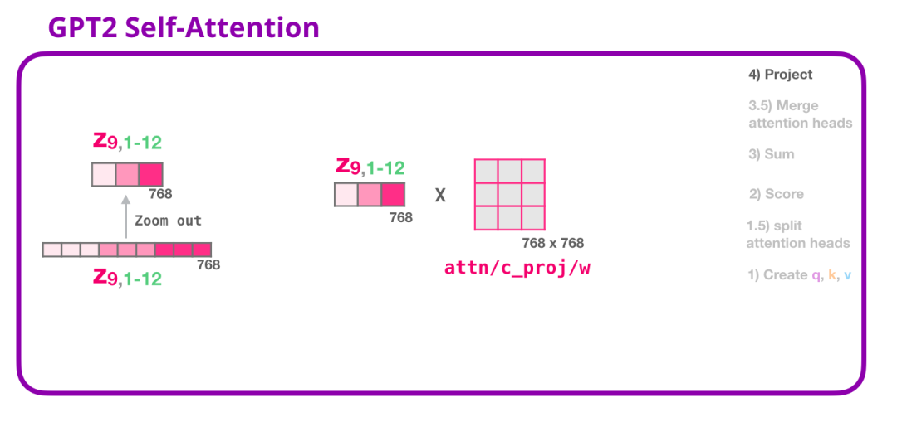Figure: MappingThrough the above steps, we have generated a vector, which we can pass to the next layer:

Figure: Pass to the next layer

### GPT-2 fully connected neural network

`Layer 1`

The fully connected neural network is used to process the output of the Self Attention layer, and the representation of this output contains the appropriate context. The fully connected neural network consists of two layers. The first layer is 4 times the size of the model (since GPT-2 small is 768, this network will have 3072 neurons).

Dynamic image: Fully connected layer

The bias vector is not shown

`Layer 2. Map the vector to the model dimension`

The second layer maps the result of the first layer back to the model dimension (768 in GPT-2 small). The result of this multiplication is the output of the Transformer for this token.

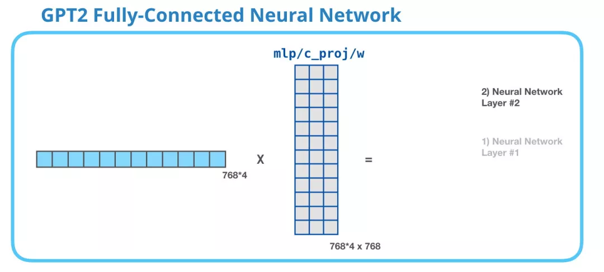Figure: Fully connected layer

Bias vector is not shown

To summarize, our input will encounter the following weight matrices:

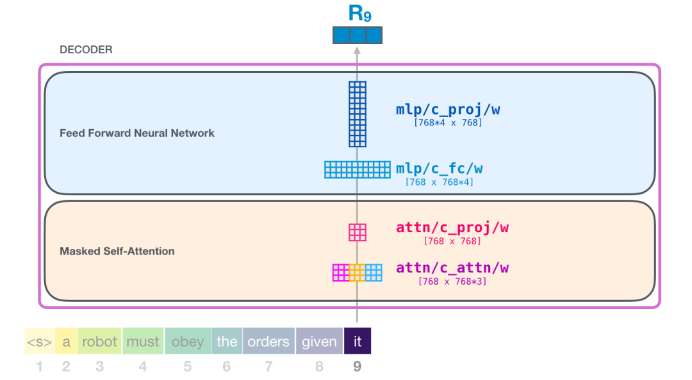Figure: Summary

Each module hasits own weights. On the other hand, the model only has one token embedding matrix and one positional encoding matrix.

Figure: Summary

If you want to see all the parameters of the model, I have counted them here:

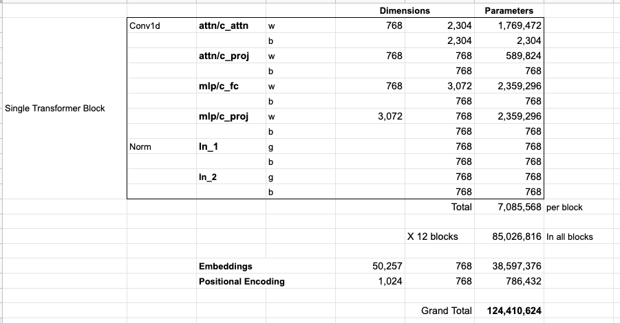Figure: Summary
For some reason, they add up to 124M instead of 117M. I'm not sure why, but this is the size shown in the released code (please correct me if I'm wrong).

## Language Model Applications

The Transformer with only a decoder has been showing good results outside of language models. It has been successfully used in many applications, and we can describe these successful applications with visualizations like the above. Let's look at these applications to end this post.

### Machine Translation

Encoders are not required for machine translation. We can solve the same task using a Transformer with only a Decoder:

Figure: Translation

### Generate Summary

This is the first task to be trained using a Transformer with only a Decoder. It is trained to read a text withWikipedia articles (with the beginning removed before the table of contents), and then generate summaries. The actual beginning of the article is used as the label for the training data:
Figure:

The paper trains the model on Wikipedia articles, so the model can summarize articles and generate summaries:

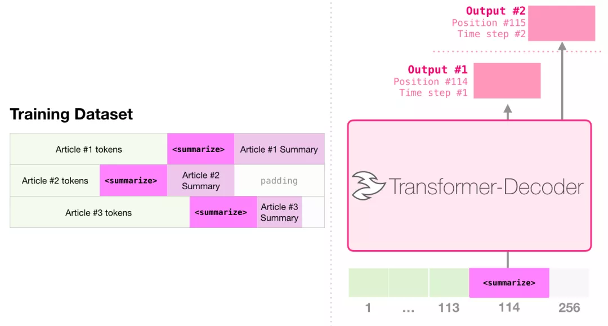Figure: Summary

### Transfer Learning

In Sample Efficient Text Summarization Using a Single Pre-Trained Transformer(https://arxiv.org/abs/1905.08836), a Transformer with only a decoder is first pre-trained on a language model and then fine-tuned to generate summaries. The results show that it can achieve better results than a pre-trained Encoder-Decoder Transformer when the amount of data is limited.

The GPT-2 paper also shows the results of generating summaries pre-trained on a language model.

### Music Generation

Music Transformer (https://magenta.tensorflow.org/music-transformer) The paper uses a decoder-only Transformer to generate expressive temporal and dynamic music. Music Modeling Just like language modeling, you just let the model learn music in an unsupervised way and then let it sample the output (we called this a walk earlier).

You might be curious about how music is represented in this scenario. Remember that language modeling can represent characters, words, or parts of words (tokens), as vectors. In musical performances (let's think about piano), we have to represent not only the notes, but also the velocity - a measure of how hard the piano keys are pressed.

Figure: Music Generation

A performance is a series of one-hot vectors. A midi file can be converted to the following format. The paper uses the following input sequence as an example:

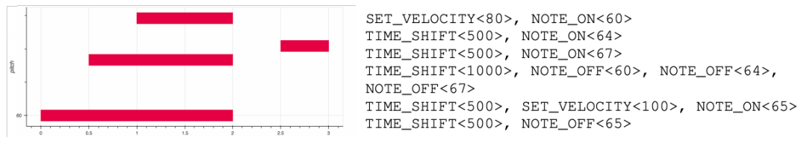Figure: Music Generation

The one-hot vector representation of this input sequence is as follows:

Figure: Music Generation

I like the Self Attention visualization shown by the Music Transformer in the paper. I added some annotations on top of it:

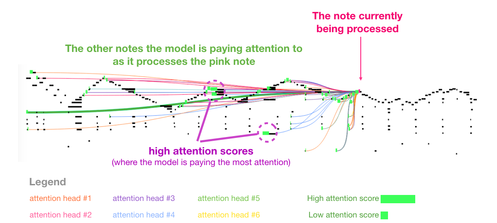Figure: Music Generation

This piece of music has a recurring triangular outline. The query matrix is ​​located at a peak in the back, and it pays attention to the high notes of all the previous peaks to know the beginning of the music. This picture shows a query vector (the source of all attention lines) and the memory of the previous attention (those highlighted notes that receive a larger softmax probability). The color of the attention line corresponds to different attention heads, and the width corresponds to the weight of the softmax probability.

## Summary

Now, we have ended our journey of GPT-2 and the exploration of its parent model (Transformer with only Decoder). I hope that after reading this article, you will have a better understanding of Self Attention and I hope you will have a better understanding of what happens inside the Transformer.

## Acknowledgements
Mainly translated by Zhang Xian from Harbin Institute of Technology (with the authorization of the original author), and organized and sorted by Duoduo.