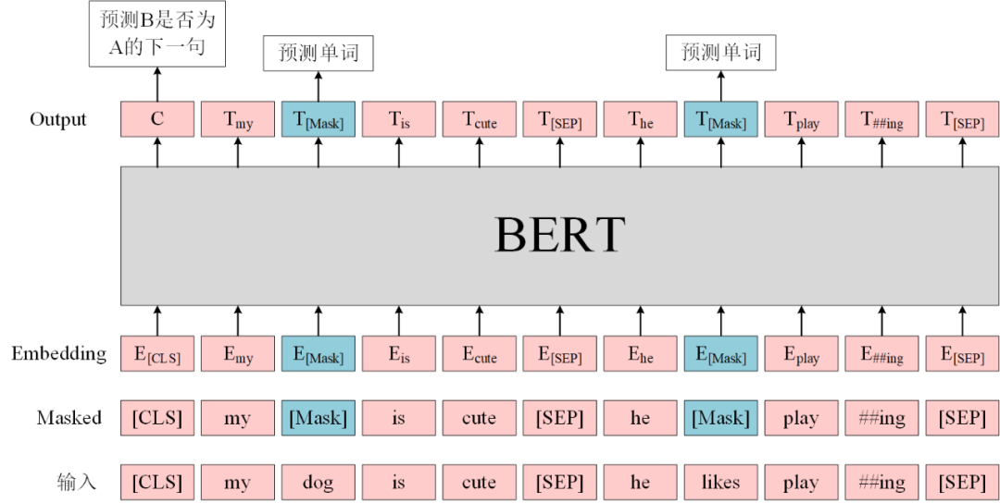
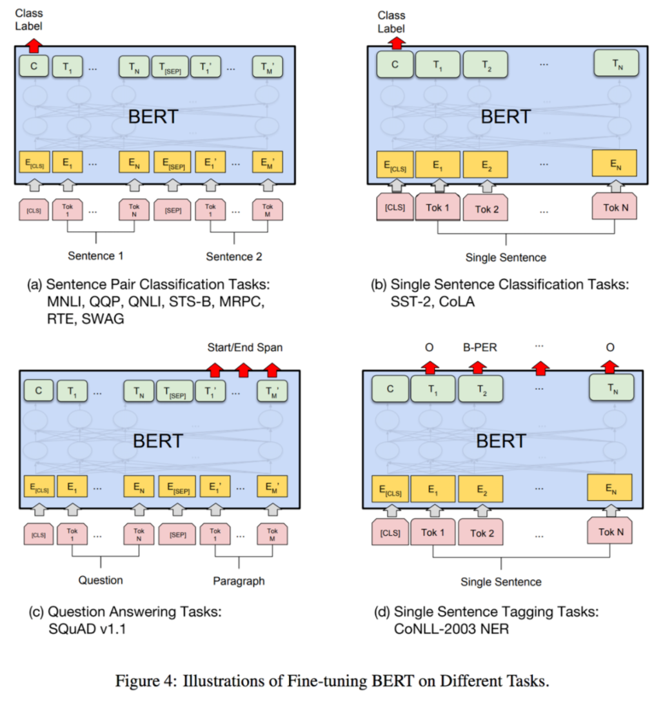
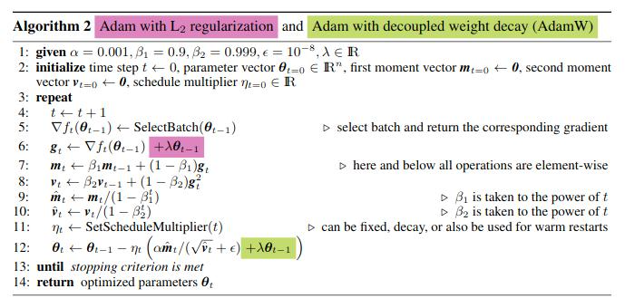

## Preface
Following the previous section, we conducted an in-depth study of the Bert model in the Huggingface open source code library. In this section, we will explain in detail how to apply BERT.

The jupyter involved can be found in [Code Library: Chapter 3-Write a Transformer Model: BERT, Download](https://github.com/datawhalechina/learn-nlp-with-transformers/tree/main/docs/%E7%AF%87%E7%AB%A03-%E7%BC%96%E5%86%99%E4%B8%80%E4%B8%AATransformer%E6%A8%A1%E5%9E%8B%EF%BC%9ABERT)

This article is based on the BERT-related code of the pytorch version of the Transformers version 4.4.2 (released on March 19, 2021) project, and analyzes it from the perspective of code structure, specific implementation and principle, and use, including the following:

3. BERT-based Models application model
4. BERT training and optimization
5. Bert solves NLP tasks
- BertForSequenceClassification
-BertForMultiChoice
- BertForTokenClassification
- BertForQuestionAnswering
6. BERT training and optimization
7. Pre-Training
- Fine-Tuning
- AdamW
- Warmup

## 3-BERT-based Models
BERT-based models are written in /models/bert/modeling_bert.py, including BERT pre-training models and BERT classification models.

First of all, all the following models are based on the abstract base class `BertPreTrainedModel`, while the latter is based on a larger base class `PreTrainedModel`. Here we focus on the functions of `BertPreTrainedModel`:

It is used to initialize the model weights and maintain some tag identities inherited from `PreTrainedModel` or class variables when loading the model.

Below, we start with the pre-trained model analysis.

*** 
### 3.1 BertForPreTraining

As we all know, BERT pre-training tasks include two:

- Masked Language Model (MLM): Randomly replace some words in the sentence with `[MASK]`, then pass the sentence into BERT to encode the information of each word, and finally use the encoded information of `[MASK]` to predict the correct word at that position. This task aims to train the model to understand the meaning of words based on the context;
- Next Sentence Prediction (NSP): Input sentence pairs A and B into BERT, and use the encoded information of `[CLS]` to predict whether B is the next sentence of A. This task aims to train the model to understand the relationship between predicted sentences.

 Figure Bert Pre-training

Corresponding to the code, this model that combines the two tasks is BertForPreTraining, which contains two components:
```
class BertForPreTraining(BertPreTrainedModel):
def __init__(self, config):
super().__init__(config)

self.bert = BertModel(config)
self.cls = BertPreTrainingHeads(config)

self.init_weights()
# ...
```
The BertModel here has been introduced in detail in the previous chapter (note that the default setting here is `add_pooling_layer=True`, which means that the output corresponding to `[CLS]` will be extracted for the NSP task), and `BertPreTrainingHeads` is the prediction module responsible for the two tasks:
```
class BertPreTrainingHeads(nn.Module):
def __init__(self, config):
super().__init__()
self.predictions = BertLMPredictionHead(config)
self.seq_relationship = nn.Linear(config.hidden_size, 2)

def forward(self, sequence_output, pooled_output):
prediction_scores = self.predictions(sequence_output)
seq_relationship_score = self.seq_relationship(pooled_output)
return prediction_scores, seq_relationship_score 
```
Another layer of encapsulation: `BertPreTrainingHeads` wraps `BertLMPredictionHead` and a linear layer representing the NSP task. Here, the task corresponding to NSP is not encapsulated in a `BertXXXPredictionHead`.

**Actually, this class is encapsulated, but it is called BertOnlyNSPHead, which is not used here**

Continue to explore `BertPreTrainingHeads`:
```
class BertLMPredictionHead(nn.Module):
def __init__(self, config):
super().__init__()
self.transform = BertPredictionHeadTransform(config)

# The output weights are the same as the input embeddings, but there is
# an output-only bias for each token.
self.decoder = nn.Linear(config.hidden_size, config.vocab_size, bias=False)

self.bias = nn.Parameter(torch.zeros(config.vocab_size))

# Need a link between the two variables so that the bias is correctly resized with `resize_token_embeddings`
self.decoder.bias = self.bias

def forward(self, hidden_states):
hidden_states =self.transform(hidden_states)
hidden_states = self.decoder(hidden_states)
return hidden_states
```

This class is used to predict the output of the `[MASK]` position as the classification output of each word as a category. Note:

- This class reinitializes a full 0 vector as the bias of the prediction weight;

- The output shape of this class is [batch_size, seq_length, vocab_size], that is, predicting the probability value of what category each word in each sentence is (note that softmax is not done here);
- Another encapsulated class: BertPredictionHeadTransform, used to complete some linear transformations:
```
class BertPredictionHeadTransform(nn.Module):
def __init__(self, config):
super().__init__()
self.dense = nn.Linear(config.hidden_size, config.hidden_size)
if isinstance(config.hidden_act, str):
self.transform_act_fn = ACT2FN[config.hidden_act]
else:
self.transform_act_fn = config.hidden_act
self.LayerNorm = nn.LayerNorm(config.hidden_size, eps=config.layer_norm_eps)

def forward(self, hidden_states):
hidden_states = self.dense(hidden_states)
hidden_states = self.transform_act_fn(hidden_states)
hidden_states = self.LayerNorm(hidden_states)
return hidden_states
```

Back to `BertForPreTraining`, let's continue to see how the two blocks `loss` are processed. Its forward propagation is different from BertModel, with two more inputs, `labels` and `next_sentence_label`:

- labels: The shape is [batch_size, seq_length], representing the label of the MLM task. Note that here it is set to -100 for the originally unmasked words, and only the masked words will have their corresponding ids, which is the opposite of the task setting.

- For example, the original sentence is I want to [MASK] an apple, here I mask the word eat and input the model, and the corresponding label is set to [-100, -100, -100, [eat corresponding id], -100, -100];

- Why is it set to -100 instead of other numbers? Because torch.nn.CrossEntropyLoss defaults to ignore_index=-100, which means that loss will not be calculated for the category input with label 100.

- next_sentence_label: This input is very simple, it is a binary classification label of 0 and 1.

```
# ...
def forward(
self,
input_ids=None,
attention_mask=None,
token_type_ids=None,
position_ids=None,
head_mask=None,
inputs_embeds=None,
labels=None,
next_sentence_label=None,
output_attentions=None,
output_hidden_states=None,
return_dict=None,
): ...
```

The combination of the next two parts of loss:
```
# ...
total_loss = None
if labels is not None and next_sentence_label is not None:
loss_fct = CrossEntropyLoss()
masked_lm_loss = loss_fct(prediction_scores.view(-1, self.config.vocab_size), labels.view(-1))
next_sentence_loss = loss_fct(seq_relationship_score.view(-1, 2), next_sentence_label.view(-1))
total_loss = masked_lm_loss + next_sentence_loss
# ...
```

Direct addition, that's such a simple strategy.
Of course, this code also includes the BERT model for pre-training only a single target (the specific details are not expanded):
- BertForMaskedLM: only pre-training for MLM tasks;
- Based on BertOnlyMLMHead, which is also another layer of encapsulation of BertLMPredictionHead;
- BertLMHeadModel: The difference between this and the previous one is that this model is used as a decoder;
- Also based on BertOnlyMLMHead;
- BertForNextSentencePrediction: only pre-training for NSP tasks.
- Based on BertOnlyNSPHead, the content is a linear layer.

```python
_CHECKPOINT_FOR_DOC = "bert-base-uncased"
_CONFIG_FOR_DOC = "BertConfig"
_TOKENIZER_FOR_DOC = "BertTokenizer"
from transformers.models.bert.modeling_bert import *
from transformers.models.bert.configuration_bert import *
class BertForPreTraining(BertPreTrainedModel):
def __init__(self, config):
super().__init__(config)

self.bert = BertModel(config)self.cls = BertPreTrainingHeads(config)

self.init_weights()

def get_output_embeddings(self):
return self.cls.predictions.decoder

def set_output_embeddings(self, new_embeddings):
self.cls.predictions.decoder = new_embeddings

@add_start_docstrings_to_model_forward(BERT_INPUTS_DOCSTRING.format("batch_size, sequence_length"))
@replace_return_docstrings(output_type=BertForPreTrainingOutput, config_class=_CONFIG_FOR_DOC)
def forward(
self,input_ids=None,
attention_mask=None,
token_type_ids=None,
position_ids=None,
head_mask=None,
inputs_embeds=None,
labels=None,
next_sentence_label=None,
output_attentions=None,
output_hidden_states=None,
return_dict=None,
):
r"""
labels (:obj:`torch.LongTensor` of shape ``(batch_size, sequence_length)``, `optional`):
Labels for computing the masked language modeling loss. Indicesshould be in ``[-100, 0, ...,
config.vocab_size]`` (see ``input_ids`` docstring) Tokens with indices set to ``-100`` are ignored
(masked), the loss is only computed for the tokens with labels in ``[0, ..., config.vocab_size]``
next_sentence_label (``torch.LongTensor`` of shape ``(batch_size,)``, `optional`):
Labels for computing the next sequence prediction (classification) loss. Input should be a sequence pair
(see :obj:`input_ids` docstring)ng) Indices should be in ``[0, 1]``:
- 0 indicates sequence B is a continuation of sequence A,
- 1 indicates sequence B is a random sequence.
kwargs (:obj:`Dict[str, any]`, optional, defaults to `{}`):
Used to hide legacy arguments that have been deprecated.
Returns:
Example::
from transformers import BertTokenizer, BertForPreTraining
import torch
tokenizer = BertTokenizer.from_pretrained('bert-base-uncased')
model = BertForPreTraining.from_pretrained('bert-base-uncased')
inputs = tokenizer("Hello, my dog ​​is cute", return_tensors="pt")
outputs = model(**inputs)
prediction_logits = outputs.prediction_logits
seq_relationship_logits = outputs.seq_relationship_logits
"""
return_dict = return_dict if return_dict is not None else self.config.use_return_dict

outputs = self.bert(
input_ids,
attention_mask=attention_mask,
token_type_ids=token_type_ids,
position_ids=position_ids,
head_mask=head_mask,
inputs_embeds=inputs_embeds,
output_attentions=output_attentions,
output_hidden_states=output_hidden_states,
return_dict=return_dict,
)

sequence_output, pooled_output = outputs[:2]
prediction_scores, seq_relationship_score = self.cls(sequence_output, pooled_output)

total_loss = None
if labels is not None and next_sentence_label is not None:
loss_fct = CrossEntropyLoss()
masked_lm_loss = loss_fct(prediction_scores.view(-1, self.config.vocab_size), labels.view(-1))
next_sentence_loss = loss_fct(seq_relationship_score.view(-1, 2), next_sentence_label.view(-1))
total_loss = masked_lm_loss + next_sentence_loss

if not return_dict:
output = (prediction_scores, seq_relationship_score) + outputs[2:]
return ((total_loss,) + output) if total_loss is not None else output

return BertForPreTrainingOutput(
loss=total_loss,
prediction_logits=prediction_scores,
seq_relationship_logits=seq_relationship_score,
hidden_states=outputs.hidden_states,
attentions=outputs.attentions,
)

from transformers import BertTokenizer, BertForPreTraining
import torch
tokenizer = BertTokenizer.from_pretrained('bert-base-uncased')
model = BertForPreTraining.from_pretrained('bert-base-uncased')
inputs = tokenizer("Hello, my dog ​​is cute", return_tensors="pt")
outputs = model(**inputs)
prediction_logits = outputs.prediction_logits
seq_relationship_logits = outputs.seq_relationship_logits
```

Some weights of BertForPreTraining were not initialized from the model checkpoint at bert-base-uncased and are newly initialized: ['cls.predictions.decoder.bias']
You should probably TRAIN this model on a down-stream task to be able to use it for predictions and inference.

```python
@add_start_docstrings(
"""Bert Model with a `language modeling` head on top for CLM fine-tuning. """, BERT_START_DOCSTRING
)
class BertLMHeadModel(BertPreTrainedModel):

_keys_to_ignore_on_load_unexpected = [r"pooler"]
_keys_to_ignore_on_load_missing = [r"position_ids", r"predictions.decoder.bias"]

def __init__(self, config):
super().__init__(config)

if not config.is_decoder:
logger.warning("If you want to use `BertLMHeadModel` as a standalone, add `is_decoder=True.`")

self.bert = BertModel(config, add_pooling_layer=False)
self.cls = BertOnlyMLMHead(config)

self.init_weights()

def get_output_embeddings(self):
return self.cls.predictions.decoder

def set_output_embeddings(self, new_embeddings):
self.cls.predictions.decoder = new_embeddings

@add_start_docstrings_to_model_forward(BERT_INPUTS_DOCSTRING.format("batch_size, sequence_length"))
@replace_return_docstrings(output_type=CausalLMOutputWithCrossAttentions, config_class=_CONFIG_FOR_DOC)
def forward(
self,
input_ids=None,
attention_mask=None,
token_type_ids=None,
position_ids=None,
head_mask=None,
inputs_embeds=None,
encoder_hidden_states=None,
encoder_attention_mask=None,
labels=None,
past_key_values=None,
use_cache=None,
output_attentions=None,
output_hidden_states=None,
return_dict=None,
):
r"""
encoder_hidden_states (:obj:`torch.FloatTensor` of shape :obj:`(batch_size, sequence_length, hidden_size)`, `optional`):
Sequence of hidden-states at the output of the last layer of the encoder. Used in the cross-attention if
the model is configured as a decoder.
encoder_attention_mask (:obj:`torch.FloatTensor` of shape :obj:`(batch_size, sequence_length)`, `optional`):
Mask to avoid performing attention on the padding token indices of the encoder input. This maskis used in
the cross-attention if the model is configured as a decoder. Mask values ​​selected in ``[0, 1]``:
- 1 for tokens that are **not masked**,
- 0 for tokens that are **masked**.
labels (:obj:`torch.LongTensor` of shape :obj:`(batch_size, sequence_length)`, `optional`):
Labels for computing the left-to-right language modeling loss (next word prediction). Indices should be in
``[-100, 0, ..., config.vocab_size]`` (see ``input_ids`` docstring) Tokens with indices set to ``-100`` are ignored (masked), the loss is only computed for the tokens with labels n ``[0, ..., config.vocab_size]`` past_key_values ​​(:obj:`tuple(tuple(torch.FloatTensor))` of length :obj:`config.n_layers` with each tuple having 4 tensors of shape :obj:`(batch_size, num_heads, sequence_length - 1, embed_size_per_head)`): Contains precomputed key and value hidden states of the attention blocks. Can be used to speed updecoding.
If :obj:`past_key_values` are used, the user can optionally input only the last :obj:`decoder_input_ids`
(those that don't have their past key value states given to this model) of shape :obj:`(batch_size, 1)`
instead of all :obj:`decoder_input_ids` of shape :obj:`(batch_size, sequence_length)`.
use_cache (:obj:`bool`, `optional`):
If set to :obj:`True`, :obj:`past_key_values` key value states are returned and can be used to speedup
decoding (see :obj:`past_key_values`).
Returns:
Example::
from transformers import BertTokenizer, BertLMHeadModel, BertConfig
import torch
tokenizer = BertTokenizer.from_pretrained('bert-base-cased')
config = BertConfig.from_pretrained("bert-base-cased")
config.is_decoder = True
model = BertLMHeadModel.from_pretrained('bert-base-cased', config=config)
inputs = tokenizer("Hello, mydog is cute", return_tensors="pt")
outputs = model(**inputs)
prediction_logits = outputs.logits
""
return_dict = return_dict if return_dict is not None else self.config.use_return_dict
if labels is not None:
use_cache = False

outputs = self.bert(
input_ids,
attention_mask=attention_mask,
token_type_ids=token_type_ids,
position_ids=position_ids,
head_mask=head_mask,inputs_embeds=inputs_embeds,
encoder_hidden_states=encoder_hidden_states,
encoder_attention_mask=encoder_attention_mask,
past_key_values=past_key_values,
use_cache=use_cache,
output_attentions=output_attentions,
output_hidden_states=output_hidden_states,
return_dict=return_dict,
)

sequence_output = outputs[0]
prediction_scores = self.cls(sequence_output)

lm_loss = Noneif labels is not None:
# we are doing next-token prediction; shift prediction scores and input ids by one
shifted_prediction_scores = prediction_scores[:, :-1, :].contiguous()
labels = labels[:, 1:].contiguous()
loss_fct = CrossEntropyLoss()
lm_loss = loss_fct(shifted_prediction_scores.view(-1, self.config.vocab_size), labels.view(-1))

if not return_dict:
output = (prediction_scores,) + outputs[2:]return ((lm_loss,) + output) if lm_loss is not None else output

return CausalLMOutputWithCrossAttentions(
loss=lm_loss,
logits=prediction_scores,
past_key_values=outputs.past_key_values,
hidden_states=outputs.hidden_states,
attentions=outputs.attentions,
cross_attentions=outputs.cross_attentions,
)

def prepare_inputs_for_generation(self, input_ids, past=None, attention_mask=None, **model_kwargs):input_shape = input_ids.shape
# if model is used as a decoder in encoder-decoder model, the decoder attention mask is created on the fly
if attention_mask is None:
attention_mask = input_ids.new_ones(input_shape)

# cut decoder_input_ids if past is used
if past is not None:
input_ids = input_ids[:, -1:]

return {"input_ids": input_ids, "attention_mask": attention_mask, "past_key_values": past}

def _reorder_cache(self, past, beam_idx):
reordered_past = ()
for layer_past in past:
reordered_past += (tuple(past_state.index_select(0, beam_idx) for past_state in layer_past),)
return reordered_past

from transformers import BertTokenizer, BertLMHeadModel, BertConfig
import torch
tokenizer = BertTokenizer.from_pretrained('bert-base-uncased')
config = BertConfig.from_pretrained("bert-base-uncased")
config.is_decoder = True
model = BertLMHeadModel.from_pretrained('bert-base-uncased', config=config)
inputs = tokenizer("Hello, my dog ​​is cute", return_tensors="pt")
outputs = model(**inputs)
prediction_logits = outputs.logits
```

Some weights of the model checkpoint at bert-base-uncased were not used when initializing BertLMHeadModel: ['cls.seq_relationship.weight', 'cls.seq_relationship.bias']
- This IS expected if you are initializing BertLMHeadModel from the checkpoint of a model trained on another task or with another architecture (e.g. initializing a BertForSequenceClassification model from a BertForPreTraining model).
- This IS NOT expected if you are initializing BertLMHeadModel from the checkpoint of a model that you expect to be exactly identical (initializing a BertForSequenceClassification model from a BertForSequenceClassification model).

```python
class BertForNextSentencePrediction(BertPreTrainedModel):
def __init__(self, config):
super().__init__(config)

self.bert = BertModel(config)
self.cls = BertOnlyNSPHead(config)

self.init_weights()

@add_start_docstrings_to_model_forward(BERT_INPUTS_DOCSTRING.format("batch_size, sequence_length"))
@replace_return_docstrings(output_type=NextSentencePredictorOutput, config_class=_CONFIG_FOR_DOC)
def forward(
self,
input_ids=None,
attention_mask=None,
token_type_ids=None,
position_ids=None,
head_mask=None,
inputs_embeds=None,
labels=None,
output_attentions=None,
outputt_hidden_states=None,
return_dict=None,
**kwargs,
):
r"""
labels (:obj:`torch.LongTensor` of shape :obj:`(batch_size,)`, `optional`):
Labels for computing the next sequence prediction (classification) loss. Input should be a sequence pair
(see ``input_ids`` docstring). Indices should be in ``[0, 1]``:
- 0 indicates sequence B is a continuation of sequence A,
- 1 indicates sequence B is a random sequence.Returns:
Example::
from transformers import BertTokenizer, BertForNextSentencePrediction
import torch
tokenizer = BertTokenizer.from_pretrained('bert-base-uncased')
model = BertForNextSentencePrediction.from_pretrained('bert-base-uncased')
prompt = "In Italy, pizza served in formal settings, such as at a restaurant, is presented unsliced."
next_sentence = "The sky is blue due to the shorter wavelength of blue light."
encoding = tokenizer(prompt, next_sentence, return_tensors='pt')
outputs = model(**encoding, labels=torch.LongTensor([1]))
logits = outputs.logits
assert logits[0, 0] < logits[0, 1] # next sentence was random
"""

if "next_sentence_label" in kwargs:
warnings.warn(
"The `next_sentence_label` argument is deprecated and will be removed in a future version, use `labels` instead.",
FutureWarning,
)
labels = kwargs.pop("next_sentence_label")

return_dict = return_dict if return_dictct is not None else self.config.use_return_dict

outputs = self.bert(
input_ids,
attention_mask=attention_mask,
token_type_ids=token_type_ids,
position_ids=position_ids,
head_mask=head_mask,
inputs_embeds=inputs_embeds,
output_attentions=output_attentions,
output_hidden_states=output_hidden_states,
return_dict=return_dict,
)

pooled_output = outputs[1]

seq_relationship_scores = self.cls(pooled_output)

next_sentence_loss = None
if labels is not None:
loss_fct = CrossEntropyLoss()
next_sentence_loss = loss_fct(seq_relationship_scores.view(-1, 2), labels.view(-1))

if not return_dict:
output = (seq_relationship_scores,) + outputs[2:]
return ((next_sentence_loss,) + output) if next_sentence_loss is not None else output

return NextSentencePredictorOutput(
loss=next_sentence_loss,
logits=seq_relationship_scores,
hidden_states=outputs.hidden_states,
attentions=outputs.attentions,
)
from transformers import BertTokenizer, BertForNextSentencePrediction
import torch
tokenizer = BertTokenizer.from_pretrained('bert-base-uncased')
model = BertForNextSentencePrediction.from_pretrained('bert-base-uncased')
prompt = "In Italy, pizza served in formal settings, such as at a restaurant, is presented unsliced."
next_sentence = "The sky is blue due to the shorter wavelength of blue light."
encoding = tokenizer(prompt, next_sentence, return_tensors='pt')
outputs = model(**encoding, labels=torch.LongTensor([1]))
logits = outputs.logits
assert logits[0, 0] < logits[0, 1] # next sentence was random
```

Downloading: 100%|██████████| 440M/440M [00:30<00:00, 14.5MB/s]
Some weights of the model checkpoint at bert-base-uncased were not used when initializing BertForNextSentencePrediction: ['cls.predictions.bias','cls.predictions.transform.dense.weight', 'cls.predictions.transform.dense.bias', 'cls.predictions.decoder.weight', 'cls.predictions.transform.LayerNorm.weight', 'cls.predictions.transform.LayerNorm.bias']
- This IS expected if you are initializing BertForNextSentencePrediction from the checkpoint of a model trained on another task or with another architecture (e.g. initializing a BertForSequenceClassification model from a BertForPreTraining model).
- This IS NOT expected if you are initializing BertForNextSentencePrediction from the checkpoint of a model trained on another task or with another architecture (e.g. initializing a BertForSequenceClassification model from a BertForPreTraining model).tializing BertForNextSentencePrediction from the checkpoint of a model that you expect to be exactly identical (initializing a BertForSequenceClassification model from a BertForSequenceClassification model).

Next, we will introduce various fine-tune models, which are basically classification tasks:

 Figure: Bert：finetune

*** 
### 3.2 BertForSequenceClassification
This model is used for sentence classification (or regression) tasks, such as various tasks of GLUE benchmark.
- The input of sentence classification is sentence (pair), and the output is a single classification label.

The structure is very simple, that is, `BertModel` (with pooling) after a dropout and then a linear layer to output the classification:
```
class BertForSequenceClassification(BertPreTrainedModel):
def __init__(self, config):
super().__init__(config)
self.num_labels = config.num_labels

self.bert = BertModel(config)
self.dropout = nn.Dropout(config.hidden_dropout_prob)
self.classifier = nn.Linear(config.hidden_size, config.num_labels)

self.init_weights()
# ...
```

During forward propagation, labels input needs to be passed in as with the pre-trained model above.

- If the initialized num_labels=1, then it is a regression task by default and uses MSELoss;

- Otherwise, it is considered a classification task.

```python
@add_start_docstrings("""
Bert Model transformer with a sequence classification/regression head on top (a linear layer on top of the pooled
output) e.g. for GLUE tasks.
""",
BERT_START_DOCSTRING,
)
class BertForSequenceClassification(BertPreTrainedModel):
def __init__(self, config):
super().__init__(config)
self.num_labels = config.num_labels
self.config = config

self.bert = BertModel(config)
classifier_dropout = (
config.classifier_dropout if config.classifier_dropout is not None else config.hidden_dropout_prob
)
self.dropout = nn.Dropout(classifier_dropout)
self.classifier = nn.Linear(config.hidden_size, config.num_labels)

self.init_weights()

@add_start_docstrings_to_model_forward(BERT_INPUTS_DOCSTRING.format("batch_size, sequence_length"))
@add_code_sample_docstrings(
tokenizer_class=_TOKENIZER_FOR_DOC,
checkpoint=_CHECKPOINT_FOR_DOC,
output_type=SequenceClassifierOutput,
config_class=_CONFIG_FOR_DOC,
)
def forward(
self,
input_ids=None,
attention_mask=None,
token_type_ids=None,
position_ids=None,
head_mask=None,
inputs_embeds=None,
labels=None,
output_attentions=None,
output_hidden_states=None,
return_dict=None,
):
r"""
labels (:obj:`torch.LongTensor` of shape :obj:`(batch_size,)`, `optional`):
Labels for computing the sequence classification/regression loss. Indices should be in :obj:`[0, ...,
config.num_labels - 1]`. If :obj:`config.num_labels == 1` a regression loss is computed (Mean-Square loss),
If :obj:`config.num_labels > 1` a classification loss is computed (Cross-Entropy).
"""
return_dict = return_dict if return_dict is not None else self.config.use_return_dict

outputs = self.bert(
input_ids,
attention_mask=attention_mask,token_type_ids=token_type_ids,
position_ids=position_ids,
head_mask=head_mask,
inputs_embeds=inputs_embeds,
output_attentions=output_attentions,
output_hidden_states=output_hidden_states,
return_dict=return_dict,
)

pooled_output = outputs[1]

pooled_output = self.dropout(pooled_output)
logits = self.classifier(pooled_output)

loss = None
if labels is not None:if self.config.problem_type is None:
if self.num_labels == 1:
self.config.problem_type = "regression"
elif self.num_labels > 1 and (labels.dtype == torch.long or labels.dtype == torch.int):
self.config.problem_type = "single_label_classification"
else:
self.config.problem_type = "multi_label_classification"

if self.config.problem_type == "regression":
loss_fct= MSELoss()
if self.num_labels == 1:
loss = loss_fct(logits.squeeze(), labels.squeeze())
else:
loss = loss_fct(logits, labels)
elif self.config.problem_type == "single_label_classification":
loss_fct = CrossEntropyLoss()
loss = loss_fct(logits.view(-1, self.num_labels), labels.view(-1))
elif self.config.problem_type == "multi_label_classification":
loss_fct = BCEWithLogitsLoss()
loss = loss_fct(logits, labels)
if not return_dict:
output = (logits,) + outputs[2:]
return ((loss,) + output) if loss is not None else output

return SequenceClassifierOutput(
loss=loss,
logits=logits,
hidden_states=outputs.hidden_states,
attentions=outputs.attentions,
)
```

```python
from transformers.models.bert.tokenization_bert import BertTokenizer
from transformers.models.bert.modeling_bert import BertForSequenceClassification
tokenizer = BertTokenizer.from_pretrained("bert-base-cased-finetuned-mrpc")
model = BertForSequenceClassification.from_pretrained("bert-base-cased-finetuned-mrpc")
classes = ["not paraphrase", "is paraphrase"]
sequence_0 = "The company HuggingFace is based in New York City"
sequence_1 = "Apples are especially bad for your health"
sequence_2 = "HuggingFace's headquarters are situated in Manhattan"
# The tokenizer will automatically add any model specific separators (i.e. <CLS> and <SEP>) and tokens to the sequence, as well as compute the attention masks.
paraphrase = tokenizer(sequence_0, sequence_2, return_tensors="pt")
not_paraphrase = tokenizer(sequence_0, sequence_1, return_tensors="pt")
paraphrase_classification_logits = model(**paraphrase).logits
not_paraphrase_classification_logits = model(**not_paraphrase).logits
paraphrase_results = torch.softmax(paraphrase_classification_logits, dim=1).tolist()[0]
not_paraphrase_results = torch.softmax(not_paraphrase_classification_logits, dim=1).tolist()[0]

# Should be paraphrase
for i in range(len(classes)):
print(f"{classes[i]}: {int(round(paraphrase_results[i] * 100))}%")

# Should not be paraphrase
for i in range(len(classes)):
print(f"{classes[i]}: {int(round(not_paraphrase_results[i] * 100))}%")
```

Downloading: 100%|██████████| 213k/213k [00:00<00:00, 596kB/s]
Downloading: 100%|██████████| 29.0/29.0 [00:00<00:00, 12.4kB/s]Downloading: 100%|██████████| 436k/436k [00:00<00:00, 808kB/s]
Downloading: 100%|██████████| 433/433 [00:00<00:00, 166kB/s]
Downloading: 100%|██████████| 433M/433M [00:29<00:00, 14.5MB/s]

not paraphrase: 10%
is paraphrase: 90%
not paraphrase: 94%
is paraphrase: 6%

*** 
### 3.3 BertForMultipleChoice

This model is used for multiple choices, such as the RocStories/SWAG task.
- The input of the multiple choice task is a group of sentences input in batches, and the output is a single label for selecting a certain sentence.
The structure is similar to sentence classification, except that the linear layer output dimension is 1, that is, each time the output of multiple sentences of each sample needs to be concatenated as the prediction score of each sample.
- In fact, the specific operation is to put multiple sentences of each batch together, soThe input processed is [batch_size, num_choices] sentences, so when the batch size is the same, more video memory is required than tasks such as sentence classification, so you need to be careful when training.

*** 
### 3.4 BertForTokenClassification
This model is used for sequence labeling (word classification), such as NER tasks.
- The input of the sequence labeling task is a single sentence text, and the output is the category label corresponding to each token.
Since the output corresponding to each token is needed instead of just a few, the BertModel here does not need to add a pooling layer;
- At the same time, the class parameter `_keys_to_ignore_on_load_unexpected` is set to `[r"pooler"]`, that is, when loading the model, no error will be reported for unnecessary weights.

```python
class BertForMultipleChoice(BertPreTrainedModel):
def __init__(self, config):
super().__init__(config)

self.bert = BertModel(config)self.dropout = nn.Dropout(config.hidden_dropout_prob)
self.classifier = nn.Linear(config.hidden_size, 1)

self.init_weights()

@add_start_docstrings_to_model_forward(BERT_INPUTS_DOCSTRING.format("batch_size, num_choices, sequence_length"))
@add_code_sample_docstrings(
tokenizer_class=_TOKENIZER_FOR_DOC,
checkpoint=_CHECKPOINT_FOR_DOC,
output_type=MultipleChoiceModelOutput,
config_class=_CONFIG_FOR_DOC,
)
def forward(self,
input_ids=None,
attention_mask=None,
token_type_ids=None,
position_ids=None,
head_mask=None,
inputs_embeds=None,
labels=None,
output_attentions=None,
output_hidden_states=None,
return_dict=None,
):
r"""
labels (:obj:`torch.LongTensor` of shape :obj:`(batch_size,)`, `optional`):
Labels for computing the multiple choice classification loss. Indices should be in ``[0, ...,num_choices-1]`` where :obj:`num_choices` is the size of the second dimension of the input tensors. (See
:obj:`input_ids` above)
"""
return_dict = return_dict if return_dict is not None else self.config.use_return_dict
num_choices = input_ids.shape[1] if input_ids is not None else inputs_embeds.shape[1]

input_ids = input_ids.view(-1, input_ids.size(-1)) if input_ids is not None else None
attention_mask = attention_mask.view(-1, attention_mask.size(-1)) if attention_mask is not None else None
token_type_ids = token_type_ids.view(-1, token_type_ids.size(-1)) if token_type_ids is not None else None
position_ids = position_ids.view(-1, position_ids.size(-1)) if position_ids is not None else None
inputs_embeds = (
inputs_embeds.view(-1, inputs_embeds.size(-2), inputs_embeds.size(-1))
if inputs_embeds is not None
else None
)

outputs = self.bert(
input_ids,
attention_mask=attention_mask,
token_type_ids=token_type_ids,
position_ids=position_ids,
head_mask=head_mask,
inputs_embeds=inputs_embeds,
output_attentions=output_attentions,
output_hidden_states=output_hidden_states,
return_dict=return_dict,
)

pooled_output = outputs[1]

pooled_output = self.dropout(pooled_output)
logits = self.classifier(pooled_output)reshaped_logits = logits.view(-1, num_choices)

loss = None
if labels is not None:
loss_fct = CrossEntropyLoss()
loss = loss_fct(reshaped_logits, labels)

if not return_dict:
output = (reshaped_logits,) + outputs[2:]
return ((loss,) + output) if loss is not None else output

return MultipleChoiceModelOutput(
loss=loss,
logits=reshaped_logits,
hidden_states=outputs.hidden_states,
attentions = outputs.attentions,
)

```

```python
@add_start_docstrings(
"""
Bert Model with a token classification head on top (a linear layer on top of the hidden-states output) e.g. for
Named-Entity-Recognition (NER) tasks.
""",
BERT_START_DOCSTRING,
)
class BertForTokenClassification(BertPreTrainedModel):

_keys_to_ignore_on_load_unexpected = [r"pooler"]

def __init__(self, config):
super().__init__(config)
self.num_labels =config.num_labels

self.bert = BertModel(config, add_pooling_layer=False)
classifier_dropout = (
config.classifier_dropout if config.classifier_dropout is not None else config.hidden_dropout_prob
)
self.dropout = nn.Dropout(classifier_dropout)
self.classifier = nn.Linear(config.hidden_size, config.num_labels)

self.init_weights()

@add_start_docstrings_to_model_forward(BERT_INPUTS_DOCSTRING.format("batch_size, sequence_length"))@add_code_sample_docstrings(
tokenizer_class=_TOKENIZER_FOR_DOC,
checkpoint=_CHECKPOINT_FOR_DOC,
output_type=TokenClassifierOutput,
config_class=_CONFIG_FOR_DOC,
)
def forward(
self,
input_ids=None,
attention_mask=None,
token_type_ids=None,
position_ids=None,
head_mask=None,
inputs_embeds=None,
labels=None,
output_attentions=None,
output_hidden_states=None,
return_dict=None,
):
r"""
labels (:obj:`torch.LongTensor` of shape :obj:`(batch_size, sequence_length)`, `optional`):
Labels for computing the token classification loss. Indices should be in ``[0, ..., config.num_labels -
1]``.
"""
return_dict = return_dict if return_dict is not None else self.config.use_return_dict

outputs = self.bert(
input_ids,
attention_mask=attention_mask,
token_type_ids=token_type_ids,
position_ids=position_ids,
head_mask=head_mask,
inputs_embeds=inputs_embeds,
output_attentions=output_attentions,
output_hidden_states=output_hidden_states,
return_dict=return_dict,
)

sequence_output = outputs[0]

sequence_output = self.dropout(sequence_output)
logits = self.classifier(sequence_output)

loss = None
if labels is not None:
loss_fct = CrossEntropyLoss()
# Only keep active parts of the loss
if attention_mask is not None:
active_loss = attention_mask.view(-1) == 1
active_logits = logits.view(-1, self.num_labels)
active_labels = torch.where(
active_loss, labels.view(-1), torch.tensor(loss_fct.ignore_index).type_as(labels)
)
loss = loss_fct(active_logits, active_labels)
else:
loss = loss_fct(logits.view(-1, self.num_labels), labels.view(-1))

if not return_dict:
output = (logits,) + outputs[2:]
return ((loss,) + output) if loss is not None else output

return TokenClassifierOutput(
loss=loss,
logits=logits,
hidden_states=outputs.hidden_states,
attentions=outputs.attentions,
)

```

```python
from transformers import BertForTokenClassification, BertTokenizer
import torch

model = BertForTokenClassification.from_pretrained("dbmdz/bert-large-cased-finetuned-conll03-english")
tokenizer = BertTokenizer.from_pretrained("bert-base-cased")
label_list = [
"O", # Outside of a named entity
"B-MISC", # Beginning of a miscellaneous entity right after another miscellaneous entity
"I-MISC", # Miscellaneous entity
"B-PER", # Beginning of a person's name right after another person's name
"I-PER", # Person's name
"B-ORG", # Beginning of an organisation right after another organisation
"I-ORG", # Organisation
"B-LOC", # Beginning of a location right after another location
"I-LOC" # Location
]

sequence = "Hugging Face Inc. is a company based in New York City. Its headquarters are in DUMBO, therefore very close to the Manhattan Bridge."

# Bit of a hack to get the tokens with the special tokens
tokens = tokenizer.tokenize(tokenizer.decode(tokenizer.encode(sequence)))
inputs = tokenizer.encode(sequence, return_tensors="pt")

outputs = model(inputs).logits
predictions = torch.argmax(outputs, dim=2)
```

Downloading: 100%|██████████| 998/998 [00:00<00:00, 382kB/s]
Downloading: 100%|██████████| 1.33G/1.33G [01:30<00:00, 14.7MB/s]

```python
for token, prediction in zip(tokens, predictions[0].numpy()):
print((token, model.config.id2label[prediction]))
```

('[CLS]', 'O')
('Hu', 'I-ORG')
('##gging', 'I-ORG')
('Face', 'I-ORG')
('Inc', 'I-ORG')
('.', 'O')
('is', 'O')
('a', 'O')
('company', 'O')
('based', 'O')('in', 'O')
('New', 'I-LOC')
('York', 'I-LOC')
('City', 'I-LOC')
('.', 'O')
('Its', 'O')
('headquarters', 'O')
('are', 'O')
('in', 'O')
('D', 'I-LOC')
('##UM', 'I-LOC')
('##BO', 'I-LOC')
(',', 'O')
('therefore', 'O')
('very', 'O')
('close', 'O')
('to', 'O')
('the', 'O')
('Manhattan', 'I-LOC')
('Bridge', 'I-LOC')
('.', 'O')
('[SEP]', 'O')

*** 
### 3.5 BertForQuestionAnswering
This model is used to solve question-answering tasks, such as the SQuAD task.
- Question-answering tasksThe input of the task is a sentence pair consisting of a question + (only one for BERT) an answer, and the output is the start position and the end position used to mark the specific text in the answer.
Two outputs are required here, namely the prediction of the start position and the prediction of the end position. The length of both outputs is the same as the sentence length. The subscript corresponding to the largest prediction value is selected as the predicted position.
- For illegal labels that exceed the sentence length, they will be compressed (torch.clamp_) to a reasonable range.

The above is an introduction to the BERT source code. The following is some practical training details about the BERT model.

```python
@add_start_docstrings(
"""
Bert Model with a span classification head on top for extractive question-answering tasks like SQuAD (a linear
layers on top of the hidden-states output to compute `span start logits` and `span end logits`).
""",
BERT_START_DOCSTRING,
)
class BertForQuestionAnswering(BertPreTrainedModel):

_keys_to_ignore_on_load_unexpected = [r"pooler"]

def __init__(self, config):
super().__init__(config)
self.num_labels = config.num_labels

self.bert = BertModel(config, add_pooling_layer=False)
self.qa_outputs = nn.Linear(config.hidden_size, config.num_labels)

self.init_weights()

@add_start_docstrings_to_model_forward(BERT_INPUTS_DOCSTRING.format("batch_size, sequence_length"))
@add_code_sample_docstrings(
tokenizer_class=_TOKENIZER_FOR_DOC,
checkpoint=_CHECKPOINT_FOR_DOC,
output_type=QuestionAnsweringModelOutput,
config_class=_CONFIG_FOR_DOC,
)
def forward(
self,
input_ids=None,
attention_mask=None,
token_type_ids=None,
position_ids=None,
head_mask=None,
inputs_embeds=None,
start_positions=None,
end_positions=None,
output_attentions=None,output_hidden_states=None,
return_dict=None,
):
r"""
start_positions (:obj:`torch.LongTensor` of shape :obj:`(batch_size,)`, `optional`):
Labels for position (index) of the start of the labeled span for computing the token classification loss.
Positions are clamped to the length of the sequence (:obj:`sequence_length`). Position outside of the
sequence are not taken into account for computing the loss.
end_positions (:obj:`torch.LongTensor` of shape :obj:`(batch_size,)`, `optional`):
Labels for position (index) of the end of the labeled span for computing the token classification loss.
Positions are clamped to the length of the sequence (:obj:`sequence_length`). Position outside of the
sequence are not taken into account for computing the loss.
"""
return_dict = return_dict if return_dict is not None else self.config.use_return_dict

outputs = self.bert(
input_ids,
attention_mask=attention_mask,
token_type_ids=token_type_ids,
position_ids=position_ids,
head_mask=head_mask,
inputs_embeds=inputs_embeds,
output_attentions=output_attentions,
output_hidden_states=output_hidden_states,
return_dict=return_dict,
)
sequence_output = outputs[0]

logits = self.qa_outputs(sequence_output)
start_logits, end_logits= logits.split(1, dim=-1)
start_logits = start_logits.squeeze(-1).contiguous()
end_logits = end_logits.squeeze(-1).contiguous()

total_loss = None
if start_positions is not None and end_positions is not None:
# If we are on multi-GPU, split add a dimension
if len(start_positions.size()) > 1:
start_positions = start_positions.squeeze(-1)
if len(end_positions.size()) > 1:
end_positions = end_positionions.squeeze(-1)
# sometimes the start/end positions are outside our model inputs, we ignore these terms
ignored_index = start_logits.size(1)
start_positions = start_positions.clamp(0, ignored_index)
end_positions = end_positions.clamp(0, ignored_index)

loss_fct = CrossEntropyLoss(ignore_index=ignored_index)
start_loss = loss_fct(start_logits, start_positions)
end_loss = loss_fct(end_logits, end_positions)total_loss = (start_loss + end_loss) / 2

if not return_dict:
output = (start_logits, end_logits) + outputs[2:]
return ((total_loss,) + output) if total_loss is not None else output

return QuestionAnsweringModelOutput(
loss=total_loss,
start_logits=start_logits,
end_logits=end_logits,
hidden_states=outputs.hidden_states,
attentions=outputs.attentions,
)

```

```python
from transformers import AutoTokenizer, AutoModelForQuestionAnswering
import torch

tokenizer = AutoTokenizer.from_pretrained("bert-large-uncased-whole-word-masking-finetuned-squad")
model = AutoModelForQuestionAnswering.from_pretrained("bert-large-uncased-whole-word-masking-finetuned-squad")

text = "🤗 Transformers (formerly known as pytorch-transformers and pytorch-pretrained-bert) provides general-purpose architectures (BERT, GPT-2, RoBERTa, XLM, DistilBert, XLNet…) for Natural Language Understanding (NLU) and Natural Language Generation (NLG) with over 32+ pretrained models in 100+ languages ​​and deep interoperability between TensorFlow 2.0 and PyTorch."

questions = [
"How many pretrained models are available in 🤗 Transformers?",
"What does 🤗 Transformers provide?",
"🤗 Transformers provides interoperability between which frameworks?",
]

for question in questions:
inputs = tokenizer(question, text, add_special_tokens=True, return_tensors="pt")
input_ids = inputs["input_ids"].tolist()[0]outputs = model(**inputs)
answer_start_scores = outputs.start_logits
answer_end_scores = outputs.end_logits
answer_start = torch.argmax(
answer_start_scores
) # Get the most likely beginning of answer with the argmax of the score
answer_end = torch.argmax(answer_end_scores) + 1 # Get the most likely end of answer with the argmax of the score
answer = tokenizer.convert_tokens_to_string(tokenizer.convert_ids_to_tokens(input_ids[answer_start:answer_end]))print(f"Question: {question}")
print(f"Answer: {answer}")
```

Downloading: 100%|██████████| 443/443 [00:00<00:00, 186kB/s]
Downloading: 100%|██████████| 232k/232k [00:00<00:00, 438kB/s]
Downloading: 100%|██████████| 466k/466k [00:00<00:00, 845kB/s]
Downloading: 100%|██████████| 28.0/28.0 [00:00<00:00, 10.5kB/s]
Downloading: 100%|██████████| 1.34G/1.34G [01:28<00:00, 15.1MB/s]

Question: How many pretrained models are available in 🤗 Transformers?
Answer: over 32+
Question: What does 🤗 Transformers provide?
Answer: general - purpose architectures
Question: 🤗 Transformers provides interoperability between which frameworks?
Answer: tensorflow 2. 0 and pytorch

*** 
## BERT training and optimization
### 4.1 Pre-Training
In the pre-training phase, in addition to the well-known 15% and 80% mask ratios, one thing worth noting is parameter sharing.
Not only BERT, but all the prediction weights of the PLM word embedding and masked language model implemented by huggingface are shared during the initialization process:
```
class PreTrainedModel(nn.Module, ModuleUtilsMixin, GenerationMixin):
# ...
def tie_weights(self):
"""
Tie the weights between the input embeddings and the output embeddings.

If the :obj:`torchscript` flag is set in the configuration, can't handle parameter sharing so we are cloning
the weights instead.
"""
output_embeddings = self.get_output_embeddings()
if output_embeddings is not None and self.config.tie_word_embeddings:
self._tie_or_clone_weights(output_embeddings, self.get_input_embeddings())

if self.config.tie_word_embeddings:g.is_encoder_decoder and self.config.tie_encoder_decoder:
if hasattr(self, self.base_model_prefix):
self = getattr(self, self.base_model_prefix)
self._tie_encoder_decoder_weights(self.encoder, self.decoder, self.base_model_prefix)
# ...
```

As for why, it should be because the word_embedding and prediction weights are too large. Taking bert-base as an example, its size is (30522, 768), which reduces the difficulty of training.

***
### 4.2 Fine-Tuning
Fine-tuning is also the downstream task stage, and there are also two points worth noting.
#### 4.2.1 AdamW
First, let me introduce the optimizer of BERT: AdamW (AdamWeightDecayOptimizer).

This optimizer comes from ICLR 2017 Best Paper: "Fixing Weight Decay Regularization in Adam" proposed a new method for fixing Adam's weight decay error. The paper points out that L2 regularization and weight decay are not equivalent in most cases, and are only equivalent in the case of SGD optimization; and most frameworks use weight decay for Adam+L2 regularization, and the two cannot be confused.

AdamW is an improved algorithm based on Adam+L2 regularization. The difference from the general Adam+L2 is as follows:

 Image: AdamW

For analysis of AdamW, please refer to:

- AdamW and Super-convergence is now the fastest way to train neural nets [1]
- paperplanet: It’s 2019, don’t use Adam + L2 regularization anymore [2]

Usually, we will choose the weight part of the model to participate in the decay process, while the other part (including the weight of LayerNorm) will not.Participate (the original source of the code should be the example of Huggingface)
Additional: I have not found a reasonable answer for the reason for doing this.

```
# model: a Bert-based-model object
# learning_rate: default 2e-5 for text classification
param_optimizer = list(model.named_parameters())
no_decay = ['bias', 'LayerNorm.bias', 'LayerNorm.weight']
optimizer_grouped_parameters = [
{'params': [p for n, p in param_optimizer if not any(
nd in n for nd in no_decay)], 'weight_decay': 0.01},
{'params': [p for n, p in param_optimizer if any(nd in n for nd in no_decay)], 'weight_decay': 0.0}
]
optimizer = AdamW(optimizer_grouped_parameters,
lr=learning_rate)
# ...
```

#### 4.2.2 Warmup

Another feature of BERT training is Warmup, which means:

Use a smaller learning rate (starting from 0) at the beginning of training, and gradually increase it to a normal size (such as 2e-5 above) within a certain number of steps (such as 1000 steps) to avoid the model entering the local optimum too early and overfitting;
- Slowly reduce the learning rate to 0 in the later stage of training to avoid large parameter changes in the later training.
- In the implementation of Huggingface, multiple warmup strategies can be used:
```
TYPE_TO_SCHEDULER_FUNCTION = {
SchedulerType.LINEAR: get_linear_schedule_with_warmup,
SchedulerType.COSINE: get_cosine_schedule_with_warmup,
SchedulerType.COSINE_WITH_RESTARTS: get_cosine_with_hard_restarts_schedule_with_warmup,
SchedulerType.POLYNOMIAL: get_polynomial_decay_schedule_with_warmup,
SchedulerType.CONSTANT: get_constant_schedule,
SchedulerType.CONSTANT_WITH_WARMUP: get_constant_schedule_with_warmup,
}
```
Specifically:
- CONSTANT: keep the fixed learning rate unchanged;
- CONSTANT_WITH_WARMUP: adjust the learning rate linearly in each step;
- LINEAR: the two-stage adjustment mentioned above;
- COSINE: similar to the two-stage adjustment, but uses a trigonometric curve adjustment;
- COSINE_WITH_RESTARTS: repeat the above COSINE adjustment n times during training;- POLYNOMIAL: Two-stage adjustment according to the exponential curve.
For specific usage, refer to transformers/optimization.py:
The most commonly used is get_linear_scheduler_with_warmup, which is a linear two-stage adjustment of the learning rate.

```
def get_scheduler(
name: Union[str, SchedulerType],
optimizer: Optimizer,
num_warmup_steps: Optional[int] = None,
num_training_steps: Optional[int] = None,
): ...

```

The above is the specific implementation analysis of the relevant code of BERT application in the transformers library (version 4.4.2). Welcome to discuss with readers.

## Acknowledgements
This article is mainly written by Li Luoqiu of Zhejiang University, and the students of this project are responsible for sorting and summarizing.

```python

```