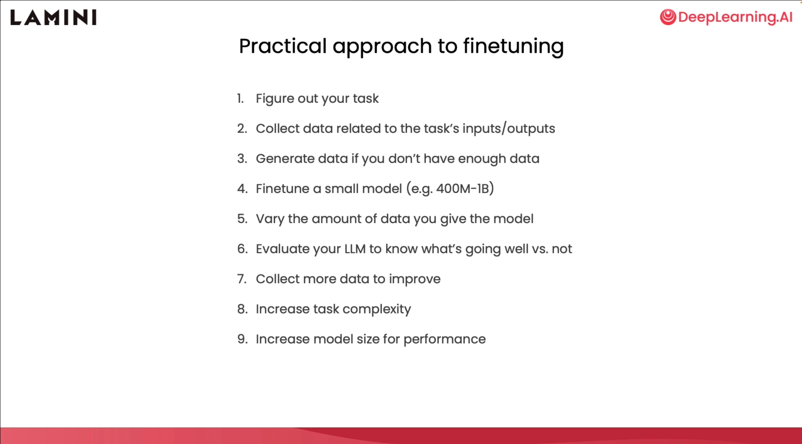
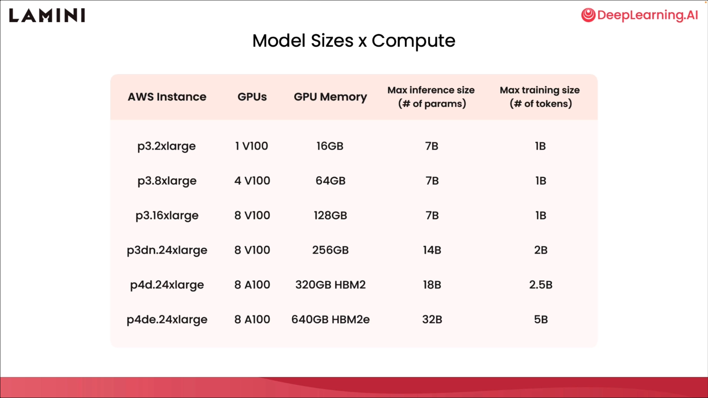

# Chapter 8 Getting Started Notes

Okay, you've made it to the last lesson, and here are some getting started notes, some practical tips, and some more advanced training methods.

## Fine-tuning Practical Steps

Let's start with some practical steps for fine-tuning.

To recap, first you need to figure out your task, collect data related to the input and output of the task, and structure it. If you don't have enough data, no problem, just generate some data or use the prompt template to create more data. At first, you need to fine-tune a small model. I recommend a model with 400 million to 1 billion parameters to see how the model performs. You should vary the actual amount of data for the model to see how much data affects the direction of the model. Then, you can evaluate the model to see what it does well and what it doesn't do well. Finally, you collect more data and improve the model through evaluation.

Based on this, you can now increase the complexity of the task, so that the task becomes more difficult. Then, you can also increase the size of the model to improve performance on more complex tasks.

## Task finetuning

In terms of task finetuning, you have learned about reading tasks and writing tasks.Tasks are much harder. Writing tasks are much harder. These tasks are broader, like chatting, writing emails, writing code, because the model generates more tokens. Therefore, it is a harder task for the model. Harder tasks often require larger models to handle.

Another harder task is task composition, which requires the model to do a series of things instead of just one task. This may mean giving an agent the flexibility to do several things at the same time, or doing only one step instead of many.

## Model size vs. compute resources

Now that you have some idea of ​​the model size required for the complexity of the task, you also have the compute requirements in terms of the hardware required to run the model.

In the program you ran earlier, you saw 70 million parameter models running on the CPU. They are not the best models, and I recommend starting with models that perform better.

So if you look at the first row in this table, I want to pull up a v100 GPU, which is available on [AWS](https://aws.amazon.com/) or any other cloud platform. You can see that it has 16 gigabytes of memory, which means it can run a7 billion parameter model for inference.

But for training, it requires more memory to store the gradients and the optimizer, so it can really only fit a 1 billion parameter model. If you want to fit a larger model, you can see some other options here.

## Parameter Efficient Fine-tuning

Okay, maybe that's not enough for you, and you want to handle larger models. There's a method called [PEFT](https://arxiv.org/abs/2303.15647) or Parameter Efficient Fine-tuning, which is a different set of methods that can help you do that. Be more efficient in the process of using parameters and training models.

One method that I really like is LORA, which stands for Low Rank Adaptation.

What LORA does is it reduces the number of parameters and weights that need to be trained by a lot. In the case of GPT-3, they found that they could reduce it by a factor of 10,000, which reduced the GPU memory required by a factor of 3. While the fine-tuning accuracy is slightly lower, it is still a much more efficient approach, and the final inference latency is the same. So what is going on with LORA? In fact, you areLORA trains new weights in some of the layers of the model, while freezing the main pre-trained weights. So, these weights are frozen, and then you have these new orange weights. These are the LORA weights. The new weights are a little bit mathematical, they are the rank factorization matrix of the original weight changes.

But the important thing is not the math, but that you can train these weights. The important thing is that you can train these weights separately, alternate with the pre-trained weights, and then merge them back into the main pre-trained weights at inference time to get a fine-tuned model more efficiently. I am very excited about the use of LORA because it can adapt to new tasks. This means that you can use LORA to train a model on one customer's data, and then train another model on another customer's data, and then merge them separately into inference when needed.