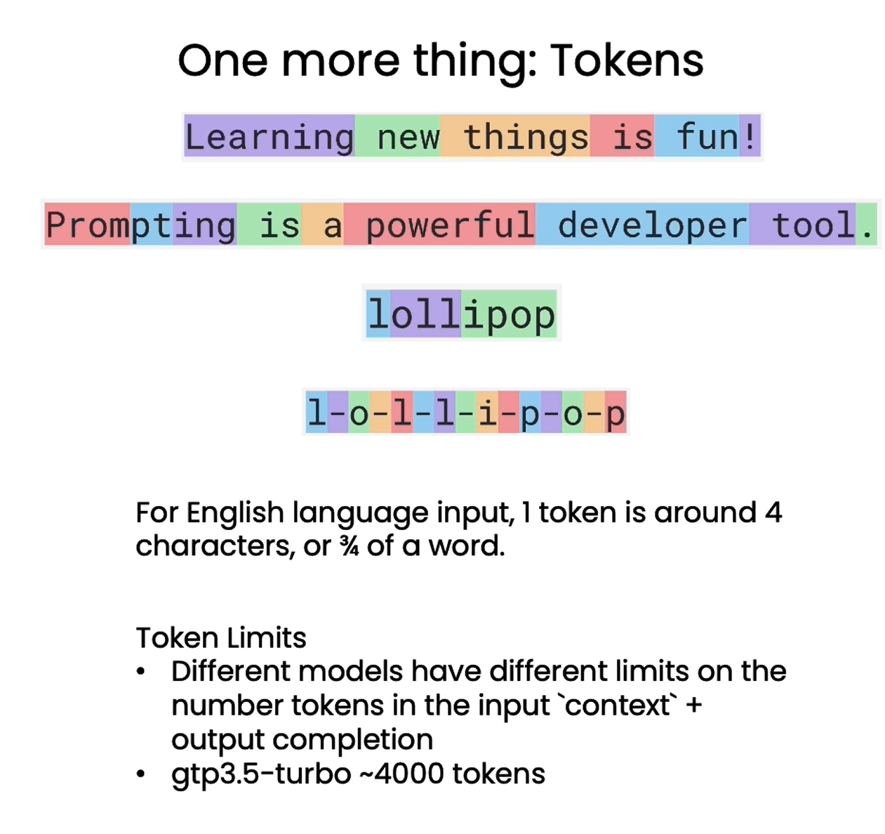

# Chapter 2 Language Model, Question Paradigm and Token

In this chapter, we will share with you how the Large Language Model (LLM) works, how it is trained, and how details such as the tokenizer affect the LLM output. We will also introduce the LLM's chat format, which is a way to specify system messages and user messages, to let you understand how to take advantage of this capability.

## 1. Language Model

The Large Language Model (LLM) is trained by supervised learning to predict the next word. Specifically, first prepare a large-scale text dataset containing tens of billions or even more words. Then, sentences or sentence fragments can be extracted from these texts as model input. The model predicts the probability distribution of the next word based on the current input context. By constantly comparing the model prediction and the actual next word, and updating the model parameters to minimize the difference between the two, the language model gradually grasps the laws of language and learns to predict the next word.

During the training process, researchers will prepare a large number of sentences or sentence fragments as training samples, and ask the model to predict the next word again and again. Through repeated training, the model parameters converge and its prediction ability is continuously improved. After training on massive text data sets, language models can achieve very accurate prediction of the next word.The method enables the language model to acquire powerful language generation capabilities**.

Large language models can be mainly divided into two categories: base language models and instruction-tuned language models.

**Base language models** (Base LLM) are trained by repeatedly predicting the next word, without a clear goal orientation. Therefore, if it is given an open prompt, it may generate dramatic content through free association. And for specific questions, the base language model may also give answers that are irrelevant to the question. For example, if it is given a prompt, such as "What is the capital of China?", it is likely that there is a list of quiz questions about China on the Internet in its data. At this time, it may answer this question with "What is the largest city in China? What is the population of China?" and so on. But in fact, you just want to know what the capital of China is, rather than listing all these questions.

In contrast, **Instruction-tuned language models** (Instruction Tuned LLM) are specially trained to better understand questions and give answers that conform to instructions. For example, for the question "What is the capital of China?", the fine-tuned language model is likely to directly answer "The capital of China is Beijing" instead of rigidly listing a series of related questions. **Instruction fine-tuning makes the language model more suitable for task-oriented conversational applications**. It can generate semantically accurate responses that follow instructions rather than free associations. Therefore, many real-worldInstruction-tuned language models have been used in international applications. Mastering the working mechanism of instruction fine-tuning is an important step for developers to implement language model applications.

```python
from tool import get_completion

response = get_completion("What is the capital of China?")
print(response)
```

The capital of China is Beijing.

So, how do you transform a basic language model into an instruction-tuned language model?

This is the process of training an instruction-tuned language model (such as ChatGPT).

First, **unsupervised pre-training** is performed on a large-scale text dataset to obtain a basic language model.

This step requires the use of hundreds of billions of words or even more data, which may take months on a large supercomputing system.

After that, the basic model is **supervised fine-tuned** using a small dataset containing instructions and corresponding reply examples, which allows the model to gradually learn to follow instructions to generate outputs, and suitable training examples can be constructed by hiring contractors.

Next, in order to improve the quality of the language model output, a common approach is to let humans rate many different outputs, such as whether they are useful, true, harmless, etc.
You can then further tune the language model to increase the probability of generating highly rated outputs. This is typically done using **Reinforcement Learning Based on Human Feedback** (RLHF)Technology is used to achieve this.
Compared to the months it may take to train a basic language model, the transition from a basic language model to an instruction-fine-tuned language model may only take a few days, using a smaller dataset and computing resources.

## 2. Tokens

In the description of LLM so far, we have described it as predicting one word at a time, but there is actually a more important technical detail. That is, **`LLM does not actually repeatedly predict the next word, but repeatedly predicts the next token`**. For a sentence, the language model first uses a tokenizer to split it into tokens instead of the original words. For uncommon words, it may be split into multiple tokens. This can greatly reduce the size of the dictionary and improve the efficiency of model training and inference. For example, for the sentence "Learning new things is fun!", each word is converted to a token, while for less used words such as "Prompting as powerful developer tool", the word "prompting" is split into three tokens, namely "prom", "pt" and "ing".

```python
# For better display, there is no Chinese translation here
# Note that the letter flipping here is wrong, Andrew NgThe teacher used this example to explain how tokens are calculated.
response = get_completion("Take the letters in lollipop \
and reverse them")
print(response)
```

The reversed letters of "lollipop" are "pillipol".

However, "lollipop" should be "popillol" in reverse.

But `the way of word segmentation also affects the understanding ability of the language model.` When you ask ChatGPT to reverse the letters of "lollipop", because the tokenizer decomposes "lollipop" into three tokens, namely "l", "oll", and "ipop", ChatGPT has difficulty outputting the order of letters correctly. At this time, you can add separations between letters to make each letter a token to help the model accurately understand the order of letters in the word.

```python
response = get_completion("""Take the letters in \
l-o-l-l-i-p-o-p and reverse them""")

print(response)
```

p-o-p-i-l-l-o-l

Therefore, the language model is modeled in tokens rather than original words. This key detail will have a significant impact on the selection and processing of the tokenizer. Developers need to pay attention to the impact of the word segmentation method on language understanding to maximize the potential of the language model.

❗❗❗ For English input, a token generally corresponds to 4 characters or three-quarters of a word; for Chinese input, a token generally corresponds to one or half a word. Different models have different token limits. It should be noted that the token limit here is the sum of the input prompt and the output completion tokens. Therefore, the longer the input prompt, the lower the upper limit of the completion that can be output. The token upper limit of ChatGPT3.5-turbo is 4096.



<div align='center'>Figure 2.2.1 Token Example</div>

## 3. Helper function (questioning paradigm)

The language model provides a special "questioning format" that can better playIts ability to understand and answer questions. This chapter will introduce the use of this format in detail.


<div align='center'>Figure 2.2.2 Chat format </div>

This question format distinguishes between "system messages" and "user messages". System messages are sentences that we convey to the language model, and user messages simulate user questions. For example:
```
System message: You are an assistant who can answer all kinds of questions.

User message: What planets are there in the solar system?
```
Through this question format, we can clearly role-play and let the language model understand that it is the role of the assistant and needs to answer questions. This can reduce invalid output and help it generate targeted responses. This chapter will use the auxiliary functions provided by OpenAI to demonstrate how to correctly use this question format to interact with the language model. Mastering this technique can greatly improve the effect of our dialogue with the language model and build a better question-answering system.

```python
import openai
def get_completion_from_messages(messages, 
model="gpt-3.5-turbo", 
temperature=0, 
max_tokens=500):
'''
Encapsulates a custom function that supports more parameters to access OpenAI GPT3.5

Parameters: 
messages: This is a list of messages, each message is a dictionary containing role and content. The role can be 'system', 'user' or 'assistant', and the content is the role's message.
model: The model called, the default is gpt-3.5-turbo (ChatGPT), and users with internal beta qualifications can choose gpt-4
temperature: This determines the degree of randomness of the model output, the default is 0, indicating that the output will be very certain. Increasing the temperature will make the output more random.
max_tokens: This determines the maximum number of tokens output by the model.
'''
response = openai.ChatCompletion.create(
model=model,
messages=messages,
temperature=temperature, # This determines the randomness of the model output
max_tokens=max_tokens, # This determines the maximum number of tokens that the model outputs
)
return response.choices[0].message["content"]
```

Above, we encapsulate a custom function get_completion_from_messages that supports more parameters to access OpenAI GPT3.5. In later chapters, we will encapsulate this function in the tool package.

```python
messages = [ 
{'role':'system', 
'content':'You are an assistant and answer in the style of Dr. Seuss. '}, 
{'role':'user', 
'content':'Write me a short poem on the theme of happy little whales'}, 
] 
response = get_completion_from_messages(messages, temperature=1)
print(response)
```

In the vast depths of the sea,
there is a little whale who is happy and free;
It is covered with a colorful robe,
Jumping and dancing beside the waves.

It knows no worries, but only dances happily,
Shining in the sun, energetic without boundaries;
Its smile is like a bright star,
Adding a beautiful glow to the sea.

The sea is its world, freedom is its companion,
Happiness is its eternal haystack;
Swimming freely in the vast water,
The joy of the little whale warms people's hearts.

So, let us feel the joy of the whale,
Dance to your heart's content, let happiness flow freely;
No matter when and where, keep smiling,
Like a whale, live your own light.

Above, we used the questioning paradigm to communicate with the language model:

```
System message: You are an assistant, and answer in the style of Dr. Seuss.

User message: Write me a short poem on the theme of happy little whales
```

Let's take a look at another example:

```python
# Length control
messages = [
{'role':'system',
'content':'All yourThe reply can only be one sentence'}, 
{'role':'user',
'content':'Write a story about a happy little whale'}, 
] 
response = get_completion_from_messages(messages, temperature =1)
print(response)
```

From the happy laughter of the little whale, we learned that no matter what difficulties we encounter, happiness is always the best antidote.

Combine the above two examples:

```python
# Combine the above
messages = [
{'role':'system',
'content':'You are an assistant, and answer in the style of Dr. Seuss, just one sentence'},
{'role':'user',
'content':'Write a story about a happy little whale'},
]
response = get_completion_from_messages(messages, temperature =1)
print(response)
```

In the depths of the ocean lives a little whale, it always smiles and soars in the water, and when it is happy, it will dance a gorgeous danceBelow we define a get_completion_and_token_count function, which implements calling OpenAI's model to generate chat replies, and returns the generated reply content and the number of tokens used.

```python
def get_completion_and_token_count(messages, 
model="gpt-3.5-turbo", 
temperature=0, 
max_tokens=500):
"""
Generate chat replies using OpenAI's GPT-3 model, and return the generated reply content and the number of tokens used.

Parameters:
messages: list of chat messages.
model: name of the model used. Defaults to "gpt-3.5-turbo".
temperature: controls the randomness of generated replies. The larger the value, the more random the generated replies. Defaults tois 0.
max_tokens: The maximum number of tokens for generating a reply. Defaults to 500.

Returns:
content: The generated reply content.
token_dict: A dictionary containing 'prompt_tokens', 'completion_tokens', and 'total_tokens', which represent the number of tokens for the prompt, the number of tokens for the generated reply, and the total number of tokens, respectively.
"""
response = openai.ChatCompletion.create(
model=model,
messages=messages,
temperature=temperature, 
max_tokens=max_tokens,
)

content = response.choices[0].message["content"]

token_dict = {
'prompt_tokens':response['usage']['prompt_tokens'],
'completion_tokens':response['usage']['completion_tokens'],
'total_tokens':response['usage']['total_tokens'],
}

return content, token_dict
```

Next, let's call the get_completion_and_token_count function we just created and use the questioning paradigm to have a conversation:

```python
messages = [
{'role':'system',
'content':'You are an assistant, and answer in the style of Dr. Seuss. '}, 
{'role':'user', 
'content':'Write me a short poem about a happy little whale'}, 
] 
response, token_dict = get_completion_and_token_count(messages)
print(response)
```

Deep in the ocean, there is a little whale, 
It swims around happily, like a little fish. 
Its skin is smooth andBlue, like clouds in the sky,
Its eyes are bright and gentle, like stars in the night sky.

It accompanies the ocean, jumping and playing together,
It swims happily with the fishes.
It likes to sing and dance, bringing joy to everyone,
Its voice is sweet and pleasant, like the rhythm in music.

The little whale is a messenger of joy, bringing laughter to the world,
Its joy is endless and will never stop.
Let us follow the little whale and swim happily together,
Find our happy place in the vast sea.

Print the token dictionary to see the number of tokens used, we can see: the prompt uses 67 tokens, the generated reply uses 293 tokens, and the total number of tokens used is 360.

```python
print(token_dict)
```

{'prompt_tokens': 67, 'completion_tokens': 293, 'total_tokens': 360}

In the field of AI application development, the emergence of prompt technology is undoubtedly a revolutionary change. However, the importance of this change has not been widely recognized and valued. In the traditional supervised machine learning workflow, building aA classifier that can classify restaurant reviews as positive or negative takes a lot of time and resources.

First, we need to collect and annotate a large amount of labeled data. This may take weeks or even months to complete. Next, we need to select the right open source model and perform model tuning and evaluation. This process may take days, weeks, or even months. Finally, we need to deploy the model to the cloud and let it run before we can finally call your model. The whole process usually takes a team months to complete.

In contrast, the prompt-based machine learning approach greatly simplifies this process. When we have a text application, we only need to provide a simple prompt, which may only take a few minutes, or at most a few hours if multiple iterations are required to get a valid prompt. Within a few days (although it is usually a few hours in reality), we can run the model through API calls and start using it. Once we reach this step, it only takes a few minutes or hours to start calling the model for inference. Therefore, applications that may have taken six months or even a year to build before can now be built using prompts in just minutes or hours, or at most a few days. This approach is dramatically changing the way AI applications are built quickly.

It is important to note that this approach is applicable to many unstructured data applications, especially textThis application, and a growing number of vision applications, is not suitable for structured data applications, that is, machine learning applications that process large numbers in Excel spreadsheets. However, for applications that are suitable for this approach, AI components can be built quickly and are changing the construction workflow of the entire system. It may still take days, weeks, or longer to build the entire system, but at least this part can be done faster.

Overall, the emergence of prompt technology is changing the paradigm of AI application development, allowing developers to build and deploy applications more quickly and efficiently. However, we also need to recognize the limitations of this technology in order to better use it to promote the development of AI applications.

In the next chapter, we will show how to use these components to evaluate the input of a customer service assistant.
This will be part of a more complete example of building a customer service assistant for an online retailer in this course.

## 4. English version

**1.1 Language model**

```python
response = get_completion("What is the capital of China?")
print(response)
```

The capital of China is Beijing.

**2.1 Tokens**

```python
response = get_completion("Take the letters in lollipop and reverse them")
print(response)
```

The reversed letters of "lollipop" are "pillipol".

```python
response = get_completion("""Take the letters in \
l-o-l-l-i-p-o-p and reverse them""")

print(response)
```

p-o-p-i-l-l-o-l

**3.1 Questioning Paradigm**

```python
def get_completion_from_messages(messages, 
model="gpt-3.5-turbo", 
temperature=0,max_tokens=500):
'''
Encapsulates a custom function that supports more parameters to access OpenAI GPT3.5

Parameters: 
messages: This is a list of messages, each message is a dictionary containing role and content. The role can be 'system', 'user' or 'assistant', and the content is the role's message.
model: The model called, the default is gpt-3.5-turbo (ChatGPT), and users with internal beta qualifications can choose gpt-4
temperature: This determines the degree of randomness of the model output. The default is 0, indicating that the output will be very certain. Increasing the temperature will make the output more random.
max_tokens: This determines the maximum number of tokens output by the model.
'''
response = openai.ChatCompletion.create(
model=model,
messages=messages,
temperature=temperature, # This determines the degree of randomness of the model outputmax_tokens=max_tokens, # This determines the maximum number of tokens that the model will output
)
return response.choices[0].message["content"]
```

```python
messages = [ 
{'role':'system', 
'content':"""You are an assistant who\
responds in the style of Dr Seuss."""}, 
{'role':'user', 
'content':"""write me a very short poem\
about a happy carrot"""}, 
] 
response = get_completion_from_messages(messages, temperature=1)
print(response)
```

Oh, a carrot so happy and bright,
With a vibrant orange hue, oh what a sight!
It grows in the garden, so full of delight,
A veggie so cheery, it shines in the light.

Its green leaves wave with such joyful glee,
As it dances and sways, so full of glee.
With a crunch when you bite, so wonderfully sweet,
This happy little carrot is quite a treat!

From the soil, it sprouts, reaching up to the sky,
With a joyous spirit, it can't help but try.
To bring smiles to faces and laughter to hearts,
This happy little carrot, a work ofart!

```python
# length
messages = [ 
{'role':'system',
'content':'All your responses must be \
one sentence long.'}, 
{'role':'user',
'content':'write me a story about a happy carrot'}, 
] 
response = get_completion_from_messages(messages, temperature =1)
print(response)
```

Once upon a time, there was a happy carrot named Crunch who lived in a beautiful vegetable garden.

```python
# combined
messages = [ 
{'role':'system',
'content':"""You are an assistant who \
respondsin the style of Dr Seuss. \
All your responses must be one sentence long."""}, 
{'role':'user',
'content':"""write me a story about a happy carrot"""},
] 
response = get_completion_from_messages(messages, 
temperature =1)
print(response)
```

Once there was a carrot named Larry, he was jolly and bright orange, never wary.

```python
def get_completion_and_token_count(messages, 
model="gpt-3.5-turbo",temperature=0, 
max_tokens=500):
"""
Generate chat replies using OpenAI's GPT-3 model and return the generated replies and the number of tokens used.

Parameters:
messages: List of chat messages.
model: Model name used. Defaults to "gpt-3.5-turbo".
temperature: Controls the randomness of generated replies. The larger the value, the more random the generated replies. Defaults to 0.
max_tokens: Maximum number of tokens for generated replies. Defaults to 500.

Returns:
content: Generated reply content.
token_dict: A dictionary containing 'prompt_tokens', 'completion_tokens', and 'total_tokens', which represent the number of tokens for the prompt, the number of tokens for the generated reply, and the total number of tokens, respectively.
"""
response = openai.ChatCompletion.create(
model=model,
messages=messages,
temperature=temperature, 
max_tokens=max_tokens,
)

content = response.choices[0].message["content"]

token_dict = {
'prompt_tokens':response['usage']['prompt_tokens'],
'completion_tokens':response['usage']['completion_tokens'],
'total_tokens':response['usage']['total_tokens'],
}

return content, token_dict
```

```python
messages = [
{'role':'system', 
'content':"""You are an assistantwho responds\
in the style of Dr Seuss."""}, 
{'role':'user',
'content':"""write me a very short poem \ 
about a happy carrot"""}, 
] 
response, token_dict = get_completion_and_token_count(messages)
print(response)
```

Oh, the happy carrot, so bright and orange,
Grown in the garden, a joyful forage.
With a smile so wide, from top to bottom,
It brings happiness, oh how it blossoms!

In the soil it grew, with love and care,
Nourished by sunshine, fresh air to share.
Its leaves so green, reaching up so high,
A happy carrot, oh my, oh my!

With a crunch and a munch, it's oh so tasty,
Filled with vitamins, oh so hasty.
A happy carrot, a delight to eat,
Bringing joy and health, oh what a treat!

So let's celebrate this veggie so grand,
With a happy carrot in each hand.
For in its presence, we surely find,
A taste of happiness, one of a kind!

```python
print(token_dict)
```

{'prompt_tokens': 37, 'completion_tokens': 164, 'total_tokens': 201}