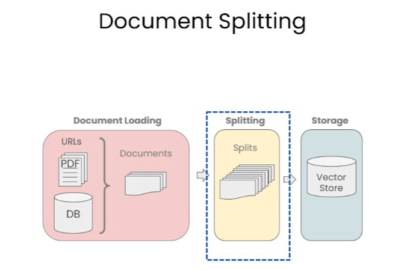
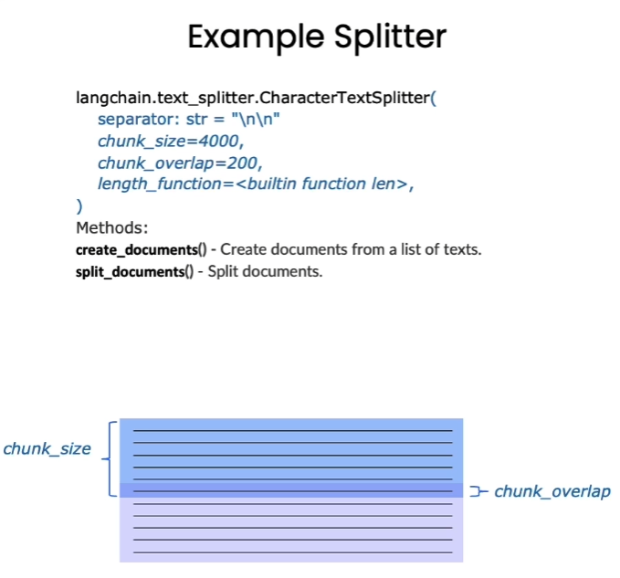
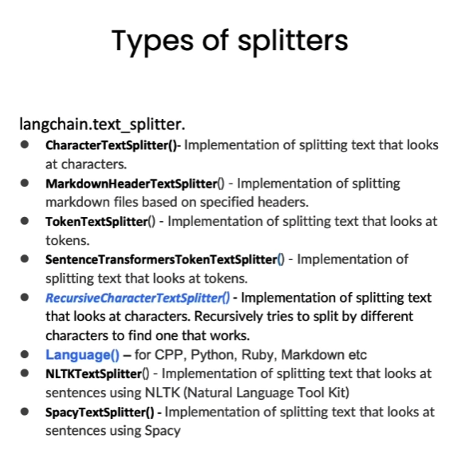

# Chapter 3 Document Segmentation

In the previous chapter, we just talked about how to load documents into a standard format, and now we are going to talk about how to split them into smaller chunks. This may sound simple, but there are many subtleties that will have an important impact on subsequent work.

## 1. Why do document segmentation?

1. **Model size and memory limitations**: GPT models, especially large versions such as GPT-3 or GPT-4, have billions or even tens of billions of parameters. In order to process so many parameters in a forward propagation, a lot of computing power and memory are required. However, most hardware devices (such as GPUs or TPUs) have memory limitations. Document segmentation enables the model to work within these limitations.
2. **Computational efficiency**: Processing longer text sequences requires more computing resources. By splitting long documents into smaller chunks, calculations can be performed more efficiently.
3. **Sequence length limit**: GPT models have a fixed maximum sequence length, such as 2048 tokens. This means that the model can only process so many tokens at a time. For documents longer than this length, segmentation is required to be processed by the model.
4. **Better generalization**: By training on multiple document chunks, the model can better learn and generalize to a variety of different text styles and structures.
5. **Data enhancement**: Splitting documents can provide more samples for training data. For example, aLong documents can be split into multiple parts and used as separate training samples.

It should be noted that although document segmentation has its advantages, it may also lead to the loss of some contextual information, especially near the segmentation point. Therefore, how to perform document segmentation is a trade-off.



<div align='center'> Figure 4.3.1 The significance of document segmentation</div>

If text segmentation is performed only according to a single character, it is easy to lose the semantic information of the text, which may lead to deviations when answering questions. Therefore, in order to ensure the accuracy of semantics, we should try to segment the text into paragraphs or units that contain complete semantics.

## 2. Document segmentation method
The text segmenters in Langchain are segmented according to chunk_size (block size) and chunk_overlap (the overlap size between blocks).



<div align='center'> Figure 4.3.2 Document segmentation example </div>

* chunk_size refers to the number of characters or tokens (such as words, sentences, etc.) contained in each chunk* chunk_overlap refers to the number of characters shared between two chunks, which is used to maintain contextual coherence and avoid losing contextual information during segmentation



<div align='center'> Figure 4.3.3 Document segmentation tool </div>

Langchain provides multiple document segmentation methods, which differ in how to determine the boundaries between chunks, which characters/tokens a chunk consists of, and how to measure chunk size

## 3. Character-based segmentation

How to segment text is often closely related to the type of task we perform. This correlation becomes particularly prominent when we split code. Therefore, we introduced a language text segmenter that contains various delimiters designed for different programming languages ​​such as Python, Ruby, and C. When segmenting these documents, the differences between various programming languages ​​must be fully considered.

We will start with character-based segmentation, using the `RecursiveCharacterTextSplitter` and `CharacterTextSplitter` tools provided by `LangChain` to achieve this goal.

`CharacterTextSplitter` is a character text segmentation, separatorThe argument is a single string; `RecursiveCharacterTextSplitter` is a recursive character text splitter that will recursively split by different characters (according to this priority ["\n\n", "\n", " ", ""]), so that all semantically related content can be kept in the same place as long as possible. Therefore, `RecursiveCharacterTextSplitter` cuts the document more fragmented than `CharacterTextSplitter`

The following 4 parameters need to be paid attention to in `RecursiveCharacterTextSplitter`:

* `separators` - separator string array
* `chunk_size` - character limit for each document
* `chunk_overlap` - length of the overlapping area of ​​two documents
* `length_function` - length calculation function

### 3.1 Short sentence segmentation

```python
# Import text splitter
from langchain.text_splitter import RecursiveCharacterTextSplitter, CharacterTextSplitter

chunk_size = 20 #Set chunk size
chunk_overlap = 10 #Set chunk overlap size

# Initialize recursive character text splitter
r_splitter = RecursiveCharacterTextSplitter(
chunk_size=chunk_size,
chunk_overlap=chunk_overlap
)
# Initialize character text splitter
c_splitter = CharacterTextSplitter(
chunk_size=chunk_size,
chunk_overlap=chunk_overlap
)

```

Next, we will compare the effects of the two character text splitters.

```python
text = "In AI research, since large models are very large and have many model parameters, it takes a lot of time to train on large models to verify whether the parameters are good or not, so ablation experiments are generally performed on small models to verify which improvements are effective before conducting experiments on large models." #Test text
r_splitter.split_text(text)

```

['In AI research, since large models are very large, model',
'Large model sizeThe model is very large, and there are many model parameters. The training time cost is very high on the large model, so it is generally done on the small model to verify which improvements are effective before going to the large model. ']

As you can see, in the segmentation result, the second block starts from "the large model scale is very large, the model scale is very large", which is exactly the block overlap size we set

```python
#Character Text Splitter
c_splitter.split_text(text)

```

['In AI research, because the large model scale is very large and there are many model parameters, the training time cost is very high after running on the large model to verify whether the parameters are good or not, so it is generally done on the small model to verify which improvements are effective before going to the large model to do experiments. ']

You can see that the character splitter does not split the text, because the character text splitter uses the line break as the delimiter by default, so you need to set "," as the delimiter.

```python
# Set the space delimiter
c_splitter = CharacterTextSplitter(
chunk_size=chunk_size,
chunk_overlap=chunk_overlap,
separator='，'
)
c_splitter.split_text(text)

```

Created a chunk of size 23, which is longer than the specified 20

['In AI research, because the large model is very large',
'because the large model is very large, the model parameters are many',
'running on the large model to verify whether the parameters are good or not is very time-consuming',
'so generally ablation experiments are done on small models to verify which improvements are effective before doing experiments on large models. ']

After setting "," as the separator, the segmentation effect is similar to the recursive character text splitter.

> You can see that the prompt "Created a chunk of size 23, which is longer than the specified 20" appears, which means "created a chunk of length 23, which is longer than the specified 20." This is because `CharacterTextSplitter` gives priority to our custom### 3.2 Long Text Segmentation

Next, let's try to segment the long text.

```python
# Chinese version
some_text = """When writing a document, the author will use the document structure to group the content. \
This can convey to the reader which ideas are related. For example, closely related ideas\
are in sentences. Similar ideas are in paragraphs. Paragraphs make up documents. \n\n\
Paragraphs are usually separated by one or two carriage returns. \
A carriage return is the embedded "backslash n" you see in this string. \
There is a period at the end of the sentence, but there is also a space. \
And words are separated by spaces"""

print(len(some_text))

```

177

We use the above long text as an example.

```python

c_splitter = CharacterTextSplitter(
chunk_size=80,
chunk_overlap=0,
separator=' '
)

''' 
For the recursive character splitter, pass in the separator list in turn, which are double line breaks, single line breaks, spaces, and null characters.When splitting text, it will first split it with double line breaks, and then split it with other separators in sequence.
'''

r_splitter = RecursiveCharacterTextSplitter(
chunk_size=80,
chunk_overlap=0,
separators=["\n\n", "\n", " ", ""]
)

```

Character splitter result:

```python
c_splitter.split_text(some_text)
```

['When writing a document, authors will use document structure to group content. This can convey to readers which ideas are related. For example, closely related ideas are in sentences. Similar ideas are in paragraphs. Paragraphs make up documents. ',
'Paragraphs are usually separated by one or two carriage returns. A carriage return is the embedded "backslash n" you see in this string. There is a period at the end of a sentence, but there is also a space. And words are separated by spaces']

Recursive character splitter effect:

```python
r_splitter.split_text(some_text)

```

['When writing a document, the author will use the document structure to',
'Paragraphs make up a document. ',
'Paragraphs are usually separated by one or two carriage returns. A carriage return is the embedded "backslash n" you see in this string. There is a period at the end of a sentence, but there is also a space. ',
'And words are separated by spaces']

If you need to separate by sentence, also add a period separator with a regular expression

```python
r_splitter = RecursiveCharacterTextSplitter(
chunk_size=30,
chunk_overlap=0,
separators=["\n\n", "\n", "(?<=\。 )", " ", ""]
)
r_splitter.split_text(some_text)

```

['When writing a document, authors will use document structure to group content. ',
'This can communicate to the reader which ideas are related. ',
'For example, closely related ideas are in a sentence. ',
'SimilarThe idea is in paragraphs. Paragraphs make up documents. ',
'Paragraphs are usually separated by one or two carriage returns. ',
'The carriage return is the embedded "backslash n" you see in this string. ',
'There is a period at the end of the sentence, but there is also a space. ',
'And words are separated by spaces']

This is what the "recursive" in the name of the recursive character text segmenter means. In general, we recommend using the recursive character text segmenter for general text

## 4. Token-based segmentation
The context window length limit of many LLMs is counted in tokens. Therefore, from the perspective of LLM, separating the text by tokens usually gives better results.
Understand the difference between character-based segmentation and token-based segmentation through an example

```python
# Use token splitter for segmentation,
# Set the chunk size to 1 and chunk overlap size to 0, which is equivalent to splitting any string into a column of single tokens
from langchain.text_splitter import TokenTextSplitter
text_splitter = TokenTextSplitter(chunk_size=1, chunk_overlap=0)
text= "foo bar bazzyfoo"
text_splitter.split_text(text)
# Note: LangChain's token-based splitter does not support Chinese at present

```

['foo', ' bar', ' b', 'az', 'zy', 'foo']

It can be seen that the token length is different from the character length. The token is usually 4 characters

## 5. Split Markdown Document

### 5.1 Split a Custom Markdown Document

The purpose of chunking is to put text with context together. We can do this by using a specified delimiter, but some types of documents (such as Markdown) have structures that can be used for segmentation (such as titles).

The Markdown Title Text Splitter will split a Markdown document according to the title or subtitle, and add the title as metadata to each chunk

```python
# Define a Markdown Document

from langchain.document_loaders import NotionDirectoryLoader#Notion Loader
from langchain.text_splitter import MarkdownHeaderTextSplitter#markdown splitter

markdown_document = """# Title\n\n \
## Chapter 1\n\n \
Li Bai was about to set sail on his boat\n\n Suddenly, there was singing on the shore\n\n \
### Section \n\n \
The water of Taohuatan is a thousand feet deep\n\n 
## Chapter 2\n\n \
Not as good as Wang Lun's love for me"""
```

We use the above text as an example of a Markdown document. The above text format follows the Markdown syntax. If the reader is not familiar with the syntax, you can simply refer to the tutorial: [Markdown Tutorial](https://markdown.com.cn/basic-syntax/)

```python
# Define the list of headers and names to be split
headers_to_split_on = [
("#", "Header 1"),
("##", "Header 2"),
("###", "Header 3"),
]

markdown_splitter = MarkdownHeaderTextSplitter(
headers_to_split_on=headers_to_split_on
)#message_typemessage_type
md_header_splits = markdown_splitter.split_text(markdown_document)

print("First block")

print(md_header_splits[0])

print("Second block")

print(md_header_splits[1])

```

First block
page_content='Li Bai is about to set sail on a boat. Suddenly, he hears singing on the shore' metadata={'Header 1': 'Title', 'Header 2': 'Chapter 1'}
Second block
page_content='The water of Taohuatan is a thousand feet deep' metadata={'Header 1': 'Title', 'Header 2': 'Chapter 1', 'Header 3': 'Section'}

As you can see, each block contains page content and metadata, and the metadata records the title and subtitle of the block.

## 5.2 Split Markdown documents in the database

InIn the previous chapter, we tried to load the Notion database. A Notion document is a Markdown document. Here we load the documents in the Notion database and split them.

```python
#Load the database content
loader = NotionDirectoryLoader("docs/Notion_DB")
docs = loader.load()
txt = ' '.join([d.page_content for d in docs])#join documents
headers_to_split_on = [
("#", "Header 1"),
("##", "Header 2"),
]
#Load document splitter
markdown_splitter = MarkdownHeaderTextSplitter(
headers_to_split_on=headers_to_split_on
)
md_header_splits = markdown_splitter.split_text(txt)#split text content
print(md_header_splits[0])#splitting result

```page_content='Let’s talk about stress. Too much stress. \nWe know this can be a topic. \nSo let’s get this conversation going. \n[Intro: two things you should know](#letstalkaboutstress%2064040a0733074994976118bbe0acc7fb/Intro%20two%20things%20you%20should%20know%20b5fd0c5393a9498b93396e79fe71e8bf.md) \n[What is stress](#letstalkaboutstress%2064040a0733074994976118bbe0acc7fb/What%20is%20stress%20b198b685ed6a474ab14f6fafff7004b6.md) \n[When is there too much stress?](#letstalkaboutstressWhat can I do? do?](#letstalkaboutstress%2064040a0733074994976118bbe0acc7fb/What%20can%20Blendle%20do%20618ab89df4a647bf96e7b432af82779f.md) \n[Good reads](#letstalkaboutstress%2064040a0733074994976118bbe0acc7fb/Good%20reads%20e817491d84d549f886af972e0668192e.md) \nGo to **#letstalkaboutstress** on slack to chat about this topic' metadata={'Header 1': '#letstalkaboutstress'}

## VI. English version

**3.1 Short sentence segmentation**

```python
#Import text splitter
from langchain.text_splitter import RecursiveCharacterTextSplitter, CharacterTextSplitter

chunk_size = 26 #Set chunk size
chunk_overlap = 4 #Set chunk overlap size

#Initialize text splitter
r_splitter = RecursiveCharacterTextSplitter(
chunk_size=chunk_size,
chunk_overlap=chunk_overlap
)
c_splitter = CharacterTextSplitter(
chunk_size=chunk_sizee,
chunk_overlap=chunk_overlap
)
```

Recursive character splitter effect

```python
text = "a b c d e f g h i j k l m n o p q r s t u v w x y z"#test text
r_splitter.split_text(text)

```

['a b c d e f g h i j k l m', 'l m n o p q r s t u v w x', 'w x y z']

```python
len(" l m n o p q r s t u v w x")
```

25

Character splitter effect

```python
#Character text splitter
c_splitter.split_text(text)

```

['a b c d e f g h i j k l m n o p q r s t u v w x', 'w x y z'] y z']

Set the character splitter with space as the delimiter

```python
# Set the space delimiter
c_splitter = CharacterTextSplitter(
chunk_size=chunk_size,
chunk_overlap=chunk_overlap,
separator=' '
)
c_splitter.split_text(text)

```

['a b c d e f g h i j k l m', 'l m n o p q r s t u v w x', 'w x y z']

**3.2 Long text segmentation**

```python
# Recursively split long paragraphs
some_text = """When writing documents, writers will use document structure to group content. \
This can convey to the reader, which idea's are related. For example, closely related ideas \
are in sentances. Similar ideas are in paragraphs. Paragraphs form a document. \n\n \
Paragraphs are often delimited with a carriage return or two carriage returns. \
Carriage returns are the "backslash n" you see embedded in this string. \
Sentences have a period at the end, but also, have a space.\
and words are separated by space."""

c_splitter = CharacterTextSplitter(
chunk_size=450,
chunk_overlap=0,
separator=' '
)

''' 
For the recursive character splitter, the separator list is passed in order, which are double line breaks, single line breaks, spaces, and null characters.
Therefore, when splitting text, double line breaks are used first, and other separators are used in turn
'''

r_splitter = RecursiveCharacterTextSplitter(
chunk_size=450,
chunk_overlap=0,
separators=["\n\n", "\n", " ", ""]
)

```

Character splitter effect:

```python
c_splitter.split_text(some_text)
```

['When writing documents, writers will use document structure to group content. This can convey to the reader, which idea\'s are related. For example, closely related ideas are in sentances. Similar ideas are in paragraphs. Paragraphs form a document. \n\n Paragraphs are often delimited with a carriage return or two carriage returns. Carriage returns are the "backslash n" you see embedded in this string. Sentences have a period at the end, but also,',
'have a space.and words are separated by space.']

Recursive character splitter effect:

```python
#Segmentation result
r_splitter.split_text(some_text)

```

["When writing documents, writers will use document structure to group content. This can convey to the reader, which idea's are related. For example, closely related ideas are in sentances. Similar ideas are in paragraphs. Paragraphs form a document.",
'Paragraphs are often delimited with a carriage return or two carriage returns. Carriage returns are the "backslash n" you see embedded in this string. Sentences have a period at the end, but also, have a space. and words are separated by space.']

Add the effect of sentence segmentation:

```python
r_splitter = RecursiveCharacterTextSplitter(
chunk_size=150,
chunk_overlap=0,
separators=["\n\n", "\n", "(?<=\. )", " ", ""]
)
r_splitter.split_text(some_text)

```

["When writing documents, writerswill use document structure to group content. This can convey to the reader, which idea's are related.",
'For example, closely related ideas are in sentances. Similar ideas are in paragraphs. Paragraphs form a document.',
'Paragraphs are often delimited with a carriage return or two carriage returns.',
'Carriage returns are the "backslash n" you see embedded in this string.',
'Sentences have a period at the end, but also, have a space.and words are separated by space.']

**4.1 Token-based segmentation**

```python
# Use token splitter for segmentation,
# Set the chunk size to 1 and chunk overlap to 0, which is equivalent to splitting any string into columns of single tokens
from langchain.text_splitter import TokenTextSplitter
text_splitter = TokenTextSplitter(chunk_size=1, chunk_overlap=0)
text1 = "foo bar bazzyfoo"
text_splitter.split_text(text1)

```

['foo', ' bar', ' b', 'az', 'zy', 'foo']

**5.1 Split custom Markdown documents**

```python
# Define a Markdown document

from langchain.document_loaders import NotionDirectoryLoader#Notion loader
from langchain.text_splitter import MarkdownHeaderTextSplitter#markdown splitter

markdown_document = """# Title\n\n \
## Chapter 1\n\n \
Hi this is Jim\n\n Hi this is Joe\n\n \
### Section \n\n \
Hi this is Lance \n\n 
## Chapter 2\n\n \
Hi this is Molly"""

# Initialize the Markdown title text splitter to split the Markdown document
markdown_splitter = MarkdownHeaderTextSplitter(
headers_to_split_on=headers_to_split_on
)
md_header_splits = markdown_splitter.split_text(markdown_document)

print("The first chunk")
print(md_header_splits[0])
# Document(page_content='Hi this is Jim \nHi this is Joe', metadata={'Header 1': 'Title', 'Header 2': 'Chapter 1'})
print("The second chunk")
print(md_header_splits[1])
# Document(page_content='Hi this is Lance', metadata={'Header 1': 'Title', 'Header 2': 'Chapter 1', 'Header 3': 'Section'})

```

The first chunk
page_content='Hi this is Jim \nHi this is Joe \n### Section \nHi this is Lance' metadata={'Header 1': 'Title', 'Header 2': 'Chapter 1'}
The second chunk
page_content='Hi this is Molly' metadata={'Header 1': 'Title', 'Header 2': 'Chapter 2'}

**5.2 Split the Markdown document in the database**

```python
#Load the database content
loader = NotionDirectoryLoader("docs/Notion_DB")
docs = loader.load()
txt = ' '.join([d.page_content for d in docs])#Join documents

headers_to_split_on = [
("#", "Header 1"),
("##", "Header 2"),
]
#Load document splitter
markdown_splitter = MarkdownHeaderTextSplitter(
headers_to_split_on=headers_to_split_on
)

md_header_splits = markdown_splitter.split_text(txt)#Split text content

print(md_header_splits[0])#Split result

```

page_content='Let’s talk about stress. Too much stress. \nWe know this can be a topic. \nSo let’s get this conversation going. \n[Intro: two things you should know](#letstalkaboutstress%2064040a0733074994976118bbe0acc7fb/Intro%20two%20things%20you%20should%20know%20b5fd0c5393a9498b93396e79fe71e8bf.md) \n[What is stress](#letstalkaboutstress%2064040a0733074994976118bbe0acc7fb/What%20is%20stress%20b198b685ed6a474ab14f6fafff7004b6.md) \n[When is there too much stress?](#letstalkaboutstress%2064040a0733074994976118bbe0acc7fb/When%20is%20there%20too%20much%20stress%20dc135b9a86a843cbafd115aa128c5c90.md) \n[What can I do](#letstalkaboutstress%2064040a0733074994976118bbe0acc7fb/What%20can%20I%20do%2009c1b13703ef42d4a889e2059c5b25fe.md) \n[What can I do](#letstalkaboutstress%2064040a0733074994976118bbe0acc7fb/What%20can%20I%20do%2009c1b13703ef42d4a889e2059c5b25fe.md) \n[What can I do](#letstalkaboutstress do?](#letstalkaboutstress%2064040a0733074994976118bbe0acc7fb/What%20can%20Blendle%20do%20618ab89df4a647bf96e7b432af82779f.md) \n[Good reads](#letstalkaboutstress%2064040a0733074994976118bbe0acc7fb/Good%20reads%20e817491d84d549f886af972e0668192e.md) \nGo to **#letstalkaboutstress** on slack to chat about this topic' metadata={'Header 1': '#letstalkaboutstress'}