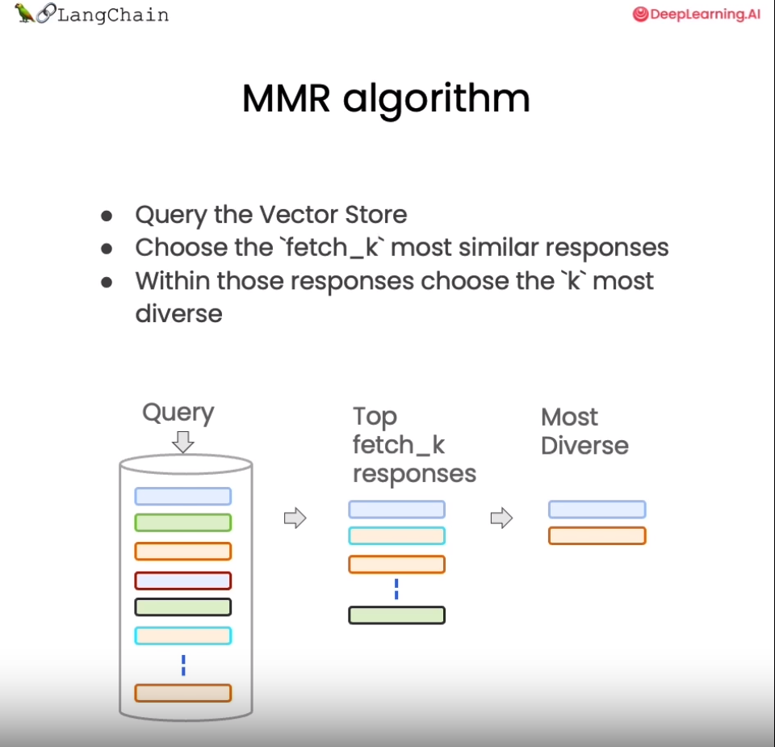

# Chapter 5 Retrieval

Information retrieval is the core link when building a retrieval-augmented generation (RAG) system. The retrieval module is responsible for analyzing user queries, quickly locating relevant documents or paragraphs from the knowledge base, and providing information support for subsequent language generation. **Retrieval refers to searching for document content related to the question in the vector database based on the user's question**. When we access and query the vector database, we may use the following technologies:

- Basic semantic similarity
- Maximum marginal relevance (MMR)
- Filtering metadata
- LLM-assisted retrieval


<div align='center'> Figure 4.5.1 Retrieval technology </div>

Using basic similarity search can probably solve 80% of your related retrieval work, but how to solve those edge cases where similarity search fails? In this chapter, we will introduce several retrieval methods and techniques for solving edge cases of retrieval. Let's start learning together!

## 1. Vector database retrieval

This chapter requires the use of the `lark` package. If this package has not been installed in the environment, please run the following command to install it:

```python
!pipinstall -Uq lark
```

### 1.1 Similarity Search

Take our process as an example. The previous course has stored the vector database (`VectorDB`), which contains the semantic vector representation of each document. First, load the vector database (`VectorDB`) saved in the previous lesson:

```python
from langchain.vectorstores import Chroma
from langchain.embeddings.openai import OpenAIEmbeddings

persist_directory_chinese = 'docs/chroma/matplotlib/'

embedding = OpenAIEmbeddings()

vectordb_chinese = Chroma(
persist_directory=persist_directory_chinese,
embedding_function=embedding
)

print(vectordb_chinese._collection.count())
```27

Let's implement semantic similarity search. We store three sentences in the vector database Chroma, and then we ask questions to let the vector database search for relevant answers based on the questions:

```python
texts_chinese = [
"""Amanita phalloides has large and eye-catching epigeous fruiting bodies (basidiocarp)""",
"""A mushroom with large fruiting bodies is Amanita phalloides. Some varieties are all white.""",
"""A. phalloides, also known as the death cap, is the most poisonous of all known mushrooms.""",
]
```

We can see that the first two sentences are describing a type of fungus called "Amanita", including their characteristics: having large fruiting bodies, and the third sentence describes "Phantom Pencil", one of the most poisonous mushrooms known, and its characteristics are: containing highly toxic. For this example, we will create a small database that we can use as an example.

```python
smalldb_chinese = Chroma.from_texts(texts_chinese, embedding=embedding)
```

100%|██████████| 1/1 [00:00<00:00, 1.51it/s]

Here is the question we ask for this example:

```python
question_chinese = "Tell me about all-white mushrooms with large fruiting bodies"
```

Now, let's do a **similarity search** on the above question, setting k=2 to return only the two most relevant documents.

```python
smalldb_chinese.similarity_search(question_chinese, k=2)
```

[Document(page_content='A mushroom with large fruiting bodies is the death amanita (Amanita phalloides). Some varieties are all white.', metadata={}),
Document(page_content='Death amanita (Amanita phalloides) has large and eye-catching above-ground (epigeous) fruiting bodies (basidiocarp)', metadata={})]

We can now see that the vector database returns 2 documents, which are the first and second sentences we stored in the vector database. Here we can clearly seeThe similarity_search method of chroma can search the database for the most relevant documents according to the semantics of the question, that is, the text of the first and second sentences is searched. But there seems to be some problems, because the meanings of the first and second sentences are very similar, they both describe "Amanita" and its "fruiting body", so if only one of them is returned, it will be enough to meet the requirements. If two sentences with very similar meanings are returned, it feels like a waste of resources. Let's take a look at the search results of max_marginal_relevance_search.

### 1.2 Solving Diversity: Maximum Marginal Relevance (MMR)

The maximum marginal relevance model (MMR, Maximal Marginal Relevance) is a common algorithm for achieving diversity retrieval.



<div align='center'> Figure 4.5.2 MMR </div>

**The basic idea of ​​MMR is to consider the relevance of the query and the document, as well as the similarity between documents**. Relevance ensures that the returned results are highly relevant to the query, while similarity encourages documents with different semantics to be included in the result set. Specifically, it calculates the relevance of each candidate document to the query and subtracts the relevance of the candidate document to the query.The similarity of documents. In this way, more dissimilar documents will have higher scores.

In short, MMR is a simple and efficient algorithm to solve the problem of retrieval redundancy and provide diverse results. It balances relevance and diversity and is suitable for application scenarios with strong demand for diverse information.

Let's take a look at an example of using MMR to retrieve information from the mushroom knowledge base. First, load the documents about mushrooms, then run the MMR algorithm and set the fetch_k parameter to tell the vector database that we need k results to return in the end. fetch_k=3 means that we initially get 3 documents, and k=2 means returning the 2 most different documents.

```python
smalldb_chinese.max_marginal_relevance_search(question_chinese,k=2, fetch_k=3)
```

[Document(page_content='A mushroom with large fruiting bodies is the death cap mushroom (Amanita phalloides). Some varieties are completely white.', metadata={}),
Document(page_content='A. phalloides, also known as the death cap, is the most poisonous of all known mushrooms.', metadata={})]Here we see that max_marginal_relevance_search returns the text of the second and third sentences. Although the third sentence is not very relevant to our question, this result should be more reasonable because the first and second sentences have similar meanings, so only one of them needs to be returned. In addition, an answer with a weaker relevance to the question (the third sentence) is returned. This seems to enhance the diversity of answers, and I believe users will prefer it more.

Remember that in the previous section we introduced two failure scenarios of vector data when querying? When the same documents exist in the vector database and the user's question is highly relevant to these duplicate documents, the vector database will return duplicate documents. Now we can use Langchain's max_marginal_relevance_search to solve this problem:

First, let's look at the first two documents. Just look at the first few characters and you can see that they are the same.

```python
question_chinese = "What is Matplotlib?"
docs_ss_chinese = vectordb_chinese.similarity_search(question_chinese,k=3)
print("docs[0]: ")
print(docs_ss_chinese[0].page_content[:100])
print()
print("docs[1]: ")
print(docs_ss_chinese[1].page_content[:100])
```

docs[0]: 
First: Introduction to Matplotlib
1. Introduction to matplotlib
Matplotlib is a Python 2D drawing library that can generate publication-quality graphics in multiple hard-copy formats and a cross-platform interactive environment. It is used to draw various

docs[1]: 
First: Introduction to Matplotlib
1. Introduction to matplotlib
Matplotlib is a Python 2D A drawing library that can generate publication-quality graphics in multiple hardcopy formats and a cross-platform interactive environment for drawing various

Here, if we use similarity query, we will get two duplicate results. Readers can try it themselves, and it will not be shown here. We can use `MMR` to get different results.

```python
docs_mmr_chinese = vectordb_chinese.max_marginal_relevance_search(question_chinese,k=3)
```

When we get the results after running MMR, we can see that the first one is the same as the previous one, because that is the most similar.

```python
print(docs_mmr_chinese[0].page_content[:100])
```

First round: Matplotlib introduction
1. Understanding matplotlib
Matplotlib is a Python 2D drawing library that can generate publication-quality graphics in multiple hardcopy formats and a cross-platform interactive environment, used to draw various

But when we get to the second one, we can see that it is different.

It gets some diversity in the responses.

```python
print(docs_mmr_chinese[1].page_content[:100])
```

By Datawhale Data Visualization Open Source Group
© Copyright © Copyright 2021. The y-axis is divided into two, left and right, so tick1 corresponds to the left axis; tick2 corresponds to the right axis.
The x-axis is divided intoFor the upper and lower two

From the above results, we can see that the vector database returned 2 completely different documents. This is because we use MMR search, which filters the documents with high similarity in the search results, so it retains the relevance of the results while taking into account the diversity of the results.

### 1.3 Solving the particularity: using metadata

In the last lesson, we also raised a question about the failed application scenario. We asked a question about a lecture in the document, but the results obtained also included results from other lectures. This is the result we don't want to see. The reason for this result is that when we ask the vector database a question, the database does not have a good understanding of the semantics of the question, so the returned result is not as expected. To solve this problem, we can achieve precise search by filtering metadata. Currently, many vector databases support operations on `metadata`:

`metadata` provides context for each embedded chunk.

```python
question_chinese = "What did they say about Figure in Lecture 2?" 
```

Now, we will solve this problem manually by specifying a metadata filter `filter`

```python
docs_chinese = vectordb_chinese.similarity_search(
question_chinese,
k=3,
filter={"source":"docs/matplotlib/第二回：艺术画笔见乾坤.pdf"}
)
```

Next, we can see that the results are all from the corresponding chapters

```python
for d in docs_chinese:
print(d.metadata)

```

{'source': 'docs/matplotlib/第二回：艺术画笔见乾坤.pdf', 'page': 9}
{'source': 'docs/matplotlib/第二回：艺术画笔见乾坤.pdf', 'page': 10}
{'source': 'docs/matplotlib/第二回：艺术画笔见乾坤.pdf', 'page': 0}

Of course, we can't solve this problem manually every time, which would be unintelligent. In the next section, we will show how to solve this problem through LLM.

### 1.4 Solving the peculiarities: Using self-query searchers in metadata (LLM-assisted search)

In the above example, IWe manually set the filter parameter filter to filter the specified documents. But this method is not smart enough and requires manual setting of the filter conditions. How to automatically extract the filter information from the user's question?

LangChain provides the SelfQueryRetriever module, which can analyze the following from the question statement through the language model:

1) The query string for vector search (search term)

2) The metadata condition for filtering the document (Filter)

Taking "In addition to Wikipedia, what other health websites are there?" as an example, SelfQueryRetriever can infer that "In addition to Wikipedia" indicates the condition that needs to be filtered, that is, excluding Wikipedia's documents.

It uses the language model to automatically parse the sentence semantics and extract the filter information without manual setting. This metadata filtering based on understanding is more intelligent and convenient, and can automatically handle more complex filtering logic.

Mastering the skills of using language models to achieve automatic filtering can greatly reduce the difficulty of building a targeted question-answering system. This self-extraction query method makes retrieval more intelligent and dynamic.

The principle is shown in the figure below:


<div align='center'> Figure 4.5.3 Self-extraction query </div>

Let's implement LLM assisted retrieval:

```python
from langchain.llms import OpenAI
from langchain.retrievers.self_query.base import SelfQueryRetriever
from langchain.chains.query_constructor.base import AttributeInfo

llm = OpenAI(temperature=0)
```

Here we first define metadata_field_info_chinese , which contains the metadata filter conditions `source` and `page` , where source tells LLM where the data we want comes from, and page tells LLM which page of the original document we need to extract the relevant content from. With metadata_field_info_chinese information, LLM will automatically extract the Filter and Search term in the above figure from the user's question, and then the vector database will search for relevant content based on these two items. Let's take a look at the query results:

```python
metadata_field_info_chineseese = [
AttributeInfo(
name="source",
description="The lecture the chunk is from, should be one of `docs/matplotlib/第次：Matplotlib初相见.pdf`, `docs/matplotlib/第二次：艺术画笔见乾坤.pdf`, or `docs/matplotlib/第三次：配置格式定方圈.pdf`",
type="string",
),
AttributeInfo(
name="page",
description="The page from the lecture",
type="integer",
),
]

document_content_description_chinese = "Matplotlib 课堂手注"
retriever_chinese = SelfQueryRetriever.from_llm(
llm,
vectordb_chinese,
document_content_description_chinese,
metadata_field_info_chinese,
verbose=True
)

question_chinese = "What did they do with Figure in Lecture 2?" 
```

When you first execute the next line, you will get a **warning** about predict_and_parse being deprecated. This can be safely ignored.

```python
docs_chinese = retriever_chinese.get_relevant_documents(question_chinese)
```

/root/autodl-tmp/env/gpt/lib/python3.10/site-packages/langchain/chains/llm.py:275: UserWarning: The predict_and_parse method is deprecated, instead pass an output parser directlyto LLMChain.
warnings.warn(

query='Figure' filter=Comparison(comparator=<Comparator.EQ: 'eq'>, attribute='source', value='docs/matplotlib/第二回：艺术画笔见乾坤.pdf') limit=None

Print to see the query results. Based on the subquery retriever, the results we retrieved are all in the documents of the second round:

```python
for d in docs_chinese:
print(d.metadata)
```

{'source': 'docs/matplotlib/第二回：艺术画笔见乾坤.pdf', 'page': 9}
{'source': 'docs/matplotlib/第二回：艺术画笔见乾坤.pdf', 'page': 10}
{'source': 'docs/matplotlib/第二回：艺术画笔见乾坤.pdf', 'page': 0}
{'source': 'docs/matplotlib/Second round: Artistic brushes see the universe.pdf', 'page': 6}

### 1.5 Other tips: Compression

When using vector retrieval to obtain relevant documents, directly returning the entire document fragment may lead to a waste of resources, because only a small part of the document is actually relevant. To improve this, LangChain provides a "compression" retrieval mechanism. Its working principle is that **first use standard vector retrieval to obtain candidate documents, and then use language models based on the semantics of the query statement to compress these documents and only retain the parts related to the question**. For example, for the query "nutritional value of mushrooms", the retrieval may return a whole long document about mushrooms. After compression, only the sentences related to "nutritional value" in the document are extracted.


<div align='center'> Figure 4.5.4 Compression </div>

From the above figure, we can see that when the vector database returns all the contents of all document blocks related to the question, there will be a Compression LLM responsible for compressing the contents of these returned document blocks. Compression means extracting only the content related to the user's question from the document block and discarding those irrelevant contents.

```python
from langchain.retrievers import ContexContextualCompressionRetriever
from langchain.retrievers.document_compressors import LLMChainExtractor

def pretty_print_docs(docs):
print(f"\n{'-' * 100}\n".join([f"Document {i+1}:\n\n" + d.page_content for i, d in enumerate(docs)]))

llm = OpenAI(temperature=0)
compressor = LLMChainExtractor.from_llm(llm) # compressor

compression_retriever_chinese = ContextualCompressionRetriever(
base_compressor=compressor,
base_retriever=vectordb_chinese.as_retriever()
)
# Compress the source document

question_chinese = "MatpWhat is lotlib? "
compressed_docs_chinese = compression_retriever_chinese.get_relevant_documents(question_chinese)
pretty_print_docs(compressed_docs_chinese)
```

Document 1:

Matplotlib is a Python 2D drawing library that can generate publication-quality graphics in multiple hardcopy formats and cross-platform interactive environments, and is used to draw various static, dynamic, and interactive charts.
----------------------------------------------------------------------------------------------------
Document 2:

Matplotlib is a Python 2D drawing library that can generate publication-quality graphics in multiple hardcopy formats and cross-platform interactive environments, and is used to draw various static, dynamic, and interactive charts.

In the above code, we define a LLMChainExtractor, which is a compressor that extracts relevant information from the document block returned by the vector database, and then we also define ContextualCompressionRetriever, which has two parameters: base_compressor and base_retriever, where base_compressor is an instance of the LLMChainExtractor we defined earlier, and base_retriever is the retriever generated by vectordb defined earlier.

Now when we ask a question and look at the result documents, we can see two things.

1. They are much shorter than normal documents

2. There are still some duplicates, which is because we use a semantic search algorithm at the bottom.

From the above examples, we can see that this compression can effectively improve the output quality while saving the waste of computing resources brought by long documents and reducing costs. Contextual compression retrieval technology makes the supporting documents more strictly match the question requirements, which is an important means to improve the efficiency of question answering systems. Readers can consider this technology in practical applications.

## 2. Combining various technologies

In order to remove duplicate documents in the results, we can set the search type to MMR when creating a retriever from the vector database. We can then rerun the process and see that we are returning a filtered result set.does not contain any duplicate information.

```python
compression_retriever_chinese = ContextualCompressionRetriever(
base_compressor=compressor,
base_retriever=vectordb_chinese.as_retriever(search_type = "mmr")
)

question_chinese = "What is Matplotlib?"
compressed_docs_chinese = compression_retriever_chinese.get_relevant_documents(question_chinese)
pretty_print_docs(compressed_docs_chinese)
```

Document 1:

Matplotlib is a Python 2D drawing library that can generate publication-quality graphics in multiple hardcopy formats and a cross-platform interactive environment, used to draw various static, dynamic, and interactive charts.

## 3. Other types of retrieval

It is worth notingThe thing is, vetordb is not the only tool for retrieving documents. `LangChain` also provides other ways to retrieve documents, such as: `TF-IDF` or `SVM`.

```python
from langchain.retrievers import SVMRetriever
from langchain.retrievers import TFIDFRetriever
from langchain.document_loaders import PyPDFLoader
from langchain.text_splitter import RecursiveCharacterTextSplitter

# Load PDF
loader_chinese = PyPDFLoader("docs/matplotlib/第一回：Matplotlib初相识.pdf")
pages_chinese = loader_chinese.load()
all_page_text_chinese = [p.page_content for p in pages_chinese]
joined_page_text_chinese = " ".join(all_page_text_chinese)

# Split text
text_splitter_chinese = RecursiveCharacterTextSplitter(chunk_size = 1500, chunk_overlap = 150)
splits_chinese = text_splitter_chinese.split_text(joined_page_text_chinese)

# Retrieval
svm_retriever = SVMRetriever.from_texts(splits_chinese, embedding)
tfidf_retriever = TFIDFRetriever.from_texts(splits_chinese)
```

Here we define two retrievers, SVMRetriever and TFIDFRetriever. Next, we test the effects of TF-IDF retrieval and SVM retrieval respectively:

```python
question_chinese = "What is the main topic of this course?" 
docs_svm_chinese = svm_retriever.get_relevant_documents(question_chinese)
print(docs_svm_chinese[0])
```

page_content='fig, ax = plt.subplots() \n# step4 Draw an image. For the extension of this module, please refer to Chapter 2 for further study\nax.plot(x, y, label=\'linear\') \n# step5 Add labels, text and legends. For the extension of this module, please refer to Chapter 4 for further study\nax.set_xlabel(\'x label\') \nax.set_ylabel(\'y label\') \nax.set_title("Simple Plot") \nax.legend() ;\nThinking questions\nPlease think about the advantages and disadvantages of the two drawing modes and their respective suitable usage scenarios\nIn the fifth section of the drawing template, we use the OO mode as an example. Please think about and write a pyplot Simple template for drawing mode' metadata={}

It can be seen that the performance of SVM retrieval is worse than VectorDB.

```python
question_chinese = "MaWhat is tplotlib? "
docs_tfidf_chinese = tfidf_retriever.get_relevant_documents(question_chinese)
print(docs_tfidf_chinese[0])
```

page_content='fig, ax = plt.subplots() \n# step4 Draw the image. For the extension of this module, please refer to Chapter 2 for further study\nax.plot(x, y, label=\'linear\') \n# step5 Add labels, text and legends. For the extension of this module, please refer to Chapter 4 for further study\nax.set_xlabel(\'x label\') \nax.set_ylabel(\'y label\') \nax.set_title("Simple Plot") \nax.legend() ;\nThinking questions\nPlease think about the advantages and disadvantages of the two drawing modes and their respective suitable usage scenarios\nIn the fifth section of the drawing template, we use OO The pattern is shown as an example. Please think about and write a simple template for the pyplot drawing pattern' metadata={}

Similarly, the effect of TF-IDF retrieval is not as good as expected## IV. Summary
Today's course covers many new technologies for vector retrieval. Let's quickly review the key points:

1) The MMR algorithm can achieve retrieval results that are both relevant and diverse, avoiding information redundancy.

2) Defining metadata fields can perform targeted filtering and improve matching accuracy.

3) The SelfQueryRetriever module automatically analyzes statements through language models, extracts query strings and filter conditions, and does not require manual settings, making retrieval more intelligent.

4) ContextualCompressionRetriever implements compressed retrieval, returning only document fragments related to the question, which can greatly improve efficiency and save computing resources.

5) In addition to vector retrieval, retrieval methods based on SVM and TF-IDF are also briefly introduced.

These technologies provide important support for us to build an interactive semantic search module. Mastering the applicable scenarios of each retrieval algorithm will greatly enhance the intelligence level of the question-answering system. I hope this tutorial can help you!

## 5. English version

**1.1 Similarity search**

```python
from langchain.vectorstores import Chroma
from langchain.embeddings.openai import OpenAIEmbeddings

persist_directory = 'docs/chroma/cs229_lectures/'

embedding = OpenAIEmbeddings()
vectordb = Chroma(
persist_directory=persist_directory,
embedding_function=embedding
)
print(vectordb._collection.count())
```

209

Simple example

```python
texts = [
"""The Amanita phalloides has a large and imposing epigeous (aboveground) fruiting body (basidiocarp).""",
"""A mushroom with a large fruiting body is the Amanita phalloides. Some varieties are all-white.""",
"""A. phalloides, a.k.a Death Cap, is one of the most poisonous of all known mushrooms.""",
]

smalldb = Chroma.from_texts(texts, embedding=embedding)

question = "Tell me about all-white mushrooms with large fruiting bodies"

print("Similarity search:")

print(smalldb.similarity_search(question, k=2))

print("MMR search:")

print(smalldb_chinese.max_marginal_relevance_search(question,k=2, fetch_k=3))
```

0%| | 0/1 [00:00<?, ?it/s]100%|██████████| 1/1 [00:00<00:00, 2.55it/s]

Similarity search:
[Document(page_content='Amushroom with a large fruiting body is the Amanita phalloides. Some varieties are all-white.', metadata={}), Document(page_content='The Amanita phalloides has a large and imposing epigeous (aboveground) fruiting body (basidiocarp).', metadata={})]
MMR Search:
[Document(page_content='A mushroom with a large fruiting body is the Amanita phalloides. Some varieties are all-white.', metadata={}), Document(page_content='A. phalloides, also known as the death cap, is the most poisonous of all known mushrooms.', metadata={})]

**1.2 Maximum Marginal Correlation**

```python
question = "what did they say about matlab?"docs_ss = vectordb.similarity_search(question,k=3)

print("Similarity search:")

print("docs[0]: ")

print(docs_ss[0].page_content[:100])

print()

print("docs[1]: ")

print(docs_ss[1].page_content[:100])

print()

docs_mmr = vectordb.max_marginal_relevance_search(question,k=3)

print("MMR search:")

print("mmr[0]: ")

print(docs_mmr[0].page_content[:100])

print()

print("MMR search:")

print("mmr[1]: ")

print(docs_mmr[1].page_content[:100])

```

Similarity search:

docs[0]: 
those Homeworks will be done in either MATLA B orin Octave, which is sort of — I 
know some people 

docs[1]: 
those homeworks will be done in either MATLA B or in Octave, which is sort of — I 
know some people 

MMR search: 
mmr[0]: 
those homeworks will be done in either MATLA B or in Octave, which is sort of — I 
know some people 

MMR search: 
mmr[1]: 
algorithm then? So what’s different? How come I was making all that noise earlier about 
least squa

**1.3 Using metadata**

```python
question ="What did they say about regression in the third lecture?"

docs = vectordb.similarity_search(
question,
k=3,
filter={"source":"docs/cs229_lectures/MachineLearning-Lecture03.pdf"}
)

for d in docs:
print(d.metadata)
```

{'source': 'docs/cs229_lectures/MachineLearning-Lecture03.pdf', 'page': 0}
{'source': 'docs/cs229_lectures/MachineLearning-Lecture03.pdf', 'page': 14}
{'source': 'docs/cs229_lectures/MachineLearning-Lecture03.pdf', 'page': 4}

**1.4 Using the Self-Query Retriever**

```python
from langchain.llms import OpenAI
from langchain.retrievers.self_query.base import SelfQueryRetriever
from langchain.chains.query_constructor.base import AttributeInfo

llm = OpenAI(temperature=0)

metadata_field_info = [
AttributeInfo(
name="source",
description="The lecture the chunk is from, should be one of `docs/cs229_lectures/MachineLearning-Lecture01.pdf`, `docs/cs229_lectures/MachineLearning-Lecture02.pdf`, or `docs/cs229_lectures/MachineLearning-Lecture03.pdf`",
type="string",
),
AttributeInfo(
name="page",
description="The page from the lecture",
type="integer",
),
]

document_content_description = "Lecture notes"

retriever = SelfQueryRetriever.from_llm(
llm,
vectordb,
document_content_description,
metadata_field_info,
verbose=True
)

question = "What did they say about regression in the third lecture?"

docs = retriever.get_relevant_documents(question)

for d in docs:
print(d.metadatata)
```

/root/autodl-tmp/env/gpt/lib/python3.10/site-packages/langchain/chains/llm.py:275: UserWarning: The predict_and_parse method is deprecated, instead pass an output parser directly to LLMChain.
warnings.warn(

query='regression' filter=Comparison(comparator=<Comparator.EQ: 'eq'>, attribute='source', value='docs/cs229_lectures/MachineLearning-Lecture03.pdf') limit=None
{'source': 'docs/cs229_lectures/MachineLearning-Lecture03.pdf', 'page': 14}
{'source': 'docs/cs229_lectures/MachineLearning-Lecture03.pdf', 'page': 0}
{'source': 'docs/cs229_lectures/MachineLearning-Lecture03.pdf', 'page': 10}
{'source': 'docs/cs229_lectures/MachineLearning-Lecture03.pdf', 'page': 10}

**1.5 Compression**

```python
from langchain.retrievers import ContextualCompressionRetriever
from langchain.retrievers.document_compressors import LLMChainExtractor

def pretty_print_docs(docs):
print(f"\n{'-' * 100}\n".join([f"Document {i+1}:\n\n" + d.page_content for i, d in enumerate(docs)]))

llm = OpenAI(temperature=0)
compressor = LLMChainExtractor.from_llm(llm) # compressor

compression_retriever = ContextualCompressionRetriever(
base_compressor=compressor,
base_retriever=vectordb.as_retriever()
)
question = "what did they say about matlab?"
compressed_docs = compression_retriever.get_relevant_documents(question)
pretty_print_docs(compressed_docs)
```

Document 1:

"MATLAB is I guess part of the programming language that makes it very easy to write codes using matrices, to write code for numerical routines, to move data around, to plot data. And it's sort of an extremely easy to learn tool to use for implementing a lot of learning algorithms."
----------------------------------------------------------------------------------------------------
Document 2:

"MATLAB is I guess part of the programming language that makes it very easy to write codes using matrices, to write code for numerical routines, to move data around, to plot data. And it's sort of an extremely easy to learn tool to use for implementing a lot of learning algorithms."
----------------------------------------------------------------------------------------------------
Document 3:

"And the student said, "Oh, it was the MATLAB." So for those of you that don't know MATLAB yet, I hope you do learn it. It's not hard, and we'll actually have a short MATLAB tutorial in one of the discussion sections for those of you that don't know it."
----------------------------------------------------------------------------------------------------
Document 4:

"And the student said, "Oh, it was the MATLAB." So for those of you that don't know MATLAB yet, I hope you do learn it. It's not hard, and we'll actually have a short MATLAB tutorial in one of the discussion sections for those of you that don't know it."

**2.1 Combining various technologies**

```python
compression_retriever = ContextualCompressionRetriever(
base_compressor=compressor,
base_retriever = vectordb.as_retriever(search_type = "mmr")
)
question = "what did they say about matlab?"
compressed_docs = compression_retriever.get_relevant_documents(question)
pretty_print_docs(compressed_docs)
```

Document 1:

"MATLAB is I guess part of the programming language that makes it very easy to write codes using matrices, to write code for numerical routines, to move data around, to plot data. And it's sort of an extremely easy to learn tool to use for implementing a lot ofof learning algorithms."
----------------------------------------------------------------------------------------------------
Document 2:

"And the student said, "Oh, it was the MATLAB." So for those of you that don't know MATLAB yet, I hope you do learn it. It's not hard, and we'll actually have a short MATLAB tutorial in one of the discussion sections for those of you that don't know it."

**3.1 Other types of retrieval**

```python
from langchain.retrievers import SVMRetriever
from langchain.retrievers import TFIDFRetriever
from langchain.document_loaders import PyPDFLoader
from langchain.text_splitter import RecursiveCharacterTextSplitter

# Load PDF
loader = PyPDFLoader("docs/cs229_lectures/MachineLearning-Lecture01.pdf")
pages = loader.load()
all_page_text = [p.page_content for p in pages]
joined_page_text = " ".join(all_page_text)

# Split text
text_splitter = RecursiveCharacterTextSplitter(chunk_size = 1500, chunk_overlap = 150)
splits = text_splitter.split_text(joined_page_text)

# Retrievesvm_retriever = SVMRetriever.from_texts(splits, embedding)
tfidf_retriever = TFIDFRetriever.from_texts(splits)

question = "What are major topics for this class?" # What are the main topics of this class?
print("SVM:")
docs_svm = svm_retriever.get_relevant_documents(question)
print(docs_svm[0])

question = "what did they say about matlab?"
print("TF-IDF:")
docs_tfidf = tfidf_retriever.get_relevant_documents(question) print(docs_tfidf[0])

```

SVM:
page_content="let me just check what questions you have right now. So if there are no questions, I'll just \nclose with two reminders, which are after class today or as you start to talk with other \npeople in this class, I just encourage you again to start to form project partners, to try to \nfind project partners to do your project with. And also, this is a good time to start forming \nstudy groups, so either talk to your friends or post in the newsgroup, but we just \nencourage you to try to start to do both of those today, okay? Form study groups, and try \nto find two other project partners. \nSo thank you. I'm looking forward to teaching this class, and I'll see you in a couple of \ndays. [End of Audio] \nDuration: 69 minutes" metadata={}
TF-IDF:
page_content="Saxena and Min Sun did here, why is given an image like this, right? This is actually a \npicture taken of the Stanford campus. You can apply that sort of cl ustering algorithm and \ngroup the picture into regions. Let me actually blow that up so that you can see it more \nclearly. Okay. So in the middle, you see the lines sort of grouping the image together, \ngrouping the image into [inaudible] regions. \nAnd what Ashutosh and Min did was they then applied the learning algorithm to say can \nwe take this clustering and use it to build a 3D model of the world? And so using the \nclustering, they then had a learning algorithm try to learn what the 3D structure of the \nworld looks like so that they could come up with a 3D model that you can sort of fly\nthrough, okay? Although many people used to th ink it's not possible to take a single \nimage and build a 3D model, but using a learning algorithm and that sort of clustering \nalgorithm is the first step. They were able to. \nI'll just show you one more example. I like this because it's a picture of Stanford with our \nbeautiful Stanford campus. So again, taking th e same sort of clustering algorithms, taking \nthe same sort of unsupervised learning algor ithm, you can group the pixels into different \nregions. And using that as a pre-processing step, they eventually built this sort of 3D model of Stanford campus in a single picture. You can sort of walk into the ceiling, look" metadata={}