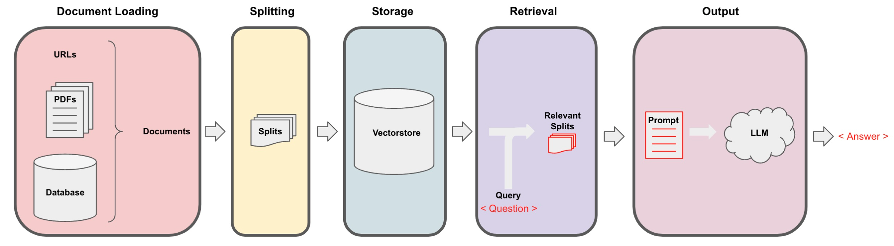

# Chapter 6 Question and Answer

Langchain needs to go through the following 5 stages when implementing the function of communicating with external data, which are: Document Loading->Splitting->Storage->Retrieval->Output, as shown in the figure below:



<div align='center'> Figure 4.6.1 Full process of accessing personal data </div>

We have completed the entire storage and retrieval, and after obtaining the relevant segmented documents, we now need to pass them to the language model to get the answer. The general flow of this process is as follows: First the question is asked, then we find the relevant documents, and then pass these segmented documents and system prompts to the language model to get the answer.

By default, we pass all document slices into the same context window, that is, the same language model call. However, there are a few different ways to solve this problem, and they all have advantages and disadvantages. Most of the advantages come from the fact that sometimes there may be a lot of documents, but you simply cannot pass them all into the same context window. MapReduce, Refine, and MapRerank are three methods used to solve this short context window problem. We will briefly introduce them in this course.

In the previous chapter, we have discussed how to retrieve documents that are relevant to a given question. The next step is to take those documents, take the original question, pass them together to a language model, and ask it to answer the question. In this section, we will go into more detail about this process, as well as a few different ways to accomplish this task.

After September 2, 2023, the GPT-3.5 API will be updated, so a time judgment is required here

```python
import datetime
current_date = datetime.datetime.now().date()
if current_date < datetime.date(2023, 9, 2):
llm_name = "gpt-3.5-turbo-0301"
else:
llm_name = "gpt-3.5-turbo"
print(llm_name)
```

gpt-3.5-turbo-0301

## 1. Load the vector database

First, we load the vector database that has been persisted before:

```python
from langchain.vectorstores import Chroma
from langchain.embeddings.openai import OpenAIEmbeddings
persist_directory = 'docs/chroma/matplotlib/'
embedding = OpenAIEmbeddings()
vectordb = Chroma(persist_directory=persist_directory, embedding_function=embedding)

print(vectordb._collection.count())
```

27

We can test the vector search for a question. The following code will search the vector database based on similarity and return k documents to you.

```python
question = "What is the main topic of this class?"
docs = vectordb.similarity_search(question,k=3)
len(docs)
```
3

## 2. Construct a retrieval-based question-answering chain

Based on LangChain, we can construct a retrieval-based question-answering chain that uses GPT3.5 for question answering. This is a method of question answering through a retrieval step. We can pass in a language model and aWe can then use a vector database to create it as a retriever. Then, we can call it with the question as a query and get an answer.


<div align='center'> Figure 4.6.2 Retrieval QA chain </div>

```python
# Use ChatGPT3.5, set the temperature to 0
from langchain.chat_models import ChatOpenAI
# Import the retrieval QA chain
from langchain.chains import RetrievalQA

llm = ChatOpenAI(model_name=llm_name, temperature=0)

# Declare a retrieval QA chain
qa_chain = RetrievalQA.from_chain_type(
llm,
retriever=vectordb.as_retriever()
)

# You can perform retrieval QA in this way
question = "What is the main topic of this class"
result = qa_chain({"query": question})

print(result["result"])
```

The main topic of this lesson is to introduce Matplotlib, a Python 2D drawing library that can generate publication-quality graphics in multiple hardcopy formats and cross-platform interactive environments, and is used to draw various static, dynamic, and interactive charts. At the same time, the basic concepts of Matplotlib and the simplest drawing examples, as well as the composition of Figure and the properties of Axis are introduced.

## 3. In-depth exploration of the search-based question-answering chain

After obtaining documents related to the question, we need to input the documents and the original question into the language model to generate answers. The default is to merge all documents and input them into the model at one time. However, **there is a problem of context length limitation**. If the number of related documents is large, it is difficult to input all of them into the model at one time. To address this problem, this chapter will introduce three strategies: MapReduce, Refine, and MapRerank.

- MapReduce implements long document processing through multiple rounds of retrieval and question-answering
- Refine allows the model to actively request information
- MapRerank adjusts the order of documents based on the quality of question-answering


<div align='center'> Figure 4.6.3 Three other strategies</div>

The three strategies have their own advantages and disadvantages. MapReduce processes long documents in batches, Refine implements interactive Q&A, and MapRerank optimizes the order of information. Mastering these techniques can cope with the contextual limitations of language models, solve the difficulties of long document Q&A, and improve the coverage of Q&A.

With the above code, we can implement a simple search-based Q&A chain. Next, let's go into the details and see what LangChain does in this search-based Q&A chain.

### 3.1 Template-based search-based Q&A chain

We first define a prompt template. It contains some instructions on how to use the following context snippet, and then there is a placeholder for the context variable.

```python
# Chinese version
from langchain.prompts import PromptTemplate

# Build prompt
template = """Use the following context snippet to answer the last question. If you don't know the answer, just say you don't know, don't try to make up an answer. Use a maximum of three sentences for the answer. Try to answer briefly and concisely. At the end of the answer, be sure to say "Thank you for your question! "
{context}
Question: {question}
Helpful answers: """
QA_CHAIN_PROMPT = PromptTemplate.from_template(template)
```

Then we build a retrieval QA chain based on this template:

```python
# Run chain
qa_chain = RetrievalQA.from_chain_type(
llm,
retriever=vectordb.as_retriever(),
return_source_documents=True,
chain_type_kwargs={"prompt": QA_CHAIN_PROMPT}
)
```

The constructed retrieval QA chain can be used in the same way as above:

```python
question = "Will I learn Python in this course?"
result = qa_chain({"query": question})
print(result["result"])
```

According to the context, this course is mainly about the use and basic knowledge of the Matplotlib data visualization library. Python is a programming language that uses Matplotlib, so the use of Python will be involved in the learning process. However, the focus of this course is Matplotlib, not the Python language itself. Thanks for your question!

You can view the source document retrieved:

```python
print(result["source_documents"][0])
```

page_content='Part 1: Matplotlib Introduction\n1. Understanding matplotlib\nMatplotlib is a Python 2D drawing library that can generate publication-quality graphics in multiple hardcopy formats and a cross-platform interactive environment, and is used to draw various static, dynamic,\ninteractive charts. \nMatplotlib can be used in Python scripts, Python and IPython Shell, Jupyter notebook, Web application servers, and various graphical user interface toolkits. \nMatplotlib is the Thai of Python data visualization libraries. It has become a recognized data visualization tool in Python. The well-known drawing interfaces of pandas and seaborn are actually high-level encapsulations based on matplotlib. \nIn order to have a better understanding of matplotlib, let's start with some basic concepts and then gradually transition to some advanced techniques. \n2. A simplest drawing example\nMatplotlib images are drawn on figures (such as windows, jupyter windows), and each figure contains one or more axes (a subregion that can specify a coordinate system). The simplest way to create a figure and axes is through the pyplot.subplots command. After creating axes, you can use Axes.plot to draw the simplest line chart. \nimport matplotlib.pyplot as plt\nimport matplotlib as mpl\nimport numpy as np\nfig, ax = plt.subplots() # Create a figure with an axes\nax.plot([1, 2, 3, 4], [1, 4, 2, 3]); # Draw an image\nTrick: When using matplotlib in a jupyter notebook, you will find that after running the code, a paragraph like <matplotlib.lines.Line2D at 0x23155916dc0> is automatically printed out. This is because matplotlib's drawing codeBy default, the code prints the last object. If you don't want to display this sentence, there are three ways to do it. You can find the use of these three methods in the code examples in this chapter. \n\x00. Add a semicolon ; at the end of the code block\n\x00. Add a sentence plt.show() at the end of the code block\n\x00. Explicitly assign the drawing object to a variable when drawing, such as changing plt.plot([1, 2, 3, 4]) to line =plt.plot([1, 2, 3, 4])\nSimilar to MATLAB commands, you can also draw images in a simpler way. The matplotlib.pyplot method can draw images directly on the current axes. If the user does not specify axes, matplotlib will automatically create one for you. So the above example can also be simplified to the following line of code. \nline =plt.plot([1, 2, 3, 4], [1, 4, 2, 3]) \n3. Figure composition\nNow let's take a closer look at the composition of a figure. Through a figure anatomy diagram, we can see that a complete matplotlib image usually includes the following four levels, which are also called containers. The next section will introduce them in detail.lib world, we will manipulate each part of the image through various command methods,\nso as to achieve the final effect of data visualization. A complete image is actually a collection of various sub-elements. \nFigure: Top level, used to hold all drawing elements' metadata={'source': 'docs/matplotlib/第一回：Matplotlib初相识.pdf', 'page': 0}

This method is very good because it only involves one call to the language model. However, it also has limitations, that is, if there are too many documents, they may not all fit into the context window. We can use another technology to ask and answer documents, namely MapReduce technology.

### 3.2 Retrieval-based question-answering chain based on MapReduce

In MapReduce technology, each independent document is first sent to the language model separately to obtain the original answer. Then, these answers are combined into the final answer through a final call to the language model. Although this involves more calls to the language model, its advantage is that it can handle any number of documents.

```python
qa_chain_mr = RetrievalQA.from_chain_type(
llm,
retriever=vectordb.as_retriever(),
chain_type="map_reduce"
)
question = "Will Python be taught in this class?"
result = qa_chain_mr({"query": question})

print(result["result"])
```

Can't be sure, the text given doesn't mention whether Python will be taught in this class.

When we run the previous question through this chain, we can see two problems with this approach. First, it's much slower. Second, the results are actually worse. There is no clear answer to this question based on this part of the given document. This is probably because it is answered on a per-document basis. So if the information is spread between two documents, it doesn't capture all the information in the same context.

```python
#import os
#os.environ["LANGCHAIN_TRACING_V2"] = "true"
#os.environ["LANGCHAIN_ENDPOINT"] = "https://api.langchain.plus"
#os.environ["LANGCHAIN_API_KEY"] = "..." #replace dots with your api key
```

We can import the above environment variables and then explore the details of MapReduce document chaining. For example, in the above demonstration, we actually involved four separate calls to the language model. After running each document, they are combined in the final chain, the Stuffed Documents chain, which merges all these answers into the final call.

### 3.3 Refine-based search-based question-answering chain

We can also set the chain type to Refine, which is a new chaining strategy. Refine document chaining is similar to MapReduce, in that the LLM is called once for each document. However, the improvement is that the final prompt input to the language model is a sequence, combining the previous response with the new document and requesting a refined response. Therefore, this is a concept similar to RNN, which enhances the context information to solve the problem of information being distributed in different documents.

For example, in the first call, Prompt contains the question and document A, and the language model generates an initial answer. In the second call, Prompt contains the first response, document B, and the model is asked to update the answer, and so on.

```python
qa_chain_mr = RetrievalQA.from_chain_type(
llm,
retriever=vectordb.as_retriever(),
chain_type="refine"
)
question = "Will this course teach Python?"
result = qa_chain_mr({"query": question})
print(result["result"])
```

Refined answer:

The course is about learning Matplotlib, a Python 2D plotting library used for creating publication-quality figures in various formats and platforms. Matplotlib can be used in Python scripts, IPython Shell, Jupyter notebook, web application servers, and various graphical user interfacetoolkits. The course will cover basic concepts of Matplotlib and gradually transition to advanced techniques. The course will also cover the components of a Matplotlib figure, including the Figure, Axes, and various sub-elements. The course will provide a general plotting template that can be used to create various types of plots. The template follows the Object-Oriented (OO) mode of Matplotlib, but the course will also cover the pyplot mode. Therefore, the course will involve learning Python and Matplotlib for data visualization using both OO and pyplot modes.

In terms of the advantages and disadvantages of the two modes, the OO mode is more flexible and powerful, allowing for more customization and control over the plot elements. However, it requires more code and can be more complex for beginners. On the other hand, the pyplot mode is simpler and easier to use, but it may not provide as much flexibility and control as the OO mode. The pyplot mode is more suitable for quickand simple plots, while the OO mode is more suitable for complex and customized plots.

Here is an example of a simple pyplot mode plotting template:

```
import matplotlib.pyplot as plt
import numpy as np

# Step 1: Prepare data
x = np.linspace(0, 2, 100)
y = x**2

# Step 2: Plot data
plt.plot(x, y)

# Step 3: Customize plot
plt.xlabel('x label')
plt.ylabel('y label')
plt.title('Simple Plot')

# Step 4: Show plotplt.show()
```

This template can be used to create a simple plot with x and y labels and a title. Additional customization can be added using various pyplot functions.

You will notice that this result is better than the result of the MapReduce chain. This is because the use of the Refine document chain allows the language model to gradually improve the answer by accumulating context, rather than processing each document in isolation. This strategy can effectively solve the problem of incomplete semantics caused by scattered information. However, please note that due to the limitations of LangChain, the Q&A chain defined as Refine will return English as the answer by default.

## IV. Experiment: Status Recording

Let's do an experiment here. We will create a QA chain with the default stuff . Let's ask a question, will this course learn Python? It will answer that learning Python is one of the prerequisites for this course.

```python
qa_chain = RetrievalQA.from_chain_type(llm,
retriever=vectordb.as_retriever()
)
question = "Will you learn Python in this course?"
result = qa_chain({"query": question})
print(result["result"])
```

Yes, this course will involve the use of Python programming language, especially in data visualization. Therefore, learning Python is one of the prerequisites for this course.

We will ask, why is this prerequisite needed? Then we got an answer: "This prerequisite introduces what Matplotlib is and its basic concepts, including Figure, Axes, Artist, etc. These are the basis of Matplotlib drawing. Understanding these concepts can help users better understand the use of Matplotlib and the principles of drawing. Therefore, before learning Matplotlib, it is very necessary to understand these basic concepts." This is not related to the previous question about Python.

```python
question = "Why is this prerequisite needed?"
result = qa_chain({"query": question})
result["result"]
```

'This premise introduces what Matplotlib is and its basic concepts, including Figure, Axes, Artist, etc. These are the basis of Matplotlib drawing. Understanding these concepts can help users better understand the usage and drawing principles of Matplotlib. Therefore, it is very necessary to understand these basic concepts before learning Matplotlib. '

Basically, the chain we use does not have any concept of state. It does not remember previous questions or previous answers. To achieve this, we need to introduce memory, which is what we will discuss in the next section.

## Five, English version

**1.1 Loading vector database**

```python
from langchain.vectorstores import Chroma
from langchain.embeddings.openai import OpenAIEmbeddings
persist_directory = 'docs/chroma/cs229_lectures/'
embedding = OpenAIEmbeddings()
vectordb = Chroma(persist_directoryrectory=persist_directory, embedding_function=embedding)

print(vectordb._collection.count())
```

209

Vector retrieval

```python
question = "What are major topics for this class?"
docs = vectordb.similarity_search(question,k=3)
print(len(docs))
```

3

**2.1 Constructing a retrieval-style question-answering chain**

```python
# Use ChatGPT3.5, temperature set to 0
from langchain.chat_models import ChatOpenAI
# Import retrieval-style question-answering chain
from langchain.chains import RetrievalQA

llm = ChatOpenAI(model_name=llm_name, temperature=0)

# Declare a retrieval-style question-answering chain
qa_chain = RetrievalQA.from_chain_type(
llm,
retriever=vectordb.as_retriever()
)
# You can use this method to retrieve questions and answers
question = "What are major topics for this class?"
result = qa_chain({"query": question})

print(result["result"])
```

The context does not provide a clear answer to this question.

**3.1 Template-based retrieval question and answer chain**

```python
from langchain.prompts import PromptTemplate

# Build prompt
template = """Use the following pieces of context to answer the question at the end. If you don't know the answer, just say that you don't know the answer.w, don't try to make up an answer. Use three sentences maximum. Keep the answer as concise as possible. Always say "thanks for asking!" at the end of the answer. 
{context}
Question: {question}
Helpful Answer:"""
QA_CHAIN_PROMPT = PromptTemplate.from_template(template)

# Run chain
qa_chain = RetrievalQA.from_chain_type(
llm,
retriever=vectordb.as_retriever(),
return_source_documents=True,
chain_type_kwargs={"prompt": QA_CHAIN_PROMPT}
)

question = "Is probability a class topic?"result = qa_chain({"query": question})
print("ANswering:")
print(result["result"])
print("Source document: ")
print(result["source_documents"][0])
```

ANswering:
Yes, probability is assumed to be a prerequisite for this class. The instructor assumes familiarity with basic probability and statistics, and will go over some of the prerequisites in the discussion sections as a refresher course. Thanks for asking!
Source document: 
page_content="of this class will not be very program ming intensive, although we will do some \nprogramming, mostly in either MATLAB or Octa ve. I'll say a bit more about that later. \nI also assume familiarity with basic probability and statistics. So most undergraduate \nstatistics class, like Stat 116 taught here at Stanford, will be more than enough. I'm gonna \nassume all of you know what random variables are, that all of you know what expectation \nis, what a variance or a random variable is. And in case of some of you, it's been a whilee \nsince you've seen some of this material. At some of the discussion sections, we'll actually \ngo over some of the prerequisites, sort of as a refresher course under prerequisite class. \nI'll say a bit more about that later as well. \nLastly, I also assume familiarity with basi c linear algebra. And again, most undergraduate \nlinear algebra courses are more than enough. So if you've taken courses like Math 51, \n103, Math 113 or CS205 at Stanford, that would be more than enough. Basically, I'm \ngonna assume that all of you know what matrix es and vectors are, that you know how to \nmultiply matrices and vectors and multiply matrix and matrices, that you know what a matrix inverse is. If you know what an eigenvect or of a matrix is, that'd be even better. \nBut if you don't quite know or if you're not qu ite sure, that's fine, too. We'll go over it in \nthe review sections." metadata={'source': 'docs/cs229_lectures/MachineLearning-Lecture01.pdf', 'page': 4}

**3.2 Based on MapReduceRetrieval QA chain**

```python
qa_chain_mr = RetrievalQA.from_chain_type(
llm,
retriever=vectordb.as_retriever(),
chain_type="map_reduce"
)

question = "Is probability a class topic?"
result = qa_chain_mr({"query": question})

print(result["result"])
```

There is no clear answer to this question based on the given portion of the document. The document mentions statistics and algebra as topics that may be covered, but it does not explicitly state whether probability is a class topic.

**3.3 Refine-based retrieval question answering chain**

```python
qa_chain_mr = RetrievalQA.from_chain_type(
llm,
retriever=vectordb.as_retriever(),
chain_type="refine"
)
question = "Is probability a class topic?"
result = qa_chain_mr({"query": question})
print(result["result"])
```

The topic of probability is assumed to be a prerequisite and not a main topic of the class. The instructor assumes that students are familiar with basic probability and statistics, including random variables, expectation, variability, etc.e, and basic linear algebra. The class will cover learning algorithms, including a discussion on overfitting and the probabilistic interpretation of linear regression. The instructor will use this probabilistic interpretation to derive the first classification algorithm, which will be discussed in the class. The classification problem involves predicting a discrete value, such as in medical diagnosis or housing sales. The class will not be very programming-intensive, but some programming will bedone in MATLAB or Octave. The instructor will provide a refresher course on the prerequisites in some of the discussion sections. Additionally, the discussion sections will be used to cover extensions for the material taught in the main lectures, as machine learning is a vast field with many topics to explore.

**4.1 Experiments**

```python
qa_chain = RetrievalQA.from_chain_type(
llm,
retriever=vectordb.as_retriever()
)

question = "Is probability a class topic?"
result = qa_chain({"query": question})
print("Q: ", question)
print("A: ", result["result"])

question = "why are those prerequisites needed?"
result = qa_chain({"query": question})
print("Q: ", question)
print("A: ", result["result"])
```

Q: Is probability a class topic?
A: Yes, probability is a topic that will be assumed to be familiar to students in this class. The instructor assumes that students have a basic understanding of probability and statistics, and will go over some of the prerequisites as a refresherr course in the discussion sections.
Q: why are those prerequisites needed?
A: The prerequisites are needed because in this class, the instructor assumes that all students have a basic knowledge of computer science and knowledge of basic computer skills and principles. This includes knowledge of big-O notation and linear algebra, which are important concepts in machine learning. Without this basic knowledge, it may be difficult for students to understand the material covered in the class.ss.