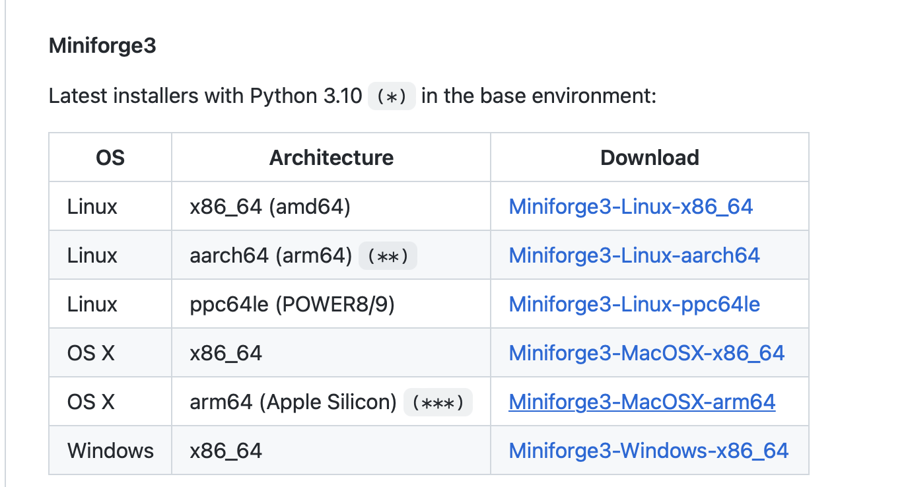
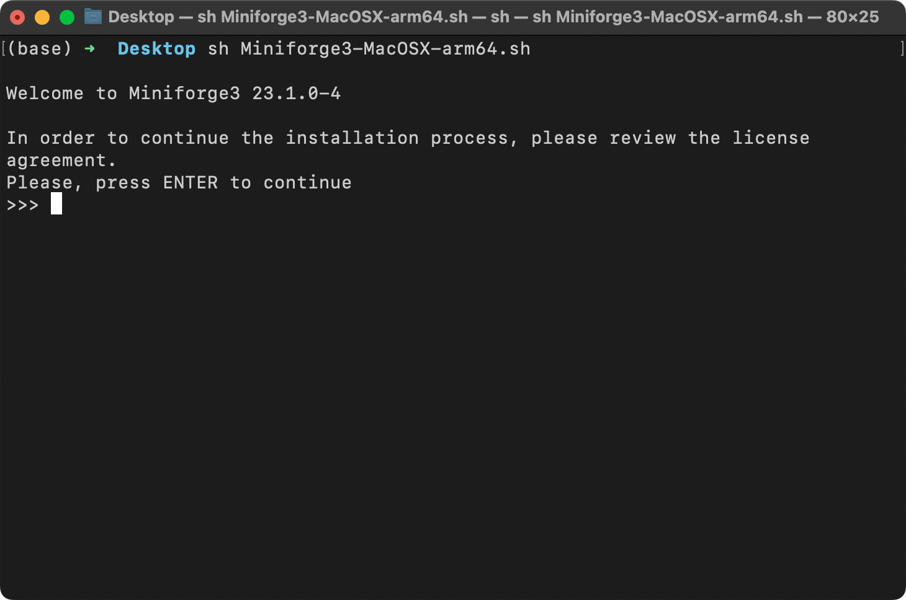
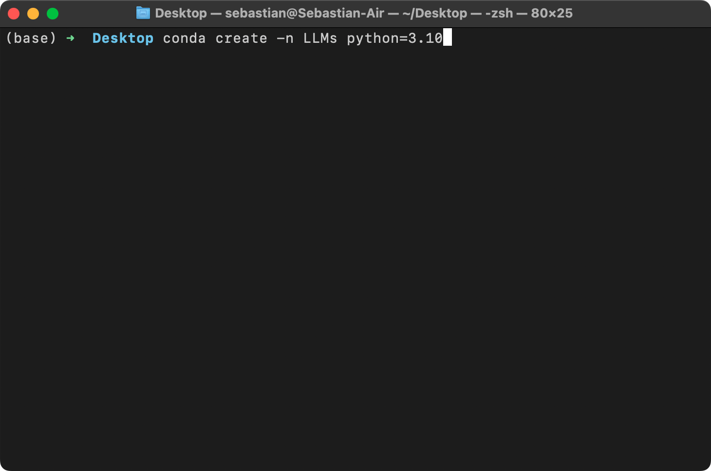
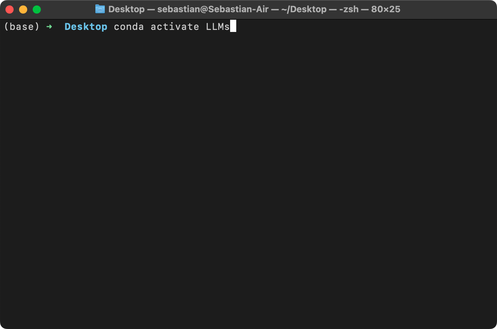
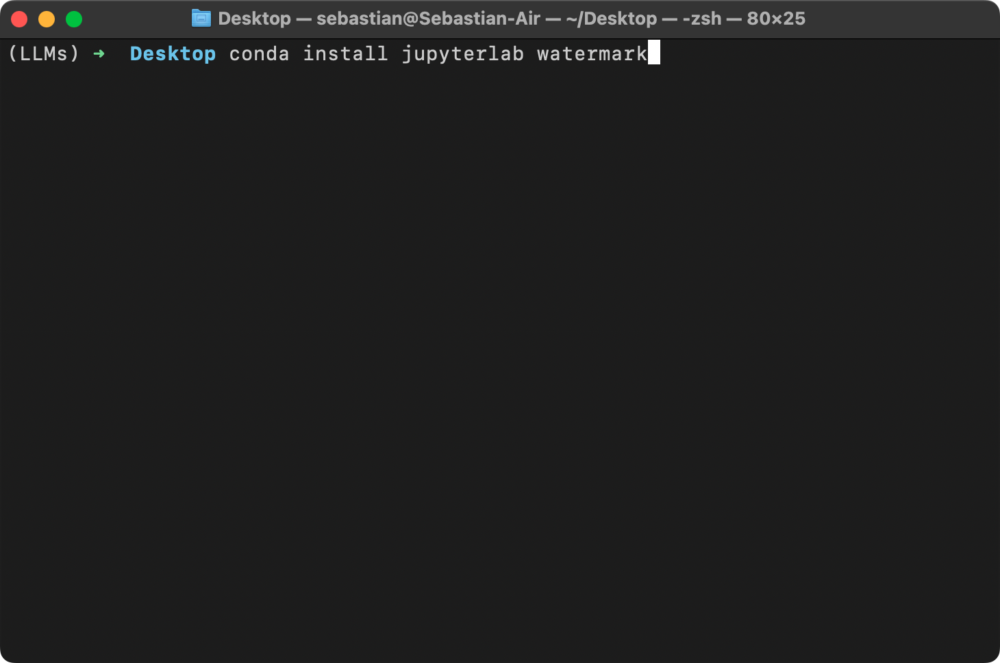
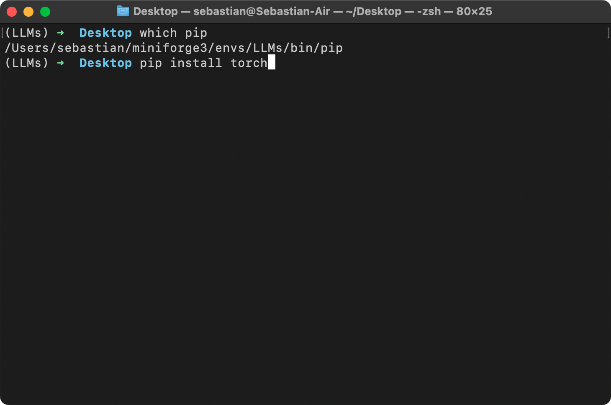
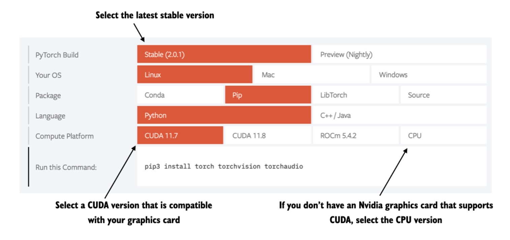

# Python Setup Tips

There are several different ways to install Python and set up your computing environment. Here, I'll cover my personal preferences.

(I use a computer running macOS, but this workflow is similar for computers running Linux and will probably work for other operating systems as well.)

<br>
<br>

## 1. Download and install Miniforge

Download miniforge from the GitHub repository [here](https://github.com/conda-forge/miniforge).



Depending on your operating system, this should download a `.sh` (macOS, Linux) or `.exe` file (Windows).

For `.sh` files, open your command line terminal and execute the following command

```bash
sh ~/Desktop/Miniforge3-MacOSX-arm64.sh
```

Where `Desktop/` is the folder where you downloaded the Miniforge installer. You may need to use `Downloadads/` instead.



Next, follow the download instructions and press "Enter" to confirm.

If you use many packages, Conda can be slow due to its thorough but complex dependency resolution process and handling of large package indexes and metadata. To speed up Conda, you can use the following setting, which will switch to a more efficient Rust reimplementation for resolving dependencies:

```
conda config --set solver libmamba
```

<br>
<br>

## 2. Create a new virtual environment

After the installation is successful, I recommend creating a new virtual environment called `dl-fundamentals`, which you can do by executing the following command

```bash
conda create -n LLMs python=3.10
```



> Many scientific computing libraries do not support the latest version of Python right away. Therefore, inWhen installing PyTorch, it is recommended to use an older version of Python, one or two versions older. For example, if the latest version of Python is 3.13, it is recommended to use Python 3.10 or 3.11.

Next, activate your new virtual environment (you must do this every time you open a new terminal window or tab):

```bash
conda activate dl-workshop
```



<br>
<br>

## Optional: Beautify your terminal

If you want to style your terminal similar to mine so that you can see which virtual environment is active, check out the [Oh My Zsh](https://github.com/ohmyzsh/ohmyzsh) project.

<br>
<br>

## 3. Install new Python libraries

To install new Python libraries, you can now use the `conda` package installer. For example, you can install [JupyterLab](https://jupyter.org/install) and [watermark](https:////github.com/rasbt/watermark) as follows:

```bash
conda install jupyterlab watermark
```



You can also still install libraries using `pip`. By default, `pip` should be linked to your new `LLms` conda environment:



<br>
<br>

## 4. Install PyTorch

PyTorch can be installed using pip like any other Python library or package. For example:

```bash
pip install torch==2.0.1
```

However, since PyTorch is a comprehensive library with CPU- and GPU-compatible code, installation may require additional setup and instructions (see *A.1.3 Installing PyTorch* in the book for more information).

It is also strongly recommended to install the official PyTorchSee more information in the installation guide menu of the h website [https://pytorch.org](https://pytorch.org).



---

Any questions? Feel free to contact us in the [Discussion Forum](https://github.com/rasbt/LLMs-from-scratch/discussions).