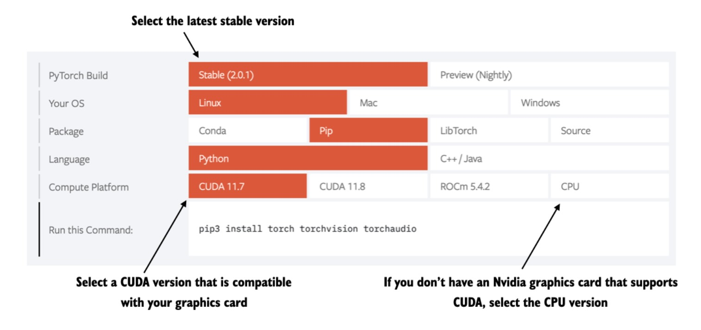

# Libraries used in this book

This document provides more information about checking installed Python versions and packages. (For more information about installing Python and Python packages, see the [../01_optional-python-setup-preferences](../01_optional-python-setup-preferences) folder.)

We use the following main libraries in this book. Newer versions of these libraries may also be compatible. However, if you encounter any issues with the code, you can try using the following library versions as fallbacks:

- numpy 1.24.3
- scipy 1.10.1
- pandas 2.0.2
- matplotlib 3.7.1
- jupyterlab 4.0
- watermark 2.4.2
- torch 2.0.1
- tiktoken 0.5.1

To install these dependencies most conveniently, you can use a `requirements.txt` file:

```
pip install -r requirements.txt
```

Then, once the installation is complete, check that all packages are installed and are up to date using the following command:

```
python_environment_check.py
```


It is also recommended to check the version in JupyterLab by running `jupyter_environment_check.ipynb` in this directory, which should ideally give you the same results as above.


If you see the following issue, it is possible that your JupyterLab instance is connected to the wrong conda environment:


In this case, you can use `watermark` to check if the JupyterLab instance is opened in the correct conda environment using the `--conda` flag:


<br>
<br>

## Install PyTorch

PyTorch can be installed like any other Python library orThe package can be installed using pip as usual. For example:

```bash
pip install torch==2.0.1
```

However, since PyTorch is a comprehensive library with CPU- and GPU-compatible code, installation may require additional setup and instructions (see *A.1.3 Installing PyTorch* in the book for more information).

It is also highly recommended to check out more information in the Installation Guide menu of the official PyTorch website [https://pytorch.org](https://pytorch.org).



---

If you have any questions, feel free to contact us in the [Discussion Forum](https://github.com/rasbt/LLMs-from-scratch/discussions).