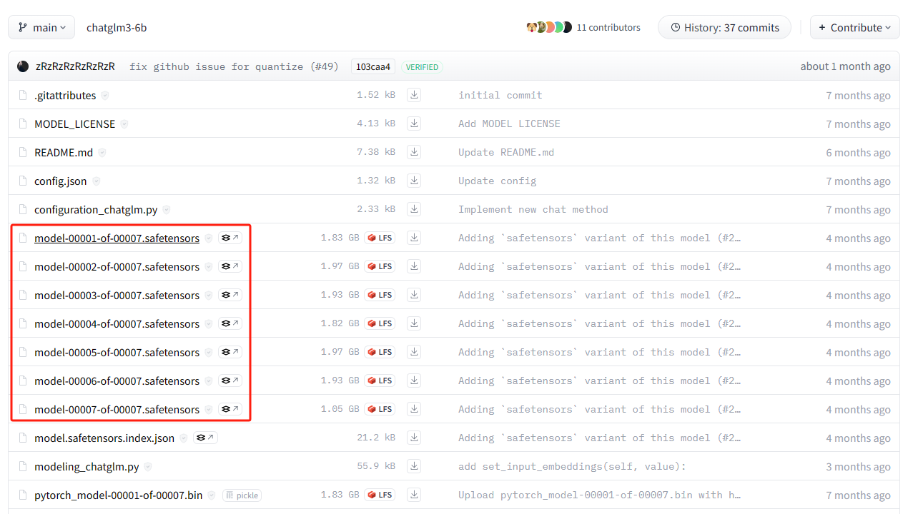

# Hands-on implementation of ChatGLM3-6B

This tutorial is a hands-on implementation of [ChatGLM3-6B](https://huggingface.co/THUDM/chatglm3-6b). It has now been separated from the transformers dependency work. It will probably take a long time to explain the model architecture.

## 0. Model architecture explanation

In progress

## 1. Download model weights

Before implementing the model, please download the original model weights first. We only need the `safetensors` file in the model repository, and only this part is the weight that is actually used.


There is also another model, the tokenizer model (`tokenizer.model`). I have already put it in this repository, so you don't need to download it.

Run the following command in this directory to download the weights to the `weights` directory, and we can load it directly later.

```bash
pip install -U "huggingface_hub[cli]"
export HF_ENDPOINT=https://hf-mirror.com
huggingface-cli download THUDM/chatglm3-6b --include "*.safetensors" --local-dir weights
```

The second line of the above command uses [hf-mirror](https://hf-mirror.com) mirror to accelerate downloading. For domestic users, if your network can directly access huggingface, you can skip it.

If you are a Windows user, modify the second line according to the shell type

```bash
# For powershell
$env:HF_ENDPOINT = "https://hf-mirror.com"
# For cmd
set HF_ENDPOINT = "https://hf-mirror.com"
```

## 2. Load model weights & inference

[Load model weights](./Load model weights.ipynb)

## 3. Implement various sampling strategies

Serialization

## 4. Implement multi-round dialogue (Chat Format)

Serialization