# Implementing llama3 from scratch
In this file, I implemented llama3 from scratch tensor by tensor and matrix by matrix.
You can run it locally: llama3-from-scratch.ipynb
<br>
Also, I will load tensors directly from the model file provided by meta to llama3, you need to download weights before running this file.
Here is the official link to download weights: [Click here to download weights](https://llama.meta.com/llama-downloads/)

<div>

</div>
https://hf-mirror.com/NousResearch/Meta-Llama-3-8B
https://gitee.com/hf-models/Meta-Llama-3-8B-Instruct/
## Tokenizer
I am not going to implement a BPE tokenizer (but Andrej Karpathy has a very clean implementation).
<br>
His implementation link: [Click here to view his implementation](https://github.com/karpathy/minbpe)

<div>

</div>

```python
%env HF_ENDPOINT = "https://hf-mirror.com"
```

env: HF_ENDPOINT="https://hf-mirror.com"

```python
%pip install blobfile -q
```

Note: you may need to restart the kernel to use updated packages.

```python
from pathlib import Path
import tiktoken
from tiktoken.load import load_tiktoken_bpe
import torch
import json
import matplotlib.pyplot as plt

tokenizer_path = "./tokenizer.model"
special_tokens = [
"<|begin_of_text|>","<|end_of_text|>",
"<|reserved_special_token_0|>",
"<|reserved_special_token_1|>",
"<|reserved_special_token_2|>",
"<|reserved_special_token_3|>",
"<|start_header_id|>",
"<|end_header_id|>",
"<|reserved_special_token_4|>",
"<|eot_id|>", # end of turn
] + [f"<|reserved_special_token_{i}|>" for i in range(5, 256 - 5)]
mergeable_ranks = load_tiktoken_bpe(tokenizer_path)
tokenizer = tiktoken.Encoding(
name=Path(tokenizer_path).name,
pat_str=r"(?i:'s|'t|'re|'ve|'m|'ll|'d)|[^\r\n\p{L}\p{N}]?\p{L}+|\p{N}{1,3}| ?[^\s\p{L}\p{N}]+[\r\n]*|\s*[\r\n]+|\s+(?!\S)|\s+",
mergeable_ranks=mergeable_ranks,
special_tokens={token: len(mergeable_ranks) + i for i, token in enumerate(special_tokens)},
)

tokenizer.decode(tokenizer.encode("hello world!"))
```

'hello world!'

## Reading the model file
Usually, reading the model file depends on how the model class is written and the variable names in it.
<br>
But since we are implementing llama3 from scratch, we will read the file tensor by tensor.

<div>

</div>

You can download the model here: https://gitee.com/hf-models/Meta-Llama-3-8B-Instruct/blob/main/original/consolidated.00.pth

```python
!wget 'https://lfs.gitee.com/api/lfs/storage/projects/34266234/be52262c9289304f3e8240e0749bf257bc04264405a86cd4de38efb9068724ee?Expires=1716626632&Signature=xgDOu9JHNM6ECazR3nA4NQHwXs%2BiG%2BCtnzza6ekSuqs%3D&FileName=consolidated.00.pth'
```

--2024-05-25 16:24:15-- https://lfs.gitee.com/api/lfs/storage/projects/34266234/be52262c9289304f3e8240e0749bf257bc04264405a86cd4de38efb9068724ee?Expires=1716626632&Signature=xgDOu9JHNM6ECazR3nA4NQHwXs%2BiG%2BCtnzza6ekSuqs%3D&FileName=consolidated.00.pth
Resolving lfs.gitee.com (lfs.gitee.com)... 180.76.198.180
Connecting to lfs.gitee.com (lfs.gitee.com)|180.76.198.180|:443... connected.
HTTP request sent, awaiting response... 200 OK
Length: 16060617592 (15G) [application/octet-stream]
Saving to: 'be52262c9289304f3e8240e0749bf257bc04264405a86cd4de38efb9068724ee?Expires=1716626632&Signature=xgDOu9JHNM6ECazR3nA4NQHwXs+iG+Ctnzza6ekSuqs=&FileName=consolidated.00.pth’

0% [ ] 105,193,134 453KB/s eta 11h 21m^C

My machine can load in 12s. Next, I will use the CPU for reasoning. 30G of memory is enough for me. Then the CPU takes about 30s to reason about one word, which is a little slower. But we mainly understand the principle

```python
model = torch.load("/data1/ckw/consolidated.00.pth")
print(json.dumps(list(model.keys())[:20], indent=4))
```

[
"tok_embeddings.weight",
"layers.0.attention.wq.weight",
"layers.0.attention.wk.weight","layers.0.attention.wv.weight",
"layers.0.attention.wo.weight",
"layers.0.feed_forward.w1.weight",
"layers.0.feed_forward.w3.weight",
"layers.0.feed_forward.w2.weight",
"layers.0.attention_norm.weight",
"layers.0.ffn_norm.weight",
"layers.1.attention.wq.weight",
"layers.1.attention.wk.weight",
"layers.1.attention.wv.weight",
"layers.1.attention.wo.weight",
"layers.1.feed_forward.w1.weight",
"layers.1.feed_forward.w3.weight",
"layers.1.feed_forward.w2.weight",
"layers.1.attention_norm.weight",
"layers.1.ffn_norm.weight",
"layers.2.attention.wq.weight"
]

```python
with open("./params.json", "r") as f:
config = json.load(f)
config
```

{'dim': 4096,
'n_layers': 32,
'n_heads': 32,
'n_kv_heads': 8,
'vocab_size': 128256,
'multiple_of': 1024,
'ffn_dim_multiplier': 1.3,
'norm_eps': 1e-05,
'rope_theta': 500000.0}

## We use this configuration to infer model details, such as:
1. The model has 32 Transformer layers
2. Each multi-head attention block has 32 heads
3. Vocabulary size, etc.

```python
dim = config["dim"]
n_layers = config["n_layers"]
n_heads = config["n_heads"]
n_kv_heads = config["n_kv_heads"]
vocab_size = config["vocab_size"]
multiple_of = config["multiple_of"]
ffn_dim_multiplier = config["ffn_dim_multiplier"]
norm_eps = config["norm_eps"]
rope_theta = torch.tensor(config["rope_theta"])
```

## Convert text to tokens
Here we use tiktoken (I think it is a library from OpenAI) as a tokenizer

<div>

</div>

```python
prompt = "the answer to the ultimate question of life, the universe, and everything is "
tokens = [128000] + tokenizer.encode(prompt)
print(tokens)
tokens = torch.tensor(tokens)
prompt_split_as_tokens = [tokenizer.decode([token.item()]) for token in tokens]
print(prompt_split_as_tokens)
```

[128000, 1820, 4320, 311, 279, 17139, 3488, 315, 2324, 11, 279, 15861, 11, 323, 4395, 374, 220]
['<|begin_of_text|>', 'the', ' answer', ' to', ' the', ' ultimate', ' question', ' of', ' life', ',', ' the', ' universe', ',', ' and', ' everything', ' is', ' ']

## Convert tokens to their embedding vectors
This is the only part of the codebase where I use the built-in neural network module.
<br>
Anyway, our [17x1] tokens are now [17x4096], i.e. 17 embedding vectors (one for each token) of length 4096.
<br>
<br>
Note: Keep track of the shapes so it’s easier to understand everything

<div>
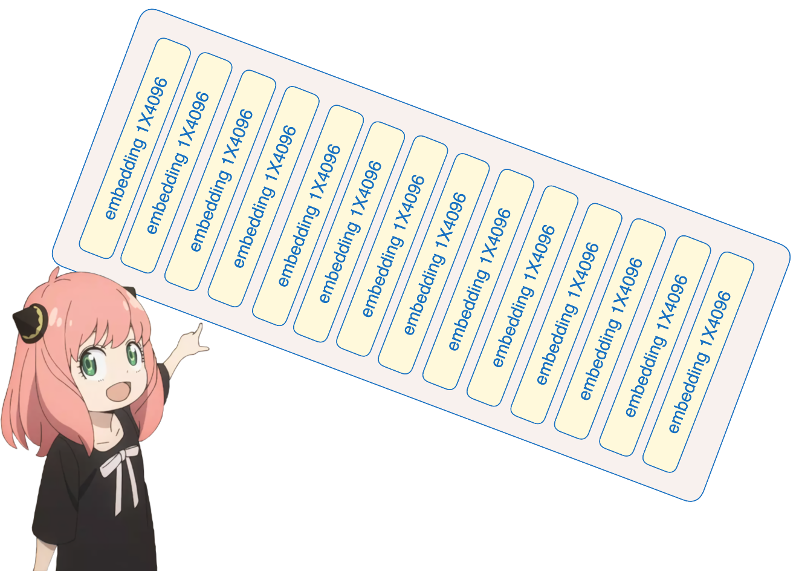
</div>

```python
embedding_layer = torch.nn.Embedding(vocab_size, dim)
embedding_layer.weight.data.copy_(model["tok_embeddings.weight"])
token_embeddings_unnormalized = embedding_layer(tokens).to(torch.bfloat16)token_embeddings_unnormalized.shape
```

torch.Size([17, 4096])

## We then normalize the embedding vectors using RMS normalization
Note that the shape does not change after this step, just the values ​​are normalized.
<br>
Something to remember, we need a norm_eps (from the config) because we don’t want to accidentally set the RMS to 0 and divide by 0.
<br>
Here is the formula:
<div>

</div>

```python
# def rms_norm(tensor, norm_weights):
# rms = (tensor.pow(2).mean(-1, keepdim=True) + norm_eps)**0.5
# return tensor * (norm_weights / rms)
def rms_norm(tensor, norm_weights):
return (tensor * torch.rsqrt(tensor.pow(2).meanan(-1, keepdim=True) + norm_eps)) * norm_weights
```

# Build the first layer of the Transformer

### Normalization
You will see that I access layer.0 (which is the first layer) from the model dictionary.
<br>
Anyway, so after we normalize, the shape is still [17x4096], the same as the embedding vector, but normalized

<div>

</div>

```python
token_embeddings = rms_norm(token_embeddings_unnormalized, model["layers.0.attention_norm.weight"])
token_embeddings.shape
```

torch.Size([17, 4096])

### Attention mechanism implemented from scratch
Let's load the attention head of the first layer of the Transformer

<div>

</div>

<br>

&gt; When we load the query, key, value, and output vectors from the model, we notice that their shapes are [4096x4096], [1024x4096], [1024x4096], [4096x4096]
<br>
&gt; This may seem strange at first, since ideally we would like q, k, v, and o to be separate for each attention head
<br>
&gt; The author of the code bundled them together because it is easier to parallelize the multiplication of the attention heads.
<br>
&gt; I'm going to unpack everything...

```python
print(
model["layers.0.attention.wq.weight"].shape,
model["layers.0.attention.wk.weight"].shape,
model["layers.0.attention.wv.weight"].shape,
model["layers.0.attention.wo.weight"].shape
)
```

torch.Size([4096, 4096]) torch.Size([1024, 4096]) torch.Size([1024, 4096]) torch.Size([4096, 4096])

### Unpacking the query
In the next section, we will unpack the query from multiple attention heads, resulting in a shape of [32x128x4096]
<br><br>
Here, 32 is the number of attention heads in llama3, 128 is the size of the query vector, and 4096 is the size of the token embedding

```python
q_layer0 = model["layers.0.attention.wq.weight"]
head_dim = q_layer0.shape[0] // n_heads
q_layer0 = q_layer0.view(n_heads, head_dim, dim)
q_layer0.shape
```

torch.Size([32, 128, 4096])

### I want to implement the first attention head of the first layer
Here, I first access the query weight matrix of the first attention head of the first layer, the size of which is [128x4096]

```python
q_layer0_head0 = q_layer0[0]
q_layer0_head0.shape```

torch.Size([128, 4096])

### Now we multiply the query weights with the token embeddings to get the query for each token
Here you can see that the result is of shape [17x128], this is because we have 17 tokens and for each token there is a query of length 128.

<div>
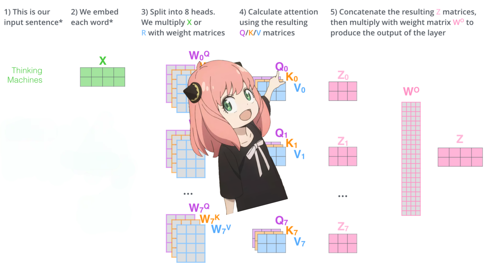
</div>

```python
q_per_token = torch.matmul(token_embeddings, q_layer0_head0.T)
q_per_token.shape
```

torch.Size([17, 128])

## Positional Encoding
Now we are at a stage where we have a query vector for each token in our hint, but if you think about it - each individual query vector does not know where in the hint it is.
<br><br>
Query: "The answer to the ultimate question of life, the universe and everything is"
<br><br>
In our prompt, we used "the" three times, and we need all 3 "the" tokens to have different query vectors based on their position in the queryquery vectors (each of size [1x128]). We use RoPE (Rotational Position Encoding) to perform these rotations.
<br><br>
### RoPE
Watch this video (which I watched) to understand the math.
[Click here to watch the video](https://www.youtube.com/watch?v=o29P0Kpobz0&t=530s)

<div>

</div>

```python
q_per_token_split_into_pairs = q_per_token.float().view(q_per_token.shape[0], -1, 2)
q_per_token_split_into_pairs.shape
```

torch.Size([17, 64, 2])

In the above step, we split the query vector into pairs and applied the rotation angle offset to each pair!
<br><br>
Now we have a vector of size [17x64x2], which is 128 length query split into 64 pairs, for each token in the prompt! Each of these 64 pairs will be rotated by m*(theta), where m is ourRotating the position of the queried marker!

<div>
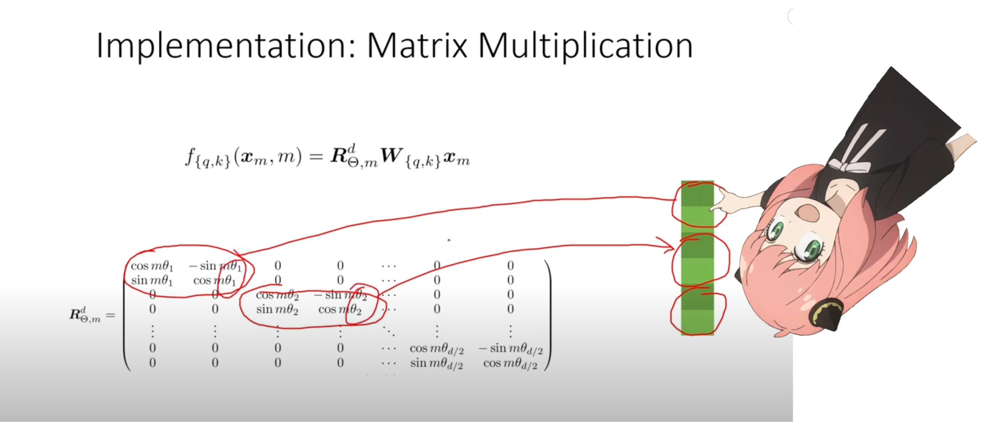
</div>

## Use the dot product of complex numbers to rotate vectors
<div>
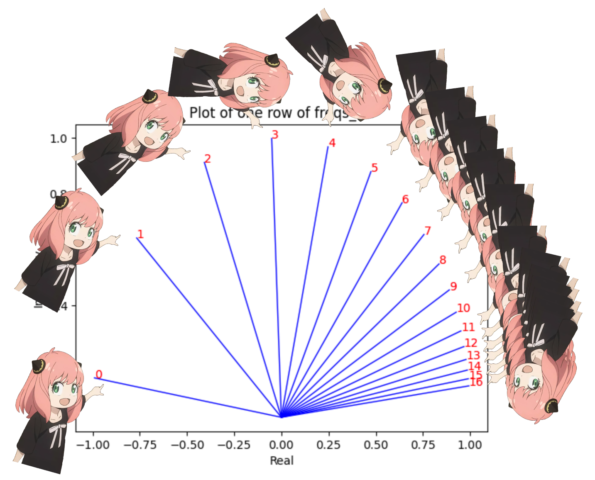
</div>

```python
zero_to_one_split_into_64_parts = torch.tensor(range(64))/64
zero_to_one_split_into_64_parts
```

tensor([0.0000, 0.0156, 0.0312, 0.0469, 0.0625, 0.0781, 0.0938, 0.1094, 0.1250,
0.1406, 0.1562, 0.1719, 0.1875, 0.2031, 0.2188, 0.2344, 0.2500, 0.2656,
0.2812, 0.2969, 0.3125, 0.3281, 0.3438, 0.3594, 0.3750, 0.3906, 0.4062,
0.4219, 0.4375, 0.4531, 0.4688, 0.4844, 0.5000, 0.5156, 0.5312, 0.5469,
0.5625, 0.5781, 0.5938, 0.6094, 0.6250, 0.6406, 0.6562, 0.6719, 0.6875,
0.7031, 0.7188, 0.7344, 0.7500, 0.7656, 0.7812, 0.7969, 0.8125, 0.8281,
0.8438, 0.8594, 0.8750, 0.8906, 0.9062, 0.9219, 0.9375, 0.9531, 0.9688,
0.9844])

```python
freqs = 1.0 / (rope_theta ** zero_to_one_split_into_64_parts)
freqs
```

tensor([1.0000e+00, 8.1462e-01, 6.6360e-01, 5.4058e-01, 4.4037e-01, 3.5873e-01,
2.9223e-01, 2.3805e-01, 1.9392e-01, 1.5797e-01, 1.2869e-01, 1.0483e-01,
8.5397e-02, 6.9566e-02, 5.6670e-02, 4.6164e-02, 3.7606e-02, 3.0635e-02,
2.4955e-02, 2.0329e-02, 1.6560e-02, 1.3490e-02, 1.0990e-02, 8.9523e-03,
7.2927e-03, 5.9407e-03, 4.8394e-03, 3.9423e-03, 3.2114e-03, 2.6161e-03,
2.1311e-03, 1.7360e-03, 1.4142e-03, 1.1520e-03, 9.3847e-04, 7.6450e-04,
6.2277e-04, 5.0732e-04, 4.1327e-04, 3.3666e-04, 2.7425e-04, 2.2341e-04,
1.8199e-04, 1.4825e-04, 1.2077e-04, 9.8381e-05, 8.0143e-05, 6.5286e-05,
5.3183e-05, 4.3324e-05, 3.5292e-05, 2.8750e-05, 2.3420e-05, 1.9078e-05,
1.5542e-05, 1.2660e-05, 1.0313e-05, 8.4015e-06, 6.8440e-06, 5.5752e-06,
4.5417e-06, 3.6997e-06, 3.0139e-06, 2.4551e-06])

```python
plt.rcParams['axes.unicode_minus'] = False # Display minus sign
```

```python
plt.rcParams["font.sans-serif"]=['simhei']
freqs_for_each_token = torch.outer(torch.arange(17), freqs)
freqs_cis = torch.polar(torch.ones_like(freqs_for_each_token), freqs_for_each_token)
freqs_cis.shape

# View the third line of freqs_cis
value = freqs_cis[3]
plt.figure()
for i, element in enumerate(value[:17]):
plt.plot([0, element.real], [0, element.imag], color='blue', linewidth=1, label=f"Index: {i}")
plt.annotate(f"{i}", xy=(element.real, element.imag), color='red')
plt.xlabel('Real part')
plt.ylabel('Imaginary part')
plt.title('Graphic of a line of freqs_cis')
plt.show()

```

### Now we have a complex number (angle change vector) for each tokenized query element
We can convert our queries (the ones we split into pairs) to complex numbers and then do a dot product to rotate the query based on position
<br>
Honestly, it’s really nice to think about it this way :)

```python
q_per_token_as_complex_numbers = torch.view_as_complex(q_per_token_split_into_pairs)
q_per_token_as_complex_numbers.shape
```

torch.Size([17, 64])

```python
q_per_token_as_complex_numbers_rotated = q_per_token_as_complex_numbers * freqs_cis
q_per_token_as_complex_numbers_rotated.shape
```

torch.Size([17, 64])

### After obtaining the rotation vector
We can treat the complex number as a real numberto retrieve our query pairs

```python
q_per_token_split_into_pairs_rotated = torch.view_as_real(q_per_token_as_complex_numbers_rotated)
q_per_token_split_into_pairs_rotated.shape
```

torch.Size([17, 64, 2])

The rotated query pairs are now merged and we now have a new query vector (the rotated query vector) with a shape of \[17x128\], where 17 represents the number of tokens and 128 represents the dimension of the query vector.

```python
q_per_token_rotated = q_per_token_split_into_pairs_rotated.view(q_per_token.shape)
q_per_token_rotated.shape
```

torch.Size([17, 128])

# keys (almost the same as query)

<div>

</div>
I'm too lazy so I'm not going to do the math for the key, a few things to remember are:
<br>
&gt; The key vector generated by the key is also 128-dimensional
<br>
&gt; The key has only one-fourth the number of weights as the query, this is because the key weights are shared among the 4 heads to reduce the amount of computation
<br>
&gt; The key is also rotated to add position information, just like the query, for the same reason

```python
k_layer0 = model["layers.0.attention.wk.weight"]
k_layer0 = k_layer0.view(n_kv_heads, k_layer0.shape[0] // n_kv_heads, dim)
k_layer0.shape
```

torch.Size([8, 128, 4096])

```python
k_layer0_head0 = k_layer0[0]
k_layer0_head0.shape
```

torch.Size([128, 4096])

```python
k_per_token = torch.matmul(token_embeddings,k_layer0_head0.T)
k_per_token.shape
```

torch.Size([17, 128])

```python
k_per_token_split_into_pairs = k_per_token.float().view(k_per_token.shape[0], -1, 2)
k_per_token_split_into_pairs.shape
```

torch.Size([17, 64, 2])

```python
k_per_token_as_complex_numbers = torch.view_as_complex(k_per_token_split_into_pairs)
k_per_token_as_complex_numbers.shape
```

torch.Size([17, 64])

```python
k_per_token_split_into_pairs_rotated = torch.view_as_real(k_per_token_as_complex_numbers * freqs_cis)
k_per_token_split_into_pairs_rotated.shape
```

torch.Size([17, 64, 2])

```python
k_per_token_rotated = k_per_token_split_into_pairs_rotated.view(k_per_token.shape)
k_per_token_rotated.shape
```

torch.Size([17, 128])

## At this stage, we now have the rotated query and key values ​​for each token.
<div>

</div>
Each query and key now has a shape of [17x128].

## Next we will multiply the query and key matrices together
Doing this will give us a score that maps each token to each other
<br>
This score describes the relationship between the query for each token and the key for each token.
This is the self-attention mechanism :)
<br>
The shape of the attention score matrix (qk_per_token) is [17x17], where 17 is the number of tokens in the prompt

<div>

</div>

```python
qk_per_token = torch.matmul(q_per_token_rotated, k_per_token_rotated.T)/(head_dim)**0.5
qk_per_token.shape
```

torch.Size([17, 17])

# Now we need to mask the query key scores
During the training process of llama3, the query key scores of future tokens are masked.
<br>
Why? Because during training, we only learn to predict tokens using past tokens.
<br>
So during inference, we set the future token scores to zero.

<div>
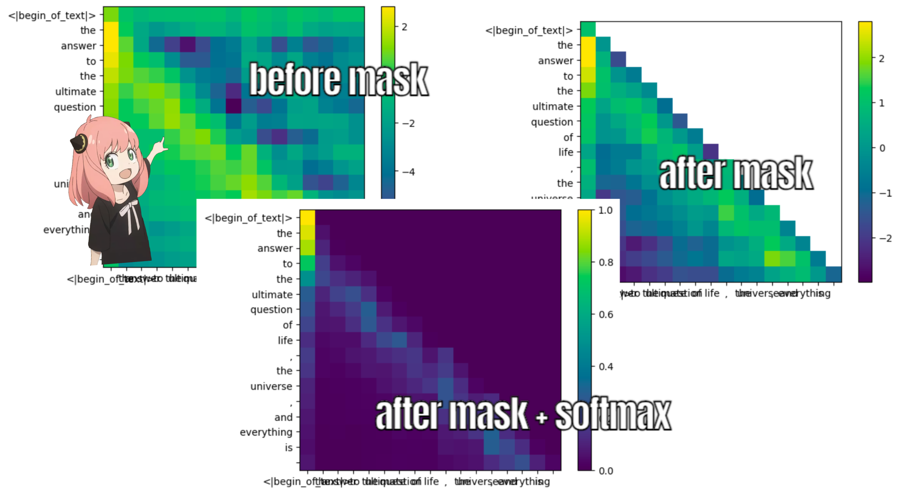
</div>

```python
def display_qk_heatmap(qk_per_token):
fig, ax = plt.subplots(figsize=(30, 8)) # Set the image size to 12x8 inches
im = ax.imshow(qk_per_token.to(float).detach(), cmap='viridis')
ax.set_xticks(range(len(prompt_split_as_tokens)))
ax.set_yticks(range(len(prompt_split_as_tokens)))
ax.set_xticklabels(prompt_split_as_tokens)
ax.set_yticklabels(prompt_split_as_tokens)
ax.figure.colorbar(im, ax=ax)

display_qk_heatmap(qk_per_token)

```


```python
mask = torch.full((len(tokens), len(tokens)), float("-inf"), device=tokens.device)
mask = torch.triu(mask, diagonal=1)
mask
```

tensor([[0., -inf, -inf, -inf, -inf, -inf, -inf, -inf, -inf, -inf, -inf, -inf, -inf, -inf, -inf, -inf, -inf],
[0., 0., -inf, -inf, -inf, -inf, -inf, -inf, -inf, -inf, -inf, -inf, -inf, -inf, -inf, -inf, -inf],
[0., 0., 0., -inf, -inf, -inf, -inf, -inf, -inf, -inf, -inf, -inf, -inf, -inf, -inf, -inf, -inf],
[0., 0., 0., 0., -inf, -inf, -inf, -inf, -inf, -inf, -inf, -inf, -inf, -inf, -inf, -inf,-inf],
[0., 0., 0., 0., 0., -inf, -inf, -inf, -inf, -inf, -inf, -inf, -inf, -inf, -inf, -inf, -inf],
[0., 0., 0., 0., 0., -inf, -inf, -inf, -inf, -inf, -inf, -inf, -inf, -inf, -inf, -inf],
[0., 0., 0., 0., 0., 0., -inf, -inf, -inf, -inf, -inf, -inf, -inf, -inf, -inf],
[0., 0., 0., 0., 0., 0., -inf, -inf, -inf, -inf, -inf, -inf, -inf, -inf, -inf],
[0., 0., 0., 0., 0., 0., 0., -inf, -inf, -inf, -inf, -inf, -inf, -inf, -inf],
[0., 0., 0., 0., 0., 0., 0., 0., -inf, -inf, -inf, -inf, -inf, -inf, -inf, -inf, -inf],
[0., 0., 0., 0., 0., 0., 0., 0., 0., -inf, -inf, -inf, -inf, -inf, -inf, -inf, -inf],
[0., 0., 0., 0., 0., 0., 0., 0., 0., 0., -inf, -inf, -inf, -inf, -inf, -inf],
[0., 0., 0., 0., 0., 0., 0., 0., 0., 0., 0., -inf, -inf, -inf, -inf, -inf],
[0., 0., 0., 0., 0., 0., 0., 0., 0., 0., 0., -inf, -inf, -inf, -inf, -inf],
[0., 0., 0., 0., 0., 0., 0., 0., 0., 0., -inf, -inf, -inf, -inf, -inf],
[0., 0., 0., 0., 0., 0., 0., 0., 0., 0., 0., 0., 0., 0., -inf, -inf, -inf, -inf],
[0., 0., 0., 0., 0., 0., 0., 0., 0., 0., 0., 0., 0., -inf, -inf, -inf],
[0., 0., 0., 0., 0., 0., 0., 0., 0., 0., -inf, -inf, -inf],
[0., 0., 0., 0., 0., 0., 0., 0., 0., 0., 0., 0., 0., 0., -inf, -inf],
[0., 0., 0., 0., 0., 0., 0., 0., 0., 0., 0., 0., 0., 0., 0., 0., -inf],
[0., 0., 0., 0., 0., 0., 0., 0., 0., 0., 0., 0., 0., 0., 0., 0., 0., 0.]])

```python
qk_per_token_after_masking = qk_per_token + mask
display_qk_heatmap(qk_per_token_after_masking)
```


<div>
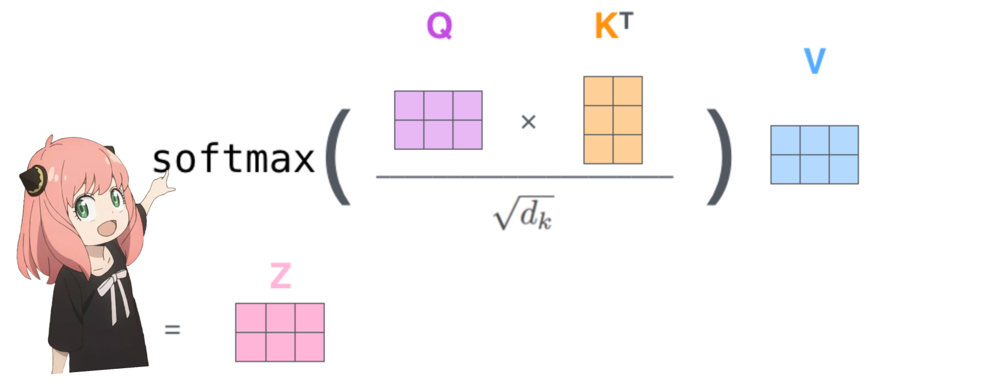
</div>

```python
qk_per_token_after_masking_after_softmax =torch.nn.functional.softmax(qk_per_token_after_masking, dim=1).to(torch.bfloat16)
display_qk_heatmap(qk_per_token_after_masking_after_softmax)
```


## Values ​​(last step of attention mechanism)

<div>

</div>
These scores (0-1) are used to determine how much of the value matrix to use for each token
<br>
&gt; Just like the keys, the weights of the values ​​are also shared among every 4 attention heads (to save computation)
<br>
&gt; So, the shape of the value weight matrix below is [8x128x4096]

```python
v_layer0 = model["layers.0.attention.wv.weight"]
v_layer0 = v_layer0.view(n_kv_heads, v_layer0.shape[0] // n_kv_heads, dim)
v_layer0.shape
```

torch.Size([8, 128, 4096])

The value weight matrix of the first layer, the first attention head is as follows:

```python
v_layer0_head0 = v_layer0[0]
v_layer0_head0.shape
```

torch.Size([128, 4096])

## Value vector
<div>
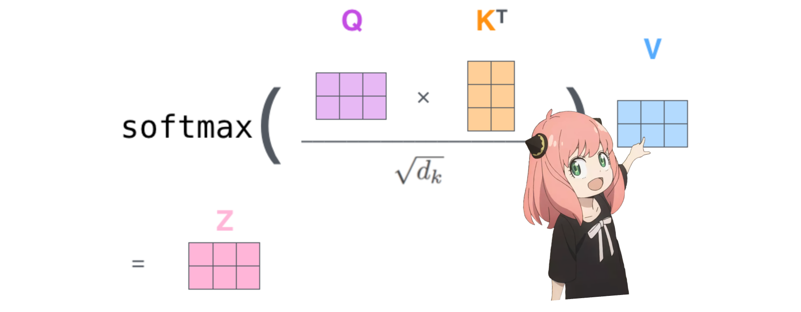
</div>
We now use the value weights to get the attention value for each token, which is of size [17x128], where 17 is the number of tokens in the prompt and 128 is the value vector dimension for each token.

```python
v_per_token = torch.matmul(token_embeddings, v_layer0_head0.T)
v_per_token.shape
```

torch.Size([17, 128])

## Attention mechanism
<div>

</div>
The shape of the attention vector after multiplying with the value of each token is [17x128].

```python
qkv_attention = torch.matmul(qk_per_token_after_masking_after_softmax, v_per_token)
qkv_attention.shape
```

torch.Size([17, 128])

# Multi-head attention mechanism
<div>

</div>
We now have the attention values ​​for the first layer and the first head
<br>
Next, I will run a loop to perform the same math as above for each head of the first layer.

```python
qkv_attention_store = []

for head in range(n_heads):
q_layer0_head = q_layer0[head]
k_layer0_head = k_layer0[head//4] # key weights are shared across 4 heads
v_layer0_head = v_layer0[head//4] # value weights are shared across 4 heads
q_per_token = torch.matmul(token_embeddings, q_layer0_head.T)
k_per_token = torch.matmul(token_embeddings, k_layer0_head.T)
v_per_token = torch.matmul(token_embeddings, v_layer0_head.T)
q_per_token_split_into_pairs = q_per_token.float().view(q_per_token.shape[0], -1, 2)
q_per_token_as_complex_numbers = torch.view_as_complex(q_per_token_split_into_pairs)
q_per_token_split_into_pairsrs_rotated = torch.view_as_real(q_per_token_as_complex_numbers * freqs_cis[:len(tokens)])
q_per_token_rotated = q_per_token_split_into_pairs_rotated.view(q_per_token.shape)

k_per_token_split_into_pairs = k_per_token.float().view(k_per_token.shape[0], -1, 2)
k_per_token_as_complex_numbers = torch.view_as_complex(k_per_token_split_into_pairs)
k_per_token_split_into_pairs_rotated = torch.view_as_real(k_per_token_as_complex_numbers * freqs_cis[:len(tokens)])
k_per_token_rotated= k_per_token_split_into_pairs_rotated.view(k_per_token.shape)

qk_per_token = torch.matmul(q_per_token_rotated, k_per_token_rotated.T)/(128)**0.5
mask = torch.full((len(tokens), len(tokens)), float("-inf"), device=tokens.device)
mask = torch.triu(mask, diagonal=1)
qk_per_token_after_masking = qk_per_token + mask
qk_per_token_after_masking_after_softmax = torch.nn.functional.softmax(qk_per_token_after_masking, dim=1).to(torch.bfloat16)
qkv_attention = torch.matmul(qk_per_token_after_masking_after_softmax, v_per_token)
qkv_attention = torch.matmul(qk_per_token_after_masking_after_softmax, v_per_token)
qkv_attention_store.append(qkv_attention)

len(qkv_attention_store)
```

32

<div>

</div>
We now have the qkv_attention matrix for all 32 heads on the first layer, and next I will merge all the attention scores into a large matrix of size [17x4096].
<br>
We are almost done :)

```python
stacked_qkv_attention = torch.cat(qkv_attention_store, dim=-1)
stacked_qkv_attention.shape
```

torch.Size([17, 4096])

# Weight matrix, one of the last steps
<div>

</div>
For the layer 0 attention mechanism, the last thing to do is to multiply the attention value with the weight matrix.

```python
w_layer0 = model["layers.0.attention.wo.weight"]
w_layer0.shape
```

torch.Size([4096, 4096])

### This is a simple linear layer, so we only need to do matrix multiplication

```python
embedding_delta = torch.matmul(stacked_qkv_attention, w_layer0.T)
embedding_delta.shape
```

torch.Size([17, 4096])

<div>
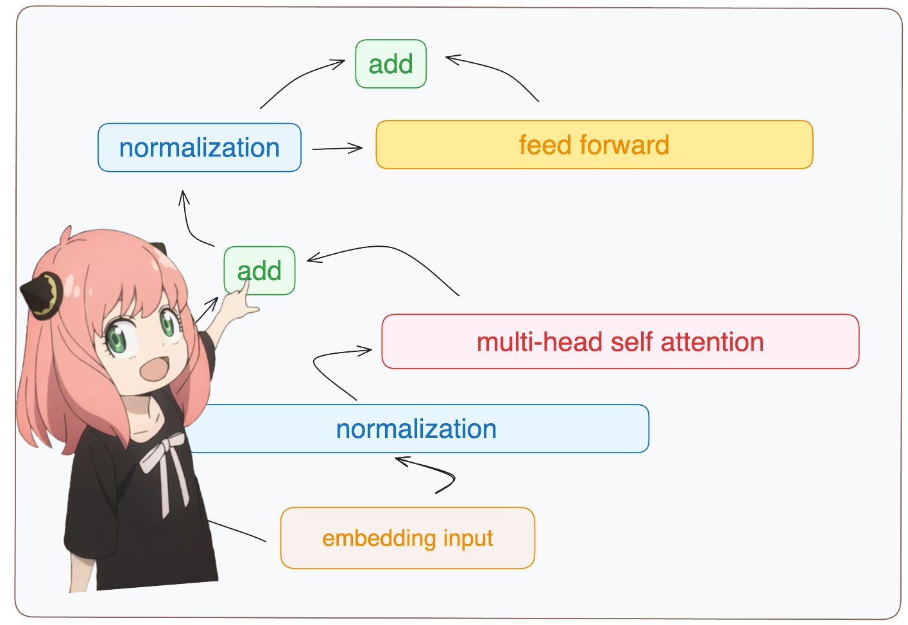
</div>
We now have the afterattention mechanismThe embedding value changes, and this change should be added to the original token embedding.

```python
embedding_after_edit = token_embeddings_unnormalized + embedding_delta
embedding_after_edit.shape
```

torch.Size([17, 4096])

## We normalize the embedding delta and then process it through a feedforward neural network
<div>

</div>

```python
embedding_after_edit_normalized = rms_norm(embedding_after_edit, model["layers.0.ffn_norm.weight"])
embedding_after_edit_normalized.shape
```

torch.Size([17, 4096])

## Load the feedforward network weights and implement the feedforward network
<div>
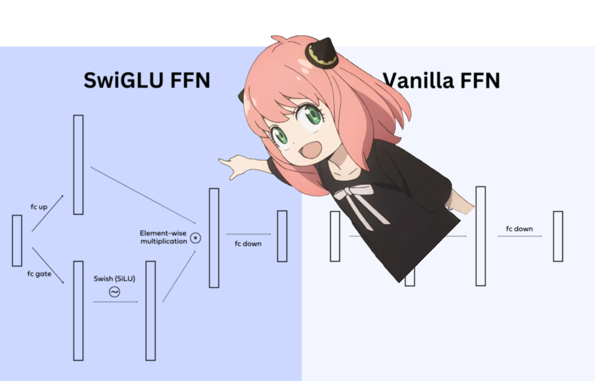
</div>
In llama3, they used a SwiGLU feedforward network, which is a network architecture that is very good at adding nonlinearity when the model needs it.
<br>
It is pretty standard to use this feedforward network architecture in large language models nowadays.

```python
w1 = model["layers.0.feed_forward.w1.weight"]
w2 = model["layers.0.feed_forward.w2.weight"]
w3 = model["layers.0.feed_forward.w3.weight"]
output_after_feedforward = torch.matmul(torch.functional.F.silu(torch.matmul(embedding_after_edit_normalized, w1.T)) * torch.matmul(embedding_after_edit_normalized, w3.T), w2.T)
output_after_feedforward.shape
```

torch.Size([17, 4096])

# We finally have a new edited embedding for each token after the first layer
Only 31 layers left to complete (just one loop)
<br>
You can imagine that this edited embedding contains information about all queries from the first layer
<br>
Now, each layer will encode more and more complex queries until we get an embedding that knows all the information we need for the next token.

```python
layer_0_embedding = embedding_after_edit+output_after_feedforward
layer_0_embedding.shape
```

torch.Size([17, 4096])

# OMG, it all comes together
<div>

</div>
Yeah, that's it. Everything we did before, now done at once, for every layer.
<br>

# Have fun reading :)

```python
final_embedding = token_embeddings_unnormalized
for layer in range(n_layers):qkv_attention_store = []
layer_embedding_norm = rms_norm(final_embedding, model[f"layers.{layer}.attention_norm.weight"])
q_layer = model[f"layers.{layer}.attention.wq.weight"]
q_layer = q_layer.view(n_heads, q_layer.shape[0] // n_heads, dim)
k_layer = model[f"layers.{layer}.attention.wk.weight"]
k_layer = k_layer.view(n_kv_heads, k_layer.shape[0] // n_kv_heads, dim)
v_layer = model[f"layers.{layer}.attention.wv.weight"]
v_layer = v_layer.view(n_kv_heads, v_layer.shape[0] // n_kv_heads, dim)
w_layer = model[f"layers.{layer}.attention.wo.weight"]
for head in range(n_heads):
q_layer_head = q_layer[head]
k_layer_head = k_layer[head//4]
v_layer_head = v_layer[head//4]
q_per_token = torch.matmul(layer_embedding_norm, q_layer_head.T)
k_per_token = torch.matmul(layer_embedding_norm, k_layer_head.T)
v_per_token = torch.matmul(layer_embedding_norm, v_layer_head.T)
q_per_token_split_into_pairs = q_per_token.float().view(q_per_token.shape[0], -1, 2)
q_per_token_as_complex_numbers = torch.view_as_complex(q_per_token_split_into_pairs)
q_per_token_split_into_pairs_rotated = torch.view_as_real(q_per_token_as_complex_numbers * freqs_cis)
q_per_token_rotated = q_per_token_split_into_pairs_rotated.view(q_per_token.shape)
k_per_token_split_into_pairs = k_per_token.float().view(k_per_token.shape[0], -1, 2)
k_per_token_as_complex_numbers = torch.view_as_complex(k_per_token_split_into_pairs)
k_per_token_split_into_pairs_rotated = torch.view_as_real(k_per_token_as_complex_numbers * freqs_cis)
k_per_token_rotated = k_per_token_split_into_pairs_rotated.view(k_per_token.shape)
qk_per_token = torch.matmul(q_per_token_rotated, k_per_token_rotated.T)/(128)**0.5
mask = torch.full((len(token_embeddings_unnormalized), len(token_embeddings_unnormalized)), float("-inf"))
mask = torch.triu(mask, diagonal=1)
qk_per_token_after_masking = qk_per_token + mask
qk_per_token_after_masking_after_softmax = torch.nn.functional.softmax(qk_per_token_after_masking, dim=1).to(torch.bfloat16)
qkv_attention = torch.matmul(qk_per_token_after_masking_after_softmax, v_per_token)
qkv_attention_store.append(qkv_attention)

stacked_qkv_attention = torch.cat(qkv_attention_store, dim=-1)
w_layer = model[f"layers.{layer}.attention.wo.weight"]
embedding_delta = torch.matmul(stacked_qkv_attention, w_layer.T)
embedding_after_edit = final_embedding + embedding_delta
embedding_after_edit_normalized = rms_norm(embedding_after_edit, model[f"layers.{layer}.ffn_norm.weight"])
w1 = model[f"layers.{layer}.feed_forward.w1.weight"]
w2 = model[f"layers.{layer}.feed_forward.w2.weight"]
w3 = model[f"layers.{layer}.feed_forward.w3.weight"]
output_after_feedforward = torch.matmul(torch.functional.F.silu(torch.matmul(embedding_after_edit_normalized, w1.T)) * torch.matmul(embedding_after_edit_normalized, w3.T), w2.T)
final_embedding = embedding_after_edit+output_after_feedforward
```

# We now have the final embedding, which is the model's best guess for the next token
The shape of the embedding is the same as the regular token embedding, [17x4096], where 17 is the number of tokens and 4096 is the embedding dimension
<div>
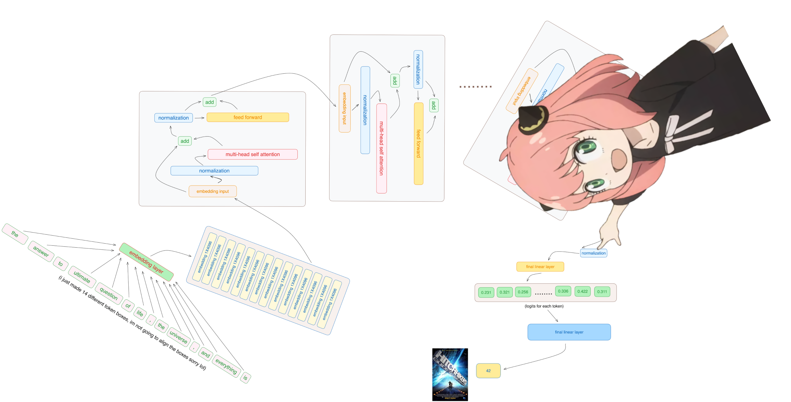
</div>

```python
final_embedding = rms_norm(final_embedding, model["norm.weight"])
final_embedding.shape
```

torch.Size([17, 4096])

# Finally, let's decode the embedding into token values
<div>
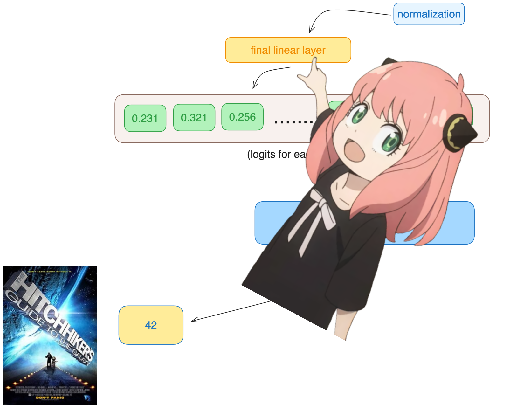
</div>
We will use the output decoder to convert the final embedding into tokens.

```python
model["output.weight"].shape
```

torch.Size([128256, 4096])

# We use the embedding of the last token to predict the next value
Hopefully in our case it is 42 :)
Note: 42 is the answer to the "The Ultimate Question of Life, the Universe, and Everything" from the book The Hitchhiker's Guide to the Galaxy, most modern large language models will answer 42 here, which should validate our entire code! Wish me luck :)

```python
logits = torch.matmul(final_embedding[-1], model["output.weight"].T)
logits.shape
```

torch.Size([128256])

### The model predicts the next token to be token 2983, is this the token number for 42?
Hopefully that got you excited, this is the last code cell, have fun :)

```python
next_token = torch.argmax(logits, dim=-1)
next_token
```

tensor(2983)

# lets fuckinggo
<div>

</div>

```python
tokenizer.decode([next_token.item()])
```

'42'

# Thank you, I love you, dear readers :)

That's the end. Hope you enjoyed reading!

Thanks to datawhale for your support and appreciation.

We are A10 Research and we are glad that this work can help you.

If you want to support my work

1. Follow me on Twitter [https://twitter.com/naklecha](https://twitter.com/naklecha)

2. Or, buy me a coffee [https://www.buymeacoffee.com/naklecha](https://www.buymeacoffee.com/naklecha)

Honestly, if you can make it this far, you have made me very happy :)

## What motivates me?

My friends and I are on a mission to make research more accessible! 
We created a research lab called A10 - [AAAAAAAAAA.org](http://aaaaaaaaaaa.org/)

A10 Twitter - [https://twitter.com/aaaaaaaaaaaorg](https://twitter.com/aaaaaaaaaaaorg)

Our thesis:
<div>
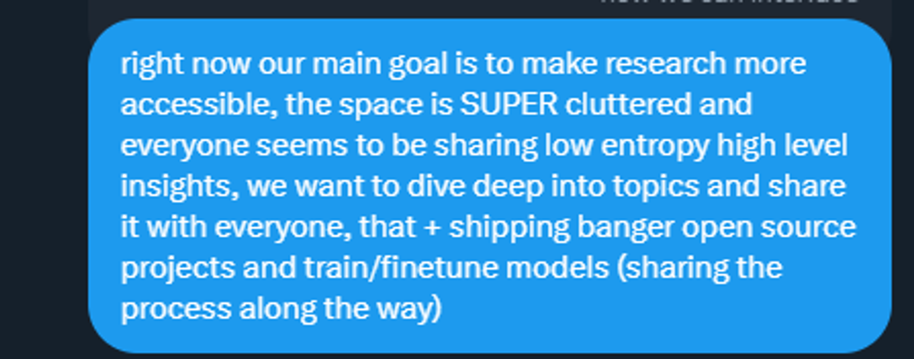
</div>

Our main goal right now is to make research more accessible. The field is very chaotic and everyone seems to be sharing high-level insights with low entropy (haha, the latest buzzword is information entropy is 0). We hope to dive deep into topics and share them with everyone. In addition to this, we will also launch some cool open source projects and train/fine-tune models (sharing our progress in the process).

# Note: predict the next word of "datawhalechina is a group for "

```python
prompt = "datawhalechina is a group for "
tokens = [128000] + tokenizer.encode(prompt)
print(tokens)
tokens = torch.tensor(tokens)
prompt_split_as_tokens = [tokenizer.decode([token.item()]) for token in tokens]
print(prompt_split_as_tokens)
```

[128000, 695, 1336, 1604, 81236, 374, 264, 1912, 369, 220]
['<|begin_of_text|>', 'data', 'wh', 'ale', 'china', ' is', ' a', ' group', ' for', ' ']

```python
embedding_layer = torch.nn.Embedding(vocab_size, dim)
embedding_layer.weight.data.copy_(model["tok_embeddings.weight"])
token_embeddings_unnormalized = embedding_layer(tokens).to(torch.bfloat16)
token_embeddings_unnormalized.shape
```

torch.Size([10, 4096])

```python
from tqdm import tqdm
```

Here we need to change from 17 to 10

```python
plt.rcParams["font.sans-serif"]=['simhei']
freqs_for_each_token = torch.outer(torch.arange(10), freqs)
freqs_cis = torch.polar(torch.ones_like(freqs_for_each_token), freqs_for_each_token)
freqs_cis.shape

# View the third line of freqs_cis
value = freqs_cis[3]
plt.figure()
for i, element in enumerate(value[:10]):
plt.plot([0, element.real], [0, element.imag], color='blue', linewidth=1, label=f"Index: {i}")plt.annotate(f"{i}", xy=(element.real, element.imag), color='red')
plt.xlabel('Real part')
plt.ylabel('Imaginary part')
plt.title('Graphic of a line of freqs_cis')
plt.show()

```


```python
final_embedding = token_embeddings_unnormalized
for layer in tqdm(range(n_layers)):
qkv_attention_store = []
layer_embedding_norm = rms_norm(final_embedding, model[f"layers.{layer}.attention_norm.weight"])
q_layer = model[f"layers.{layer}.attention.wq.weight"]
q_layer = q_layer.view(n_heads, q_layer.shape[0] // n_heads, dim)
k_layer = model[f"layers.{layer}.attention.wk.weight"]
k_layer = k_layer.view(n_kv_heads, k_layer.shape[0] // n_kv_heads, dim)
v_layer = model[f"layers.{layer}.attention.wv.weight"]
v_layer = v_layer.view(n_kv_heads, v_layer.shape[0] // n_kv_heads, dim)
w_layer = model[f"layers.{layer}.attention.wo.weight"]
for head in range(n_heads):
q_layer_head = q_layer[head]
k_layer_head = k_layer[head//4]
v_layer_head= v_layer[head//4]
q_per_token = torch.matmul(layer_embedding_norm, q_layer_head.T)
k_per_token = torch.matmul(layer_embedding_norm, k_layer_head.T)
v_per_token = torch.matmul(layer_embedding_norm, v_layer_head.T)
q_per_token_split_into_pairs = q_per_token.float().view(q_per_token.shape[0], -1, 2)
q_per_token_as_complex_numbers = torch.view_as_complex(q_per_token_split_into_pairs)
q_per_token_split_into_pairs_rotated = torch.view_as_real(q_per_tokenn_as_complex_numbers * freqs_cis)
q_per_token_rotated = q_per_token_split_into_pairs_rotated.view(q_per_token.shape)
k_per_token_split_into_pairs = k_per_token.float().view(k_per_token.shape[0], -1, 2)
k_per_token_as_complex_numbers = torch.view_as_complex(k_per_token_split_into_pairs)
k_per_token_split_into_pairs_rotated = torch.view_as_real(k_per_token_as_complex_numbers * freqs_cis)
k_per_token_rotated = k_per_token_split_into_pairs_rotated.view(k_per_token.shape)
qk_per_token = torch.matmul(q_per_token_rotated, k_per_token_rotated.T)/(128)**0.5
mask = torch.full((len(token_embeddings_unnormalized), len(token_embeddings_unnormalized)), float("-inf"))
mask = torch.triu(mask, diagonal=1)
qk_per_token_after_masking = qk_per_token + mask
qk_per_token_after_masking_after_softmax = torch.nn.functional.softmax(qk_per_token_after_masking, dim=1).to(torch.bfloat16)
qkv_attention = torch.matmul(qk_per_tokenn_after_masking_after_softmax, v_per_token)
qkv_attention_store.append(qkv_attention)
stacked_qkv_attention = torch.cat(qkv_attention_store, dim=-1)
w_layer = model[f"layers.{layer}.attention.wo.weight"]
embedding_delta = torch.matmul(stacked_qkv_attention, w_layer.T)
embedding_after_edit = final_embedding + embedding_delta
embedding_after_edit_normalized = rms_norm(embedding_after_edit, model[f"layers.{layer}.ffn_norm.weight"])
w1 = model[f"layers.{layer}.feed_forward.w1.weight"]
w2 = model[f"layers.{layer}.feed_forward.w2.weight"]
w3 = model[f"layers.{layer}.feed_forward.w3.weight"]
output_after_feedforward = torch.matmul(torch.functional.F.silu(torch.matmul(embedding_after_edit_normalized, w1.T)) * torch.matmul(embedding_after_edit_normalized, w3.T), w2.T)
final_embedding = embedding_after_edit+output_after_feedforward
```

100%|█ ...32/32 [00:59<00:00, 1.87s/it]

```python
final_embedding = rms_norm(final_embedding, model["norm.weight"])
logits = torch.matmul(final_embedding[-1], model["output.weight"].T)
next_token = torch.argmax(logits, dim=-1)
tokenizer.decode([next_token.item()])
```

' data'

# Note: Part of the code draft

```python
k_per_token_rotated = k_per_token_split_into_pairs_rotated.view(k_per_token.shape)
k_per_token_split_into_pairs_rotated = torch.view_as_real(k_per_token_as_complex_numbers * freqs_cis)
k_per_token_as_complex_numbers = torch.view_as_complex(k_per_token_split_into_pairs)
k_per_token_split_into_pairs = k_per_token.float().view(k_per_token.shape[0], -1, 2)
k_per_token = torch.matmul(token_embeddings, k_layer0_head0.T)
k_layer0_head0 = k_layer0[0]
k_layer0 = model["layers.0.attention.wk.weight"]
k_layer0 = k_layer0.view(n_kv_heads, k_layer0.shape[0] // n_kv_heads, dim)
```

```python
qk_per_token = torch.matmul(q_per_token_rotated, k_per_token_rotated.T)/(head_dim)**0.5
```

```python
mask = torch.full((len(tokens), len(tokens)), float("-inf"), device=tokens.device)
mask = torch.triu(mask, diagonal=1)
qk_per_token_after_masking = qk_per_token + mask
qk_per_token_after_masking_after_softmax = torch.nn.functional.softmax(qk_per_token_after_masking, dim=1).to(torch.bfloat16)
```

```python
v_layer0_head0 = v_layer0[0]
v_layer0 = model["layers.0.attention.wv.weight"]
v_layer0 = v_layer0.view(n_kv_heads, v_layer0.shape[0] // n_kv_heads, dim)
v_per_token = torch.matmul(token_embeddings, v_layer0_head0.T)
qkv_attention = torch.matmul(qk_per_token_after_masking_after_softmax, v_per_token)
```

```python
qkv_attention_store = []

for head in range(n_heads):
q_layer0_head = q_layer0[head]
k_layer0_head = k_layer0[head//4] # key weights are shared across 4 heads
v_layer0_head = v_layer0[head//4] # value weights are shared across 4 heads
q_per_token = torch.matmul(token_embeddings, q_layer0_head.T)
k_per_token = torch.matmul(token_embeddings, k_layer0_head.T)v_per_token = torch.matmul(token_embeddings, v_layer0_head.T)

q_per_token_split_into_pairs = q_per_token.float().view(q_per_token.shape[0], -1, 2)
q_per_token_as_complex_numbers = torch.view_as_complex(q_per_token_split_into_pairs)
q_per_token_split_into_pairs_rotated = torch.view_as_real(q_per_token_as_complex_numbers * freqs_cis[:len(tokens)])
q_per_token_rotated = q_per_token_split_into_pairs_rotated.view(q_per_token.shape)

k_per_token_split_into_pairs = k_per_token.float().view(k_per_token.shape[0], -1, 2)
k_per_token_as_complex_numbers = torch.view_as_complex(k_per_token_split_into_pairs)
k_per_token_split_into_pairs_rotated = torch.view_as_real(k_per_token_as_complex_numbers * freqs_cis[:len(tokens)])
k_per_token_rotated = k_per_token_split_into_pairs_rotated.view(k_per_token.shape)

qk_per_token = torch.matmul(q_per_token_rotated, k_per_token_rotated.T)/(128)**0.5
mask = torch.full((len(tokens), len(tokens)), float("-inf"), device=tokens.device)
mask = torch.triu(mask, diagonal=1)
qk_per_token_after_masking = qk_per_token + mask
qk_per_token_after_masking_after_softmax = torch.nn.functional.softmax(qk_per_token_after_masking, dim=1).to(torch.bfloat16)
qkv_attention = torch.matmul(qk_per_token_after_masking_after_softmax, v_per_token)
qkv_attention_store.append(qkv_attention)

# len(qkv_attention_store)
stacked_qkv_attentionattention = torch.cat(qkv_attention_store, dim=-1)

w_layer0 = model["layers.0.attention.wo.weight"]
embedding_delta = torch.matmul(stacked_qkv_attention, w_layer0.T)
embedding_after_edit = token_embeddings_unnormalized + embedding_delta
embedding_after_edit_normalized = rms_norm(embedding_after_edit, model["layers.0.ffn_norm.weight"])
w1 = model["layers.0.feed_forward.w1.weight"]
w2 = model["layers.0.feed_forward.w2.weight"]
w3 = model["layers.0.feed_forward.w3.weight"]
output_after_feedforward =torch.matmul(torch.functional.F.silu(torch.matmul(embedding_after_edit_normalized, w1.T)) * torch.matmul(embedding_after_edit_normalized, w3.T), w2.T)
layer_0_embedding = embedding_after_edit+output_after_feedforward
```

```python
final_embedding = token_embeddings_unnormalized
for layer in range(n_layers):
qkv_attention_store = []
layer_embedding_norm = rms_norm(final_embedding, model[f"layers.{layer}.attention_norm.weight"])
q_layer = model[f"layers.{layer}.attention.wq.weight"]q_layer = q_layer.view(n_heads, q_layer.shape[0] // n_heads, dim)
k_layer = model[f"layers.{layer}.attention.wk.weight"]
k_layer = k_layer.view(n_kv_heads, k_layer.shape[0] // n_kv_heads, dim)
v_layer = model[f"layers.{layer}.attention.wv.weight"]
v_layer = v_layer.view(n_kv_heads, v_layer.shape[0] // n_kv_heads, dim)
w_layer = model[f"layers.{layer}.attention.wo.weight"]
for head in range(n_heads):
q_layer_head = q_layer[head]
k_layer_head = k_layer[head//4]
v_layer_head = v_layer[head//4]
q_per_token = torch.matmul(layer_embedding_norm, q_layer_head.T)
k_per_token = torch.matmul(layer_embedding_norm, k_layer_head.T)
v_per_token = torch.matmul(layer_embedding_norm, v_layer_head.T)
q_per_token_split_into_pairs = q_per_token.float().view(q_per_token.shape[0], -1, 2)
q_per_token_as_complex_numbers = torch.view_as_complex(q_per_token_split_into_pairs)
q_per_token_split_into_pairs_rotated =torch.view_as_real(q_per_token_as_complex_numbers * freqs_cis)
q_per_token_rotated = q_per_token_split_into_pairs_rotated.view(q_per_token.shape)
k_per_token_split_into_pairs = k_per_token.float().view(k_per_token.shape[0], -1, 2)
k_per_token_as_complex_numbers = torch.view_as_complex(k_per_token_split_into_pairs)
k_per_token_split_into_pairs_rotated = torch.view_as_real(k_per_token_as_complex_numbers * freqs_cis)
k_per_token_rotated = k_per_token_split_into_pairs_rotated.view(k_per_token.shape)
qk_per_token = torch.matmul(q_per_token_rotated, k_per_token_rotated.T)/(128)**0.5
mask = torch.full((len(token_embeddings_unnormalized), len(token_embeddings_unnormalized)), float("-inf"))
mask = torch.triu(mask, diagonal=1)
qk_per_token_after_masking = qk_per_token + mask
qk_per_token_after_masking_after_softmax = torch.nn.functional.softmax(qk_per_token_after_masking, dim=1).to(torch.bfloat16)
qkv_attention = torch.matmul(qk_per_token_after_masking_after_softmax, v_per_token)
qkv_attention_store.append(qkv_attention)

stacked_qkv_attention = torch.cat(qkv_attention_store, dim=-1)
w_layer = model[f"layers.{layer}.attention.wo.weight"]
embedding_delta = torch.matmul(stacked_qkv_attention, w_layer.T)
embedding_after_edit = final_embedding + embedding_delta
embedding_after_edit_normalized = rms_norm(embedding_after_edit, model[f"layers.{layer}.ffn_norm.weight"])
w1 =model[f"layers.{layer}.feed_forward.w1.weight"]
w2 = model[f"layers.{layer}.feed_forward.w2.weight"]
w3 = model[f"layers.{layer}.feed_forward.w3.weight"]
output_after_feedforward = torch.matmul(torch.functional.F.silu(torch.matmul(embedding_after_edit_normalized, w1.T)) * torch.matmul(embedding_after_edit_normalized, w3.T), w2.T)
final_embedding = embedding_after_edit+output_after_feedforward
```

```python
final_embedding = rms_norm(final_embedding, model["norm.weight"])
logits = torch.matmul(final_embedding[-1], model["output.weight"].T)
next_token = torch.argmax(logits, dim=-1)
tokenizer.decode([next_token.item()])
```