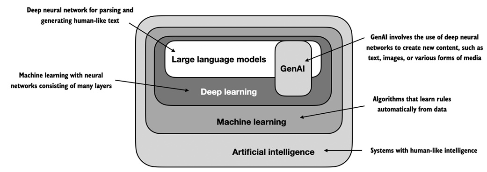

### 1.1 什么是LLM（What is an LLM?）

An LLM, a large language model, is a neural network designed to understand, generate, and respond to human-like text. These models are deep neural networks trained on massive amounts of text data, sometimes encompassing large portions of the entire publicly available text on the internet.

LLM 即大型语言模型，是一种神经网络，旨在理解、生成和响应类人文本。这些模型是在海量文本数据上训练出来的深度神经网络，有时包含互联网上全部公开文本的很大一部分。

> 本句的注解和说明如下：
1. **神经网络**：这是一种模仿人脑神经元网络连接方式的计算模型，能够通过学习数据中的模式来执行各种任务，包括语言处理。
2. **旨在理解、生成和响应类人文本**：这表明LLM的主要功能是处理自然语言文本，不仅能够“理解”文本的含义，还能够生成新的文本内容，并对用户输入的文本做出恰当的回应。
3. **在海量文本数据上训练出来的**：LLM的训练涉及大量的文本数据，这些数据为模型提供了丰富的语言信息和使用模式，使其能够学习到语言的各种特征。
4. **深度神经网络**：这是神经网络的一个类型，包含多个隐藏层，能够学习并表示数据中的复杂关系和模式。
5. **包含互联网上全部公开文本的很大一部分**：这说明了训练LLM所使用的数据集规模之大，它们包括互联网上可获取的大量公开文本，如书籍、文章、论坛帖子等。
6. **理解**：在LLM的上下文中，理解通常指的是模型能够识别和解释文本中的语义内容和语境信息。
7. **生成**：指的是LLM能够自主创建新的文本内容，这些内容在结构和语义上与人类生成的文本类似。
8. **响应**：指的是LLM能够根据输入的文本或查询，产生合适的回复或输出，这可能包括回答问题、执行指令或提供信息。

*「本句描述了LLM的核心特征：它们是基于大量文本数据训练出来的深度神经网络模型，能够执行理解、生成和响应类人文本的任务。这些能力使LLM在自然语言处理领域具有广泛的应用潜力。」*

The "large" in large language model refers to both the model's size in terms of parameters and the immense dataset on which it's trained. Models like this often have tens or even hundreds of billions of parameters, which are the adjustable weights in the network that are optimized during training to predict the next word in a sequence. Next-word prediction is sensible because it harnesses the inherent sequential nature of language to train models on understanding context, structure, and relationships within text. Yet, it is a very simple task and so it is surprising to many researchers that it can produce such capable models. We will discuss and implement the next-word training procedure in later chapters step by step.

大型语言模型中的 "大型 "指的是该模型的参数规模以及训练该模型的庞大数据集。此类模型通常有数百亿甚至数千亿个参数，这些参数是网络中可调整的权重，在训练过程中进行优化，以预测序列中的下一个单词。下一个单词的预测的这样一种策略是明智的，因为它利用了语言固有的顺序性来训练理解文本中上下文、结构和关系的模型。然而，这只是一项非常简单的任务，因此能产生如此强大的模型令许多研究人员感到惊讶。我们将在后面的章节中逐步讨论和实施“下一个词的训练过程”。

> 本句的注解和说明如下：
1. **大型语言模型中的“大型”**：这里所说的“大型”是指模型的两个主要特征：参数的规模和训练数据的体量，一般来说模型的参数规模达到了1B(也就是10亿参数量)的数量级，才成为大模型，会这样界定的原因在于模型只有达到大规模的时候才会有我们基于Scaling law的涌现现象，而这种大模型的对于文本的理解、处理和迁移能力「包括很多小样本或者零样本的场景」的涌现现象正是大模型作为基础的底座模型的魅力，其实现了多种任务的统一，「虽然有点大力出奇迹的感觉」。
2. **参数规模**：在深度学习中，模型的参数是指网络中可学习和调整的权重和偏置。在大型语言模型（LLM）中，这些参数的数量非常庞大，通常达到数十亿甚至数千亿。
3. **训练该模型的庞大数据集**：为了训练这些模型，需要大量的文本数据，这些数据构成了模型学习的基础。数据集的规模和多样性对模型的性能有重要影响，例如常用的维基百科和Common Crawl、C4、Github数据集，其训练语料大小达到了TB级别。
4. **网络中可调整的权重**：权重是神经网络中用于处理输入数据并生成输出的数值。在训练过程中，通过优化算法（如梯度下降）调整这些权重，以减少预测误差。
5. **训练过程中进行优化**：训练过程涉及使用特定的算法来调整模型的参数，目的是最小化预测误差，即模型输出和真实值之间的差异。
6. **预测序列中的下一个单词**：这是LLM训练中常用的一种方法，即通过给定一系列单词来预测下一个最可能出现的单词。这种方法利用了语言的序列特性。
7. **利用了语言固有的顺序性**：语言是一个序列化的实体，单词的排列顺序对句子的含义至关重要。LLM通过预测下一个单词来学习语言的这种顺序性。
8. **训练理解文本中上下文、结构和关系的模型**：通过预测任务，LLM学习到的不仅仅是单个单词的预测，还包括单词在特定上下文中的含义，以及它们如何组合成有意义的句子和段落。
9.  **非常简单的任务**：指的是从技术上讲，预测下一个单词是一个相对简单的机器学习问题，因为它只涉及到根据给定的上下文信息来预测一个输出。
10. **产生如此强大的模型令许多研究人员感到惊讶**：尽管预测下一个单词的任务本身简单，但通过这种方法训练出的LLM展现出了处理复杂语言任务的惊人能力，如文本生成、翻译、问答等。

*「本句说明了LLM之所以被称为“大型”的原因，强调了模型参数的数量和训练数据的规模，以及这些模型如何通过简单的预测任务学习到复杂的语言处理能力。同时，它也预告了后续我们的内容将深入探讨LLM的训练过程。」*

LLMs utilize an architecture called the transformer (covered in more detail in section 1.4), which allows them to pay selective attention to different parts of the input when making predictions, making them especially adept at handling the nuances and complexities of human language.

LLM 利用一种称为transformer的结构（详见第 1.4 节），这种结构允许 LLM 在进行预测时选择性地关注输入的不同部分，从而使 LLM 特别擅长处理人类语言的细微差别和复杂性。

> 本句的注解和说明如下：
1. **这种结构允许LLM在进行预测时选择性地关注输入的不同部分**：Transformer模型的一个关键特性是它的自注意力机制（self-attention mechanism），这使得模型能够评估输入序列中不同部分的相关性，并在生成输出时给予它们不同的权重。
2. **从而使LLM特别擅长处理人类语言的细微差别和复杂性**：由于自注意力机制，LLM能够捕捉到语言中的长距离依赖关系和上下文线索，这对于理解语言的复杂性和生成自然、连贯的文本至关重要。
3. **选择性地关注**：这意味着模型不是同等地处理输入序列中的每个元素，而是能够识别出对当前任务最重要的信息，并给予更多的关注，和人的接受信息的注意力机制很类似，这里的选择性注意力机制就是通过“自注意力机制（self-attention mechanism）”实现的。
4. **预测**：在LLM的上下文中，预测通常指的是基于给定的输入序列（如一系列单词）生成下一个最可能的单词或序列。
5. **处理人类语言的细微差别**：这涉及到对语言的深层理解，包括词义、语法、语用学以及语言在不同上下文中的变化。
6. **复杂性**：人类语言的复杂性不仅体现在其结构上，还体现在其表达的多样性和模糊性上，LLM需要能够处理这些复杂性以生成和理解自然语言。

*「本句强调了Transformer架构在LLM中的重要性，以及它如何使模型能够灵活地处理语言的复杂性，这是LLM在NLP任务中取得成功的关键因素之一。」*

Since LLMs are capable of generating text, LLMs are also often referred to as a form of generative artificial intelligence (AI), often abbreviated as generative AI or GenAI. As illustrated in Figure 1.1, AI encompasses the broader field of creating machines that can perform tasks requiring human like intelligence, including understanding language, recognizing patterns, and making decisions, and includes subfields like machine learning and deep learning.

由于 LLM 能够生成文本，因此 LLM 也常被称为生成式人工智能（AI）的一种形式，通常缩写为生成式 AI 或 GenAI。如图 1.1 所示，人工智能涵盖了更广泛的领域，即创造能够执行需要人类智能的任务（包括理解语言、识别模式和做出决策）的机器，并包括机器学习和深度学习等子领域。

> 本句的注解和说明如下：
1. **生成文本**：LLM的这一能力意味着它们不仅可以识别和理解输入的文本，还可以创造出全新的文本内容，这些内容在结构和语义上与人类编写的文本相似。
2. **生成式人工智能（AI）**：这是一种AI的类型，生成式它能够创建或生成以前不存在的新信息、图像、音乐或文本。在这里，特别指的是生成文本的AI模型。
3. **创造能够执行需要人类智能的任务的机器**：这意味着AI系统被设计来模仿人类的认知能力，执行那些通常需要人类智能才能完成的任务。

*「本句说明了LLM作为生成式AI的一个实例，其能力不仅限于文本生成，还体现了AI在模拟人类智能行为方面的广泛潜力。同时，它也指出了AI领域包含了多个子领域，如机器学习和深度学习，这些子领域共同推动了AI技术的发展和应用。」*

Figure 1.1 As this hierarchical depiction of the relationship between the different fields suggests, LLMs represent a specific application of deep learning techniques, leveraging their ability to process and generate human-like text. Deep learning is a specialized branch of machine learning that focuses on using multi-layer neural networks. And machine learning and deep learning are fields aimed at implementing algorithms that enable computers to learn from data and perform tasks that typically require human intelligence.

图 1.1 正如对不同领域之间关系的分层描述所示，LLM 代表了深度学习技术的一种特定应用，它利用了深度学习技术处理和生成类人文本的能力。深度学习是机器学习的一个专门分支，侧重于使用多层神经网络。机器学习和深度学习都是旨在实现算法的领域，这些算法使计算机能够从数据中学习，并执行通常需要人类智能的任务。

The algorithms used to implement AI are the focus of the field of machine learning. Specifically, machine learning involves the development of algorithms that can learn from and make predictions or decisions based on data without being explicitly programmed. To illustrate this, imagine a spam filter as a practical application of machine learning. Instead of manually writing rules to identify spam emails, a machine learning algorithm is fed examples of emails labeled as spam and legitimate emails. By minimizing the error in its predictions on a training dataset, the model then learns to recognize patterns and characteristics indicative of spam, enabling it to classify new emails as either spam or legitimate.

用于实现人工智能的算法是机器学习领域的重点。具体来说，机器学习涉及算法的开发，这些算法可以在没有明确编程的情况下根据数据进行学习并做出预测或决策。为了说明这一点，可以把垃圾邮件过滤器想象成机器学习的实际应用。机器学习算法不需要手动编写规则来识别垃圾邮件，而是向其输入被标记为垃圾邮件和合法邮件的示例。通过最大限度地减少对训练数据集的预测误差，该模型就能学会识别垃圾邮件的模式和特征，从而将新邮件归类为垃圾邮件或合法邮件。

> 本句的注解和说明如下：
1. **用于实现人工智能的算法**：这里指的是那些被设计来模拟人类智能行为的计算算法，它们是人工智能（AI）系统的基础，从上世纪开始，相关研究者就开始探索智能的实现，包括连接主义、行为主义 和 逻辑主义。
2. **机器学习领域的重点**：机器学习是AI的一个核心子领域，专注于开发能够从数据中学习并做出智能决策的算法。
3. **没有明确编程的情况下根据数据进行学习**：机器学习算法与传统的编程不同，它们不是按照一系列固定的指令来执行任务，而是通过分析数据来自动改进其性能。
4. **做出预测或决策**：机器学习算法的常见应用包括预测未来事件（如预测）和做出选择（如决策）。
5. **不需要手动编写规则**：与传统的编程方法相比，机器学习算法不需要人类专家手动编写详细的规则集。
6.  **最大限度地减少对训练数据集的预测误差**：机器学习算法的目标是提高其预测的准确性，这通常通过调整算法的参数来实现，以减少预测值和实际值之间的差异。
7.  **学会识别垃圾邮件的模式和特征**：通过训练，机器学习模型能够发现并理解垃圾邮件中常见的模式和特征。
8.  **将新邮件归类为垃圾邮件或合法邮件**：这是机器学习算法在垃圾邮件过滤任务中的最终目标，即能够准确地将新的电子邮件分类为垃圾邮件或非垃圾邮件。

*「本句解释了机器学习算法在AI中的应用，以及它们是如何通过从数据中学习来实现预测和决策的。垃圾邮件过滤器作为一个例子，说明了机器学习算法如何通过分析标记数据来学习识别特定类型的数据模式。」*

As illustrated in Figure 1.1, deep learning is a subset of machine learning that focuses on utilizing neural networks with three or more layers (also called deep neural networks) to model complex patterns and abstractions in data. In contrast to deep learning, traditional machine learning requires manual feature extraction. This means that human experts need to identify and select the most relevant features for the model. While the field of AI is nowadays dominated by machine learning and deep learning, it also includes other approaches, for example, using rule-based systems, genetic algorithms, expert systems, fuzzy logic, or symbolic reasoning.

如图 1.1 所示，深度学习是机器学习的一个子集，主要利用具有三层或更多层的神经网络（也称为深度神经网络）对数据中的复杂模式和抽象概念进行建模。与深度学习相比，传统的机器学习需要人工提取特征。这意味着人类专家需要为模型识别和选择最相关的特征。虽然如今人工智能领域主要是机器学习和深度学习，但也包括其他方法，例如使用基于规则的系统、遗传算法、专家系统、模糊逻辑或符号推理。

> 本句的注解和说明如下：
1. **深度学习是机器学习的一个子集**：本句说明了深度学习是机器学习领域内的一个特定分支，专注于使用深层神经网络来解决复杂问题。
2. **对数据中的复杂模式和抽象概念进行建模**：深度神经网络能够识别和表示数据中的复杂关系和高级特征，这些可能是人类难以直接感知或描述的。
3. **与深度学习相比，传统的机器学习需要人工提取特征**：本句对比了深度学习和传统机器学习在特征提取方面的不同。在传统机器学习中，需要人类专家介入来选择和提取对模型有用的特征。
4. **人类专家需要为模型识别和选择最相关的特征**：在传统机器学习中，特征提取是一个需要专业知识的过程，专家必须确定哪些特征对于预测或分类任务最有用。
5.  **基于规则的系统**：使用一系列规则来处理信息和做出决策的系统。
6.  **遗传算法**：一种受自然选择过程启发的搜索算法，通过模拟遗传和进化机制来优化问题解。
7.  **专家系统**：一种模拟人类专家决策能力的计算机系统，通常用于特定领域的复杂问题。
8.  **模糊逻辑**：一种数学框架，用于处理不确定性和模糊性，通过使用模糊集合和模糊规则来模拟人类的模糊思维。
9.  **符号推理**：一种使用符号表示和操作知识的推理方法，常见于逻辑和计算领域。

*「本句强调了深度学习在机器学习中的位置，以及它如何通过使用深层神经网络来建模数据中的复杂模式。同时，它也指出了机器学习是一个多样化的领域，包含了多种技术和方法，不仅限于深度学习。」*

Returning to the spam classification example, in traditional machine learning, human experts might manually extract features from email text such as the frequency of certain trigger words ("prize," "win," "free"), the number of exclamation marks, use of all uppercase words, or the presence of suspicious links. This dataset, created based on these expert-defined features, would then be used to train the model. In contrast to traditional machine learning, deep learning does not require manual feature extraction. This means that human experts do not need to identify and select the most relevant features for a deep learning model. (However, in both traditional machine learning and deep learning for spam classification, you still require the collection of labels, such as spam or non-spam, which need to be gathered either by an expert or users.) The upcoming sections will cover some of the problems LLMs can solve today, the challenges that LLMs address, and the general LLM architecture, which we will implement in this book.

回到垃圾邮件分类的例子，在传统的机器学习中，人类专家可能会手动从电子邮件文本中提取特征，如某些触发词（"奖品"、"中奖"、"免费"）的频率、感叹号的数量、所有大写单词的使用或可疑链接的存在。根据这些专家定义的特征创建的数据集将用于训练模型。与传统的机器学习相比，深度学习不需要人工特征提取。这意味着人类专家不需要为深度学习模型识别和选择最相关的特征。(不过，在传统机器学习和深度学习的垃圾邮件分类中，仍然需要收集标签，如垃圾邮件或非垃圾邮件，这些标签需要由专家或用户收集）。接下来的章节将介绍 LLM 目前可以解决的一些问题、LLM 所要应对的挑战，以及我们将在本书中实现的一般形式的 LLM 架构。

> 本句的注解和说明如下：
1. **传统的机器学习**：指的是机器学习领域中那些不依赖于深度神经网络的早期技术和方法。
2. **人类专家可能会手动从电子邮件文本中提取特征**：在传统机器学习中，通常需要领域专家手工选择和提取数据中的特征，这些特征是模型用来进行预测的输入。
3. **触发词（"奖品"、"中奖"、"免费"）的频率**：这些是垃圾邮件中常见的关键词，它们的出现频率可以作为判断邮件是否为垃圾邮件的特征之一，是传统垃圾邮件筛选的标准词库，所以大家可以发现，在后续的一些垃圾邮件中，会用替代词等逃过机器的检测。
4. **与传统的机器学习相比，深度学习不需要人工特征提取**：深度学习模型能够自动从原始数据中学习特征，这与传统机器学习形成对比，后者需要人类专家介入来提取特征。
5.  **仍然需要收集标签**：无论是传统机器学习还是深度学习，都需要对数据进行标注，即给定正确的输出标签（如垃圾邮件或非垃圾邮件），以便训练模型。

*「本句说明了在垃圾邮件分类任务中，传统机器学习与深度学习在特征提取方面的差异，以及深度学习在减少人工干预方面的潜力。同时，它也预告了本书将深入探讨LLM的功能、挑战和架构。」*