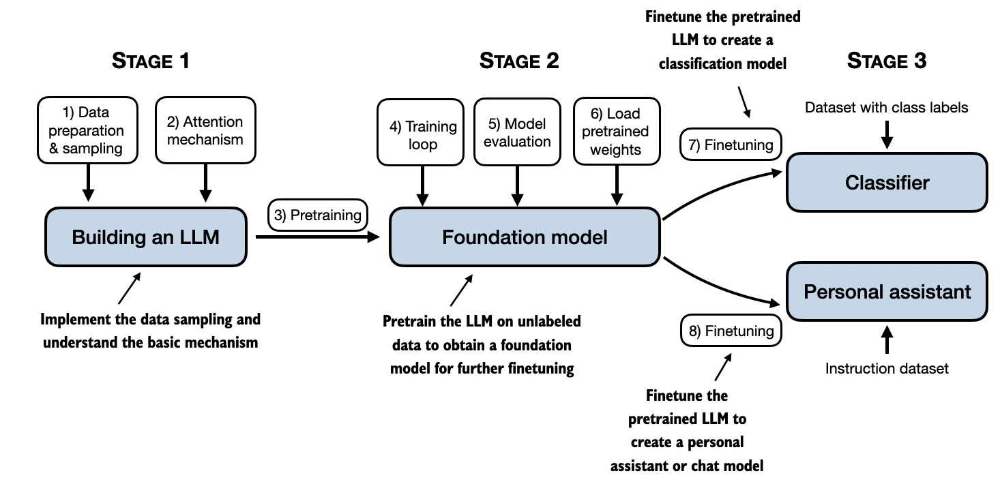

# Hands-on LLM

# LLMs From Scratch: Hands-on Building Your Own Large Language Models

---

## 📘 Project Introduction
If you want to build a large language model from scratch, this project is for you.
This project "LLMs From Scratch" is a practical tutorial provided by Datawhale to build a large language model (LLM) similar to ChatGPT from scratch.
We aim to help developers and researchers master the core technologies of creating large language models and large language model architectures through detailed guidance, code examples, and deep learning resources.
This project includes a tutorial on building GLM4\Llama3\RWKV6 from scratch, building a large model from scratch, and deeply understanding the principles of the large model.

---

## 🌟 Project highlights

- **Comprehensive learning path**: Provides a systematic learning path from basic theory to practical coding.

- **Practice-oriented**: Emphasizes mastering the development and training of LLM through practical operations.

- **Focus on LLM architecture**: In the context of rich fine-tuning and deployment related tutorials, we focus on the architecture implementation of large models.

## 🚀 Main content

### (1) Basics

In the basics section, we provide a detailed tutorial on how to implement a large language model (LLM) similar to ChatGPT from scratch based on "rasbt/LLMs-from-scratch". Special thanks to @[rasbt](https://github.com/rasbt).

If you want to get started quickly, please refer to the notebook in the Codes path. The concise code can help you get started quickly.

If you want to learn in detail, please refer to the notebook in the Translated_Book path, which provides more detailed knowledge.👨‍💻 **Code implementation**: This project contains all the code to create a GPT-like large language model, covering the encoding, pre-training and fine-tuning process.

📖 **Step-by-step learning**: The tutorial teaches how to create your own LLM step by step through clear text, diagrams and examples.

💡 **Educational purpose**: This method is mainly used for education to help learners train and develop small but functional models, which is similar to the method of creating large basic models like ChatGPT.

🔧 **Concise and easy to understand code**: With concise and runnable notebook code, you can complete the construction of large models even with only PyTorch basics.

🤔 **In-depth understanding of model principles**: Through this tutorial, readers can deeply understand how large language models work.

📖 The detailed chapter arrangement is as follows:

| Chapter title | Main code | All code and supplements|
|-----------------------------------|--------------------------------------------------------------------------------------------------------------------------------|-------------------------------------------------------------------------------------------------------|
| Chapter 1: Understanding Large Language Models | No Code | No Code|
| Chapter 2: Processing Text Data | - [ch02.ipynb](./Codes/ch02/01_main-chapter-code/ch02.ipynb) - [dataloader.ipynb](./Codes/ch02/01_main-chapter-code/dataloader.ipynb) - [exercise-solutions.ipynb](./Codes/ch02/01_main-chapter-code/exercise-solutions.ipynb) | [./Codes/ch02](./Codes/ch02) |
| Chapter 3: Writing Attention Mechanisms | - [ch03.ipynb](./Codes/ch03/01_main-chapter-code/ch03.ipynb) - [multihead-attention.ipynb](./Codes/ch03/01_main-chapter-code/multihead-attention.ipynb) - [exercise-solutions.ipynb](./Codes/ch03/01_main-chapter-code/exercise-solutions.ipynb) | [./Codes/ch03](./Codes/ch03) |
| Chapter 4: Implementing the GPT Model from Scratch | - [ch04.ipynb](./Codes/ch04/01_main-chapter-code/ch04.ipynb) - [gpt.py](./Codes/ch04/01_main-chapter-code/gpt.py) - [exercise-solutions.ipynb](./Codes/ch04/01_main-chapter-code/exercisee-solutions.ipynb) | [./Codes/ch04](./Codes/ch04) |
| Chapter 5: Pre-training with Unlabeled Data | - [ch05.ipynb](./Codes/ch05/01_main-chapter-code/ch05.ipynb) - [train.py](./Codes/ch05/01_main-chapter-code/train.py) - [generate.py](./Codes/ch05/01_main-chapter-code/generate.py) - [exercise-solutions.ipynb](./Codes/ch05/01_main-chapter-code/exercise-solutions.ipynb) | [./Codes/ch05](./Codes/ch05)|
| Chapter 6: Fine-tuning for text classification | Coming soon | Coming soon |
| Chapter 7: Fine-tuning with human feedback | Coming soon | Coming soon|
| Chapter 8: Using Large Language Models in Practice | Coming Soon | Coming Soon |
| Appendix A: Introduction to PyTorch | - [code-part1.ipynb](./Codes/appendix-A/03_main-chapter-code/code-part1.ipynb) - [code-part2.ipynb](./Codes/appendix-A/03_main-chapter-code/code-part2.ipynb) - [DDP-script.py](./Codes/appendix-A/03_main-chapter-code/DDP-script.py) - [exercise-solutions.ipynb](./Codes/appendix-A/03_main-chapter-code/exercise-solutions.ipynb) | [appendix-A](./Codes/appendix-A) |
| Appendix B: References and further reading | No code | - |
| Appendix C: Exercises| No code | - |
| Appendix D: Adding additional functionality and features to the training process | - [appendix-D.ipynb](./Codes/appendix-D/01_main-chapter-code/appendix-D.ipynb) | [appendix-D](./Codes/appendix-D) |

---

### (2) Model architectureDiscussion and construction of 

- **Support for multiple large models**: The project covers the architecture discussion and implementation of multiple large models such as ChatGLM, Llama, RWKV, etc. For details, see the `./Model_Architecture_Discussions` directory.
- **Detailed analysis of the architecture**: Including the configuration files, training scripts and core codes of each model, to help learners deeply understand the internal mechanisms of different models.

| Model Type | Notebook | Contributors |
| --- | --- | --- |
| ChatGLM3 | [chatglm3.ipynb](./Model_Architecture_Discussions/ChatGLM3/LoadModelWeights.ipynb) | [@Tangent-90C](https://github.com/Tangent-90C) |
| Llama3 | [llama3.ipynb](./Model_Architecture_Discussions/llama3/llama3-from-scratch.ipynb) | [@A10-research](https://www.aaaaaaaaaa.org/) |
| RWKVV2 | [rwkv-v2.ipynb](./Model_Architecture_Discussions/rwkv-v2/rwkv-v2-guide.ipynb) | [@Ethan-Chen-plus](https://github.com/Ethan-Chen-plus) |
| RWKV V3 | [rwkv-v3.ipynb](./Model_Architecture_Discussions/rwkv-v3/rwkv-v3-guide.ipynb) | [@Ethan-Chen-plus](https://github.com/Ethan-Chen-plus) |
| RWKV V4 | [rwkv-v4.ipynb](./Model_Architecture_Discussions/rwkv-v4/rwkv-v4-guide.ipynb) | [@Ethan-Chen-plus](https://github.com/Ethan-Chen-plus) |
| RWKV V5 | [rwkv-v5.ipynb](./Model_Architecture_Discussions/rwkv-v5/rwkv-v5-guide.ipynb) | [@Ethan-Chen-plus](https://github.com/Ethan-Chen-plus) |
| RWKV V6 | [rwkv-v6.ipynb](./Model_Architecture_Discussions/rwkv-v6/rwkv-v6-guide.ipynb) | [@Ethan-Chen-plus](https://github.com/Ethan-Chen-plus) |
| ChatGLM4 | [chatglm4.ipynb](./Model_Architecture_Discussions/ChatGLM4/chatglm4-guide.ipynb) | [@Ethan-Chen-plus](https://github.com/Ethan-Chen-plus) |

---

---

## 📅 Roadmap

*Note: Plan future tasks and pass Issue *

---

## 👫 Contribute

- If you want to participate in the project, please check out the project's [Issue](https://github.com/datawhalechina/llms-from-scratch-cn/issues) to check unassigned tasks.
- If you find a problem, please give feedback in [Issue](https://github.com/datawhalechina/llms-from-scratch-cn/issues) 🐛.
- If you are interested in this project, welcome to communicate through [Discussion](https://github.com/datawhalechina/llms-from-scratch-cn/discussions) 💬.

- Project audience
- 
- Technical background: This project is suitable for people with a certain programming foundation, especially developers and researchers who are interested in large language models (LLM).
- Learning objectives: It is suitable for learners who want to have a deep understanding of how LLM works and are willing to invest time to build and train their own LLM from scratch.
- Application areas: Suitable for developers interested in natural language processing, artificial intelligence, andPeople who want to apply LLM in education or research environments.
- Project Highlights
- Systematic Learning: This project provides a systematic learning path from theoretical foundations to practical coding to help learners fully understand LLM.
- Practice-oriented: Different from just introducing theory or API usage, this project emphasizes practice, allowing learners to master the development and training of LLM through practical operations.
- Easy to understand: This project explains complex concepts with clear language, charts and examples, so that learners with non-professional backgrounds can also understand it well.

If you are interested in Datawhale and want to start a new project, please check out the [Datawhale Contribution Guide](https://github.com/datawhalechina/DOPMC#%E4%B8%BA-datawhale-%E5%81%9A%E5%87%BA%E8%B4%A1%E7%8C%AE).

I hope this project can help you better understand and build large language models! 🌐

## List of Contributors (Tutorial Section)

| Name | Responsibilities | Introduction | GitHub |
| :-----:| :----------:| :-----------:|:------:|
| Chen Kewei | XiangProject Leader | Huazhong University of Science and Technology |[@Ethan-Chen-plus](https://github.com/Ethan-Chen-plus)|
| Wang Xunzhi | Chapter 2 Contributor | Nankai University |[@aJupyter](https://github.com/aJupyter)|
| Wang Jianlin | Chapter 2 Contributor | ||
| Aria | Chapter 2 Contributor | |[@ariafyy](https://github.com/ariafyy)|
| Wang Jianlin | Chapter 2 Contributor | ||
| Zhang Youdong | Chapter 3 Contributor | ||
| Zou Yuheng | Chapter 3 Contributor | ||
| Cao Yan | Chapter 3 Contributor | |[@SamanthaTso](https://github.com/SamanthaTso)|
| Chen Jianuo | Chapter 4 Contributor | Guangzhou University |[@Tangent-90C](https://github.com/Tangent-90C)|| Gao Liye | Chapter 4 Contributors | ||
| Jiang Wenli | Chapter 4 Contributors | |[@morcake](https://github.com/morcake)|
| Ding Yue | Chapter 5 Contributors | Harbin Institute of Technology (Weihai)|[@dingyue772](https://github.com/dingyue772)|
| Zhou Jinglin | Appendix Contributors | |[@Beyondzjl](https://github.com/Beyondzjl)|
| Chen Kewei | Appendix Contributors | |[@Ethan-Chen-plus](https://github.com/Ethan-Chen-plus)|

## Follow us

Scan the QR code below to follow the official account: Datawhale

## LICENSE

 This work is licensed under the Creative Commons Attribution-Non-Commercial-Share Alike 4.0 International License.

*Note: CC 4.0 is used by default, and other protocols can also be selected according to the situation of your own project*