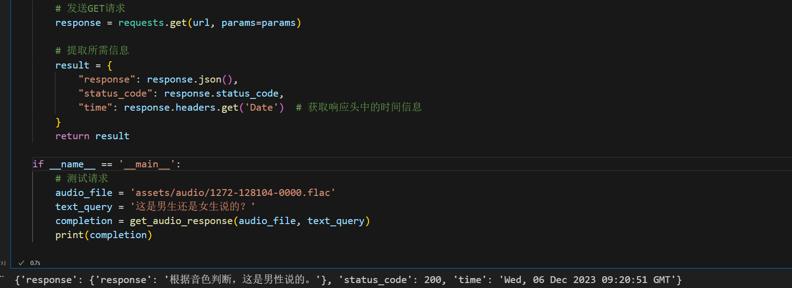

# Qwen-Audio-chat FastApi 部署调用

## Qwen-Audio 介绍

**Qwen-Audio** 是阿里云研发的大规模音频语言模型（Large Audio Language Model）。Qwen-Audio 可以以多种音频 (包括说话人语音、自然音、音乐、歌声）和文本作为输入，并以文本作为输出。

## 环境准备

在autodl平台中租一个3090等24G显存的显卡机器，如下图所示镜像选择PyTorch-->2.0.0-->3.8(ubuntu20.04)-->11.8（11.3版本以上的都可以）
接下来打开刚刚租用服务器的JupyterLab图像， 并且打开其中的终端开始环境配置、模型下载和运行演示。 

pip换源和安装依赖包

```bash
# 升级pip
python -m pip install --upgrade pip
# 更换 pypi 源加速库的安装
pip config set global.index-url https://pypi.tuna.tsinghua.edu.cn/simple

pip install modelscope==1.9.5

pip install accelerate
pip install tiktoken
pip install einops
pip install transformers_stream_generator==0.0.4
pip install scipy
pip install torchvision
pip install pillow
pip install tensorboard
pip install matplotlib
pip install transformers==4.32.0
pip install gradio==3.39.0
pip install nest_asyncio
```

## 模型下载

使用 modelscope 中的snapshot_download函数下载模型，第一个参数为模型名称，参数cache_dir为模型的下载路径。

在 /root/autodl-tmp 路径下新建 download.py 文件并在其中输入以下内容，粘贴代码后记得保存文件，如下图所示。并运行 python /root/autodl-tmp/download.py 执行下载，模型大小为 20 GB，下载模型大概需要10~20分钟

```python
import torch
from modelscope import snapshot_download, AutoModel, AutoTokenizer
from modelscope import GenerationConfig
model_dir = snapshot_download('qwen/Qwen-Audio-Chat', cache_dir='/root/autodl-tmp', revision='master')
```

测试音频下载

~~~bash
wget -O /root/autodl-tmp/1272-128104-0000.flac https://github.com/QwenLM/Qwen-Audio/raw/main/assets/audio/1272-128104-0000.flac
~~~


## 代码准备 

在/root/autodl-tmp路径下新建api.py文件并在其中输入以下内容，粘贴代码后记得保存文件。下面的代码有很详细的注释，大家如有不理解的地方，欢迎提出issue。
```python
from fastapi import FastAPI, Request, File, UploadFile, Query
from transformers import AutoTokenizer, AutoModelForCausalLM, GenerationConfig
import uvicorn
import json
import datetime
import torch
import os
import nest_asyncio
nest_asyncio.apply()

# 设置设备参数
DEVICE = "cuda"  # 使用CUDA
DEVICE_ID = "0"  # CUDA设备ID，如果未设置则为空
CUDA_DEVICE = f"{DEVICE}:{DEVICE_ID}" if DEVICE_ID else DEVICE  # 组合CUDA设备信息

# 清理GPU内存函数
def torch_gc():
    if torch.cuda.is_available():  # 检查是否可用CUDA
        with torch.cuda.device(CUDA_DEVICE):  # 指定CUDA设备
            torch.cuda.empty_cache()  # 清空CUDA缓存
            torch.cuda.ipc_collect()  # 收集CUDA内存碎片

# 创建FastAPI应用
app = FastAPI()

# 处理POST请求的端点
@app.post("/audio/")
async def create_audio_item(file: UploadFile = File(...)):
    global model, tokenizer  # 使用全局变量
    # 保存音频文件到临时路径
    temp_file_path = f"temp/{file.filename}"
    with open(temp_file_path, 'wb') as f:
        f.write(file.file.read())
    file.file.close()

    # 1st dialogue turn
    query = tokenizer.from_list_format([
        {'audio': temp_file_path},  # 使用保存的临时音频文件路径
        {'text': 'what does the person say?'},
    ])
    response, history = model.chat(tokenizer, query=query, history=None)

    # 清理临时文件
    os.remove(temp_file_path)

    now = datetime.datetime.now()  # 获取当前时间
    time = now.strftime("%Y-%m-%d %H:%M:%S")  # 格式化时间为字符串
    # 构建响应JSON
    answer = {
        "response": response,
        "status": 200,
        "time": time
    }
    print(f"[{time}] Response: {response}")  # 打印日志
    torch_gc()  # 执行GPU内存清理
    return answer

@app.get("/test-audio/")
def test_audio(audio_file_path: str = Query('/root/autodl-tmp/1272-128104-0000.flac', alias='audio'),
               text_query: str = Query('what does the person say?', alias='text')):
    """
    测试音频接口，用户可以指定音频文件路径和文本查询
    :param audio_file_path: 音频文件的路径
    :param text_query: 文本查询内容
    """

    # 使用model和tokenizer处理音频和文本
    query = tokenizer.from_list_format([
        {'audio': audio_file_path},
        {'text': text_query},
    ])
    response, history = model.chat(tokenizer, query=query, history=None)

    return {"response": response}

# 主函数入口
if __name__ == '__main__':
    mode_name_or_path = '/root/autodl-tmp/qwen/Qwen-Audio-Chat'
    # 加载预训练的分词器和模型
    tokenizer = AutoTokenizer.from_pretrained(mode_name_or_path, trust_remote_code=True)
    model = AutoModelForCausalLM.from_pretrained(mode_name_or_path, trust_remote_code=True,torch_dtype=torch.bfloat16,  device_map="auto")
    model.generation_config = GenerationConfig.from_pretrained(mode_name_or_path)
    model.generation_config.pad_token_id = model.generation_config.eos_token_id
    model.eval()  # 设置模型为评估模式
    # 启动FastAPI应用
    # 用6006端口可以将autodl的端口映射到本地，从而在本地使用api
    uvicorn.run(app, host='0.0.0.0', port=6006, workers=1)  # 在指定端口和主机上启动应用
```

## Api 部署

在终端输入以下命令启动api服务
```
cd /root/autodl-tmp
python api.py
```
加载完毕后出现如下信息说明成功。


默认部署在 6006 端口，通过 POST 方法进行调用，可以使用curl调用，如下所示：
```bash
curl http://127.0.0.1:6006/test-audio/
```
也可以使用python中的requests库进行调用，如下所示：
```python
import requests

def get_audio_response(audio_file_path, text_query):
    # 设置API的URL
    url = 'http://127.0.0.1:6006/test-audio/'

    # 设置音频文件路径和文本查询的参数
    params = {
        'audio': audio_file_path,  # 音频文件路径
        'text': text_query         # 文本查询
    }

    # 发送GET请求
    response = requests.get(url, params=params)

    # 提取所需信息
    result = {
        "response": response.json(),
        "status_code": response.status_code,
        "time": response.headers.get('Date')  # 获取响应头中的时间信息
    }
    return result

if __name__ == '__main__':
    # 测试请求
    audio_file = '/root/autodl-tmp/1272-128104-0000.flac'
    text_query = '这是男生还是女生说的？'
    completion = get_audio_response(audio_file, text_query)
    print(completion)
```
得到的返回值如下所示：

```text
{
	'response': {'response': '根据音色判断，这是男性说的。'},
	'status_code': 200, 
	'time': 'Wed, 06 Dec 2023 09:20:51 GMT'
}
```

