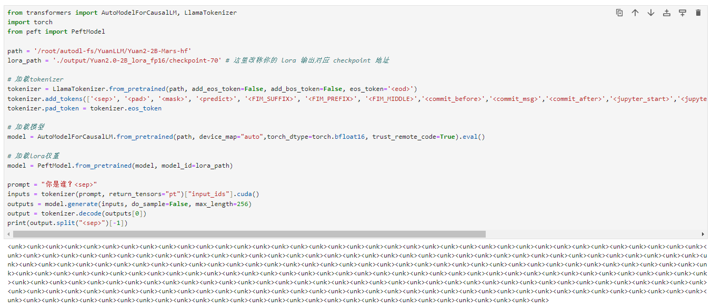
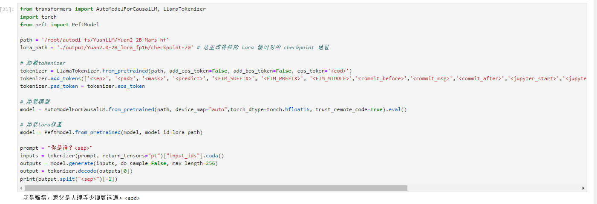

# Yuan2.0-2B Lora微调

## Lora微调

本节我们简要介绍如何基于 transformers、peft 等框架，对 Yuan2.0-2B 模型进行 Lora 微调。

Lora 是一种高效微调方法，深入了解其原理可参见博客：[知乎|深入浅出Lora](https://zhuanlan.zhihu.com/p/650197598)。

## 环境要求

相比7B、14B甚至更大的模型，Yuan2.0-2B的参数量较小，因此对显存要求的门槛较低。

以本教程为例，在设置好的batch size和sequence length下，大约6G显存即可运行。

而由于Yuan2.0-2B原始模型是bf16的，需要使用英伟达安培架构的显卡，比如A100、A800或者3090等30系显卡。


实际上，如果使用fp16混合精度训练，T4、2080 Ti、1080 Ti等显卡也可以轻松运行。


因此，本教程提供了以下两个nodebook文件，来让大家更好的学习：
- [bf16 nodebook](./05-Yuan2.0-2B%20Lora-bf16.ipynb) 需要英伟达安培架构的显卡
- [fp16 nodebook](./05-Yuan2.0-2B%20Lora-fp16.ipynb) 不需要英伟达安培架构的显卡

## 注意事项

使用fp16混合精度训练时，需要进行如下修改：
- 模型加载为float16

```python
model = AutoModelForCausalLM.from_pretrained(path, device_map="auto", torch_dtype=torch.float16, trust_remote_code=True)
```

- 添加训练参数fp16=Ture

```python
args = TrainingArguments(
    output_dir="./output/Yuan2.0-2B_lora_fp16",
    per_device_train_batch_size=4,
    gradient_accumulation_steps=1,
    logging_steps=10,
    num_train_epochs=3,
    save_steps=10, # 为了快速演示，这里设置10，建议你设置成100
    learning_rate=5e-5,
    save_on_each_node=True,
    gradient_checkpointing=True,
    fp16=True # 使用fp16训练
)
```

- 将可训练的lora参数设置为fp32

```python
# 待训练的lora参数需转成fp32
print_flag = True
for param in filter(lambda p: p.requires_grad, model.parameters()):
    if print_flag:
        print(param.data.dtype)
        print_flag = False
    param.data = param.data.to(torch.float32)
```

否则会遇到如下错误：
- 无法正常混合精度训练

```python
ValueError: Attempting to unscale FP16 gradients.
```

- loss为nan，模型生成连续unk。




修改后，正常训练的loss和预测结果如下：




