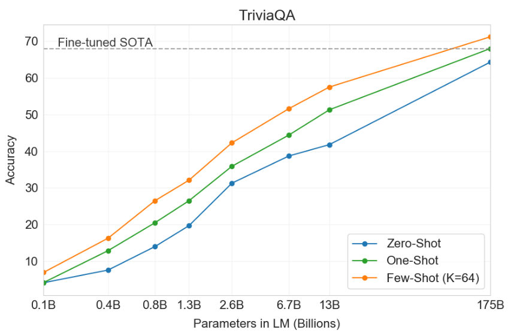
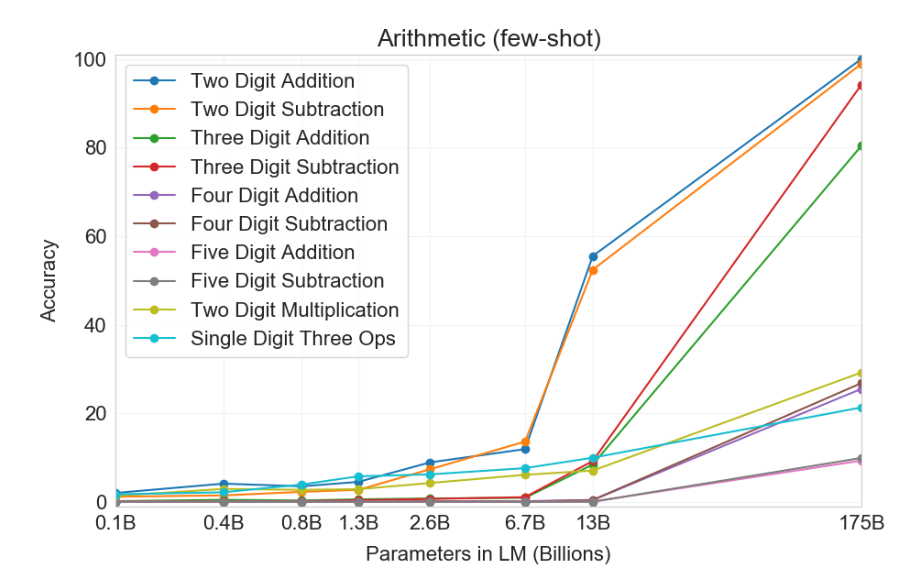

# Chapter 2 The Power of Large Models

## 2.1 Overview

In this course, we will explore the capabilities of GPT-3, a representative large language model. Our research is mainly based on the benchmarks in the [GPT-3 paper](https://arxiv.org/pdf/2005.14165.pdf), which include:

- Standard natural language processing (NLP) benchmarks, such as question answering;

- Some special one-shot demonstrations, such as using new words in sentences.

Comparing the state-of-the-art results for each task, we find that GPT-3's results are mixed:

- On some tasks, such as language modeling, GPT-3 significantly surpasses the state-of-the-art;

- On other tasks, GPT-3 lags behind when competing with well-trained systems with a large amount of labeled data.

How should we understand these results?

First, we need to understand that GPT-3 is not explicitly trained for these tasks, it is just a language model that is trained to predict the next word. However, even without "extra effort", GPT-3 still does well on average across a wide range of NLP tasks.

Since GPT-3 was not trained specifically for any of these tasks, it is not overfitting, meaning it has great potential to perform well on many other tasks (just as well as it does on the one-shot task).

In addition,If you want to perform well on any specific task (such as question answering), in principle you should be able to adapt GPT-3 to use a large amount of labeled data and surpass the current state of the art.

## 2.2 Adaptability of language models: Transformation from language models to task models

In the world of natural language processing, a language model $p$ is a distribution over token sequences $x_{1:L}$. Such a model can be used to evaluate sequences such as $p(𝗍𝗁𝖾,𝗆𝗈𝗎𝗌𝖾,𝖺𝗍𝖾,𝗍𝗁𝖾,𝖼𝗁𝖾𝖾𝗌𝖾)$. Similarly, it can be used to generate a completed sequence given a prompt, such as $\text{𝗍𝗁𝖾 𝗆𝗈𝗎𝗌𝖾 𝖺𝗍𝖾}⇝\text{𝗍𝗁𝖾 𝖼𝗁𝖾𝖾𝗌𝖾}$ .

Here, the task is defined as a mapping from input to output. For example, in the question-answering task, we may have the following input and output:
```
Input: What school did Burne Hogarth establish?
Output: School of Visual Arts
```

We use the term "adaptation" to refer to the process of converting a language model into a task model. This process requires the following two inputs:

1. A natural language description of the task

2. A set of training examples (input-output pairs)

There are two main ways to perform this adaptation:

- Training (standard supervised learning)：Train a new model to map input to output. This can be done by creating a new model and using the language model as a feature (probe method), or starting from an existing language model and updating it based on training examples (fine-tuning), or finding a balance between the two (lightweight fine-tuning). The above content will be learned in Chapter 7 ([Adaptation of the large model](https://github.com/datawhalechina/so-large-lm/blob/main/docs/content/ch07.md)). 
- Prompt (context) learning: Create one or a set of prompts/context information based on the description of the task, and input it into the language model to obtain the generated results based on the task. According to the number of prompts/context information, we can further subdivide: 
- Zero-shot learning (Zero-shot): The number of prompts/context information is 0, and the model directly outputs the results based on the understanding of the task. 
- One-shot learning (One-shot): The number of prompts/context information is 1. Generally speaking, the model can better understand the task based on 1 example and thus generate better results. 
- Few-shot learning: The number of hints/context information is greater than 1, and the large model can see more examples, generally achieving better results than single-shot learning.

In this selection process, the trainingTraining can become challenging due to overfitting (e.g., imagine fine-tuning a 175 billion parameter model on 5 examples). How to train efficiently will be discussed later in this course. For now, we will be content with adapting GPT-3 using hints. However, it is worth noting that hints are limited in that we can only use a small number of training examples (generally, only enough to fit into a hint). This input limitation is due to the limitations of the Transformer itself, which has a constraint on the length of the input to the model (generally speaking, 2048 tokens).

In the GPT-3 paper, the authors evaluated GPT-3 on a large number of tasks. We will select a few of them, and for each task, we will discuss the following points:

- Definition: What is the task, and what is its motivation?

- Adaptation: How do we reduce the task to a language model using hints?

- Results: How does GPT-3 quantitatively perform compared to the state-of-the-art models on this task?

Both the size of the model and the number of training examples are important. The default experimental settings for GPT-3 in the following multiple tasks are:
- The full GPT-3 model (davinci) with 175 billion parameters.
- Contextual learning using as many examples of training data as possible.

During this process, ablation experiments will be performed to see if the size of the model and the number of contextual training examples are really important.As a preview, large models have very good performance, and more contexts are always better. The tasks selected for the experiment are as follows:
- Language modeling
- Question answering
- Translation
- Arithmetic
- News article generation
- Novel tasks

### 2.1.1 Language Modeling

In the field of natural language processing (NLP), in addition to studying large language models, we also need to delve into some basic tasks. For example, we need to have a deep understanding of the various functions of GPT-3 and truly understand how to optimize the prompts given to the model (currently, it has become a consensus that performance can be obtained only by prompts based on the proposed information). These are the core parts of language model research. The most intuitive way is to verify whether the language model can effectively imitate and understand the language.

Let's review the content of the language model mentioned in the introduction. The language model $p$ is the probability distribution of the word sequence. Suppose we have a text $x_{1:L}$ , for example:

$$
\text{𝗍𝗁𝖾 𝗆𝗈𝗎𝗌𝖾 𝖺𝗍𝖾 𝗍𝗁𝖾 𝖼𝗁𝖾𝖾𝗌𝖾}
$$

We can ask: what probability will the language model assign to this text?

$$
p(\text{𝗍𝗁𝖾 𝗆𝗈𝗎𝗌𝖾 𝖺𝗍𝖾 𝗍𝗁𝖾 𝖼𝗁𝖾𝖾𝗌𝖾})
$$

We know that the joint probability can be decomposed into the product of the conditional probabilities of each token, which is done by the chain rule:

$$
p(x_{1:L}) = \prod_{i=1}^L p(x_i \mid x_{1:i-1}).
$$

Perplexity is an important metric and an important concept in natural language processing and language models to measure the performance of language models. It can be interpreted as the average uncertainty of the model when predicting the next word. Simply put, if a model has a lower perplexity, it will be more accurate in predicting the next word. For a given language model and a test data set, the perplexity is defined as:

$$
P(X) = P(x_1,x_2,...,x_N)^{(-1/N)}
$$

Where $X=x_{1},x_{2},...,x_{N}$ is the word sequence in the test set, and $N$ is the total number of words in the test set. The perplexity is closely related to the quality of the language model. A good language model should accurately predict the word sequence in the test data, so its perplexity should be low. On the contrary, if the language model often makes wrong predictions, its perplexity will be high.

The joint probability of a sequence depends on its length, and as the length grows, its value approaches zero, which makes the perplexity difficult to track. Intuitively, we wantThe probability $p(x_{i}|x_{1:i−1})$ of each token is averaged. Here p(xi|x1:i−1) represents the probability of the next token $x_{i}$ given the previous token sequence $x_{1:i−1}$. The purpose of this is to evaluate the average performance of the model when dealing with various tokens.

In fact, we don’t want to take the arithmetic average, because if a token is assigned a probability of 0 (i.e. our model thinks that this word is absolutely impossible to appear in a specific context), then this will cause huge problems in the arithmetic average. Because the arithmetic average does not penalize you for this, it simply adds the probabilities of all tokens together and divides by the total, so a very low probability (such as 0) may be offset by other higher probabilities.

Instead, we want to take the geometric mean, which is what perplexity does. In the geometric mean, the probability of each token is treated equally, and a very low probability (such as 0) will cause the overall geometric mean to drop significantly. Therefore, by calculating the geometric mean, we can get a better measure of the model's performance over all possible word tokens, especially in cases where the model might make mistakes.

$$
\text{perplexity}_p\left(x_{1: L}\right)=\exp \left(\frac{1}{L} \sum_{i=1}^L \log \frac{1}{p\left(x_i \mid x_{1: i-1}\right)}\right) \text {. }
$$

<!--
\operatorname This macro cannot be used
The following macros are not allowed: \operatorname
-->

Perplexity can be understood as the average "branching factor" for each token. The "branching factor" here can be understood as how many possible words the model thinks will appear at each position. For example, if the perplexity is 10, it means that each time the model predicts the next word, it will consider 10 words as possible choices on average.

This understanding is closely related to the $\log \frac{1}{p\left(x_i \mid x_{1: i-1}\right)}$ in the formula, which represents the encoding length. What we are calculating is the average encoding length, which reflects the number of possible choices for the next word or token given the current word or token. Therefore, by exponentially taking the average encoding length, we can get the number of possible choices, which is also known as the "branching factor".

To better understand, we can consider an example of uniform distribution: a binary string of length 3 can beto encode $2^3=8$ possible strings. Similarly, perplexity reflects the average number of possibilities that the model considers when predicting the next word. If the perplexity is 8, then for each word in the sequence, the model considers 8 possible words. This example is similar to our language model: given a specific word or token, the model needs to predict the next word or token from multiple possible options. If there are more possibilities to choose from, the prediction task of the model is more complex, and the corresponding perplexity will be higher.

**Two types of errors**: Language models can make two types of errors, and perplexity treats these two errors symmetrically:

- Recall error: The language model fails to correctly assign a probability value to a token. In this case, perplexity is ruthless. For example, if the model predicts that the probability of the phrase '𝖺𝗍𝖾' appearing after '𝗍𝗁𝖾,𝗆𝗈𝗎𝗌𝖾' is close to 0, then the corresponding perplexity value will approach infinity.

$$
p({ate} \mid {the}, {mouse}) \to 0 \quad\Rightarrow\quad \text{perplexity}_p({the}, {mouse}, {ate}, {the}, {cheese}) \to \infty.
$$

- Precision error: The language model over-assigns probability values ​​to some incorrect word sequences. In this case, the perplexity is moderatelyPenalty. Given a language model p, suppose we mix in some garbage distribution $r$ with probability $ϵ$:

$$
q(x_i \mid x_{1:i-1}) = (1-\epsilon) p(x_i \mid x_{1:i-1}) + \epsilon r(x_i \mid x_{1:i-1}).
$$

Then, we can calculate the perplexity of $x_{1:L}$ under $q$:

$$
\text{perplexity}_q(x_{1:L}) \le \frac{1}{1 - \epsilon} \text{perplexity}_p(x_{1:L}) \approxeq (1 + \epsilon) \text{perplexity}_p(x_{1:L}),
$$

Where the last approximate equation holds for small values ​​of $ϵ$. If we mix in 5% junk information, the perplexity will only increase by 5%. Note that the resulting language will be very bad, because on average one meaningless token will be generated every 20 tokens.

Now, let's move on to evaluating the perplexity on the actual dataset. "

#### 2.1.1.1 Penn Tree Bank
[Penn Tree Bank](https://catalog.ldc.upenn.edu/LDC99T42) is a classic dataset in natural language processing, originally annotated for syntactic parsing. Starting from [Emami and Jelinek (2004)](https://ieeexplore.ieee.org/stamp/stamp.jsp?tp=&arnumber=1325968) and [Mikolov and Zweig (2012)](https://ieeexplore.ieee.org/stamp/stamp.jsp?tp=&arnumber=6424228), a version containing only Wall Street Journal articles has been used for language model evaluation. It should be noted that if the PTB dataset is used to benchmark its language model, some important preprocessing of the original dataset is required, such as data format conversion (thanks to [John Hewitt](https://nlp.stanford.edu/~johnhew/) for pointing it out). 

Adaptability test. Feed the entire text as a prompt into GPT-3 and evaluate its perplexity (example): "

```
Pierre Vinken, 61 years old, will join the board as a nonexecutive directortor Nov. 29. Mr. Vinken is chairman of Elsevier N.V., the Dutch publishing group.
```

**Results:** GPT-3 surpasses the current state-of-the-art by a wide margin

|Model|Perplexity|
|---|---|
|GPT-3|**20.5**|
|BERT-Large-CAs1|31.3|

Does this result have a training/test leakage problem? The authors did not evaluate on some datasets, such as WikiText-103. We know that GPT-3 was trained on Wikipedia, so PTB has an advantage in this regard because it predates the Internet and is only available through a paid license, which may alleviate the leakage problem. But we also need to know that data leakage is another complication of current large datasets: it is difficult to check whether your test data appears in your training data and is memorized.

#### 2.1.1.2 [LAMBADA](https://arxiv.org/pdf/1606.06031.pdf)
The task of this data: predict the last word of a sentence.
Motivation: Solving this task requires modeling longer content and havingA certain dependency.

LAMBADA itself is a language model, so it uses autoregression to generate the next word. Since the purpose of this task is to require the model to complete the last word in the sentence. Therefore, a key challenge is that the model does not recognize by default that it needs to generate the last word of the sentence. To overcome this problem, we need to design the task as a more explicit input-output mapping relationship. Specifically, by providing additional examples for contextual learning, we can let the model learn to generate the corresponding output given the input, thereby effectively solving the problem of the model locating the last word when completing the sentence.
```
Fill in blank: 

Alice was friends with Bob. Alice went to visit her friend ___. -> Bob 

She held the torch in front of her. 

She caught her breath. 
“Chris? There’s a step.”
“What?”
“A step. Cut in the rock. About fifty feet ahead.” She moved faster. They both moved faster. "In fact," she said, raising the torch higher, "there’s more than a ___. -> step
```
Results: GPT-3 surpasses the previous best result (GPT-2)

|Model|Perplexity|
|---|---|
|GPT-3 (few-shot)|**1.92**|
|SOTA|8.63|

#### 2.1.1.3 [HellaSwag](https://arxiv.org/pdf/1905.07830.pdf)
Motivation: Evaluate the ability of models to perform commonsense reasoning
Task: Choose the best option to complete a sentence from a list of choices

The data is a multiple-choice task, so the most natural approach is to use a language model to score each candidate answer and predict the "best" answer (example):
```
Making a cake: Several cake pops are shown on a display. A woman and girl are shown making the cake pops in a kitchen. They ${answer}
```

Among them${answer}$ is one of the following options:
1. _bake them, then frost and decorate._
2. _taste them as they place them on plates._
3. _put the frosting on the cake as they pan it._
4. _come out and begin decorating the cake as well._

Given a question x, how do you score the candidate answers y? There is no clear answer, but here are some heuristics:
- Unnormalized probability: $score(x,y)=p(x,y)$ . The problem with unnormalized probability is that it favors short answers.
- Length-normalized probability: $score(x,y)=p(x,y)/num-tokens(y)$ . This corrects for the length bias. However, for two answers of the same length, the model may still prefer the more popular entity.
- Frequency-normalized probability: $score(x,y)=p(y|x)/p(y|x_{0})$ , where $x_{0}$ is a neutral string like 'Answer:'. This downgrades the scores of answers that happen to be very common (e.g., "John").

**Results:** GPT-3 approaches but does not surpass the state-of-the-art:

|Model|Accuracy|
|---|---|
|SOTA|**85.6**|
|GPT-3|79.3|

What I need to know is that the SOTA results are obtained by fine-tuning on the training set of this dataset, so it is surprising that GPT-3 achieves close results without training on this dataset at all.

### 2.1.2 Question answering
We now consider (closed-book) question answering problems, where the input is a question and the output is an answer. The language model must somehow "know" the answer without looking up the information in a database or set of documents.
```
Input: What school did burne hogarth establish? 
Output: School of Visual Art
```

#### 2.1.2.1 [TriviaQA](https://arxiv.org/pdf/1705.03551.pdf)
Task: GiveGenerate an answer after setting a question
The original dataset was collected by amateurs and used as an open-ended reading comprehension challenge, but we use it for (closed-book) question answering. We define a prompt based on the training examples and the question, and take the completed content as the predicted answer:
```
Q: ‘Nude Descending A Staircase’ is perhaps the most famous painting by which
20th century artist? 
A: Marcel Duchamp
```

**Results:**

|Model|Accuracy|
|---|---|
|RAG|68.0|
|GPT-3 (zero-shot)|64.3|
|GPT-3 (few-shot)|**71.2**|

We also see that increasing the model size and increasing the in-context training examples both help improve performance:



#### 2.1.2.2 [WebQuestions](https://aclanthology.org/D13-1160.pdf)
Task: Similar to TriviaQA, it is a question-answering task
The dataset is from Googlele search query, originally used for question answering on the knowledge base. We define a prompt as in TriviaQA (demo):

```
Q: What school did burne hogarth establish? 
A: School of Visual Arts
```

**Results:**

|Model|Accuracy|
|---|---|
|RAG|**45.5**|
|GPT-3 (zero-shot)|14.4|
|GPT-3 (few-shot)|41.5|

#### 2.1.2.3 NaturalQuestions

Task: Answering Questions
A dataset collected from Google search queries (the difference is that the answers are longer) We define a prompt as above:

```
Q: Who played tess on touched by an angel? 
A: Delloreese Patricia Early (July 6, 1931 - November 19, 2017), known professionally as Della Reese.
```

**Results:**

|Model|Accuracy||---|---|
|RAG|**44.5**|
|GPT-3 (zero-shot)|14.6|
|GPT-3 (few-shot)|29.9|

### 2.1.3 Translation
The translation task is to translate sentences in a source language (e.g., German) into sentences in a target language (e.g., English). Machine translation has been a long-standing task in NLP since the 1960s, with statistical machine translation starting to gain momentum in the 2000s within NLP (which has its own distinct subcommunity), followed by neural machine translation in the mid-2010s. It has always been a data-rich field due to the existence of human translators. Standard evaluation datasets are, for example, the WMT’14 and WMT’16 datasets. Since there are multiple possible translations, the (automatic) evaluation metric is BLEU (which captures the notion of n-gram overlap). For the few-shot case, we construct a prompt (demonstration) containing the input-output training instance and the input:

```
My house lies on the hill. = My house is on the hill.

The result is a Gebrauch verwendet w= In no case may they be used for commercial purposes.
```

**Results:** Here are the results from German to English:

|Model|Accuracy|
|---|---|
|SOTA (supervised)|40.2|
|GPT-3 (zero-shot)|27.2|
|GPT-3 (few-shot)|40.6|
- Even with no supervised training data, GPT-3 reaches the state-of-the-art for fully supervised systems!
- This sets a lower bound on the performance of machine translation; since one would certainly want to exploit a large parallel corpus (aligned input-output pairs).
- Results for French and Romanian are similar.
- Results from English to foreign languages ​​are much worse, which is to be expected since GPT-3 is primarily an English model.

### 2.1.4 Arithmetic
GPT-3 is a language model (primarily English), but we can evaluate it on a range of more "abstract reasoning" tasks to assess GPT-3's performance as a more general model.

The Arithmetic task here is to do arithmetic problems (addition, subtraction, and multiplication of 2-5 digit numbers). You have no practical reason to solve this problem; it is just a diagnostic task to satisfy our scientific curiosity.Answer the question: 
```
Q: What is 556 plus 497? 
A: 1053
```

**Results:**

 

From the experimental results, although we cannot say that GPT-3 has achieved very good results, it still makes us amazed and full of imagination for the future.

### 2.1.5 News article generation
Task: Given a title and subtitle, generate a news article.
Dataset: Title/subtitle is taken from [newser.com](https://stanford-cs324.github.io/winter2022/lectures/capabilities/newser.com).
We set up an evaluation criterion where humans score articles based on the likelihood that they are written by machines. We provide the model with sample prompts in context learning: 
```
Title: United Methodists Agree to Historic Split 
Subtitle: Those who oppose gay marriage will form their own denomination 
Article:After two days of intense debate, the United Methodist Church has agreed to a historic split - one that is expected to end in the creation of a new denomination, one that will be "theologically and socially conservative," according to The Washington Post. The majority of delegates attending the church's annual General Conference in May voted to strengthen a ban on the ordination of LGBTQ clergy and to write new rules that will "discipline" clergy who officiate at same-sex weddings. But those who...o opposed these measures have a new plan: They say they will form a separate denomination by 2020, calling their church the Christian Methodist denomination...
```

**Results:** Humans only correctly classified "human" and "machine" 52% of the time (almost just random chance).

### 2.1.6 Novel tasks
#### 2.1.6.1 Use new words
Task: Given a newly coined word and definition, generate a sentence using the word.
We still only need to describe the task in the prompt:
```
To "screeg" something is to swing a sword at it. An example of a sentence that uses the word screeg is: We screeged the tree with our swords.
```

#### 2.1.6.2 Correct English grammar
Task: Given an ungrammatical sentence, generate its grammatical version.
We describe the task by giving a promptDescribe the task (prompts are composed of inputs and input pairs): 
```
Poor English input: I ate the purple berries. 
Good English output: I ate the purple berries. 
Poor English input: Thank you for picking me as your designer. I’d appreciate it. 
Good English output: Thank you for choosing me as your designer. I appreciate it. 
Poor English input: The mentioned changes have been done. or I did the alteration that you 
requested. or I changed things you wanted and did the modifications. 
Good English output: The requested changes have beenen made. or I made the alteration that you 
requested. or I changed things you wanted and made the modifications. 
Poor English input: I’d be more than happy to work with you in another project. 
Good English output: I would be happy to work with you on another project.
```

### 2.1.7 Other tasks
Since the original paper, GPT-3 has been applied to many more tasks, including benchmarks and one-off demos. Here is a non-exhaustive list:
**Benchmarks:**
- [SWORDS](https://arxiv.org/pdf/2106.04102.pdf): Lexical replacement, the goal is to predict synonyms in the context of a sentence.
- [Massive Multitask Language Understanding](https://arxiv.org/pdf/2009.03300.pdf): 57 multiple-choice questions in mathematics, US history, computer science, law, etc.
- [TruthfulQA](https://arxiv.org/pdf/2109.07958.pdf): A question-answering dataset where humans give incorrect answers due to misunderstandings.
**Results:** Although GPT-3 performs mediocrely on these benchmark datasets, it may not be too bad considering that we only used few-shot situations.

**one-off Demos:**
- [Examples from the OpenAI website](https://beta.openai.com/examples/)
- [Examples from gpt3demo.com](https://gpt3demo.com/)
These demos are innovative and interesting, but it is difficult to judge how reliable they are.

### 2.1.8 Summary
- GPT-3 was evaluated on a wide range of standard NLP benchmarks and one-shot tasks.
- GPT-3 can perform extremely well or very mediocrely.
- Increasing the size of the model and the number of examples both help improve performance.
- There are some heuristics to applyLanguage models adapt to the task of interest.
- But why this happens is unknown.

## Further reading

- [Language Models are Few-Shot Learners](https://arxiv.org/pdf/2005.14165.pdf). _Tom B. Brown, Benjamin Mann, Nick Ryder, Melanie Subbiah, J. Kaplan, Prafulla Dhariwal, Arvind Neelakantan, Pranav Shyam, Girish Sastry, Amanda Askell, Sandhini Agarwal, Ariel Herbert-Voss, Gretchen Krueger, T. Henighan, R. Child, A. Ramesh, Daniel M. Ziegler, Jeff Wu, Clemens Winter, Christopher Hesse, Mark Chen, Eric Sigler, Mateusz Litwin, Scott Gray, Benjamin Chess,Jack Clark, Christopher Berner, Sam McCandlish, Alec Radford, Ilya Sutskever, Dario Amodei_. NeurIPS 2020.
- [Blog post explaining perplexity](https://towardsdatascience.com/perplexity-in-language-models-87a196019a94)