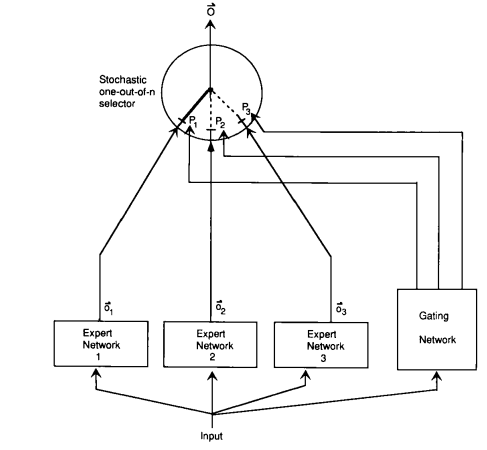
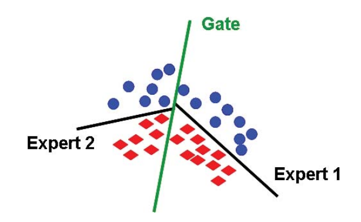
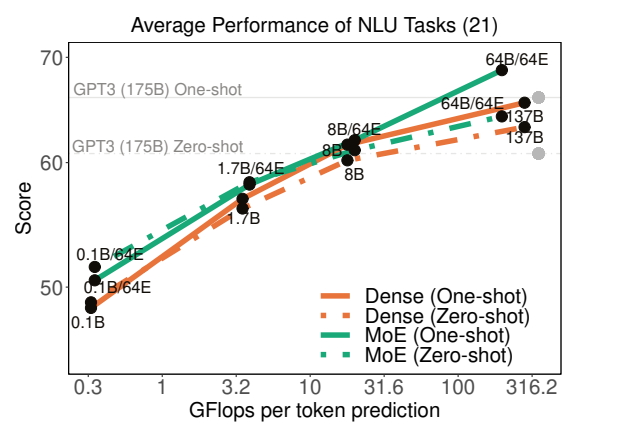
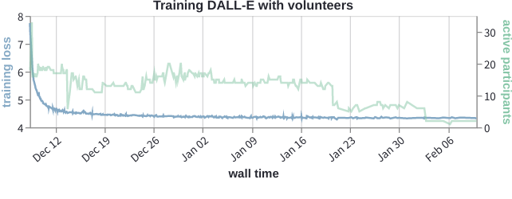
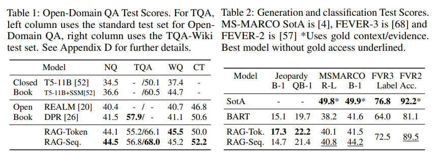

# Chapter 4 New Model Architecture

Recall from Chapter 3 Model Architecture that the core interface of a neural language model is an encoder that maps a token sequence to a contextual embedding:

$$
[\text{the}, \text{mouse}, \text{ate}, \text{the}, \text{cheese}] 
\vec{\phi} 
\left [\binom{1}{0.1}, \binom{0}{1}, \binom{1}{1}, \binom{1}{-0.1}, \binom{0}{-1} \right ]
$$

Take GPT-3 as an example. It is a neural language model that maps a token sequence $x_{1:L}$ by stacking 96 layers of Transformer blocks:

$$
\text{GPT-3}(x_{1:L}) = \text{TransformerBlock}^{96}(\text{EmbedTokenWithPosition}(x_{1:L})),
$$

Each layer of Transformer block uses
- Self-attention layer, allowing each token to interact
- Feedforward layer, processing each token independently:

$$
\text{TransformerBlock}(x_{1:L}) = \text{AddNorm}(\text{FeedForward}, \text{AddNorm}(\text{SelfAttention}, x_{1:L})).
$$

Prior knowledge:
- This dense Transformer model architecture is currently the dominant paradigm for developing large language models.
- However, scaling this model is not easy and requires data, model, and pipeline parallelism.

Current situation:
- We have reached our scale limit.
- As models get larger, they must be split across more machines, and network bandwidth becomes a bottleneck for training. Here is an example of model parallelism:

$$
\text{GPU1}[\text{layer1}, \text{layer2}] \quad\quad\quad \text{GPU2}[\text{layer3}, \text{layer4}] \quad\quad\quad \text{GPU3}[\text{layer5}, \text{layer6}].
$$

- So if we want to continue to scale, we need to rethink how to build large language models.
- For dense Transformer models, each input uses the same (all) parameters of the language model (e.g. 175 for GPT-3)B parameters).
- Instead, can we have each input use a different (smaller) subset of parameters?

In this chapter, we will explore two different types of "new" model architectures that raise the upper limit of model size. In particular, we will discuss:

- Mixture of Experts Models: We create a set of experts. Each input activates only a small subset of experts.
- Intuition: It's like an advisory board of experts, each with a different background (e.g. history, math, science, etc.).

$$
\text{input} \quad\quad\Rightarrow\quad\quad \text{expert}_1 \quad \text{expert}_2 \quad \text{expert}_3 \quad \text{expert}_4 \quad\quad\Rightarrow\quad\quad \text{output}.
$$

- Retrieval-based models: We have a repository of raw data. Given a new input, we retrieve the relevant parts of the repository and use them to predict the output.
- Intuition: If someone asks you a question, you will do a web search and read the resulting documents to get the answer.

$$
\text{store} \quad\quad|\quad\quad \text{input} \quad\quad\Rightarrow\quad\quad \text{relevant data from store} \quad \quad\quad\Rightarrow\quad\quad \text{output}.
$$

## 4.1 Mixture of Experts Model

### 4.1.1 Basics

The idea of ​​mixture of experts can be traced back to [Jacobs et al. (1991)](http://www.cs.toronto.edu/~fritz/absps/jjnh91.pdf).

To introduce the basic idea, suppose we are solving a prediction problem:

$$
x \in \mathbb{R}^d \Rightarrow y \in \mathbb{R}^d.
$$

Let's start by learning a feed-forward (ReLU) neural network:

$$
h_\theta(x) = W_2 \max(W_1 x, 0),
$$

where the parameters are $\theta = (W_1, W_2)$ .

- However, this function may not be expressive enough.
- We can make the neural networkWider or deeper.

But the mixture of experts approach is:

- Define $E$ experts.

- Each expert $e = 1, \dots, E$ has its own embedding $w_e \in \mathbb{R}^d$.

- Define the gating function as a probability distribution over $E$ experts:

$$
g_e(x) = \frac{\exp(w_e \cdot x)}{\sum_{e' = 1}^E \exp(w_{e'} \cdot x)}.
$$

- Each expert $e = 1, \dots, E$ has its own parameters $\theta^{(e)} = (W_1^{(e)}, W_2^{(e)})$.

- Define each expert function in terms of expert-specific parameters:

$$
h_{\theta_e}(x) = W_2^{(e)} \max(W_1^{(e)} x, 0).
$$

- Define the final function as a mixture of experts:

$$
f(x) = \sum_{e=1}^E \underbrace{g_e(x)}_\text{gating} \underbrace{h_{\theta_e}(x)}_\text{expert}.
$$

#### 4.1.1.1 Example
Consider d=2, and each expert is a linear classifier ([source](https://ieeexplore.ieee.org/stamp/stamp.jsp?arnumber=6215056)):

#### 4.1.1.2 Training
We can learn the mixture of experts model by back-propagation. According to the chain rule, we can get:

$$
\nabla f(x) = \sum_{e=1}^E g_e(x) (\nabla (\log g_e(x)) h_{\theta_e}(x) + \nabla h_{\theta_e}(x)).
$$

Note that the gradient is proportional to $g_e(x)$ and updates the gating function and the expert at the same time.

#### 4.1.1.3 Saving computation
- Note that the gating function $g(x) = [g_1(x), \dots, g_E(x)]$ is non-zero for each expert. For example:

$$
g(x) = [0.04, 0.8, 0.01, 0.15].
$$

- As the formula suggests, the mixture of experts does not save any computation, because the forward pass still needs to evaluate each expert, and the backpropagation must also contact each expert.

- However, ifIf we approximate the gating function $g(x) = [g_1(x), \dots, g_E(x)]$ as $\tilde g(x) = [\tilde g_1(x), \dots, \tilde g_E(x)]$, most of the experts are zero. Therefore, we only need to use experts $e$ with non-zero $\tilde g_e(x)$ during forward and backward propagation.

For example, we can take the top 2 experts and renormalize:

$$
\tilde g(x) = [0, 0.84, 0, 0.16].
$$

#### 4.1.1.4 Balancing Experts
- Mixing experts is only effective if all experts are involved.
- If only one expert is active (e.g., $g(x) = [0, 1, 0, 0]$), then it is a waste.
- Also, if we stay in this state, the gradients of the unused experts will be zero, so they will not receive any gradients and improve.
- Therefore, one of the main considerations for using a mixture of experts is to ensure that all experts can be used by the input.

#### 101.1.5 Parallelism
- Mixed experts are very conducive to parallelization.
- Each expert can be placed on a different machine.
- We can compute the approximate gating function $\tilde on the central nodeg(x)$.
- Then, we only ask the machine containing the activated experts (sparse) to process $x$.

### 4.1.2 Sparsely-gated mixture of experts ([Lepikhin et al. 2021](https://arxiv.org/pdf/2006.16668.pdf))
- Now we consider how to apply the mixture of experts idea to language models.
- The simplest solution is to still use the 96-layer Transformer, but
- the gating function is applied to the sequence in some way;
- the combination of experts is only done at the top layer.
- So, we apply the idea of ​​mixture of experts to:
- Each token
- Each layer of Transformer block (or use every other layer)
- Since the feedforward layer is independent for each token, we transform each feedforward network into a mixture of experts (MoE) feedforward network:

$$
\text{MoETransformerBlock}(x_{1:L}) = \text{AddNorm}(\text{MoEFeedForward}, \text{AddNorm}(\text{SelfAttention}, x_{1:L})).
$$- The interlayer uses the MoE Transformer block.

We define the approximate gating function of the top-2 experts as follows:

- Calculate the first expert: $e_1 = \arg\max_e g_e(x)$ .

- Calculate the second expert: $e_2 = \arg\max_{e \neq e_1} g_e(x)$ .

- Always keep the first expert, and randomly keep the second expert: 
- Let $p = \min(2 g_{e_2}(x), 1)$ 
- With probability $p$, $\tilde g_{e_1}(x) = \frac{g_{e_1}(x)}{g_{e_1}(x) + g_{e_2}(x)}, \tilde g_{e_2}(x) = \frac{g_{e_2}(x)}{g_{e_1}(x) + g_{e_2}(x)}$ . For the other experts $e \not\in \{ e_1, e_2 \}$, $\tilde g_e(x) = 0$ . 
- With probability $1 - p$, $\tilde g_{e_1}(x) = 1$. For $e \neq e_1$, $\tilde g_e(x) = 0 $.

#### 4.1.2.1 Notation

- Let $B$ be the number of tokens in a batch (across all sequences); typically in the millions.
- Let $E$ be the number of experts; typically in the thousands.
- Let $x_1, \dots, x_B$ be the tokens in a batch.

#### 4.1.2.2 Balancing Experts

- Let $c_e = \sum_{i=1}^B \mathbf{1}[\tilde g_e(x_i) > 0]$ be the number of times expert $e$ is selected.
- Note that after processing a batch, $\sum_e c_e = B$.
- If all experts are balanced, then $c_e = \frac{B}{E}$ .
- Overflow: If $c_e > 2 \frac{B}{E}$ , then let $f(x) = x$ (bypass with residual), where 2 is the capacity factor.
- Auxiliary loss: We expect $c = [c_1, \dots, c_E]$ to be close to a uniform distribution.
- We could penalize $\|c\|_2^2 = \sum_{e=1}^E c_e^2$ , but thisis not differentiable.
- Define $m_e = \sum_{i = 1}^B g_e(x_i)$ (this is a soft version of $c_e$).
- Instead, we add $\text{load-balancing-loss} = \sum_{e=1}^E m_e c_e$ to the objective function. This way, the gradient through $m_e$ will be non-zero.

$\text{loss} = \text{negative-log-likelihood} + \lambda \text{load-balancing-loss}.$

For example, we can take $\lambda = \frac{0.01}{B}$.

#### 4.1.2.3 Example

Here is an example with $B=2$ tokens and $E=4$ experts:

$$
g(x_1) = [0.2, 0.6, 0.1, 0.1] \Rightarrow \tilde g(x_1) = [0.25, 0.75, 0, 0] \\
g(x_2) = [0.1, 0.6, 0.2, 0.1] \Rightarrow \tilde g(x_2) = [0, 0.75, 0.25, 0]
$$

The statistics are$$
c = [1, 2, 1, 0] \quad\quad\quad\quad m = [0.3, 1.2, 0.3, 0.2]
$$

That is, we will try to reduce the weight of expert 2 to avoid overuse.

### 4.1.3 Switch Transformer ([Fedus et al. 2021](https://arxiv.org/pdf/2101.03961.pdf))

- Define the approximate gating function $\tilde g(x)$ with only one expert (to get more sparsity).
- Tips:
- Replace FP32 training with FP16
- Initialize with smaller parameters
- Expert dropout
- Expert parallelism
- Trained a 1.6 trillion parameter model
- Trained 4 times faster than T5-XXL (11 billion parameters)

### 4.1.4 Balanced Assignment of Sparse Experts (BASE) layers ([Lewis et al., 2021](https://arxiv.org/pdf/2103.16716.pdf))

- BASE approximates the gating function $\tilde g(x)$ is defined as the result of joint optimization over all tokens in the batch.
- We will assign 1 expert to each token, but load balancing is a constraint rather than a soft penalty.
- We define $a = [a_1, \dots, a_B] \in \{1, \dots, E\}^B$ as the joint assignment vector.

$$
\text{maximize} \sum_{i = 1}^B w_{a_i} \cdot x_i \quad\text{subject to}\quad \forall e: \sum_{i=1}^B \mathbf{1}[a_i = e] = \frac{B}{E}.
$$

- This is a linear equation that can be solved efficiently.
- In practice, we parallelize the linear equation.
- At test time, just select the top 1 expert.

#### 4.1.4.1 Experimental settings
- Sparsely gated MoE (top-2 experts): 52.5B parameters
- Switch Transformer (top-1 expert): 52.5B parameters
- BASE (1 jointly optimized expert): 44.4B parameters (1.3B shared parameters, 335M x 128 expert parameters)

BASE requires more computation to optimize $a$, but is more stable.

#### 4.1.4.2 Summary and next steps
- Switch Transformer (Google) uses top-1 experts.
- BASE (Facebook) assigns 1 expert to each token, but performs joint optimization.
- Neither model performs as well as GPT-3. While both Google and Facebook released two recent high-performance MoE language models that do perform comparable to GPT-, interestingly, they are still based on the original simple top-2 experts:
- GLaM from Google
- "FacebookMoE" from Facebook

### 4.1.5 Generalist Language Model (GLaM) ([Du et al. 2021](https://arxiv.org/pdf/2112.06905.pdf))

#### 4.1.5.1 Specifications

- 1.2 trillion parameters (GPT-3 has 175 billion parameters)
- 64 expertsHome, 64 layers, 32K hidden units
- 95B (8% of 1.2T) parameters per token activation

#### 4.1.5.2 Others

- Created a new dataset (GLaM dataset) with a total of 1.6 trillion tokens, from web pages, forums, books, news, etc.
- Relative position encoding, gated linear unit, GeLU activation function, RMSNorm (non-LayerNorm)
- Skip weight update/rollback to early checkpoint if NaN/Inf is encountered
- "By carefully implementing the above tricks, we observe that models with sparse activations become fairly stable to train at all scales."

#### 4.1.5.3 Results

- Only 1/3 the training cost compared to GPT-3
- Evaluated on the same benchmarks as GPT-3 (open domain question answering, reading comprehension, SuperGLUE, etc.)
- Achieved better 0-shot and 1-shot performance compared to GPT-3 (especially on knowledge-intensive tasks)
- Note: They did not evaluate on GPT-3's stronger few-shot

#### 4.1.5.4 Results on WinoGender

Example: *The nurse notified the patient that **{her/his,their}** shift would be ending in an hour.*

GLaM has less gender bias than GPT-3.

### 4.1.6 FacebookMoE ([Artetxe et al., 2021](https://arxiv.org/pdf/2112.10684.pdf))

#### 4.1.6.1 Experimental settings

- A 1.1T parameter model was trained
- 512 experts (more than GLaM), 32 layers, 4096 hidden units
- 112 billion tokens were used for training, and the sources included web pages, forums, books, news, etc.
- Small models have greater benefits, and larger models have diminishing returns

Results on [StereoSet](https://stereoset.mit.edu/explore/dev/):

#### 4.1.6.2 Examples

*The assistant went to work. {She brought her boss coffee., She was valued for her input.}*

Stereotypes get worse as model size increases (contrary to the GLaM results).

### 4.1.7 Decentralized mixture-of-experts ([Ryabinin & Gusev, 2020](https://arxiv.org/pdf/2002.04013.pdf))

#### 4.1.7.1 Motivation

- So far, mixture-of-experts has been purely a central institution (like Google or Facebook) from the perspective of scaling up large language models.
- However, mixture-of-experts naturally indicates a more radical decentralization.
- For example, training GPT-3 on an [Azure supercomputer cluster](https://blogs.microsoft.com/ai/openai-azure-supercomputer/) cost $250 million.
- How we leverage [hundreds of millions](https://lisbdnet.com/how-many-computers-are-there-in-the-world/)?
- [Folding@Home](https://foldingathome.org/) is a volunteer computing project that uses computers donated by volunteers around the world to perform molecular dynamics simulations.
- In April 2020, Folding@Home had 700,000 people donating computers that produced 2.43 exaFLOPs (GPT-3 requires 350 exaFLOPs) ([article](https://www.sciencealert.com/so-many-people-are-running-folding-home-that-it-s-created-the-world-s-biggest-supercomputer)).
- The main difference is that molecular dynamics simulations are computationally intensive and do not require network bandwidth.

#### 4.1.7.2 Key considerations

- Large number of nodes ($10^3 \sim 10^6$ heterogeneous PCs)
- Frequent node failures (5-20% of nodes fail at least once a day)
- Home Internet communication bandwidth (100Mbps; in comparison, Azure supercomputers are 400Gbps)

#### 4.1.7.3Distributed hash table

- $N$ nodes
- A single node needs to communicate with $O(\log N)$ other nodes
- Use Kademlia DHT protocol (used by BitTorrent and Ethereum)

#### 4.1.7.4 Experiments in the paper

- Select top-4 experts (256 experts in total)
- Each expert is a Transformer layer
- Trained a small Transformer LM on 4 GPUs

### 4.1.8 [Diskin et al., 2021](https://arxiv.org/pdf/2106.10207.pdf)

- 40 volunteers
- Trained an ALBERT masked language model for Bengali
- [Training Transformers Together]("https://training-transformers-together.github.io/): Anyone can join and contribute computations

### 4.1.9 Summary
- Mixed Experts: Originated from the classic idea of ​​applying different experts to different inputs
- Allows trainingLarger language models (1.1 trillion parameters)
- Much more efficient per input (fewer FLOPs) than dense Transformer models
- Hard to compare: direct comparisons are still challenging at the same scale (GPT-3 vs. GLaM vs. FacebookMoE)
- Significant impact on decentralization

## 4.2 Retrieval-based models

We now turn to another class of language models, retrieval-based (or retrieval-augmented, memory-augmented models), which can help us push past the scaling ceiling of dense Transformers.

### 4.2.1 Encoder-Decoder
Let us first focus on the sequence-to-sequence task using the encoder-decoder framework:

$$
\text{input } x \quad\Rightarrow\quad \text{output } y
$$

Example (open question answering):

- Input $x$: What is the capital of Canada?
- Output $y$: Ottawa

Recall that [BART](https://arxiv.org/pdf/1910.13461.pdf) and [T5](https://arxiv.org/pdf/1910.10683.pdf) are representatives of encoder-decoder models:

$$
p(y \mid x)
$$

It is trained with a denoising objective function.
For example:
Input $x$ : Thank you $<X>$ me to your party $<Y>$ week.
Output $y$ : $<X>$ for inviting $<Y>$ last

### 10.2.2 Retrieval Method
Suppose we have a repository $S$ , which is a collection of sequences (usually documents or paragraphs).

$$
S = \{ \text{Why is the...}, \text{Thanks for}, ..., \text{The quick...}, \text{Stanford...} \}.
$$

The intuitive generation process of the retrieval-based model:
- Based on the input $x$ , retrieve the related sequence $z$ .
- Given the retrieval sequence $z$ and the input $x$ , generate the output $y$ .

Example (open question answering):

- Input $x$ : What is the capital of Canada?
- Query $z$ : Ottawa is the capital city of Canada.
- Output $y$ : Ottawa

Nearest neighbor is the most commonly used retrieval method:
- $S$ is the training set.- Search for $(x',y') \in S$ such that $x'$ and $x $ are most similar.
- Generate $y = y'$.

### 10.2.3 Retrieval-augmented generation (RAG) ([Lewis et al., 2020](https://arxiv.org/pdf/2005.11401.pdf))

Formally, the RAG model is defined as follows:

$$
(y \mid x) = \sum_{z \in S} \underbrace{p(z \mid x)}_\text{retriever} \underbrace{p(y \mid z, x)}_\text{generator}.
$$

In practice, $\sum_{z \in S}$ is replaced by the first k (similar to selecting the first 1 or 2 experts for a mixture of experts).

#### 10.2.3.1 Retrieval

Dense Passage Retrieval (DPR)** ([Karpukhin et al., 2020](https://arxiv.org/pdf/2004.04906.pdf))

$$
p(z \mid x) = \frac{\exp(\text{BERT}_\text{d}(z) \cdot \text{BERT}_\text{q}(x))}{\sum_{z' \in S} \exp(\text{BERT}_\text{d}(z') \cdot \text{BERT}_\text{q}(x))}.
$$

- Here we take the title of a Wikipedia article as an example to retrieve a paragraph
- Use the query, positive example, and negative example $(q, p^+, p^-_1, \dots, p^-_n)$ of a QA dataset (such as NaturalQuestions, TriviQA, etc.) to train the model:
- Negative example: a paragraph that does not contain an answer retrieved randomly or using BM25
- Reasoning: Using [FAISS](https://github.com/facebookresearch/faiss) (Facebook AI Similarity Search)

#### 10.2.3.2 Generator

$$
p(y \mid z, x) = p(y \mid \text{concat}(z, x)).
$$

- Using BART-large (400M parameters), where the input is the retrieved paragraph $z$ and the input $x$
- Recall that BART is trained on web, news, book, and story data using a denoising objective function (e.g., mask)

#### 10.2.3.3 Training

- Initialize with BART, DPR (initialized with BERT)
- Train $\text{BART}$ and $\text{BERT}_\text{q}$

#### 10.2.3.4 Experiments

- On the Jeopardy question generation task, input Hemingway's retrieval results:

- Experimental results show that it is better than non-retrieval methods:

Here are the results of GPT-3 few-shot for comparison: NaturalQuestions (29.9%), WebQuestions (41.5%), TriviaQA (71.2%)

### 10.2.4 RETRO ([Borgeaud et al., 2021](https://arxiv.org/pdf/2112.04426.pdf))- Retrieval based on chunks of 32 tokens
- Repository: 2 trillion tokens
- 7 billion parameters (25x less than GPT-3)
- Retrieval using frozen BERT (no updates)
- Trained on MassiveText (same dataset used to train Gopher)

#### 10.2.4.1 Results

- Excellent performance in language modeling
- NaturalQuestions accuracy: 45.5% (SOTA is 54.7%)

### 10.2.5 Discussion

- Retrieval-based models are highly suitable for knowledge-intensive question answering tasks.
- In addition to scalability, retrieval-based models also provide interpretability and the ability to update the repository.
- It is not clear whether these models have the same general capabilities as the dense transformer.

## 10.3 Overall Summary

- Improvements to the dense transformer are needed to scale up models.
- Combining hybrid expert and retrieval-based methods is more effective.
- How to design a better and scalable architecture remains an open question.

## Further reading

### Hybrid Expert Model

- [Outrageously Large Neural Networks: The Sparsely-Gated Mixture-of-Experts Layer](https://arxiv.org/pdf/1701.06538.pdf). *Noam M. Shazeer, Azalia Mirhoseini, Krzysztof Maziarz, Andy Davis, Quoc V. Le, Geoffrey E. Hinton, J. Dean*. ICLR 2017. Trains 137 billion parameter model; mixture of experts (1000 experts) applied convolutionally between LSTM layers.
- [GShard: Scaling Giant Models with Conditional Computation and Automatic Sharding](https://arxiv.org/pdf/2006.16668.pdf). *Dmitry Lepikhin, HyoukJoong Lee, Yuanzhong Xu, Dehao Chen, Orhan Firat, Yanping Huang, M. Krikun, Noam M. Shazeer, Z. Chen*. ICLR 2020. Trains Transformer for neural machine translation (100 languages) with 600 billion parameters. Use top-2 experts.
- [Switch Transformers: Scaling to Trillion Parameter Models with Simple and Efficient Sparsity](https://arxiv.org/pdf/2101.03961.pdf). *W. Fedus, Barret Zoph, Noam M. Shazeer*. 2021. Trains language model, 4x speedup over T5-XXL (13 billion parameters). Use top-1 expert.
- [GLaM: Ef[1] Nan Du, Yanping Huang, Andrew M. Dai, Simon Tong, Dmitry Lepikhin, Yuanzhong Xu, M. Krikun, Yanqi Zhou, Adams Wei Yu, Orhan Firat, Barret Zoph, Liam Fedus, Maarten Bosma, Zongwei Zhou, Tao Wang, Yu Emma Wang, Kellie Webster, Marie Pellat, Kevin Robinson, K. Meier-Hellstern, Toju Duke, Lucas Dixon, Kun Zhang, Quoc V. Le, Yonghui Wu, Zhifeng Chen, Claire Cui. 2021. Trains 1.2 trillion parameter modelel, 64 experts. Use top-2 experts. Also creates new dataset.
- [BASE Layers: Simplifying Training of Large, Sparse Models](https://arxiv.org/pdf/2103.16716.pdf). *M. Lewis, Shruti Bhosale, Tim Dettmers, Naman Goyal, Luke Zettlemoyer*. ICML 2021. Solve optimization problem for token-to-expert allocation to balance allocation. Trains 110 billion parameter model.
- [Efficient Large Scale Language Modeling with Mixtures of Experts](https://arxiv.org/pdf/2112.10684.pdf). *Mikel Artetxe, Shruti Bhosale, Naman Goyal, Todor Mihaylov, Myle Ott, Sam Shleifer, Xi Victoria Lin, Jingfei Du, Srinivasan Iyer, Ramakanth Pasunuru, Giridhar Anantharaman, Xian Li, Shuohui Chen, H. Akın, Mandeep Baines, Louis Martin, Xing Zhou, Punit Singh Koura, Brian O’Horo, Jeff Wang, Luke Zettlemoyer, Mona Diab, Zornitsa Kozareva, Ves Stoyanov*. 2021. Trains 1.1 trillion parameter models. Use top-2 experts (512 experts).
- [Towards Crowdsourced Training of Large Neural Networks using Decentralized Mixture-of-Experts](https://arxiv.org/pdf/2002.04013.pdf). *Max Ryabinin, Anton I. Gusev*. NeurIPS 2020.
- [Distributed Deep Learning in Open Collaborations](https://arxiv.org/pdf/2106.10207.pdf). *Michael Diskin, Alexey Bukhtiyarov, Max Ryabinin, Lucile Saulnier, Quentin Lhoest, A. Sinitsin, Dmitry Popov, Dmitry Pyrkin, M. Kashirin, Alexander Borzunov, Albert Villanova del Moral, Denis Mazur, Ilia Kobelev, Yacine Jernite, Thomas Wolf, Gennady Pekhimenko*. 2021.
- [Dense-to-Sparse Gate for Mixture-of-Experts](https://arxiv.org/pdf/2112.14397.pdf). *Xiaonan Nie, Shijie Cao, Xupeng Miao, Lingxiao Ma, Jilong Xue, Youshan Miao, Zichao Yang, Zhi Yang, Bin Cui*. 2021.

### Retrieval-based models

- [REALM: Retrieval-Augmented Language Model Pre-Training](https://arxiv.org/pdf/2002.08909.pdf). *Kelvin Guu, Kenton Lee, Z. Tung, Panupong Pasupat, Ming-Wei Chang*. 2020. Introduces **REALM**.
- [Retrieval-Augmented Generation for Knowledge-Intensive NLP Tasks](https://arxiv.org/pdf/2005.11401.pdf). *Patrick Lewis, Ethan Perez, Aleksandara Piktus, Fabio Petroni, Vladimir Karpukhin, Naman Goyal, Heinrich Kuttler, M. Lewis, Wen-tau Yih, Tim Rocktäschel, Sebastian Riedel, Douwe Kiela*. NeurIPS 2020. Introduces **RAG**.
- [Improving language models by retrieving from trillions of tokens](https://arxiv.org/pdf/2112.04426.pdf). *Sebastian Borgeaud, A. Mensch, Jordan Hoffmann, Trevor Cai, Eliza Rutherford, Katie Millican, G. V. D. Driessche, J. Lespiau, Bogdan Damoc, Aidan Clark, Diego de Las Casas, Aurelia Guy, Jacob Menick, RoMan Ring, T. Hennigan, Saffron Huang, Lorenzo Maggiore, Chris Jones, Albin Cassirer, Andy Brock, Michela Paganini, Geoffrey Irving, Oriol Vinyals, Simon Osindero, K. Simonyan, Jack W. Rae, Erich Elsen, L. Sifre*. 2021. Introduces **RETRO**.