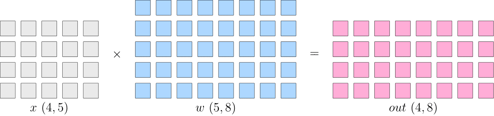
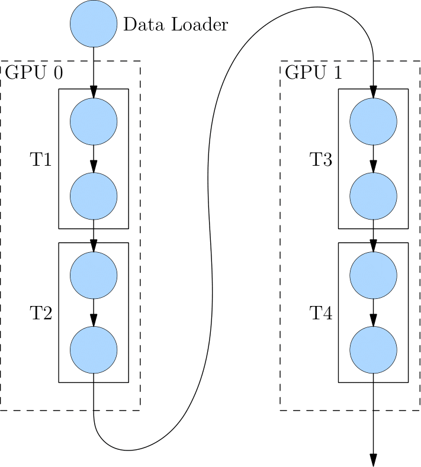
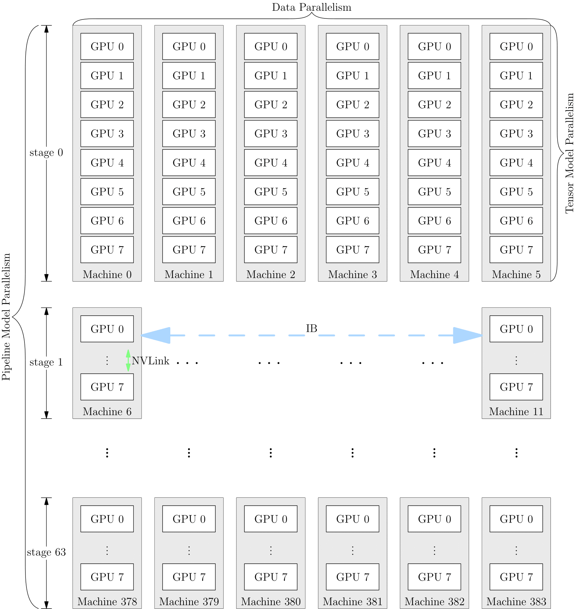

# Chapter 8 Distributed Training

## 8.1 Why Distributed Training is Becoming More Popular

In recent years, deep learning has been widely used in various fields, including computer vision, language understanding, speech recognition, advertising recommendation, etc. In these different fields, a common feature is that the model scale is getting larger and larger. For example, the number of parameters of the GPT-3 model has reached 175 billion. Even if 1024 A100s with 80 GB are used, it will take 1 month to fully train GPT-3.

The expansion of model scale requires the development of hardware (computing power, memory). However, due to the existence of the [memory wall](https://oneflow.org/a/share/jishuboke/75.html), the computing power and capacity of a single device are limited by the laws of physics, and it is increasingly difficult to continuously improve the integration of chips and keep up with the needs of model expansion.

In order to solve the problem of insufficient computing power growth, people consider using multi-node clusters for distributed training to improve computing power, and distributed training is imperative.

## 8.2 Common parallel strategies

Simple machine stacking does not necessarily lead to an increase in computing power. Because neural network training is not simply "dividing the work done by one device to multiple devices", it not only requires multiple devices to perform calculations, but also involves data transmission between devices. Only by coordinating the calculation and communication in the cluster can efficient distributed training be performed.

We will use the matrixThe example of matrix multiplication explains the difference between data parallelism and model parallelism.

First, let's understand the following logical matrix multiplication example:
Suppose a layer in a neural network is doing matrix multiplication, where the shape of the input $x$ is $4\times5$, and the shape of the model parameter $w$ is $5\times8$, then the shape of the matrix multiplication output is $4\times8$.

The schematic diagram is as follows:

In the training of a single machine and a single card, the above matrix multiplication first calculates $out$, and passes $out$ to the next layer, and finally calculates $loss$, and then in the back propagation process, $\frac{\partial loss}{\partial w}$ is obtained to update $w$.

In distributed training, depending on whether $x$ or $w$ is split, it is divided into "data parallel" and "model parallel" strategies. Next, we introduce common parallel strategies.

### 8.2.1 Data parallelism
Data parallelism means splitting the data $x$, while the model $w$ on each device is the same.

As shown in the figure below, $x$ is evenly split into two devices according to the 0th dimension, and both devices have complete $w$.

This way, the outputs obtained on the two devices are only half of the logical output (the shape is $2\times8$ ). The outputs on the two devices are spliced ​​together to get the logically complete output.

Note that because the data is distributed to the two devices, the $\frac{\partial loss}{\partial w}$ obtained on each device during the back propagation process will be different. If the gradients on each device are directly used to update the respective models, the models on the two devices will be inconsistent, and the training will lose its meaning (which model is better?).

Therefore, under the data parallel strategy, during the back propagation process, the gradients on each device need to be [AllReduce](https://docs.nvidia.com/deeplearning/nccl/user-guide/docs/usage/collectives.html#allreduce) to ensure that the models on each device are always consistent.

When the data set is large and the model is small, it is generally advantageous to choose data parallelism at this time because the communication cost generated for synchronizing the gradients during the reverse process is small. Common visual classification models, such as ResNet50, are more suitable for data parallelism.

### 8.2.2 Model Parallelism

When the neural network is very large, the cost of data parallel synchronization of gradients will be very high, and even the network mayIt can be so large that it cannot be stored in a single computing device. At this time, the model parallel strategy can be used to solve the problem.
The so-called model parallelism means that the data on each device is complete and consistent, and the model $w$ is divided into various devices. Each device only has a part of the model. The models on all computing devices are put together to form a complete model.
As shown in the figure below, $w$ is evenly divided into two devices according to the first dimension, and both devices have complete $x$. The outputs on the two devices also need to be spliced ​​to get the logical output.

The advantage of model parallelism is that it saves the gradient AllReduce between multiple devices; however, since each device requires complete data input, the data will be broadcast between multiple devices, resulting in communication costs (here, the data will not be copied multiple times but the input data will be transmitted through broadcasting). For example, the final $out~(4\times8)$ in the above figure, if it is used as the input of the next layer of the network, then it needs to be broadcast to two devices.
Language models, such as BERT, often use model parallelism.

### 8.2.3 Pipeline Parallelism

When the neural network is too large to be stored on one device, in addition to the above-mentioned model parallelism strategy, you can also choose pipeline parallelism.
Pipeline parallelism means dividing the network into multiple stages and distributing them to different computing devices.On the device, each computing device completes the training in a "relay" manner.
The following figure shows how a logical 4-layer network (T1 to T4) is pipelined in parallel.
The 4-layer network is divided into 2 computing devices, where GPU0 performs T1 and T2 calculations, and GPU1 performs T3 and T4 calculations.
After the first two layers of calculations are completed on GPU0, its output is used as the input of GPU1 to continue the calculation of the next two layers.

### 8.2.4 Hybrid parallelism

In network training, multiple parallel strategies can also be mixed. Taking GPT-3 as an example, the following is the device parallel scheme for its training:
It is first divided into 64 stages for pipeline parallelism. Each stage runs on 6 DGX-A100 hosts. Data parallel training is performed between the six hosts; each host has eight GPU graphics cards, and the eight GPU graphics cards on the same machine perform model parallel training.

The choice of parallel strategy affects the training efficiency, and the degree of support for the framework's interface for parallel training determines the development efficiency of algorithm engineers.

## Further reading

- [Common distributed parallel strategies](https://docs.oneflow.org/master/parallelism/01_introduction.html)