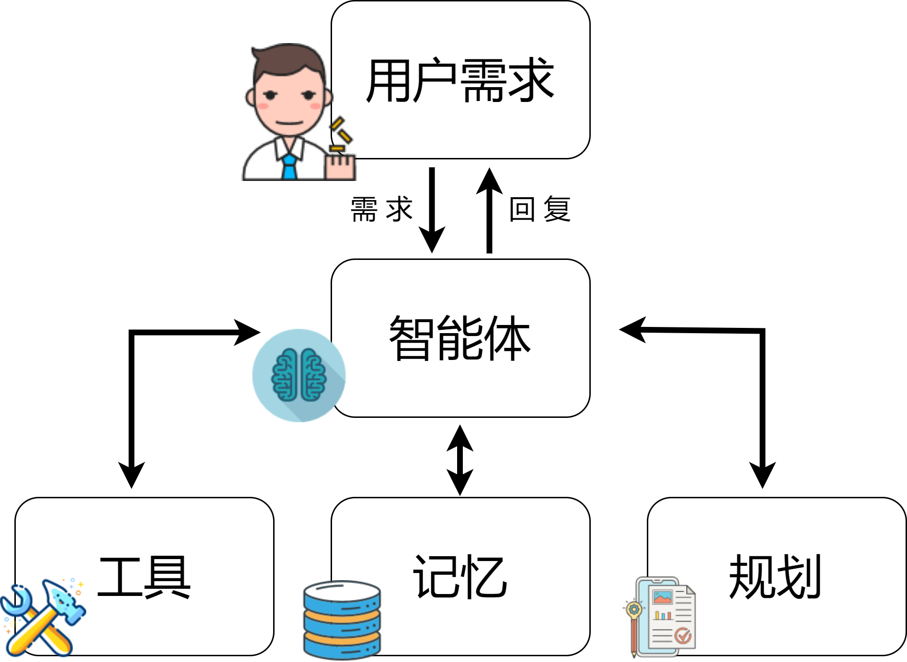
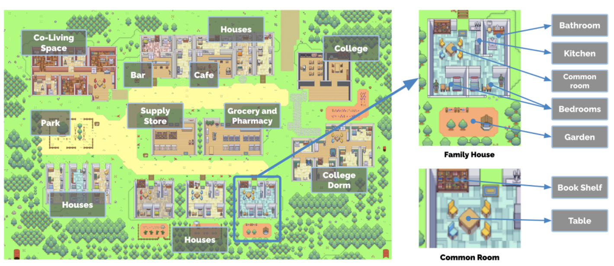
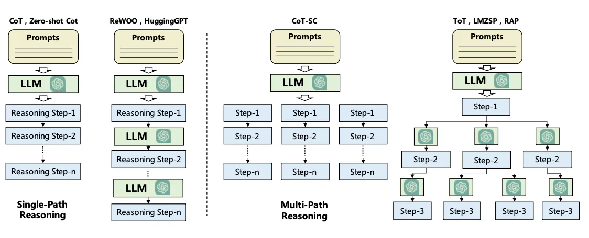
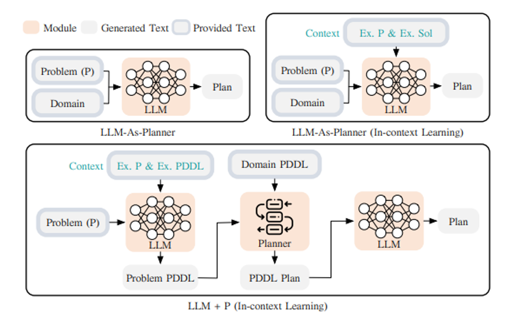
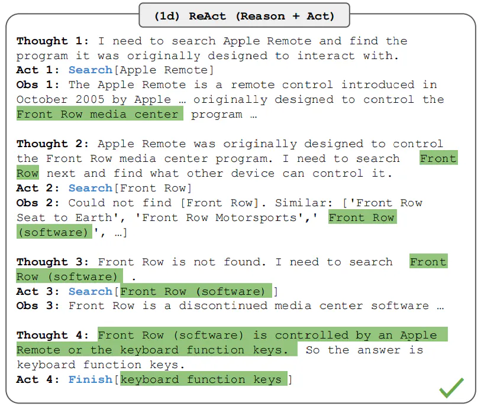
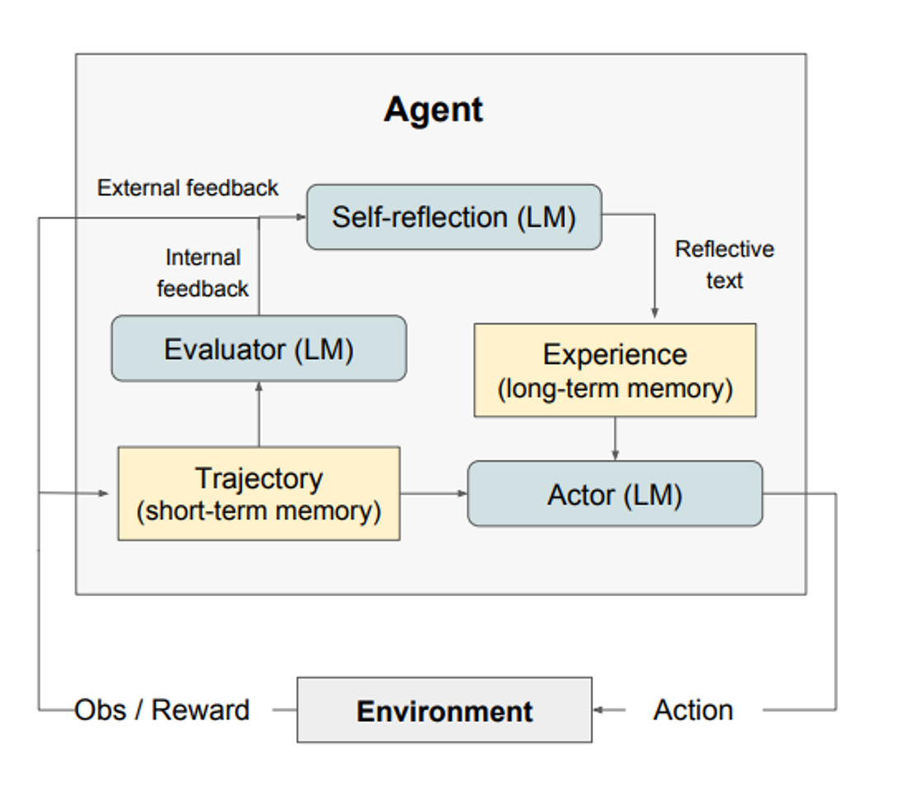
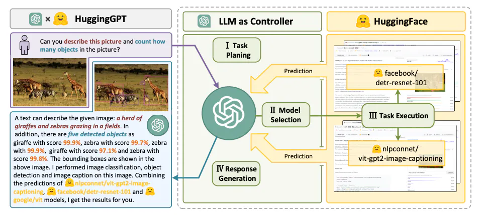

## Agents based on large models

# Introduction

In the history of technological development, humans have always hoped to pursue the realization of intelligence. This fantasy has long been in advance, such as Wall-E in "Wall-E", T-800 in "Terminator", and "Model" in "The Last Question". People try to create an agent or entity that can autonomously complete preset goals, namely, an agent (AI Agents or Agents) to assist humans in completing various tedious tasks. For many years, agents have attracted people to continue to study and explore as an active application field of artificial intelligence. Today, large language models are booming and changing with each passing day. In the implementation of agent technology, especially in the construction of agents based on large language models (LLMs), LLMs play a vital role in the intelligence of agents. These agents are able to perform complex tasks by integrating LLMs with planning, memory, and other key technical modules. In this framework, LLMs act as the core processing unit or "brain", responsible for managing and executing a series of operations required for specific tasks or responding to user queries.
To demonstrate the potential of LLM agents, let’s assume that we need to design a system to respond to the following query:
What is the most popular electric car brand in Europe at the moment?
This question can be answered directly by an LLM updated with the latest data. If the LLM lacks real-time data, a RAG (retrieval augmentation generation) system can be used, in which the LLM canto access the latest car sales data or market reports.
Now, let's consider a more complex query:
> What is the growth trend of the European electric vehicle market in the past decade, and what impact does this have on environmental policies? Can you provide a chart showing the market growth during this period?
> 
It is not enough to rely on LLM alone to answer such complex questions. Although the RAG system that combines LLM with external knowledge bases can provide some help, further operations are required to fully answer this question. This is because to answer this question, first, it needs to be broken down into multiple sub-questions, and then it needs to be solved through specific tools and processes to finally get the required answer. One possible solution is to develop an LLM agent that can access the latest environmental policy literature, market reports, and public databases to obtain information about the growth of the electric vehicle market and its environmental impact.
In addition, the LLM agent needs to be equipped with a "data analysis" tool, which can help the agent use the collected data to create intuitive charts to clearly show the growth trend of the European electric vehicle market in the past decade. Although the advanced capabilities of this agent are still idealistic, it involves several important technical considerations, such as planning for solution development and possible memory modules, which help the agent track the operation process, monitor and evaluate the overall progress status.

# LLM Agent Architecture

In general, the LLM-based agent framework includes the following core components:
- User request - User questionor request
- Agent/Brain - The core of the agent that acts as a coordinator
- Planning - Assists the agent in planning future actions
- Memory - Manages the agent's past behavior

## Agent

In building an agent system with a large language model (LLM) as the core, LLM is crucial, acting as the mastermind of the system and the core of multi-task coordination. This agent parses and executes instructions based on prompt templates, which not only guide the specific operations of the LLM, but also define the role and personality of the agent in detail, including background, personality, social environment and demographic information. This personalized description enables the agent to understand and perform tasks more accurately.
In order to optimize this process, system design needs to consider several key aspects:
- First, the system needs to have rich context understanding and continuous learning capabilities, not only processing and memorizing a large amount of interactive information, but also continuously optimizing execution strategies and prediction models.
- Second, introduce multimodal interaction, integrate multiple input and output forms such as text, images, and sounds, so that the system can handle complex tasks and environments more naturally and effectively. In addition, the dynamic role adaptation and personalized feedback of the agent are also the key to improving user experience and execution efficiency.
- Finally, strengthen security and reliability to ensure stable operation of the system and win user trust.
Integrating these elements, the LLM-based agent system can show higherefficiency and accuracy, while showing greater adaptability and sustainability in terms of user interaction and long-term system development. Such a system is not just a tool for executing commands, but an intelligent partner that can understand complex instructions, adapt to different scenarios, and continuously optimize its own behavior.

## Planning

### Planning without feedback

The planning module is the key to the agent's understanding of the problem and reliably finding a solution. It responds to user requests by breaking it down into necessary steps or subtasks. Popular techniques for task decomposition include Chain of Thoughts (COT) and Tree of Thoughts (TOT), which can be classified as single-path reasoning and multi-path reasoning, respectively.

First, we introduce the method of "Chain of Thoughts (COT)", which aims to handle problems by increasing the test time of computation by subdividing complex problems into a series of smaller and simpler tasks in steps. This not only makes large tasks manageable, but also helps us understand how the model solves the problem step by step.

Next, some researchers proposed the "Thinking Tree (TOT)" method based on this, which forms a tree structure diagram by exploring multiple possible paths at each decision step. This method allows different search strategies, such as breadth-first or depth-first search, and uses classifiers to evaluate the effectiveness of each possibility.

In order to perform task decomposition, it can be achieved through different approaches, including directly using LLM for simple prompts, usingInstructions for specific tasks, or combined with direct human input. These strategies can flexibly adjust the solution of the task according to different needs. Another approach is LLM combined with a classical planner (abbreviated as LLM+P), which relies on an external planner for long-term planning. This approach first converts the problem into PDDL format, then uses the planner to generate a solution, and finally converts the solution back to natural language. This is suitable for scenarios that require detailed long-term planning, although the reliance on domain-specific PDDL and planners may limit its scope of application.

These innovative methods not only demonstrate the diversity and flexibility of problem solving, but also provide us with a new perspective to deeply understand how LLM can handle complex tasks.
### Planning with feedback

The above planning module does not involve any feedback, which makes it challenging to achieve long-term planning for solving complex tasks. To address this challenge, a mechanism can be used to enable the model to repeatedly think about and refine the execution plan based on past actions and observations. The goal is to correct and improve past mistakes, which helps to improve the quality of the final result. This is especially important in complex real-world environments and tasks, where trial and error is key to completing the task. Two popular approaches to this kind of reflection or criticism mechanism include [ReAct](https://github.com/ysymyth/ReAct) and [Reflexion](https://github.com/ysymyth/ReAct).://github.com/noahshinn/reflexion).

[ReAct](https://github.com/ysymyth/ReAct) proposes to combine the ability of reasoning and execution in large-scale language models (LLMs) by combining discrete actions and language descriptions for specific tasks. Discrete actions allow LLMs to interact with their environment, such as using the Wikipedia search API, while the language description part facilitates LLMs to generate natural language-based reasoning paths. This strategy not only improves the ability of LLMs to handle complex problems, but also enhances the adaptability and flexibility of the model in real-world applications through direct interaction with the external environment. In addition, the natural language-based reasoning path increases the interpretability of the model's decision process, allowing users to better understand and verify model behavior. The design of ReAct also focuses on the transparency and controllability of model actions, aiming to ensure the safety and reliability of the model when executing tasks. Therefore, the development of ReAct provides a new perspective for the application of large-scale language models, and its method of combining reasoning and execution opens up new ways to solve complex problems.

[Reflexion](https://github.com/noahshinn/reflexion) is a framework that aims to improve the reasoning of intelligent agents by giving them dynamic memory and self-reflection capabilities.The method adopts a standard reinforcement learning (RL) setting, where the reward model provides a simple binary reward and the action space follows the setting in ReAct, which enhances the action space of a specific task through language to achieve complex reasoning steps. After each action is performed, the agent will calculate a heuristic evaluation and, based on the results of self-reflection, can optionally reset the environment to start a new attempt. The heuristic function is used to determine when a trajectory is inefficient or contains hallucinations and should be stopped. Inefficient planning refers to trajectories that are not successfully completed for a long time. Hallucinations are defined as encountering a series of consecutive identical actions that lead to the same results observed in the environment.

## Memory

The memory module is a key component of the agent's internal log storage, responsible for storing past thoughts, actions, observations, and interactions with users. It is essential for the agent's learning and decision-making process. According to the LLM agent literature, memory can be divided into two main types: short-term memory and long-term memory, as well as hybrid memory that combines these two memories to improve the agent's long-term reasoning ability and experience accumulation.

- Short-term memory - focuses on contextual information of the current situation, is short-lived and limited, and is usually implemented through learning limited by context windows.
- Long-term memory - stores the agent's historical behavior and thinking, implemented through external vector storage, so that important information can be retrieved quickly.
- Hybrid memory - uses the wholeCombining short-term and long-term memory not only optimizes the agent's understanding of the current situation, but also strengthens the use of past experience, thereby improving its ability to reason and accumulate experience in the long term.
-
When designing the agent's memory module, it is necessary to choose the appropriate memory format, such as natural language, embedded vectors, databases, or structured lists, according to the task requirements. These different formats have a direct impact on the agent's information processing capabilities and task execution efficiency.

## Tools

Tools enable large language models (LLMs) to obtain information or complete subtasks through external environments such as Wikipedia search APIs, code interpreters, and mathematical engines. This includes the use of databases, knowledge bases, and other external models, which greatly expands the capabilities of LLMs. In our initial query related to car sales, the realization of intuitive diagrams through code is an example of using tools, which executes code and generates the necessary diagram information requested by the user.

LLMs utilize tools in different ways:

- [MRKL](https://arxiv.org/abs/2205.00445): is an architecture for autonomous agents. The MRKL system is designed to consist of a series of "expert" modules, with a general large language model (LLM) acting as a router to direct queries to the most appropriate expert module. These modules can be either large or symbolic (e.g., math calculators, currency converters, weather APIs). They tested the LLM using arithmetic as a test case.Fine-tuning experiments on calling calculators. Experiments show that solving verbal math problems is more difficult than solving explicitly stated math problems because a large language model (7B Jurassic1-large model) fails to reliably extract the correct arguments required for basic arithmetic operations. The results emphasize that when external symbolic tools can work reliably, it is critical to know when and how to use these tools, which is determined by the power of LLM.
- [Toolformer](https://arxiv.org/abs/2302.04761): This academic work trains a large model to decide when to call which APIs, what arguments to pass, and how to best analyze the results. This process trains the large model through a fine-tuning method, requiring only a few examples per API. The work integrates a range of tools, including calculators, question-answering systems, search engines, translation systems, and calendars. Toolformer achieves significantly improved zero-shot performance on a variety of downstream tasks, often competing with larger models without sacrificing its core language modeling capabilities.
- Function Calling: This is also a strategy to enhance the use of large language model (LLM) tools, which enables the model to call external functions or services when processing text tasks by defining a series of tool APIs and providing these APIs to the model as part of the request.The method not only extends the capabilities of LLM to enable it to handle tasks beyond the scope of its training data, but also improves the accuracy and efficiency of task execution.
- [HuggingGPT](https://github.com/microsoft/JARVIS) : It is driven by a large language model (LLM) and is designed to autonomously handle a range of complex artificial intelligence tasks. HuggingGPT combines the capabilities of LLM and the resources of the machine learning community, such as the combination of ChatGPT and Hugging Face, to enable it to handle inputs from different modalities. Specifically, LLM plays the role of the brain here, on the one hand, breaking down tasks according to user requests, and on the other hand, selecting suitable models to perform tasks based on model descriptions. By executing these models and integrating the results into planned tasks, HuggingGPT can autonomously complete complex user requests. This process shows the complete flow from task planning to model selection, to task execution, and finally to response generation. First, HuggingGPT uses ChatGPT to analyze user requests to understand their intent and break them down into possible solutions. Next, it selects expert models hosted on Hugging Face that are most suitable for performing these tasks. Each selected model is called and executed, and its results are fed back to ChatGPT. Finally, ChatGPT integrates the prediction results of all models, and generate responses for users. This way of working of HuggingGPT not only expands the capabilities of traditional single-mode processing, but also provides efficient and accurate solutions in cross-domain tasks through its intelligent model selection and task execution mechanism.

The combination of these strategies and tools not only enhances the ability of LLM to interact with the external environment, but also provides strong support for handling more complex and cross-domain tasks, opening a new chapter in the capabilities of intelligent agents.
# Challenges of Agents:

Building intelligent agents based on large language models (LLMs) is an emerging field that faces many challenges and limitations. Here are several major challenges and possible solutions:

- Role adaptability problem: The intelligent agent needs to work effectively in a specific domain. For roles that are difficult to represent or transfer, performance can be improved by fine-tuning the LLM in a targeted manner. This includes the ability to represent uncommon roles or psychological characteristics.
- Context length limitation: The limited context length limits the capabilities of LLM, although vector storage and retrieval provide the possibility of accessing a larger knowledge base. System design needs to be innovative to operate effectively within limited communication bandwidth.
- Robustness of prompts: The prompts of the agent need to be robust enough to prevent small changes from causing reliability problems. Possible solutions include automatically optimizing and adjusting prompts or using LLM to automatically generate prompts.
- Control of knowledge boundaries: Control the internal knowledge of LLM to avoidIntroducing bias or using knowledge that the user is unaware of is a challenge. This requires agents to be more transparent and controllable when processing information.
- Efficiency and cost issues: The efficiency and cost of LLM when processing a large number of requests are important considerations. Optimizing inference speed and cost efficiency is the key to improving the performance of multi-agent systems.

In general, building agents based on LLM is a complex and multifaceted challenge that requires innovation and optimization in many aspects. Continuous research and technological development are essential to overcome these challenges.