# Introduction

In the field of AI, the development of large models is pushing the boundaries of technology at an unprecedented speed.
Just now, Meta officially announced Llama-3 on its official website. As the third generation model after Llama-1, Llama-2 and Code-Llama, Llama 3 has achieved comprehensive leadership in multiple benchmarks and outperformed the most advanced models of its kind in the industry.
Looking at the Llama series of models, from version 1 to 3, it shows the evolution of large-scale pre-trained language models and their significant potential in practical applications. These models not only continue to break records in technology, but also have a profound impact in business and academia. Therefore, a systematic comparison between different versions of the Llama model can not only reveal the specific details of technological progress, but also help us understand how these advanced models solve complex problems in the real world.

This article will detail the evolution of the Llama open source family, including:
- Llama evolution history (Section 1)
- Model architecture (Section 2)
- Training data (Section 3)
- Training methods (Section 4)
- Effect comparison (Section 5)
- Community ecology (Section 6)
- Summary (Section 7)

# 1. Llama evolution history
This section will briefly introduce each version of the Llama model, including their release time and main features.

## 1.1 Llama-1 series
Llama-1 [1] is a major release of Meta in February 2023.The language model was one of the open source models with excellent performance at the time. There are four parameter versions: 7B, 13B, 30B and 65B.
Each parameter version of Llama-1 was pre-trained on a corpus of more than 1T tokens. Among them, the largest model with 65B parameters was trained on 2,048 A100 80G GPUs for nearly 21 days and surpassed GPT-3 with 175B parameters in most benchmarks.

Due to the open source model and excellent performance, Llama quickly became one of the most popular large models in the open source community, and the ecosystem with Llama as the core also emerged. We will introduce this ecosystem in detail in Section 6.
At the same time, many researchers used it as a base model and continued to pre-train or fine-tune it, deriving many variant models (see the figure below), which greatly promoted the research progress in the field of large models.

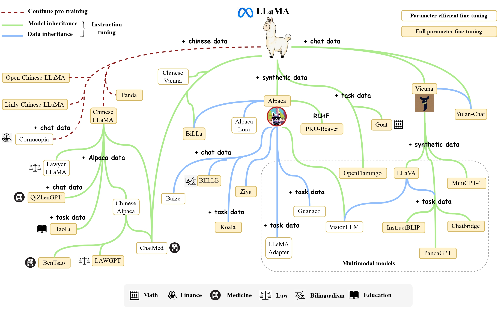

The only drawback is that due to the open source agreement, Llama-1 cannot be used for free commercial purposes.

## 1.2 Llama-2 series
Five months later, Meta released the free commercial version Llama-2 [2] in July 2023. There are four parameter size versions: 7B, 13B, 34B, and 70B. Except for the 34B model, all others have been open source.

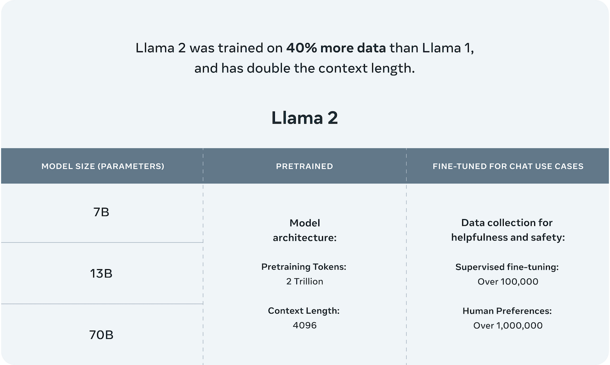

Compared to Llama-1, Llama-2 expands the pre-trained corpus to 2T tokens, doubles the model context length from 2,048 to 4,096, and introduces technologies such as Multi-Query Attention (MQA).

With the more powerful base model Llama-2, Meta iteratively optimizes the model through further technologies such as Supervised Fine-Tuning (SFT) and Reinforcement Learning with Human Feedback (RLHF), and releases the fine-tuning series model Llama-2 Chat for conversational applications.

Through the training process of "pre-training-supervised fine-tuning-reinforcement learning with human feedback", Llama-2 Chat not only achieves better model performance in many benchmarks, but is also safer in applications.

Later, thanks to the excellent performance of Llama-2, Meta released Code-Llama, which focuses on code generation, in August 2023. There are four parameter size versions: 7B, 13B, 34B, and 70B.

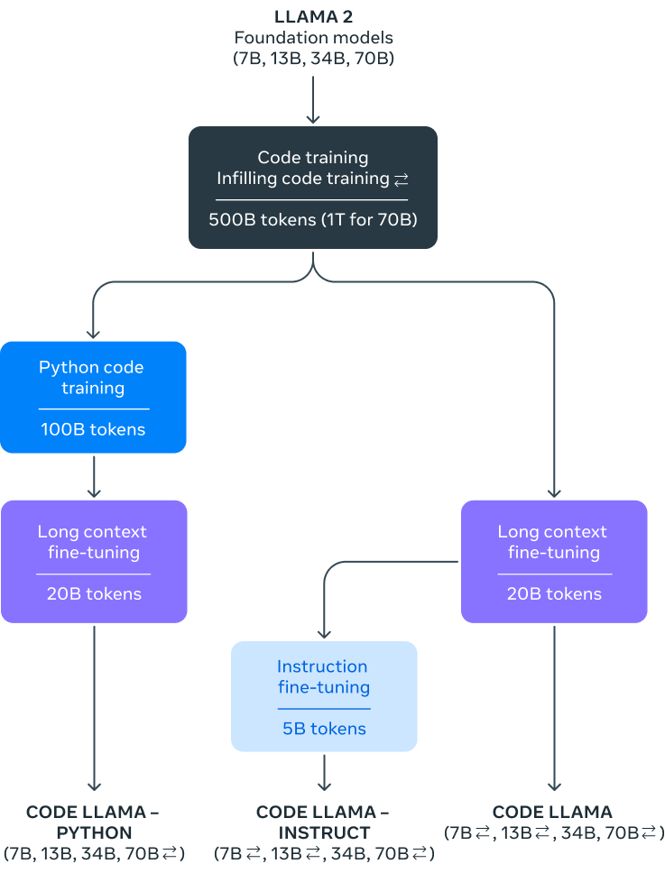

## 1.3 Llama-3 series
In April 2024, MetaThe open source large model Llama-3 was officially released, including two parameter versions of 8B and 70B. In addition, Meta also revealed that the 400B Llama-3 is still in training.

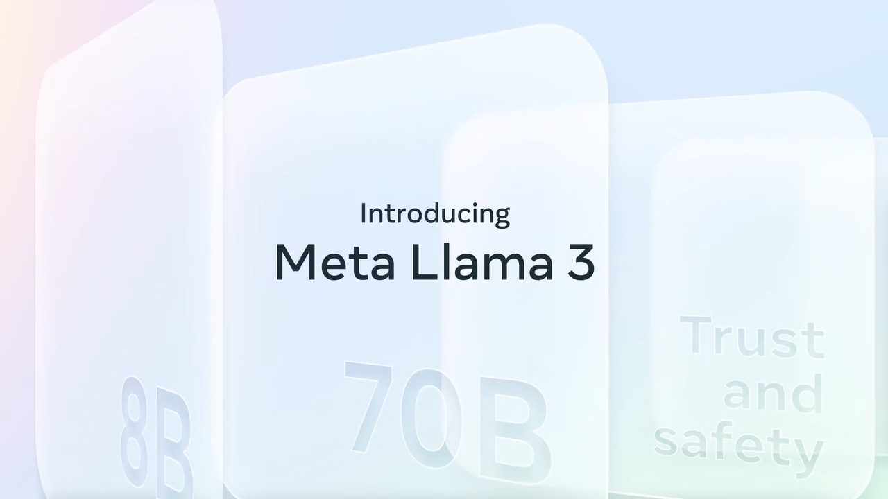

Compared with Llama-2, Llama-3 supports 8K long texts and uses a tokenizer with higher encoding efficiency, with a vocabulary size of 128K. In terms of pre-training data, Llama-3 uses a corpus of more than 15T tokens, which is more than 7 times that of Llama 2.

Llama-3 has made a huge leap in performance and achieved the best performance among large models of the same scale.

In addition, the capabilities of reasoning, code generation, and instruction following have been greatly improved, making Llama 3 more controllable.

# 2. Model architecture
This section will describe the model architecture of Llama in detail, including the size of the neural network, the number of layers, the attention mechanism, etc.

At present, the mainstream large language models all use the Transformer[3] architecture, which is a neural network model based on multi-layer self-attention.

The original Transformer consists of two parts: an encoder and a decoder. At the same time, these two parts can also be used independently.

For example, the BERT[4] model based on the encoder and the decoder based on the decoder.The GPT [5] model of the encoder is similar to the Llama model, which also uses a decoder-based architecture. Based on the original Transformer decoder, Llama makes the following changes:

- To enhance training stability, the pre-RMSNorm [6] is used as the layer normalization method.

- To improve model performance, SwiGLU [7] is used as the activation function.

- To better model long sequence data, RoPE [8] is used as the position encoding.

- To balance efficiency and performance, some models use the Grouped-Query Attention (GQA) mechanism [9].

Specifically, the input token sequence is first converted into a word vector sequence through the word embedding matrix. Then, the word vector sequence is used as the hidden layer state and passes through 𝐿 decoder layers in turn, and is normalized using RMSNorm at the end. The normalized hidden layer state will be used as the final output.

In each decoder layer, the input hidden layer state is first normalized by RMSNorm and then sent to the attention module. The output of the attention module will be residually connected to the hidden layer state before normalization. After that, the new hidden layer state is normalized by RMS Norm and then sent to the feedforward network layer. Similarly, the output of the feedforward network layer is also residually connected as the output of the decoder layer.

EachEach version of Llama has different variants due to the size and number of hidden layers. Next, we will expand and look at the different variants of each version.
## 2.1 Llama-1 series

Llama-1 model architecture, see [MODEL_CARD](https://github.com/meta-llama/llama/blob/main/MODEL_CARD.md) for details: 

[Image]

In order to better encode the data, Llama-1 uses the BPE [10] algorithm for word segmentation, which is implemented by sentencepiece. It is worth noting that Llama-1 decomposes all numbers into individual numbers and decomposes unknown UTF-8 characters back to bytes. The vocabulary size is 32k.

## 2.2 Llama-2 series

Llama-2 model architecture, see MODEL_CARD (same as above)

[Image]

Llama-2 uses the same model architecture and tokenizer as Llama-1. Unlike Llama-1, Llama-2 extends the context length to 4k.

## 2.3 Llama-3 series

For details about the Llama-3 model architecture, see [MODEL_CARD](https://github.com/meta-llama/llama3/blob/main/MODEL_CARD.md):

[Image]

Compared with Llama 2, Llama-3 changed the tokenizer from sentencepiece to tiktoken, which is consistent with GPT4. At the same time, the vocabulary size was expanded from 32k to 128k. In addition, in order to improve model efficiency, Llama-3 8B and 70B both use GQA. At the same time, the context length is also expanded to 8k.

# 3. Training data
This section will briefly introduce the training data of each version, including data source, scale and processing method.

## 3.1 Llama-1 series
Llama-1 uses a large amount of unlabeled data for self-supervised learning. These pre-training data are mixed from multiple sources and are all public data. The data volume and sampling ratio of each source are shown in the table below.

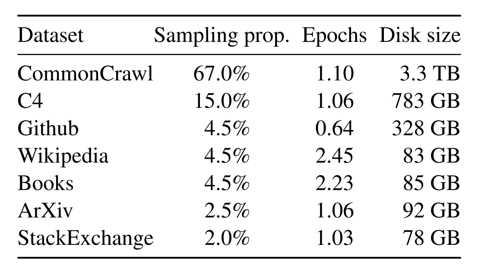

- English CommonCrawl: Llama-1 preprocesses five CommonCrawl datasets from 2017 to 2020. The process deduplicates at the row level, uses a fastText linear classifier for language identification to remove non-English pages, and uses an n-gram language model to filter low-quality content. In addition, Llama-1 trains a linear model to classify pages used as references in Wikipedia and randomly sampledpages, and discarded pages that were not classified as references.
- C4: In exploratory experiments, Llama-1 observed that using a diverse preprocessed CommonCrawl dataset could improve performance. Therefore, Llama-1 included the publicly available C4 dataset in its data. C4 preprocessing also includes deduplication and language identification steps: the main difference from CCNet is the quality filtering, which mainly relies on heuristic rules such as the presence of punctuation or the number of words and sentences in a web page.
- Github: Llama-1 uses the publicly available GitHub dataset on Google BigQuery. Llama-1 only retains projects distributed under Apache, BSD, and MIT licenses. In addition, Llama-1 uses heuristic rules based on line length or alphanumeric character ratio to filter low-quality files, and regular expressions to remove boilerplate content such as headers. Finally, Llama-1 deduplicates the resulting dataset at the file level, matching exactly identical content.
- Wikipedia: Llama-1 adds Wikipedia data from June to August 2022, covering 20 languages ​​using Latin or Cyrillic scripts. Llama-1 processes the data to remove hyperlinks, comments, and other formatting boilerplate content.
- Gutenberg and Books3: Llama-1 includes two book corpora in its training dataset: Project Gutenberg (which contains public domaindomain) and the Books3 section of ThePile, a publicly available dataset for training large language models. Llama-1 performs deduplication at the book level, removing books with more than 90% content overlap.
- ArXiv : Llama-1 processes ArXiv's Latex files to add scientific data to the Llama-1 dataset. Llama-1 removes everything before the first section and the references section. Llama-1 also removes comments in .tex files and expands user-written definitions and macros inline to increase consistency across papers.
- Stack Exchange : Llama-1 includes a data dump of Stack Exchange, a website with high-quality questions and answers covering a variety of fields from computer science to chemistry. Llama-1 retains data from the 28 largest websites, removes HTML tags from the text, and sorts the answers by score (highest to lowest).

After the above processing, the entire training dataset of Llama-1 contains about 1.4T tokens. For most of the training data for Llama-1, each token was used only once during training, but the Wikipedia and Books data were trained for about two epochs.

## 3.2 Llama-2

Llama-2 pre-training used 2T data tokens from publicly available sources(The specific open source data was not specified). Llama-2-Chat was additionally fine-tuned on 27,540 prompt-response pairs created for this project, outperforming a larger but lower-quality third-party dataset. To achieve AI alignment, a combination of 1,418,091 Meta examples and seven smaller datasets was used, using reinforcement learning with human feedback (RLHF). In Meta examples, the average conversation depth was 3.9, the Anthropic Helpful and Anthropic Harmless collections were 3.0, and the average conversation depth for the other five collections, including OpenAI Summarize, StackExchange, etc., was 1.0. The fine-tuning data includes publicly available instruction datasets and more than one million new human-annotated examples. 

During the pre-training process, Llama-2 took comprehensive considerations for the security of the data. By analyzing the pre-training data, Llama-2 was able to increase transparency and discover potential sources of problems, such as potential bias. Llama-2 took a number of measures, including following Meta's privacy and legal review process and excluding data from websites known to contain large amounts of personal information. In addition, Llama-2 does not perform additional filtering on the dataset to make the model more broadly usable across a variety of tasks while avoiding the unintended elimination of demographics that could result from over-cleaning.Llama-2 uses tools and datasets to understand the characteristics of pre-training data and provide guidance for the security adjustment of the model. This process ensures that our model is fully considered in terms of security and prompts us to make important security adjustments before deploying the model. 

Llama 2's pre-training focuses on English data. Although experimental observations show that the model has a certain proficiency in other languages, its proficiency is limited by the limited amount of pre-training data for non-English languages ​​(as shown in the figure below). Therefore, the performance of the model in non-English languages ​​is still fragile and should be used with caution (indicating poor multilingual ability: it may be caused by a small vocabulary).

[Image]

The pre-training data is as of September 2022, but some adjustment data is newer, until July 2023.

In the technical report released by Llama2, it is stated:

> We will continue to work hard to fine-tune the model to improve its applicability in other language environments and release updated versions in the future to address this issue.

The current Llama-3 not only expands the vocabulary size but also adds multilingual training corpus. This fulfills the promise of Llama2 in the technical report and achieves significantly improved performance in the currently published multilingual tasks. 

## 3.3 Llama-3 series

In order to better train Llama-3, the researchers carefully designed the pre-training corpus, which not only focuses on quantity, but also emphasizes quality.The amount of training data for LLAMA-3 has increased significantly, from 2T Tokens in LLAMA-2 to 15T Tokens, an increase of about 8 times. Among them, the code data has expanded by 4 times, significantly improving the model's performance in code ability and logical reasoning ability.

LLAMA-3 provides three sizes of model versions: the small model has 8B parameters, and its performance is slightly better than Mistral 7B and Gemma 7B; the medium model has 70B parameters, and its performance is between ChatGPT 3.5 and GPT 4; the large model has a scale of 400B and is still being trained. It aims to become a multimodal, multilingual version of the model, and the expected performance should be comparable to GPT 4 or GPT 4V.

It is worth noting that LLAMA-3 does not use the MOE (Mixture of Experts) structure, which is mainly used to reduce training and reasoning costs, but its performance is usually not comparable to that of dense models of the same size. As the model scale increases, how to reduce the reasoning cost will become an issue that needs attention.

In addition, LLAMA-3's training data includes a large number of code tokens and more than 5% non-English tokens from more than 30 languages. This not only makes the model more efficient when processing English content, but also significantly improves its multilingual processing capabilities, which shows the adaptability and application potential of LLAMA-3 in a global multilingual environment.To ensure data quality, Meta developed a series of data filtering pipelines, including heuristic filters, NSFW filters, semantic deduplication technology, and text classifiers for predicting data quality. The effectiveness of these tools is due to the performance of previous versions of Llama, especially in identifying high-quality data.

In addition, Meta evaluated the best strategy for mixing data from different sources in the final pre-training dataset through a large number of experiments to ensure that Llama-3 can show excellent performance in a variety of scenarios, such as daily chores, STEM fields, programming, and historical knowledge.

# 4. Training Methods
This section will briefly introduce the training methods of each version, including pre-training, supervised fine-tuning, and reinforcement learning based on human feedback.

## 4.1 Llama-1 Series

The Llama-1 model is a basic self-supervised learning model that has not undergone any form of task-specific fine-tuning. Self-supervised learning is a machine learning technique in which a model predicts some part of its input data by analyzing a large amount of unlabeled data. This method allows the model to automatically learn the inherent structure and complexity of the data without human-annotated data. Llama-1 describes in detail the specific training configuration of the machine learning model using the AdamW optimizer in the published technical report. AdamW is an improvement on the Adam optimizer that can handle weight decay more effectively, thereby improving the stability of training. The choice of β1 and β2 parameters affects the trainingThe convergence behavior and stability of the training process. The cosine learning rate schedule described in Llama-1 is an effective technique for adjusting the learning rate during training, which can lead to better convergence in some cases by gradually reducing the learning rate. Implementing a weight decay of 0.1 and a gradient clipping of 1.0 is a standard practice to prevent overfitting and ensure numerical stability. Using a warm-up step is a strategic approach to stabilize the training dynamics early in the training process. Adjusting the learning rate and batch size based on the model size is a practical approach to optimize resource allocation and efficiency, which may improve model performance.

Llama-1 also demonstrates a series of optimization measures for large-scale language model training. By using an efficient implementation of causal multi-head attention from the xformers library [12] (which is achieved by not storing attention weights and not computing key/query scores that are masked due to the causal nature of the language modeling task), memory usage and computation time are reduced, showing a focus on efficiency when processing large amounts of data. In addition, manually implementing the backpropagation function instead of relying on the automatic differentiation system and using checkpointing techniques to save computationally expensive activations are effective strategies to increase training speed and reduce resource consumption. The training process is further improved in efficiency through model and sequence parallelism and optimized communication between GPUs. These optimizations are particularly suitable for training models with large parameters, such as the 65 billion parameter model, which can significantly reducetraining time and improve overall computing efficiency. Overall, these optimization techniques reflect the in-depth consideration of resource management and efficiency optimization in the field of high-performance computing, which is of great significance for promoting the development of large-scale language models.

## 4.2 Llama-2 series

The Llama-2 model is a further development of Llama-1, while the Llama-2-Chat model is a fine-tuned version of Llama-2. The two models maintain a fixed 4k context length, which is different from the context length that OpenAI's GPT-4 may increase during fine-tuning.

In the fine-tuning of Llama-2 and Llama-2-Chat, an autoregressive loss function is used, which is a common method in generative models. The model takes into account all previous tokens when predicting the next token. During training, the token loss of the user input prompt is cleared, which means that the model is trained to ignore these specific tokens and focus more on generating replies.

The training process of Llama-2-Chat is shown in the figure below. The whole process starts with pre-training Llama-2 using public data. After this, an initial version of Llama-2-Chat was created through supervised fine-tuning. Subsequently, the model was iteratively improved using reinforcement learning based on human feedback (RLHF) methods, including rejection sampling and nearProximal Policy Optimization (PPO). During the RLHF phase, human preference data is also iterated in parallel to keep the reward model updated.

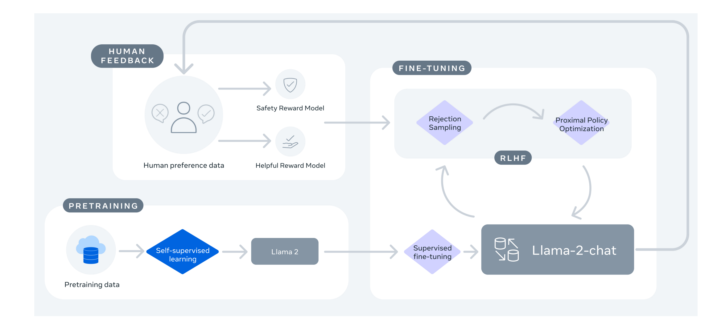

## 4.3 Llama-3 series

Similar to Llama-2, the Llama-3 series also has two models - the pre-trained model Llama-3 and the fine-tuned model Llama-3-Instruct.

During the pre-training phase, in order to effectively utilize the pre-training data, Llama-3 has invested a lot of effort in expanding pre-training. Specifically, by formulating a series of scaling laws for downstream benchmarks, the performance of the model on key tasks can be predicted before training, and the best data combination can be selected.

In this process, Llama-3 has made some new observations on the scaling laws. For example, according to the Chinchilla [11] scaling rule proposed by the DeepMind team, the optimal amount of training data for the 8B model is about 200B tokens, but experiments have found that even after training on two orders of magnitude more data, the model performance continues to improve. After training on up to 15T tokens, both the 8B and 70B parameter models continue to improve performance in a log-linear manner.

In order to train the largest LFor the lama-3 model, Meta combined three parallel strategies: data parallelism, model parallelism, and pipeline parallelism. When trained on 16K GPUs simultaneously, the most efficient strategy achieved a computational utilization of more than 400 TFLOPS per GPU. Finally, the model was trained on two custom 24K GPU clusters.

To maximize GPU uptime, Meta developed an advanced new training stack that automatically detects, handles, and maintains errors. In addition, hardware reliability and silent data corruption detection mechanisms have been greatly improved, and a new scalable storage system has been developed to reduce the overhead of checkpoints and rollbacks. These improvements have increased the total effective training time by more than 95%. Combined, these improvements make Llama-3's training efficiency about three times higher than Llama-2.

In the fine-tuning stage, Meta made significant innovations in the fine-tuning methods of the model, combining supervised fine-tuning (Supervised Fine-Tuning, SFT), rejection sampling, proximal policy optimization (Proximal Policy Optimization, PPO), and direct policy optimization (Direct Policy Optimization, DPO). This comprehensive approach optimizes the model’s performance when performing complex reasoning and encoding tasks. In particular, through preference ranking training, Llama-3 can more accurately handle complex logical reasoning problems.Choosing the most appropriate answer is crucial to improving the usability and reliability of AI in practical applications.

# 5. Comparison of results
This section compares the performance differences of different versions in many benchmarks.

## 5.1 Llama-2 vs Llama-1

Meta official data shows that Llama-2 outperforms Llama-1 and other open source language models in many benchmarks.

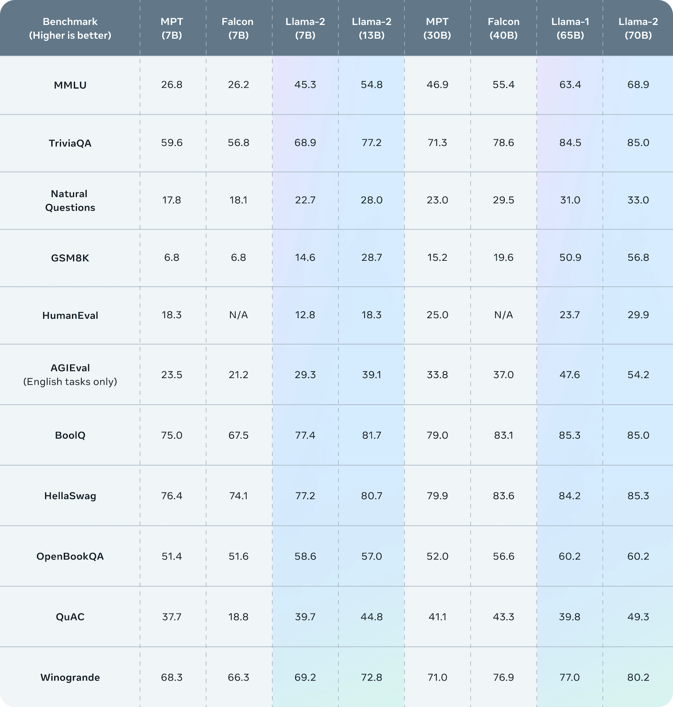

## 5.2 Llama-3 vs Llama-2

Meta official data shows that Llama-3 8B and 70B versions have achieved good results in their respective parameter scales. The 8B model outperforms Gemma 7B and Mistral 7B Instruct in many benchmarks, while the 70B model surpasses the closed source model Claude 3 Sonnet, and is comparable to Google's Gemini Pro 1.5.

Meanwhile, during the development of Llama-3, Meta also developed a high-quality human evaluation set containing 1,800 prompts.
The evaluation results show that Llama 3 not only surpasses Llama 2 by a large margin, but also beats Claude 3 Sonnet, MistralMedium and GPT-3.5.

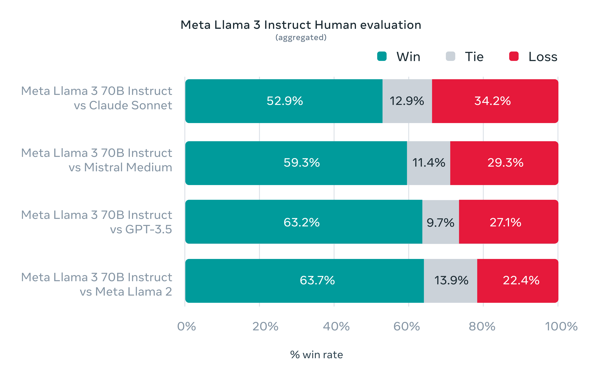

Llama-3 can achieve such outstanding results, which is inseparable from the excellent performance of its pre-trained model.
In many benchmarks, the 8B model surpassed Mistral 7B and Gemma 7B, and the 70B model defeated Gemini Pro 1.0 and Mixtral 8x22B.

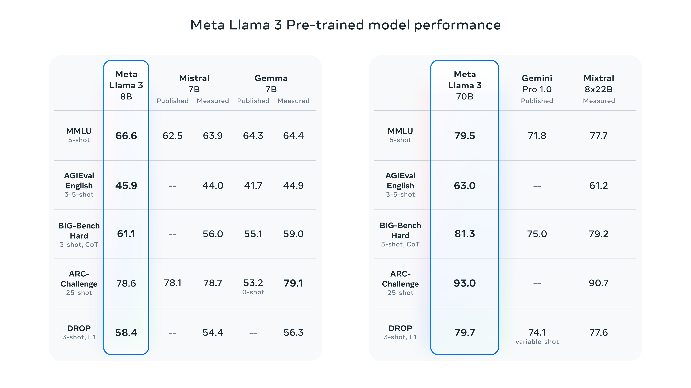

In addition, Meta said that the largest Llama-3 is still in training, with more than 400B parameters, and has achieved excellent results in multiple benchmarks.
Once the training is completed, Meta will publish a detailed research paper.

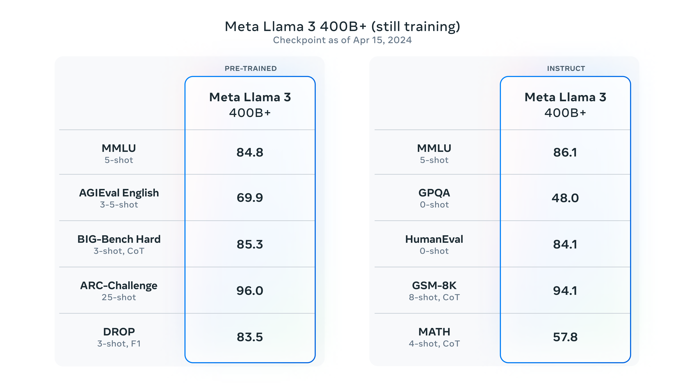

It is worth noting that according to the compilation of NVIDIA scientist Jim Fan, Llama3 400B is basically close to Claude-3-Opus and GPT-4-turbo, which means that the open source community is about to usher in a GPT-4-level large model.

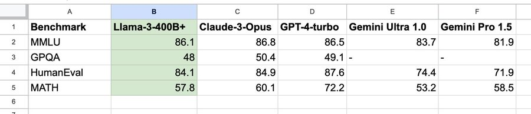

# 6. Community Impact
This section will briefly introduce the impact of the Llama model on the open source community.

##6.1 The power of open source models

Since Meta released the Llama model, it has had a profound impact on the global AI community. As an open source large language model (LLM), Llama not only provides a strong technical foundation, but also promotes the widespread adoption and innovation of AI technology worldwide.

The open source strategy of the Llama model is regarded as the "Android" of the LLM era, which means that it provides a modular and customizable platform that enables researchers and developers to adjust and optimize the model according to their needs. This openness greatly reduces the entry barrier, allowing small startups to large enterprises to take advantage of this technology. With the release of Llama 3 on April 19, the number of downloads in one day has exceeded 1.14k, and the two 8B models are ranked first in trending.

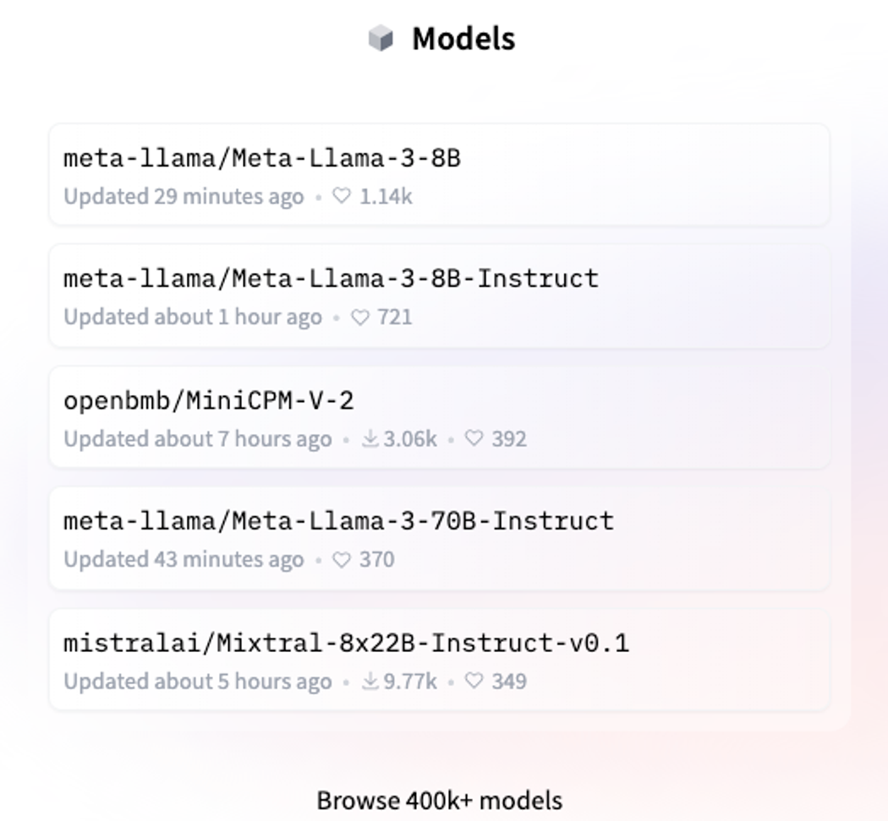

## 6.2 Impact on global AI R&D

After OpenAI turned to a more closed business model, the release of Llama provides a reliable option for teams and individuals conducting AI project research and development around the world. This open source model ensures that users do not have to rely entirely on a single commercial API, thereby increasing the operational security and freedom of the enterprise, especially in terms of data security and cost control.

## 6.3 Technological progress and community innovation

Technically, the Llama model has demonstrated performance comparable to GPT, which provesThe open source community's ability to promote cutting-edge technology is clear. In addition, the community has developed applicable solutions in different vertical fields through continuous optimization and adjustment of the model, similar to community-driven large models such as Stable Diffusion and Midjourney.

##6.4 Ecosystem and Diversity

Llama's application has expanded to multiple platforms and devices, including mobile and edge devices. This diverse application not only promotes the popularization of technology, but also accelerates the innovation of new applications. For example, the active participation of cloud platforms such as AWS and Google Cloud proves the wide applicability and powerful functions of the Llama model.

##6.5 Future Outlook of the Llama Community

As the Llama model continues to develop and optimize, Meta emphasizes the continued focus on multimodal AI, security and responsibility, and community support. These directions are not only in line with the current trend of AI development, but also provide a clear roadmap for the future of the Llama community.

# 7. Summary

In summary, the release of the Llama model not only proves the importance of open source models in the global AI field, but also provides new perspectives and motivation for the future development direction of AI. Through continuous technological advancement and community-driven innovation, Llama is expected to continue to promote the widespread application and development of AI technology around the world.

References
[1] Touvron H, Lavril T, Izacard G, et al.l. Llama: Open and efficient foundation language models[J]. arXiv preprint arXiv:2302.13971, 2023.

[2] Touvron H, Martin L, Stone K, et al. Llama 2: Open foundation and fine-tuned chat models[J]. arXiv preprint arXiv:2307.09288, 2023.

[3] Vaswani A, Shazeer N, Parmar N, et al. Attention is all you need[J]. Advances in neural information processing systems, 2017, 30.

[4] Devlin J, Chang M W, Lee K, et al. Bert: Pre-training of deep bidirectional transformers for language understanding[J]. arXiv preprint arXiv:1810.04805, 2018.

[5] Radford A, Narasimhan K, Salimans T, et al. Improving language understanding by generative pre-training[J]. 2018.

[6] Zhang B, Sennrich R. Root mean square layer normalization[J]. Advances in Neural Information Processing Systems, 2019, 32.

[7] Shazeer N. Glu variants improve transformer[J]. arXiv preprint arXiv:2002.05202, 2020.

[8] Su J, Ahmed M, Lu Y, et al. Roformer: Enhanced transformer with rotary position embedding[J]. Neurocomputing, 2024, 568:127063.

[9] Ainslie J, Lee-Thorp J, de Jong M, et al. Gqa: Training generalized multi-query transformer models from multi-head checkpoints[J]. arXiv preprint arXiv:2305.13245, 2023.

[10] Sennrich R, Haddow B, Birch A. Neural machine translation of rare words with subword units[J]. arXiv preprint arXiv:1508.07909, 2015.

[11] Hoffmann J, Borgeaud S, Mensch A, et al. Training compute-optimal large language models[J]. arXiv preprint arXiv:2203.15556, 2022.

[12] https://github.com/facebookresearch/xformers