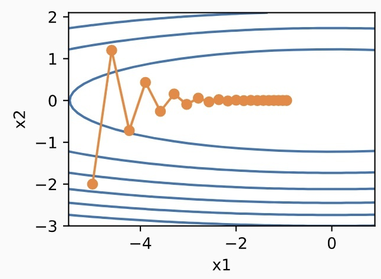
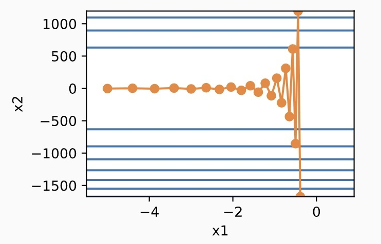

# Chapter 2 Overview of Optimization Algorithms

&emsp;&emsp;This section mainly introduces the basic analysis framework of gradient-based optimization algorithms and discusses how it is applied to deep learning.

## 2.1 Gradient descent

&emsp;&emsp;Suppose we now want to find the minimum value of a multivariate continuous function $f(w)$ $\displaystyle \min \limits_{w \in R^d}f(w)$, and its gradient descent algorithm is as follows:
$$
w_0 = \text{initialization} \\
w_{t+1} = w_t - \eta \nabla f(w_t)
$$
Where, $\eta$ is called the step size or learning rate.

&emsp;&emsp;A core idea of ​​the gradient descent algorithm is to find the local steepest gradient descent direction $-\nabla f(w_t)$.

&emsp;&emsp;Let's consider the Taylor expansion of this point:
$$
f(w) = f(w_t) + \underbrace {\left\langle \nabla f(w_t), w - w_t \right\rangle}_{\text{linear in } w} + \cdots
$$
&emsp;&emsp;Assume that the high-order terms are removed and the first-order approximation is optimized only in a neighborhood of $w_t$, that is
$$
\begin{array}{cl}
\mathop{\arg\min} \limits_{w \in R^d} & f(w_t) + \left\langle \nabla f(w_t), w - w_t \right\rangle \\
\text{s.t.} & \|w - w_t\|_2 \leqslant \epsilon
\end{array}
$$
The optimal solution is $w + \delta$, where $\delta = -\alpha \nabla f(w_t)$.

### 2.1.1 Formalization of Taylor expansion

&emsp;&emsp;We will now state a lemma that describes the decrease in the value of the function under the gradient descent algorithm. First, assume that the second-order gradient of the function $f(w)$ is bounded, that is, $\nabla^2 f(w) \in [-L, L], \forall w$. Functions that satisfy this condition are called L-smooth functions.

> Definition (L-smoothness). A function $f: R^n \rightarrow R$ called L-smooth if for all $x, y \in R^n$, the following inequality holds:
> $$
> \|\nabla f(x) - \nabla f(y)\| \leqslant L \|x - y \|.
> $$
> If the function $f$ is L-smooth, then for all $x, y \in R^n$
> $$
> f(y) \leqslant f(x) + \langle \nabla f(x), y - x \rangle + \frac{L}{2} \| y - x\|^2.
> $$
> Next, if $f$ is additionally convex and $x^*$ is its minimizer, then for all $x \in R^d$
> $$
> \| \nabla f(x)\|^2 \leqslant 2L (f(x) - f(x^*))
> $$

&emsp;&emsp;This allows us to use the above definition to obtain an exact approximation function using Taylor expansion:
$$
f(w)\leqslant f(w_t) + \langle \nabla f(w_t), w - w_t \rangle + \frac{L}{2} \| w - w_t\|^2_2
$$

### 2.1.2 Gradient Descent Lemma

&emsp;&emsp;It will be shown below that with gradient descent and a sufficiently small learning rate, the function value always decreases unless the gradient at the iteration is zero.

> Lemma (Descent Lemma). Suppose $f$ is L-smooth. Then, if $\eta < 1/(2L)$, we have 
> $$
> f(w_{t+1}) \leqslant f(w_t) - \frac{\eta}{2} \cdot \| \nabla f(w_t)\|^2_2
> $$

**Proof:**
$$
\begin{aligned}
f(w_{t+1}) 
& = f(w_t - \eta \nabla f(w_t)) \\
& \leqslant f(w_t) - \langle \nabla f(w_t), -\eta \nabla f(w_t) \rangle + \frac{L}{2}\| \eta^2 \nabla f(w_t)\|^2_2 \\
& = f(w_t) - (\eta - \eta^2 L / 2) \| \eta^2 \nabla f(w_t)\|^2_2 \\
& \leqslant \frac{\eta}{2} \cdot \| \eta^2 \nabla f(w_t)\|^2_2
\end{aligned}
$$

## 2.2 Stochastic gradient descent

&emsp;&emsp;In deep learning, the objective function is usually the average of the loss functions for each sample in the training dataset. Let $f_i(x)$ be the loss function for the training data sample with index $i$, $n$ be the number of training data samples, and $x$ be the parameter vector of the model. Then the objective function is defined as
$$
f(x) = \frac{1}{n} \sum_{i=1}^n f_i(x)
$$
&emsp;&emsp;The gradient of the objective function at $x$ is calculated as
$$
\nabla f(x) = \frac{1}{n} \sum_{i=1}^n \nabla f_i(x)
$$
&emsp;&emsp;If gradient descent is used,The computational cost of each independent variable iteration is $O(n)$, which grows linearly with $n$. Therefore, when the number of training data samples is large, the computational cost of each iteration of gradient descent is very high.

&emsp;&emsp;Stochastic gradient descent (SGD) reduces the computational cost of each iteration. In each iteration of stochastic gradient descent, a sample index $i \in \{1,2, \cdots, n\}$ is randomly and uniformly sampled, and the gradient $\nabla f_i(x)$ is calculated to iterate $x$:
$$
x \leftarrow x - \eta \nabla f_i(x) 
$$
&emsp;&emsp;Here $\eta$ is also the learning rate. As you can see, the computational cost of each iteration is reduced from $O(x)$ of gradient descent to a constant $O(1)$. It is worth emphasizing that the stochastic gradient $\nabla f_i(x)$ is an unbiased estimate of the gradient $\nabla f(x)$:
$$
E_i \nabla f_i(x) = \frac{1}{n} \sum_{i=1}^n \nabla f_i(x) = \nabla f(x)
$$
&emsp;&emsp;This means that the stochastic gradient is a good estimate of the gradient.Good estimate.

## 2.3 Accelerated Gradient Descent

&emsp;&emsp;Let's consider a two-dimensional vector $ x = [x_1, x_2]^T$ and a scalar objective function $f(x) = 0.1 x_1^2 + 2 x_2^2$ whose input and output are respectively.

&emsp;&emsp;It can be seen that at the same position, the absolute value of the slope of the objective function in the vertical direction ($x_2$ axis direction) is larger than that in the horizontal direction ($x_1$ axis direction). Therefore, when gradient descent iterates the independent variable, it will cause the independent variable to move more vertically than horizontally. Then, we need a smaller learning rate to prevent the independent variable from crossing the optimal solution of the objective function in the vertical direction. However, this will cause the independent variable to move slower towards the optimal solution in the horizontal direction. If the learning rate is adjusted a little larger, the independent variable will continue to cross the optimal solution in the vertical direction and gradually diverge.

&emsp;&emsp;The momentum method is proposed to solve the above problem of gradient descent. Suppose the independent variable of time step $t$ is $x_t$, and the learning rate is $\eta_t$. At time step0, the velocity variable is $v_0$, and its elements are initialized to 0. At time step $t > 0$, the steps of each iteration will be modified as follows:
$$
\begin{array}{lll}
v_t \leftarrow \gamma v_{t-1} + \eta_t g_t \\
x_t \leftarrow x_{t-1} - v_t
\end{array}
$$
&emsp;&emsp;Where the momentum hyperparameter $\gamma$ satisfies $0 \leqslant \gamma < 1$ . When $\gamma = 0$, the momentum method is equivalent to mini-batch stochastic gradient descent.

&emsp;&emsp;Exponentially weighted moving average: To understand the momentum method mathematically, let's first explain the exponentially weighted moving average. Given the hyperparameter $0 \leqslant \gamma < 1$ , the variable $y_t$ at the current time step $t$ is a linear combination of the variable $y_{t-1}$ at the previous time step $t-1$ and another variable $x_t$ at the current time step:
$$
y_t = \gamma y_{t-1} + (1 - \gamma) x_t$$
&emsp;&emsp;Expand $y_t$:
$$
\begin{aligned}
y_t
& = (1 - \gamma) x_t + \gamma y_{t-1} \\
& = (1 - \gamma) x_t + (1 - \gamma) \cdot \gamma x_{t-1} + \gamma^2 y_{t-2} \\
& = (1 - \gamma) x_t + (1 - \gamma) \cdot \gamma x_{t-1} + (1 - \gamma) \cdot \gamma^2 x_{t-2} + \gamma^3 y_{t-3} \\
& \cdots
\end{aligned}
$$
&emsp;&emsp;Let $n = 1/(1 - \gamma)$, then $(1 - 1/n)^n = \gamma^{1/(1 - \gamma)}$, because
$$
\lim _{n \rightarrow \infty} \left( 1 - \frac{1}{n} \right)^n = \exp (-1) \approx 0.3679
$$
&emsp;&emsp;So when $\gamma \rightarrow 1$, $\gamma^{1/ (1 - \gamma)} = \exp(-1)$, such as $0.95^{20} \approx \exp(-1)$. If $\exp(-1)$ is treated as a relatively small number, all terms containing $\gamma^{1 / (1 - \gamma)}$ and coefficients of higher order than $\gamma ^ {1 / (1 - \gamma)}$ can be ignored in the approximation. For example, when $\gamma = 0.95$,
$$
y_t \approx 0.05 \sum_{i=0}^{19} 0.95^i x_{t-i}
$$
&emsp;&emsp;Therefore, in practice, we often regard $y_t$ as the weighted average of the $x_t$ values ​​of the most recent $1 / (1 - \gamma)$ time steps. For example, when $\gamma = 0.95$, $y_t$ can be regarded as the weighted average of the $x_t$ values ​​of the most recent 20 time steps; when $\gamma = 0.9$, $y_t$ can be regarded as the weighted average of the $x_t$ values ​​of the most recent 10 time steps. Moreover, the closer the $x_t$ value is to the current time step $t$, the moreThe larger the weight obtained (the closer to 1).

&emsp;&emsp;Now, let's transform the velocity variable of the momentum method:
$$
v_t \leftarrow \gamma v_{t-1} + (1 - \gamma) \left( \frac{\eta_t}{1 - \gamma} g_t \right)
$$
&emsp;&emsp;From the form of exponentially weighted moving average, the velocity variable $v_t$ actually performs an exponentially weighted moving average on the sequence $\displaystyle \left\{ \frac{\eta_{t-i} g_{t-i}}{(1 - \gamma)}: i = 0, \cdots, \frac{1}{1-\gamma} -1 \right\}$. In other words, compared to mini-batch stochastic gradient descent, the momentum method updates the independent variable at each time step approximately by taking the exponentially weighted moving average of the updates of the most recent $1 / (1 - \gamma)$ time steps corresponding to the former and dividing it by $1 - \gamma$. Therefore, in the momentum method, the movement of the independent variable in each direction depends not only on the current gradient, but also on whether the past gradients are consistent in each direction.

## 2.4 Local running time analysis

&emsp;&emsp;When iteratingGradient descent behavior is more obvious when the algorithm approaches a local minimum, because the objective function can be locally approximated by a quadratic function. For simplicity, we assume that we are optimizing a convex quadratic function and understand how the curvature of the function affects the convergence of the algorithm.

&emsp;&emsp;We use gradient descent to optimize the following function:
$$
\min \limits_{w} \frac{1}{2} w^T A w
$$
where $w \in R^d$, $A \in R^{d \times d}$ is a semi-positive matrix.

**Note: **Assume $A$ is a diagonal matrix (diagonalization is a basic idea in linear algebra).

&emsp;&emsp;Assume that the SVD decomposition of $A$ is $A = U \Sigma U^T$, where $\Sigma$ is a diagonal matrix. We can easily verify that $w^T A w = \hat{w}^T \Sigma \hat{w}$, where $\hat{w} = U^T w$. In other words, we are dealing with a quadratic form with diagonal matrices $\Sigma$ as coefficients in a different coordinate system defined by $U$. Note that the diagonalization technique here is only used for analysis.

&emsp;&emsp;Thus, assuming $A = \text{diag} (\lambda_1, \lambda_2, \cdots, \lambda_d)$, where $\lambda_1 \geqslant \lambda_2 \geqslant \cdots \geqslant \lambda_d$, so that the function can be simplified to 
$$
f(w) = \frac{1}{2} \sum_{i=1}^d \lambda_i w_i^2
$$
The gradient descent update can be written as 
$$
x \leftarrow w - \eta \nabla f(w) = w - \eta \Sigma w
$$

## 2.5 Pre-conditioners

&emsp;&emsp;From the quadratic example above, we can see that this will be optimized if different learning rates are used in different coordinate systems. In other words, if a learning rate $\eta_i = 1/\lambda_i$ is introduced for each coordinate, faster convergence can be achieved.

&emsp;&emsp;In the general case where $A$ is not a diagonal matrix, and the coordinate system is unknown, the corresponding gradient descent update of the algorithm is $w \leftarrow w - A^{-1} \nabla f(w)$

&emsp;&emsp;In the more general case, $f$ is not a quadratic function, which corresponds to Newton's algorithm, and the gradient descent update is $w \leftarrow w - \nabla^2 f(w)^{-1} \nabla f(w)$ 

&emsp;&emsp;Since computing the `Hessian` matrix can be very difficult because it `scales quadratically in d` (in practice it can be over 1 million). Therefore, approximations of the `Hessian` function and its inverse are used.