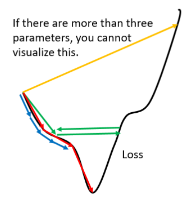
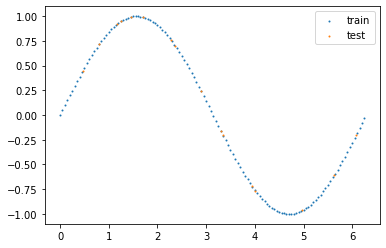
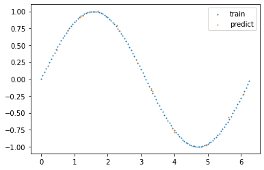

# Chapter 6 AdaGrad
## 6.1 vanilla gradient descent

&emsp;&emsp; Gradient descent is the most basic optimization algorithm, but it also has the following problems.
- If the learning rate is too small, the loss function will decrease too slowly and the number of iterations will be large. (blue line)
- If the learning rate is too large, the loss function will decrease quickly and it will easily oscillate near the local extreme point. (green line)
- If the learning rate is too large, it will directly cross the local optimal value. (yellow line)



&emsp;&emsp; For this reason, can we design an algorithm that will update the learning rate based on the gradient or the current cycle number? AdaGrad (Adaptive Subgradient Methods) is designed with this idea in mind.

&emsp;&emsp;Assume that the model parameters are $\theta$, $\theta^t$ represents the model parameters of the $t$th cycle, and the loss function is $f(\theta^t)$. The iteration format of AdaGrad is as follows:
$$
\begin{array}{lll}
\displaystyle \eta^t = \frac{\eta}{\sqrt{t+1}} \\
\displaystyle g^t =\frac{\partial f(\theta)}{\partial \theta}|_{\theta^t} \\
\displaystyle \sigma^t = \sqrt{\frac{1}{t+1}\sum_{i=1}^{t} g^i\odot g^i} \\ 
\displaystyle \theta^{t+1} =\theta^t - \frac{\eta^t}{\sigma^t}g^t=\theta^t - \frac{\eta}{\sqrt{\displaystyle \sum_{i=1}^{t} g^i\circ g^i}}g^t
\end{array}
$$

&emsp;&emsp;Where $\circ$ is the Hadamard product, which is used to multiply corresponding elements of two vectors. Since $g^i\circ g^i$ is still a vector, in fact, the components of the model parameter $\theta$ in the AdaGrad algorithm have their own learning rates. Next, we will prove the convergence of AdaGrad under the assumptions.

## 6.2 Convergence
&emsp;&emsp; In the application of machine learning algorithms, especially commercial projects, the sample size is often millions or even hundreds of millions, and these data cannot beSome models are put into the machine at one time, or some models are deployed online. The server will collect user data in real time and input it into the model. Due to time and space constraints, these data cannot be put into the memory at one time, so they can only be loaded in batches. The model is optimized according to each batch of data. This is online learning. 
&emsp;&emsp;Assume that $f_t(\theta)$ is the loss function of the $t$th batch, and there are a total of $T$ batches of data, then
$$
\displaystyle f(\theta) = \sum_{t=1}^T f_t(\theta)
$$

&emsp;&emsp; For this online algorithm, we prove its convergence from the perspective of `regret`.
### 6.2.1 Basic assumptions and parameter settings
&emsp;&emsp; For online learning, we pursue a `low regret`, defined as follows: 
$$
R(T) = \sum_{t=1}^T f_t(\theta^t)-\min_{\theta}\sum_{t=1}^T f_t(\theta)
$$

&emsp;&emsp;Where $f_t(\theta)$ is the `convex function`, $t$ represents the loss function at the $t$th cycle.

&emsp;&emsp; When $T \rightarrow \infty $, the average value of $R(T)$ is $\displaystyle \frac{R(T)}{T}\rightarrow 0 $, the algorithm converges, that is, $\displaystyle \theta^* = arg \min_{\theta} \sum_{t=1}^T f_t(\theta)$.

&emsp;&emsp;Before proving this, let us make some assumptions:

**Assumption 1**

&emsp;&emsp; Assume that $\theta\in \mathbb{R}^d$ is a model parameter and the feasible domain is bounded, that is, for the components $\forall \theta_i,\hat{\theta_i}$ in the vector $\theta$, there exists a constant $D_i>0$ such that the following holds
$$
|| \theta_i - \hat{\theta_i}|| \leqslant D_i
$$

**Assumption 2**

&emsp;&emsp; Assume that $\displaystyle g^t := \frac{\partial f_t}{\partial \theta} |_{\theta^t}$ (if $f_t$ is not differentiable, it can beUsing subgradients), there exists a constant $G_i >0$, for each component of the gradient $\forall t$ satisfies

$$
g_i^T \leq G_i
$$

### 6.2.2 Proof
&emsp;&emsp;Assume $\displaystyle \theta^* = arg \min_{\theta} \sum_{t=1}^T f_t(\theta)$,
$$
\begin{aligned}
R(T) 
&= \sum_{t=1}^T f_t(\theta^t)-\min_{\theta}\sum_{t=1}^T f_t(\theta) \\
&= \sum_{t=1}^T f_t(\theta^t)-\sum_{t=1}^T f_t(\theta^*) \\
&= \sum_{t=1}^T \{f_t(\theta^t) - f_t(\theta^*)\}
\end{aligned}
$$

&emsp;&emsp;Since $f_t(\theta)$ is a `convex` function, so
$$
f_t(\theta^*) \geqslant f_t(\theta^t) + <g^t,\theta^*- \theta^t>
$$

&emsp;&emsp;The above formula is the `First-order condition` of the `convex` function. For detailed definition and proof, please refer to Section 3.1.3 of [3].

&emsp;&emsp;Then, we can get
$$
<g^t, \theta^t - \theta^*> \geqslant f_t(\theta^t) - f_t(\theta^*)
$$

&emsp;&emsp;Substituting into $R(T)$, we get
$$
R(T) \leqslant \sum_{t=1}^T <g^t,\theta^t -\theta^*>
$$

&emsp;&emsp;At the same time
$$
\begin{aligned}
\sum_{t=1}^T <g^t,\theta^t -\theta^*> 
&= \sum_{t=1}^T \sum_{i=1}^d g^t_i(\theta^t_i -\theta^*_i) \\
&= \sum_{i=1}^d \sum_{t=1}^T g^t_i(\theta^t_i -\theta^*_i)
\end{aligned}
$$

&emsp;&emsp;Finally we canWe get
$$
R(T) \leqslant \sum_{i=1}^d\sum_{t=1}^T g^t_i(\theta^t_i -\theta^*_i)
$$

&emsp;&emsp;At the same time, we know that $\theta^{t+1} = \theta^t - \alpha^t_i g^t_i$, where $\displaystyle \alpha^t_i = \frac{\eta}{\displaystyle \sum_{j=0}^t (g^j_i)^2}$.

&emsp;&emsp;So we can get
$$
g^t_i(\theta^t_i -\theta^*_i) =\frac{1}{2\alpha^t_i}[(\theta^t_i -\theta^*_i)^2-(\theta^{t+1}_i -\theta^*_i)^2] +\frac{\alpha^t_i}{2}(g^t_i)^2
$$

&emsp;&emsp;At the same time
$$
\sum_{t=1}^T\frac{1}{2\alpha^t_i} \left[ (\theta^t_i -\theta^*_i)^2-(\theta^{t+1}_i -\theta^*_i)^2 \right] +\frac{\alpha^t_i}{2}(g^t_i)^2 \leqslant D^2_i \frac{1}{2\alpha^T_i}
$$

&emsp;&emsp;Then
$$
R(T)\leqslant \sum_{i=1}^{d} \left[ D_i^2 \frac{1}{2\alpha_i^T} + \sum_{t=1}^T \frac{\alpha^t_i}{2}(g^t_i)^2 \right]
$$

&emsp;&emsp;Substituting into the definition of $\alpha^t_i$, we can finally get
$$
R(T) \leqslant \sum_{i=1}^{d} \left[ D_i^2 \frac{1}{2\alpha} \sqrt{\sum_{j=0}^t (g^j_i)^2}+\frac{\alpha}{2} \sum_{t=1}^T \frac{(g^t_i)^2}{\displaystyle \sum_{j=0}^t (g^j_i)^2} \right]
$$

&emsp;&emsp;Based on assumption 2, we can get
$$
\displaystyle \sqrt{\sum_{j=0}^t (g^j_i)^2} \leqslant G_i \sqrt{T+1}
$$

&emsp;&emsp;So
$$
\sum_{t=1}^T \frac{(g^t_i)^2}{\displaystyle \sum_{j=0}^t (g^j_i)^2} \leqslant 2G_i \sqrt{T+1}
$$
&emsp;&emsp;Finally, the proof is 
$$
R(T) \leqslant \sum_{i=1}^d [\frac{D_i^2}{2\alpha}+\alpha]G_i\sqrt{T}
$$

### 6.2.3 Summary
&emsp;&emsp; Obviously, as time increases, $\displaystyle \sqrt{\sum_{i=0}^{t} g^i\odot g^i}$ will cause the gradient descent method to become smaller and smaller, and it is likely to stop before finding the minimum value.
## 6.3 Code
```python
import torch
import numpy as np
import matplotlib.pyplot as plt
import torch.nn as nn
torch.cuda.is_available()
# generate dataset for training and testing
test_nums = 16
interval = [0,2*np.pi] # interval
x_train = np.arange(interval[0],interval[1],0.05)
y_train = np.sin(x_train)
x_test = np.random.random_sample(test_nums)*interval[1] + interval[0]
y_test = np.sin(x_test)

# show dataset
plt.scatter(x_train,y_train,s=1, label="train")
plt.scatter(x_test,y_test,s=1, label="test")
plt.legend()
plt.show()
```



```python
from torch.utils importt data
class Mydataset(data.Dataset):
def __init__(self,x,y):
self.x = x
self.y = y
def __len__(self):
return self.x.shape[0]

def __getitem__(self,idx):
x = torch.tensor(self.x[idx]).unsqueeze(0).to(torch.float32)
y = torch.tensor(self.y[idx]).unsqueeze(0).to(torch.float32)
return x,y
Train_dataset = Mydataset(x_train,y_train)
Test_dataset = Mydataset(x_test,y_test)

# constructe the model
class Mymodel(nn.Module):
def __init__(self):
super(Mymodel,self).__init__()
self.layer=nn.Sequential(
nn.Linear(1,32),
nn.ReLU(inplace=True),#do the operation in-place
#nn.Sigmoid(),#do the operation in-place
#nn.Linear(2,2),
#nn.ReLU(inplace=True),
nn.Linear(32,1),
)
def forward(self,x):
y_hat = self.layer(x)
return y_hat

from torchvision import datasets,transforms
from torch.utils.data import DataLoader
from torch import optim

# set the hyperparameters
batch_size = 16
epoch_num = int(1e5)
lr = 0.01 #learning rate

loss_func = nn.MSELoss() # loss function

Train_loader = DataLoader(Train_dataset,batch_size=batch_size,shuffle=True)
Test_loader = DataLoader(Test_dataset,batch_size=batch_size,shuffle=False,drop_last=True)
device=torch.device("cuda:0" if torch.cuda.is_available() else "cpu")
model = Mymodel().to(device)

# For more information about the parameters, please refer to the official website
optimizer=optim.Adagrad(model.parameters(),lr=lr,lr_decay=0, weight_decaycay=0, initial_accumulator_value=0)
for epoch_item in range(epoch_num):
temporary_loss = 0
for i, (inputs,outputs) in enumerate(Train_loader):
inputs,outputs=inputs.to(device),outputs.to(device)

optimizer.zero_grad()
outputs_hat = model(inputs)
# print(inputs.size(),outputs.size(),outputs_hat.size())

loss=loss_func(outputs,outputs_hat).to(device)
temporary_loss += loss.item()
# calculate the gradient which backpropagationneeds
loss.backward()
# update the values ​​by gradient descent
optimizer.step()
if epoch_item % 1000 ==0:
print("epoch: %d,loss:%f"%(epoch_item,temporary_loss/(i+1)))

```
&emsp;&emsp;Test the effect of the model
```python
Test_loss = 0
y_hat= []
with torch.no_grad():
for i, (inputs,outputs) in enumerate(Test_loader):
inputs,outputs=inputs.to(device),outputs.to(device)
optimizer.zero_grad()
outputs_hat = model(inputs)
y_hat.append(outputs_hat.cpu().numpy())
loss=loss_func(outputs,outputs_hat).to(device)
Test_loss += loss.item()
break
print("test loss:%f"%(Test_loss/test_nums))
plt.scatter(x_train,y_train,s=1, label="train")
plt.scatter(x_test,y_hat,s=1, label="predict")
plt.legend()
plt.show()
```


## References

[1][Li Hongyi Machine Learning Video](https://www.bilibili.com/video/BV1JE411g7XF)
[2][Convergence Proof](https://zhuanlan.zhihu.com/p/343080010)
[3][Convex Optimization](https://web.stanford.edu/~boyd/cvxbook/bv_cvxbook.pdf) 
【4】[FIRST-ORDER METHODS IN OPTIMIZATION](https://epubs.siam.org/doi/book/10.1137/1.9781611974997#:~:text=First-Order%20Methods%20in%20Optimization%20offers%20comprehensive%20study%20of,first-order%20methods%20used%20to%20solve%20large-scale%20problems%3B%20and) 
【5】[AdaGrad Convergence Proof Paper](https://arxiv.org/pdf/1002.4862.pdf)