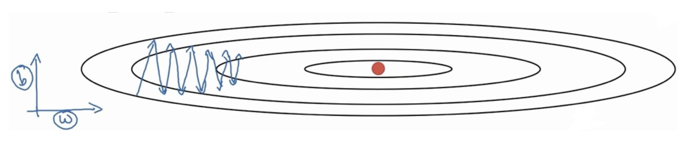
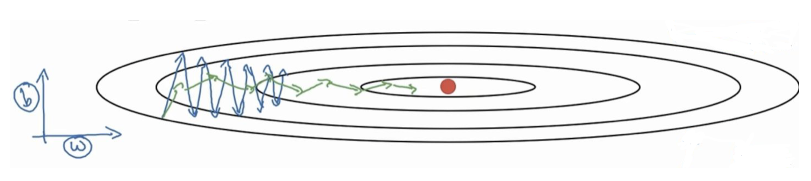

# Chapter 7 AdaGrad variants

## 7.1 RMSProp

&emsp;&emsp;The RMSProp optimization algorithm to be introduced first is an improvement of the AdaGrad algorithm.

&emsp;&emsp;Let us first give the AdaGrad algorithm introduced earlier:

&emsp;&emsp;At time step $t$, firstly, the mini-batch stochastic gradient $g_t$ is squared element-wise and accumulated to the variable $s_t$. Then, we readjust the learning rate of each element in the objective function independent variable by element-wise operation
$$
\boldsymbol{s}_{t} \leftarrow \boldsymbol{s}_{t-1}+\boldsymbol{g}_{t} \circ\boldsymbol{g}_{t}
\\
\boldsymbol{x}_{t} \leftarrow \boldsymbol{x}_{t-1}-\frac{\eta}{\sqrt{s_{t}+\epsilon}} \circ \boldsymbol{g}_{t}
$$
&emsp;&emsp;The original RMSProp algorithm is given again:

&emsp;&emsp;When the learning rate drops quickly in the early iteration and the current solution is still not good, the AdaGrad algorithm is replaced byBecause the learning rate is too small, it may be difficult to find a useful solution. To solve this problem, the RMSProp algorithm makes a slight modification to the AdaGrad algorithm. The algorithm is derived from a course on Coursera, "Neural Networks for Machine Learning".

&emsp;&emsp;Given the hyperparameter $0\leq \rho<1$, the RMSProp algorithm calculates at time step $t>0$:
$$
\boldsymbol{s}_{t} \leftarrow \rho \boldsymbol{s}_{t-1}+(1-\rho) \boldsymbol{g}_{t} \circ \boldsymbol{g}_{t}
\\
\boldsymbol{x}_{t} \leftarrow \boldsymbol{x}_{t-1}-\frac{\eta}{\sqrt{s_{t}+\epsilon}} \circ \boldsymbol{g}_{t}
$$
&emsp;&emsp;It can be seen that the only difference between the RMSProp optimization algorithm and the AdaGrad algorithm is the different methods of calculating the accumulated square gradient. The RMSProp algorithm does not directly accumulate square gradients like the AdaGrad algorithm, but adds a decay coefficient to control the amount of historical information obtained. That is,
$$
\boldsymbol{s}_{t} \leftarrow \rho \boldsymbol{s}_{t-1}+(1-\rho) \boldsymbol{g}_{t} \circ \boldsymbol{g}_{t}
$$
&emsp;&emsp;Simply put, after setting the global learning rate, the global learning rate of each parameter is divided by the square root of the sum of squared historical gradients controlled by the attenuation coefficient, making the learning rate of each parameter different. So what does it do?

&emsp;&emsp;The effect is that in the direction of the more gentle parameter space, greater progress will be made (because of the gentleness, the sum of squared historical gradients is smaller, and the corresponding learning decline is smaller), and it can make the steep direction gentle, thereby speeding up the training speed.

**Example:**

&emsp;&emsp;Assume that the optimization algorithm currently used is the most common gradient descent method `mini-batch`, and its moving direction is shown in blue below:

&emsp;&emsp;Assume that there are only two parameters $w,b$ now. From the figure, we can see that the $b$ direction is steeper, which affects the optimization speed. It can also be seen that the gradient $g$ in the $b$ direction is greater than the gradient in the $w$ direction.

&emsp;&emsp;Then, when the next update is calculated, $s_t$ appears as the denominator. The larger the value, the smaller the update, and the smaller the value, the larger the update. Then the subsequent update will be like the green line update below, which is obviously better than the blue update curve.

&emsp;&emsp;In the direction of the parameter space that is more gentle, greater progress will be made (because of the gentleness, the sum of the squares of the historical gradients is smaller, and the corresponding learning decline is smaller), and the steep direction can be made gentle, thereby speeding up the training speed. This is the intuitive benefit of the RMSProp optimization algorithm.

## 7.2 AdaDelta

&emsp;&emsp;The AdaDelta algorithm, like the RMSProp algorithm, uses a small batch of random gradients $g_t$ element-wise exponentially weighted moving average variables $s_t$. At time step $t>0$, the calculation is the same as the RMSProp algorithm:
$$
\boldsymbol{s}_{t} \leftarrow \rho \boldsymbol{s}_{t-1}+(1-\rho) \boldsymbol{g}_{t} \circ \boldsymbol{g}_{t}
$$

&emsp;&emsp;Different from the RMSProp algorithm, the AdaDelta algorithm alsoMaintain an additional state variable $\Delta x_t$, which is initialized to $0$ at time step $0$. We use $\Delta x_{t-1}$ to calculate the change in the independent variable:

$$
\boldsymbol{g}_{t}^{\prime} \leftarrow \sqrt{\frac{\Delta \boldsymbol{x}_{t-1}+\epsilon}{s_{t}+\epsilon}} \odot \boldsymbol{g}_{t}
\\
\boldsymbol{x}_{t} \leftarrow \boldsymbol{x}_{t-1}-\boldsymbol{g}_{t}^{\prime}
$$

&emsp;&emsp;Among them, $\epsilon$ is a constant added to maintain numerical stability. If the influence of $\epsilon$ is not considered, the difference between the AdaDelta algorithm and the RMSProp algorithm is that $\sqrt{\Delta x_{t-1}}$ is used to replace the learning rate $\eta$.

> **Algorithm 1** Computing ADADELTA update at time $t$ 
> **Require:** Decay rate $\rho$, Constant $\epsilon$ 
> **Require:** Initial parameter $x_1$ 
> 1: Initialize accumulation variables $E[g^2]_0 = 0, E[\Delta x^2]_0 = 0$ 
> 2: **for** $t=1$ : $T$ **do** %% Loop over # of updates 
> 3: &emsp;Compute Gradient: $g_t$ 
> 4: &emsp;Accumulate Gradient: $E[g^2]_t = \rho E[g^2]_{t-1} + (1 - \rho) g^2_t$ 
> 5: &emsp;Compute Update: $\displaystyle \Delta x_t = - \frac{\text{RMS}[\Delta x]_{t-1}}{\text{RMS}[g]_t} g_t$ 
> 6: &emsp;AccumulateUpdates: $E[\Delta x^2]_t = \rho E[\Delta x^2]_{t-1} + (1 - \rho) \Delta x_t^2$ 
> 7: &emsp;Apply Update: $x_{t+1} = x_t + \Delta x_t$ 
> 8: **end for** 

## 7.3 Adam

&emsp;&emsp;It is actually a combination of `Momentum`+`RMSProp`, and then corrects its deviation. We first give the algorithm framework (pseudocode) of the original paper: 

> **Algorithm 1:** Adam, our proposed algorithm for stochastic optimization. See section 2 for details, and for a slightly more efficient (but less clear) order of computation. $g^2_t$ indicates the elementwise squart $g_t \odot g_t$. Good default settings for the tested machine learning problems are $\alpha = 0.001, \beta_1=0.9, \beta_2=0.9999$ and $\epsilon = 10^{-8}$. All operations on vectors are element-wise. With $\beta_1^t$ and $\beta_2^t$ we denote $\beta_1$ and $\beta_2$ to the power $t$. 
> **Require:** $\alpha$ : Stepsize 
> **Require:** $\beta_1, \beta_2 \in [0,1)$ : Exponential decay rates for the moment estimates 
> **Require:** $f(\theta)$ : Stochastic objective function with parameters $\theta$ 
> **Require:** $\theta_0$ : Initial parameter vector 
> &emsp;$m_0 \leftarrow 0$ (Initialize $1^{\text{st}}$ moment vector) 
> &emsp;$v_0 \leftarrow 0$ (Initialize $2^{\text{nd}}$ moment vector) 
> &emsp;$t \leftarrow 0$ (Initialize timestep) 
> &emsp;**while** $\theta_t$ not converged **do** 
> &emsp;&emsp;$t \leftarrow t +1$ 
> &emsp;&emsp;$g_t \leftarrow \nabla_{\theta} f_t (\theta_{t-1})$ (Get gradients w.r.t. stochastic objective at timestep $t$) 
> &emsp;&emsp;$m_t \leftarrow \beta_1 \cdot m_{t-1} + (1 - \beta_1) \cdot g_t$ (Update biased first moment estimate) 
> &emsp;&emsp;$v_t \leftarrow \beta_2 \cdot v_{t-1} + (1 - \beta_2) \cdot g_t^2$ (Update biased second raw moment estimate) 
> &emsp;&emsp;$\hat{m}_t \leftarrow m_t / (1 - \beta_1^t)$ (Compute bias-corrected first moment estimate) 
> &emsp;&emsp;$\hat{v}_t \leftarrow v_t / (1 - \beta_2^t)$ (Compute bias-corrected second raw moment estimate) 
> &emsp;&emsp;$\theta_t \leftarrow \theta_{t-1} - \alpha \cdot \hat{m}_t / (\sqrt{\hat{v}_t} + \epsilon)$ (Update parameters) 
> &emsp;**end while** 
> &emsp;**return** $\theta_t$ (Resulting parameters)

&emsp;&emsp;The basic mini-batch SGD optimization algorithm has achieved many good results in deep learning, but there are also some **problems** to be solved:

1. It is difficult to choose an appropriate initial learning rate
2. The learning rate adjustment strategy is limited by the pre-specified adjustment rules
3. The same learning rate is applied to each parameter
4. How to avoid falling into a large number of local suboptimal solutions or saddle points in the optimization process of highly non-convex error functions

&emsp;&emsp;In December 2014, two scholars, Kingma and Lei Ba, proposed the Adam optimizer, which combines the advantages of the two optimization algorithms, AdaGrad and RMSProp. The first moment estimation (i.e. the mean value of the gradient) and the second moment estimation (i.e. the uncentered variance of the gradient) are comprehensively considered to calculate the update step size.

&emsp;&emsp;Mainly includes the following significant **advantages**:

1. Simple implementation, efficient calculation, and low memory requirement
2.Parameter updates are not affected by the scaling of gradients
3. Hyperparameters are well interpretable and usually require no adjustment or very little fine-tuning
4. The step size of the update can be limited to a rough range (initial learning rate)
5. The step size annealing process can be naturally implemented (automatically adjusting the learning rate)
6. Very suitable for scenarios with large-scale data and parameters
7. Applicable to unstable objective functions
8. Applicable to problems where the gradient is sparse or there is a lot of noise in the gradient

### 7.3.1 Adam update rule

&emsp;&emsp;Calculate the gradient of the $t$ time step:
$$
g_{t}=\nabla_{x} J\left(x_{\mathrm{t}-1}\right)
$$

&emsp;&emsp;First, calculate the exponential moving average of the gradient, $m_0$ is initialized to 0. Similar to the Momentum algorithm, the gradient momentum of the previous time step is considered comprehensively. The $\beta_1$ coefficient is an exponential decay rate that controls the weight distribution (momentum and current gradient), and is usually close to 1 (the default is 0.9).
$$
m_{t}=\beta_{1} m_{t-1}+\left(1-\beta_{1}\right) g_{t}
$$

&emsp;&emsp;Secondly, the exponential moving average of the squared gradient is calculated, and $v_0$ is initialized to 0. $\beta_2$The coefficient is the exponential decay rate, which controls the influence of the previous squared gradient. Similar to the RMSProp algorithm, the squared gradient is weighted and the default value is 0.999.
$$
v_{t}=\beta_{2} v_{t-1}+\left(1-\beta_{2}\right) g_{t}^{2}
$$

&emsp;&emsp;Third, since $m_0$ is initialized to 0, $m_t$ will tend to 0, especially in the early stages of training. Therefore, it is necessary to correct the deviation of the mean gradient $m_t$ to reduce the impact of the deviation on the early stages of training.

&emsp;&emsp;Similar to $m_0$, since $v_0$ is initialized to 0, $v_t$ will tend to 0 in the initial stage of training, which needs to be corrected.
$$
\hat{m}_{t}=m_{t} /\left(1-\beta_{1}^{t}\right) \\
\hat{v}_{t}=v_{t} /\left(1-\beta_{2}^{t}\right)
$$

&emsp;&emsp;Finally, update the parameters, the initial learning rate $\alpha$ multiplied by the ratio of the gradient mean to the square root of the gradient variance. The default learning rate $\alpha=0.001,\epsilon=10^{-8}$ is used to avoid the divisor becoming 0.
$$
x_{\mathrm{t}}=x_{t-1}-\alpha \hat{m}_{t} / \left( \sqrt{\hat{v}_{t}} + \varepsilon \right)
$$

&emsp;&emsp;As can be seen from the expression, the calculation of the updated step size can be adaptively adjusted from the two perspectives of gradient mean and gradient square, rather than being directly determined by the current gradient.

### 7.3.2 Adam defects and improvements

&emsp;&emsp;Although the Adam algorithm has become the mainstream optimization algorithm, the best results in many fields (such as object recognition in computer vision and machine translation in NLP) are still obtained using SGD with momentum. Many papers show that in terms of object recognition, character-level modeling, grammatical component analysis, etc., adaptive learning rate methods (including AdaGrad, AdaDelta, RMSProp, Adam, etc.) are usually worse than Momentum algorithms.

Reference link: https://ruder.io/deep-learning-optimization-2017/index.html

In response to the problems of adaptive learning rate methods such as Adam, there are two main improvements:

- Decouple weight decay

&emsp;&emsp;In each update of the ladderWhen the learning rate and weight decay are both increased, they are also attenuated (the attenuation coefficient $w$ is slightly less than 1) to avoid excessively large parameters. In the Adam optimization process, the parameter weight decay term is added. Decoupling the two hyperparameters of learning rate and weight decay allows the two parameters to be debugged and optimized separately.
$$
\begin{aligned}
m_t &= \beta_1 m_{t-1} + \left(1 - \beta_1 \right) g_t \\
v_t &= \beta_{2} v_{t-1} + \left(1 - \beta_2 \right) g_t^2 \\
\hat{m}_t &= \frac{m_t}{1-\beta_1^t} \\
\hat{v}_t &= \frac{v_t}{1-\beta_2^t} \\
\theta_{t+1} &= \theta_t - \frac{\eta}{\sqrt{\hat{v}_t} + \epsilon} \hat{m}_t - \eta w_t \theta_t
\end{aligned}
$$

- Modified Exponential Moving Mean

&emsp;&emsp;Several recent papers have shown that lower exponential decay rates (such as 0.99 or 0.9) can achieve better results than the default value of 0.999, suggesting that the exponential moving meanThe mean itself may also contain defects. For example, during the training process, a mini-batch may contain a large amount of gradient information, but since such mini-batches rarely appear, the exponential moving mean will weaken their effect (because the current gradient weight and the weight of the square of the current gradient are both relatively small), resulting in poor convergence in this scenario.
$$
\begin{aligned}
m_t &= \beta_1 m_{t-1} + \left( 1 - \beta_1 \right) g_t \\
v_t &= \beta_2 v_{t-1} + \left( 1 - \beta_2 \right) g_t^2 \\
\hat{v}_t &=\max \left( \hat{v}_{t-1}, v_t \right) \\
\theta_{t+1} &=\theta_t - \frac{\eta}{\sqrt{\hat{v}_t} + \epsilon} m_t
\end{aligned}
$$
&emsp;&emsp;Referring to the paper "ON THE CONVERGENCE OF ADAM AND BEYOND" published by Google in ICLR 2018, the authors proposed Adam's deformation algorithm AMSGrad. AMSGrad uses the maximum to update the gradient, unlike the Adam algorithm which uses the historical exponential moving average. The author observed better results than Adam on small batch datasets and CIFAR-10.