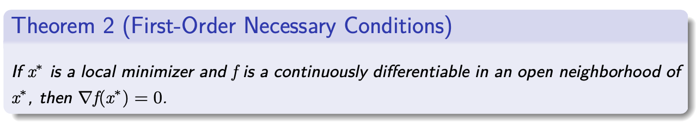

# Unconstrained Optimization

## Basics

1. Vectors and Matrices

- A vector $x \in \mathbb{R}^{n}: x=\left(x_{1}, \ldots, x_{n}\right)^{T}$
- Inner product: given $x, y \in \mathbb{R}^{n}, x^{T} y=\sum_{i=1}^{n} x_{i} y_{i}$
- A matrix $A \in \mathbb{R}^{m \times n}$
- $A \in \mathbb{R}^{n \times n}$ is positive semidefinite, if $x^{T} A x \geq 0$ for any $x \in \mathbb{R}^{n}$
- $Q \in \mathbb{R}^{n \times n}$ is orthogonal, if $Q^{T} Q=Q Q^{T}=I$.
- Eigenvalue $\lambda$, eigenvector $x: A x=\lambda x$

2. Vector norm

- $x \in \mathbb{R}^{n}$
$$
\begin{array}{ll}
l_{1} \text {-norm: } \quad & \|x\|_{1}=\sum_{i=1}^{n}\left|x_{i}\right| \\
l_{2} \text {-norm: } \quad & \|x\|_{2}=\left(\sum_{i=1}^{n} x_{i}^{2}\right)^{1 / 2}=\left(x^{T} x\right)^{1 / 2} \\
l_{\infty} \text {-norm: } \quad & \|x\|_{\infty}=\max _{i=1, \ldots, n}\left|x_{i}\right|
\end{array}
$$
- $\|x\|_{\infty} \leq\|x\|_{2} \leq \sqrt{n}\|x\|_{\infty}$ and $\|x\|_{\infty} \leq\|x\|_{1} \leq n\|x\|_{\infty}$
- Cauchy-Schwarz inequality: $\left|x^{T} y\right| \leq\|x\|_{2}\|y\|_{2}$

3. Matrix norm

- Given $A \in \mathbb{R}^{m \times n}$, define $\|A\|=\sup _{x \neq 0} \frac{\|A x\|}{\|x\|}$,
$$
\begin{aligned}
\|A\|_{1} &=\max _{j=1, \ldots, n} \sum_{i=1}^{m}\left|A_{i j}\right|, \\
\|A\|_{2} &=\text { largest eigenvalue of }\left(A^{T} A\right)^{1 / 2}, \\
\|A\|_{\infty} &=\max _{i=1, \ldots, m} \sum_{j=1}^{n}\left|A_{i j}\right|
\end{aligned}
$$
- Frobenius norm:
$$
\|A\|_{F}=\left(\sum_{i=1}^{m} \sum_{j=1}^{n} A_{i j}^{2}\right)^{1 / 2}
$$
- Condition number: $\kappa(A)=\|A\|\left\|A^{-1}\right\|$

4. Subspace

- Given $\mathcal{S} \subset \mathbb{R}^{n}$, it is called a subspace if for any $x, y \in \mathcal{S}$,
$$
\alpha x+\beta y \in \mathcal{S}, \text { for all } \alpha, \beta \in \mathbb{R}
$$
- Given $a_{i} \in \mathbb{R}^{n}, i=1, \ldots, m$, are the following sets
$$
\mathcal{S}=\left\{w \in \mathbb{R}^{n} \mid a_{i}^{T} w=0, i=1, \ldots, m\right\}
$$
and
$$
\mathcal{S}=\left\{w \in \mathbb{R}^{n} \mid a_{i}^{T} w \geq 0, i=1, \ldots, m\right\}
$$
subspaces?
- Null space: given $A \in \mathbb{R}^{m \times n}, \operatorname{Null}(A)=\left\{w \in \mathbb{R}^{n} \mid A w=0\right\}$
- Range space: Range $(A)=\left\{w \in \mathbb{R}^{m} \mid w=A v\right.$ for some vector $\left.v \in \mathbb{R}^{n}\right\}$
- $\operatorname{Null}(A) \bigoplus \operatorname{Range}\left(A^{T}\right)=\mathbb{R}^{n}$

5. Continuity

- Let $f: \mathcal{D} \subseteq \mathbb{R}^{n} \rightarrow \mathbb{R}^{m}$. For some $x_{0} \in \mathrm{cl} \mathcal{D}$, we write
$$\lim _{x \rightarrow x_{0}} f(x)=f_{0},
$$
if for all $\epsilon>0$, there is a value $\delta>0$ such that
$$
\left\|x-x_{0}\right\|<\delta \text { and } x \in \mathcal{D} \Rightarrow\left\|f(x)-f_{0}\right\|<\epsilon
$$
- We say $f$ is continuous at $x_{0}$ if $x_{0} \in \mathcal{D}$ and (1.1) holds with $f_{0}=f\left(x_{0}\right)$. We say $f$ is continuous on $\mathcal{D}$ if it is continuous for all $x_{0} \in \mathcal{D}$.
- We say $f$ is Lipschitz continuous on some set $\mathcal{N} \subset\mathcal{D}$ if there is a constant $L>0$ such that
$$
\left\|f\left(x_{1}\right)-f\left(x_{0}\right)\right\| \leq L\left\|x_{1}-x_{0}\right\|, \quad \text { for all } x_{0}, x_{1} \in \mathcal{N}
$$
( $L$ is called the Lipschitz constant.)

6. Convergence rate

- Let $\left\{x_{k}\right\}$ be a sequence in $\mathbb{R}^{n}$ that converges to $x^{*}$.
- The convergence is $Q$-linear if there exists a constant $\gamma \in(0,1)$ such that $\frac{\left\|x_{k+1}-x_{*}\right\|}{\left\|x_{k}-x^{*}\right\|} \leq r,\quad$ for all $k$ sufficiently large.
- The convergence is Q-superlinear if
$$
\lim _{k \rightarrow \infty} \frac{\left\|x_{k+1}-x^{*}\right\|}{\left\|x_{k}-x^{*}\right\|}=0 .
$$
- The convergence is $Q$-quadratic if there exists a constant $M$ such that $\frac{\left\|x_{k+1}-x_{*}\right\|}{\left\|x_{k}-x^{*}\right\|^{2}} \leq M, \quad$ for all $k$ sufficiently large.

- The convergence is $R$-linear if there is a sequenc of nonnegative scalars $\left\{\nu_{k}\right\}$ such that
$\left\|x_{k}-x^{*}\right\| \leq \nu_{k}$ for all $k$, and $\left\{\nu_{k}\right\}$ converges $Q$-linearly to zero.
- The sequence $\left\{x_{k}-x^{*}\right\}$ is said to be dominated by $\left\{\nu_{k}\right\}$.
- We say $\left\{x_{k}\right\}$ converges $R$-superlinearly to $x^{*}$ if $\left\{\left\|x_{k}-x^{*}\right\|\right\}$ is dominated by a sequence of scalars converging $Q$-superlinearly to zero.
- We say $\left\{x_{k}\right\}$ converges $R$-quadratically to $x^{*}$ if $\left\{\left\|x_{k}-x^{*}\right\|\right\}$ is dominated by a sequence of scalars converging $Q$-quadratically to zero.

## Mathematical basis of optimization methods

1. What is optimization? General model of optimization, unconstrained optimization, constrained optimization

Optimization is a branch of applied mathematics, which mainly refers to a method of selecting a research plan to achieve the best goal under certain conditions. Optimization problems have extremely wide applications in today's military, engineering, management and other fields. With the increasing development of science and technology, the core problems of many disciplines are ultimately reduced to optimization problems. Therefore, optimization has become an indispensable computational tool for discipline research and technical personnel.

**Definition**: Seeking the best arrangement or plan in a certain sense from several possible arrangements or plans is mathematically called optimization.

Decision variables, objective functions and constraints are the three basic elements of optimization problems. Optimization problems without constraints are called unconstrained optimization problems, while other situations are called constrained optimization problems. Problems without objective functions are called feasibility problems. Some problems can have multiple objective functions. Such problems are often treated as single-objective optimization problems or a series of such problems.

If the decision variables in the optimization problem are restricted to integers or discrete sets of possibilities, we call it a combinatorial optimization problem.or discrete optimization problem. If there are no such restrictions on the variables, it is a continuous optimization problem. Of course, some problems may have both discrete and continuous variables.

2. Basic concepts: feasible solution, global optimal solution, local optimal solution

We start with a general description of the optimization problem. Given a function $f(x):R^n \rightarrow R$ and a set $S \subset R^n$, find a solution to $x^*$
$$
\begin{array}{r}
\min f(x) \\
x \in R^{n}
\end{array}
$$
is called an optimization problem. $f$ is called the objective function and $S$ is the feasible domain. If $S$​ is empty, the problem is called infeasible. If it is possible to find a point sequence $x^k \in S$ such that $f (x^k ) \rightarrow - \infty$ when $k \rightarrow \infty$, then the problem is unbounded.

If the problem is neither infeasible nor unbounded, then it is often possible to find $x^*\in S$ that satisfies
$$
f\left(x^{*}\right) \leq f(x), \forall x \in S
$$
Such $x^*$ is called a global minimum. If
$$
f\left(x^{*}\right)<f(x), \forall x \in S, x \neq x^{*},
$$
Such $x^*$ is called a strict global minimum.

In other cases, we may only find $x^*\in S$ that satisfies
$$
f\left(x^{*}\right) \leq f(x), \forall x \in S \bigcap B_{x^{*}}(\varepsilon)
$$
Where $B_{x^{*}}(\varepsilon)=\{x:\|x-x *\|<\varepsilon\}$.

Such $x^*$ is called a local minimum of the problem. Similarly, strict local minimums can be defined. In most cases, the feasible set $S$ is displayed using function constraints (equality and inequality).

Where $E$ and $I$ are the index sets of equality and inequality constraints. Then the usual optimization problem takes the following form:
$$
\begin{array}{l}
\min f(x) \\
\text { s.t. } g_{i}(x) \leq 0, i \in I=\{1,2, \cdots, m\} \\
h_{j}(x)=0, j \in E=\{1,2, \cdots, p\} \\
x \in D \subset R^{n}
\end{array}
$$
There are many factors that affect whether an optimization problem can be solved efficiently. For example, the number of decision variables n and the total number of constraints are usually good predictors of how difficult it is to solve an optimization problem. Other factors are related to the function that defines the problem. Problems with linear objective functions and linear constraints are relatively easy to solve. Problems with convex objective functions and convex feasible sets are also easy to solve. For this reason, researchers have developed different algorithms for problems with special characteristics.

## Optimality conditions for optimization problems (we will consider equality constraints for now)

### 1. First-order and second-order necessary conditions

**Form of equality constraint problem**
$$
\begin{array}{l}\text { minimize } f(x) \\ \text { subject to } h_{i}(x)=0, \quad i=1, \ldots, m\end{array}
$$
Where $f: \Re^{n} \mapsto \Re, h_{i}: \Re^{n} \mapsto \Re, i=1, \ldots, m$, these functions are continuously differentiable (when these functions are continuously differentiable only in the neighborhood of a local minimum point, the theory also holds)

**Lagrange multiplier theorem - necessary conditions**

Regular point is LICQ ($\nabla h_i(x^*)$ linearly independent)

Let $x^*$ be a local minimum and a regular point, then there is a unique list of numbers $\lambda_1^*,\cdots,\lambda_m^*$ that satisfies:
$$
\nabla f\left(x^{*}\right)+\sum_{i=1}^{m} \lambda_{i}^{*} \nabla h_{i}\left(x^{*}\right)=0
$$
When f and g are second-order continuously differentiable, we have:
$$
y^{\prime}\left(\nabla^{2} f\left(x^{*}\right)+\sum_{i=1}^{m} \lambda_{i}^{*} \nabla^{2} h_{i}\left(x^{*}\right)\right) y \geq 0, \forall y \text { s.t. } \nabla h\left(x^{*}\right)^{\prime} y=0
$$
#### 1.1 Elimination Approach

**Proof Method 1**: (Elimination Approach)

Consider the lineThe case of linear constraints (10)
$$
\begin{array}{l}\text { minimize } f(x) \\ \text { subject to } A x=b\end{array}
$$
Where $A$ is a $m \times n$ matrix whose rows are linearly independent, $b \in \Re^m$ is a given vector, and we may as well assume that the first m columns of A are linearly independent (they can be rearranged if necessary).

Therefore, the matrix can be divided into blocks $A = (B \quad R)$, where $B$ is an $m \times m$ reversible matrix, $R$ is an $m \times (n-m)$ matrix, and we can divide the corresponding x into blocks $x = (x_B \quad x_R)^{\prime}$. We can get (11)
$$
\begin{array}{l}\text { minimize } f(x_B,x_R) \\ \text { subject to } Bx_B + Rx_R=b \end{array}
$$
Due to the constraint equation, we can get $x_B = B^{-1}(B-Rx_R)$. Substituting it into the above optimization problem, we get an unconstrained optimization problem
$$
\begin{array}{l}\text { minimize } \quad F\left(x_{R}\right) \equiv f\left(B^{-1}\left(b-R x_{R}\right), x_{R}\right) \\ \text { subject to } x_{R} \in \Re^{n-m}\end{array}
$$
If $(x_B^*,x_R^*)$ is a local minimum, then $x_R^*$ is a local minimum of the “reduced” cost function F. We can get it from the unconstrained optimality condition
$$
0=\nabla F\left(x_{R}^{*}\right)=-R^{\prime}\left(B^{\prime}\right)^{-1} \nabla_{B} f\left(x^{*}\right)+\nabla_{R} f\left(x^{*}\right)
$$
We define $\lambda^{*}=-\left(B^{\prime}\right)^{-1} \nabla_{B} f\left(x^{*}\right)$ , which can be written as $\nabla_{B} f\left(x^{*}\right)+B^{\prime} \lambda^{*}=0$, then
$$
\nabla_{R} f\left(x^{*}\right)+R^{\prime} \lambda^{*}=0
$$
Together, we get: $\nabla f\left(x^{*}\right)+A^{\prime} \lambda^{*}=0$

The uniqueness of $\lambda$ is guaranteed by the linear independence of the columns of $A$.

Next, we continue to prove the second-order necessary conditions. Through the equivalent unconstrained optimization problem, we can get
$$
0 \leq d^{\prime} \nabla^{2} F\left(x_{R}^{*}\right) d, \quad \forall d \in \Re^{n-m}
$$
We can get
$$
\begin{array}{c}\nabla^{2} F\left(x_{R}\right)=\nabla\left(-R^{\prime}\left(B^{\prime}\right)^{-1} \nabla_{B} f\left(B^{-1}\left(b-R x_{R}\right), x_{R}\right)\right. \\ \left.+\nabla_{R} f\left(B^{-1}\left(b-R x_{R}\right), x_{R}\right)\right)\end{array}
$$
Divide $\nabla^2f(x^*)$ into blocks, that is, $\nabla^{2} f\left(x^{*}\right)=\left(\begin{array}{ll}\nabla_{B B}^{2} f\left(x^{*}\right) & \nabla_{B R}^{2} f\left(x^{*}\right) \\ \nabla_{R B}^{2} f\left(x^{*}\right) & \nabla_{R R}^{2} f\left(x^{*}\right)\end{array}\right)$
$$
\begin{array}{l}\nabla^{2} F\left(x_{R}^{*}\right)=R^{\prime}\left(B^{\prime}\right)^{-1} \nabla_{B B}^{2} f\left(x^{*}\right) B^{-1} R \\ -R^{\prime}\left(B^{\prime}\right)^{-1} \nabla_{B R}^{2} f\left(x^{*}\right)-\nabla_{R B}^{2} f\left(x^{*}\right) B^{-1} R+\nabla_{R R}^{2} f\left(x^{*}\right)\end{array}
$$

$$
\begin{aligned} 0 & \leq d^{\prime} \nabla^{2} F\left(x_{R}^{*}\right) d=y^{\prime} \nabla^{2} f\left(x^{*}\right) y \\ &=y^{\prime}\left(\nabla^{2} f\left(x^{*}\right)+\sum_{i=1}^{m} \lambda_{i}^{*} \nabla^{2} h_{i}\left(x^{*}\right)\right) y \end{aligned}
$$

Where $y = (y_B \quad y_R)^{\prime} = (-B^{-1}Rd \quad d)^{\prime}$. 

$y$ has this form if and only if $0=B y_{B}+R y_{R}=\nabla h\left(x^{*}\right)^{\prime} y$.

#### 1.2 Penalty Approach

**Proof Method 2**: (Penalty Approach)

Here, we approximate the original constrained problem by an unconstrained optimization problem, using a penalty for violating the constraint. In particular, for k=1,2... we introduce the cost function
$$
F^{k}(x)=f(x)+\frac{k}{2}\|h(x)\|^{2}+\frac{\alpha}{2}\left\|x-x^{*}\right\|^{2}
$$
Where $\alpha > 0$ and $x^*$ is a local minimum point.

Since $x^*$ is a local minimum point, we can choose a very small value $\epsilon > 0$ so that all feasible points x on the closed sphere $S=\left\{x \mid\left\|x-x^{*}\right\| \leq \epsilon\right\}$ satisfy $f\left(x^{*}\right) \leq f(x)$ 

Let $x^k$ be the minimum value of the following problemOptimal solution
$$
\begin{array}{l}\operatorname{minimize} \quad F^{k}(x) \\ \text { subject to } x \in S\end{array}
$$
[Due to Weierstrass theorem, there is an optimal solution, since S is compact. ] We will show that the sequence $x^k$ converges to $x^*$. For all k (7)
$$
F^{k}\left(x^{k}\right)=f\left(x^{k}\right)+\frac{k}{2}\left\|h\left(x^{k}\right)\right\|^{2}+\frac{\alpha}{2}\left\|x^{k}-x^{*}\right\|^{2} \leq F^{k}\left(x^{*}\right)=f\left(x^{*}\right)
$$
Since $f(x^k)$ is bounded on $S$, we have $\lim _{k \rightarrow \infty}\left\|h\left(x^{k}\right)\right\|=0$.

**Lagrangian function**
$$
L(x, \lambda)=f(x)+\sum_{i=1}^{m} \lambda_{i} h_{i}(x)
$$
If $x^*$ is a local minimum and it is regular, the Lagrange multiplier condition can be written as:
$$
\nabla_{x} L\left(x^{*}, \lambda^{*}\right)=0, \quad \nabla_{\lambda} L\left(x^{*}, \lambda^{*}\right)=0
$$
This is a system of n+m equations with n+m unknowns
$$
y^{\prime} \nabla_{x x}^{2} L\left(x^{*}, \lambda^{*}\right) y \geq 0, \quad \forall y \text { S.t. } \nabla h\left(x^{*}\right)^{\prime} y=0
$$

### 2. Second-order sufficient conditions

Equality constraint problem
$$
\begin{array}{l}\text { minimize } f(x) \\ \text { subject to } h_{i}(x)=0, \quad i=1, \ldots, m\end{array}
$$
Second-order sufficient condition: Let $x^* \in \Re^n,\lambda^* \in \Re^m$ satisfy
$$
\begin{array}{c}\nabla_{x} L\left(x^{*}, \lambda^{*}\right)=0, \quad \nabla_{\lambda} L\left(x^{*}, \lambda^{*}\right)=0 \\ y^{\prime} \nabla_{x x}^{2} L\left(x^{*}, \lambda^{*}\right) y>0, \quad \forall y \neq 0 \text { with } \nabla h\left(x^{*}\right)^{\prime} y=0\end{array}
$$
Then $x^*$ is a strict minimum point.

(Note that this sufficient condition does not require the regularity of $x^*$)

Consider augmented Lagrangian
$$
L_{c}(x, \lambda)=f(x)+\lambda^{\prime} h(x)+\frac{c}{2}\|h(x)\|^{2}
$$
where c is a scalar.
$$
\begin{array}{c}\nabla_{x} L_{c}(x, \lambda)=\nabla_{x} L(x, \tilde{\lambda}) \\ \nabla_{x x}^{2} L_{c}(x, \lambda)=\nabla_{x x}^{2} L(x, \tilde{\lambda})+c \nabla h(x) \nabla h(x)^{\prime}\end{array}
$$
The following are sufficient optimization conditions for unconstrained optimization:

