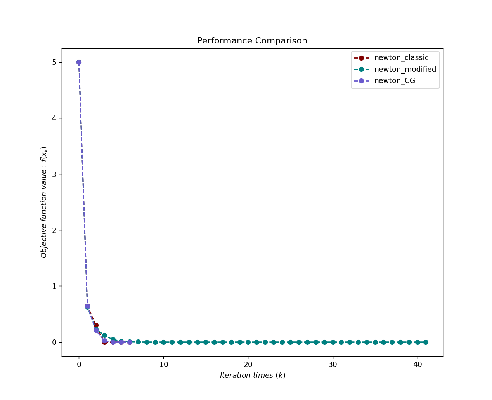
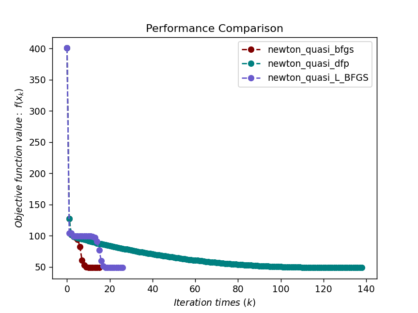
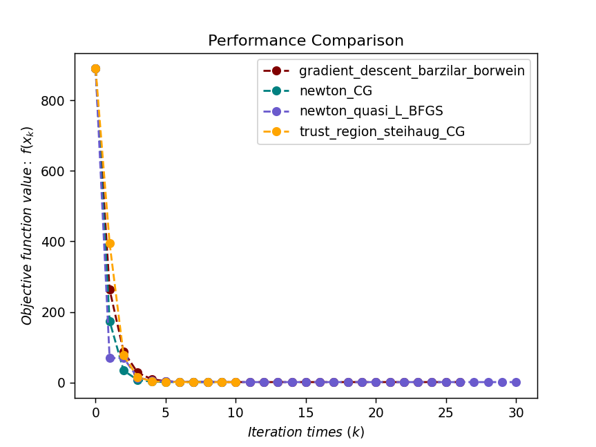

# Quasi-Newton method

`pip install optimtool` to use the optimization algorithm

[optimtool source code](https://github.com/linjing-lab/optimtool)

```python
# Import package
import sympy as sp
import matplotlib.pyplot as plt
import optimtool as oo
```

```python
# Visualization function: parameter passing interface (color list, function value list, title list)
def test(colorlist, f_list, title):
handle = []
for j, z in zip(colorlist, f_list):
ln, = plt.plot([i for i in range(len(z))], z, c=j, marker='o', linestyle='dashed')
handle.append(ln)
plt.xlabel("$Iteration \ times \ (k)$")
plt.ylabel("$Objective \ function \ value: \ f(x_k)$")
plt.legend(handle, title)
plt.title("Performance Comparison")
plt.show()
return None
```

## 1. Newton's method

&emsp;&emsp;Newton's method has achieved good results both in theory and practice. For a quadratic continuously differentiable function $f(x)$, consider the second-order Taylor expansion of $f(x)$ at the iteration point $x^k$:

$$
f(x^k+d^k)=f(x^k)+\nabla f(x^k)^T d^k + \dfrac{1}{2}(d^k)^T \nabla^2 f(x^k)d^k + o(||d^k||^2) \tag {1.1}
$$

Our goal is to select the appropriate descent direction $d^k$ based on this second-order approximation . If we ignore the higher-order terms in the above equation and regard the right side of the equation as a function of $d^k$ to find its stable point, we can get:

$$
\nabla^2 f(x^k)d^k = -\nabla f(x^k) \tag {1.2}
$$

This equation is also called **Newton's squareIt is easy to conclude that when $\nabla^2 f(x^k)$ is non-singular, the update direction is $d^k=-\nabla f^2(x^k)^{-1} \nabla f(x^k)$ . The $d^k$ that satisfies this equation is generally called the Newton direction. Therefore, the update format of the classical Newton method is:

$$
x^{k+1}=x^k-\nabla^2 f(x^k)^{-1} \nabla f(x^k) \tag {1.3}
$$

The step size $\alpha_k$ is always 1, which means that the selection of the step size does not need to be considered additionally. We also call the Newton method with a step size of 1 the classical Newton method.

Newton method test function:

$$
f(x) = (1-x_1)^2 + (x_2-x_1^2)^2, x_0=[2, 2]
$$

```python
def dataSet1():
f = sp.symbols("f")
x1, x2 = sp.symbols("x1 x2")
f = (1 - x1)**2 + (x2 - x1**2)**2
funcs = sp.Matrix([f])
args = sp.Matrix([x1, x2])
x_0 = (2, 2)return funcs, args, x_0
```

&emsp;&emsp;The modified Newton method mainly modifies the Hesser matrix $\nabla^2 f(x^k)$ in the Newton equation to make it a positive definite matrix; at the same time, line search is introduced to improve the stability of the algorithm.

&emsp;&emsp;In the classical Newton method, the calculation of the Newton direction $d^k$ depends on solving a system of linear equations. When $n$ is large but $\nabla^2 f(x^k)$ has a sparse structure, it is necessary to solve the Newton equations through iteration. The following is the function program of the inexact Newton method.

```python
def train1():
funcs, args, x_0 = dataSet1()
f_list = []
title = ["newton_classic", "newton_modified", "newton_CG"]
colorlist = ["maroon", "teal", "slateblue"]
_, _, f = oo.unconstrain.newton.classic(funcs, args, x_0, False, True)
f_list.append(f)_, _, f = oo.unconstrain.newton.modified(funcs, args, x_0, False, True)
f_list.append(f)
_, _, f = oo.unconstrain.newton.CG(funcs, args, x_0, False, True)
f_list.append(f)
return colorlist, f_list, title
```

```python
colorlist, f_list, title = train1()
test(colorlist, f_list, title)
```



&emsp;&emsp;However, for large-scale problems, the Hessian matrix of the function is expensive to calculate or difficult to obtain. Even if we get the Hessian matrix, we still need to solve a large-scale linear system of equations. So can we use the approximation of the Hessian matrix or its inverse matrix to perform Newton iteration? The quasi-Newton method is such an algorithm, which can generate an approximate matrix at a small computational cost at each step, and the iterative sequence generated by using the approximate matrix instead of the Hesser matrix still has superlinear convergence.Convergence properties. 

&emsp;&emsp;The quasi-Newton method does not calculate the Hessian matrix $\nabla^2 f(x)$, but constructs its approximate matrix $B^k$ or its inverse approximate matrix $H^k$. We hope that $B^k$ or $H^k$ still retains some properties of the Hessian matrix. For example, $d^k$ is still in the descending direction. So what properties should the quasi-Newton matrix satisfy? How to construct them?

## 2. Secant equation

&emsp;&emsp;Assume $f(x)$ is a quadratic continuously differentiable function. According to Taylor expansion, the approximation of the vector-valued function $\nabla f(x)$ at $x^{k+1}$ is:

$$
\nabla f(x)=\nabla f(x^{k+1}) + \nabla^2 f(x^{k+1})(x - x^{k+1}) + O(||x-x^{k+1}||^2) \tag {2.1}
$$

Let $x=x^k$ , $s^k=x^{k+1}-x^k$ and $y^k=\nabla f(x^{k+1})-\nabla f(x^k)$ , and we get:

$$
\nabla^2 f(x^{k+1})s^k+O(||s^k||^2)=y^k \tag {2.2}
$$

Ignore higher-order terms $||s^k||^2||$ , we hope that the approximate matrix $B^{k+1}$ of the Hesser matrix $\nabla^2 f(x^{k+1})$ satisfies the equation:

$$
y^k = B^{k+1} s^k \tag {2.3}
$$

Or its inverse approximate matrix $H^{k+1}$ satisfies the equation:

$$
s^k=H^{k+1} y^k \tag {2.4}
$$

The above equations $(2.3)$ and $(2.4)$ are called **secant equations**.

&emsp;&emsp;Note that the positive definiteness of the approximate matrix $B^k$ is a key factor. Multiplying $(s^k)^T$ on both sides of $(2.4)$ gives $(s^k)^T B^{k+1} s^k=(s^k)^T y^k$ , so the condition:

$$
(s^k)^T y^k > 0 \tag {2.5}
$$

is a necessary condition for $B^{k+1}$ to be positive definite. We additionally require that condition $(5)$ is always satisfied during the iteration process, which is also called the **curvature condition**. For the general objective function $f(x)$ , the Wolfe criterion line search is required to ensure that the curvature condition $(2.5)$ holds. In fact, according to the Wolfe condition, $\nabla f(x^{k+1})^T s^k \geqslant c_2 \nabla f(x^k)^T s^k$ , subtract $\nabla f(x^k)^T s^k$ from both sides, 

$$
(y^k)^T s^k \geqslant (c_2 - 1)\nabla f(x^k)^T s^k > 0 \tag {2.6}
$$

This is because $c_2 < 1$ and $s^k=\alpha_k d^k$ is the descending direction. Using only the Armijo criterion does not guarantee that the curvature condition holds.

&emsp;&emsp;In general, the approximate matrix $B^{k+1}$ or $H^{k+1}$ is obtained by adding a correction to the previous iteration and is required to satisfy the secant equation $(2.3)$ . The following is the framework of the quasi-Newton method:

> Given $x^0 \in R^n$, the initial matrix $B^0 \in R^{n \times n}$ (or $H^0$), let $k=0$.
> 
> **while** the stopping criterion is not reached**do**
> 
> &emsp; Calculate the direction $d^k=-(B^k)^{-1} \nabla f(x^k)$ or $d^k=-H^k \nabla f(x^k)$.
> 
> &emsp; Find the appropriate step size $\a through line searchlpha^k > 0$, let $x^{k+1}=x^k+\alpha_kd^k$.
> 
> &emsp;Update the approximate matrix $B^{k+1}$ of the Hessian matrix or the approximate matrix $H^{k+1}$ of its inverse.
> 
> &emsp;$k \leftarrow k + 1$
> 
> **end while**

## 3. Update method of quasi-Newton matrix

### 3.1 Rank-one update (SR1)

 The rank-one update (SR1) formula is the simplest quasi-Newton matrix update formula. Let B^k be the approximate Hessian matrix of the kth step. We obtain B^{k+1} by rank-one correction of B^k to satisfy the secant equation (2.3). To this end, the method of undetermined coefficients is used to find the correction matrix, and it is assumed that: $$

B^{k+1}=B^k + auu^T \tag {3.1.1}
$$

Where $u \in R^n$, $a \in R$ are undetermined. According to the secant equation $(2.3)$, we have:

$$
B^{k+1} s^k=(B^k + auu^T)s^k=y^k \tag {3.1.2}
$$

Then we get: 

$$
(a \cdot u^T s^k)u=y^k - B^k s^k \tag {3.1.3}
$$Note that $a \cdot u^T s^k$ is a scalar, so $u$ and $y^k-B^k s^k$ have the same direction. Let $u=y^k-B^ks^k$ , and substitute it into the original equation to get: 

$$
a((y^k-B^ks^k)^T s^k)(y^k - B^ks^k) = y^k - B^k s^k \tag {3.1.4}
$$

If we assume that $(y^k-B^ks^k)^Ts^k \not= 0$ , we can get $a=\dfrac{1}{(y^k-B^ks^k)^Ts^k}$ , and finally get the updated formula: 

$$
B^{k+1}=B^k+\dfrac{(y^k-B^ks^k)(y^k-B^ks^k)^T}{(y^k-B^ks^k)^Ts^k)} \tag {3.1.5}
$$

We call $(3.1.5)$ The formula is the $SR1$ formula based on $B^k$. By the same process, we can obtain the SR1 formula based on $H^k$ according to the secant equation $(2.4)$:

$$
H^{k+1}=H^k + \dfrac{(s^k-H^ky^k)(s^k-H^ky^k)^T}{(s^k-H^ky^k)^Ty^k} \tag {3.1.6}$$

Although the SR1 formula has a simple structure, it has a major flaw: it cannot remain positive definite during the iteration process. It is easy to verify that $(y^k-B^ks^k)^Ts^k) > 0$ is a sufficient condition for $B^{k+1}$ to be positive definite, but this condition may not be satisfied during the iteration process. Therefore, the SR1 algorithm for updating the Hesser matrix is ​​not included in the optimtool package.

### 3.2 BFGS formula

&emsp;&emsp;To overcome the defects of the SR1 formula, now consider the rank-two update of $B^k$. Similarly, the method of undetermined coefficients is used to derive this formula. Let

$$
B^{k+1}=B^k=auu^T+bvv^T \tag {3.2.1}
$$

Where $u,v \in R^n$, $a,b \in R$ are to be determined. According to the secant equation $(2.3)$,

$$
B^{k+1}s^k=(B^k+auu^T+bvv^T)s^k = y^k \tag {3.2.2}
$$

After rearrangement, we can get

$$
(a \cdot u^Ts^k)u + (b \cdot v^Ts^k)v = y^k - B^ks^k \tag {3.2.3}
$$

We can make the above equation true by selecting $u$ and $v$. In fact, there are many ways to select $u$ and $v$. One of the most direct ways is to selectThe method is to make the two terms on the left and right sides of the above equation equal, that is: 

$$
u=y^k, a \cdot u^T s^k=1, \\ v = B^ks^k, b \cdot v^Ts^k = -1 \tag {3.2.4}
$$

So the update method is: 

$$
B^{k+1}=B^k+\dfrac{y^k(y^k)^T}{(s^k)^Ty^k} - \dfrac{B^ks^k(B^ks^k)^T}{(s^k)^TB^ks^k} \tag {3.2.5}
$$

The format $(3.2.5)$ is called the BFGS formula based on $B^k$, which is composed of the initials of Broyden, Fletcher, Gold-farb, and Shannon.

&emsp;&emsp;Assuming $H^k=(B^k)^{-1}$, the BFGS formula based on $H^k$ can be immediately derived:

$$
H^{k+1}=(I-\rho_k y^k(s^k)^T)^T H^k (I-\rho_k y^k (s^k)^T) + \rho_ks^k(s^k)^T \tag {3.2.6}
$$

where $\rho_k=\dfrac{1}{(s^k)^Ty^k}$. It is easy to see that, if the matrix $H^{k+1}$ generated by the BFGS formula update is positive definite, a sufficient condition is that the inequality $(2.5)$ holds and the matrix $H^k$ updated in the previous step is positive definite. In the problem solving process, the condition $(2.5)$ may not be satisfied. At this time, the line search of the Wolfe criterion should be used to force the condition $(2.5)$ to hold.

&emsp;&emsp;The BFGS format $(3.2.6)$ has a deeper meaning. It actually satisfies a certain approximation optimality. Specifically, $H^{k+1}$ defined by $(3.2.6)$ happens to be the solution to the following optimization problem:

$$
\min_H ||H-H^k||_W, \\ s.t. H=H^T, \\ Hy^k=s^k \tag {3.2.7}
$$

The meaning of this optimization problem is to find the matrix $H$ closest to $H^k$ in the symmetric matrix that satisfies the secant equation $(2.4)$. Here $||\cdot||_W$ is the weighted norm, defined as

$$
||H||_W=||W^{1/2} HW^{1/2}||_F \tag {3.2.8}
$$

W$ can be any matrix that satisfies the secant equation $Ws^k=y^k$ matrix.

&emsp;&emsp;BFGS formula is currently the most effective quasi-Newton update formatIt has good theoretical properties and is not complicated to implement. Modifying the format $(3.2.6)$ can obtain the limited memory BFGS format (L_BFGS), which is a commonly used quasi-Newton algorithm for large-scale optimization problems.

### 3.3 DFP formula

&emsp;&emsp;In the derivation of the BFGS formula, if we use the secant equation $(2.4)$ to derive the rank-two-corrected quasi-Newton correction for $H^k$, we will get the quasi-Newton matrix update based on $H^k$

$$
H^{k+1}=H^k - \dfrac{H^ky^k(H^ky^k)^T}{(y^k)^TH^ky^k} + \dfrac{s^k(s^k)^T}{(y^k)^Ts^k} \tag {3.3.1}
$$

This iterative format was first discovered by Davidon and further developed by Fletcher and Powell, so it is called the DFP formula. The updated format of $B^k$ is obtained

$$
B^{k+1}=(I-\rho_ks^k(y^k)^T)^TB^k(I-\rho_ks^k(y^k)^T)+\rho_ky^k(y^k)^T \tag {3.2.2}
$$

The definition of $\rho_k$ is the same as $(3.2.6)$.

&emsp;&emsp; It can be seen that the DFP formula $(3.3.1)(3.3.2)$ and the BFGS formula $(3.2.5)(3.2.6)$ are in dual relationship. Replace $H^k$ with $B^k$ in the BFGS format $(3.2.6)$, and swap $s^k$ with $y^k$ to get the DFP format $(3.2.2)$. Not only that, there is also such a dual phenomenon in approximation. In fact, $B^{k+1}$ defined by $(3.2.2)$ is the solution to the optimization problem:

$$
\min_B ||B-B^k||_W, \\ s.t. B=B^T, \\ Bs^k=y^k \tag {3.2.3}
$$

The meaning of $||\cdot||_W$ is basically the same as in problem $(3.2.7)$, but W is any matrix that satisfies $Wy^k=s^k$. Similar to the BFGS format, the DFP format requires $B^{k+1}$ to be the closest matrix to $B^k$ among the symmetric matrices that satisfy the secant equation $(2.3)$, which also implies some optimality. 、

> The global convergence of the quasi-Newton method is not discussed here

### 3.4 Limited memory BFGS method

&emsp;&emsp;Although the quasi-Newton method overcomes the difficulty of calculating the Hesser matrix, it still cannot be applied to large-scale optimization problems. In generalFor example, the quasi-Newton method matrix $B^k$ or $H^k$ is a dense matrix, and storing dense matrices consumes $O(n^2)$ of memory, which is obviously impossible for large-scale problems. The limited memory BFGS method (L_BFGS) solves this storage problem, so that people can also apply quasi-Newton methods to accelerate the convergence of iterations on large-scale problems.

&emsp;&emsp;The L_BFGS method is a deformation of the BFGS formula $(3.2.5)(3.2.6)$. For the convenience of derivation, we derive the corresponding L_BFGS formula based on the update formula $(3.2.6)$ of $H^k$. First, introduce new notation to rewrite $(3.2.6)$:

$$
H^{k+1}=(V^k)^TH^kV^k + \rho_ks^k(s^k)^T
$$

Where

$$
\rho_k=\dfrac{1}{(y^k)^Ts^k}, V^k=I-\rho_ky^k(s^k)^T \tag {3.4.2}
$$

Observe that $(3.4.1)$ has similar recursive properties. For this reason, we can recursively expand $(3.4.1)$ $m$ times, where $m$ is a given integer:

$$
\begin{aligned}
H^k&=\nabla (V^{k-m}...V^{k-1})^TH^{k-m}(V^{k-m}...V^{k-1})+ \\
&\rho_{k-m}(V^{k-m+1}...V^{k-1})+ \\
&\rho_{k-m+1}(V^{k-m+2}...V^{k-1})^Ts^{k-m+1}(s^{k-m+1})^T(V^{k-m+2}...V^{k-1})+ \\
&...+\rho_{k-1}s^{k-1}(s^{k-1})^T 
\end{aligned} \tag {3.4.5}
$$

In order to save memory, the $(3.4.1)$ formula cannot be expanded infinitely, but this will cause a problem: $H^{k-m}$ cannot be displayed. A very natural idea is to use the approximate matrix of $H^{k-m}$ to replace $H^{k-m}$ for calculation. There are many ways to select the approximate matrix, but the basic principle is to ensure that the approximate matrix has a very simple structure. Assuming that we are given an approximate matrix $\hat{H}^{k-m}$ of $H^{k-m}$, $(3.4.3)$ can be used to calculate the quasi-Newton iteration.

&emsp;&emsp;In the quasi-Newton iteration, it is actually not necessary to calculate the display form of $H^k$, but only to use $H^k\nabla f(x^k)$ to calculate the iteration direction $d^k$. For this purpose, we first give an algorithm that directly solves $H^k\nabla f(x^k)$ using the expansion $(3.4.3)$.

`Double loop recursive algorithm`:

> Initialize $q \leftarrow \nabla f(x^k)$
> 
> **for** $i = k - 1, k - 2, ..., k - m$ **do**
> 
> &emsp;Compute and save $\alpha_i \leftarrow \rho_i(s^i)^Tq$.
> 
> &emsp;Update $q \leftarrow q - \alpha_iy^i$.
> 
> **end for**
> 
> Initialize $r \leftarrow \hat{H}^{k-m}q$, where $\hat{H}^{k-m}$ is the approximate matrix of $H^{k-m}$.
> 
> **for** $i = k-m, k-m+1, ..., k-1$ **do**
> 
> &emsp;Compute $\beta \leftarrow \rho_i(y^i)^Tr$.
> 
> &emsp;Update $r \leftarrow r + (\alpha_i - \beta)s^i$.
> 
> **end for**
> 
> Output $r$, that is, $H^k \nabla f(x^k)$.

&emsp;&emsp;This algorithm makes full use of the structure of $(3.4.3)$ to save the cost of calculating $H^k\nabla f(x^k)$ as much as possible. Since its main structure contains two loops in opposite directions, it is also called **double-loop recursive algorithm**.

&emsp;&emsp;We now give a more intuitive execution process of the algorithm. In $(3.4.3)$, both sides of the equation are multiplied by $\nabla f(x^k)$. If we only observe the right side of the equation, we need to calculate

$$
V^{k-1} \nabla f(x^k), V^{k-2}V^{k-1}\nabla f(x^k),...,V^{k-m}...V^{k-2}V^{k-1} \nabla f(x^k) \tag {3.4.4}
$$

These results can be recursively calculated without repeated calculations. Another important observation is that in the process of calculating $V^{k-l}...V^{k-1}\nabla f(x^k)$, the previous step $\rho_{k-l}(s^{k-l})^T[V^{k-l+1}...V^{k-1}\nabla f(x^k)]$ , which is a scalar corresponding to the $\alpha_i$ of the algorithm. Therefore, after executing the first loop, we get $\alpha_i, q$, and the formula $(3.4.3)$ becomes the following form: 

$$
\begin{aligned}
H^k \nabla f(x^k)&=(V^{k-m}...V^{k-1})^T H^{k-m}q+ \\
&(V^{k-m+1}...V^{k-1})^Ts^{k-m}\alpha_{k-m}+ \\
&(V^{k-m+2}...V^{k-1})^Ts^{k-m+1}\alpha_{k-m+1}+...+s^{k-1}\alpha_{k-1}. 
\end{aligned} \tag {3.4.5}
$$

Formula $(3.4.5)$ It has been simplified a lot. The second loop of the algorithm is to merge each item from top to bottom. Take the first two items as an example. They have a common factor $(V^{k-m+1}...V^{k-1})^T$. After extracting it, the sum of the first two items can be written as

$$
\begin{aligned}
&(V^{k-m+1}...V^{k-1})^T((V^{k-m+1})^Tr+\alpha_{k-m}s^{k-m})\\
&=(V^{k-m+1}...V^{k-1})^T(r+(\alpha_{k-m}-\beta)s^{k-m}).
\end{aligned} \tag {3.4.6}
$$

This is exactly the iteration format of the second loop. Note that the result of $(3.4.5)$ remains unchanged after the merger, so it can be calculated recursively. Finally, the variable $r$ is the expected result $H^k \nabla f(x^k)$.

&emsp;&emsp;The double loop algorithm requires $4mn$ multiplication operations and $2mn$ addition operations. If the approximate matrix $\hat{H}^{k-m}$ is a diagonal matrix, an additional $n$ multiplication operation is required. Since $m$ is not very large, the time complexity of the algorithm is $O(mn)$. The additional storage required by the algorithm is the temporary variable $\alpha_i$, which is $O(m)$. In summary, L_BFGS is a double-loop algorithm that is very efficient.

&emsp;&emsp;The approximate matrix $\hat{H}^{k-m}$ can be a diagonal matrix $\hat{H}^{k-m}=\gamma_k I$, where

$$
\gamma_k = \dfrac{(s^{k-1})^T y^{k-1}}{(y^{k-1})^Ty^{k-1}} \tag {3.4.7}
$$

Note that this is exactly the first step size of the non-monotonic (BB) method.

&emsp;&emsp;So far, we have basically introduced the iterative format of the L_BFGS method. Now let's re-understand this format from another perspective, and then we can directly give the form of the quasi-Newton matrix under the L_BFGS format. We introduce new notation:

$$
S^k=[s^0,s^1, ...,s^{k-1}], Y^k=[y^0, y^1, ...,y^{k-1}] \tag {3.4.8}
$$

`L_BFGS method`:

> Select the initial point $x^0$, parameter $m > 0$, $k \leftarrow 0$.
> 
> **while** convergence criterion not reached**do**
> 
> &emsp; Select the approximate matrix $\hat{H}^{k-m}$.
> 
> &emsp; Use the double loop recursive algorithm to calculate the descent direction $d^k=-H^k \nabla f(x^k)$.
> 
> &emsp; Use the line search algorithm to calculate the step size $\alpha_k$ that satisfies the Wolfe criterion.
> 
> &emsp; Update $x^{k+1}=x^k + \alpha_k d^k$.
> 
> &emsp;**if** $k > m$ **then**
> 
> &emsp;&emsp;Delete $s^{k-m}$, $y^{k-m}$ from the memory space.
> 
> &emsp;**end if**
> 
> &emsp;Calculate and save $s^k=x^{k+1}-x^k$, $y^k=\nabla f(x^{k+1})-\nabla f(x^k)$.
> 
> &emsp;$k \leftarrow k + 1$
> 
> **end while**

The purpose of introducing matrix notation is to make the BFGS format more compact.

&emsp;&emsp;Because of the emergence of L_BFGS method, people can use quasi-Newton algorithms to solve optimization problems. Although the convergence properties of the L_BFGS method are still limited, in practical applications, the L_BFGS method has quickly become the most widely used quasi-Newton algorithm. Interestingly, although the DFP formula and the BFGS formula are dual, few people have studied the DFP format with limited memory, which also makes the BFGS format slightly better than the DFP format in status.

## 4. Quasi-Newton method performance comparison

Quasi-Newton method test function:

$$
f(x)=\sum_{i=1}^{n/2}[(-13+x_{2i-1}+((5-x_{2i})x_{2i}-2)x_{2i})^2+(-29+x_{2i-1}+((x_{2i}+1)x_{2i}-14)x_{2i})^2]
$$

Initial point: $x_0=(0.5, -2, 0.5, -2, ...., 0.5, -2)^T$​，$x^{*}=(5,4,5,4,...,5,4)^T$​，$f_{opt}=0$​

```python
def dataSet2():
f, x1, x2 = sp.symbols("f x1 x2")
f = (-13 + x1 + ((5 - x2)*x2 - 2)*x2)**2 + (-29 + x1 + ((1 + x2)*x2 - 14)*x2)**2
funcs = sp.Matrix([f])
args = sp.Matrix([x1, x2])
x_0 = (0.5, -2)
return funcs, args, x_0
```

```python
def train2():
funcs, args, x_0 = dataSet2()
f_list =[]
title = ["newton_quasi_bfgs", "newton_quasi_dfp", "newton_quasi_L_BFGS"]
colorlist = ["maroon", "teal", "slateblue"]
_, _, f = oo.unconstrain.newton_quasi.bfgs(funcs, args, x_0, False, True)
f_list.append(f)
_, _, f = oo.unconstrain.newton_quasi.dfp(funcs, args, x_0, False, True)
f_list.append(f)
_, _, f = oo.unconstrain.newton_quasi.L_BFGS(funcs, args, x_0, False, True)
f_list.append(f)
return colorlist, f_list, title
```

```python
colorlist, f_list, title = train2()
test(colorlist, f_list, title)
```



## 5. Performance comparison of unconstrained optimization algorithms

Several relatively efficient algorithms in the field of unconstrained optimization:

1. Barzilar Borwein-gradient descent method

2. Newton conjugate gradient method-inexact Newton method

3. Limited memory BFGS method

4. Truncated conjugate gradient method-trust region method

Unconstrained optimization test function:

$$
f(x)=\sum_{i=1}^{n-1}(x_i-1)^2+(\sum_{i=1}^{n}x_j^2-0.25)^2
$$

Initial point: $x_0=(1,2, ...,n)^T$​，$f_{opt}=0$​

```python
def dataSet3():
f, x1, x2, x3, x4 = sp.symbols("f x1 x2 x3 x4")
f = (x1 - 1)**2 + (x2 - 1)**2 + (x3 - 1)**2 + (x1**2 + x2**2 + x3**2 + x4**2 - 0.25)**2
funcs = sp.Matrix([f])
args = sp.Matrix([x1, x2, x3, x4])
x_0 = (1, 2, 3, 4)
return funcs, args, x_0
```

```python
def train3():
funcs, args, x_0 = dataSet3()
f_list = []
title = ["gradient_descent_barzilar_borwein", "newton_CG", "newton_quasi_L_BFGS", "trust_region_steihaug_CG"]
colorlist = ["maroon", "teal", "slateblue", "orange"]
_, _, f = oo.unconstrain.gradient_descent.barzilar_borwein(funcs, args, x_0, False, True)
f_list.append(f)
_, _, f = oo.unconstrain.newton.CG(funcs, args, x_0, False, True)
f_list.append(f)
_, _, f = oo.unconstrain.newton_quasi.L_BFGS(funcs, args, x_0, False, True)
f_list.append(f)
_, _, f = oo.unconstrain.trust_region.steihaug_CG(funcs, args, x_0, False, True)
f_list.append(f)
return colorlist, f_list, title
```

```python
colorlist, f_list, title = train3()
test(colorlist, f_list, title)
```



## References

【1】Liu Haoyang, Hu Jiang, Li Yongfeng, Wen Zaiwen. (2021). Optimization: Modeling, Algorithms and Theory. Beijing: Higher Education Press. 

【2】Ruder S. An overview of gradient descent optimization algorithms[J]. arXiv preprint arXiv:1609.04747, 2016.

【3】Nocedal J. Optimization Methods for Large-Scale Machine Learning [J][J]. Siam Review, 2016, 60(2).