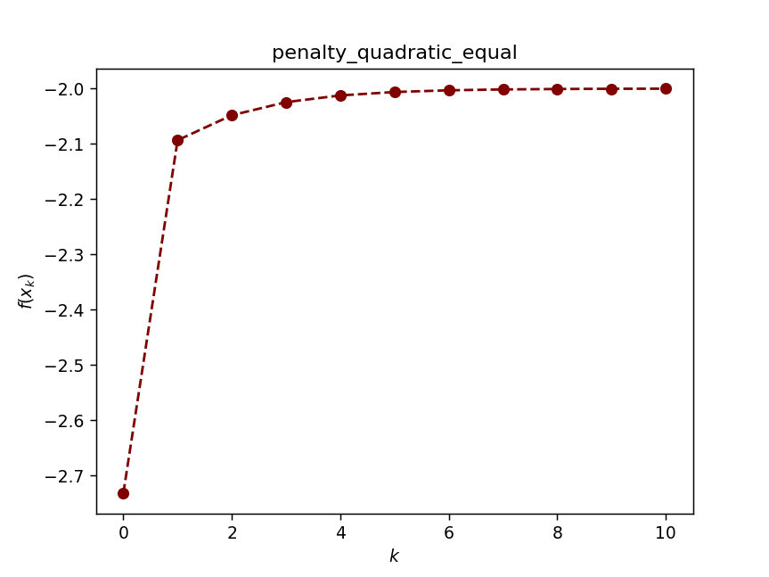
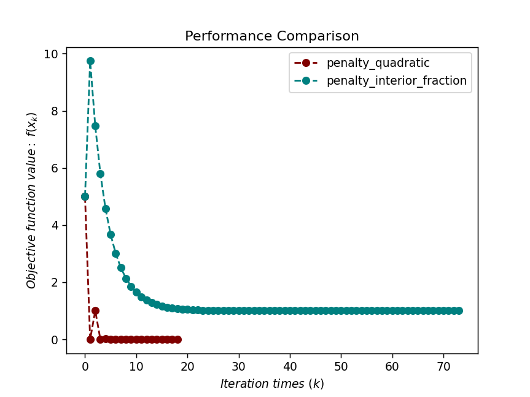
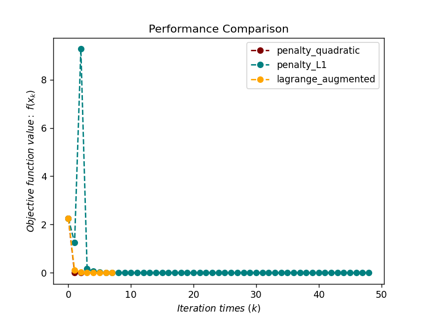

# Penalty function method

`pip install optimtool` to use the optimization algorithm

[optimtool source code](https://github.com/linjing-lab/optimtool)

&emsp;&emsp;This chapter considers constrained optimization problems:

$$
\min f(x), \\ s.t. x \in \chi \\ \tag {1}
$$

Here $\chi \subset R^n$ is the feasible domain of the problem. Unlike unconstrained problems, the independent variable $x$ in constrained optimization problems cannot take arbitrary values, which makes many unconstrained optimization algorithms unusable. For example, the point obtained by descending along the negative gradient direction in the gradient method may not be a feasible point, and the gradient of the objective function at the optimal solution to be found is not a zero vector. This makes constrained optimization problems much more complicated than unconstrained optimization problems. This chapter will introduce some penalty function methods, which add constraints as penalty terms to the objective function, thereby transforming them into the familiar unconstrained optimization problem solution. In addition, we also introduce the interior point method for the special constrained optimization problem of linear programming. Its ideas can be applied to solving many general problems, such as the Lasso problem.

```python
# Packages required for this chapter
%matplotlib widget
import optimtool as oo
import matplotlib.pyplot as plt
import sympy as sp
import numpy as np
```

```python
# Visualization function: parameter passing interface (color list, function value list, title list)
def test(colorlist, f_list, title):
handle = []
for j, z in zip(colorlist, f_list):
ln, = plt.plot([i for i in range(len(z))], z, c=j, marker='o', linestyle='dashed')
handle.append(ln)
plt.xlabel("$Iteration \ times \ (k)$")
plt.ylabel("$Objective \ function \ value: \ f(x_k)$")
plt.legend(handle, title)
plt.title("Performance Comparison")
plt.show()
return None
```

## 1. Quadratic penalty function method for equality constraints

&emsp;&emsp;There are various methods for solving unconstrained optimization problems. So, can we transform problem $(1)$ into an unconstrained optimization problem to solve it? For this reason, consider a simple case. Assume that the problem constraints only contain equality constraints, that is, consider the problem:

$$
\min_x f(x) \\ s.t. c_i(x)=0, i\in \epsilon \\ \tag {1.1}
$$

Where the variable $x \in R^n$ , $\epsilon$ is the index set of the equality constraint, and $c_i(x)$ is a continuous function. In some special cases, it is possible to directly solve the (nonlinear) equation set $c_i(x)=0$ to eliminate some variables and transform it into an unconstrained problem. But for the general function $c_i(x)$, the variable elimination operation is not feasible, and we must use other methods to deal with this problem. 
&emsp;&emsp;The idea of ​​the penalty function method is to transform the constrained optimization problem $(1.1)$ into an unconstrained optimization problem for solution. In order to ensure the approximate quality of the solution, the objective function of the unconstrained optimization problem is the objective function of the original constrained optimization problem plus the penalty term related to the constraint function. For points outside the feasible domain, the penalty term is positive, that is, the point is penalized. For the feasibleFor points outside the domain, the penalty term is 0, that is, no penalty is imposed. Therefore, the penalty term will force the solution of the unconstrained optimization problem to fall within the feasible domain.

&emsp;&emsp;For equality constraint problems, there are many ways to select the penalty term, and the simplest structure is the quadratic function.

&emsp;&emsp;`Definition 1.1` (quadratic penalty function for equality constraints) For the equality constraint optimization problem $(1.1)$, define the **quadratic penalty function**:

$$
P_E(x, \sigma)=f(x)+\dfrac{1}{2} \sigma \sum_{i \in \epsilon} c_i^2(x) \tag {1.2}
$$

Where the second term on the right side of the equation is called the penalty term, and $\sigma > 0$ is called the penalty factor.

&emsp;&emsp;Since this penalty function penalizes points that do not satisfy the constraints, the point sequence is generally outside the feasible domain during the iteration process, so it is also called **external point penalty function**. The characteristics of the quadratic penalty function are as follows: For infeasible points, when $\sigma$ becomes larger, the weight of the penalty term in the function increases, and minimizing the penalty function is equivalent to forcing its minimum point to approach the feasible domain; in the feasible domain, the global minimum point of $P_E(x, \sigma)$ is the same as the optimal solution of the constrained optimization problem.

> Example 1: Consider the optimization problem:
> 
> $$
> \min x+\sqrt{3}y, \\ s.t. x^2 + y^2 = 1. \\ \tag {1.3}
> $$
> 
> Consider the quadratic penalty function:
> 
> $$
> P_E(x, y, \sigma)=x+\sqrt{3}y+\dfrac{\sigma}{2}(x^2+y^2-1)^2 \tag {1.4}
> $$

```python
def dataSet1():
f, x1, x2 = sp.symbols("f x1 x2")
f = x1 + np.sqrt(3) * x2
c1 = x1**2 + x2**2 - 1
funcs = sp.Matrix([f])
cons = sp.Matrix([c1])
args = sp.Matrix([x1, x2])
x_0 = (-1, -1)
return funcs, args, cons, x_0
```

```python
funcs, args, cons, x_0 = dataSet1()
oo.constrain.equal.penalty_quadratic(funcs, args, cons, x_0)
```



&emsp;&emsp;From the above example, we can see that given the penalty factor $\sigma$, we can solve the minimum point of $P_E(x, \sigma)$ as an approximate solution to the original problem, but the actual situation is not always like this. The following example shows that when $\sigma$ is selected too small, the penalty function may have no lower bound.

> Example 2: Consider the optimization problem: 
> 
> $$
> \min -x^2+2y^2, \\ s.t. x=1. \\ \tag {1.5}
> $$
> 
> By eliminating variables, it is easy to know that the optimal solution is $(1,0)^T$, but consider the penalty function: 
> 
> $$
> P_E(x,y,\sigma)=-x^2+2y^2+\dfrac{\sigma}{2}(x-1)^2 \tag {1.6}
> $$
> 
> For any $\sigma \leq 2$ , the penalty function is unbounded.

&emsp;&emsp;The reason for the above phenomenon is that when the penalty factor is too small, the function drop at the infeasible point offsets the penalty of the penalty function for constraint violation. In fact, all external point penalty function methods have this problem, so the initial value of $\sigma$The selection should not be `too small`.

`Quadratic penalty function method`:

> Given $\sigma_1 > 0$, $x^0$, $k \leftarrow 1$. Penalty factor growth coefficient $\rho > 1$.
> 
> **while** Convergence criterion not reached **do**
> 
> &emsp;Using $x^k$ as the initial point, solve $x^{k+1}={\arg\min}_x P_E(x,\sigma_k)$.
> 
> &emsp;Select $\sigma_{k+1}=\rho \sigma_k$.
> 
> &emsp;$k \leftarrow k + 1$.
> 
> **end while**

&emsp;&emsp;The execution process of the algorithm is relatively intuitive: first select a series of exponentially growing penalty factors $\sigma_k$, and then solve the quadratic penalty function for each penalty factor The minimum point (or local minimum point) of $P_E(x,\sigma_k)$

&emsp;&emsp;The meaning of $\arg\min$ in the third line of the algorithm is one of the following:

1. $x^{k+1}$ is the global minimum solution of the penalty function $P_E(x,\sigma_k)$;

2. $x^{k+1}$ is the global minimum solution of the penalty function $P_E(x,\sigma_k)$;
3. $x^{k+1}$ is not a strict minimum solution of the penalty function $P_E(x,\sigma_k)$, but it approximately satisfies the first-order optimality condition $\nabla_x P_E(x^{k+1}, \sigma_k) \approx 0$

&emsp;&emsp;First, the selection of the parameter $\sigma_k$ needs to be very careful. If $\sigma_k$ grows too fast, the subproblem will be difficult to solve. If it grows too slowly, the number of external iterations required by the algorithm (while loop in the algorithm) will increase. A more reasonable approach is to determine the increase of $\sigma_k$ based on the difficulty of solving the current $P_E(x,\sigma_k)$. If the current subproblem converges quickly, a larger $\sigma_{k+1}$ can be selected in the next step. Otherwise, it is not advisable to increase $\sigma_k$ too much. Second, $P_E(x,\sigma)$ may be unbounded when $\sigma$ is small, and the iteration will diverge. When solving subproblems, once the iterative point divergence is detected, the iteration should be terminated immediately and the penalty factor should be increased. Third, the accuracy of the subproblem solution must be accurate enough. To ensure convergence, the error of the subproblem solution needs to be close to zero.

## 2. General Constraint Problems

&emsp;&emsp;Only equality constraint optimization problems are considered, so inequalityHow should we design a quadratic penalty function for an inequality-constrained problem? An inequality-constrained optimization problem has the following form:

$$
\min f(x), \\ s.t. c_i(x) \leq 0 , i \in I \\ \tag {2.1}
$$

Obviously, the biggest difference between it and the equality-constrained optimization problem is that it allows $c_i(x) < 0$ to occur. If the penalty function is defined as $||c(x)||^2$ in the original way, it will also penalize the feasible points of $c_i(x) < 0$, which is obviously not what we need. For **problem**, we must transform the original quadratic penalty function to obtain a new quadratic penalty function, which should have the following characteristics: only penalize those with $c_i(x) > 0$, and do not penalize the feasible points.

&emsp;&emsp;`Definition 2.1` (quadratic penalty function for inequality constraints) For the inequality constrained optimization problem $(2.1)$, define the **quadratic penalty function**:

$$
P_I(x,\sigma)=f(x)+\frac{\sigma}{2} \sum_{i \in I} \overline{c}_i(x)^2 \tag {2.2}
$$

The second term on the right side of the equation is called the penalty term, and $\overline{c}_i(x)$ is defined as:

$$
\overline{c}_i(x)=\max\{c_i(x), 0\} \tag {2.3}
$$

The constant $\sigma > 0$ is called the penalty factor.

&emsp;&emsp;Note that the function $h(t)=(\min\{t, 0\})^2$ is differentiable with respect to $t$, so the gradient of $P_I(x,\sigma)$ also exists, and the gradient algorithm can be used to solve the subproblem. However, in general, $P_I(x,\sigma)$ is not second-order differentiable, so the second-order algorithm (such as Newton's method) cannot be used directly to solve the subproblem, which is also the shortcoming of the quadratic penalty function for inequality constraint problems.

&emsp;&emsp;General constrained optimization problems may contain both equality constraints and inequality constraints, and their form is:

$$
\min f(x), \\ s.t. c_i(x)=0, i \in \epsilon, \\ c_i(x) \leq 0, i \in I \\ \tag {2.4}
$$

&emsp;&emsp;`Definition 2.2` (quadratic penalty function for general constraints) For the general constrained optimization problem $(2.4)$ , define **quadratic penalty function**:

$$
P(x,\sigma)=f(x)+\frac{\sigma}{2} [\sum_{i \in \epsilon} c_i(x)^2 + \sum_{i \in I} \overline{c}_i(x)^2] \tag {2.5}
$$

## 3. Other types of penalty function methods

### 3.1 Interior point penalty function method

&emsp;&emsp;The quadratic penalty functions introduced above are all exterior point penalty functions, that is, the independent variable $x$ is allowed to be outside the feasible domain of the original problem during the solution process. When the penalty factor tends to infinity, the optimal solution sequence of the subproblem approaches the optimal solution from outside the feasible domain. Naturally, if we want to make the optimal solution sequence of the subproblem approach the optimal solution from inside the feasible domain, we need to construct an interior point penalty function. As the name suggests, the interior point penalty function always requires that the independent variable $x$ cannot violate the constraint during iteration, so it is mainly used for inequality constraint optimization problems.

&emsp;&emsp;Consider the optimization problem $(2.1)$ with inequality constraints. In order to make the iteration point always in the feasible region, when the iteration point approaches the boundary of the feasible region, we need the penalty function to approach positive infinity. Commonly used penalty functions are **fractional penalty function**, **logarithmic penalty function**, etc.

&emsp;&emsp;`Definition 3.1.1` (Fractional Penalty Function) For the optimization problem $(2.1)$ with inequality constraints, define **fractional penalty function**:

$$
P_I(x,\sigma)=f(x)-\sigma \sum_{i \in I} \dfrac{1}{c_i(x)} \tag {3.1}
$$

&emsp;&emsp;`Definition 3.1.2` (Logarithmic Penalty Function) For the inequality constrained optimization problem $(2.1)$, define **Logarithmic Penalty Function**:

$$
P_I(x,\sigma)=f(x)-\sigma \sum_{i \in I} \ln(-c_i(x)) \tag {3.2}
$$

`Logarithmic Penalty Function Method`:

> Given $\sigma_0 > 0$, feasible solution $x^0$, $k \leftarrow 0$. The penalty factor is reduced by the coefficient $\rho \in (0,1)$.
> 
> **while** The convergence criterion has not been met **do**
> 
> &emsp;Using $x^k$ as the initial point, solve $x^{k+1}= \arg \min_x P_I(x,\sigma_k)$.
> 
> &emsp;Select $\sigma_{k+1}=\rho \sigma_k$.
> 
> &emsp;$k \leftarrow k + 1$.
> 
> **end while**

&emsp;&emsp;It is easy to see that the domain of $P_I(x,\sigma)$ is $\{x|c_i(x) < 0\}$, so it is self-reflected during the iteration process.The variable $x$ is strictly inside the feasible region. When $x$ approaches the boundary of the feasible region, due to the characteristics of the logarithmic penalty function, $PI(x,\sigma)$ will tend to positive infinity, which means that the minimum value of the logarithmic penalty function is strictly inside the feasible region. However, for the original problem $(2.1)$, its optimal solution is usually located at the boundary of the feasible region, that is, at least one of $c_i(x) \leq 0$ is equal. At this time, we need to adjust the penalty factor $\sigma$ to make it tend to 0, which will weaken the penalty effect of the logarithmic penalty function near the boundary.

> Consider the optimization problem:
> 
> $$
> \min x^2+2xy+y^2+2x-2y, \\ s.t. x \geq 0, y \geq 0 \\ \tag {3.3}
> $$
> 
> It is easy to find that the optimal solution of this problem is $x=0$, $y=1$. We consider the logarithmic penalty function
> 
> $$
> P_I(x,y,\sigma)=x^2+2xy+y^2+2x-2y-\sigma (\ln x+\ln y) \tag {3.4}
> $$
> 
> The minimum point of the logarithmic penalty function $P_I(x,y,\sigma)$ is getting closer and closer to the minimum point of the original problem, but when $x$ and $y$ approach the boundary of the feasible region, the logarithmic penalty function approaches positive infinity.

### 3.2 Exact penalty function method&emsp;&emsp;We have introduced the quadratic penalty function and the logarithmic penalty function. One of their common characteristics is that the penalty factor must be approached to positive infinity or zero when solving the problem, which will bring certain numerical difficulties. For some penalty functions, it is not necessary to let the penalty factor approach positive infinity (or zero) when solving the problem. This kind of penalty function is called an exact penalty function. In other words, if the penalty factor is selected appropriately, the solution obtained by minimizing the penalty function is exactly the exact solution to the original problem. This property is very useful when designing algorithms. Algorithms using exact penalty functions usually have better properties.

&emsp;&emsp;`Definition 3.2` (L1 penalty function) For general constrained optimization problems, define the L1 penalty function:

$$
P(x,\sigma)=f(x)+\sigma[\sum_{i \in \epsilon}|c_i(x)|+\sum_{i \in I} \overline{c}_i(x)] \tag {3.5}
$$

The second term on the right side of the equation is called the penalty term, $\overline{c}_i(x)$ is defined, and the constant $\sigma > 0$ is called the penalty factor.

## 4. Performance test of inequality constraint optimization algorithm

Two methods are used:

1. Quadratic penalty function method

2. Fractional penalty function method (interior point)

Test function:

$$
f = x_1^2 + (x_2 - 2)^2, \\ s.t. c_1 = 1 - x_1, \\ c_2 = 2 - x_2 \\ \tag {4.1}
$$

```python
def dataSet2():
f, x1, x2 = sp.symbols("f x1 x2")
f = x1**2 + (x2 - 2)**2
c1 = 1 - x1
c2 = 2 - x2
funcs = sp.Matrix([f])
cons = sp.Matrix([c1, c2])
args = sp.Matrix([x1, x2])
x_0 = (2, 3)
return funcs, args, cons, x_0
```

```python
def train1():
funcs, args, cons, x_0 = dataSet2()
f_list = []
title = ["penalty_quadratic", "penalty_interior_fraction"]
colorlist = ["maroon", "teal"]
_, _, f = oo.constrain.unequal.penalty_quadratic(funcs, args, cons, x_0, False, True, method="newton", sigma=10, epsilon=1e-6)
f_list.append(f)
_, _, f = oo.constrain.unequal.penalty_interior_fraction(funcs, args, cons, x_0, False, True, method="newton")
f_list.append(f)
return colorlist, f_list, title
```

```python
colorlist, f_list, title = train1()
# test(colorlist, f_list, title)
```



## 5. Performance test of hybrid equality constraint optimization algorithm

Two methods are used:

1. Quadratic penalty function method
2. L1 Penalty function method
3. Augmented Lagrangian method (*)

Test function:

$$
f = (x_1 - 2)^2 + (x_2 - 1)^2, \\ s.t. x_1 - 2x_2=0, \\ 0.25x_1^2 - x_2^2 - 1 \leq 0, \\ \tag {5.1}
$$

```python
def dataSet3():
f, x1, x2 = sp.symbols("f x1 x2")
f = (x1 - 2)**2 + (x2 - 1)**2
c1 = x1 - 2*x2
c2 = 0.25*x1**2 - x2**2 - 1
funcs = sp.Matrix([f])
cons_equal = sp.Matrix([c1])
cons_unequal = sp.Matrix([c2])
args = sp.Matrix([x1, x2])
x_0 = (0.5, 1)
return funcs, args, cons_equal, cons_unequal, x_0
```

```python
def train2():
funcs, args, cons_equal, cons_unequal, x_0 = dataSet3()
f_list = []
title = ["penalty_quadratic", "penalty_L1", "lagrange_augmented"]
colorlist = ["maroon", "teal", "orange"]
_, _, f = oo.constrain.mixequal.penalty_quadratic(funcs, args, cons_equal, cons_unequal, x_0, False, True)
f_list.append(f)
_, _, f = oo.constrain.mixequal.penalty_L1(funcs, args, cons_equal, cons_unequal, x_0, False, True)
f_list.append(f)
_, _, f = oo.constrain.mixequal.lagrange_augmented(funcs, args, cons_equal, cons_unequal, x_0, False, True)
f_list.append(f)
return colorlist, f_list, title
```

```python
colorlist, f_list, title = train2()
test(colorlist, f_list, title)
```



## References

[1] Liu Haoyang, Hu Jiang, Li Yongfeng, Wen Zaiwen. (2021). Optimization: Modeling, Algorithms and Theory. Beijing: Higher Education Press.

[2] Ruder S. An overview of gradient descent optimization algorithms[J]. arXiv preprint arXiv:1609.04747, 2016.

[3] Nocedal J. Optimization Methods for Large-Scale Machine Learning [J][J].Siam Review, 2016, 60(2).