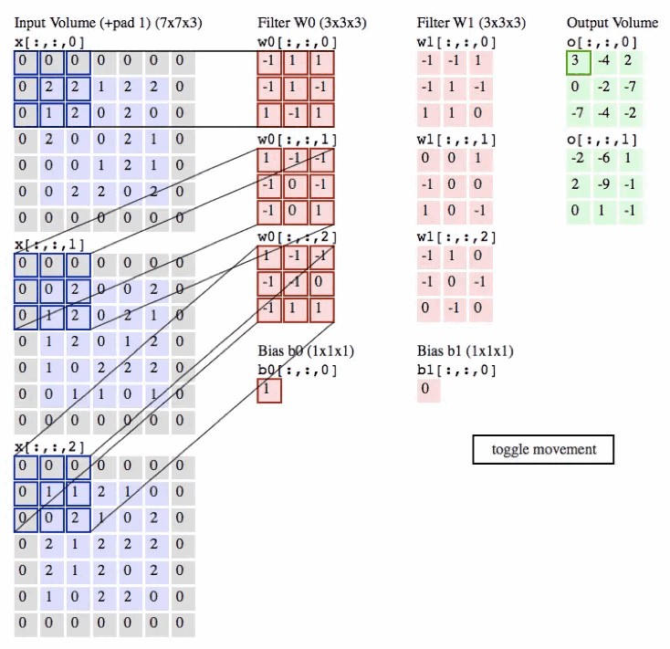

# अध्याय 2 सीएनएन मूल बातें

>यह ट्यूटोरियल आपको मॉडल संपीड़न के आकर्षण की सराहना करने के लिए आधार के रूप में सीएनएन नेटवर्क का उपयोग करेगा। कुछ बुनियादी छात्रों को सीएनएन को समझना चाहिए था, लेकिन क्या वे चैनल, कर्नेल, फ़िल्टर, फ़ीचर मैप और लेयर जैसे शब्दों के बीच अंतर बता सकते हैं? यदि आप अंतर नहीं बता सकते हैं, तो कृपया प्रश्नों के साथ इस ट्यूटोरियल को पढ़ें।

## 2.1 सीएनएन का परिचय

&emsp;&emsp;सीएनएन नेटवर्क, जिसे कन्वोल्यूशनल न्यूरल नेटवर्क के रूप में भी जाना जाता है, एक प्रकार का गहन शिक्षण नेटवर्क है जिसे विशेष रूप से समान ग्रिड संरचना, जैसे छवियों (2डी ग्रिड) और ध्वनि संकेतों (1डी नेटवर्क) के साथ डेटा संसाधित करने के लिए डिज़ाइन किया गया है। सीएनएन ने छवि और वीडियो पहचान, छवि वर्गीकरण और चिकित्सा छवि विश्लेषण जैसे क्षेत्रों में उल्लेखनीय सफलता हासिल की है।

### 2.1.1 कोर रचना
&emsp;&emsp;सीएनएन का मुख्य विचार मैनुअल फीचर निष्कर्षण के बिना इनपुट डेटा की सुविधाओं को स्वचालित रूप से और प्रभावी ढंग से निकालने के लिए कनवल्शनल परतों का उपयोग करना है। वर्गीकरण, पता लगाने या विभाजन जैसे कार्यों को करने के लिए इन सुविधाओं को धीरे-धीरे नेटवर्क की कई परतों के माध्यम से अमूर्त और संयोजित किया जाता है। CNN में आमतौर पर निम्नलिखित प्रकार की परतें होती हैं:

1. **संवादात्मक परतें**:
   ये परतें कनवल्शन ऑपरेशंस के माध्यम से इनपुट डेटा की स्थानीय विशेषताओं को निकालती हैं। प्रत्येक कनवल्शन परत में एकाधिक होते हैंएक कन्वोल्यूशन कर्नेल (कर्नेल) विभिन्न फीचर मैप (फीचर मैप्स) तैयार कर सकता है।

2. **सक्रियण परतें**:
   आम तौर पर कनवल्शनल परत के बाद, गैर-रैखिकता पेश की जाती है ताकि नेटवर्क अधिक जटिल विशेषताएं सीख सके। सबसे अधिक इस्तेमाल किया जाने वाला सक्रियण फ़ंक्शन ReLU (रेक्टिफाइड लीनियर यूनिट) है।

3. **पूलिंग परतें**:
   इन परतों का उपयोग फ़ीचर मानचित्र के स्थानिक आकार को कम करने, बाद की परतों के मापदंडों और गणनाओं की संख्या को कम करने और फ़ीचर पहचान को अधिक स्थिर बनाने के लिए किया जाता है।

4. **पूरी तरह से जुड़ी हुई परतें**:
   आमतौर पर सीएनएन के अंत में स्थित, कन्वेन्शनल लेयर या पूलिंग लेयर द्वारा उच्च-आयामी फीचर वेक्टर आउटपुट को वर्गीकरण लेबल जैसे अंतिम आउटपुट में परिवर्तित किया जाता है।

### 2.1.2 लाभ
&emsp;&emsp;सीएनएन पारंपरिक मशीन सीखने के तरीकों में मैन्युअल फीचर निष्कर्षण की कठिन प्रक्रिया से बचते हुए, परतों के सुपरपोजिशन और संयोजन के माध्यम से कच्चे डेटा से उपयोगी फीचर प्रतिनिधित्व को स्वचालित रूप से और प्रभावी ढंग से सीख सकता है। इसके निम्नलिखित फायदे हैं:
1. पैरामीटर साझाकरण: कनवल्शन परत में कनवल्शन कर्नेल के लिए पैरामीटर के समान सेट का पुन: उपयोग करके, सीएनएन कम संख्या में पैरामीटर के साथ बड़े पैमाने पर इनपुट डेटा को संसाधित कर सकता है।
2. स्थानीय कनेक्शन: कनवल्शनल परत में न्यूरॉन्स केवल इनपुट डेटा के एक स्थानीय क्षेत्र से जुड़े होते हैं, जो नेटवर्क को स्थानीय सुविधाओं पर ध्यान केंद्रित करने की अनुमति देता है।और मॉडल के स्थान उपयोग को बढ़ाएं।
3. अनुवाद अपरिवर्तनीयता: पूलिंग परत के माध्यम से, सीएनएन इनपुट डेटा के छोटी रेंज के अनुवादों में अपरिवर्तनीयता बनाए रखने में सक्षम है, जो छवियों में वस्तुओं की पहचान करने के लिए विशेष रूप से महत्वपूर्ण है।

&emsp;&emsp;नीचे दी गई तस्वीर एक दृश्य उदाहरण है। विवरण के लिए, कृपया [cnn-explainer](https://poloclub.github.io/cnn-explainer) देखें।

## 2.2 संबंधित शब्दों की व्याख्या

- चैनल: आमतौर पर डेटा के गहराई आयाम को संदर्भित करता है। उदाहरण के लिए, एक रंगीन छवि में तीन रंग चैनल होते हैं: लाल, हरा और नीला (आरजीबी)। सीएनएन में, इनपुट परत में चैनलों की संख्या छवि के रंगीन चैनलों की संख्या से मेल खाती है, जबकि छिपी हुई परत में चैनलों की संख्या परत में फिल्टर की संख्या से मेल खाती है, यानी, उत्पन्न फीचर मानचित्रों की संख्या प्रत्येक फ़िल्टर द्वारा.
- कनवल्शन कर्नेल (कर्नेल): कनवल्शन परत में फीचर निष्कर्षण के लिए उपयोग किया जाने वाला एक छोटा मैट्रिक्स। कनवल्शन ऑपरेशन करते समय, कनवल्शन कर्नेल इनपुट डेटा के प्रत्येक क्षेत्र के माध्यम से स्लाइड करता है, इसके संबंधित स्थानीय क्षेत्र पर तत्व गुणन संचालन करता है, और फिर अंत में कनवल्शन आउटपुट का एक तत्व बनाने के लिए उन्हें सारांशित करता है। कनवल्शन कर्नेल डेटा की स्थानीय विशेषताओं, जैसे किनारे, बनावट आदि को कैप्चर कर सकता है।
- फ़िल्टर: इसमें कई कनवल्शन कर्नेल होते हैं, जिनकी संख्या इनपुट डेटा के चैनलों की संख्या के बराबर होती है। उदाहरण के लिए, ए के लिएतीन आरजीबी रंग चैनलों वाली रंगीन छवि के लिए, एक फ़िल्टर में तीन कनवल्शन कर्नेल होंगे, प्रत्येक रंग चैनल के लिए एक। जब संपूर्ण फ़िल्टर इनपुट डेटा पर लागू किया जाता है, तो एक द्वि-आयामी फ़ीचर मानचित्र (फ़ीचर मैप) उत्पन्न होगा। फ़िल्टर विशिष्ट प्रकार की सुविधाओं का पता लगा सकता है, और विभिन्न फ़िल्टर विभिन्न सुविधाओं को कैप्चर कर सकते हैं।
- फ़ीचर मैप: एक विशिष्ट कनवल्शन फ़िल्टर (फ़िल्टर) के माध्यम से इनपुट डेटा (जैसे छवियां) से निकाले गए फ़ीचर प्रतिनिधित्व को संदर्भित करता है। जब इनपुट डेटा एक संकेंद्रित परत से होकर गुजरता है, तो इस परत का प्रत्येक फ़िल्टर स्वतंत्र रूप से इनपुट डेटा पर लागू होता है, जिससे एक नया द्वि-आयामी सरणी बनता है, जो फीचर मैप है।
- परत: सीएनएन में कई परतें होती हैं, प्रत्येक परत एक कनवल्शन परत, पूलिंग परत, पूरी तरह से जुड़ी हुई परत आदि हो सकती है। प्रत्येक कनवल्शनल परत में कई फ़िल्टर होते हैं। प्रत्येक फ़िल्टर एक कनवल्शन ऑपरेशन के माध्यम से एक फीचर मैप उत्पन्न करता है, और परत के आउटपुट को बनाने के लिए सभी फीचर मैप को एक साथ रखा जाता है।

**संपर्क और अंतर:**

- कर्नेल मूल इकाई है जो फ़िल्टर का निर्माण करती है। मल्टी-चैनल इनपुट को संयोजित करते समय, प्रत्येक चैनल के पास संबंधित कर्नेल होता है, और उनका संग्रह एक फ़िल्टर बनाता है।
- फ़िल्टर कर्नेल का एक संग्रह है जिसका उपयोग इनपुट डेटा से सुविधाओं के एक विशिष्ट सेट को निकालने के लिए किया जाता है।
- चैनल डेटा के गहराई आयाम को संदर्भित करता है, जहां इनपुट डेटा का चाएननेल आमतौर पर एक प्राकृतिक छवि के रंग चैनल से मेल खाता है, और कनवल्शनल परत द्वारा आउटपुट चैनल की संख्या परत में फिल्टर की संख्या से निर्धारित होती है।
- परत सीएनएन में एक घटक इकाई है, और उनके कार्यों के अनुसार विभिन्न प्रकार की परतें होती हैं। फीचर निष्कर्षण के लिए फ़िल्टर का उपयोग करते हुए कन्वेन्शनल लेयर उनमें से एक है।
- कर्नेल/फ़िल्टर स्थानीय सुविधाओं के निष्कर्षण पर केंद्रित है, चैनल सुविधाओं की विविधता और प्रतिनिधित्व पर केंद्रित है, और परत नेटवर्क संरचना का एक अभिन्न अंग है।

निम्नलिखित चित्र 3-चैनल छवि पर एक कनवल्शन ऑपरेशन दिखाता है:

&emsp;&emsp;उनमें से, `3 × 3 × 3` के आयाम वाले तीन कनवल्शन कर्नेल (जिन्हें फ़िल्टर भी कहा जाता है) चैनल हैं, जो क्रमशः कनवल्शन कर्नेल की ऊंचाई, चौड़ाई और गहराई का प्रतिनिधित्व करते हैं। कनवल्शन ऑपरेशन पहले तीन इनपुट चैनलों पर कनवल्शन ऑपरेशन करता है, फिर कनवल्शन परिणाम जोड़ता है, और अंत में एक फीचर मैप आउटपुट करता है।

आइए एक उदाहरण देखें। क्योंकि 3डी डेटा को विज़ुअलाइज़ करना मुश्किल है, सभी डेटा (इनपुट डेटा वॉल्यूम नीला है, वेट डेटा वॉल्यूम लाल है, और आउटपुट डेटा वॉल्यूम हरा है) कॉलम में गहराई वाले स्लाइस में व्यवस्थित हैं। । दिखाओ।

&emsp;&emsp;कन्वोल्यूशन ऑपरेशन अनिवार्य रूप से फ़िल्टर और इनपुट डेटा के स्थानीय क्षेत्र के बीच एक डॉट उत्पाद है। कन्वेन्शनल परतों का आमतौर पर उपयोग किया जाने वाला कार्यान्वयनवर्तमान विधि इसका लाभ उठाने और संकेंद्रित परत के आगे के प्रसार को एक विशाल मैट्रिक्स गुणन में बदलने के लिए है।

## 2.3 मॉडल संपीड़न के लिए सामान्य मूल्यांकन संकेतक

&emsp;&emsp;मॉडल संपीड़न एक ऐसी तकनीक है जो गहन शिक्षण मॉडल के आकार और गणना मात्रा को कम करती है। इसका उद्देश्य मॉडल के प्रदर्शन को बनाए रखते हुए संसाधन खपत को कम करना है, जिससे मॉडल संसाधन-बाधित उपकरणों पर तैनाती के लिए अधिक उपयुक्त हो जाता है। मॉडल संपीड़न के लिए सामान्य मूल्यांकन मेट्रिक्स में शामिल हैं:

### 2.3.1 सटीकता

&emsp;&emsp;सटीकता संपीड़न से पहले और बाद में विशिष्ट कार्यों पर तुलना मॉडल की सटीकता को संदर्भित करती है, जैसे वर्गीकरण सटीकता, पता लगाने की सटीकता, आदि। हालाँकि संपीड़न से कुछ सटीकता की हानि हो सकती है, लक्ष्य स्वीकार्य सटीकता बनाए रखते हुए संपीड़ित करना है।

### 2.3.2 पैरामीटर मात्रा

&emsp;&emsp;पैरामीटरों की संख्या (पैराम्स) मॉडल में प्रशिक्षण योग्य मापदंडों की कुल संख्या को संदर्भित करती है, आमतौर पर सभी भार और पूर्वाग्रहों की कुल संख्या को संदर्भित करती है जो गहन शिक्षण मॉडल बनाते हैं। संपीड़न के बाद मॉडल मापदंडों की संख्या आमतौर पर काफी कम हो जाती है।

### 2.3.3 मॉडल आकार

&emsp;&emsp;मॉडल आकार संपीड़न प्रभाव को मापने के लिए सबसे सहज संकेतक है, और आमतौर पर मॉडल फ़ाइल के भंडारण आकार (जैसे एमबी) द्वारा मापा जाता है। गणना सूत्र है: `आकार = मापदंडों की संख्या * बैंडविड्थ`

उदाहरण के लिए, एक मॉडल की पैरामीटर मात्रा 61M है, यह मानते हुए कि 32-बिट फ़्लोटिंग पॉइंट नंबरों को स्टोर करने के लिए उपयोग किया जाता हैभंडारण, तो मॉडल का आकार है:
$$ 61एम * 4बाइट्स(32बिट्स) = 224एमबी(224 * 10^6 बाइट्स) $$

### 2.3.4 एमएसी

&emsp;&emsp;MACs (मल्टीप्ली-एक्युमुलेट ऑपरेशंस की संख्या) मल्टीप्ली-एक्युमुलेट ऑपरेशंस की संख्या को दर्शाता है। यह कंप्यूटर के लिए फ्लोटिंग-पॉइंट ऑपरेशंस करने के लिए बुनियादी इकाई है, जिसमें गुणन ऑपरेशन और संचय (जोड़) ऑपरेशन शामिल हैं। गहन शिक्षण में, एमएसी का उपयोग कनवल्शनल न्यूरल नेटवर्क (सीएनएन) में कनवल्शन ऑपरेशन के कम्प्यूटेशनल प्रयास का वर्णन करने के लिए किया जाता है। विशेष रूप से, जब हम एक कनवल्शनल परत में आगे प्रसार करते हैं, तो प्रत्येक कनवल्शन कर्नेल इनपुट फीचर मैप के स्थानीय क्षेत्र के साथ एक तत्व-वार गुणन करता है, और फिर सभी डॉट उत्पाद आउटपुट फीचर मैप पर एक मूल्य प्राप्त करने के लिए परिणाम जमा करते हैं। . इस प्रक्रिया में प्रत्येक गुणन और उसके बाद संचय संचालन एक MAC का गठन करता है।

### 2.3.5 फ्लॉप

&emsp;&emsp;FLOPs (फ़्लोटिंग पॉइंट ऑपरेशंस की संख्या, FLOPs) मॉडल द्वारा आगे का अनुमान लगाने के लिए आवश्यक फ़्लोटिंग पॉइंट ऑपरेशंस की संख्या को संदर्भित करता है। FLOP मॉडल के लिए आवश्यक कम्प्यूटेशनल संसाधनों के समानुपाती होते हैं।

### 2.3.6 संपीड़न अनुपात

&emsp;&emsp;संपीड़न अनुपात मूल मॉडल आकार और संपीड़ित मॉडल आकार का अनुपात है। उच्च संपीड़न अनुपात का मतलब है छोटे मॉडल आकार, लेकिन प्रदर्शन दंड के साथ भी आ सकता है।

### 2.3.7 अनुमान गति

&emsp;&emsp;अनुमान गति मॉडल को एक आगे प्रसार करने में लगने वाले समय को संदर्भित करती है। मॉडल संपीड़न आम तौर पर अनुमान गति में सुधार करता है क्योंकि यह कम्प्यूटेशनल प्रयास और मॉडल आकार को कम करता है।

## संदर्भ लिंक

- <https://blog.csdn.net/weixin_38481963/article/details/109906338>
- <https://cs231n.github.io/convolutional-networks/>
- <https://poloclub.github.io/cnn-explainer/>