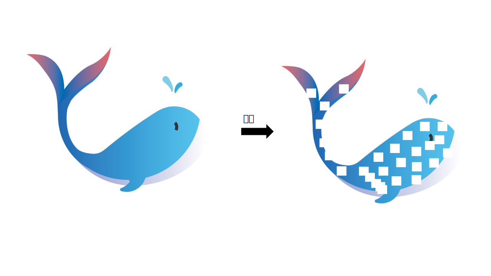
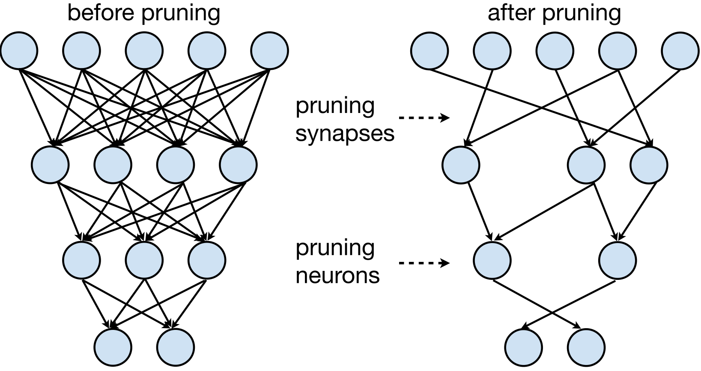
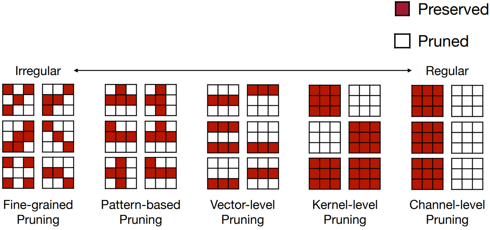
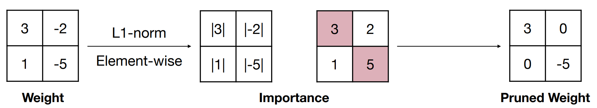

# अध्याय 3 मॉडल प्रूनिंग

## 3.1 मॉडल प्रूनिंग का परिचय

&emsp;&emsp;मॉडल प्रूनिंग मॉडल संपीड़न में एक महत्वपूर्ण तकनीक है। इसका मूल विचार मॉडल में महत्वहीन वजन और शाखाओं को छांटना, नेटवर्क संरचना को विरल करना और फिर छोटे मापदंडों के साथ एक मॉडल प्राप्त करना और मेमोरी को कम करना है तेज़, जो उन अनुप्रयोगों के लिए विशेष रूप से महत्वपूर्ण है जिन्हें सीमित संसाधनों वाले उपकरणों पर मॉडल चलाने की आवश्यकता होती है। हालाँकि, काट-छाँट से मॉडल के प्रदर्शन में कमी भी आ सकती है, इसलिए मॉडल के आकार और प्रदर्शन के बीच संतुलन बिठाने की जरूरत है। तंत्रिका नेटवर्क में न्यूरॉन्स के कनेक्शन को गणितीय रूप से वजन मैट्रिक्स के रूप में दर्शाया जाता है, इसलिए प्रूनिंग का मतलब वजन मैट्रिक्स में कुछ तत्वों को शून्य तत्वों में बदलना है। बड़ी संख्या में शून्य तत्वों वाले इन काटे गए आव्यूहों को विरल आव्यूह कहा जाता है, जबकि अधिकांश गैर-शून्य तत्वों वाले आव्यूहों को सघन आव्यूह कहा जाता है। प्रूनिंग प्रक्रिया को नीचे दिए गए चित्र में दिखाया गया है। इसका उद्देश्य महत्वहीन सिनैप्स (सिनैप्स) या न्यूरॉन्स (न्यूरॉन्स) को हटाना है।

&emsp;&emsp;तंत्रिका नेटवर्क में, मॉडल भार आमतौर पर न्यूरॉन्स, यानी सिनैप्स के बीच संबंध को संदर्भित करता है। जब मॉडल प्रूनिंग में "वजन हटाना" आमतौर पर न्यूरॉन्स को हटाने के बजाय न्यूरॉन्स के बीच कनेक्शन की संख्या को कम करने को संदर्भित करता है। एक सरल रैखिक तंत्रिका नेटवर्क के लिए, इसका सूत्र इस प्रकार व्यक्त किया जा सकता है:

$$
य=डब्ल्यू
$$

&emsp;&emsp;उनमें से, $W$ वजन है, $X$ इनपुट है, यानी न्यूरॉन। प्रूनिंग का विशिष्ट कार्यान्वयन भार मैट्रिक्स में कुछ तत्वों को शून्य तत्वों में बदलना है। बड़ी संख्या में शून्य तत्वों वाले इन काटे गए आव्यूहों को विरल आव्यूह कहा जाता है, जबकि अधिकांश गैर-शून्य तत्वों वाले आव्यूहों को सघन आव्यूह कहा जाता है।

## 3.2 प्रूनिंग क्या है?

&emsp;&emsp;प्रूनिंग को विभिन्न मानकों के अनुसार विभाजित किया जा सकता है। निम्नलिखित मुख्य रूप से तीन पहलुओं की व्याख्या करता है: प्रूनिंग प्रकार, प्रूनिंग स्कोप, और प्रूनिंग ग्रैन्युलैरिटी।

### 3.2.1 छंटाई का प्रकार
&emsp;&emsp;प्रूनिंग के प्रकार के अनुसार, प्रूनिंग को असंरचित प्रूनिंग और संरचित प्रूनिंग में विभाजित किया गया है।

#### 3.2.1.1 असंरचित छंटाई

&emsp;&emsp;असंरचित छंटाई महत्वहीन न्यूरॉन्स को हटा देती है, तदनुसार, गणना के दौरान काटे गए न्यूरॉन्स और अन्य न्यूरॉन्स के बीच के कनेक्शन को नजरअंदाज कर दिया जाएगा। चूँकि काट-छाँट किया गया मॉडल आमतौर पर बहुत विरल होता है और मूल मॉडल की संरचना को नष्ट कर देता है, इस प्रकार की विधि को असंरचित छँटाई कहा जाता है। असंरचित छंटाई नेटवर्क में वजन की स्थिति की परवाह नहीं करती है, बल्कि केवल यह तय करती है कि एक निश्चित मानदंड (उदाहरण के लिए, वजन का पूर्ण मूल्य) के आधार पर वजन को हटाया जाए या नहीं। वज़न हटाने के बाद, शेष वज़न वितरण विरल होता है, यानी अधिकांश वज़न शून्य होते हैं। असंरचित छंटाई मॉडल के मापदंडों और सैद्धांतिक गणनाओं की मात्रा को काफी कम कर सकती है, लेकिन मौजूदा हार्डवेयर आर्किटेक्चर की गणना पद्धति नहीं कर सकतीइसके त्वरण के लिए आमतौर पर परिणामी मॉडल की विरलता का प्रभावी ढंग से दोहन करने के लिए विशेष हार्डवेयर या सॉफ़्टवेयर समर्थन की आवश्यकता होती है। इसलिए, वास्तविक चलने की गति में सुधार नहीं किया जा सकता है, और इसे तेज करने के लिए विशिष्ट हार्डवेयर को डिज़ाइन करने की आवश्यकता है।

#### 3.2.1.2 संरचित छंटाई

&emsp;&emsp;स्ट्रक्चरल प्रूनिंग मॉडल की संगठनात्मक संरचना पर अधिक ध्यान देता है। यह उन हिस्सों को पहचानने और हटाने का प्रयास करता है जो संपूर्ण मॉडल संरचना में महत्वपूर्ण नहीं हैं। इस छंटाई दृष्टिकोण में संपूर्ण न्यूरॉन्स, गुठली, परतें, या अधिक जटिल संरचनाओं को हटाना शामिल हो सकता है। प्रूनिंग आमतौर पर मूल इकाई के रूप में एक फिल्टर या संपूर्ण नेटवर्क परत के साथ की जाती है। जब किसी फ़िल्टर को काट दिया जाता है, तो उसका पिछला फ़ीचर मैप और अगला फ़ीचर मैप तदनुसार बदल जाएगा, लेकिन मॉडल की संरचना नष्ट नहीं होती है और अभी भी GPU या अन्य हार्डवेयर द्वारा त्वरित किया जा सकता है, इसलिए इस प्रकार की विधि को स्ट्रक्चर्ड प्रूनिंग कहा जाता है।

&emsp;&emsp;असंरचित प्रूनिंग व्यक्तिगत महत्वहीन भार को हटाने पर ध्यान केंद्रित करती है, जिससे वजन मैट्रिक्स विरल हो जाता है, जबकि संरचित प्रूनिंग संपूर्ण तंत्रिका इकाइयों या फिल्टर को हटाने पर केंद्रित होती है, जिसके परिणामस्वरूप नेटवर्क संरचना में परिवर्तन होते हैं, जैसे परतों या चैनलों की संख्या कम करना . व्यावहारिक अनुप्रयोगों में, संरचित प्रूनिंग आमतौर पर बेहतर प्रदर्शन और संपीड़न अनुपात प्रदान करता है क्योंकि यह मॉडल की आंतरिक संरचना का बेहतर उपयोग कर सकता है। हालाँकि, संरचित प्रूनिंग का कार्यान्वयन आमतौर पर अधिक जटिल होता है और इसके लिए अधिक कंप्यूटिंग संसाधनों और मॉडल की गहन समझ की आवश्यकता होती है। असंरचित छंटाई अपेक्षाकृत सरल है, लेकिन संरचित छंटाई के संपीड़न प्रभाव को प्राप्त नहीं कर सकती है।

### 3.2.2 प्रूनिंग रेंज
&emsp;&emsp;प्रूनिंग के दायरे के अनुसार, प्रूनिंग को स्थानीय प्रूनिंग और वैश्विक प्रूनिंग में विभाजित किया गया है।

#### 3.2.2.1 आंशिक छंटाई

&emsp;&emsp;स्थानीय छंटाई मॉडल में एकल वजन या पैरामीटर पर केंद्रित होती है। यह प्रूनिंग विधि आम तौर पर मॉडल में प्रत्येक वजन का मूल्यांकन करती है और फिर निर्णय लेती है कि इसे शून्य पर सेट किया जाए या नहीं। स्थानीय छंटाई का उद्देश्य उन वजनों को हटाना है जिनका मॉडल आउटपुट पर थोड़ा प्रभाव पड़ता है। यह विधि वेट प्रूनिंग, न्यूरॉन प्रूनिंग, या यहां तक ​​कि चैनल प्रूनिंग (एक कनवल्शनल न्यूरल नेटवर्क में संपूर्ण कनवल्शनल चैनल को हटाना) हो सकती है। स्थानीय प्रूनिंग की विशेषता यह है कि यह मॉडल के अन्य भागों पर निर्भर हुए बिना मॉडल के प्रत्येक भाग पर स्वतंत्र रूप से काम करता है।

### 3.2.2.2 वैश्विक छंटाई

&emsp;&emsp;ग्लोबल प्रूनिंग मॉडल की समग्र संरचना और प्रदर्शन पर विचार करता है। यह प्रूनिंग विधि संपूर्ण न्यूरॉन्स, गुठली, परतों, या अधिक जटिल संरचनाओं जैसे कि गुठली समूहों को हटा सकती है। वैश्विक प्रूनिंग का लक्ष्य मॉडल की जटिलता को कम करते हुए पूरे मॉडल के प्रदर्शन को अनुकूलित करना है। ग्लोबल प्रूनिंग के लिए आमतौर पर मॉडल की समग्र संरचना की गहरी समझ की आवश्यकता होती है और इसमें मॉडल आर्किटेक्चर का नया डिज़ाइन शामिल हो सकता है। यह दृष्टिकोण मॉडल के अंतिम प्रदर्शन पर अधिक प्रभाव डाल सकता है क्योंकि यह मॉडल की समग्र सुविधा निष्कर्षण क्षमताओं को बदल देता है।

### 3.2.3 बारीक काट-छाँट
&emsp;&emsp;प्रूनिंग ग्रैन्युलैरिटी के अनुसार, प्रूनिंग को बारीक-बारीक प्रूनिंग (फाइन-ग्रेन्ड प्रूनिंग) में विभाजित किया जा सकता है।इनेड प्रूनिंग), पैटर्न-आधारित प्रूनिंग, वेक्टर-लेवल प्रूनिंग, कर्नेल-लेवल प्रूनिंग और चैनल-लेवल प्रूनिंग।

जैसा कि नीचे दिए गए चित्र में दिखाया गया है, यह बारीक छंटाई से लेकर चैनल-स्तरीय छंटाई तक की प्रगति को दर्शाता है। छंटाई अधिक से अधिक नियमित और संरचित हो जाती है।

#### 3.2.3.1 बारीक छंटाई

&emsp;&emsp;बारीक छंटाई वजन मैट्रिक्स में मनमाने मूल्यों को हटा देती है। बारीक-बारीक छंटाई उच्च संपीड़न अनुपात प्राप्त कर सकती है, लेकिन हार्डवेयर के अनुकूल नहीं है, इसलिए गति लाभ सीमित है।

#### 3.2.3.2 पैटर्न-आधारित छंटाई

&emsp;&emsp;N:M विरलता DNN की विरलता का प्रतिनिधित्व करती है। एन:एम स्पार्सिटी के लिए आवश्यक है कि प्रत्येक एम लगातार वजन में से अधिकतम एन गैर-शून्य हो। यह व्यवहार में मैट्रिक्स गुणन को गति देने के लिए NVIDIA के विरल टेंसर कोर का लाभ उठा सकता है। एनवीडिया एम्पीयर ए100 स्पार्स टेन्सर कोर से सुसज्जित है जो 2:4 संरचनाओं की बारीक-बारीक विरलता को तेज करता है, नेटवर्क भार की बारीक-बारीक विरलता का पूरा फायदा उठाता है। वे सप्लाई करते हैंगहन शिक्षण के केंद्र में मैट्रिक्स गुणा-संचित नौकरियों के लिए सटीकता का त्याग किए बिना गहन गणित के लिए अधिकतम 2x थ्रूपुट।

&emsp;&emsp;विरल मैट्रिक्स W को पहले संपीड़ित किया जाएगा। संपीड़ित मैट्रिक्स गैर-शून्य डेटा मान संग्रहीत करता है, जबकि मेटाडेटा मूल मैट्रिक्स W में संबंधित गैर-शून्य तत्वों की सूचकांक जानकारी संग्रहीत करता है। विशेष रूप से, मेटाडेटा W में गैर-शून्य तत्वों की पंक्ति संख्याओं और स्तंभ संख्याओं को दो स्वतंत्र एक-आयामी सरणियों में संपीड़ित करेगा। ये दो सरणियाँ मेटाडेटा में संग्रहीत सूचकांक जानकारी हैं। जैसा कि नीचे दिया गया है:

&emsp;&emsp;यहां हम एक पैटर्न बनाने के लिए NVIDIA 2:4 को एक उदाहरण के रूप में लेते हैं, जैसा कि नीचे दिए गए चित्र में दिखाया गया है, क्योंकि यह 2:4 है, अर्थात, 4 में से 2 को निकालकर 0 पर सेट किया जा सकता है गणना करें कि कुल मिलाकर 6 अलग-अलग पैटर्न हैं; फिर पैटर्न के साथ मैट्रिक्स संचालन को सुविधाजनक बनाने के लिए वेट मैट्रिक्स को nx4 प्रारूप में परिवर्तित करें। ऑपरेशन का परिणाम अधिकतम सूचकांक प्राप्त करने के लिए n आयाम पर argmax निष्पादित करें। सूचकांक पैटर्न से मेल खाता है), और फिर मास्क के सूचकांक के अनुरूप पैटर्न मान भरें।

###3.2.3.3 वेक्टर-स्तरीय छंटाई

&emsp;&emsp;वेक्टर-स्तरीय प्रूनिंग पंक्तियों या स्तंभों में वजन कम करता है।

### 3.2.3.4 कर्नेल-स्तरीय छंटाई

&emsp;&emsp;कर्नेल-स्तरीय प्रूनिंग कनवल्शन कर्नेल (फ़िल्टर) की इकाइयों में वजन कम करता है।

### 3.2.3.5 चैनल-स्तरीय छंटाई

&emsp;&emsp;चैनल-स्तरीय प्रूनिंग चैनलों की इकाइयों में वजन कम करता है।

> नोट: बारीक-बारीक, पैटर्न-आधारित प्रूनिंग, वेक्टर-स्तर और कर्नेल-स्तर के तरीकों में पैरामीटर और मॉडल में अलग-अलग अंतर होते हैं, प्रदर्शन के बीच एक निश्चित संतुलन हासिल किया गया है, लेकिन नेटवर्क की टोपोलॉजी ही बदल गई है, जिसके लिए विशेष की आवश्यकता होती है इस विरल ऑपरेशन का समर्थन करने के लिए एल्गोरिदम डिज़ाइन, जो असंरचित छंटाई है।
> चैनल-स्तरीय प्रूनिंग फ़िल्टर बैंक और नेटवर्क में फ़ीचर चैनलों की संख्या को बदल देती है। प्राप्त मॉडल विशेष एल्गोरिदम डिज़ाइन के बिना चल सकता है और एक संरचित प्रूनिंग है।

## 3.3 काट-छाँट क्यों?

&उन्हेंsp;&emsp;मॉडल में कटौती क्यों की जा सकती है? अर्थात्, मॉडल प्रूनिंग मुख्य रूप से प्रभावी है क्योंकि यह उन मापदंडों की पहचान कर सकता है और हटा सकता है जिनका मॉडल प्रदर्शन पर थोड़ा प्रभाव पड़ता है, जिससे मॉडल जटिलता और कम्प्यूटेशनल लागत कम हो जाती है। यह प्रक्रिया आमतौर पर मॉडल की सटीकता को महत्वपूर्ण रूप से प्रभावित नहीं करती है, खासकर जब मॉडल स्वयं ओवरफिटिंग हो सकता है, तो प्रूनिंग मॉडल को नए डेटा को बेहतर ढंग से सामान्यीकृत करने में मदद कर सकती है।

- हान सॉन्ग, एट अल। (2015) ने "कुशल तंत्रिका नेटवर्क के लिए वजन और कनेक्शन दोनों सीखना" पेपर में एक प्रूनिंग विधि का प्रस्ताव दिया, जो प्रशिक्षण के दौरान धीरे-धीरे छोटे वजन वाले कनेक्शन को हटाकर मॉडल को कम करता है। प्रायोगिक परिणाम बताते हैं कि काट-छाँट किया गया मॉडल समान प्रदर्शन को बनाए रखते हुए मॉडल की जटिलता को काफी कम कर देता है।
- लियू ज़ेड, एट अल। (2016) ने "लर्निंग एफिशिएंट कन्वोल्यूशनल नेटवर्क्स थ्रू नेटवर्क स्लिमिंग" में एक ग्रेडिएंट-आधारित प्रूनिंग विधि प्रस्तावित की है जो यह निर्धारित करती है कि वज़न के ग्रेडिएंट की गणना करके कौन से वज़न को हटाया जा सकता है। यह विधि मॉडल के प्रदर्शन को बनाए रखते हुए मॉडल मापदंडों की संख्या को काफी कम कर देती है।
- हे वाई, एट अल (2017)"डीप कन्वोल्यूशनल न्यूरल नेटवर्क एक्सेलेरेशन के लिए जियोमेट्रिक मेडियन के माध्यम से फ़िल्टर प्रूनिंग" में एक ज्यामितीय माध्य-आधारित प्रूनिंग विधि प्रस्तावित है, जो यह निर्धारित करती है कि प्रत्येक फ़िल्टर के ज्यामितीय माध्यिका की गणना करके कौन से फ़िल्टर को स्थानांतरित किया जा सकता है। प्रायोगिक परिणाम बताते हैं कि यह विधि मॉडल के प्रदर्शन को बनाए रखते हुए मॉडल की कम्प्यूटेशनल जटिलता को काफी कम कर सकती है।
- झू एम, एट अल। (2017) ने "प्रून करें, या न करें: मॉडल संपीड़न के लिए प्रूनिंग की प्रभावकारिता की खोज" में मॉडल प्रूनिंग की प्रभावशीलता पर चर्चा की और एक नई प्रगतिशील प्रूनिंग तकनीक का प्रस्ताव रखा। यह कार्य दर्शाता है कि छोटे घने मॉडल के साथ बड़े विरल मॉडल के प्रदर्शन की तुलना करके मॉडल की सटीकता को बनाए रखते हुए या सुधार करते हुए प्रूनिंग मॉडल के आकार को काफी कम कर सकता है।

## 3.4 प्रूनिंग मानक (प्रूनिंग कैसे करें?)

&emsp;&emsp;कैसे निर्धारित करें कि क्या खोना है? इसमें छंटाई मानक शामिल हैं। वर्तमान मुख्यधारा प्रूनिंग मानकों में निम्नलिखित विधियाँ शामिल हैं:

### 3.4.1 वजन के आधार पर

&emsp;&emsp;सबसे आसान तरीका है सीधेवजन के महत्व की गणना प्रत्येक तत्व के वजन के निरपेक्ष मूल्य के आधार पर की जाती है। मूल विचार एकल तत्व के आधार पर तंत्रिका नेटवर्क में छोटे निरपेक्ष मूल्यों वाले उन भारों को हटाना है। यह प्रूनिंग विधि इस धारणा पर आधारित है कि वजन का पूर्ण मूल्य जितना छोटा होगा, मॉडल के आउटपुट पर वजन का कम प्रभाव पड़ेगा, और इसलिए उन्हें हटाने से मॉडल के प्रदर्शन पर कम प्रभाव पड़ेगा। जिस प्रकार यह विधि महत्व की गणना करती है उसे निम्नलिखित सूत्र के रूप में लिखा जा सकता है:

$$
\पाठ { महत्व }=|डब्ल्यू|
$$

उनमें से, $महत्व$ महत्व का प्रतिनिधित्व करता है, और $W$ वजन का प्रतिनिधित्व करता है। प्रूनिंग प्रक्रिया को नीचे दिए गए चित्र में दिखाया गया है।

&emsp;&emsp;L1 और L2 नियमितीकरण मशीन लर्निंग में सामान्य नियमितीकरण तकनीकें हैं, वे हानि फ़ंक्शन में अतिरिक्त दंड शर्तों को जोड़कर मॉडल ओवरफिटिंग को रोकते हैं। इन दो नियमितीकरण विधियों का उपयोग मॉडल प्रूनिंग को निर्देशित करने के लिए भी किया जा सकता है, अर्थात, नियमितीकरण शर्तों के माध्यम से वजन के आकार को प्रभावित किया जा सकता है, जिससे छंटाई प्राप्त की जा सकती है। L1 और L2 नियमितीकरण का मूल विचार पंक्ति इकाइयों में प्रत्येक पंक्ति के महत्व की गणना करना और वजन में कम महत्व वाली उन पंक्तियों को हटाना है। L1 नियमितीकरण प्रत्येक पंक्ति में तत्वों के निरपेक्ष मानों के योग की गणना करता है, और इसके महत्व की गणना की विधि को निम्नलिखित सूत्र के रूप में लिखा जा सकता है:

$$
\text { महत्व }=\sum_{i \in S}\left|w_i\right|
$$

&emsp;&emsp;प्रूनिंग प्रक्रिया को नीचे दिए गए चित्र में दिखाया गया है।

&emsp;&emsp;L2 नियमितीकरण प्रत्येक पंक्ति में तत्वों के निरपेक्ष मानों के वर्गों के योग के वर्गमूल की गणना करता है। महत्व की गणना करने का तरीका निम्नलिखित सूत्र के रूप में लिखा जा सकता है:

$$
\text { महत्व }=\sqrt{\sum_{i \in S}\left|w_i\right|^2}
$$

&emsp;&emsp;कांट-छांट प्रक्रिया नीचे दिए गए चित्र में दिखाई गई है।

### 3.4.2 ग्रेडिएंट आकार के आधार पर

&emsp;&emsp;वजन के महत्व पर आधारित प्रूनिंग एल्गोरिदम महत्वपूर्ण वजनों को आसानी से काट सकता है। उदाहरण के तौर पर चेहरे की पहचान को लें। चेहरे की कई विशेषताओं में से, आंखों में सूक्ष्म परिवर्तन, जैसे कि रंग, आकार और आकार, चेहरे की पहचान के परिणामों पर बहुत प्रभाव डालते हैं। गहरे नेटवर्क में वज़न के अनुरूप, भले ही वज़न छोटा हो, इसके सूक्ष्म परिवर्तनों का परिणामों पर बहुत प्रभाव पड़ेगा। ऐसे वज़न में कटौती नहीं की जानी चाहिए। ग्रेडिएंट वजन के संबंध में हानि फ़ंक्शन के आंशिक व्युत्पन्न की गणना है, जो वजन के नुकसान की संवेदनशीलता को दर्शाता है। ग्रेडिएंट साइज पर आधारित प्रूनिंग एल्गोरिदम एक प्रूनिंग विधि है जो वजन के महत्व को निर्धारित करने के लिए मॉडल में वजन ग्रेडिएंट का विश्लेषण करती है और छोटे ग्रेडिएंट वाले वजन को हटा देती है। इस पद्धति का मुख्य विचार यह है: मॉडल प्रशिक्षण प्रक्रिया के दौरान, वजन का ढाल इनपुट पर वजन के प्रभाव को दर्शाता है।एक बड़ा ग्रेडिएंट इंगित करता है कि वजन का आउटपुट हानि पर अधिक प्रभाव पड़ता है, इसलिए यह अधिक महत्वपूर्ण है; एक छोटा ग्रेडिएंट इंगित करता है कि वजन का आउटपुट हानि पर कम प्रभाव पड़ता है, इसलिए यह कम महत्वपूर्ण है। छोटे ग्रेडिएंट्स के भार को हटाकर, मॉडल की सटीकता को बनाए रखते हुए मॉडल का आकार कम किया जा सकता है।

## 3.5 काट-छांट की आवृत्ति (कितनी बार?)

&emsp;&emsp;मॉडल प्रूनिंग विधियों को प्रूनिंग आवृत्ति के अनुसार विभाजित किया जाता है, और इसे पुनरावृत्त (इटरेटिव) और सिंगल-शॉट प्रूनिंग (वन-शॉट) प्रूनिंग में विभाजित किया जा सकता है।

### 3.5.1 पुनरावृत्तीय छंटाई

&emsp;&emsp;इटरेटिव प्रूनिंग एक प्रगतिशील मॉडल प्रूनिंग विधि है जिसमें प्रूनिंग और फाइन-ट्यूनिंग चरणों के कई लूप शामिल होते हैं। यह प्रक्रिया एक ही बार में बड़ी मात्रा में वजन कम करने के बजाय धीरे-धीरे मॉडल में वजन कम कर देती है। पुनरावृत्तीय छंटाई का मूल विचार यह है कि वजन को धीरे-धीरे हटाकर, मॉडल के प्रदर्शन पर प्रत्येक छंटाई के प्रभाव का अधिक विस्तार से मूल्यांकन किया जा सकता है और मॉडल को काटे गए वजन की भरपाई के लिए शेष वजन को समायोजित करने का अवसर मिलता है।

&emsp;&emsp;पुनरावृत्तीय छंटाई आमतौर पर निम्नलिखित चरणों का पालन करती है:
- मॉडल को प्रशिक्षित करें: प्रशिक्षण डेटा पर अच्छा प्रदर्शन स्तर प्राप्त करने के लिए पहले एक पूर्ण, बिना काटे गए मॉडल को प्रशिक्षित करें।
- छंटाई: वजन के एक छोटे से हिस्से को हटाते हुए, नेटवर्क की हल्की छंटाई करने के लिए पूर्व निर्धारित छंटाई रणनीति (उदाहरण के लिए वजन के आकार के आधार पर) का उपयोग करें।
- फाइन-ट्यूनिंग: काटे गए मॉडल को फाइन-ट्यून करेंआमतौर पर छंटाई के कारण प्रदर्शन हानि को ठीक करने के लिए मूल प्रशिक्षण डेटा सेट का उपयोग करके मॉडल को फिर से प्रशिक्षित करना शामिल होता है।
- मूल्यांकन: यह सुनिश्चित करने के लिए कि मॉडल अभी भी अच्छा प्रदर्शन बनाए रख सकता है, सत्यापन सेट पर काटे गए मॉडल के प्रदर्शन का मूल्यांकन करें।
- दोहराएँ: चरण 2 से 4 दोहराएँ, प्रत्येक पुनरावृत्ति में अधिक वजन घटाएँ और पूर्व निर्धारित प्रदर्शन मानक या काट-छाँट अनुपात तक पहुँचने तक फ़ाइन-ट्यूनिंग करें।

### 3.5.2 एक-शॉट छंटाई

&emsp;&emsp;प्रशिक्षण पूरा होने के बाद वन-शॉट प्रूनिंग मॉडल पर एक बार प्रूनिंग ऑपरेशन करता है। इस छंटाई विधि को कुशल और सरल होने की विशेषता है, क्योंकि इसमें छंटाई और पुनः प्रशिक्षण के बीच कई पुनरावृत्तियों की आवश्यकता नहीं होती है। एक-शॉट प्रूनिंग में, मॉडल को पहले अभिसरण के लिए प्रशिक्षित किया जाता है, और फिर यह निर्धारित करता है कि कुछ प्रूनिंग मानदंड (जैसे कि वजन का पूर्ण मूल्य) के आधार पर कौन से पैरामीटर को हटाया जा सकता है। ये पैरामीटर आमतौर पर वे होते हैं जिनका मॉडल आउटपुट पर थोड़ा प्रभाव पड़ता है।

एकल छंटाई शोर से बहुत प्रभावित होगी, जबकि पुनरावृत्ति छंटाई विधि बहुत बेहतर है क्योंकि यह प्रत्येक पुनरावृत्ति के बाद केवल थोड़ी संख्या में वजन हटाती है, और फिर मूल्यांकन और विलोपन के अन्य दौर को दोहराती है, जिससे प्रभाव कम हो सकता है संपूर्ण छंटाई प्रक्रिया पर एक निश्चित सीमा तक शोर। लेकिन बड़े मॉडलों के लिए, चूंकि फाइन-ट्यूनिंग की लागत बहुत अधिक है, इसलिए एकल प्रूनिंग विधि का उपयोग करने की अधिक संभावना है।

## 3.6 छंटाई कब करें?

###3.6.1 प्रशिक्षण के बाद काट-छाँट

&emsp;&emsp;प्रशिक्षण के बाद प्रूनिंग का मूल विचार पहले एक मॉडल को प्रशिक्षित करना है, फिर मॉडल को प्रून करना और अंत में कांट-छांट किए गए मॉडल को ठीक करना है। मुख्य विचार यह जानने के लिए मॉडल को एक बार प्रशिक्षित करना है कि कौन से तंत्रिका कनेक्शन वास्तव में महत्वपूर्ण हैं, जो महत्वहीन हैं (कम वजन), और फिर वजन के अंतिम मूल्यों को जानने के लिए फिर से प्रशिक्षित करें। यहां विस्तृत चरण दिए गए हैं:

- प्रारंभिक प्रशिक्षण: सबसे पहले, तंत्रिका नेटवर्क को मानक बैकप्रॉपैगेशन एल्गोरिदम का उपयोग करके प्रशिक्षित किया जाता है। इस प्रक्रिया में, नेटवर्क वजन (यानी, कनेक्शन की ताकत) और नेटवर्क संरचना सीखता है।
- महत्वपूर्ण कनेक्शनों की पहचान करें: प्रशिक्षण पूरा होने के बाद, नेटवर्क को पता चल गया है कि कौन से कनेक्शन मॉडल के आउटपुट पर महत्वपूर्ण प्रभाव डालते हैं। आम तौर पर, बड़े वजन वाले कनेक्शन को महत्वपूर्ण माना जाता है।
- सीमा निर्धारित करें: एक सीमा चुनें जिसका उपयोग यह निर्धारित करने के लिए किया जाता है कि कौन से कनेक्शन महत्वपूर्ण हैं। इस सीमा से कम वजन वाले सभी कनेक्शन महत्वहीन माने जाएंगे।
- छंटाई: उन सभी कनेक्शनों को हटा दें जिनका वजन सीमा से कम है। इसमें आमतौर पर पूरी तरह से जुड़ी परत को विरल परत में परिवर्तित करना शामिल होता है, क्योंकि अधिकांश कनेक्शन हटा दिए जाते हैं।
- पुनःप्रशिक्षण: छंटाई के बाद, नेटवर्क की क्षमता कम हो जाती है। इस परिवर्तन की भरपाई के लिए, नेटवर्क को पुनःप्रशिक्षित करने की आवश्यकता होती है। इस प्रक्रिया के दौरान, नेटवर्क सटीकता बनाए रखते हुए नई संरचना के अनुकूल होने के लिए शेष कनेक्शनों के वजन को समायोजित करता है।
- पुनरावृत्तीय छंटाई: छंटाई और पुनःप्रशिक्षण की प्रक्रिया को पुनरावृत्तीय रूप से किया जा सकता है। प्रत्येक पुनरावृत्ति तब तक अधिक कनेक्शन हटाती है जब तक कि सटीकता के महत्वपूर्ण नुकसान के बिना एक संतुलन बिंदु तक नहीं पहुंच जाता।यथासंभव कनेक्शन कम करें.

### 3.6.2 प्रशिक्षण के दौरान काट-छाँट

प्रशिक्षण के दौरान छंटाई का मूल विचार मॉडल प्रशिक्षण प्रक्रिया के दौरान सीधे छंटाई करना है, और अंत में छंटाई के बाद मॉडल को ठीक करना है। प्रशिक्षण के बाद की छंटाई के विपरीत, प्रशिक्षण के दौरान कनेक्शन को उनके महत्व के आधार पर गतिशील रूप से निष्क्रिय कर दिया जाता है, लेकिन वजन को अनुकूलित करने और संभवतः पुनः सक्रिय करने की अनुमति दी जाती है। प्रशिक्षण के दौरान काट-छाँट करने से अधिक कुशल मॉडल तैयार किए जा सकते हैं क्योंकि अनावश्यक कनेक्शनों को जल्दी ही काट दिया जाता है, जिससे प्रशिक्षण के दौरान स्मृति और कम्प्यूटेशनल आवश्यकताएँ संभावित रूप से कम हो जाती हैं। हालाँकि, नेटवर्क संरचना में अचानक बदलाव और अत्यधिक कटौती के जोखिम से बचने के लिए इसे सावधानी से संभालने की आवश्यकता है, जो प्रदर्शन को नुकसान पहुंचा सकता है। ड्रॉपआउट, जो आमतौर पर गहन शिक्षण में उपयोग किया जाता है, वास्तव में प्रशिक्षण के दौरान एक छंटनी विधि है, यादृच्छिक न्यूरॉन्स "ड्रॉपआउट" होते हैं या एक निश्चित संभावना के साथ शून्य पर सेट होते हैं। प्रशिक्षण के दौरान प्रूनिंग की प्रशिक्षण प्रक्रिया में सीएनएन नेटवर्क को एक उदाहरण के रूप में लेते हुए निम्नलिखित विस्तृत चरण शामिल हैं:
- मॉडल मापदंडों को आरंभ करें: सबसे पहले, मानक आरंभीकरण विधियों का उपयोग करके तंत्रिका नेटवर्क के वजन को आरंभ करें।
- प्रशिक्षण लूप: प्रत्येक प्रशिक्षण चक्र (युग) की शुरुआत में, मॉडल भार को अद्यतन करने के लिए संपूर्ण मॉडल मापदंडों का उपयोग करके प्रशिक्षण डेटा को आगे-प्रसारित और पीछे-प्रसारित किया जाता है।
- महत्व की गणना करें: प्रत्येक प्रशिक्षण युग के अंत में, प्रत्येक संकेंद्रित परत में सभी फिल्टर के महत्व की गणना करें।
- छंटाई के लिए फ़िल्टर चुनें: पूर्व निर्धारित छंटाई दर के आधार पर छंटाई के लिए सबसे कम महत्वपूर्ण फ़िल्टर का चयन करें। ये फ़िल्टर महत्वहीन माने जाते हैं क्योंकि ये हैंमॉडल आउटपुट का योगदान छोटा है।
- फिल्टर ट्रिम करें: चयनित फिल्टर का वजन शून्य पर सेट करें ताकि बाद के फॉरवर्ड पास में इन फिल्टर के योगदान की गणना न की जाए।
- मॉडल का पुनर्निर्माण करें: फ़िल्टर को काटने के बाद, एक प्रशिक्षण चक्र जारी रखें। इस स्तर पर, बैकप्रॉपैगेशन के माध्यम से, पहले से काटे गए फिल्टर के वजन को अद्यतन करने की अनुमति दी जाती है, जिससे मॉडल की क्षमता बहाल हो जाती है।
- पुनरावृत्तीय प्रक्रिया: उपरोक्त चरणों को तब तक दोहराएँ जब तक कि प्रशिक्षण चक्रों की पूर्व निर्धारित संख्या तक न पहुँच जाए या मॉडल अभिसरण न हो जाए।

### 3.6.3 प्रशिक्षण से पहले काट-छाँट

&emsp;&emsp;प्री-ट्रेनिंग प्रूनिंग का मूल विचार मॉडल प्रशिक्षण से पहले प्रून करना है, और फिर काटे गए मॉडल को स्क्रैच से प्रशिक्षित करना है। यहां लॉटरी परिकल्पना का उल्लेख किया गया है, अर्थात, किसी भी यादृच्छिक रूप से आरंभ किए गए सघन फ़ीड-फ़ॉरवर्ड नेटवर्क में निम्नलिखित गुणों वाले उप-नेटवर्क होते हैं - जब स्वतंत्र रूप से प्रशिक्षित किया जाता है, तो प्रारंभिक उप-नेटवर्क मूल नेटवर्क के समान ही पुनरावृत्तियों की संख्या से गुजरेगा। अंततः, मूल नेटवर्क के समान परीक्षण सटीकता दर प्राप्त की जा सकती है। लॉटरी परिकल्पना में, काटे गए नेटवर्क को ठीक करने की आवश्यकता नहीं है, लेकिन "जीतने वाले" उप-नेटवर्क को नेटवर्क के मूल वजन पर रीसेट कर दिया जाता है और अंतिम परिणाम मूल घनत्व के बराबर या उससे भी अधिक हो सकता है नेटवर्क। इसे एक वाक्य में सारांशित करने के लिए: एक यादृच्छिक रूप से आरंभ किए गए घने तंत्रिका नेटवर्क में एक सबनेटवर्क होता है जिसे आरंभीकृत किया जाता है ताकि जब अकेले प्रशिक्षित किया जाए, तो यह समान संख्या में पुनरावृत्तियों के लिए प्रशिक्षण के बाद मूल नेटवर्क की परीक्षण सटीकता से मेल खा सके।

&emsp;&emsp;प्रारंभ में, तंत्रिका नेटवर्क एक पूर्वनिर्धारित ढांचे का उपयोग करता हैवज़न के निर्माण और बेतरतीब ढंग से आरंभीकरण द्वारा बनाया गया। यह छंटाई के लिए शुरुआती बिंदु बनता है। कुछ मानदंडों या अनुमानों के आधार पर, छंटाई के लिए विशिष्ट कनेक्शन या वजन निर्धारित किए जाते हैं। तो एक सवाल है, हमने अभी तक मॉडल का प्रशिक्षण शुरू नहीं किया है, तो हमें कैसे पता चलेगा कि कौन से कनेक्शन महत्वपूर्ण नहीं हैं?

वर्तमान में आमतौर पर उपयोग की जाने वाली विधि आम तौर पर आरंभीकरण चरण में यादृच्छिक छंटाई का उपयोग करना है। बेतरतीब ढंग से चुने गए कनेक्शनों को काट दिया जाता है, और विभिन्न विरल नेटवर्क आर्किटेक्चर बनाने के लिए प्रक्रिया को कई बार दोहराया जाता है। इसके पीछे विचार यह है कि यदि आप प्रशिक्षण से पहले कई तरीकों से काट-छांट करते हैं, तो आप लॉटरी टिकट ढूंढना छोड़ सकते हैं।

### 3.6.4 छंटाई के समय का सारांश

**प्रशिक्षण के बाद छंटाई (स्थैतिक विरलता):** प्रारंभिक प्रशिक्षण चरण के बाद छंटाई में एक अलग पोस्ट-प्रोसेसिंग चरण में प्रशिक्षित मॉडल से कनेक्शन या फिल्टर को हटाना शामिल है। यह मॉडल को प्रशिक्षण के दौरान बिना किसी रुकावट के पूरी तरह से अभिसरण करने की अनुमति देता है, जिससे यह सुनिश्चित होता है कि सीखा हुआ प्रतिनिधित्व अच्छी तरह से स्थापित है। प्रूनिंग के बाद, प्रूनिंग प्रक्रिया के कारण होने वाले किसी भी संभावित प्रदर्शन में गिरावट से उबरने के लिए मॉडल को और बेहतर बनाया जा सकता है। प्रशिक्षण के बाद छंटाई आम तौर पर अपेक्षाकृत स्थिर होती है और इससे ओवरफिटिंग होने की संभावना नहीं होती है। उन परिदृश्यों के लिए उपयुक्त जहां पूर्व-प्रशिक्षित मॉडल विशिष्ट कार्यों के लिए ठीक-ठीक तैयार किए जाते हैं।

**प्रशिक्षण-समय प्रूनिंग (गतिशील विरल):** इस दृष्टिकोण में, प्रूनिंग को एक अतिरिक्त नियमितीकरण तकनीक के रूप में अनुकूलन प्रक्रिया में एकीकृत किया जाता है। प्रशिक्षण पुनरावृत्तियों के दौरान, कुछ मानदंडों या अनुमानों के आधार पर कम महत्वपूर्ण कनेक्शनों को गतिशील रूप से हटा दिया जाता है या काट दिया जाता है। यह मॉडल को प्रशिक्षण प्रक्रिया के दौरान विरलता के विभिन्न स्तरों का पता लगाने और इसकी वास्तुकला को अनुकूलित करने में सक्षम बनाता है. गतिशील विरलता अधिक कुशल मॉडलों को जन्म दे सकती है क्योंकि महत्वहीन कनेक्शनों को जल्दी ही काट दिया जाता है, जिससे संभावित रूप से मेमोरी और कम्प्यूटेशनल आवश्यकताएं कम हो जाती हैं। हालाँकि, नेटवर्क संरचना में अचानक बदलाव और अत्यधिक कटौती के जोखिम से बचने के लिए इसे सावधानी से संभालने की आवश्यकता है, जो प्रदर्शन को नुकसान पहुंचा सकता है।

**प्री-ट्रेनिंग प्रूनिंग:** प्री-ट्रेनिंग प्रूनिंग में प्रशिक्षण प्रक्रिया शुरू होने से पहले तंत्रिका नेटवर्क से कुछ कनेक्शन या वजन को प्रून करना शामिल है। लाभ यह है कि प्रशिक्षण तेजी से हो सकता है क्योंकि प्रारंभिक मॉडल का आकार कम हो जाता है और नेटवर्क तेजी से एकत्रित हो सकता है। हालाँकि, महत्वपूर्ण कनेक्शनों को बहुत आक्रामक तरीके से हटाने से बचने के लिए छंटाई मानदंडों के सावधानीपूर्वक चयन की आवश्यकता होती है।

## 3.7 अभ्यास

- [प्रूनिंग ग्रैन्युलैरिटी प्रैक्टिस](https://github.com/datawhalechina/awesome-compression/blob/main/docs/notebook/ch03/1.pruning_granularity.ipynb)
- [प्रूनिंग के लिए मानक अभ्यास](https://github.com/datawhalechina/awesome-compression/blob/main/docs/notebook/ch03/2.pruning_criteria.ipynb)
- [प्रूनिंग टाइमिंग प्रैक्टिस](https://github.com/datawhalechina/awesome-compression/blob/main/docs/notebook/ch03/3.pruning_timing.ipynb)
- [टॉर्च में प्रूनिंग एल्गोरिदम अभ्यास](https://github.com/datawhalechina/awesome-compression/blob/main/docs/notebook/ch03/4.torch_prune.ipynb)