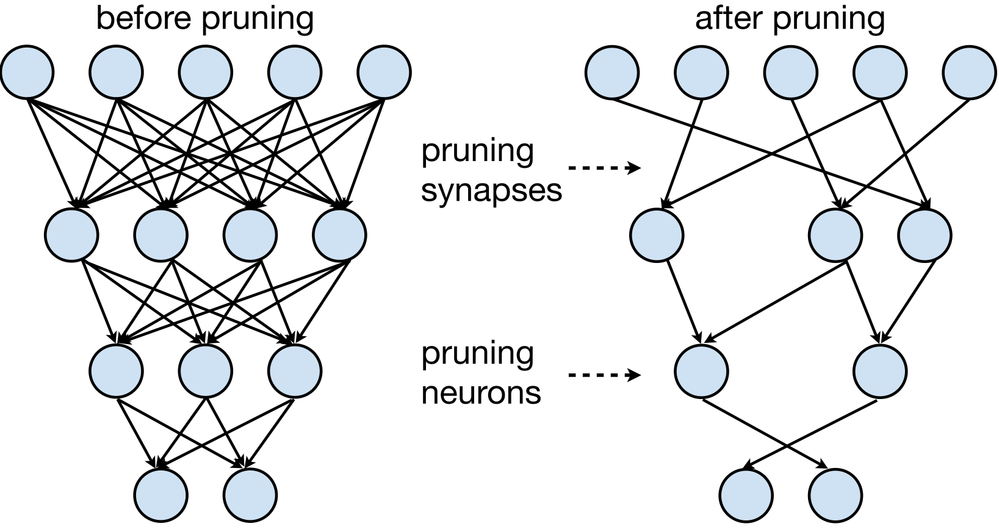
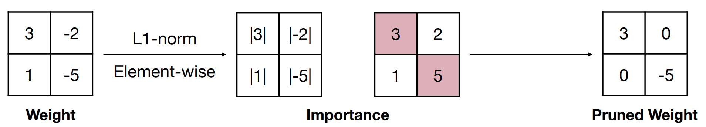

# अध्याय 3 मॉडल प्रूनिंग

## 3.1 मॉडल प्रूनिंग का परिचय

&emsp;&emsp;मॉडल प्रूनिंग मॉडल संपीड़न में एक महत्वपूर्ण तकनीक है। इसका मूल विचार मॉडल में महत्वहीन वजन और शाखाओं को छांटना, नेटवर्क संरचना को विरल करना, और फिर छोटे मापदंडों के साथ एक मॉडल प्राप्त करना, मेमोरी ओवरहेड को कम करना और तेजी से अनुमान लगाना है। यह उन अनुप्रयोगों के लिए विशेष रूप से महत्वपूर्ण है जिन्हें सीमित संसाधनों वाले उपकरणों पर मॉडल चलाने की आवश्यकता होती हैd मॉडल के प्रदर्शन में कमी के लिए, इसलिए मॉडल के आकार और प्रदर्शन के बीच संतुलन ढूंढना आवश्यक है, तंत्रिका नेटवर्क में न्यूरॉन्स के कनेक्शन को गणितीय रूप से वजन मैट्रिक्स के रूप में दर्शाया जाता है, इसलिए वजन मैट्रिक्स में कुछ तत्वों को बदलने के लिए छंटाई की जाती है। शून्य तत्व। प्रूनिंग के बाद बड़ी संख्या में शून्य तत्वों वाले इन मैट्रिक्स को विरल मैट्रिक्स कहा जाता है, और इसके विपरीत, अधिकांश गैर-शून्य तत्वों वाले मैट्रिक्स को घने मैट्रिक्स कहा जाता है। प्रूनिंग प्रक्रिया को चित्र में दिखाया गया हैनीचे। इसका उद्देश्य महत्वहीन सिनैप्स या न्यूरॉन्स को घटाना है।

&emsp;&emsp;एक तंत्रिका नेटवर्क में, मॉडल वज़न आमतौर पर न्यूरॉन्स के बीच कनेक्शन को संदर्भित करता है, यानी सिनैप्स। जब मॉडल प्रूनिंग में "वजन हटाते हैं", तो इसका मतलब आमतौर पर न्यूरॉन्स को हटाने के बजाय न्यूरॉन्स के बीच कनेक्शन की संख्या को कम करना होता है एक सरल रैखिक तंत्रिका नेटवर्क, सूत्र को इस प्रकार व्यक्त किया जा सकता है:

$$
वाई=डब्ल्यू
$$

&emsp;&emsp;जिसमें, $W$ t हैवह वजन, $X$ इनपुट है, यानी, न्यूरॉन। प्रूनिंग का विशिष्ट कार्यान्वयन वेट मैट्रिक्स में कुछ तत्वों को शून्य तत्वों में बदलना है, प्रूनिंग के बाद बड़ी संख्या में शून्य तत्वों वाले इन मैट्रिक्स को विरल मैट्रिक्स कहा जाता है जिन आव्यूहों में अधिकांश तत्व शून्य नहीं होते उन्हें सघन आव्यूह कहा जाता है।

## 3.2 प्रूनिंग क्या है?

&emsp;&emsp;प्रूनिंग को विभिन्न मानकों के अनुसार विभाजित किया जा सकता है। निम्नलिखित मुख्य रूप से प्रूनिंग प्रकार, प्रूनिंग रेंज और पीआर के तीन पहलुओं का वर्णन करता हैग्रैन्युलैरिटी को एकजुट करना।

### 3.2.1 छंटाई का प्रकार
&emsp;&emsp;प्रूनिंग प्रकार के अनुसार, प्रूनिंग को असंरचित प्रूनिंग और संरचित प्रूनिंग में विभाजित किया गया है।

#### 3.2.1.1 असंरचित छंटाई

&emsp;&emsp;असंरचित छंटाई महत्वहीन न्यूरॉन्स को हटा देती है, गणना के दौरान काट-छाँट किए गए न्यूरॉन्स और अन्य न्यूरॉन्स के बीच के कनेक्शन को नजरअंदाज कर दिया जाएगा, क्योंकि छंटाई वाला मॉडल आमतौर पर बहुत विरल होता है और मूल मॉडल की संरचना को नष्ट कर देता है, इस प्रकार की विधि को कहा जाता है। असंरचनाडी प्रूनिंग। असंरचित प्रूनिंग नेटवर्क में वजन की स्थिति की परवाह नहीं करती है, बल्कि केवल कुछ मानदंडों के आधार पर वजन को हटाने का निर्णय लेती है (उदाहरण के लिए, वजन को हटाने के बाद, शेष वजन)। वितरण विरल है, अर्थात, अधिकांश भार शून्य हैं, असंरचित छंटाई मॉडल मापदंडों और सैद्धांतिक गणनाओं की संख्या को बहुत कम कर सकती है, लेकिन मौजूदा हार्डवेयर आर्किटेक्चर की गणना पद्धति नहीं हो सकती है।इस उद्देश्य के लिए उपयोग किया जाता है। इसे तेज करने के लिए, परिणामी मॉडल की विरलता का प्रभावी ढंग से उपयोग करने के लिए आमतौर पर विशेष हार्डवेयर या सॉफ्टवेयर समर्थन की आवश्यकता होती है, इसलिए वास्तविक चलने की गति में सुधार नहीं किया जा सकता है, और इसे तेज करने के लिए विशिष्ट हार्डवेयर को डिजाइन करने की आवश्यकता होती है।

#### 3.2.1.2 संरचित छंटाई

संरचित प्रूनिंग मॉडल की संगठनात्मक संरचना पर अधिक ध्यान केंद्रित करती है, और यह उन हिस्सों को पहचानने और हटाने का प्रयास करती है जो संपूर्ण मॉडल संरचना में महत्वपूर्ण नहीं हैंई. इस प्रूनिंग विधि में संपूर्ण न्यूरॉन्स, कनवल्शन कर्नेल, परतें, या अधिक जटिल संरचनाओं को हटाना शामिल हो सकता है। आमतौर पर, जब एक फ़िल्टर को काटा जाता है, तो उसका पिछला फीचर मैप और अगला फीचर फिल्टर या संपूर्ण नेटवर्क परतों पर प्रूनिंग किया जाता है मानचित्र तदनुसार बदल जाएगा, लेकिन मॉडल की संरचना नष्ट नहीं होती है और इसे अभी भी GPU या अन्य हार्डवेयर द्वारा त्वरित किया जा सकता है, इसलिए इस प्रकार की विधि को संरचित प्रूनिंग कहा जाता है।

&emsp;&emsp;असंरचित छंटाई पर ध्यान केंद्रित किया जाता हैएकल महत्वहीन भार को हटाना, जिससे वजन मैट्रिक्स विरल हो जाता है, जबकि संरचित छंटाई संपूर्ण तंत्रिका इकाइयों या फिल्टर को हटाने पर केंद्रित होती है, जिसके परिणामस्वरूप नेटवर्क संरचना में परिवर्तन होता है, जैसे व्यावहारिक अनुप्रयोगों में परतों या चैनलों की संख्या कम करना, संरचित छंटाई आमतौर पर बेहतर प्रदर्शन और संपीड़न अनुपात प्रदान करता है क्योंकि यह मॉडल की आंतरिक संरचना का बेहतर उपयोग कर सकता है, हालांकि, संरचित प्रूनिंग का कार्यान्वयन आमतौर पर अधिक जटिल होता हैएकीकृत और अधिक कंप्यूटिंग संसाधनों और मॉडल की गहरी समझ की आवश्यकता होती है, असंरचित छंटाई अपेक्षाकृत सरल है, लेकिन संरचित छंटाई के समान संपीड़न प्रभाव प्राप्त नहीं हो सकता है।

### 3.2.2 काट-छाँट का दायरा
&emsp;&emsp;प्रूनिंग स्कोप के अनुसार, प्रूनिंग को स्थानीय प्रूनिंग और ग्लोबल प्रूनिंग में विभाजित किया गया है।

#### 3.2.2.1 स्थानीय छंटाई

&emsp;&emsp;स्थानीय छंटाई मॉडल में व्यक्तिगत वजन या मापदंडों पर केंद्रित है। यह छंटाई विधि आमतौर पर मॉडल में प्रत्येक वजन का मूल्यांकन करती हैऔर फिर तय करें कि इसे शून्य पर सेट करना है या नहीं। स्थानीय प्रूनिंग का उद्देश्य उन वज़न को हटाना है जिनका मॉडल आउटपुट पर बहुत कम प्रभाव पड़ता है। यह विधि वेट प्रूनिंग, न्यूरॉन प्रूनिंग, या यहां तक ​​​​कि चैनल प्रूनिंग (संपूर्ण कनवल्शन चैनल को हटाना) हो सकती है। कनवल्शनल न्यूरल नेटवर्क) स्थानीय प्रूनिंग की विशेषता यह है कि यह मॉडल के अन्य भागों पर निर्भर हुए बिना मॉडल के प्रत्येक भाग पर स्वतंत्र रूप से काम करता है।

### 3.2.2.2 वैश्विक छंटाई

&emsp;&emsp;ग्लोबल प्रूनिंग टी पर विचार करता हैमॉडल की समग्र संरचना और प्रदर्शन। यह प्रूनिंग विधि संपूर्ण न्यूरॉन्स, कनवल्शन कर्नेल, परतों, या अधिक जटिल संरचनाओं, जैसे कनवल्शन कर्नेल समूहों को हटा सकती है। वैश्विक प्रूनिंग का लक्ष्य कम करते हुए पूरे मॉडल के प्रदर्शन को अनुकूलित करना है मॉडल की जटिलता। वैश्विक छंटाई के लिए आमतौर पर मॉडल की समग्र संरचना की गहरी समझ की आवश्यकता होती है और इसमें मॉडल वास्तुकला को फिर से डिजाइन करना शामिल हो सकता हैमॉडल का अंतिम प्रदर्शन क्योंकि यह मॉडल की समग्र सुविधा निष्कर्षण क्षमता को बदल देता है।

### 3.2.3 बारीक काट-छाँट
&emsp;&emsp;प्रूनिंग ग्रैन्युलैरिटी के अनुसार, प्रूनिंग को बारीक-बारीक प्रूनिंग (फाइन-ग्रेन्ड प्रूनिंग), पैटर्न-आधारित प्रूनिंग, वेक्टर-लेवल प्रूनिंग, कर्नेल-लेवल प्रूनिंग और चैनल-लेवल प्रूनिंग में विभाजित किया जा सकता है।

जैसा कि नीचे दिए गए चित्र में दिखाया गया है, यह बारीक-बारीक छंटाई से लेकर चैनल-स्तरीय छंटाई तक की छंटाई को दर्शाता है, और छंटाई अधिक हो जाती हैऔर अधिक नियमित एवं संरचित।

#### 3.2.3.1 बारीक छंटाई

&emsp;&emsp;बारीक-दानेदार छंटाई वजन मैट्रिक्स में किसी भी मूल्य को हटा देती है। बारीक-बारीक छंटाई उच्च संपीड़न अनुपात प्राप्त कर सकती है, लेकिन यह हार्डवेयर-अनुकूल नहीं है, इसलिए गति लाभ सीमित है।

#### 3.2.3.2 पैटर्न-आधारित छंटाई

&emsp;&emsp;N:M विरलता DNN की विरलता का प्रतिनिधित्व करती है। N:M विरलता के लिए आवश्यक है कि प्रत्येक M लगातार भार का अधिकतम N होयह गैर-शून्य है। यह व्यवहार में मैट्रिक्स गुणन में तेजी लाने के लिए NVIDIA के स्पार्स टेन्सर कोर का लाभ उठा सकता है। एनवीडिया एम्पीयर A100 फाइन का पूरा फायदा उठाते हुए 2:4 संरचना की बारीक-बारीक स्पार्सिटी को तेज करने के लिए स्पार्स टेन्सर कोर से सुसज्जित है। -नेटवर्क भार की दानेदार विरलता, वे गहन शिक्षण के केंद्र में मैट्रिक्स गुणन और संचय संचालन की सटीकता का त्याग किए बिना सघन गणित के अधिकतम थ्रूपुट को 2 गुना तक प्रदान करते हैं।

&emsp;विरल मैट्रिक्स W को पहले संपीड़ित किया जाता है, और संपीड़ित मैट्रिक्स गैर-शून्य डेटा मानों को संग्रहीत करता है, जबकि मेटाडेटा मूल मैट्रिक्स W में संबंधित गैर-शून्य तत्वों की सूचकांक जानकारी संग्रहीत करता है। विशेष रूप से, मेटाडेटा पंक्ति को संपीड़ित करता है और डब्ल्यू में गैर-शून्य तत्वों की कॉलम संख्या को दो स्वतंत्र एक-आयामी सरणियों में विभाजित किया गया है, जो मेटाडेटा में संग्रहीत सूचकांक जानकारी हैं:

यहां, NVIDIA 2:4 को एक उदाहरण के रूप में लें और एक पैटर्न बनाएं, जैसा कि नीचे दिखाया गया है, चूंकि यह 2:4 है, यानी, 4 में से 2 लिया गया है और 0 पर सेट किया गया है, कुल 6 अलग-अलग पैटर्न हैं। गणना की जा सकती है; फिर पैटर्न के साथ सुविधाजनक मैट्रिक्स संचालन के लिए वजन मैट्रिक्स को nx4 प्रारूप में बदल दिया जाता है। ऑपरेशन का परिणाम सबसे बड़ा सूचकांक प्राप्त करने के लिए n के आयाम पर argmax निष्पादित करता है पैटर्न) , और फिर पैटर्न मान अनुरूप भरेंइंडेक्स को मास्क में डालना।

### 3.2.3.3 वेक्टर-स्तरीय छंटाई

&emsp;&emsp;वेक्टर-स्तरीय प्रूनिंग पंक्तियों या स्तंभों की इकाइयों में वजन काटती है।

### 3.2.3.4 कर्नेल-स्तरीय छंटाई

&emsp;&emsp;कर्नेल-स्तरीय प्रूनिंग, कनवल्शन कर्नेल (फ़िल्टर) की इकाइयों में वजन काटती है।

### 3.2.3.5 चैनल-स्तरीय छंटाई

&emsp;&emsp;चैनल-स्तरीय प्रूनिंग चैनलों की इकाइयों में वजन घटाता है।

> नोट: बारीक-बारीक, पैटर्न-आधारित छंटाई, वेक्टर-स्तर, औरडी कर्नेल-स्तरीय प्रूनिंग विधियां मापदंडों की संख्या और मॉडल प्रदर्शन के बीच एक निश्चित संतुलन प्राप्त करती हैं, लेकिन नेटवर्क की टोपोलॉजी स्वयं बदल गई है, और इस विरल ऑपरेशन का समर्थन करने के लिए एक विशेष एल्गोरिदम डिजाइन की आवश्यकता होती है, जो असंरचित प्रूनिंग से संबंधित है।
> चैनल-स्तरीय प्रूनिंग नेटवर्क में फ़िल्टर समूहों और फ़ीचर चैनलों की संख्या को बदल देती है। प्राप्त मॉडल विशेष एल्गोरिदम डिज़ाइन के बिना चल सकता है, जो संरचित प्रूनिंग से संबंधित है।

## 3.3 काट-छाँट क्यों?

&इmsp;&emsp;मॉडल की छंटाई क्यों की जा सकती है? मॉडल प्रूनिंग मुख्य रूप से प्रभावी है क्योंकि यह उन मापदंडों की पहचान कर सकता है और हटा सकता है जिनका मॉडल के प्रदर्शन पर बहुत कम प्रभाव पड़ता है, जिससे मॉडल की जटिलता और कम्प्यूटेशनल लागत कम हो जाती है। यह प्रक्रिया आमतौर पर सटीकता को महत्वपूर्ण रूप से प्रभावित नहीं करती है मॉडल का, विशेष रूप से जब मॉडल स्वयं ओवरफिटिंग हो सकता है, और प्रूनिंग मॉडल को नए डेटा को बेहतर ढंग से सामान्यीकृत करने में मदद कर सकता है।

- हान सॉन्ग, एट अल (2015) ने पेपर "लर्निंग" में एक प्रूनिंग विधि का प्रस्ताव दियाकुशल तंत्रिका नेटवर्क के लिए वजन और कनेक्शन दोनों" जो प्रशिक्षण के दौरान छोटे वजन वाले कनेक्शन को धीरे-धीरे हटाकर मॉडल मापदंडों की संख्या को कम करता है। प्रयोगात्मक परिणाम बताते हैं कि समान प्रदर्शन को बनाए रखते हुए छंटनी वाला मॉडल मॉडल की जटिलता को काफी कम कर देता है।
- लियू ज़ेड, एट अल। (2016) ने "नेटवर्क स्लिमिंग के माध्यम से कुशल कन्वोल्यूशनल नेटवर्क सीखना" में एक ग्रेडिएंट-आधारित प्रूनिंग विधि का प्रस्ताव दिया जो यह निर्धारित करता है कि कैल द्वारा कौन सा वजन हटाया जा सकता है।वज़न के ग्रेडिएंट का निर्धारण करते हुए यह विधि मॉडल के प्रदर्शन को बनाए रखते हुए मॉडल मापदंडों की संख्या को काफी कम कर देती है।
- हे वाई, एट अल। (2017) "डीप कन्वोल्यूशनल न्यूरल नेटवर्क एक्सेलेरेशन के लिए जियोमेट्रिक मेडियन के माध्यम से फ़िल्टर प्रूनिंग" में, ज्यामितीय माध्यिका पर आधारित एक प्रूनिंग विधि प्रस्तावित है, जो यह निर्धारित करती है कि प्रत्येक फ़िल्टर के ज्यामितीय माध्यिका की गणना करके कौन से फ़िल्टर को हटाया जा सकता है। प्रायोगिक परिणाम बताते हैं कि यह विधि कम्प्यूटेशनल जटिलता को काफी कम कर सकती हैमॉडल के प्रदर्शन को बनाए रखते हुए मॉडल का अस्तित्व।
- झू एम, एट अल। (2017) ने "प्रून करें, या न करें: मॉडल संपीड़न के लिए प्रूनिंग की प्रभावकारिता की खोज" में मॉडल प्रूनिंग की प्रभावशीलता का पता लगाया और एक नई प्रगतिशील प्रूनिंग तकनीक का प्रस्ताव दिया छोटे घने मॉडल के साथ विरल मॉडल और यह साबित करता है कि मॉडल सटीकता को बनाए रखने या यहां तक ​​कि सुधार करते समय प्रूनिंग मॉडल आकार को काफी कम कर सकता है।

## 3.4 काट-छाँट कैसे करें?

&emsp;&emsp;डिटेक्ट कैसे करेंermin किसे हटाना है? इसमें छंटाई मानदंड शामिल हैं वर्तमान मुख्यधारा छंटाई मानकों में निम्नलिखित विधियाँ शामिल हैं:

### 3.4.1 वजन के आकार के आधार पर

&emsp;&emsp;सबसे सरल तरीका यह है कि प्रत्येक तत्व के वजन के निरपेक्ष मूल्य के आधार पर सीधे वजन के महत्व की गणना की जाती है। मूल विचार एक तत्व के आधार पर तंत्रिका नेटवर्क में छोटे निरपेक्ष मूल्यों के साथ वजन को हटाना है। यह छंटाई विधि इस धारणा पर आधारित है कि निरपेक्ष जितना छोटा होगावजन का मूल्य, मॉडल के आउटपुट पर वजन का प्रभाव जितना कम होगा, इसलिए उन्हें हटाने से मॉडल के प्रदर्शन पर भी कम प्रभाव पड़ेगा। जिस तरह से यह विधि महत्व की गणना करती है उसे निम्नलिखित सूत्र के रूप में लिखा जा सकता है:

$$
\पाठ { महत्व }=|डब्ल्यू|
$$

जहां $महत्व$ महत्व को दर्शाता है, और $W$ वजन को दर्शाता है। छंटाई प्रक्रिया को नीचे दिए गए चित्र में दिखाया गया है।

&emsp;&emsp;एल1 और एल2 नियमितीकरण आमतौर पर आर का उपयोग किया जाता हैमशीन लर्निंग में नियमितीकरण तकनीक। वे हानि फ़ंक्शन में अतिरिक्त दंड शर्तों को जोड़कर मॉडल ओवरफिटिंग को रोकते हैं। इन दो नियमितीकरण विधियों का उपयोग मॉडल प्रूनिंग को निर्देशित करने के लिए भी किया जा सकता है, यानी नियमितीकरण अवधि के माध्यम से वजन के आकार को प्रभावित करने के लिए। छंटाई। एल1 और एल2 नियमितीकरण का मूल विचार पंक्तियों की इकाइयों में प्रत्येक पंक्ति के महत्व की गणना करना और वजन में कम महत्व वाली उन पंक्तियों को हटाना हैप्रत्येक पंक्ति में तत्वों के निरपेक्ष मानों के योग को महत्व की गणना करने की विधि निम्नलिखित सूत्र के रूप में लिखी जा सकती है:

$$
\text { महत्व }=\sum_{i \in S}\left|w_i\right|
$$

&emsp;&emsp;कांट-छांट प्रक्रिया नीचे दिए गए चित्र में दिखाई गई है।

&emsp;&emsp;L2 नियमितीकरण प्रत्येक पंक्ति में तत्वों के निरपेक्ष मानों के वर्गों के योग के वर्गमूल की गणना करता है। महत्व की गणना करने का तरीका t के रूप में लिखा जा सकता हैउनका निम्नलिखित सूत्र:

$$
\text { महत्व }=\sqrt{\sum_{i \in S}\left|w_i\right|^2}
$$

&emsp;&emsp;कांट-छांट प्रक्रिया नीचे दिए गए चित्र में दिखाई गई है।

### 3.4.2 ग्रेडिएंट आकार के आधार पर

&emsp;&emsp;महत्व के आधार के रूप में वजन के आकार पर आधारित प्रूनिंग एल्गोरिदम, चेहरे की कई विशेषताओं के बीच, चेहरे की पहचान को उदाहरण के रूप में लेते हुए, आंखों में रंग, आकार और आकार जैसे सूक्ष्म परिवर्तनों को आसानी से काट सकता है बहुत प्रभाव पड़ता हैचेहरे की पहचान के परिणामों पर, गहरे नेटवर्क में वजन के अनुरूप, भले ही वजन स्वयं छोटा हो, इसके मामूली परिवर्तन का परिणाम पर बहुत प्रभाव पड़ेगा, और ऐसे वजन में कटौती नहीं की जानी चाहिए वजन के संबंध में हानि फ़ंक्शन का, वजन में कमी की संवेदनशीलता को दर्शाता है ग्रेडिएंट-आधारित प्रूनिंग एल्गोरिदम एक ऐसी विधि है जो वजन के महत्व को निर्धारित करने के लिए मॉडल में वजन ग्रेडिएंट का विश्लेषण करती है।और छोटे ग्रेडिएंट्स के साथ वजन हटाएं। इस पद्धति का मुख्य विचार यह है कि मॉडल प्रशिक्षण प्रक्रिया के दौरान, वजन का ग्रेडिएंट इनपुट पर वजन के प्रभाव को दर्शाता है। आउटपुट हानि का प्रभाव, एक बड़े ग्रेडिएंट का मतलब है। वजन का आउटपुट हानि पर अधिक प्रभाव पड़ता है, इसलिए यह अधिक महत्वपूर्ण है; छोटे ग्रेडिएंट का मतलब है कि वजन का आउटपुट हानि पर कम प्रभाव पड़ता है, इसलिए छोटे ग्रेडिएंट वाले वजन को हटाकर यह कम महत्वपूर्ण हैमॉडल की सटीकता को बनाए रखते हुए मॉडल को कम किया जा सकता है।

## 3.5 काट-छांट की आवृत्ति (कितनी बार?)

&emsp;&emsp;मॉडल प्रूनिंग विधियों को प्रूनिंग आवृत्ति के अनुसार पुनरावृत्त और एक-शॉट प्रूनिंग में विभाजित किया जा सकता है।

### 3.5.1 पुनरावृत्तीय छंटाई

&emsp;&emsp;इटरेटिव प्रूनिंग एक प्रगतिशील मॉडल प्रूनिंग विधि है जिसमें प्रूनिंग और फाइन-ट्यूनिंग चरणों के कई चक्र शामिल होते हैं। यह प्रक्रिया एक साथ बड़ी संख्या में वजन को कम करने के बजाय मॉडल में वजन को धीरे-धीरे कम करती हैपुनरावृत्तीय छंटाई का उनका मूल विचार यह है कि वजन को धीरे-धीरे हटाकर, मॉडल के प्रदर्शन पर प्रत्येक छंटाई के प्रभाव का अधिक सावधानी से मूल्यांकन किया जा सकता है, और मॉडल को काटे गए वजन की भरपाई के लिए शेष वजन को समायोजित करने का अवसर मिलता है। .

&emsp;&emsp;पुनरावृत्तीय छंटाई आमतौर पर इन चरणों का पालन करती है:
- मॉडल को प्रशिक्षित करें: पहले प्रशिक्षण डेटा पर अच्छे स्तर के प्रदर्शन के लिए एक पूर्ण, बिना काटे गए मॉडल को प्रशिक्षित करें।
- प्रून: पूर्व निर्धारित प्रूनिंग रणनीति का उपयोग करें (जैसे बीवजन के आकार के आधार पर) नेटवर्क को थोड़ा सा काटने के लिए, वजन का एक छोटा सा हिस्सा हटा दें।
- फाइन-ट्यून: कांट-छांट किए गए मॉडल को फाइन-ट्यून करें, जिसमें आमतौर पर कांट-छांट के कारण होने वाले प्रदर्शन नुकसान को ठीक करने के लिए मूल प्रशिक्षण डेटासेट का उपयोग करके मॉडल को फिर से प्रशिक्षित करना शामिल होता है।
- मूल्यांकन: यह सुनिश्चित करने के लिए कि मॉडल अभी भी अच्छा प्रदर्शन बनाए रखता है, सत्यापन सेट पर काटे गए मॉडल के प्रदर्शन का मूल्यांकन करें।
- दोहराएँ: चरण 2 से 4 दोहराएँ, प्रत्येक पुनरावृत्ति में अधिक वजन घटाएँ और एक पूर्व तक ठीक-ठीक ट्यूनिंग करेंसमाप्त प्रदर्शन मानक या छंटाई अनुपात तक पहुँच गया है।

### 3.5.2 एक-शॉट छंटाई

&emsp;&emsp;वन-शॉट प्रूनिंग प्रशिक्षण के बाद मॉडल पर एक बार प्रूनिंग ऑपरेशन करता है। इस प्रूनिंग विधि को कुशल और प्रत्यक्ष होने की विशेषता है, और इसे एक-शॉट प्रूनिंग में प्रूनिंग और रीट्रेनिंग के बीच कई पुनरावृत्तियों की आवश्यकता नहीं होती है। मॉडल को पहले अभिसरण के लिए प्रशिक्षित किया जाता है, और फिर कुछ छंटाई मानदंड (जैसे वजन का पूर्ण मूल्य) का उपयोग यह निर्धारित करने के लिए किया जाता है कि कौन सा पैरामीटरटर्स को हटाया जा सकता है। ये पैरामीटर आमतौर पर वे होते हैं जिनका मॉडल आउटपुट पर थोड़ा प्रभाव पड़ता है।

एकल छंटाई शोर से बहुत प्रभावित होती है, जबकि पुनरावृत्त छंटाई बहुत बेहतर होती है क्योंकि यह प्रत्येक पुनरावृत्ति के बाद केवल थोड़ी मात्रा में वजन हटाती है, और फिर मूल्यांकन और विलोपन के अन्य दौरों को दोहराती है, जिससे शोर के प्रभाव को कम किया जा सकता है हालाँकि, बड़े मॉडलों के लिए, फ़ाइन-ट्यूनिंग की उच्च लागत के कारण, एकल प्रूनिंग एक निश्चित सीमा तक होती हैअयस्क को प्राथमिकता.

## 3.6 छंटाई कब करें?

### 3.6.1 प्रशिक्षण के बाद छंटाई

&emsp;&emsp;प्रशिक्षण के बाद प्रूनिंग का मूल विचार पहले एक मॉडल को प्रशिक्षित करना है, फिर मॉडल को प्रून करना है, और अंत में प्रून किए गए मॉडल को फाइन-ट्यून करना है। मूल विचार यह है कि मॉडल को एक बार प्रशिक्षित किया जाए कि वह कौन सा तंत्रिका है कनेक्शन वास्तव में महत्वपूर्ण हैं, जो महत्वपूर्ण नहीं हैं (कम वजन) उन्हें छांटें, और फिर वजन का अंतिम मूल्य जानने के लिए फिर से प्रशिक्षित करें यहां विस्तृत चरण दिए गए हैं:

- प्रारंभिक प्रशिक्षण: सबसे पहले, तंत्रिका नेटवर्कमानक बैक-प्रचार एल्गोरिदम का उपयोग करके प्रशिक्षित किया जाता है। इस प्रक्रिया में, नेटवर्क वजन (यानी कनेक्शन की ताकत) और नेटवर्क संरचना सीखता है।
- महत्वपूर्ण कनेक्शनों की पहचान करें: प्रशिक्षण पूरा होने के बाद, नेटवर्क को पता चल गया है कि कौन से कनेक्शन मॉडल के आउटपुट पर महत्वपूर्ण प्रभाव डालते हैं, आम तौर पर, बड़े वजन वाले कनेक्शन महत्वपूर्ण माने जाते हैं।
- सीमा निर्धारित करें: एक सीमा चुनें जिसका उपयोग यह निर्धारित करने के लिए किया जाता है कि कौन से कनेक्शन महत्वपूर्ण हैंइस सीमा से कम वजन वाले कनेक्शन को महत्वहीन माना जाएगा।
- छंटाई: सीमा से नीचे के वजन वाले सभी कनेक्शन हटा दें, इसमें आमतौर पर पूरी तरह से जुड़ी परतों को विरल परतों में परिवर्तित करना शामिल है क्योंकि अधिकांश कनेक्शन हटा दिए जाते हैं।
- पुनःप्रशिक्षण: प्रूनिंग के बाद, नेटवर्क की क्षमता कम हो जाती है, और इस परिवर्तन की भरपाई के लिए, नेटवर्क को पुनःप्रशिक्षित करने की आवश्यकता होती है। इस प्रक्रिया के दौरान, नेटवर्क शेष कनेक्शनों के भार को समायोजित करता हैसटीकता बनाए रखते हुए नई संरचना को अपनाएं।
- पुनरावृत्तीय छंटाई: छंटाई और पुनर्प्रशिक्षण की प्रक्रिया पुनरावृत्त रूप से की जा सकती है। प्रत्येक पुनरावृत्ति तब तक अधिक कनेक्शन हटाती है जब तक कि एक संतुलन बिंदु नहीं पहुंच जाता है जहां नेटवर्क सटीकता के महत्वपूर्ण नुकसान के बिना सटीकता बनाए रख सकता है। परिस्थितियों में जितना संभव हो सके कनेक्शन कम करें।

### 3.6.2 प्रशिक्षण के दौरान काट-छाँट

प्रशिक्षण के दौरान प्रूनिंग का मूल विचार मॉडल प्रशिक्षण के दौरान सीधे प्रूनिंग करना हैप्रशिक्षण के बाद की छंटाई की तुलना में, इनिंग प्रक्रिया और अंत में छंटाई किए गए मॉडल को ठीक किया जाता है, प्रशिक्षण के दौरान कनेक्शन को उनके महत्व के अनुसार गतिशील रूप से निष्क्रिय कर दिया जाता है, लेकिन प्रशिक्षण के दौरान वजन को अनुकूलित करने और संभवतः पुन: सक्रिय करने की अनुमति दी जाती है, क्योंकि अनावश्यक कनेक्शन अधिक प्रभावी मॉडल का उत्पादन कर सकते हैं जितनी जल्दी हो सके काट-छाँट की जाती है, जिससे प्रशिक्षण के दौरान स्मृति और कम्प्यूटेशनल आवश्यकताएँ कम हो सकती हैं, हालाँकि, इसमें अचानक परिवर्तन से बचने के लिए इसे सावधानी से संभालने की आवश्यकता होती हैनेटवर्क संरचना और अति-प्रूनिंग का जोखिम, जो प्रदर्शन को नुकसान पहुंचा सकता है। ड्रॉपआउट, जो आमतौर पर गहन शिक्षण में उपयोग किया जाता है, वास्तव में प्रशिक्षण प्रक्रिया के दौरान, यादृच्छिक न्यूरॉन्स को "छोड़ दिया जाता है" या शून्य पर सेट कर दिया जाता है एक निश्चित संभावना। प्रशिक्षण के दौरान प्रूनिंग की प्रशिक्षण प्रक्रिया में सीएनएन नेटवर्क को एक उदाहरण के रूप में लेते हुए निम्नलिखित विस्तृत चरण शामिल हैं:
- मॉडल मापदंडों को आरंभ करें: सबसे पहले, एक स्टैंडर का उपयोग करके तंत्रिका नेटवर्क के वजन को आरंभ करेंडी आरंभीकरण विधि।
- प्रशिक्षण लूप: प्रत्येक प्रशिक्षण चक्र (युग) की शुरुआत में, मॉडल भार को अद्यतन करने के लिए संपूर्ण मॉडल मापदंडों का उपयोग करके प्रशिक्षण डेटा को आगे-प्रसारित और पीछे-प्रसारित किया जाता है।
- महत्व की गणना करें: प्रत्येक प्रशिक्षण चक्र के अंत में, प्रत्येक संकेंद्रित परत में सभी फिल्टर के महत्व की गणना की जाती है।
- प्रूनिंग के लिए फिल्टर का चयन करें: पूर्व-निर्धारित प्रूनिंग दर के अनुसार, कम से कम महत्व वाले फिल्टर को प्रूनिंग के लिए चुना जाता हैमहत्वहीन कर दिया गया क्योंकि उनका मॉडल पर कोई प्रभाव नहीं पड़ता। मॉडल आउटपुट का योगदान छोटा है।
- प्रून फिल्टर: चयनित फिल्टर के वजन को शून्य पर सेट करें ताकि बाद के आगे के प्रसार में इन फिल्टर के योगदान की गणना न की जाए।
- मॉडल का पुनर्निर्माण करें: फ़िल्टर को काटने के बाद, एक प्रशिक्षण चक्र जारी रखें, बैकप्रॉपैगेशन के माध्यम से, पहले से काटे गए फ़िल्टर के वजन को अद्यतन करने की अनुमति दी जाती है, जिससे मॉडल की क्षमता बहाल हो जाती है।.
- पुनरावृत्तीय प्रक्रिया: उपरोक्त चरणों को तब तक दोहराएँ जब तक कि प्रशिक्षण चक्रों की पूर्व निर्धारित संख्या तक न पहुँच जाए या मॉडल अभिसरण न हो जाए।

### 3.6.3 पूर्व-प्रशिक्षण छंटाई

&emsp;&emsp;प्री-ट्रेनिंग प्रूनिंग का मूल विचार प्रशिक्षण से पहले मॉडल को प्रून करना है, और फिर प्रून किए गए मॉडल को स्क्रैच से प्रशिक्षित करना है, यहां हमें लॉटरी परिकल्पना का उल्लेख करना है, अर्थात, किसी भी यादृच्छिक रूप से आरंभ किए गए घने फीडफॉरवर्ड नेटवर्क में निम्नलिखित गुणों वाला एक उप-नेटवर्क होता है-जब स्वतंत्र रूप से प्रशिक्षित किया जाता है, तो प्रारंभिकअलाइज्ड उप-नेटवर्क मूल नेटवर्क के समान ही पुनरावृत्तियों के बाद मूल नेटवर्क के समान परीक्षण सटीकता प्राप्त कर सकता है। लॉटरी परिकल्पना में, काटे गए नेटवर्क को ठीक करने की आवश्यकता नहीं है, लेकिन "जीतने वाले" उप की आवश्यकता है -नेटवर्क को नेटवर्क के मूल भार पर रीसेट कर दिया जाता है और पुनः प्रशिक्षित किया जाता है, और अंतिम परिणाम मूल सघन नेटवर्क को पकड़ सकता है या उससे भी आगे निकल सकता है। एक वाक्य में संक्षेप में कहें तो: एक यादृच्छिक रूप से आरंभ किए गए सघन तंत्रिका नेटवर्क में एक उप-नेटवर्क होता हैइसे आरंभीकृत किया गया है ताकि जब इसे अकेले प्रशिक्षित किया जाए, तो यह अधिकतम समान संख्या में पुनरावृत्तियों के लिए प्रशिक्षण के बाद मूल नेटवर्क की परीक्षण सटीकता से मेल खा सके।

&emsp;&emsp;प्रारंभ में, तंत्रिका नेटवर्क को एक पूर्वनिर्धारित ढांचे का उपयोग करके प्रशिक्षित किया जाता है। नेटवर्क एक यादृच्छिक संरचना और यादृच्छिक रूप से आरंभिक वजन के साथ बनाया जाता है। यह प्रूनिंग के लिए शुरुआती बिंदु बनाता है। कुछ मानदंडों या अनुमानों के आधार पर, प्रूनिंग के लिए विशिष्ट कनेक्शन या वजन की पहचान की जाती है .फिर एक सवाल है, हमने शुरुआत नहीं की हैअभी तक मॉडल का प्रशिक्षण नहीं हुआ है, तो हमें कैसे पता चलेगा कि कौन से कनेक्शन महत्वपूर्ण नहीं हैं?

वर्तमान सामान्य दृष्टिकोण आम तौर पर प्रारंभिक चरण के दौरान यादृच्छिक प्रूनिंग विधियों का उपयोग करना है। यादृच्छिक रूप से चयनित कनेक्शनों को काट दिया जाता है, और विभिन्न विरल नेटवर्क आर्किटेक्चर बनाने के लिए प्रक्रिया को कई बार दोहराया जाता है। इसके पीछे विचार यह है कि यदि पहले कई तरीकों से प्रूनिंग की जाती है प्रशिक्षण के बाद, लॉटरी टिकट खोजने की प्रक्रिया को छोड़ना संभव हो सकता है।

### 3.6.4 टिमी की छंटाई का सारांशएनजी

**प्रशिक्षण के बाद छंटाई (स्थैतिक विरलता):** प्रारंभिक प्रशिक्षण चरण के बाद छंटाई में एक अलग पोस्ट-प्रोसेसिंग चरण में प्रशिक्षित मॉडल से कनेक्शन या फिल्टर को हटाना शामिल है, यह सुनिश्चित करते हुए मॉडल को प्रशिक्षण के दौरान बिना किसी रुकावट के पूरी तरह से अभिसरण करने की अनुमति देता है सीखा हुआ प्रतिनिधित्व अच्छी तरह से स्थापित है। प्रूनिंग के बाद, प्रूनिंग प्रक्रिया के कारण होने वाले किसी भी संभावित प्रदर्शन में गिरावट से उबरने के लिए मॉडल को और बेहतर बनाया जा सकता हैयह सामान्य रूप से अधिक स्थिर है और ओवरफिटिंग की संभावना कम है, यह उन परिदृश्यों के लिए उपयुक्त है जहां पूर्व-प्रशिक्षित मॉडल विशिष्ट कार्यों के लिए ठीक-ठीक किए जाते हैं।

**प्रशिक्षण-समय प्रूनिंग (गतिशील विरलता):** इस दृष्टिकोण में, प्रूनिंग को एक अतिरिक्त नियमितीकरण तकनीक के रूप में अनुकूलन प्रक्रिया में एकीकृत किया जाता है, प्रशिक्षण पुनरावृत्तियों के दौरान, कुछ मानदंडों या अनुमानों के आधार पर कम महत्वपूर्ण कनेक्शनों को गतिशील रूप से हटा दिया जाता है या काट दिया जाता है मॉडल को विरलता के विभिन्न स्तरों का पता लगाने की अनुमति देता हैप्रशिक्षण प्रक्रिया के दौरान इसकी वास्तुकला को अनुकूलित करें। गतिशील विरलता अधिक कुशल मॉडलों को जन्म दे सकती है क्योंकि महत्वहीन कनेक्शनों को जल्दी ही काट दिया जाता है, संभावित रूप से मेमोरी और कम्प्यूटेशनल आवश्यकताओं को कम कर दिया जाता है, हालांकि, नेटवर्क संरचना में अचानक बदलाव से बचने के लिए इसे सावधानी से संभालने की आवश्यकता होती है अत्यधिक काट-छांट का जोखिम, जो प्रदर्शन को नुकसान पहुंचा सकता है।

**पूर्व-प्रशिक्षण प्रूनिंग:** पूर्व-प्रशिक्षण प्रूनिंग में ट्राई से पहले एक तंत्रिका नेटवर्क से कुछ कनेक्शन या वजन की छंटाई शामिल होती है।निंग प्रक्रिया शुरू होती है। लाभ यह है कि प्रशिक्षण तेजी से किया जा सकता है क्योंकि प्रारंभिक मॉडल का आकार कम हो जाता है, और नेटवर्क तेजी से एकत्रित हो सकता है, हालांकि, महत्वपूर्ण कनेक्शनों को बहुत आक्रामक तरीके से हटाने से बचने के लिए प्रूनिंग मानदंडों के सावधानीपूर्वक चयन की आवश्यकता होती है।

## 3.7 अभ्यास

- [प्रूनिंग ग्रैन्युलैरिटी प्रैक्टिस](https://github.com/datawhalechina/awesome-compression/blob/main/docs/notebook/ch03/1.pruning_granularity.ipynb)
- [प्रूनिंग मानक अभ्यास](https://github.com/datawhalechina/aसुंदर-संपीड़न/ब्लॉब/मुख्य/दस्तावेज़/नोटबुक/ch03/2.pruning_criteria.ipynb)
- [प्रूनिंग टाइमिंग अभ्यास](https://github.com/datawhalechina/awesome-compression/blob/main/docs/notebook/ch03/2.pruning_criteria.ipynb)a/awesome-compression/blob/main/docs/notebook /ch03/3.pruning_timing.ipynb)
- [टॉर्च में प्रूनिंग एल्गोरिदम अभ्यास](https://github.com/datawhalechina/awesome-compression/blob/main/docs/notebook/ch03/4.torch_prune.ipynb)