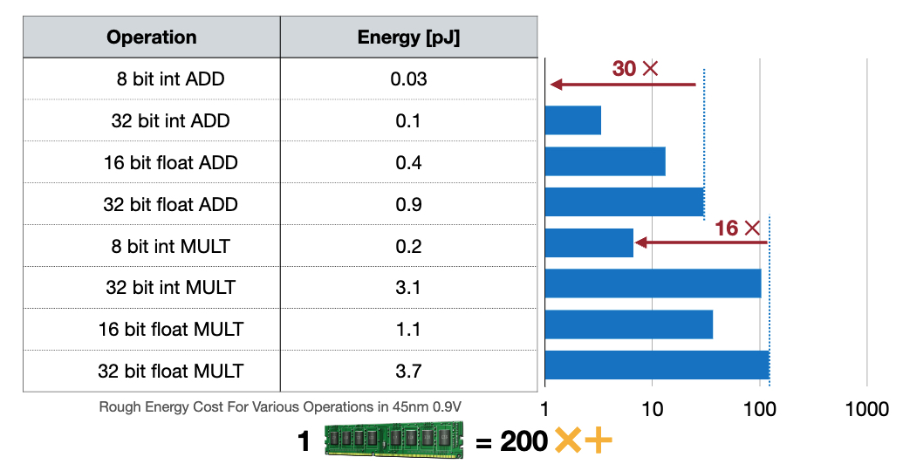
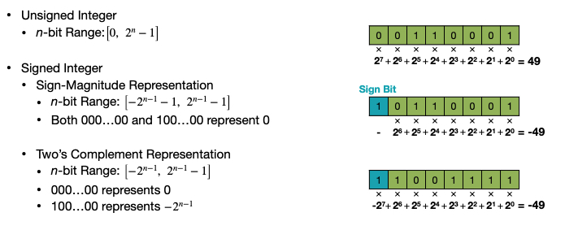
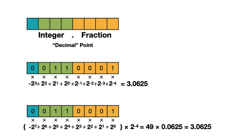
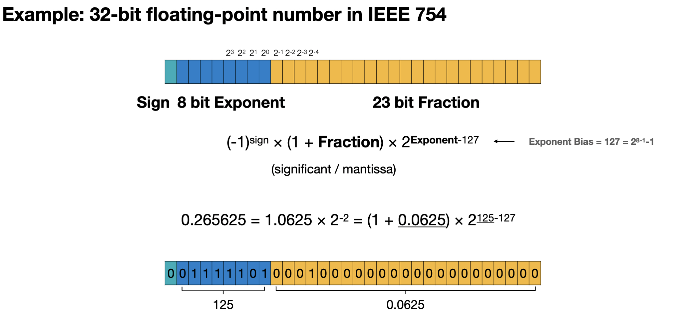
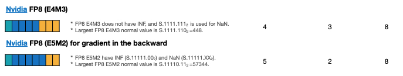
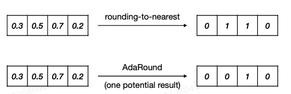
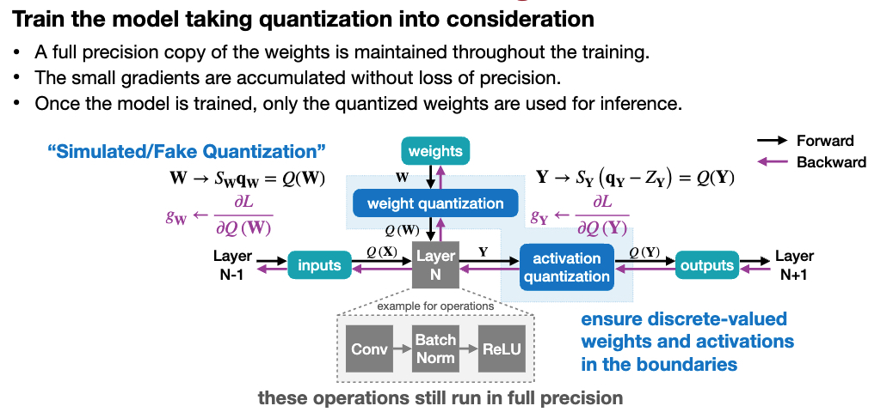

# Chapter 4 Model Quantization

&emsp;&emsp;In this chapter, we will learn what quantization is in Section 4.1? Why quantization? Section 4.2 will learn how to represent different data types, and Section 4.3 will learn the basic methods of quantization, how to convert different data types into quantization. After learning the basic principles of quantization, we will further learn different quantization strategies to optimize the quantization effect in Sections 4.4, 4.5, and 4.6. Finally, we will consolidate the knowledge we have learned through several quantization practices.

## 4.1 What is quantization? Why quantization?

&emsp;&emsp;In the previous chapter, we learned about pruning. Pruning can reduce the number of network parameters, thereby compressing the model. Quantization is another method that can compress model parameters. Quantization converts the floating-point algorithm of the neural network to fixed-point, modifies the number of bits occupied by each parameter in the network, and thus reduces the space occupied by the model parameters.

&emsp;&emsp;The hardware resources of the mobile terminal are limited, such as memory and computing power. Quantization can reduce the size of the model, thereby reducing the memory and computing power occupied. At the same time, quantization can improve the inference speed of the model. The following figure compares the time consumption of addition and multiplication operations of different data types.

&emsp;&emsp;Model quantization has the following benefits:
- Reduce model size: For example, int8 quantization can reduce the model size by 75%, and the size of int8 quantized models is generally 1/4 of the size of 32-bit floating-point models;
- Reduce storage space: It is more meaningful when the storage space on the end is insufficient.
- Reduce memory usage: A smaller model certainly means that more memory space is not needed.
- Reduce device power consumption: Less memory consumption and faster inference speed naturally reduce device power consumption.
- Speed ​​up inference speed: Floating-point types can access int8 integers four times, and integer operations are faster than floating-point operations; CPUs use int8 to calculate faster;
- Some hardware accelerators such as DSP/NPU only support int8. For example, some microprocessors are 8-bit, and low-power operation of floating-point operations is slow, so 8bit quantization is required.

## 4.2 Data Type

&emsp;&emsp;The model quantization process can be divided into two parts: converting the model from fp32 to int8; using int8 for inference. The entire quantization process is closely related to the conversion of data types. Let's first understand data in this section.Type. If you don't understand the basic data types, you will usually be confused in the subsequent quantitative details.
#### 4.2.1 Integer
&emsp;&emsp;As shown in the figure below, integer data can be divided into unsigned integer and signed integer.
- Unsigned integer: The data range is 0 to $2^{n-1}$, n is the number of data bits.
- Signed integer:
- Sign-Magnitude Representation: The principle of its implementation is to take the highest bit (the first bit from the left) of the binary number as the sign bit, and agree that when the sign bit is 0, it represents a positive number, when the sign bit is 1, it represents a negative number, and the remaining binary bits are used for the absolute value of the value to be represented. The data range is $-2^{n-1}-1$ to $2^{n-1}-1$, n is the number of data bits.
- Two's Complement Representation: To make up for the shortcomings of the source code representation, which has +0 and -0, the highest bit not only has the function of symbol representation, but also has a weight value. The data range is $-2^{n-1}$ to $2^{n-1}-1$, where n is the number of data bits.

### 4.2.2 Fixed Point Number

&emsp;&emsp;The key to fixed point numbers is the two words "fixed" and "point", that is, when representing decimal data, the position of the decimal point has been agreed to be fixed at a certain position. Corresponding to this is the floating point number, whose decimal point position is not fixed. As shown in the figure below, the blue part is designated as the sign bit, the green part is the integer bit, and the orange part is the decimal bit.

### 4.2.3 Floating Point Number

&emsp;&emsp;As shown in the figure below, the value represented by each digit of the floating point number is the same as that of the fixed point number, but the calculation method is no longer a simple addition. Among them, fraction represents the decimal part, and exponent represents the exponent part. The number of digits of fraction and exponent determines the precision and representation range of the data respectively. The bias of the exponent = 127 = $2^{7}-1$, so the exponent part represents the range from -127 to 128.

&emsp;&emsp;The formula for representing fp32 floating point numbers is as follows:

$$
fp32 = (-1)^{sign}·(1+fraction)·2^{exponent-127}
$$

&emsp;&emsp;Let's consider how to represent 0? As shown in the figure below, we stipulate that when exponent is 0, the fraction part is forced to no longer add 1, and the exponent part is forced to be 1-bias = -126. When fraction = 0, it represents 0. This representation is called a non-normal floating point number. The formula is as follows:

$$
fp32 = (-1)^{sign}·(fraction)·2^{1-127}
$$

&emsp;&emsp;The difference between these two representations is that when expontent is not equal to 0, the normal floating point representation is used. When expontent = 0, the non-normal representation is used.
- The smallest positive value representable by a normal floating point is fraction = 0, exponent = 1, and the result is $2^{-126}$.
$$
(1+0)·2^{1-127} = 2^{-126}
$$
- The smallest positive value representable by a denormal floating point is fraction = $2^{-23}$, and the result is $2^{-149}$.
$$
2^{-23}·2^{1-127} = 2^{-149}
$$
- The maximum value that can be represented by a non-normal floating point is that the fraction part is all 1, and the result is $2^{-126}-2^{-149}$.
- The maximum value that can be represented by a normal floating point number is fraction = $2^{-23}$, and the result is $(1+1-2^{-23})·2^{127}$.
- When the decimal part of a normal floating point number is all 0 and the exponent part is all 1, it represents positive infinity and negative infinity respectively.

&emsp;&emsp;As shown below, we can extend it to other data types:
- When the number of expontent digits is 5 and the number of fraction digits is 11, it is fp16.
$$
fp16 = (-1)^{sign}·(1+fraction)·2^{exponent-15}
$$
- When the number of expontent digits is 8 and the number of fraction digits is 7, it is bf16.
$$
bf16 = (-1)^{sign}·(1+fraction)·2^{exponent-127}
$$
- When the number of exponent digits is 4 and the number of fraction digits is 3, it is fp8(E4M3).
$$
fp8 = (-1)^{sign}·(1+fraction)·2^{exponent-7}$$
- When the number of exponent digits is 5 and the number of fraction digits is 2, it is fp8(E5M2).
$$
fp8 = (-1)^{sign}·(1+fraction)·2^{exponent-15}
$$
&emsp;&emsp;We need to note that the two representations of fp8 have one with higher precision and one with a larger range.

## 4.3 Basic Quantization Methods

&emsp;&emsp;Depending on the different data types used for storage and calculation, the following two quantization methods are mainly introduced:
- K-means-based Quantization: storage (weights of integer data + floating-point conversion table), calculation (floating-point calculation).
- Linear Quantization: storage (integer storage), calculation (floating-point storage).

### 4.3.1 k-means quantization

&emsp;&emsp;As shown in the figure below, k-means quantization clusters weights. The position of each weight is onlyThe index value of the cluster needs to be stored. Clustering the weights into 4 categories can achieve 2-bit compression.
Storage occupancy from 32bit x 16 = 512 bit = 64 B ----> 2bit x 16 + 32 bit x 4 = 32 bit + 128 bit = 160 bit = 20 B

&emsp;&emsp;When the weight is larger, the compression ratio will be larger.

- During inference, we read the conversion table and get the corresponding value according to the index value.
- During training, we cluster the gradient according to the clustering method of weights, back-propagate to the conversion table, and update the value of the conversion table.

&emsp;&emsp;The following is a compression process that combines the pruning in the previous section with k-means quantization. First, pruning prunes the parameters in the model, and fine-tunes and prunes in a loop to obtain the optimal pruned model. Then, k-means quantization clusters the pruned parameters, stores the clustered index values ​​in the model, builds the corresponding index table, and fine-tunes the model.

### 4.3.2 Linear Quantization
#### 4.3.2.1 Conversion Formula
&emsp;&emsp;As the name suggests, linear quantization is to establish a simple linear transformation relationship between the original floating-point data and the quantized fixed-point data. Because the network layers such as convolution and full connection are simple linear calculations, the quantized data can be directly used for direct calculation in linear quantization.

&emsp;&emsp;We use r to represent floating-point real numbers and q to represent quantized fixed-point integers. The conversion formula between floating point and integer is:

$$
r = (q - Z) / scale
$$
$$
q = round(r / S + Z)
$$

&emsp;&emsp;Wherein, S is scale, which indicates the proportional relationship between real numbers and integers, and Z is zero point, which indicates the integer corresponding to 0 in floating point after quantization. Their calculation method is:
$$
S = \frac{r_{max} - r_{min}}{q_{max} - q_{min}}
$$
$$
Z = round(q_{max}-\frac{r_{max}}{S})
$$

&emsp;&emsp;Wherein, $r_{max}$ and $r_{max}$ respectively indicate the minimum and maximum values ​​in floating point numbers, and $q_{max}$ and $q_{min}$ respectively indicate the minimum and maximum values ​​in fixed point numbers.

#### 4.3.2.2 Linear Matrix Multiplication Quantization

&emsp;&emsp;Linear Matrix Multiplication Quantization is the application of linear quantization to matrix multiplication.

&emsp;&emsp;Matrix multiplication can be expressed as follows:

$$
Y = WX
$$

&emsp;&emsp;Assume that $S_Y$ and $Z_Y$ are the scale and zero point corresponding to the matrix output Y, and $S_W$, $Z_W$, $S_X$, and $Z_X$ are the same. Then, the above formula can be deduced as follows:

$$
S_Y(q_Y-Z_Y) = S_W(q_W-Z_W)·S_X(q_S-Z_X)
$$

&emsp;&emsp;After arranging, we can get:
$$
q_Y = \frac{S_WS_X}{S_Y}(q_Wq_X-Z_Wq_X-Z_Xq_W+Z_WZ_X) + Z_Y
$$

&emsp;&emsp;Among them, $\frac{S_WS_X}{S_Y}$ is expressed as $2^{-n}M_0$. When converted into fixed-point calculation, the approximate scaling factor can be obtained by shifting. The so-called fixed-point means that the position of the decimal point is fixed, that is, the number of decimal places is fixed. $Z_Xq_W$ and $Z_WZ_X$ and $Z_Y$ can be calculated in advance.

&emsp;&emsp;Can weWhat if $Z_W$ is 0? When $Z_W$ is 0, we only need to store $q_W$ and $q_X$, then calculate $q_Y$ according to the formula, and finally store $q_Y$.

&emsp;&emsp;When $Z_W$ is 0, the corresponding quantization method is linear symmetric quantization.

&emsp;&emsp;The calculation formula is transformed as follows:
$$
S =\frac{｜r｜_{max}}{2^{N-1}}
$$ 
$$
Z = 0
$$ 

&emsp;&emsp;Where, $N$ represents the number of decimal places of the fixed-point number.

&emsp;&emsp;The formula for matrix multiplication becomes as follows:
$$
q_Y = \frac{S_WS_X}{S_Y}(q_Wq_X-Z_Xq_W) + Z_Y
$$

#### 4.3.2.3 Linear quantization of fully connected layers
&emsp;&emsp;Compared with matrix multiplication, linear quantization of fully connected layers has an additional bias, so the bias needs to be linearly quantized.
&emsp;&emsp;The linear quantization formula of the fully connected layer with symmetric quantization is:
$$
{S_Y}(q_Y-Z_Y) = {S_WS_X}(q_Wq_X-Z_Xq_W) + S_b(q_b-Z_b)
$$

&emsp;&emsp;Wherein, $S_b$ represents the scaling factor of bias.

&emsp;&emsp;We force $Z_b=0$, $S_b=S_WS_X$, then the linear quantization formula of the fully connected layer becomes:
$$
{S_Y}(q_Y-Z_Y) = {S_WS_X}(q_Wq_X-Z_Xq_W+q_b)
$$ 
$$
q_Y = \frac{S_WS_X}{S_Y}(q_Wq_X-Z_Xq_W+q_b) + Z_Y
$$ 

&emsp;&emsp;Wherein, $-Z_Xq_W+q_b$ can be calculated in advance.

#### 4.3.2.4 Convolutional layer linear quantization

&emsp;&emsp;Compared with the fully connected layer linear quantization, the convolutional layer linear quantization has one more convolution kernel, so the linear quantization formula of convolution can be derived:
$$
q_Y = \frac{S_WS_X}{S_Y}(Conv(q_W,q_X)-Conv(Z_X,q_W)+q_b) + Z_Y
$$ 

&emsp;&emsp;The figure below shows the reasoning process after the model is quantized. The quantized activations and quantized weights are convolved, and then bias is added. Similar to scale_factorMultiply, add the zero_point of ouput, and you can get the final quantization result.

## 4.4 Post-Training Quantization

&emsp;&emsp;Post-Training Quantization (PTQ) refers to quantizing the model after training is completed, so it is also called offline quantization. According to whether the quantization zero point is 0, post-training quantization is divided into symmetric quantization and asymmetric quantization, which has been introduced in the above chapters; according to the quantization granularity, post-training quantization is divided into layer-by-layer quantization, channel-by-channel quantization and group quantization.

&emsp;&emsp;Quantization will cause precision loss, so how to select the parameters used in quantization (such as scaling factor, zero point) to minimize the impact on accuracy? This is also what we need to pay attention to. Quantization error comes from two aspects, one is the clip operation and the other is the round operation. Therefore, we also need to introduce the calculation method of dynamic quantization parameters and the impact of the round operation.

### 4.4.1 Quantization Granularity

&emsp;&emsp;Layer-wise Quantization refers to quantizing each layer, such asAs shown in the red box in the figure below, three channels share a quantization parameter. However, we can see that the data ranges of different channels are different. Therefore, when the Layer-wise quantization effect is not good, each channel needs to be quantized.

&emsp;&emsp;Channel-wise quantization (Channel-wise Quantization) is to split the data according to the channel dimension and quantize the data of each channel separately. Compared with layer-by-layer quantization, channel-wise quantization can reduce quantization error, but requires more storage space. As the current model is getting larger and larger, the parameters of each channel are also increasing, and the numerical range of the parameters is also increasing, so we need a more fine-grained quantization method.

&emsp;&emsp;Group quantization refers to splitting the data in the channel into multiple groups of vectors, each group of vectors shares a quantization parameter.

### 4.4.2 Calculation of dynamic quantization parameters ( Clipping )
#### 4.4.2.1 Exponential Moving Average (EMA)

&emsp;&emsp;Exponential Moving Average (EMA) is a commonly used statistical method used to calculate the exponential moving average of data.

&emsp;&emsp;EMA collects the value ranges of the activation function $r_{min}$ and $r_{max}$ during training, and then smoothes these value ranges in each epoch.

&emsp;&emsp;The calculation formula of EMA is as follows:
$$
r^{t+1}_{min,max} = \alpha r^{t}_{min,max} + (1-\alpha) r^{t+1}_{min,max}
$$

Where, $r^{t}_{min,max}$ represents the value range of the $t$ step, and $\alpha$ represents the smoothing coefficient.

#### 4.4.2.2 Min-Max 

&emsp;&emsp;Min-Max is a commonly used calibration method that runs a small amount of calibration data on a trained fp32 model. The $r_{min,max}$ of the calibration data is counted and the average value is taken as the quantization parameter.

#### 4.4.2.3 KL Quantization

&emsp;&emsp;KL quantization uses KL divergence to measure the similarity between data and quantized data; this method does not directly map $[min, max] $v to $[-127,128]$, but instead looks for a threshold $|T| < max(|max|, |min|)$ to map $[-T, T]$ is mapped to $[-127, 128]$. It is assumed that as long as the threshold is properly selected so that the distribution between the two data is similar, there will be no impact on the accuracy loss.

$$
D_{KL}(P||Q) = \sum_{i=1}^nP(x_i)\log\frac{P(x_i)}{Q(x_i)}
$$

#### 4.4.2.4 Mean Square Error (MSE)

&emsp;&emsp;Mean square error quantization refers to the calculation of the most appropriate quantization parameter by minimizing the mean square error between the input data $X$ and the quantized data $Q(X)$.

$$
min_{|r|_{max}}E|(X-Q(X))^2|
$$ 

&emsp;&emsp;Minimize the mean square error by dynamically adjusting $｜r｜_{max}$.

### 4.4.3 Rounding

&emsp;&emsp;Rounding refers to rounding floating point numbers to integers. The most commonly used rounding method is Rounding-to-nearest. As shown in the figure below, if we consider the overall data distribution, rounding the weight 0.5 to 1 is not a good choice.

&emsp;&emsp;The quantization effect we ultimately want is to minimize the loss of output data, so we can determine the rounding method of weights by judging the impact of rounding on the output, that is, AdaRound. The simplified calculation formula is as follows:

$$
argmin||(Wx-\widehat{W}x)||
$$

&emsp;&emsp;Among them, $\widehat{W} = \lfloor\lfloor{W}\rfloor+\sigma\rceil$ , $\sigma \in [0,1]$, indicating whether the current value is rounded up or down.

## 4.5 Quantization-Aware Training

&emsp;&emsp;Quantization-Aware Training (QAT) refers to adding simulated quantization operators to the model during the training process, simulating the rounding and clipping operations of the quantization model in the inference stage, and introducing quantization errors. And update the model parameters through backpropagation so that the model is consistent before and after quantization.

### 4.5.1 Forward Propagation

&emsp;&emsp;As shown in the figure above, the forward propagation process of quantization training is as follows:

&emsp;&emsp;1) The output $Q(X)$ of $Layer_{N-1}$ is passed as input to the next layer $Layer_{N}$, where $Q(X)$ represents the data after quantization and dequantization;

&emsp;&emsp;2) The weight $W$ of $Layer_{N}$ is quantized and dequantized to become $Q(W)$, which becomes the new weight and $Q(X)$ to calculate the output $Y$.

&emsp;&emsp;3) $Y$ is quantized and dequantized to get Q(Y), which is input to the next layer $Layer_{N+1}$.

&emsp;&emsp;Because the representation range of int8 is much smaller than fp32, when fp32 is quantized to int8, data of different sizes will be mapped to the same value of int8, and errors will occur when dequantized back to fp32. The quantization and dequantization operations are to introduce quantization errors into the training of the model.

&emsp;&emsp;We should note that the calculation of operators in the entire quantization process is completed with high precision.

### 4.5.2 Backpropagation

&emsp;&emsp;The loss function of quantization-aware training is similar to the loss function of ordinary training, but the quantized weights are discrete values. The figure shows the relationship between $W$ and $Q(W)$.

&emsp;&emsp;The following formula can be obtained:
$$
\frac{\partial{Q(W)}}{\partial{W}}=0
$$ 

&emsp;&emsp;The derivative formula can be transformed as follows:

$$
g_w =\frac{\partial{L}}{\partial{W}} = \frac{\partial{Q(W)}}{\partial{W}}·\frac{\partial{L}}{\partial{W}} =0
$$ 

&emsp;&emsp;If the gradient is calculated according to the above formula, the gradient will always be 0 and the gradient cannot be updated. Therefore, people proposed a correction method, Streaming-Thresholding-Error (STE). Assume the relationship between $W$ and $Q(W)$ as the red dashed line in the figure above, $W = Q(W)$, $
\frac{\partial{Q(W)}}{\partial{W}}=1$, the gradient formula can be converted to the following formula:

$$
g_w =\frac{\partial{L}}{\partial{W}} = \frac{\partial{L}}{\partial{Q(W)}}
$$ 
&emsp;&emsp;In this way, we can perform the inverse## 4.6 Mixed Precision Quantization

&emsp;&emsp;Mixed precision quantization refers to a method of using low-precision and high-precision data types at the same time to reduce the size and computational cost of the model. By selecting different quantization precisions for different layers, the propagation and accumulation of quantization errors can be effectively avoided, thereby ensuring that the performance of the model is not affected.

## 4.7 Optional

### 4.7.1 INT4 and FP4

&emsp;&emsp;INT4 and FP4 are a special type of fixed-point and floating-point numbers. The current models are getting bigger and bigger, so we need a lower bit representation method.

&emsp;&emsp;INT4 represents a range of -8 to 7; FP4 represents a range of different exponent bits and decimal places. The specific representation range is shown in the figure below.

### 4.7.2 Binary and ternary quantization

To be updated~
## Practice
1. [k-means quantization practice](https://github.com/datawhalechina/awesome-compression/blob/main/docs/notebook/ch04/1.kmeans_quantzations.ipynb)2. [Linear quantization practice](https://github.com/datawhalechina/awesome-compression/blob/main/docs/notebook/ch04/2.linear_quantizations.ipynb)
3. [KL quantization practice](https://github.com/datawhalechina/awesome-compression/blob/main/docs/notebook/ch04/3.KL_quantization.ipynb)
4. [Quantization-aware training practice](https://github.com/datawhalechina/awesome-compression/blob/main/docs/notebook/ch04/4.pytorch_QAT.ipynb)