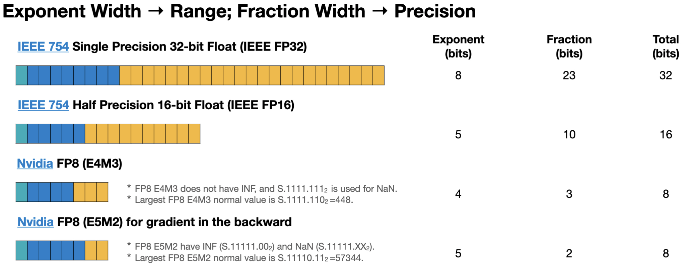
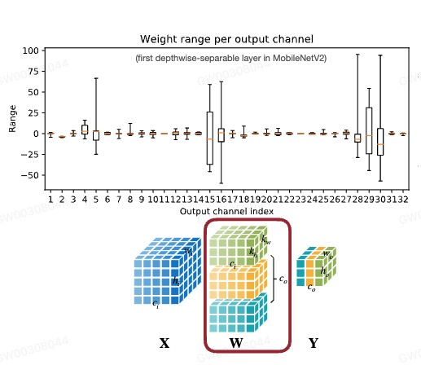

# अध्याय 4 मॉडल परिमाणीकरण

&emsp;&emsp;इस अध्याय में हम खंड 4.1 में सीखेंगे कि परिमाणीकरण क्या है? परिमाणीकरण क्यों? धारा 4.2 सीखती है कि विभिन्न डेटा प्रकारों का प्रतिनिधित्व कैसे किया जाता है, और 4.3 परिमाणीकरण की बुनियादी विधियाँ और विभिन्न डेटा प्रकारों के बीच परिमाणीकरण रूपांतरण कैसे करें। परिमाणीकरण के बुनियादी सिद्धांतों को सीखने के बाद, हम खंड 4.4, 4.5, और 4.6 में परिमाणीकरण प्रभाव को अनुकूलित करने के लिए विभिन्न परिमाणीकरण रणनीतियों को सीखेंगे। अंत में, हम कई मात्रात्मक प्रथाओं के माध्यम से सीखे गए ज्ञान को समेकित करते हैं।

## 4.1 परिमाणीकरण क्या है? परिमाणीकरण क्यों?

&emsp;&emsp;पिछले अध्याय में, हमने प्रूनिंग के बारे में सीखा। प्रूनिंग ऑपरेशन नेटवर्क में मापदंडों की संख्या को कम कर सकता है, जिससे मॉडल संपीड़ित हो सकता है। परिमाणीकरण एक अन्य विधि है जो मॉडल मापदंडों को संपीड़ित कर सकती है। क्वांटाइजेशन तंत्रिका नेटवर्क के फ्लोटिंग पॉइंट एल्गोरिदम को निश्चित बिंदु में परिवर्तित करता है और नेटवर्क में प्रत्येक पैरामीटर द्वारा कब्जा किए गए बिट्स की संख्या को संशोधित करता है, जिससे मॉडल पैरामीटर द्वारा कब्जा किए गए स्थान को कम किया जाता है।

&emsp;&emsp;मोबाइल टर्मिनल में मेमोरी और कंप्यूटिंग पावर जैसे सीमित हार्डवेयर संसाधन हैं। परिमाणीकरण मॉडल के आकार को कम कर सकता है, जिससे मेमोरी और कंप्यूटिंग शक्ति का उपयोग कम हो सकता है। साथ ही, परिमाणीकरण मॉडल की अनुमान गति में सुधार कर सकता है। नीचे दिया गया आंकड़ा विभिन्न डेटा प्रकारों के जोड़ और गुणन संचालन की समय लेने वाली तुलना को दर्शाता है।

&emsp;&emsp;मॉडल परिमाणीकरण के निम्नलिखित लाभ हैं:
- मॉडल का आकार कम करें: उदाहरण के लिए, int8 परिमाणीकरण मॉडल के आकार को 75% तक कम कर सकता है। int8 परिमाणीकरण मॉडल का आकार आम तौर पर 32-बिट फ्लोटिंग पॉइंट मॉडल के आकार का 1/4 होता है;
  - भंडारण स्थान कम करें: यह तब अधिक सार्थक है जब अंतिम तरफ भंडारण स्थान अपर्याप्त हो।
  - कम मेमोरी फ़ुटप्रिंट: बेशक, छोटे मॉडल का मतलब है कि अधिक मेमोरी स्पेस की आवश्यकता नहीं है।
  - डिवाइस की बिजली खपत कम करें: कम मेमोरी खपत और तेज़ अनुमान गति स्वाभाविक रूप से डिवाइस की बिजली खपत को कम करती है।
- तर्क गति में तेजी लाएं: फ़्लोटिंग पॉइंट प्रकार int8 पूर्णांक प्रकार तक चार बार पहुंच सकता है, और int8 का उपयोग करके फ़्लोटिंग पॉइंट प्रकार CPU गणनाओं की तुलना में पूर्णांक प्रकार के संचालन तेज़ होते हैं;
- कुछ हार्डवेयर एक्सेलेरेटर जैसे डीएसपी/एनपीयू केवल int8 का समर्थन करते हैं। उदाहरण के लिए, कुछ माइक्रोप्रोसेसर 8-बिट होते हैं और इनमें बिजली की खपत कम होती है और फ्लोटिंग-पॉइंट ऑपरेशन चलाने में धीमे होते हैं और 8-बिट परिमाणीकरण की आवश्यकता होती है।
  
## 4.2 डेटा प्रकार

&emsp;&emsp;मॉडल परिमाणीकरण प्रक्रिया को दो भागों में विभाजित किया जा सकता है: अनुमान के लिए int8 का उपयोग करके मॉडल को fp32 से int8 में परिवर्तित करना; संपूर्ण परिमाणीकरण प्रक्रिया डेटा प्रकारों के रूपांतरण से निकटता से संबंधित है। आइए पहले इस अनुभाग के डेटा को समझेंप्रकार। यदि आप बुनियादी डेटा प्रकारों को नहीं समझते हैं, तो आप अक्सर बाद के मात्रात्मक विवरणों में भ्रमित होंगे।
#### 4.2.1 पूर्णांक प्रकार (पूर्णांक)
&emsp;&emsp;जैसा कि नीचे दिए गए चित्र में दिखाया गया है, पूर्णांक डेटा को अहस्ताक्षरित पूर्णांक (अनसाइन्ड इंटीजर) और हस्ताक्षरित पूर्णांक (हस्ताक्षरित पूर्णांक) में विभाजित किया जा सकता है।
- अहस्ताक्षरित पूर्णांक प्रकार: डेटा रेंज 0 से $2^{n-1}$ है, n डेटा बिट्स की संख्या है।
- हस्ताक्षरित पूर्णांक:
  - मूल कोड प्रतिनिधित्व (साइन-परिमाण प्रतिनिधित्व): इसके कार्यान्वयन का सिद्धांत बाइनरी संख्या के उच्चतम बिट (बाएं से पहला) को साइन बिट के रूप में लेना है, यह सहमति है कि जब साइन बिट 0 है। यह एक सकारात्मक संख्या का प्रतिनिधित्व करता है, और जब साइन बिट 1 होता है, तो यह एक नकारात्मक संख्या का प्रतिनिधित्व करता है, शेष बाइनरी बिट्स का उपयोग मूल्य के पूर्ण मूल्य के लिए किया जाता है। डेटा रेंज $-2^{n-1}-1$ से $2^{n-1}-1$ है, n डेटा बिट्स की संख्या है।
  - दो का पूरक प्रतिनिधित्व: स्रोत कोड प्रतिनिधित्व की कमियों को पूरा करने के लिए, प्रतीकात्मक प्रतिनिधित्व के कार्य के अलावा, +0 और -0 के दो प्रतिनिधित्व हैं, उच्चतम बिट का वजन मूल्य भी है। डेटा रेंज $-2^{n-1}$ से $2^{n-1}-1$ है, n डेटा बिट्स की संख्या है।

### 4.2.2 निश्चित बिंदु संख्या

&emsp;&emsp;निश्चित-बिंदु संख्याओं की कुंजी दो शब्दों "निश्चित" और "बिंदु" में निहित है, अर्थात, दशमलव डेटा का प्रतिनिधित्व करते समय, दशमलव बिंदु की स्थिति को एक निश्चित स्थिति पर तय करने पर सहमति व्यक्त की गई है। इसके अनुरूप एक फ़्लोटिंग पॉइंट संख्या है, जिसकी दशमलव बिंदु स्थिति निश्चित नहीं है। जैसा कि नीचे दिए गए चित्र में दिखाया गया है, नीले भाग को साइन बिट के रूप में, हरे भाग को पूर्णांक बिट के रूप में और नारंगी भाग को दशमलव स्थान के रूप में निर्दिष्ट करें।

### 4.2.3 फ़्लोटिंग पॉइंट नंबर

जैसा कि नीचे दिए गए चित्र में दिखाया गया है, फ्लोटिंग-पॉइंट संख्या के प्रत्येक अंक द्वारा दर्शाया गया मान एक निश्चित-पॉइंट संख्या के समान है, लेकिन गणना विधि अब एक साधारण जोड़ नहीं है। उनमें से, भिन्न दशमलव भाग का प्रतिनिधित्व करता है और घातांक, घातांक भाग का प्रतिनिधित्व करता है। अंश और घातांक में अंकों की संख्या क्रमशः डेटा की सटीकता और प्रतिनिधित्व सीमा निर्धारित करती है। घातांक का पूर्वाग्रह = 127 = $2^{7}-1$, इसलिए घातांक भाग द्वारा दर्शाई गई सीमा -127 से 128 है।

&emsp;&emsp;fp32 फ़्लोटिंग पॉइंट संख्याओं का अभिव्यक्ति सूत्र इस प्रकार है:

$$
fp32 = (-1)^{चिह्न}·(1+अंश)·2^{घातांक-127}
$$

&emsp;&emsp;आइए सोचें कि 0 को कैसे दर्शाया जाए? जैसा कि नीचे दिए गए चित्र में दिखाया गया है, हम निर्धारित करते हैं कि जब घातांक 0 है, तो भिन्न भाग को 1 नहीं जोड़ने के लिए मजबूर किया जाता है, और घातांक भाग को 1-पूर्वाग्रह = -126 करने के लिए मजबूर किया जाता है। जब भिन्न = 0, तो इसका अर्थ 0 है। इस प्रतिनिधित्व को अनियमित फ़्लोटिंग पॉइंट नंबर कहा जाता है। सूत्र इस प्रकार है:

$$
fp32 = (-1)^{चिह्न}·(अंश)·2^{1-127}
$$

&emsp;&emsp;इन दोनों निरूपणों के बीच अंतर यह है कि जब घातांक 0 के बराबर नहीं होता है, तो सामान्य फ़्लोटिंग पॉइंट प्रतिनिधित्व का उपयोग किया जाता है। जब घातांक = 0, अपसामान्य निरूपण का उपयोग किया जाता है।
- सामान्य फ़्लोटिंग पॉइंट द्वारा दर्शाया जा सकने वाला सबसे छोटा सकारात्मक मान भिन्न = 0, घातांक = 1 है, जिसका परिणाम $2^{-126}$ होता है।
$$
(1+0)·2^{1-127} = 2^{-126}
$$
- असामान्य फ़्लोटिंग पॉइंट द्वारा दर्शाया जाने वाला सबसे छोटा सकारात्मक मान अंश = $2^{-23}$ है, जिसका परिणाम $2^{-149}$ होता है।
$$
2^{-23}·2^{1-127} = 2^{-149}
$$
- एक अनौपचारिक फ़्लोटिंग पॉइंट द्वारा दर्शाया जा सकने वाला अधिकतम मान अंश है जहां सभी भाग 1 हैं, और परिणाम $2^{-126}-2^{-149}$ है।
- सामान्य फ़्लोटिंग पॉइंट संख्या द्वारा दर्शाया जा सकने वाला अधिकतम मान भिन्न = $2^{-23}$ है, और परिणाम $(1+1-2^{-23})·2^{127}$ है।
- जब एक सामान्य फ़्लोटिंग पॉइंट संख्या का दशमलव भाग सभी 0 है, और घातांक भाग सभी 1 है, तो इसका मतलब क्रमशः सकारात्मक अनंत और नकारात्मक अनंत है।

जैसा कि नीचे दिखाया गया है, हम अन्य डेटा प्रकारों तक विस्तार कर सकते हैं:
- जब घातांक अंक 5 और भिन्न अंक 11 हों, तो यह fp16 होता है।
  $$
  fp16 = (-1)^{चिह्न}·(1+अंश)·2^{घातांक-15}
  $$
- जब घातांक अंक 8 और भिन्न अंक 7 हों तो यह bf16 होता है।
$$
bf16 = (-1)^{चिह्न}·(1+अंश)·2^{घातांक-127}
$$
- जब घातांक अंक 4 और भिन्न अंक 3 हों, तो यह fp8 (E4M3) होता है।
  $$
  fp8 = (-1)^{चिह्न}·(1+अंश)·2^{घातांक-7}$$
- जब घातांक अंक 5 और भिन्न अंक 2 हों, तो यह fp8 (E5M2) होता है।
  $$
  fp8 = (-1)^{चिह्न}·(1+अंश)·2^{घातांक-15}
  $$
&emsp;&emsp;हमें यह ध्यान देने की आवश्यकता है कि fp8 की दो प्रतिनिधित्व विधियों में से एक में उच्च परिशुद्धता है और दूसरे में बड़ी प्रतिनिधित्व सीमा है।

## 4.3 परिमाणीकरण की बुनियादी विधियाँ

&emsp;&emsp;भंडारण और गणना में उपयोग किए जाने वाले विभिन्न डेटा प्रकारों के आधार पर, निम्नलिखित दो परिमाणीकरण विधियां मुख्य रूप से पेश की जाती हैं:
- के-साधन-आधारित परिमाणीकरण: भंडारण (पूर्णांक डेटा का भार + फ़्लोटिंग पॉइंट रूपांतरण तालिका), गणना (फ़्लोटिंग पॉइंट गणना)।
- रैखिक परिमाणीकरण: भंडारण (पूर्णांक भंडारण), गणना (फ़्लोटिंग पॉइंट स्टोरेज)।
 

### 4.3.1 के-साधन परिमाणीकरण

&emsp;&emsp;जैसा कि नीचे दिए गए चित्र में दिखाया गया है, k-मतलब परिमाणीकरण क्लस्टर वजन। प्रत्येक वजन की स्थिति ही हैक्लस्टर के सूचकांक मूल्य को संग्रहीत करने की आवश्यकता है। वज़न को 4 श्रेणियों में क्लस्टर करके, 2-बिट संपीड़न प्राप्त किया जा सकता है।
भंडारण व्यवसाय 32 बिट x 16 = 512 बिट = 64 बी से बदलता है ----> 2 बिट x 16 + 32 बिट x 4 = 32 बिट + 128 बिट = 160 बिट = 20 बी

&emsp;&emsp;जब वजन बड़ा होगा, तो संपीड़न अनुपात बड़ा होगा।

- अनुमान के दौरान, हम रूपांतरण तालिका पढ़ते हैं और सूचकांक मूल्य के आधार पर संबंधित मूल्य प्राप्त करते हैं।
- प्रशिक्षण के दौरान, हम वजन की क्लस्टरिंग विधि के अनुसार ग्रेडिएंट को क्लस्टर और जोड़ते हैं, रूपांतरण तालिका में वापस प्रचारित करते हैं, और रूपांतरण तालिका के मूल्य को अपडेट करते हैं।

&emsp;&emsp;निम्नलिखित एक संपीड़न प्रक्रिया है जो पिछले अनुभाग में प्रूनिंग और के-मीन्स परिमाणीकरण को जोड़ती है। सबसे पहले, प्रूनिंग मॉडल में मापदंडों को काटती है, और इष्टतम प्रूनिंग मॉडल प्राप्त करने के लिए चक्रीय रूप से फाइन-ट्यूनिंग और प्रूनिंग करती है। फिर, के-मीन्स क्वांटाइजेशन, काटे गए मापदंडों को क्लस्टर करता है, मॉडल में क्लस्टर किए गए इंडेक्स मानों को संग्रहीत करता है, संबंधित इंडेक्स तालिका बनाता है, और मॉडल को ठीक करता है।

### 4.3.2 रैखिक परिमाणीकरण
#### 4.3.2.1 रूपांतरण सूत्र
&emsp;&emsp;जैसा कि नाम से पता चलता है, रैखिक परिमाणीकरण मूल फ्लोटिंग पॉइंट डेटा और क्वांटाइज्ड फिक्स्ड पॉइंट डेटा के बीच एक सरल रैखिक परिवर्तन संबंध स्थापित करना है क्योंकि कनवल्शन, पूरी तरह से कनेक्टेड और अन्य नेटवर्क परतें केवल सरल रैखिक गणना हैं, इसलिए क्वांटाइज्ड डेटा का सीधे उपयोग किया जा सकता है। प्रत्यक्ष गणना के लिए रैखिक परिमाणीकरण।

&emsp;&emsp;हम एक फ़्लोटिंग-पॉइंट वास्तविक संख्या का प्रतिनिधित्व करने के लिए r का उपयोग करते हैं और एक परिमाणित निश्चित-बिंदु पूर्णांक का प्रतिनिधित्व करने के लिए q का उपयोग करते हैं। फ़्लोटिंग पॉइंट और पूर्णांक के बीच रूपांतरण सूत्र है:

$$
आर = (क्यू - जेड) / स्केल
$$
$$
क्यू = गोल(आर / एस + जेड)
$$

उनमें से, S पैमाना है, जो वास्तविक संख्याओं और पूर्णांकों के बीच आनुपातिक संबंध को दर्शाता है, Z शून्य बिंदु है, जो परिमाणीकरण के बाद फ्लोटिंग पॉइंट संख्या में 0 के अनुरूप पूर्णांक को दर्शाता है। उनकी गणना विधि है:
$$
एस = \frac{r_{max} - r_{min}}{q_{max} - q_{min}}
$$
$$
Z = गोलाकार(q_{max}-\frac{r_{max}}{S})
$$

&emsp;&emsp;उनमें से, $r_{max}$ और $r_{max}$ क्रमशः फ़्लोटिंग-पॉइंट संख्याओं में न्यूनतम और अधिकतम मानों का प्रतिनिधित्व करते हैं, $q_{max}$ और $q_{min}$ क्रमशः प्रतिनिधित्व करते हैं निश्चित-बिंदु संख्याओं में न्यूनतम और अधिकतम मान।

#### 4.3.2.2 रैखिक मैट्रिक्स गुणन परिमाणीकरण

&emsp;&emsp;रैखिक मैट्रिक्स गुणन परिमाणीकरण, मैट्रिक्स गुणन के लिए रैखिक परिमाणीकरण का अनुप्रयोग है।

&emsp;&emsp;मैट्रिक्स गुणन को निम्नलिखित सूत्र द्वारा व्यक्त किया जा सकता है:

$$
वाई=डब्ल्यूएक्स
$$

&emsp;&emsp;मान लें कि $S_Y$ और $Z_Y$ मैट्रिक्स आउटपुट Y के अनुरूप स्केल और शून्य बिंदु हैं, $S_W$, $Z_W$, $S_X$, $Z_X$ समान हैं, तो इसे इससे निकाला जा सकता है उपरोक्त सूत्र:

$$
S_Y(q_Y-Z_Y) = S_W(q_W-Z_W)·S_X(q_S-Z_X)
$$

&emsp;&emsp;इसे छांटने के बाद, आप प्राप्त कर सकते हैं:
$$
q_Y = \frac{S_WS_X}{S_Y}(q_Wq_X-Z_Wq_X-Z_Xq_W+Z_WZ_X) + Z_Y
$$

&emsp;&emsp;उनमें से, $\frac{S_WS_X}{S_Y}$ को $2^{-n}M_0$ के रूप में व्यक्त किया जाता है और एक निश्चित-बिंदु गणना में परिवर्तित किया जाता है, अनुमानित स्केलिंग कारक को शिफ्टिंग के माध्यम से प्राप्त किया जा सकता है। तथाकथित निश्चित बिंदु का अर्थ है कि दशमलव बिंदु की स्थिति निश्चित है, अर्थात दशमलव स्थानों की संख्या निश्चित है। $Z_Xq_W$ और $Z_WZ_X$ और $Z_Y$ की हम पहले से गणना कर सकते हैं।

&emsp;&emsp;क्या हम कर सकते हैंमाना $Z_W$ का मान 0 है? जब $Z_W$ का मान 0 है, तो हमें केवल $q_W$ और $q_X$ को स्टोर करने की आवश्यकता है, फिर सूत्र के अनुसार $q_Y$ की गणना करें, और अंत में $q_Y$ को स्टोर करें।

&emsp;&emsp;जब $Z_W$ का मान 0 है, तो संबंधित परिमाणीकरण विधि रैखिक सममित परिमाणीकरण (सममित परिमाणीकरण) है।

&emsp;&emsp;गणना सूत्र इस प्रकार रूपांतरित होता है:
$$
S =\frac{|r|_{max}}{2^{N-1}}
$$
$$
जेड = 0
$$

&emsp;&emsp;जिसमें, $N$ निश्चित-बिंदु संख्या के दशमलव स्थानों की संख्या को दर्शाता है।

&emsp;&emsp;मैट्रिक्स गुणन का सूत्र इस प्रकार बनता है:
$$
q_Y = \frac{S_WS_X}{S_Y}(q_Wq_X-Z_Xq_W) + Z_Y
$$

#### 4.3.2.3 पूरी तरह से जुड़ा हुआ परत रैखिक परिमाणीकरण
मैट्रिक्स गुणन की तुलना में, पूरी तरह से जुड़ी हुई परत के रैखिक परिमाणीकरण में एक और पूर्वाग्रह होता है, इसलिए पूर्वाग्रह को रैखिक रूप से परिमाणित करने की आवश्यकता होती है।
सममित परिमाणीकरण के साथ पूरी तरह से जुड़ी परत का रैखिक परिमाणीकरण सूत्र है:
$$
{S_Y}(q_Y-Z_Y) = {S_WS_X}(q_Wq_X-Z_Xq_W) + S_b(q_b-Z_b)
$$

&emsp;&emsp;उनमें से, $S_b$ पूर्वाग्रह के स्केलिंग कारक का प्रतिनिधित्व करता है।

&emsp;&emsp;हम $Z_b=0$, $S_b=S_WS_X$ को बाध्य करते हैं, फिर पूरी तरह से जुड़ी परत का रैखिक परिमाणीकरण सूत्र बन जाता है:
$$
{S_Y}(q_Y-Z_Y) = {S_WS_X}(q_Wq_X-Z_Xq_W+q_b)
$$
$$
q_Y = \frac{S_WS_X}{S_Y}(q_Wq_X-Z_Xq_W+q_b) + Z_Y
$$

&emsp;&emsp;उनमें से, $-Z_Xq_W+q_b$ की गणना पहले से की जा सकती है।

#### 4.3.2.4 संकेंद्रित परत का रैखिक परिमाणीकरण

&emsp;&emsp;कन्वेंशनल परत रैखिक परिमाणीकरण में पूरी तरह से जुड़े परत रैखिक परिमाणीकरण की तुलना में एक अधिक कनवल्शन कर्नेल होता है, इसलिए कनवल्शन का रैखिक परिमाणीकरण सूत्र प्राप्त किया जा सकता है:
$$
q_Y = \frac{S_WS_X}{S_Y}(Conv(q_W,q_X)-Conv(Z_X,q_W)+q_b) + Z_Y
$$

&emsp;&emsp;नीचे दिया गया आंकड़ा मॉडल परिमाणीकरण के बाद अनुमान प्रक्रिया को दर्शाता है। परिमाणित सक्रियण और परिमाणित भार को संयोजित किया जाता है, और फिर पूर्वाग्रह जोड़ा जाता है। स्केल_फैक्टर के समानअंतिम परिमाणीकरण परिणाम प्राप्त करने के लिए आउटपुट का शून्य_बिंदु गुणा करें और जोड़ें।

## 4.4 प्रशिक्षण के बाद परिमाणीकरण

&emsp;&emsp;प्रशिक्षणोत्तर परिमाणीकरण (पीटीक्यू) प्रशिक्षण पूरा होने के बाद मॉडल को परिमाणित करने को संदर्भित करता है, इसलिए इसे ऑफ़लाइन परिमाणीकरण भी कहा जाता है। क्वांटिज़ेशन शून्य बिंदु 0 है या नहीं, इसके अनुसार प्रशिक्षण के बाद क्वांटिज़ेशन को सममित क्वांटिज़ेशन और असममित क्वांटिज़ेशन में विभाजित किया गया है। इस भाग को क्वांटिज़ेशन ग्रैन्युलैरिटी के अनुसार, प्रशिक्षण के बाद क्वांटिज़ेशन को परत-दर-परत में विभाजित किया गया है; परत परिमाणीकरण, चैनल-दर-चैनल परिमाणीकरण और समूह परिमाणीकरण।

&emsp;&emsp;परिमाणीकरण सटीकता में कमी लाएगा, तो सटीकता पर प्रभाव को कम करने के लिए परिमाणीकरण में उपयोग किए जाने वाले मापदंडों (जैसे स्केलिंग कारक, शून्य बिंदु) का चयन कैसे करें? यहीं पर हमें ध्यान केंद्रित करने की जरूरत है। परिमाणीकरण त्रुटि दो पहलुओं से आती है, एक है क्लिप ऑपरेशन और दूसरा है राउंड ऑपरेशन। इसलिए, हम गतिशील परिमाणीकरण मापदंडों की गणना पद्धति और राउंड ऑपरेशन के प्रभाव का भी परिचय देंगे।

### 4.4.1 परिमाणीकरण ग्रैन्युलैरिटी

&emsp;&emsp;परत-वार परिमाणीकरण से तात्पर्य प्रत्येक परत को परिमाणित करने से है, जैसेजैसा कि नीचे दिए गए चित्र में लाल बॉक्स में दिखाया गया है, तीन चैनल एक परिमाणीकरण पैरामीटर साझा करते हैं। लेकिन हम देख सकते हैं कि विभिन्न चैनलों की डेटा रेंज अलग-अलग हैं। इसलिए, जब परत-वार परिमाणीकरण प्रभावी नहीं होता है, तो प्रत्येक चैनल को परिमाणित करने की आवश्यकता होती है।

&emsp;&emsp;चैनल-वार परिमाणीकरण, चैनल आयामों के अनुसार डेटा को विभाजित करना और प्रत्येक चैनल के डेटा को अलग-अलग मात्राबद्ध करना है। परत-दर-परत परिमाणीकरण की तुलना में, चैनल-वार परिमाणीकरण परिमाणीकरण त्रुटि को कम कर सकता है, लेकिन इसके लिए अधिक की आवश्यकता होती है। अधिक भंडारण स्थान। चूंकि वर्तमान मॉडल बड़ा और बड़ा होता जा रहा है, प्रत्येक चैनल में अधिक पैरामीटर हैं, और पैरामीटर की मूल्य सीमा भी बड़ी और बड़ी होती जा रही है, इसलिए हमें अधिक सुक्ष्म परिमाणीकरण विधि की आवश्यकता है।

&emsp;&emsp;समूह परिमाणीकरण का तात्पर्य चैनल में डेटा को वैक्टर के कई समूहों में विभाजित करना है, और वैक्टर का प्रत्येक समूह एक परिमाणीकरण पैरामीटर साझा करता है।

### 4.4.2 गतिशील परिमाणीकरण मापदंडों की गणना (क्लिपिंग)
#### 4.4.2.1 एक्सपोनेंशियल मूविंग एवरेज (ईएमए)

&emsp;&emsp;एक्सपोनेंशियल मूविंग एवरेज (ईएमए) आमतौर पर इस्तेमाल की जाने वाली सांख्यिकीय पद्धति है जिसका उपयोग डेटा के एक्सपोनेंशियल मूविंग एवरेज की गणना करने के लिए किया जाता है।

&emsp;&emsp;ईएमए प्रशिक्षण प्रक्रिया के दौरान सक्रियण फ़ंक्शन की मूल्य सीमा $r_{min}$ और $r_{max}$ एकत्र करता है, और फिर प्रत्येक युग में इन मूल्य श्रेणियों को सुचारू करता है।

&emsp;&emsp;ईएमए की गणना सूत्र इस प्रकार है:
$$
r^{t+1}_{min,max} = \alpha r^{t}_{min,max} + (1-\alpha) r^{t+1}_{min,max}
$$

उनमें से, $r^{t}_{min,max}$ चरण $t$ की मान सीमा का प्रतिनिधित्व करता है, और $\alpha$ स्मूथिंग गुणांक का प्रतिनिधित्व करता है।

#### 4.4.2.2 न्यूनतम-अधिकतम

&emsp;&emsp;मिन-मैक्स प्रशिक्षित fp32 मॉडल पर थोड़ी मात्रा में अंशांकन डेटा चलाकर आमतौर पर उपयोग की जाने वाली अंशांकन विधि है। अंशांकन डेटा के $r_{min,max}$ की गणना करें और औसत को परिमाणीकरण पैरामीटर के रूप में लें।

#### 4.4.2.3 केएल मात्राकरण

&emsp;&emsp;केएल परिमाणीकरण डेटा और परिमाणित डेटा के बीच समानता को मापने के लिए केएल विचलन का उपयोग करता है; यह विधि सीधे $[min, max] $v से $[-127,128]$ को मैप नहीं करती है, लेकिन एक सीमा $|T| <अधिकतम(|अधिकतम|, |न्यूनतम|)$ , सेट $ [-T, T]$ मानचित्र $[-127, 128]$ तक। और यह माना जाता है कि जब तक सीमा को उचित रूप से चुना जाता है ताकि दो डेटा के बीच वितरण समान हो, सटीकता हानि पर कोई प्रभाव नहीं पड़ेगा।

$$
D_{KL}(P||Q) = \sum_{i=1}^nP(x_i)\log\frac{P(x_i)}{Q(x_i)}
$$

#### 4.4.2.4 माध्य वर्ग त्रुटि (एमएसई)

&emsp;&emsp;माध्य वर्ग त्रुटि परिमाणीकरण का तात्पर्य इनपुट डेटा $X$ और परिमाणित डेटा $Q(X)$ के बीच माध्य वर्ग त्रुटि को कम करके सबसे उपयुक्त परिमाणीकरण मापदंडों की गणना करना है।

$$
न्यूनतम_{|r|_{अधिकतम}}E|(X-Q(X))^2|
$$

&emsp;&emsp;$|r|_{max}$ को गतिशील रूप से समायोजित करके माध्य वर्ग त्रुटि को कम करें।

### 4.4.3 गोलाई

&emsp;&emsp;राउंडिंग का तात्पर्य फ़्लोटिंग पॉइंट संख्याओं को पूर्णांकित करना और फ़्लोटिंग पॉइंट संख्याओं को पूर्णांकों में मैप करना है। सबसे अधिक उपयोग की जाने वाली राउंडिंग विधि राउंडिंग-टू-नियरेस्ट है। जैसा कि नीचे दिए गए चित्र में दिखाया गया है, यदि हम समग्र डेटा वितरण पर विचार करें तो वज़न को 0.5 से 1 तक पूर्णांकित करना एक अच्छा विकल्प नहीं है।

&emsp;&emsp;परिमाणीकरण प्रभाव जो हम अंततः चाहते हैं वह यह है कि आउटपुट डेटा का नुकसान जितना संभव हो उतना छोटा हो, इसलिए हम आउटपुट पर राउंडिंग के प्रभाव को आंककर वजन की राउंडिंग विधि निर्धारित कर सकते हैं, जो कि AdaRound है। सरलीकृत गणना सूत्र इस प्रकार है:

$$
argmin||(Wx-\वाइडहैट{W}x)||
$$

&emsp;&emsp;उनमें से, $\वाइडहैट{W} = \lfloor\lfloor{W}\rfloor+\sigma\rceil$ , $\sigma \in [0,1]$, यह दर्शाता है कि क्या वर्तमान मान पूर्णांकित है या नीचे गोलाई.

## 4.5 परिमाणीकरण-जागरूक प्रशिक्षण

&emsp;&emsp;क्वांटाइजेशन-अवेयर ट्रेनिंग (क्यूएटी) प्रशिक्षण प्रक्रिया के दौरान मॉडल में सिम्युलेटेड क्वांटाइजेशन ऑपरेटरों को जोड़ने, अनुमान चरण में क्वांटाइज्ड मॉडल के राउंडिंग और क्लिपिंग संचालन का अनुकरण करने और क्वांटाइजेशन त्रुटियों को पेश करने को संदर्भित करता है। और मॉडल मापदंडों को बैकप्रॉपैगेशन के माध्यम से अद्यतन किया जाता है ताकि मॉडल परिमाणीकरण के बाद और परिमाणीकरण से पहले सुसंगत बना रहे।

### 4.5.1 आगे प्रसार

जैसा कि ऊपर चित्र में दिखाया गया है, मात्रात्मक प्रशिक्षण की आगे की प्रसार प्रक्रिया इस प्रकार है:

&emsp;&emsp;1) $Layer_{N-1}$ का आउटपुट $Q(X)$ को अगली परत $Layer_{N}$ में इनपुट के रूप में पास किया जाता है, जहां $Q(X)$ परिमाणित और विखंडित डेटा का प्रतिनिधित्व करता है;

&emsp;&emsp;2) $Layer_{N}$ का वजन $W$ परिमाणीकरण और डीक्वांटाइजेशन के बाद $Q(W)$ बन जाता है, और आउटपुट $Y$ की गणना करने के लिए नया वजन और $Q(X)$ बन जाता है।

&emsp;&emsp;3) $Y$ को परिमाणित और विखंडित करने के बाद, Q(Y) प्राप्त किया जाता है और अगली परत $Layer_{N+1}$ पर इनपुट किया जाता है।

&emsp;&emsp;क्योंकि int8 की प्रतिनिधित्व सीमा fp32 की तुलना में बहुत छोटी है, जब fp32 को int8 में परिमाणित किया जाता है, तो विभिन्न आकारों के डेटा को int8 के समान मान पर मैप किया जाएगा, और जब fp32 पर व्युत्क्रम रूप से परिमाणित किया जाता है, तो त्रुटियां होंगी। परिमाणीकरण और व्युत्क्रम परिमाणीकरण ऑपरेशन मॉडल के प्रशिक्षण में परिमाणीकरण त्रुटि को पेश करना है।

&emsp;&emsp;हमें ध्यान देना चाहिए कि संपूर्ण परिमाणीकरण प्रक्रिया में ऑपरेटरों की गणना उच्च परिशुद्धता के साथ पूरी की जाती है।

### 4.5.2 बैकप्रॉपैगेशन

&emsp;&emsp;परिमाणीकरण-जागरूक प्रशिक्षण का हानि कार्य सामान्य प्रशिक्षण के हानि कार्य के समान है, लेकिन परिमाणित भार अलग-अलग मूल्य हैं। यह आंकड़ा $W$ और $Q(W)$ के बीच संबंध दिखाता है।

&emsp;&emsp;निम्नलिखित सूत्र प्राप्त किया जा सकता है:
$$
\frac{\आंशिक{Q(W)}}{\आंशिक{W}}=0
$$

&emsp;&emsp;व्युत्पन्न सूत्र को निम्नानुसार परिवर्तित किया जा सकता है:

$$
g_w =\frac{\आंशिक{L}}{\आंशिक{W} आंशिक{W}} =0
$$

यदि ग्रेडिएंट की गणना उपरोक्त सूत्र के अनुसार की जाती है, तो ग्रेडिएंट हमेशा 0 होगा और ग्रेडिएंट को अपडेट नहीं किया जा सकता है। इसलिए, लोगों ने एक संशोधित विधि, स्ट्रीमिंग-थ्रेसहोल्डिंग-एरर (एसटीई) का प्रस्ताव रखा। मान लें कि $W$ और $Q(W)$ के बीच का संबंध उपरोक्त चित्र में लाल बिंदीदार रेखा है, $W = Q(W)$, $
\frac{\partial{Q(W)}}{\partial{W}}=1$, ग्रेडिएंट सूत्र को निम्नलिखित सूत्र में परिवर्तित किया जा सकता है:

$$
g_w =\frac{\आंशिक{L}}}
$$
&emsp;&emsp;इस तरह, हम जवाबी उपाय कर सकते हैंप्रसार गणना.

## 4.6 मिश्रित परिशुद्धता परिमाणीकरण

मिश्रित-परिशुद्धता परिमाणीकरण एक ऐसी विधि को संदर्भित करता है जो मॉडल के आकार और कम्प्यूटेशनल लागत को कम करने के लिए कम-परिशुद्धता और उच्च-परिशुद्धता दोनों डेटा प्रकारों का उपयोग करता है। विभिन्न परतों के लिए विशेष रूप से अलग-अलग परिमाणीकरण परिशुद्धता का चयन करके, परिमाणीकरण त्रुटियों के प्रसार और संचय को प्रभावी ढंग से टाला जा सकता है, जिससे यह सुनिश्चित होता है कि मॉडल का प्रदर्शन प्रभावित नहीं होता है।

## 4.7 ऐच्छिक

### 4.7.1 INT4 और FP4

&emsp;&emsp;INT4 और FP4 विशेष निश्चित-बिंदु संख्याएँ और फ़्लोटिंग-बिंदु संख्याएँ हैं। वर्तमान मॉडल बड़े और बड़े होते जा रहे हैं, इसलिए हमें कम बिट्स प्रतिनिधित्व विधि की आवश्यकता है।

&emsp;&emsp;INT4 -8 से 7 तक की सीमा का प्रतिनिधित्व करता है; FP4 एक ऐसी सीमा का प्रतिनिधित्व करता है जो घातांक और दशमलव स्थानों के आधार पर भिन्न होती है। विशिष्ट प्रतिनिधित्व सीमा नीचे दिए गए चित्र में दिखाई गई है।

### 4.7.2 बाइनरी और तीन-मूल्यवान परिमाणीकरण

अद्यतन किया जाना~
## अभ्यास
1. [के-मीन्स क्वांटजेशन अभ्यास](https://github.com/datawhalechina/awesome-compression/blob/main/docs/notebook/ch04/1.kmeans_quantzations.ipynb)2. [रैखिक परिमाणीकरण अभ्यास](https://github.com/datawhalechina/awesome-compression/blob/main/docs/notebook/ch04/2.linear_quantizations.ipynb)
3. [केएल परिमाणीकरण अभ्यास](https://github.com/datawhalechina/awesome-compression/blob/main/docs/notebook/ch04/3.KL_quantization.ipynb)
4. [मात्रात्मक जागरूकता प्रशिक्षण अभ्यास](https://github.com/datawhalechina/awesome-compression/blob/main/docs/notebook/ch04/4.pytorch_QAT.ipynb)