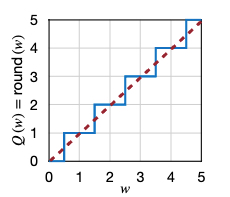

# अध्याय 4 मॉडल परिमाणीकरण

&emsp;&emsp;इस अध्याय में, हम सीखेंगे कि खंड 4.1 में परिमाणीकरण क्या है? खंड 4.2 में हम सीखेंगे कि विभिन्न डेटा प्रकारों का प्रतिनिधित्व कैसे किया जाए, और खंड 4.3 में हम परिमाणीकरण के बुनियादी तरीकों को सीखेंगे, कि विभिन्न डेटा प्रकारों को कैसे परिवर्तित किया जाए परिमाणीकरण। परिमाणीकरण के बुनियादी सिद्धांतों को सीखने के बाद, हम अनुभाग 4.4 में परिमाणीकरण प्रभाव को अनुकूलित करने के लिए विभिन्न परिमाणीकरण रणनीतियों को सीखेंगे।, 4.5, और 4.6 अंत में, हम कई परिमाणीकरण प्रथाओं के माध्यम से सीखे गए ज्ञान को समेकित करेंगे।

## 4.1 परिमाणीकरण क्या है? परिमाणीकरण क्यों?

&emsp;&emsp;पिछले अध्याय में, हमने प्रूनिंग के बारे में सीखा। प्रूनिंग नेटवर्क मापदंडों की संख्या को कम कर सकती है, जिससे मॉडल को संपीड़ित किया जा सकता है निश्चित-बिंदु, कब्जे वाले बिट्स की संख्या को संशोधित करता हैनेटवर्क में प्रत्येक पैरामीटर द्वारा आईईडी, और इस प्रकार मॉडल पैरामीटर द्वारा कब्जा किए गए स्थान को कम कर देता है।

&emsp;&emsp;मोबाइल टर्मिनल के हार्डवेयर संसाधन सीमित हैं, जैसे कि मेमोरी और कंप्यूटिंग पावर, क्वांटाइजेशन मॉडल के आकार को कम कर सकता है, जिससे मेमोरी और कंप्यूटिंग पावर कम हो सकती है, साथ ही, क्वांटाइजेशन अनुमान की गति में सुधार कर सकता है मॉडल का। निम्नलिखित आंकड़ा विभिन्न डेटा के जोड़ और गुणन संचालन की समय खपत की तुलना करता हैप्रकार.

&emsp;&emsp;मॉडल परिमाणीकरण के निम्नलिखित लाभ हैं:
- मॉडल का आकार कम करें: उदाहरण के लिए, int8 परिमाणीकरण मॉडल के आकार को 75% तक कम कर सकता है, और int8 परिमाणित मॉडल का आकार आम तौर पर 32-बिट फ्लोटिंग-पॉइंट मॉडल के आकार का 1/4 होता है;
- भंडारण स्थान कम करें: यह तब अधिक सार्थक है जब अंत में भंडारण स्थान अपर्याप्त हो।
- मेमोरी उपयोग कम करें: एक छोटा मॉडल निश्चित रूप से इसका मतलब हैअधिक मेमोरी स्पेस की आवश्यकता नहीं है.
- डिवाइस की बिजली खपत कम करें: कम मेमोरी खपत और तेज़ अनुमान गति स्वाभाविक रूप से डिवाइस की बिजली खपत को कम करती है।
- अनुमान गति को तेज करें: फ़्लोटिंग-पॉइंट प्रकार int8 पूर्णांकों तक चार बार पहुंच सकते हैं, और पूर्णांक संचालन फ़्लोटिंग-पॉइंट ऑपरेशंस की तुलना में तेज़ होते हैं, तेजी से गणना करने के लिए सीपीयू int8 का उपयोग करते हैं;
- कुछ हार्डवेयर एक्सेलेरेटर जैसे डीएसपी/एनपीयू केवल int8 का समर्थन करते हैं, उदाहरण के लिए, कुछ माइक्रोप्रोसेसर 8-बिट और फ्लोटिंग-पीओ के कम-शक्ति वाले ऑपरेशन हैंint संचालन धीमा है, इसलिए 8 बिट परिमाणीकरण की आवश्यकता है।

## 4.2 डेटा प्रकार

&emsp;&emsp;मॉडल परिमाणीकरण प्रक्रिया को दो भागों में विभाजित किया जा सकता है: अनुमान के लिए int8 का उपयोग करके मॉडल को int8 में परिवर्तित करना। संपूर्ण परिमाणीकरण प्रक्रिया डेटा प्रकारों के रूपांतरण से निकटता से संबंधित है। आइए पहले इस अनुभाग में डेटा को समझें। टाइप करें। यदि आप बुनियादी डेटा प्रकारों को नहीं समझते हैं, तो आप आमतौर पर बाद के मात्रात्मक विवरणों में भ्रमित होंगे।
#### 4.2.1 पूर्णांक
&emsp;&emsp;जैसानीचे दिए गए चित्र में दिखाया गया है, पूर्णांक डेटा को अहस्ताक्षरित पूर्णांक और हस्ताक्षरित पूर्णांक में विभाजित किया जा सकता है।
- अहस्ताक्षरित पूर्णांक: डेटा रेंज 0 से $2^{n-1}$ है, n डेटा बिट्स की संख्या है।
-हस्ताक्षरित पूर्णांक:
- साइन-परिमाण प्रतिनिधित्व: इसके कार्यान्वयन का सिद्धांत बाइनरी नंबर के उच्चतम बिट (बाएं से पहला बिट) को साइन बिट के रूप में लेना है, और सहमत है कि जब साइन बिट 0 है, तो यह एक सकारात्मक संख्या का प्रतिनिधित्व करता है, जब साइन बिट 1 होता है, तो यह एक नकारात्मक संख्या का प्रतिनिधित्व करता है, औरशेष बाइनरी बिट्स का उपयोग प्रदर्शित किए जाने वाले मान के पूर्ण मान के लिए किया जाता है। डेटा रेंज $-2^{n-1}-1$ से $2^{n-1}-1$ है, n डेटा की संख्या है। बिट्स
- दो का पूरक प्रतिनिधित्व: स्रोत कोड प्रतिनिधित्व की कमियों को पूरा करने के लिए, जिसमें +0 और -0 है, उच्चतम बिट में न केवल प्रतीक प्रतिनिधित्व का कार्य है, बल्कि एक वजन मूल्य भी है डेटा रेंज $- है। 2^{n-1}$ से $2^{n-1}-1$, जहां n डेटा बिट्स की संख्या है।

###4.2.2 निश्चित बिंदु संख्या

&emsp;&emsp;निश्चित बिंदु संख्याओं की कुंजी दो शब्द हैं "निश्चित" और "बिंदु", अर्थात, दशमलव डेटा का प्रतिनिधित्व करते समय, दशमलव बिंदु की स्थिति को इसके अनुरूप एक निश्चित स्थिति पर तय करने पर सहमति व्यक्त की गई है फ्लोटिंग पॉइंट नंबर है, जिसकी दशमलव बिंदु स्थिति निश्चित नहीं है, जैसा कि नीचे दिए गए चित्र में दिखाया गया है, नीला भाग साइन बिट है, हरा भाग पूर्णांक बिट है, और नारंगी भाग दशमलव बिट है।

### 4.2.3 फ़्लोटिंग पॉइंट नंबर

&emsp;&emsp;जैसा कि नीचे दिए गए चित्र में दिखाया गया है, फ़्लोटिंग पॉइंट संख्या के प्रत्येक अंक द्वारा दर्शाया गया मान निश्चित बिंदु संख्या के समान है, लेकिन गणना विधि अब एक साधारण जोड़ नहीं है, अंश का प्रतिनिधित्व करता है दशमलव भाग, और घातांक, घातांक भाग का प्रतिनिधित्व करते हैं। अंश और घातांक के अंकों की संख्या क्रमशः डेटा की सटीकता और प्रतिनिधित्व सीमा निर्धारित करती हैओनेंट = 127 = $2^{7}-1$, इसलिए घातांक भाग -127 से 128 तक की सीमा का प्रतिनिधित्व करता है।

&emsp;&emsp;fp32 फ़्लोटिंग पॉइंट संख्याओं का प्रतिनिधित्व करने का सूत्र इस प्रकार है:

$$
fp32 = (-1)^{चिह्न}·(1+अंश)·2^{घातांक-127}
$$

आइए विचार करें कि 0 को कैसे दर्शाया जाए? जैसा कि नीचे दिए गए चित्र में दिखाया गया है, हम निर्धारित करते हैं कि जब घातांक 0 होता है, तो अंश भाग को 1 जोड़ने के लिए बाध्य नहीं किया जाता है, और घातांक भाग को 1-पूर्वाग्रह = - करने के लिए बाध्य किया जाता है। 126. जब भिन्न = 0, तो यह निरूपित करता है0 भेजता है। इस प्रतिनिधित्व को गैर-सामान्य फ़्लोटिंग पॉइंट संख्या कहा जाता है। सूत्र इस प्रकार है:

$$
fp32 = (-1)^{चिह्न}·(अंश)·2^{1-127}
$$

&emsp;&emsp;इन दोनों निरूपणों के बीच अंतर यह है कि जब घातांक 0 के बराबर नहीं होता है, तो सामान्य फ़्लोटिंग पॉइंट प्रतिनिधित्व का उपयोग किया जाता है। जब घातांक = 0 होता है, तो गैर-सामान्य प्रतिनिधित्व का उपयोग किया जाता है।
- सामान्य फ़्लोटिंग पॉइंट द्वारा दर्शाया जाने वाला सबसे छोटा सकारात्मक मान अंश = 0, एक्सपो हैnent = 1, और परिणाम $2^{-126}$ है।
$$
(1+0)·2^{1-127} = 2^{-126}
$$
- असामान्य फ़्लोटिंग पॉइंट द्वारा दर्शाया जाने वाला सबसे छोटा सकारात्मक मान अंश = $2^{-23}$ है, और परिणाम $2^{-149}$ है।
$$
2^{-23}·2^{1-127} = 2^{-149}
$$
- एक गैर-सामान्य फ़्लोटिंग पॉइंट द्वारा दर्शाया जा सकने वाला अधिकतम मान यह है कि भिन्न भाग सभी 1 है, और परिणाम $2^{-126}-2^{-149}$ है।
- सामान्य फ़्लोटिंग पॉइंट संख्या द्वारा दर्शाया जा सकने वाला अधिकतम मान अंश = $2^{-23}$ है, और शेषअंतिम $(1+1-2^{-23})·2^{127}$ है।
- जब एक सामान्य फ़्लोटिंग पॉइंट संख्या का दशमलव भाग सभी 0 है और घातांक भाग सभी 1 है, तो यह क्रमशः सकारात्मक अनंत और नकारात्मक अनंत का प्रतिनिधित्व करता है।

जैसा कि नीचे दिखाया गया है, हम इसे अन्य डेटा प्रकारों तक बढ़ा सकते हैं:
- जब घातांक अंकों की संख्या 5 और भिन्न अंकों की संख्या 11 हो, तो यह fp16 होता है।
$$
fp16 = (-1)^{चिह्न}·(1+अंश)·2^{घातांक-15}
$$
- जब घातांक अंकों की संख्या 8 और भिन्न अंकों की संख्या 7 हो, iटी बीएफ16 है.
$$
bf16 = (-1)^{चिह्न}·(1+अंश)·2^{घातांक-127}
$$
- जब घातांक अंकों की संख्या 4 और भिन्न अंकों की संख्या 3 हो, तो यह fp8(E4M3) होता है।
$$
fp8 = (-1)^{चिह्न}·(1+अंश)·2^{घातांक-7}$$
- जब घातांक अंकों की संख्या 5 और भिन्न अंकों की संख्या 2 हो, तो यह fp8(E5M2) होता है।
$$
fp8 = (-1)^{चिह्न}·(1+अंश)·2^{घातांक-15}
$$
&emsp;&emsp;हमें ध्यान देने की आवश्यकता है कि fp8 के दो अभ्यावेदन में एक उच्च परिशुद्धता वाला और एक बड़ी रेंज वाला है।

## 4.3 बुनियादी परिमाणीकरण विधियाँ

भंडारण और गणना के लिए उपयोग किए जाने वाले विभिन्न डेटा प्रकारों के आधार पर, निम्नलिखित दो परिमाणीकरण विधियां मुख्य रूप से पेश की जाती हैं:
- के-साधन-आधारित परिमाणीकरण: भंडारण (पूर्णांक डेटा का भार + फ़्लोटिंग-पॉइंट रूपांतरण तालिका), गणना (फ़्लोटिंग-पॉइंट गणना)।
- रैखिक परिमाणीकरण: भंडारण (पूर्णांक भंडारण), गणना (फ्लोटिंग-पॉइंट स्टोरेज)।

### 4.3.1 के-साधन परिमाणीकरण

&emsp;&emsp;जैसा कि नीचे दिए गए चित्र में दिखाया गया है, k-मतलब परिमाणीकरण क्लस्टर भार।
32 बिट x 16 = 512 बिट = 64 बी से भंडारण अधिभोग ----> 2 बिट x 16 + 32 बिट x 4 = 32 बिट + 128 बिट = 160 बिट = 20 बी

&emsp;&emsp;जब वजन बड़ा होगा, तो संपीड़न अनुपात बड़ा होगा।

- अनुमान के दौरान, हम रूपांतरण तालिका पढ़ते हैं और सूचकांक मूल्य के अनुसार संबंधित मूल्य प्राप्त करते हैं।
- प्रशिक्षण के दौरान, हम वजन की क्लस्टरिंग विधि के अनुसार ग्रेडिएंट को क्लस्टर करते हैं, रूपांतरण तालिका में वापस प्रचारित करते हैं, और रूपांतरण तालिका के मूल्य को अपडेट करते हैं।

&emsp;&emsp;निम्नलिखित एक संपीड़न प्रक्रिया है जो पिछले अनुभाग में k-मीन्स परिमाणीकरण के साथ छंटाई को जोड़ती है, सबसे पहले, छंटाई मॉडल में मापदंडों को काटती है, और ठीक करती हैइष्टतम काटे गए मॉडल को प्राप्त करने के लिए एक लूप में प्रून करें, फिर, के-मीन्स क्वांटाइजेशन, काटे गए मापदंडों को क्लस्टर करता है, मॉडल में क्लस्टर किए गए इंडेक्स मानों को संग्रहीत करता है, संबंधित इंडेक्स तालिका बनाता है, और मॉडल को ठीक करता है।

### 4.3.2 रैखिक परिमाणीकरण
#### 4.3.2.1 रूपांतरण सूत्र
जैसा कि नाम से पता चलता है, रैखिक परिमाणीकरण मूल फ़्लोटिंग-पॉइंट दा के बीच एक सरल रैखिक परिवर्तन संबंध स्थापित करना हैटा और परिमाणित निश्चित-बिंदु डेटा क्योंकि कनवल्शन और पूर्ण कनेक्शन जैसी नेटवर्क परतें सरल रैखिक गणना हैं, परिमाणित डेटा का उपयोग सीधे रैखिक परिमाणीकरण में प्रत्यक्ष गणना के लिए किया जा सकता है।

&emsp;&emsp;हम फ़्लोटिंग-पॉइंट वास्तविक संख्याओं का प्रतिनिधित्व करने के लिए r का उपयोग करते हैं और परिमाणित निश्चित-बिंदु पूर्णांकों का प्रतिनिधित्व करने के लिए q का उपयोग करते हैं। फ़्लोटिंग पॉइंट और पूर्णांक के बीच रूपांतरण सूत्र है:

$$
आर = (क्यू - जेड) / स्केल
$$
$$
क्यू = गोल(आर / एस + जेड)
$$

&emsp;&emsp;वहीं, S पैमाना है, जो इंगित करता हैवास्तविक संख्याओं और पूर्णांकों के बीच आनुपातिक संबंध होता है, और Z शून्य बिंदु है, जो परिमाणीकरण के बाद फ़्लोटिंग बिंदु में 0 के अनुरूप पूर्णांक को इंगित करता है।
$$
एस = \frac{r_{max} - r_{min}}{q_{max} - q_{min}}
$$
$$
Z = गोलाकार(q_{max}-\frac{r_{max}}{S})
$$

&emsp;&emsp;जिसमें, $r_{max}$ और $r_{max}$ क्रमशः फ़्लोटिंग पॉइंट संख्याओं में न्यूनतम और अधिकतम मान दर्शाते हैं, और क्रमशः $q_{max}$ और $q_{min}$ न्यूनतम और अधिकतम इंगित करेंनिश्चित बिंदु संख्याओं में मम मान।

#### 4.3.2.2 रैखिक मैट्रिक्स गुणन परिमाणीकरण

&emsp;&emsp;रैखिक मैट्रिक्स गुणन परिमाणीकरण, मैट्रिक्स गुणन के लिए रैखिक परिमाणीकरण का अनुप्रयोग है।

&emsp;&emsp;मैट्रिक्स गुणन को इस प्रकार व्यक्त किया जा सकता है:

$$
वाई=डब्ल्यूएक्स
$$

&emsp;&emsp;मान लें कि $S_Y$ और $Z_Y$ मैट्रिक्स आउटपुट Y के अनुरूप स्केल और शून्य बिंदु हैं, और $S_W$, $Z_W$, $S_X$, और $Z_X$ हैंफिर, उपरोक्त सूत्र निम्नानुसार निकाला जा सकता है:

$$
S_Y(q_Y-Z_Y) = S_W(q_W-Z_W)·S_X(q_S-Z_X)
$$

&emsp;&emsp;व्यवस्था करने के बाद, हम प्राप्त कर सकते हैं:
$$
q_Y = \frac{S_WS_X}{S_Y}(q_Wq_X-Z_Wq_X-Z_Xq_W+Z_WZ_X) + Z_Y
$$

&emsp;&emsp;उनमें से, $\frac{S_WS_X}{S_Y}$ को $2^{-n}M_0$ के रूप में व्यक्त किया जाता है, जब इसे निश्चित-बिंदु गणना में परिवर्तित किया जाता है, तो अनुमानित स्केलिंग कारक को स्थानांतरित करके प्राप्त किया जा सकता है। निश्चित-बिंदु कहलाने का अर्थ है कि दशमलव बिंदु की स्थिति निश्चित है, अर्थात डी की संख्यासिमल स्थान निश्चित है। $Z_Xq_W$ और $Z_WZ_X$ और $Z_Y$ की गणना पहले से की जा सकती है।

&emsp;&emsp;क्या हम क्या कर सकते हैं यदि $Z_W$ 0 है? जब $Z_W$ 0 है, तो हमें केवल $q_W$ और $q_X$ को स्टोर करने की आवश्यकता है, फिर सूत्र के अनुसार $q_Y$ की गणना करें, और अंत में $q_Y$ को स्टोर करें।

&emsp;&emsp;जब $Z_W$ 0 है, तो संबंधित परिमाणीकरण विधि रैखिक सममित परिमाणीकरण है।

&emsp;&emsp;गणना सूत्र इस प्रकार रूपांतरित होता है:
$$
एस =\फ़्रेक{|r|_{अधिकतम}{2^{N-1}}
$$
$$
जेड = 0
$$

&emsp;&emsp;जहां, $N$ निश्चित-बिंदु संख्या के दशमलव स्थानों की संख्या का प्रतिनिधित्व करता है।

&emsp;&emsp;मैट्रिक्स गुणन का सूत्र इस प्रकार बनता है:
$$
q_Y = \frac{S_WS_X}{S_Y}(q_Wq_X-Z_Xq_W) + Z_Y
$$

#### 4.3.2.3 पूरी तरह से जुड़ी परतों का रैखिक परिमाणीकरण
मैट्रिक्स गुणन की तुलना में, पूरी तरह से जुड़ी परतों के रैखिक परिमाणीकरण में एक अतिरिक्त पूर्वाग्रह होता है, इसलिए पूर्वाग्रह को रैखिक रूप से परिमाणित करने की आवश्यकता होती है।
&emsp;&emsp;रैखिक क्वानसममित परिमाणीकरण के साथ पूरी तरह से जुड़ी हुई परत का निर्धारण सूत्र है:
$$
{S_Y}(q_Y-Z_Y) = {S_WS_X}(q_Wq_X-Z_Xq_W) + S_b(q_b-Z_b)
$$

&emsp;&emsp;वहीं, $S_b$ पूर्वाग्रह के स्केलिंग कारक का प्रतिनिधित्व करता है।

&emsp;&emsp;हम $Z_b=0$, $S_b=S_WS_X$ को बाध्य करते हैं, फिर पूरी तरह से जुड़ी परत का रैखिक परिमाणीकरण सूत्र बन जाता है:
$$
{S_Y}(q_Y-Z_Y) = {S_WS_X}(q_Wq_X-Z_Xq_W+q_b)
$$
$$
q_Y = \frac{S_WS_X}{S_Y}(q_Wq_X-Z_Xq_W+q_b) + Z_Y
$$

&emsp;&emsp;वहीं, $-Z_Xq_W+q_b$ की गणना पहले से की जा सकती है.

#### 4.3.2.4 संवेगात्मक परत रैखिक परिमाणीकरण

&emsp;&emsp;पूरी तरह से कनेक्टेड लेयर लीनियर क्वांटाइजेशन की तुलना में, कन्वेन्शनल लेयर लीनियर क्वांटाइजेशन में एक और कन्वल्शन कर्नेल होता है, इसलिए कन्वल्शन का लीनियर क्वांटाइजेशन फॉर्मूला प्राप्त किया जा सकता है:
$$
q_Y = \frac{S_WS_X}{S_Y}(Conv(q_W,q_X)-Conv(Z_X,q_W)+q_b) + Z_Y
$$

&emsp;&emsp;नीचे दिया गया आंकड़ा मॉडल को परिमाणित करने के बाद तर्क प्रक्रिया को दर्शाता है, परिमाणित सक्रियण और परिमाणित भार को संयोजित किया जाता है, और टीहेन बायस जोड़ा गया है। स्केल_फैक्टरमल्टीप्ली के समान, आउटपुट का शून्य_पॉइंट जोड़ें, और आप अंतिम परिमाणीकरण परिणाम प्राप्त कर सकते हैं।

## 4.4 प्रशिक्षण के बाद परिमाणीकरण

&emsp;&emsp;पोस्ट-ट्रेनिंग क्वांटाइजेशन (पीटीक्यू) प्रशिक्षण पूरा होने के बाद मॉडल को क्वांटाइज करने को संदर्भित करता है, इसलिए इसे ऑफ़लाइन क्वांटाइजेशन भी कहा जाता है, चाहे क्वांटाइजेशन शून्य बिंदु 0 हो, प्रशिक्षण के बाद क्वांटाइजेशन को सममित क्वांटाइजेशन ए में विभाजित किया गया है।और असममित परिमाणीकरण, जिसे उपरोक्त अध्यायों में पेश किया गया है, परिमाणीकरण ग्रैन्युलैरिटी के अनुसार, प्रशिक्षण के बाद परिमाणीकरण को परत-दर-परत परिमाणीकरण, चैनल-दर-चैनल परिमाणीकरण और समूह परिमाणीकरण में विभाजित किया गया है।

&emsp;&emsp;क्वांटिज़ेशन से परिशुद्धता हानि होगी, इसलिए सटीकता पर प्रभाव को कम करने के लिए क्वांटिज़ेशन में उपयोग किए जाने वाले मापदंडों (जैसे स्केलिंग कारक, शून्य बिंदु) का चयन कैसे करें? हमें क्वांटिज़ेशन त्रुटि पर भी ध्यान देने की आवश्यकता हैदो पहलुओं से, एक क्लिप ऑपरेशन है और दूसरा राउंड ऑपरेशन है, इसलिए हमें गतिशील परिमाणीकरण मापदंडों की गणना पद्धति और राउंड ऑपरेशन के प्रभाव को भी पेश करने की आवश्यकता है।

### 4.4.1 परिमाणीकरण ग्रैन्युलैरिटी

&emsp;&emsp;परत-वार क्वांटिज़ेशन प्रत्येक परत को क्वांटाइज़ करने को संदर्भित करता है, जैसे कि नीचे दिए गए चित्र में लाल बॉक्स में दिखाया गया है, तीन चैनल एक क्वांटिज़ेशन पैरामीटर साझा करते हैं, हालांकि, हम देख सकते हैं कि विभिन्न चैनलों की डेटा रेंज अलग-अलग हैंइसलिए, जब परत-वार परिमाणीकरण प्रभाव अच्छा नहीं होता है, तो प्रत्येक चैनल को परिमाणित करने की आवश्यकता होती है।

&emsp;&emsp;चैनल-वार परिमाणीकरण (चैनल-वार परिमाणीकरण) चैनल आयाम के अनुसार डेटा को विभाजित करना और परत-दर-परत परिमाणीकरण की तुलना में प्रत्येक चैनल के डेटा को अलग-अलग मात्राबद्ध करना है, चैनल-वार परिमाणीकरण परिमाणीकरण त्रुटि को कम कर सकता है , लेकिन अधिक भंडारण स्थान की आवश्यकता है क्योंकि वर्तमान मॉडल बड़ा होता जा रहा हैd बड़ा, प्रत्येक चैनल के पैरामीटर भी बढ़ रहे हैं, और पैरामीटर की संख्यात्मक सीमा भी बढ़ रही है, इसलिए हमें अधिक सुक्ष्म परिमाणीकरण विधि की आवश्यकता है।

&emsp;&emsp;समूह परिमाणीकरण का तात्पर्य चैनल में डेटा को वैक्टर के कई समूहों में विभाजित करना है, वैक्टर का प्रत्येक समूह एक परिमाणीकरण पैरामीटर साझा करता है।

### 4.4.2 गतिशील परिमाणीकरण मापदंडों की गणना (क्लिपिंग)
#### 4.4.2.1 एक्सपोनेंशियल मूविंग एवरेज (ईएमए)

&emsp;&emsp;एक्सपोनेंशियल मूविंग एवरेज (EMए) आमतौर पर इस्तेमाल की जाने वाली सांख्यिकीय पद्धति है जिसका उपयोग डेटा की घातीय चलती औसत की गणना करने के लिए किया जाता है।

&emsp;&emsp;EMA प्रशिक्षण के दौरान सक्रियण फ़ंक्शन $r_{min}$ और $r_{max}$ की मूल्य श्रेणियाँ एकत्र करता है, और फिर प्रत्येक युग में इन मूल्य श्रेणियों को सुचारू करता है।

&emsp;&emsp;ईएमए की गणना सूत्र इस प्रकार है:
$$
r^{t+1}_{min,max} = \alpha r^{t}_{min,max} + (1-\alpha) r^{t+1}_{min,max}
$$

जहां, $r^{t}_{min,max}$ $t$ चरण की मान सीमा का प्रतिनिधित्व करता है, और $\alpha$ s का प्रतिनिधित्व करता हैशांत करनेवाला गुणांक.

#### 4.4.2.2 न्यूनतम-अधिकतम

&emsp;&emsp;मिन-मैक्स एक आमतौर पर इस्तेमाल की जाने वाली अंशांकन विधि है जो प्रशिक्षित fp32 मॉडल पर अंशांकन डेटा की एक छोटी मात्रा चलाती है। अंशांकन डेटा के $r_{min,max}$ की गणना की जाती है और औसत मान के रूप में लिया जाता है परिमाणीकरण पैरामीटर.

#### 4.4.2.3 केएल परिमाणीकरण

&emsp;&emsp;केएल परिमाणीकरण डेटा और परिमाणित डेटा के बीच समानता को मापने के लिए केएल विचलन का उपयोग करता है; यह विधि सीधे $[न्यूनतम, अधिकतम] $v से $[-127,128]$ को मैप नहीं करती है, लेकिन उदाहरण के लिएead एक सीमा $|T| की तलाश करता है। < max(|max|, |min|)$ को $[-T, T]$ में मैप किया जाता है, यह माना जाता है कि जब तक दहलीज को ठीक से चुना गया है ताकि दो डेटा के बीच वितरण समान हो, सटीकता हानि पर कोई प्रभाव नहीं पड़ेगा।

$$
D_{KL}(P||Q) = \sum_{i=1}^nP(x_i)\log\frac{P(x_i)}{Q(x_i)}
$$

#### 4.4.2.4 माध्य वर्ग त्रुटि (एमएसई)

&emsp;&emsp;माध्य वर्ग त्रुटि परिमाणीकरण का तात्पर्य न्यूनतम करके सबसे उपयुक्त परिमाणीकरण पैरामीटर की गणना से हैइनपुट डेटा $X$ और परिमाणित डेटा $Q(X)$ के बीच माध्य वर्ग त्रुटि।

$$
न्यूनतम_{|r|_{अधिकतम}}E|(X-Q(X))^2|
$$

&emsp;&emsp;$|r|_{max}$ को गतिशील रूप से समायोजित करके माध्य वर्ग त्रुटि को कम करें।

### 4.4.3 गोलाई

&emsp;&emsp;राउंडिंग का तात्पर्य फ़्लोटिंग पॉइंट संख्याओं को पूर्णांकों में पूर्णांकित करना है। सबसे अधिक उपयोग की जाने वाली राउंडिंग विधि राउंडिंग-टू-नियरस्ट है, जैसा कि नीचे दिए गए चित्र में दिखाया गया है, यदि हम समग्र डेटा वितरण पर विचार करते हैं, तो वजन को 0.5 से 1 तक पूर्णांकित करना नहीं है एक अच्छा विकल्प।

&emsp;&emsp;परिमाणीकरण प्रभाव जो हम अंततः चाहते हैं वह आउटपुट डेटा के नुकसान को कम करना है, इसलिए हम आउटपुट पर राउंडिंग के प्रभाव को आंककर वजन की राउंडिंग विधि निर्धारित कर सकते हैं, अर्थात, सरलीकृत गणना सूत्र इस प्रकार है :

$$
argmin||(Wx-\वाइडहैट{W}x)||
$$

&emsp;&emsp;उनमें से, $\वाइडहैट{W} = \lfloor\lfloor{W}\rfloor+\sigma\rceil$ , $\sigma \in [0,1]$, यह दर्शाता है कि क्या वर्तमान मान पूर्णांकित है या नीचे।

## 4.5 क्वांटिज़टीऑन-अवेयर ट्रेनिंग

&emsp;&emsp;क्वांटाइजेशन-अवेयर ट्रेनिंग (क्यूएटी) प्रशिक्षण प्रक्रिया के दौरान मॉडल में सिम्युलेटेड क्वांटाइजेशन ऑपरेटरों को जोड़ने, अनुमान चरण में क्वांटाइजेशन मॉडल के राउंडिंग और क्लिपिंग संचालन का अनुकरण करने और क्वांटाइजेशन त्रुटियों को पेश करने और मॉडल मापदंडों को अपडेट करने को संदर्भित करता है बैकप्रॉपैगेशन के माध्यम से ताकि मॉडल परिमाणीकरण से पहले और बाद में सुसंगत रहे।

### 4.5.1 अग्रेषित प्रसार

&emsp;&emsp;जैसा कि चित्र में दिखाया गया हैउपरोक्त, परिमाणीकरण प्रशिक्षण की आगे की प्रसार प्रक्रिया इस प्रकार है:

&emsp;&emsp;1) $Layer_{N-1}$ का आउटपुट $Q(X)$ अगली परत $Layer_{N}$ में इनपुट के रूप में पास किया जाता है, जहां $Q(X)$ परिमाणीकरण के बाद डेटा का प्रतिनिधित्व करता है और विखंडन;

&emsp;&emsp;2) $Layer_{N}$ के वजन $W$ को $Q(W)$ बनने के लिए परिमाणित और घटाया जाता है, जो आउटपुट $Y$ की गणना करने के लिए नया वजन और $Q(X)$ बन जाता है .

&emsp;&emsp;3) $Y$ को Q(Y) प्राप्त करने के लिए परिमाणित और विखंडित किया जाता है, जो कि इनपुट हैअगली परत $Layer_{N+1}$.

&emsp;&emsp;क्योंकि int8 की प्रतिनिधित्व सीमा fp32 की तुलना में बहुत छोटी है, जब fp32 को int8 में परिमाणित किया जाता है, तो विभिन्न आकारों के डेटा को int8 के समान मान पर मैप किया जाएगा, और fp32 पर वापस डीक्वांटाइज़ करने पर त्रुटियां होंगी डिक्वांटिज़ेशन ऑपरेशन मॉडल के प्रशिक्षण में क्वांटिज़ेशन त्रुटियों को पेश करना है।

हमें ध्यान देना चाहिए कि संपूर्ण परिमाणीकरण प्रक्रिया में ऑपरेटरों की गणना उच्च परिशुद्धता के साथ पूरी की जाती हैआयन.

### 4.5.2 बैकप्रॉपैगेशन

&emsp;&emsp;परिमाणीकरण-जागरूक प्रशिक्षण का हानि कार्य सामान्य प्रशिक्षण के हानि कार्य के समान है, लेकिन परिमाणित भार अलग-अलग मान हैं। यह आंकड़ा $W$ और $Q(W)$ के बीच संबंध दिखाता है।

&emsp;&emsp;निम्नलिखित सूत्र प्राप्त किया जा सकता है:
$$
\frac{\आंशिक{Q(W)}}{\आंशिक{W}}=0
$$

&emsp;&emsp;व्युत्पन्न सूत्र को निम्नानुसार रूपांतरित किया जा सकता है:

$$
g_w =\frac{\आंशिक{L}}{\आंशिक{W}} = \frac{\आंशिक{Q(W)}}{\आंशिक{W}}·\frac{\आंशिक{L}}{\आंशिक{W}} =0
$$

&emsp;&emsp;यदि ग्रेडिएंट की गणना उपरोक्त सूत्र के अनुसार की जाती है, तो ग्रेडिएंट हमेशा 0 होगा और ग्रेडिएंट को अपडेट नहीं किया जा सकता है, इसलिए लोगों ने एक सुधार विधि, स्ट्रीमिंग-थ्रेसहोल्डिंग-एरर (एसटीई) का प्रस्ताव दिया उपरोक्त चित्र में लाल धराशायी रेखा के रूप में W$ और $Q(W)$, $W = Q(W)$, $
\frac{\partial{Q(W)}}{\partial{W}}=1$, ग्रेडिएंट सूत्र को निम्नलिखित सूत्र में परिवर्तित किया जा सकता है:

$$
g_w =\फ़्रेक{\आंशिक{L}}}
$$
&emsp;&emsp;इस तरह, हम व्युत्क्रम## 4.6 मिश्रित परिशुद्धता परिमाणीकरण निष्पादित कर सकते हैं

मिश्रित परिशुद्धता परिमाणीकरण, विभिन्न परतों, प्रसार और संचय के लिए अलग-अलग परिमाणीकरण परिशुद्धता का चयन करके मॉडल के आकार और कम्प्यूटेशनल लागत को कम करने के लिए एक ही समय में कम-परिशुद्धता और उच्च-परिशुद्धता डेटा प्रकारों का उपयोग करने की एक विधि को संदर्भित करता है परिमाणीकरण त्रुटियों से प्रभावी ढंग से बचा जा सकता है, टीइसके द्वारा यह सुनिश्चित किया जाता है कि मॉडल का प्रदर्शन प्रभावित न हो।

## 4.7 वैकल्पिक

### 4.7.1 INT4 और FP4

&emsp;&emsp;INT4 और FP4 एक विशेष प्रकार के फिक्स्ड-पॉइंट और फ्लोटिंग-पॉइंट नंबर हैं। वर्तमान मॉडल बड़े और बड़े होते जा रहे हैं, इसलिए हमें कम बिट प्रतिनिधित्व विधि की आवश्यकता है।

&emsp;&emsp;INT4 -8 से 7 की सीमा का प्रतिनिधित्व करता है; एफपी4 विभिन्न घातांक बिट्स और दशमलव स्थानों की एक श्रृंखला का प्रतिनिधित्व करता है। विशिष्ट प्रतिनिधित्व सीमा नीचे दिए गए चित्र में दिखाई गई है।

### 4.7.2 बाइनरी और टर्नरी परिमाणीकरण

अद्यतन किया जाना~
## अभ्यास
1. [के-मीन्स परिमाणीकरण अभ्यास](https://github.com/datawhalechina/awesome-compression/blob/main/docs/notebook/ch04/1.kmeans_quantzations.ipynb) 2. [रैखिक परिमाणीकरण अभ्यास](https: //github.com/datawhalechina/awesome-compression/blob/main/docs/notebook/ch04/2.linear_quantizations.ipynb)
3. [केएल परिमाणीकरण अभ्यास](https://github.com/datawhalechina/awesome-compression/blob/main/docs/notebook/ch04/3.KL_quantization.ipynb)
4. [क्वांटिज़ेशन-जागरूक प्रशिक्षण अभ्यास] (https://github.com/datawhalechina/awesome-compression/blob/main/docs/notebook/ch04/4.pytorch_QAT.ipynb)