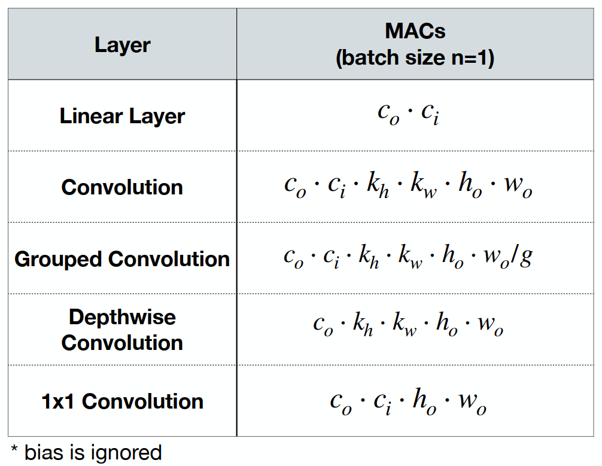
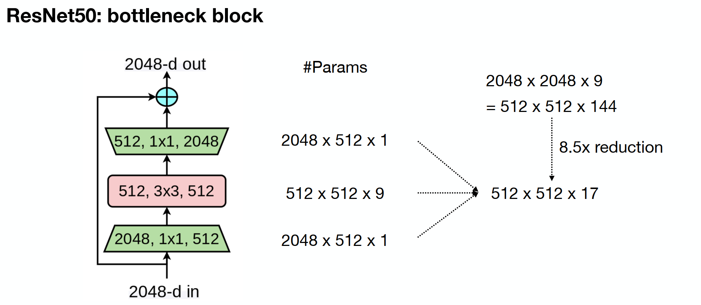
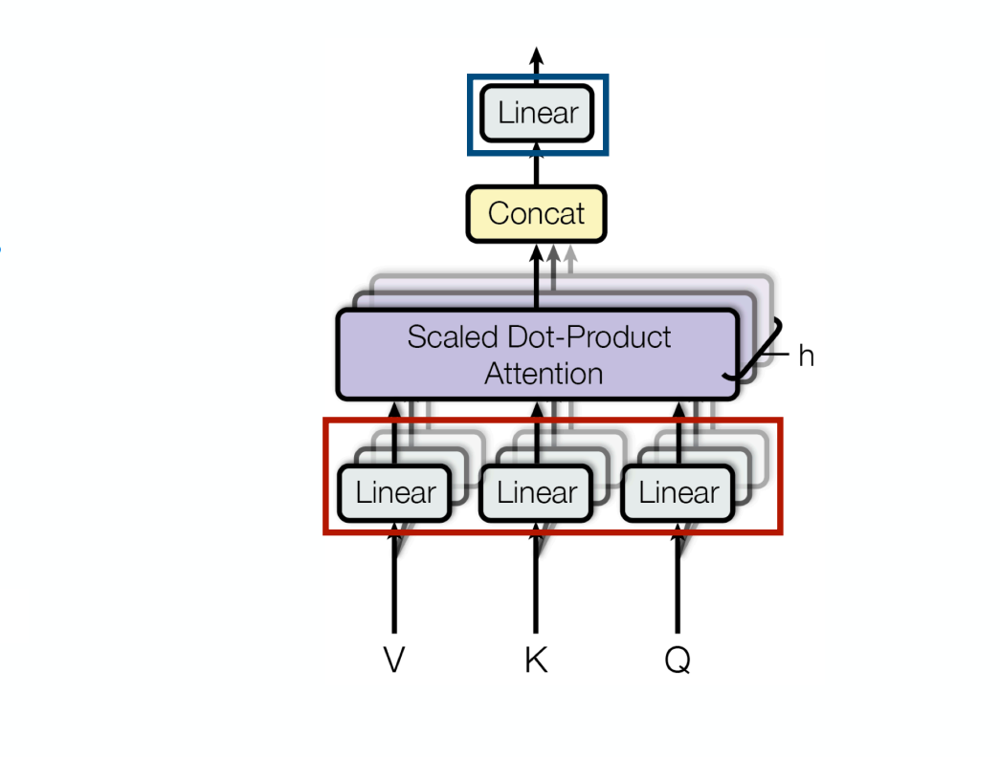
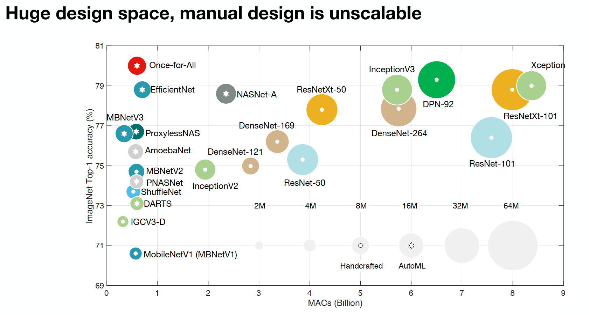
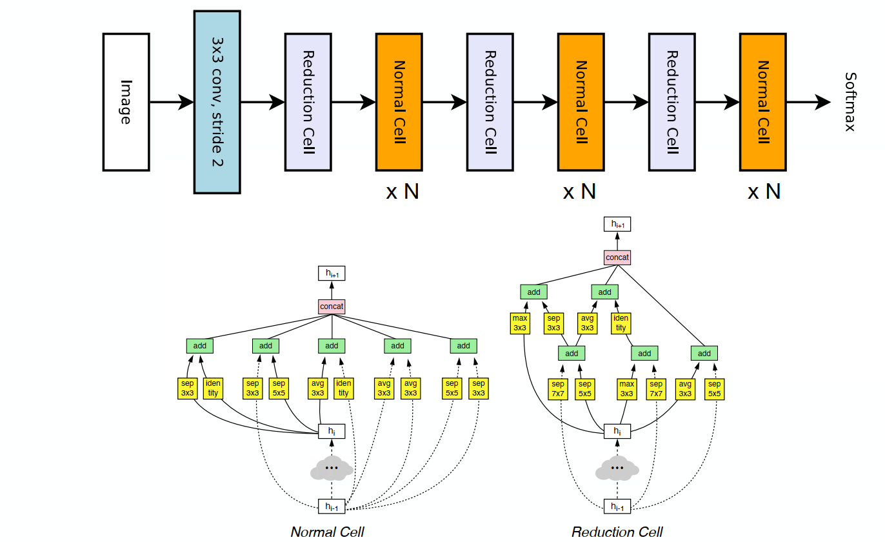
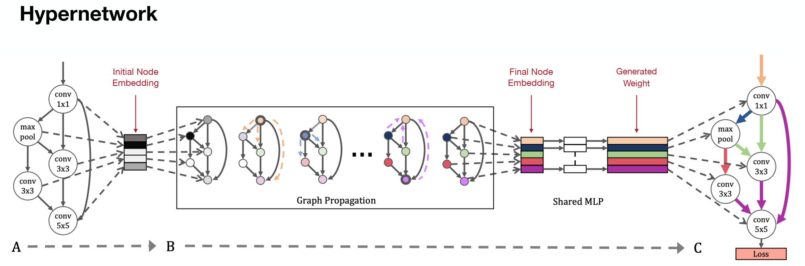
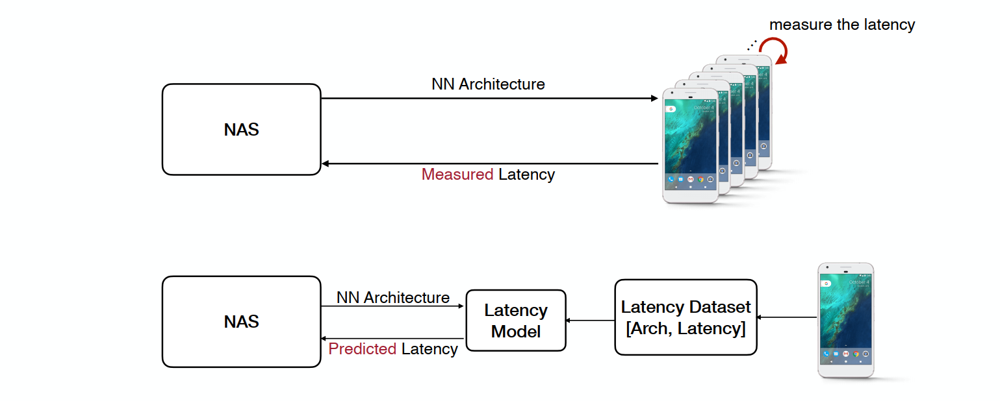
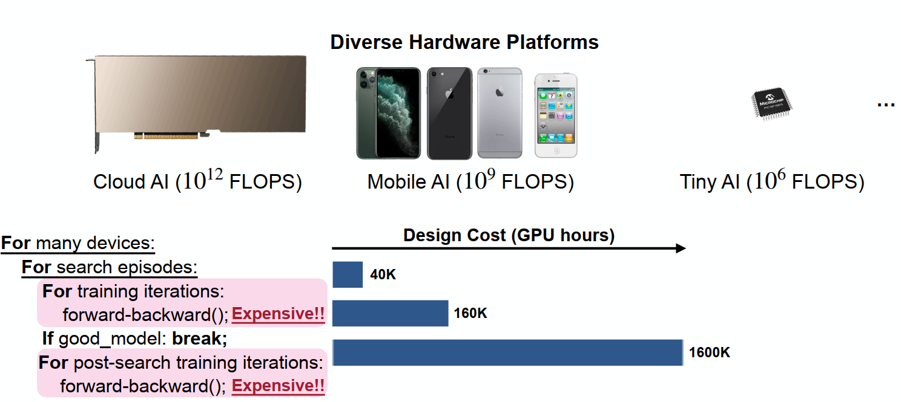
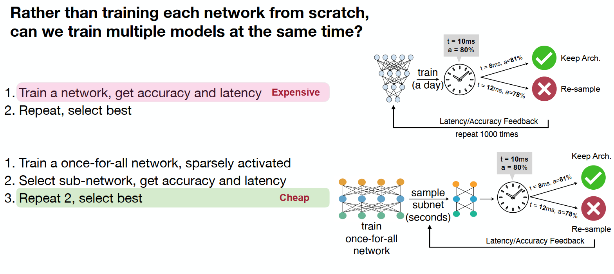

# अध्याय 5 न्यूरल नेटवर्क आर्किटेक्चर खोज

इस अध्याय में, हम धारा 5.1 में तंत्रिका नेटवर्क वास्तुकला खोज का परिचय देंगे, धारा 5.2 में तंत्रिका नेटवर्क वास्तुकला खोज की बुनियादी अवधारणाओं का परिचय देंगे, धारा 5.3 में खोज स्थान की अवधारणा का परिचय देंगे, धारा 5.4 में खोज रणनीतियों का परिचय देंगे, और धारा 5.5 प्रदर्शन मूल्यांकन पद्धति में कई कम लागत वाले मॉडल पेश करें, धारा 5.6 हार्डवेयर प्रतिबंधों के साथ तंत्रिका नेटवर्क वास्तुकला खोज का परिचय देता है, और धारा 5.7 तंत्रिका नेटवर्क वास्तुकला खोज के बाद एप्लिकेशन का परिचय देता है। ये सामग्रियाँ इस अध्याय की मुख्य सामग्री हैं।

## 5.1 न्यूरल नेटवर्क आर्किटेक्चर सर्च का परिचय

&emsp;&emsp; पिछले अध्यायों में छंटाई और परिमाणीकरण का उद्देश्य मुख्य रूप से मौजूदा मॉडलों पर विकसित मॉडल संपीड़न तकनीक है। तो क्या ऐसी कोई विधि है जो सीधे एक छोटा मॉडल प्राप्त कर सकती है जिसमें अच्छे प्रदर्शन, कम संख्या में पैरामीटर और उच्च दक्षता की विशेषताएं हों?

&emsp;&emsp; वर्तमान में, एक अधिक सीधा तरीका खोज स्थान के रूप में तंत्रिका नेटवर्क की संरचना, पैरामीटर राशि और संयोजन विधि का उपयोग करना है, और एक उपयुक्त तंत्रिका की शीघ्रता से खोज करने के लिए खोज प्रक्रिया के प्रासंगिक खोज एल्गोरिदम और मॉडल मूल्यांकन का उपयोग करना है। नेटवर्क। वास्तुकला और पैरामीटर। हम इस तकनीक को "न्यूरल आर्किटेक्चर सर्च (NAS)" कहते हैं।

&emsp;&emsp; मूल लक्ष्य पर वापस, एक "प्रभावी मॉडल" के निर्माण के लिए "**कम विलंबता** और **कम भंडारण** को पूरा करना होगा, **कम खपत**, **मॉडल सटीकता** और अन्य लक्ष्यों को बनाए रखते हुए।

&emsp;&emsp; एकाधिक लक्ष्यों के लिए, यदि आप सीधे मैन्युअल डिज़ाइन का उपयोग करते हैं, तो विभिन्न लक्ष्यों को पूरा करना अक्सर कठिन होगा। इसलिए, यदि उपरोक्त लक्ष्यों को "अनुकूलन लक्ष्यों" में परिवर्तित किया जा सकता है, तो मॉडल को यथासंभव उपरोक्त सभी लक्ष्यों को पूरा करने के लिए कुछ अनुकूलन विधि का उपयोग किया जा सकता है।

&emsp;&emsp; इसलिए, इस दृष्टिकोण से, "तंत्रिका नेटवर्क वास्तुकला खोज", एक निश्चित सीमा तक, खोज स्थान का विस्तार करती है, जिससे पूरे नेटवर्क को उपरोक्त लक्ष्यों को पूरा करने के लिए अधिक स्थान मिलता है।

## 5.2 तंत्रिका नेटवर्क वास्तुकला खोज की बुनियादी अवधारणाएँ

### 5.2.1 बुनियादी नेटवर्क मॉडल की समीक्षा

&emsp;&emsp; सबसे पहले, पिछले बुनियादी नेटवर्क मॉडल की समीक्षा करें, जिनमें शामिल हैं: रैखिक परिवर्तन संचालन, कनवल्शन संचालन, समूहीकृत कनवल्शन संचालन, आदि।

&emsp;&emsp; इन बुनियादी नेटवर्क मॉडल में संबंधित पैरामीटर मात्राएँ और गणना राशियाँ होती हैं।

### 5.2.2 नेटवर्क मॉड्यूल का परिचय

&emsp;&emsp; बुनियादी नेटवर्क के अलावा, आधुनिक डीप लर्निंग मॉडल में संबंधित मॉडल आर्किटेक्चर नेस्टेड डिज़ाइन भी होते हैं, जैसे कि ResNet के अवशेषख़राब संरचना.

&emsp;&emsp; इस कनेक्शन विधि के माध्यम से, एक ओर, यह गणना की मात्रा को कम कर सकता है और दूसरी ओर मॉडल प्रशिक्षण की कठिनाई को कम कर सकता है, यह एक नया और प्रभावी मॉड्यूलर डिज़ाइन भी है;

&emsp;&emsp; ResNet के अलावा, एक अन्य प्रकार का प्रभावी नेटवर्क मॉड्यूल है: ट्रांसफार्मर में मल्टी-हेड अटेंशन आर्किटेक्चर:

&emsp;&emsp; इस मॉड्यूल की एक अच्छी विशेषता यह है कि कई मॉड्यूल की गणना समानांतर में की जा सकती है, जो मॉडल की गणना गति को तेज करती है।

## 5.3 खोज स्थान का परिचय

&emsp;&emsp; मूल प्रश्न पर वापस जाते हुए, पारंपरिक नेटवर्क मॉडल डिज़ाइन मुख्य रूप से प्रासंगिक आर्किटेक्चर के मैन्युअल डिज़ाइन पर केंद्रित है तो क्या कंप्यूटर का उपयोग स्वचालित रूप से उचित नेटवर्क आर्किटेक्चर और मापदंडों की खोज के लिए किया जा सकता है?

&emsp;&emsp; इसके अलावा, मूल लक्ष्य को देखते हुए, क्या ऐसा कोई मॉडल है जिसमें कम संख्या में पैरामीटर हैं और फिर भी मॉडल की सटीकता बरकरार है?

&emsp;&emsp;प्रायोगिक प्रतिपादन से यह देखा जा सकता है कि पारंपरिक मैन्युअल रूप से डिज़ाइन किए गए मॉडल के पैरामीटर बड़े और बड़े होते जा रहे हैं, और प्रदर्शन बेहतर और बेहतर होता जा रहा है, वास्तव में, यह भी देखा जा सकता है कि कुछ तरीके हैं जो कम कर सकते हैं मॉडल पैरामीटर और बेहतर प्रदर्शन प्राप्त करना बड़े मॉडल पैरामीटर के साथ मॉडल की सटीकता के करीब है।

&emsp;&emsp; इसलिए, वर्तमान शोध के तहत, तंत्रिका नेटवर्क वास्तुकला खोज वास्तव में कुछ हद तक उपरोक्त आवश्यकताओं को पूरा कर सकती है।

### 5.3.1 तंत्रिका नेटवर्क वास्तुकला खोज की मूल प्रक्रिया

&emsp;&emsp; इसकी प्रक्रिया को पारंपरिक तंत्रिका नेटवर्क अनुकूलन के विस्तारित रूप के रूप में देखा जा सकता है। सबसे पहले, एक खोज स्थान $\mathcal{A}$ को परिभाषित किया गया है, और फिर कुछ खोज रणनीतियों को देखते हुए, संबंधित तंत्रिका नेटवर्क आर्किटेक्चर मॉडल प्राप्त किया जा सकता है, मॉडल के प्रदर्शन का मूल्यांकन डेटा सेट के माध्यम से किया जाता है, और फिर परिणाम फीड किए जाते हैं पुनरावृत्ति के बाद नई तंत्रिका नेटवर्क वास्तुकला को देखते हुए, खोज रणनीति पर वापस जाएँ।

### 5.3.2 स्थान खोजें

&emsp;&emsp; एकल तंत्रिका नेटवर्क के लिए, इसका खोज स्थान प्रत्येक न्यूरॉन के सभी संभावित मूल्यों का संयोजन है। तंत्रिका नेटवर्क वास्तुकला खोज के खोज स्थान के लिए, यह विभिन्न बुनियादी नेटवर्क मॉडल का एक संयोजन है। इसलिए सैद्धांतिक रूप से, संभावित संयोजन अनंत हैं।

&emsp;&emsp; चर्चा की सुविधा के लिए, खोज स्थान को "इकाई-स्तरीय खोज" में विभाजित किया जा सकता हैस्पेस" और "नेटवर्क-स्तरीय खोज स्थान", पहला मुख्य रूप से विभिन्न बुनियादी ढांचे के संयोजन के लिए है, और दूसरा मुख्य रूप से मॉड्यूल/नेटवर्क के संयोजन के लिए है।

1. इकाई-स्तरीय खोज स्थान

&emsp;&emsp; उदाहरण के तौर पर सीएनएन को लें:

&emsp;&emsp; इसके संयोजन की संभावना दिखाने के लिए, यहां एक सरल गणितीय प्रश्न है: मान लीजिए कि हमारे पास दो उम्मीदवार प्रकार के इनपुट ए और बी हैं (विभिन्न इनपुट आकृतियों का संदर्भ देते हुए), और $M$ विभिन्न परिवर्तन संचालन हैं (जैसे रैखिक परतों, संकेंद्रित परतों, आदि के रूप में) और $N$ संचालन जो छिपी हुई परतों को जोड़ते हैं (जैसे कि योग या औसत)। यदि पूरे नेटवर्क में $L$ परतें हैं, तो खोज स्थान कितना बड़ा है?

जैसा कि ऊपर चित्र में दिखाया गया है, प्रत्येक परत के लिए, प्रत्येक इनपुट में $M$ मूल मॉडल और $N$ विलय विधियां हैं, इसलिए अंतिम खोज स्थान है:

$$
\text{खोज स्थान} = (2*2*M*M*N)^{L} = 4^LM^{2L}N^L.
$$

&emsp;&emsp; मान लीजिए कि हमने $M=5,N=2,L=5$ दिया, यानी हमारे पास है5 बुनियादी मॉडल, 2 संयोजन विधियों और 5 नेटवर्क परतों के साथ, अंतिम खोज स्थान $3.2\times10^{11}$ है, जो $10^{11}$ के क्रम का आकार है।

2. नेटवर्क-स्तरीय खोज स्थान

&emsp;&emsp; इसके अलावा, ResNet जैसे प्रभावी नेटवर्क संयोजनों को भी खोजने की आवश्यकता है।

&emsp;&emsp; जैसा कि ऊपर चित्र में दिखाया गया है, आप अवशिष्ट संरचना में गहराई खोज सकते हैं; आप छवि के रिज़ॉल्यूशन की खोज कर सकते हैं; आप प्रत्येक परत के इनपुट और आउटपुट आयाम खोज सकते हैं;

### 5.3.3 खोज स्थान और हार्डवेयर उपकरणों के बीच संबंध

&emsp;&emsp; उपरोक्त चर्चा मुख्य रूप से नेटवर्क और कार्यों के लिए तंत्रिका नेटवर्क वास्तुकला की खोज स्थान पर केंद्रित है। इसके पीछे एक बुनियादी धारणा यह है कि **कंप्यूटिंग संसाधन अनंत हैं**, यानी तेज़ गणना और असीमित भंडारण। लेकिन वास्तविक अनुप्रयोगों में, विभिन्न उपकरणों की कंप्यूटिंग गति और भंडारण गति अलग-अलग होगी।

&emsp;&emsp; डिवाइस की कंप्यूटिंग गति और भंडारण सीमाओं को ध्यान में रखते हुए हम हार्डवेयर डिवाइस पर नेटवर्क आर्किटेक्चर खोज कैसे कर सकते हैं?

&emsp;&emsp; इस उद्देश्य के लिए, हार्डवेयर डिवाइस की सीमाओं के अनुसार खोज स्थान को सीमित करना आवश्यक है।

## 5.4 खोज रणनीतियों का परिचय

&emsp;&emsp; लक्ष्य को पूरा करने वाले तंत्रिका नेटवर्क आर्किटेक्चर को खोजने के लिए, तंत्रिका नेटवर्क आर्किटेक्चर के खोज स्थान को परिभाषित करने के बाद, विभिन्न खोज रणनीतियों की आवश्यकता होती है। इस खंड में, पाँच खोज रणनीतियाँ मुख्य रूप से पेश की गई हैं, अर्थात्: ग्रिड खोज, यादृच्छिक खोज, सुदृढीकरण सीखना, ग्रेडिएंट डिसेंट और इवोल्यूशनरी खोज।

1. ग्रिड खोज

&emsp;&emsp; जैसा कि नाम से पता चलता है, यह विधि "ग्रिड" बनाने के लिए विभिन्न संयोजनों को सूचीबद्ध करती है, और सर्वोत्तम परिणाम खोजने के लिए ग्रिड पर खोज करती है।

&emsp;&emsp; उपरोक्त चित्र को एक उदाहरण के रूप में लेते हुए, छवि रिज़ॉल्यूशन और नेटवर्क चौड़ाईडिग्री का उपयोग एक खोज चर के रूप में किया जाता है, जिसे ग्रिड किया जाता है और डेटा सत्यापन के माध्यम से संबंधित सटीकता (जैसे छवि वर्गीकरण) प्राप्त की जा सकती है, फिर, समय विलंब सीमा के तहत परिणामों की तुलना की जाती है और सर्वोत्तम तंत्रिका नेटवर्क आर्किटेक्चर का चयन किया जाता है।

2. यादृच्छिक खोज

&emsp;&emsp; यदि ग्रिड खोज अनुक्रमिक तरीके से खोज करती है, तो यादृच्छिक खोज ग्रिड खोज के आधार पर खोज क्रम को बाधित करती है, और एक उपयुक्त तंत्रिका नेटवर्क आर्किटेक्चर को तेजी से ढूंढने में सक्षम हो सकती है।

3. सुदृढीकरण सीखना

&emsp;&emsp; ग्रिड खोज और यादृच्छिक खोज के लिए, कम्प्यूटेशनल जटिलता अभी भी बहुत बड़ी है। यदि नेटवर्क आर्किटेक्चर के डिज़ाइन को एक निश्चित शिक्षण पद्धति के माध्यम से सीखा जा सकता है, तो गणना की मात्रा को कुछ हद तक कम किया जा सकता है, इसलिए इसे हल करने के लिए सुदृढीकरण सीखने का उपयोग किया जाता है।

&emsp;&emsp; एक सुदृढीकरण सीखने की विधि जैसा कि ऊपर चित्र में दिखाया गया है। बाईं ओर की तस्वीर से पता चलता है कि एक नेटवर्क आर्किटेक्चर जेनरेटर (कुछ आरएनएन संस्करण) का उपयोग संभाव्यता नमूने के माध्यम से नेटवर्क आर्किटेक्चर उत्पन्न करने के लिए किया जाता है, और फिर नेटवर्क आर्किटेक्चर को एक विशिष्ट डेटा सेट पर प्रशिक्षित किया जाता है, सटीकता का मूल्यांकन किया जाता है, और सटीकता फीडबैक है समायोजन के लिए नियंत्रक को भेजा जाता है। दाईं ओर की तस्वीर नेटवर्क आर्किटेक्चर की पीढ़ी को निर्धारित करती हैआदेश देना।

4. क्रमिक अवतरण

&emsp;&emsp; यदि आप विभिन्न परतों के चयन को अंतिम उद्देश्य फ़ंक्शन के साथ जोड़ सकते हैं, तो आप तंत्रिका नेटवर्क आर्किटेक्चर प्राप्त करने के लिए ग्रेडिएंट डिसेंट का उपयोग कर सकते हैं।

&emsp;&emsp; जैसा कि ऊपर चित्र में दिखाया गया है। प्रत्येक परत के लिए अलग-अलग नेटवर्क परतों का चयन निर्धारित करें, और प्रत्येक चयन के लिए एक संभावना दें, जब नेटवर्क का प्रचार किया जाता है, तो संबंधित नेटवर्क परत को संभाव्यता नमूने के माध्यम से प्राप्त किया जाता है, और फिर अंतिम उद्देश्य फ़ंक्शन में संभाव्यता और नेटवर्क परत मापदंडों को अनुकूलित किया जाता है। तंत्रिका नेटवर्क वास्तुकला प्राप्त करें।

5. विकासवादी एल्गोरिदम

&emsp;&emsp; कभी-कभी ग्रेडिएंट जानकारी को डिज़ाइन करना और प्राप्त करना कठिन होता है, लेकिन हमारे पास अभी भी एक उद्देश्य फ़ंक्शन है, इसलिए इसे विकासवादी एल्गोरिदम के माध्यम से अनुकूलित किया जा सकता है।

जैसा कि ऊपर चित्र में दिखाया गया है, हमें उम्मीद है कि मॉडल देरी और सटीकता दोनों को ध्यान में रख सकता है। सबसे पहले, मूल नेटवर्क आर्किटेक्चर में उप-नेटवर्क का नमूना लें, देरी और सटीकता की जानकारी प्राप्त करने के लिए उन्हें प्रशिक्षित करें और उनका मूल्यांकन करें, और यह निर्धारित करने के लिए विकासवादी एल्गोरिदम का उपयोग करें कि क्या उन्हें त्यागने या बनाए रखने की आवश्यकता है। फिर कोशिका विभाजन के दौरान जीन के व्यवहार का अनुकरण करने के लिए बनाए गए शब्द नेटवर्क पर उत्परिवर्तन और क्रॉसओवर जैसे ऑपरेशन करें। अधिकांशअंत में, इष्टतम "जीन", यानी उप-नेटवर्क को इष्टतम तंत्रिका नेटवर्क आर्किटेक्चर परिणाम के रूप में चुना जाता है।

## 5.5 मॉडल प्रदर्शन मूल्यांकन

पिछले अनुभागों में, प्राप्त तंत्रिका नेटवर्क आर्किटेक्चर मॉडल के मूल्यांकन के लिए, मॉडल का प्रदर्शन मुख्य रूप से डेटा सेट का मूल्यांकन करके प्राप्त किया गया था, हालांकि, यह विधि अधिक महंगी होगी क्योंकि इसे फिर से प्रशिक्षित करने की आवश्यकता है आदर्श। इस अनुभाग में, मॉडल का मूल्यांकन करते समय लागत कम करने के लिए कई तरीकों को पेश किया जाएगा जिन तरीकों पर विचार किया गया है उनमें शामिल हैं: वजन विरासत (इनहेरिट वजन) और हाइपरनेटवर्क (हाइपरनेटवर्क)।

1. वजन विरासत

जैसा कि नाम से पता चलता है, जब एक नया तंत्रिका नेटवर्क आर्किटेक्चर प्राप्त किया जाता है, तो इसका वजन पिछले आर्किटेक्चर से विरासत में मिल सकता है, जिससे प्रशिक्षण लागत कम हो सकती है।

&emsp;&emsp; उदाहरण के तौर पर उपरोक्त चित्र में दो मॉडल Net2Wider और Net2Deeper लें। ये दोनों मॉडल मुख्य रूप से मूल नेटवर्क पर व्यापक और गहन विस्तारित खोज करते हैं। Net2Wider के लिए, एक निश्चित परत को चौड़ा करने के बाद, इसके वजन को भी कॉपी किया जाता है, लेकिन Net2Deeper के लिए इनपुट और आउटपुट को सुसंगत रखा जाना चाहिए, मॉडल की गहराई को चौड़ा करने के बाद, चौड़े मॉडल मापदंडों को सीधे मैप किया जा सकता है नेटवर्क के लिए.1. हाइपरनेटवर्क

&emsp;&emsp; सुपर नेटवर्क, यहां एक उदाहरण के रूप में एक निश्चित कार्य है। यह कार्य तंत्रिका नेटवर्क वास्तुकला और मापदंडों को एक निश्चित पीढ़ी के नेटवर्क के परिणाम के रूप में मानता है, और इसे एक निश्चित हानि फ़ंक्शन के तहत अनुकूलित करता है।

&emsp;&emsp; जैसा कि ऊपर चित्र में दिखाया गया है। प्रक्रिया यह है कि प्रत्येक प्रशिक्षण चरण में, एक तंत्रिका नेटवर्क आर्किटेक्चर को खोज स्थान से यादृच्छिक रूप से नमूना लिया जाता है। उपरोक्त चित्र में ग्राफ प्रसार का उपयोग प्रत्येक नोड के एम्बेडिंग वेक्टर को प्राप्त करने के लिए किया जाता है, फिर एमएलपी का उपयोग नेटवर्क पैरामीटर उत्पन्न करने के लिए किया जाता है, और अंत में पैरामीटर अनुकूलन के लिए हानि फ़ंक्शन का उपयोग किया जाता है।

&emsp;&emsp; इसलिए, नेटवर्क को प्राप्त होने वाले तंत्रिका नेटवर्क आर्किटेक्चर परिणामों को अतिरिक्त रूप से प्रशिक्षित करने की आवश्यकता नहीं है, क्योंकि यह पहले से ही संबंधित मॉडल पैरामीटर उत्पन्न कर चुका है।

## 5.6 हार्डवेयर-आधारित तंत्रिका नेटवर्क वास्तुकला खोज

&emsp;&emsp; उपरोक्त तंत्रिका नेटवर्क वास्तुकला खोज विधि विशेष हार्डवेयर के लिए अनुकूलित नहीं है, अर्थात, उपरोक्त विधि के माध्यम से किसी भी हार्डवेयर के लिए संबंधित मॉडल प्राप्त किया जा सकता है।

&emsp;&emsp; हालाँकि, यह विधि अपेक्षाकृत महंगी है, उदाहरण के लिए, NASNet को Cifar डेटासेट पर 48,000 GPU घंटे की आवश्यकता होती है, और इसे चलाने की आवश्यकता होती है।5 वर्षों में, DARTS पद्धति को सीधे ImageNet पर चलाने के लिए 100GB मेमोरी की आवश्यकता होती है। तो ये विधियाँ "प्रोक्सी कार्य" जोड़ देंगी।

&emsp;&emsp; हालांकि "एजेंट कार्य" गणना की मात्रा को कम कर सकते हैं, लेकिन उन्हें उप-इष्टतम परिणाम मिलते हैं। तो यहां हम एक प्रॉक्सीलेस न्यूरल नेटवर्क खोज विधि, ProxylessNAS डिज़ाइन करते हैं:

&emsp;&emsp; यह विधि अत्यधिक मापदंडों के साथ एक मॉडल बनाती है, एकल प्रशिक्षण प्रक्रिया में मॉडल मापदंडों को प्रशिक्षित करने के लिए संबंधित एनएएस आर्किटेक्चर का नमूना लेती है, और आर्किटेक्चर मापदंडों पर अतिरिक्त पथों को काटती है। अंत में, आर्किटेक्चर मापदंडों को बिनराइज़ किया जाता है ताकि केवल एक पथ सक्रिय हो, मेमोरी O(N) से O(1) पर आ जाती है।

1. MAC वास्तविक हार्डवेयर दक्षता के बराबर नहीं हैं

आइए पारंपरिक NAS पर वापस जाएं क्योंकि मॉडल विशिष्ट हार्डवेयर पर विचार नहीं करता है, यह आम तौर पर डिफ़ॉल्ट रूप से अधिक शक्तिशाली GPU पर खोज करता है, इससे हार्डवेयर असंगति की समस्या उत्पन्न होगी।

&emsp;&emsp; जैसा कि आप ऊपर दिए गए चित्र से देख सकते हैं, पारंपरिक NAS खोज विधि लक्ष्य के रूप में MAC का उपयोग करती है, इसलिए कम MAC मान होगा, लेकिन मोबाइल फोन हार्डवेयर में देरी अभी भी इसके लिए डिज़ाइन किए गए मॉडल से अधिक है डिवाइस. बहुत अधिक. ऐसा इसलिए है क्योंकि पीसी पर जीपीयू में यह घटना होती है कि छिपे हुए आयाम बढ़ने पर देरी नहीं बढ़ती है, लेकिन मॉडल परतों की संख्या बढ़ने पर देरी बढ़ जाती है। इसलिए, जब किसी पीसी पर GPU पर NAS किया जाता है, तो NAS विलंबता को कम करने के लिए स्वाभाविक रूप से छिपे हुए परत आयाम को बढ़ा देगा।

&emsp;&emsp; लेकिन छोटे हार्डवेयर पर ऐसा नहीं है, जैसा कि ऊपर चित्र में दिखाया गया है, जब छुपी हुई परत बढ़ती है, तो देरी भी बहुत बढ़ जाती है, लेकिन GPU इससे प्रभावित नहीं होता है।

2. छोटे उपकरणों पर मूल्यांकन में धीमी समस्या है

इस मामले में, क्या यह बहुत अच्छा नहीं होगा यदि हम मॉडल को अनुकूलित करने के लिए इस प्रकार के डिवाइस पर सीधे एनएएस की संबंधित विलंबता और सटीकता का मूल्यांकन करें? हालाँकि, वास्तविकता में अभी भी एक समस्या है। उपकरण प्रदर्शन में अपनी सीमाओं के कारण छोटे उपकरण भी संबंधित मॉडलों की मूल्यांकन दक्षता पर बहुत प्रभाव डालते हैं, और मूल्यांकन के लिए प्रतिक्रिया के लिए भी बहुत समय की आवश्यकता होती है।

&emsp;&emsp; फिर, हम स्वाभाविक रूप से सोचेंगे कि यदि किसी डिवाइस पर मूल्यांकन दक्षता कम हैक्या एकाधिक उपकरणों का उपयोग करना अच्छा नहीं होगा? यह वास्तव में संभव है, लेकिन तुलनात्मक रूप से कहें तो, उपकरण खरीदने के लिए धनराशि अपेक्षाकृत बड़ी है, उदाहरण के लिए, यदि संबंधित उपकरण एक आईफोन है।

&emsp;&emsp; इसलिए, ऊपर उल्लिखित लागत समस्या को कम करने के लिए, हम एक नया नेटवर्क बना सकते हैं जिसका उपयोग यह अनुमान लगाने के लिए किया जाता है कि मौजूदा मॉडल के पैरामीटर नए उपकरणों पर कैसा प्रदर्शन करेंगे मॉडल प्रशिक्षण के लिए पूर्वानुमानित डेटा है, जिसमें कुछ पूर्वानुमानित क्षमताएं हैं। यह विधि मूल्यांकन के लिए प्रासंगिक उपकरणों के उपयोग की लागत को कुछ हद तक कम कर सकती है, जिससे मूल्यांकन दक्षता में सुधार होगा।

3. विभिन्न उपकरणों पर एक ही मॉडल का अनुप्रयोग

&emsp;&emsp; इसके अलावा, वास्तविक परिदृश्यों में, हम ऐसी स्थिति का भी सामना करेंगे, यानी, एक एप्लिकेशन, जैसे कि छवि पहचान, सामान्य रूप से विभिन्न उपकरणों पर चल सकती है, लेकिन विभिन्न उपकरणों की कंप्यूटिंग शक्ति संसाधन, जैसा कि ऊपर बताया गया है, अलग-अलग सीमाएँ और गुण हैं।

&emsp;&emsp; यदि विभिन्न उपकरणों के लिए वास्तुकला खोज और प्रशिक्षण की आवश्यकता है, तो लागत भी महंगी है। क्या बनाने का कोई तरीका है?क्या इस क्षमता को विभिन्न उपकरणों के लिए समायोजित किया जा सकता है?

&emsp;&emsp; पारंपरिक एनएएस की प्रक्रिया का अवलोकन करते हुए, हम पा सकते हैं कि पारंपरिक एनएएस मॉडल वास्तुकला को समायोजित करने से पहले सीधे एक मॉडल को प्रशिक्षित करता है, यदि कई उपकरणों का सामना करना पड़ता है, तो इसे केवल एक बड़े मॉडल में नमूना करने की आवश्यकता होती है इसका मूल्यांकन करें. ऐसी एनएएस प्रक्रिया कई अलग-अलग उपकरणों की स्थितियों को ध्यान में रखने के बराबर है, ताकि विभिन्न उपकरणों को ध्यान में रखने वाले एनएएस मॉडल को प्रशिक्षित किया जा सके।

&emsp;&emsp; यह मॉडल अलग-अलग उपकरणों के लिए संबंधित कार्य करने के लिए अलग-अलग नेटवर्क का उपयोग कर सकता है, या अलग-अलग प्रदर्शन वाले उपकरणों की एक ही श्रृंखला, या यहां तक ​​कि अलग-अलग दक्षता वाले एक ही डिवाइस का उपयोग कर सकता है।

## 5.7 तंत्रिका नेटवर्क वास्तुकला खोज के अनुप्रयोग का परिचय

&emsp;&emsp; मुख्य रूप से वन्स-फॉर-ऑल मॉडल के अनुप्रयोग को एक उदाहरण के रूप में लें:

1. एनएलपी में आवेदन

&emsp;&emsp; जैसा कि आप उपरोक्त चित्र से देख सकते हैं, ट्रांसफार्मर पर आर्किटेक्चर खोज करके इसे विभिन्न उपकरणों पर चलाया जा सकता है, ताकि मॉडल की देरी और आकार को बहुत कम किया जा सके।

2. बिंदु बादल समझ का अनुप्रयोग

3. GAN द्वारा उत्पन्न अनुप्रयोग

&emsp;&emsp; स्वीकार्य विलंबता बनाए रखते हुए इस पद्धति का उपयोग विभिन्न उपकरणों पर किया जा सकता है।

4. मनोवृत्ति का पता लगाना

## अभ्यास
इस अभ्यास में, मॉडल के पैरामीटर आकार को सीमित करते हुए यथासंभव उच्च सटीकता वाले नेटवर्क की खोज करने के लिए ग्रिड खोज पद्धति का उपयोग किया गया था।
नमूना कोड: [न्यूरल नेटवर्क आर्किटेक्चर सर्च प्रैक्टिस](https://github.com/datawhalechina/awesome-compression/blob/main/docs/notebook/ch05/1.NAS.ipynb)