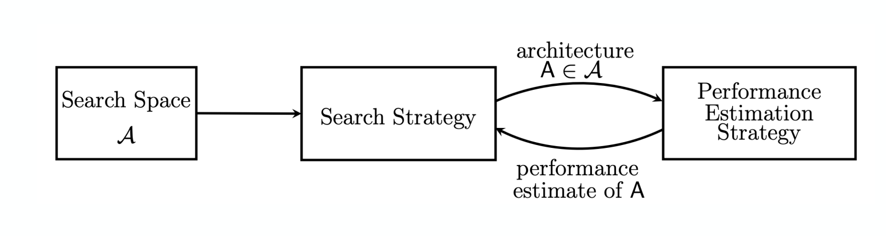
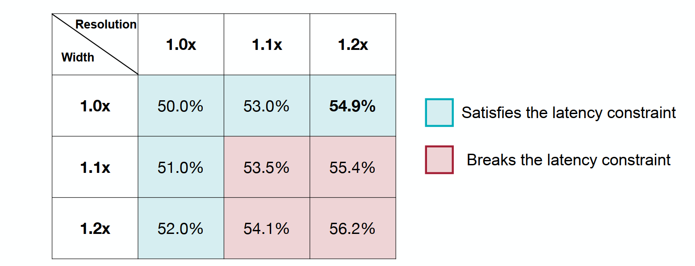
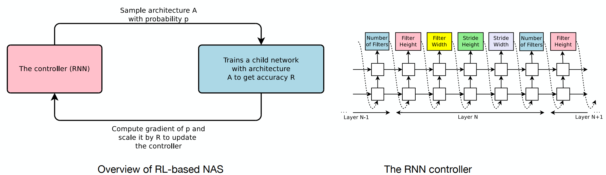
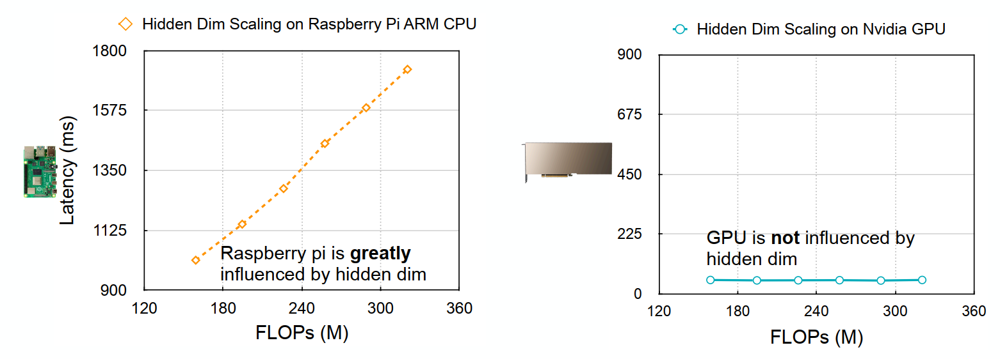

# अध्याय 5 न्यूरल नेटवर्क आर्किटेक्चर खोज

इस अध्याय में, हम धारा 5.1 में तंत्रिका नेटवर्क वास्तुकला खोज, धारा 5.2 में तंत्रिका नेटवर्क वास्तुकला खोज की बुनियादी अवधारणाएं, धारा 5.3 में खोज स्थान की अवधारणा, धारा 5.4 में खोज रणनीति, कई निम्न- का परिचय देंगे। धारा 5.5 में लागत मॉडल प्रदर्शन मूल्यांकन विधियां, धारा 5.6 में हार्डवेयर प्रतिबंधों के साथ तंत्रिका नेटवर्क वास्तुकला खोज, और तंत्रिका नेटवर्क आर्ची के बाद अनुप्रयोगधारा 5.7 में व्याख्यान खोज ये सामग्री इस अध्याय की मुख्य सामग्री का निर्माण करती है।

## 5.1 न्यूरल नेटवर्क आर्किटेक्चर सर्च का परिचय

&emsp;&emsp; पिछले अध्यायों में छंटाई और परिमाणीकरण मुख्य रूप से मौजूदा मॉडलों पर विकसित मॉडल संपीड़न तकनीक पर केंद्रित है, तो क्या सीधे तौर पर एक छोटा मॉडल प्राप्त करने का कोई तरीका है जिसमें अच्छा प्रदर्शन, छोटे पैरामीटर और उच्च दक्षता हो?

&emsp;&emsp; वर्तमान में, संरचना, पैरामीटर एमो का उपयोग करना एक अधिक सीधा तरीका हैखोज स्थान के रूप में तंत्रिका नेटवर्क का संयोजन और संयोजन, और उपयुक्त तंत्रिका नेटवर्क आर्किटेक्चर और मापदंडों की त्वरित खोज के लिए खोज प्रक्रिया के मॉडल मूल्यांकन में सहयोग करने के लिए प्रासंगिक खोज एल्गोरिदम का उपयोग करें। हम इस तकनीक को "न्यूरल आर्किटेक्चर सर्च" (एनएएस) कहते हैं।

&emsp;&emsp; मूल लक्ष्य पर वापस, एक "प्रभावी मॉडल" के निर्माण के लिए "कम विलंबता और कम भंडारण", **कम खपत**, और साथ ही **मॉडल सटीकता** और अन्य लक्ष्यों को बनाए रखने की आवश्यकता होती है।

कई लक्ष्यों के लिए, यदि आप सीधे मैन्युअल डिज़ाइन का उपयोग करते हैं, तो विभिन्न लक्ष्यों को पूरा करना अक्सर मुश्किल होता है, इसलिए, यदि उपरोक्त लक्ष्यों को "अनुकूलन लक्ष्यों" में परिवर्तित किया जा सकता है, तो आप मॉडल को पूरा करने के लिए कुछ अनुकूलन विधियों का उपयोग कर सकते हैं। उपरोक्त सभी लक्ष्यों को यथासंभव पूरा करें।

&emsp;&emsp; तो, इस दृष्टिकोण से, "न्यूरल नेटवर्क आर्किटेक्चर सर्च" ने, कुछ हद तक, संपूर्ण नेटवर्क को प्रदान करते हुए, खोज स्थान का विस्तार किया हैउपरोक्त लक्ष्यों को पूरा करने के लिए अधिक स्थान।

## 5.2 तंत्रिका नेटवर्क वास्तुकला खोज की बुनियादी अवधारणाएँ

### 5.2.1 बुनियादी नेटवर्क मॉडल की समीक्षा

&emsp;&emsp; सबसे पहले, पिछले बुनियादी नेटवर्क मॉडल की समीक्षा करें, जिनमें शामिल हैं: रैखिक परिवर्तन संचालन, कनवल्शन संचालन, समूहीकृत कनवल्शन संचालन, आदि।

&emsp;&emsp; इन बुनियादी नेटवर्क मॉडल में संबंधित पैरामीटर और गणनाएं होती हैं।

### 5.2.2 परिचय टीओ नेटवर्क मॉड्यूल

&emsp;&emsp; आधुनिक गहन शिक्षण मॉडल में, बुनियादी नेटवर्क के अलावा, संबंधित मॉडल आर्किटेक्चर नेस्टिंग डिज़ाइन भी होते हैं, जैसे कि ResNet की अवशिष्ट संरचना।

&emsp;&emsp; यह कनेक्शन विधि एक ओर गणना की मात्रा और मॉडल प्रशिक्षण की कठिनाई को कम कर सकती है, दूसरी ओर यह एक नया और प्रभावी मॉड्यूलर डिज़ाइन भी है।

&emsp;&emsp; ResNet के अलावा, वहाँ हैएक अन्य प्रकार का प्रभावी नेटवर्क मॉड्यूल: ट्रांसफार्मर में मल्टी-हेड अटेंशन आर्किटेक्चर:

&emsp;&emsp; इस मॉड्यूल का एक अच्छा गुण यह है कि कई मॉड्यूल की गणना समानांतर में की जा सकती है, जो मॉडल की गणना गति को तेज करती है।

## 5.3 खोज स्थान का परिचय

&emsp;&emsp; मूल प्रश्न पर वापस जाएं, पारंपरिक नेटवर्क मॉडल डिज़ाइन मुख्य रूप से संबंधित आर्क के मैनुअल डिज़ाइन पर केंद्रित हैहिटेक्चर्स, तो क्या हम उपयुक्त नेटवर्क आर्किटेक्चर और मापदंडों को स्वचालित रूप से खोजने के लिए कंप्यूटर का उपयोग कर सकते हैं?

&emsp;&emsp; इसके अलावा, प्रारंभिक लक्ष्य को देखते हुए, क्या ऐसा कोई मॉडल है जो कम संख्या में मापदंडों की आवश्यकता को पूरा करता है और मॉडल की सटीकता बनाए रखता है?

&emsp;&emsp; उपरोक्त प्रयोगात्मक प्रभाव आरेख से पता चलता है कि पारंपरिक मैन्युअल रूप से डिज़ाइन किए गए मॉडल हाहालांकि, पैरामीटर बढ़ाने और प्रदर्शन में सुधार करने की प्रवृत्ति है, वास्तव में, यह भी देखा जा सकता है कि कुछ विधियां हैं जो मॉडल पैरामीटर को कम करने के आधार पर बड़े मॉडल पैरामीटर के साथ मॉडल की सटीकता तक पहुंच सकती हैं।

&emsp;&emsp; इसलिए, वर्तमान शोध के तहत, तंत्रिका नेटवर्क वास्तुकला खोज वास्तव में कुछ हद तक उपरोक्त आवश्यकताओं को पूरा कर सकती है।

### 5.3.1 तंत्रिका नेटवर्क वास्तुकला खोज की मूल प्रक्रिया

&emsp;&emsp; इसकी प्रक्रिया पर विचार किया जा सकता हैपारंपरिक तंत्रिका नेटवर्क अनुकूलन के एक विस्तारित रूप के रूप में, सबसे पहले, एक खोज स्थान $\mathcal{A}$ निर्दिष्ट किया जाता है, और फिर संबंधित तंत्रिका नेटवर्क आर्किटेक्चर मॉडल को प्राप्त करने के लिए कुछ खोज रणनीतियाँ दी जाती हैं डेटा सेट, और परिणाम को पुनरावृत्ति के बाद एक नया तंत्रिका नेटवर्क आर्किटेक्चर देने के लिए खोज रणनीति में वापस फीड किया जाता है।

### 5.3.2 स्थान खोजें

&इmsp;&emsp; एकल तंत्रिका नेटवर्क के लिए, इसका खोज स्थान प्रत्येक न्यूरॉन के सभी संभावित मूल्यों का संयोजन है। तंत्रिका नेटवर्क वास्तुकला खोज के खोज स्थान के लिए, यह विभिन्न बुनियादी नेटवर्क मॉडल का संयोजन है सैद्धांतिक रूप से, संभावित संयोजन अनंत हैं।

&emsp;&emsp; चर्चा की सुविधा के लिए, खोज स्थान को विभाजित किया जा सकता है: "यूनिट-स्तरीय खोज"स्पेस" और "नेटवर्क-स्तरीय खोज स्पेस", पूर्व मुख्य रूप से विभिन्न इन्फ्रा के संयोजन के लिए हैसंरचनाएं, और उत्तरार्द्ध मुख्य रूप से मॉड्यूल/नेटवर्क के संयोजन के लिए है।

1. सेल-स्तरीय खोज स्थान

&emsp;&emsp; उदाहरण के तौर पर सीएनएन को लें:

&emsp;&emsp; इसकी संयोजन संभावनाओं का आकार दिखाने के लिए, यहां एक सरल गणित समस्या है: मान लीजिए कि हमारे पास दो उम्मीदवार इनपुट प्रकार ए और बी हैं (विभिन्न इनपुट आकृतियों का संदर्भ देते हुए), $M$ विभिन्न परिवर्तन संचालन हैं (जैसे कि रैखिक परतें, संकेंद्रित परतें, आदि.) और $N$ प्रकार के संयुक्त छिपे हुए परत संचालन (जैसे कि सारांश या औसत), यदि पूरे नेटवर्क में $L$ परतें हैं, तो खोज स्थान कितना बड़ा है?

जैसा कि ऊपर चित्र में दिखाया गया है, प्रत्येक परत के लिए, प्रत्येक इनपुट में दो मामले हैं, प्रत्येक इनपुट में $M$ मूल मॉडल और $N$ विलय विधियां हैं, इसलिए अंतिम खोज स्थान है:

$$
\text{खोज स्थान} = (2*2*M*M*N)^{L} = 4^LM^{2L}N^L.
$$

&emsp;&emsp; मान लें कि हम$M=5,N=2,L=5$ सेट करें, यानी, 5 बुनियादी मॉडल, 2 संयोजन और 5 नेटवर्क परतें, अंतिम खोज स्थान $3.2\times10^{11}$ है, जो परिमाण का क्रम है $10^{11}$ का.

2. नेटवर्क-स्तरीय खोज स्थान

&emsp;&emsp; इसके अलावा, ResNet जैसे प्रभावी नेटवर्क संयोजनों को भी खोजने की आवश्यकता है।

&emsp;&emsp; जैसा कि ऊपर चित्र में दिखाया गया है, अवशिष्ट संरचना में गहराई की खोज की जा सकती है;छवि की खोज की जा सकती है और प्रत्येक परत के इनपुट और आउटपुट आयाम खोजे जा सकते हैं।

### 5.3.3 खोज स्थान और हार्डवेयर उपकरणों के बीच संबंध

&emsp;&emsp; उपरोक्त चर्चा मुख्य रूप से नेटवर्क और कार्यों के लिए तंत्रिका नेटवर्क वास्तुकला की खोज स्थान पर केंद्रित है। इसके पीछे एक बुनियादी धारणा यह है कि **कंप्यूटिंग संसाधन अनंत हैं**, हालांकि, इसमें वास्तविक अनुप्रयोगों में, विभिन्न उपकरणों की कंप्यूटिंग गति और एसटीओ अलग-अलग होती हैक्रोध की गति.

&emsp;&emsp; डिवाइस की कंप्यूटिंग गति और भंडारण सीमाओं पर विचार करते हुए हम हार्डवेयर डिवाइस के लिए नेटवर्क आर्किटेक्चर खोज कैसे कर सकते हैं?

&emsp;&emsp; इस प्रयोजन के लिए, खोज स्थान को हार्डवेयर की सीमाओं के अनुसार सीमित करना आवश्यक हैई डिवाइस.

## 5.4 खोज रणनीतियों का परिचय

&emsp;&emsp; तंत्रिका नेटवर्क वास्तुकला के खोज स्थान को परिभाषित करने के बाद, लक्ष्य को पूरा करने वाले तंत्रिका नेटवर्क वास्तुकला को खोजने के लिए विभिन्न खोज रणनीतियों की आवश्यकता होती है, इस खंड में, पांच खोज रणनीतियों को मुख्य रूप से पेश किया जाता है, अर्थात्: ग्रिड खोज, यादृच्छिक खोज। सुदृढीकरण सीखना, क्रमिक वंश, और विकासवादी खोज।

1. ग्रिड खोज

&emsp;&emsp;जैसा कि नाम से पता चलता है, यह विधि "ग्रिड" बनाने के लिए विभिन्न संयोजनों को सूचीबद्ध करती है और सर्वोत्तम परिणाम खोजने के लिए ग्रिड पर खोज करती है।

&emsp;&emsp; उपरोक्त चित्र को एक उदाहरण के रूप में लेते हुए, छवि रिज़ॉल्यूशन और नेटवर्क बैंडविड्थ का उपयोग खोज चर के रूप में किया जाता है, और ग्रिड को डेटा सत्यापन के माध्यम से प्राप्त किया जा सकता है डिग्री का उपयोग खोज चर के रूप में किया जाता है, और ग्रिड में देरी सीमा के तहत परिणाम संसाधित होते हैंसर्वोत्तम तंत्रिका नेटवर्क वास्तुकला का चयन करने की तुलना में।

2. यादृच्छिक खोज

&emsp;&emsp; यदि ग्रिड खोज को अनुक्रमिक तरीके से खोजा जाता है, तो यादृच्छिक खोज ग्रिड खोज के आधार पर खोज क्रम को बाधित करती है, और एक उपयुक्त तंत्रिका नेटवर्क आर्किटेक्चर को तेजी से ढूंढना संभव है।

3. सुदृढीकरण सीखना

&emsp;&emsp; ग्रिड खोज और यादृच्छिक खोज के लिए, गणना की मात्रा अभी भी बहुत बड़ी हैई नेटवर्क आर्किटेक्चर को कुछ शिक्षण विधियों के माध्यम से सीखा जा सकता है, गणना की मात्रा को कुछ हद तक कम किया जा सकता है, इसलिए इसे हल करने का प्रयास करने के लिए सुदृढीकरण सीखने का उपयोग किया जाता है।

&emsp;&emsp; एक सुदृढीकरण सीखने की विधि जैसा कि ऊपर दिए गए चित्र में दिखाया गया है। बाईं तस्वीर से पता चलता है कि एक नेटवर्क आर्किटेक्चर एक नेटवर्क आर्किटेक्चर जनरेटर (कुछ आरएनएन वेरिएंट) के माध्यम से संभाव्यता नमूने के माध्यम से उत्पन्न होता हैफिर नेटवर्क आर्किटेक्चर को एक विशिष्ट डेटा सेट पर प्रशिक्षित किया जाता है, सटीकता का मूल्यांकन किया जाता है, और सटीकता को समायोजन के लिए नियंत्रक को वापस भेज दिया जाता है। सही चित्र नेटवर्क आर्किटेक्चर ऑर्डर की पीढ़ी को निर्दिष्ट करता है।

4. क्रमिक अवतरण

&emsp;&emsp; यदि विभिन्न परतों का चयन अंतिम उद्देश्य फ़ंक्शन के साथ जोड़ा जा सकता है, तो ग्रेडिएंट डिसेंट द्वारा एक तंत्रिका नेटवर्क आर्किटेक्चर प्राप्त किया जा सकता है।

जैसा कि ऊपर दिए गए चित्र में दिखाया गया है। प्रत्येक परत के लिए अलग-अलग नेटवर्क परतों का चयन निर्धारित करें, प्रत्येक चयन के लिए एक संभावना दें, और जब नेटवर्क प्रसारित हो तो संभाव्यता नमूने के माध्यम से संबंधित नेटवर्क परत प्राप्त करें तंत्रिका नेटवर्क आर्किटेक्चर प्राप्त करने के लिए अंतिम उद्देश्य फ़ंक्शन में परत पैरामीटर।

5. विकासवादी एल्गोरिदम

&emsp;&emsp; कभी-कभी ग्रेडिएंट जानकारी को डिज़ाइन करना और प्राप्त करना कठिन होता है, लेकिन हम एसटिल का एक वस्तुनिष्ठ कार्य है, इसलिए इसे विकासवादी एल्गोरिदम के माध्यम से अनुकूलित किया जा सकता है।

जैसा कि ऊपर चित्र में दिखाया गया है, हमें उम्मीद है कि मॉडल विलंबता और सटीकता दोनों को ध्यान में रख सकता है, सबसे पहले, एक उप-नेटवर्क को मूल नेटवर्क आर्किटेक्चर से नमूना लिया जाता है, और विलंबता पर जानकारी प्राप्त करने के लिए इसे प्रशिक्षित और मूल्यांकन किया जाता है। और सटीकता। फिर विकासवादी एल्गोरिदम का उपयोग यह निर्धारित करने के लिए किया जाता है कि क्या यह एन हैफिर, कोशिका विभाजन के दौरान जीन के व्यवहार को अनुकरण करने के लिए बनाए गए उप-नेटवर्क पर उत्परिवर्तन और क्रॉसओवर जैसे ऑपरेशन किए जाते हैं। अंत में, इष्टतम "जीन", यानी उप-नेटवर्क है। इष्टतम तंत्रिका नेटवर्क आर्किटेक्चर परिणाम के रूप में चुना गया।

## 5.5 मॉडल प्रदर्शन मूल्यांकन

पिछले अनुभागों में, प्राप्त तंत्रिका नेटवर्क आर्किटेक्चर मॉडल का मूल्यांकन मुख्य रूप से मॉडल के प्रदर्शन का मूल्यांकन करके प्राप्त किया जाता हैडेटा सेट, लेकिन यह विधि महंगी है क्योंकि मॉडल को हर बार पुनः प्रशिक्षित करने की आवश्यकता होती है, मॉडल का मूल्यांकन करते समय लागत को कम करने के लिए कई विधियां पेश की जाएंगी: वजन विरासत (इनहेरिट वजन) और हाइपरनेटवर्क (हाइपरनेटवर्क)। ).

1. वजन विरासत

जैसा कि नाम से पता चलता है, जब एक नया तंत्रिका नेटवर्क आर्किटेक्चर प्राप्त किया जाता है, तो प्रशिक्षण लागत को कम करने के लिए इसका वजन पिछले आर्किटेक्चर से विरासत में मिला जा सकता है।

&emsp;&emsp; उपरोक्त चित्र में दो मॉडल Net2Wider और Net2Deeper को उदाहरण के रूप में लेते हुए, दोनों मॉडल मुख्य रूप से Net2Wider के लिए मूल नेटवर्क पर व्यापक और गहरी विस्तार खोज करते हैं, एक निश्चित परत को चौड़ा करने के बाद, इसके वजन की भी प्रतिलिपि बनाई जाती है इनपुट और आउटपुट को सुसंगत रखा जाना चाहिए; नेट2डीपर के लिए, मॉडल की गहराई को चौड़ा करने के बाद, चौड़े मॉडल मापदंडों को पिछले नेटवर्क हाइपर से सीधे मैप किया जा सकता हैनेटवर्क

हाइपरनेटवर्क, यहां हम एक उदाहरण के रूप में एक निश्चित कार्य लेते हैं, यह कार्य तंत्रिका नेटवर्क वास्तुकला और मापदंडों को एक निश्चित उत्पन्न नेटवर्क के परिणाम के रूप में मानता है, और उन्हें एक निश्चित हानि फ़ंक्शन के तहत अनुकूलित करता है।

&emsp;&emsp; जैसा कि ऊपर दिए गए चित्र में दिखाया गया है। प्रक्रिया यह है कि प्रत्येक प्रशिक्षण चरण में, प्रत्येक के एम्बेडिंग वेक्टर से एक तंत्रिका नेटवर्क आर्किटेक्चर का नमूना लिया जाता हैउपरोक्त चित्र में ग्राफ प्रसार का उपयोग करके नोड प्राप्त किया जाता है, और फिर नेटवर्क पैरामीटर एमएलपी द्वारा उत्पन्न होते हैं, और अंत में पैरामीटर को हानि फ़ंक्शन द्वारा अनुकूलित किया जाता है।

&emsp;&emsp; इसलिए, नेटवर्क को इसके द्वारा प्राप्त तंत्रिका नेटवर्क आर्किटेक्चर परिणामों को प्रशिक्षित करने की आवश्यकता नहीं है, क्योंकि इसने संबंधित मॉडल पैरामीटर उत्पन्न किए हैं।

## 5.6 हार्डवेयर-आधारित तंत्रिका नेटवर्क वास्तुकला खोज

&emsp;&emsp; उपरोक्त तंत्रिका नेटवर्क आर्किटेक्चर खोज विधि ऑप्टिमी नहीं हैविशेष हार्डवेयर के लिए जेड, यानी उपरोक्त विधि के माध्यम से किसी भी हार्डवेयर के लिए संबंधित मॉडल प्राप्त किया जा सकता है।

हालाँकि, यह विधि अपेक्षाकृत महंगी है। उदाहरण के लिए, NASNet को Cifar डेटासेट पर 48,000 GPU घंटे और लगभग 5 वर्षों की आवश्यकता होती है, DARTS विधि को सीधे ImageNet पर चलाने के लिए 100GB मेमोरी की आवश्यकता होती है, इसलिए ये विधियाँ "प्रॉक्सी कार्यों" को बढ़ाएंगी " (प्रोक्सी कार्य)।

&emsp;&emsp; हालांकि "प्रॉक्सी कार्य" गणना की मात्रा को कम कर सकते हैं, प्राप्त परिणाम उप-इष्टतम हैं, इसलिए, एक प्रॉक्सी-मुक्त तंत्रिका नेटवर्क खोज विधि, ProxylessNAS, यहां डिज़ाइन की गई है:

&emsp;&emsp; यह विधि अतिरिक्त मापदंडों के साथ एक मॉडल बनाती है, मॉडल मापदंडों को प्रशिक्षित करने के लिए एकल प्रशिक्षण प्रक्रिया में संबंधित एनएएस वास्तुकला का नमूना लेती है, और अतिरिक्त पथों को काटती हैआर्किटेक्चर मापदंडों पर, अंत में, आर्किटेक्चर मापदंडों को बिनराइज़ किया जाता है ताकि केवल एक पथ सक्रिय हो, और इस समय मेमोरी O(N) से O(1) तक कम हो जाए।

1. MAC वास्तविक हार्डवेयर दक्षता के बराबर नहीं हैं

आइए पारंपरिक NAS पर वापस जाएं क्योंकि मॉडल विशिष्ट हार्डवेयर पर विचार नहीं करता है, यह आमतौर पर अधिक शक्तिशाली GPU पर खोज करने में डिफ़ॉल्ट होता है, लेकिन इससे हार्डवेयर असंगति की समस्या पैदा होगी:

&emsp;&emsp; जैसा कि ऊपर चित्र में दिखाया गया है, पारंपरिक NAS खोज विधि MAC को लक्ष्य के रूप में लेती है, इसलिए कम MAC मान होगा, लेकिन मोबाइल फ़ोन हार्डवेयर में विलंबता अभी भी डिवाइस के लिए डिज़ाइन किए गए मॉडल की तुलना में बहुत अधिक है ऐसा इसलिए है क्योंकि पीसी पर जीपीयू में यह घटना होती है कि छिपे हुए आयामों की वृद्धि के साथ विलंबता नहीं बढ़ती है, लेकिन मॉडल परतों की वृद्धि के साथ विलंबता बढ़ जाती है।इससे पहले, जब पीसी पर GPU NAS निष्पादित करता है, तो NAS विलंबता को कम करने के लिए स्वाभाविक रूप से छिपे हुए परत आयाम को बढ़ा देगा।

&emsp;&emsp; हालाँकि, छोटे हार्डवेयर पर ऐसा नहीं है, जैसा कि ऊपर चित्र में दिखाया गया है, जब छुपी हुई परत बढ़ती है, तो इसकी विलंबता भी बहुत बढ़ जाती है, जबकि GPU इससे प्रभावित नहीं होता है।

2. धीमी मूल्यांकन समस्या चल रही हैछोटे उपकरण

&emsp;&emsp; क्या हमारे लिए मॉडल को अनुकूलित करने के लिए ऐसे उपकरणों पर संबंधित विलंबता और सटीकता का मूल्यांकन करने के लिए सीधे एनएएस का उपयोग करना बेहतर नहीं होगा? हालाँकि, वास्तविकता में अभी भी एक समस्या है इसके उपकरण प्रदर्शन, छोटे उपकरणों का भी संबंधित मॉडलों की मूल्यांकन दक्षता पर बहुत प्रभाव पड़ता है, और मूल्यांकन के लिए प्रतिक्रिया के लिए भी बहुत समय की आवश्यकता होती है।

&emsp;&emsp; फिर, हमारे लिए यह सोचना स्वाभाविक है कि यदि मूल्यांकनयदि किसी डिवाइस पर दक्षता कम है, तो क्या एकाधिक डिवाइस का उपयोग करना बेहतर नहीं होगा? यह वास्तव में संभव है, लेकिन डिवाइस खरीदने के लिए धनराशि अपेक्षाकृत बड़ी है, जैसे कि संबंधित डिवाइस एक आईफोन है।

&emsp;&emsp; इसलिए, ऊपर उल्लिखित लागत समस्या को कम करने के लिए, यहां हम एक नया नेटवर्क बना सकते हैं, जिसका उपयोग प्रदर्शन की भविष्यवाणी करने के लिए किया जाता हैनए डिवाइस पर वर्तमान मॉडल के पैरामीटर। इन प्रदर्शन पूर्वानुमानों को मौजूदा अनुमानित डेटा के माध्यम से मॉडल द्वारा प्रशिक्षित किया जाता है, और इसमें कुछ पूर्वानुमान क्षमताएं होती हैं। यह विधि मूल्यांकन के लिए संबंधित उपकरणों का उपयोग करने की लागत को कुछ हद तक कम कर सकती है मूल्यांकन दक्षता.

3. विभिन्न उपकरणों पर एक ही मॉडल का अनुप्रयोग

&emsp;&emsp; इसके अलावा, वास्तविक परिदृश्यों में, हम ऐसी स्थिति का सामना करेंगे, यानी, एक एप्लिकेशन, जैसे कि इमेजई पहचान, विभिन्न उपकरणों पर सामान्य रूप से चल सकती है, लेकिन विभिन्न उपकरणों के कंप्यूटिंग संसाधनों की अलग-अलग सीमाएँ और गुण होते हैं जैसा कि ऊपर बताया गया है।

&emsp;&emsp; यदि विभिन्न उपकरणों के लिए वास्तुकला खोज और प्रशिक्षण की आवश्यकता है, तो लागत भी महंगी है। क्या इस क्षमता को विभिन्न उपकरणों के लिए समायोजित करने का कोई तरीका है?

पारंपरिक एनएएस प्रक्रिया को देखकर, यह पाया जा सकता है कि पारंपरिक एनएएस मॉडल वास्तुकला को समायोजित करने से पहले सीधे एक मॉडल को प्रशिक्षित करता है, यदि कई डिवाइस हैं, तो इसे प्रशिक्षण और मूल्यांकन के लिए केवल एक बड़े मॉडल से नमूना लेने की आवश्यकता होती है ऐसी एनएएस प्रक्रिया कई अलग-अलग उपकरणों की स्थिति को ध्यान में रखने के बराबर है, ताकि एक एनएएस मॉडल जो विभिन्न उपकरणों को ध्यान में रख सके।प्रशिक्षित.

&emsp;&emsp; यह मॉडल विभिन्न उपकरणों के लिए संबंधित कार्य करने, या उपकरणों की एक ही श्रृंखला के अलग-अलग प्रदर्शन, या यहां तक ​​कि एक ही डिवाइस की विभिन्न दक्षताओं को करने के लिए विभिन्न नेटवर्क का उपयोग कर सकता है।

## 5.7 न्यूरल नेटवर्क आर्किटेक्चर सर्च के अनुप्रयोग का परिचय

&emsp;&emsp; मुख्य रूप से आवेदन ले रहे हैंउदाहरण के तौर पर वन्स-फॉर-ऑल मॉडल पर:

1. एनएलपी में आवेदन

जैसा कि उपरोक्त चित्र से देखा जा सकता है, ट्रांसफार्मर आर्किटेक्चर की खोज करके, इसे विभिन्न उपकरणों पर चलाया जा सकता है, जो मॉडल की विलंबता और आकार को बहुत कम कर देता है।

2. बिंदु बादल समझ का अनुप्रयोग

3.आवेदनGAN पीढ़ी का वर्गीकरण

&emsp;&emsp; स्वीकार्य विलंबता बनाए रखते हुए इस पद्धति का उपयोग विभिन्न उपकरणों पर किया जा सकता है।

4. मुद्रा का पता लगाना

## अभ्यास
इस अभ्यास में, ग्रिड खोज पद्धति का उपयोग एम के पैरामीटर आकार को सीमित करते हुए यथासंभव उच्च सटीकता वाले नेटवर्क की खोज करने के लिए किया जाता है।ओडेल.
नमूना कोड: [न्यूरल नेटवर्क आर्किटेक्चर सर्च प्रैक्टिस](https://github.com/datawhalechina/awesome-compression/blob/main/docs/notebook/ch05/1.NAS.ipynb)