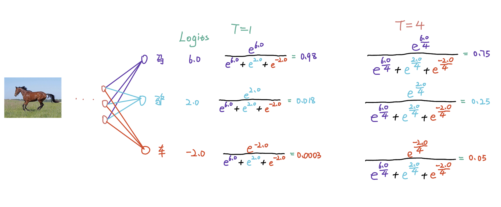

# अध्याय 6 ज्ञान आसवन

## 6.1 परिचय

&emsp;&emsp;आम तौर पर कहें तो, समान मशीन लर्निंग कार्य के लिए, जटिल नेटवर्क में अधिक पैरामीटर और अधिक कम्प्यूटेशनल जटिलता होती है, लेकिन आमतौर पर बेहतर प्रदर्शन करते हैं। इसके विपरीत, सरल नेटवर्क में कम पैरामीटर और कम कम्प्यूटेशनल जटिलता होती है, लेकिन उनका प्रदर्शन हो सकता है अपेक्षाकृत खराब हो। ज्ञान आसवन (केडी) एक मॉडल संपीड़न तकनीक है जो स्थानांतरण करती हैएक बड़े (शिक्षक) मॉडल से एक छोटे (छात्र) मॉडल तक का ज्ञान, शिक्षक मॉडल के आउटपुट (लॉगिट्स) वितरण या फीचर मैप (फीचर मैप) को सीखकर छात्र मॉडल को बेहतर सीखने में मदद करता है, जिससे सटीकता और दक्षता में सुधार होता है। छात्र मॉडल का.

### मुख्य अवधारणाएँ

#### शिक्षक मॉडल
- एक पूर्व-प्रशिक्षित जटिल मॉडल जो आमतौर पर अच्छा प्रदर्शन करता है लेकिन इसमें उच्च कम्प्यूटेशनल ओवरहेड होता है।
- मध्यवर्ती परतों से सॉफ्ट लेबल या जानकारी को "ज्ञान" के रूप में प्रदान करता है।

#### अध्ययनएनटी मॉडल
- शिक्षक मॉडल के व्यवहार को सीखने और उसका अनुकरण करने के लिए डिज़ाइन किया गया एक छोटा, सरल मॉडल।
- शिक्षक मॉडल के "ज्ञान" को सीखकर, छात्र मॉडल छोटे पैमाने पर शिक्षक मॉडल के करीब प्रदर्शन हासिल करने में सक्षम होता है।

####सॉफ्ट टारगेट
- शिक्षक मॉडल द्वारा संभाव्यता वितरण आउटपुट में आमतौर पर हार्ड लेबल (यानी, वन-हॉट लेबल) की तुलना में अधिक जानकारी होती है।
- तापमान समायोजन द्वारा आउटपुट संभाव्यता वितरण को नरम किया जाता है, ताकि एसछात्र मॉडल संभावनाओं के बीच सापेक्ष संबंध को बेहतर ढंग से जान सकता है।

## 6.2 ज्ञान आसवन की विशिष्ट प्रक्रिया

&emsp;&emsp; ज्ञान आसवन की बुनियादी वास्तुकला ऊपर दिए गए चित्र में दिखाई गई है, जहां शिक्षक मॉडल एक प्रशिक्षित मॉडल है और छात्र मॉडल एक मॉडल है जिसे प्रशिक्षित करने की आवश्यकता है।

&emsp;&emsp; यह मानते हुए कि वर्तमान कार्य एक छवि वर्गीकरण कार्य है, प्रशिक्षण चरण में, एक प्रशिक्षण छवि $\mathbf x$ और उसके अनुरूप के लिएg ट्रू लेबल $y$ (हार्ड लेबल भी कहा जाता है)। छवि $\mathbf{x}$ को क्रमशः शिक्षक और शिक्षण मॉडल में फ़ीड करें, और एक ही आकार के दो आउटपुट लॉग प्राप्त करें: $\mathbf{u} = [u_1 , u_2, ..., u_K]\in \mathbb{R}^{1\times K}$ और $\mathbf{v} = [v_1, v_2, ..., v_K] \in \mathbb{R} ^{1\times K}$, जहां $K$ वर्गीकरण कार्य के डेटासेट के अनुरूप श्रेणियों की कुल संख्या का प्रतिनिधित्व करता है, इसके बाद, अंतिम भविष्यवाणी प्राप्त करने के लिए दो लॉगिट को सॉफ्टमैक्स फ़ंक्शन द्वारा संसाधित किया जाता हैइनपुट पर दो मॉडलों के ns $\mathbf{x}$, $\mathbf{p} = [p_1, p_2, ..., p_K]$ और $\mathbf{q} = [q_1, q_2, .. ., q_K]$.

&emsp;&emsp; चूंकि शिक्षक मॉडल का आउटपुट आमतौर पर अधिक आश्वस्त होता है, इससे असंसाधित $\mathbf{p}$ एक-हॉट वेक्टर ($[0, 0, 1, 0, ..., 0, 0]$) शिक्षक मॉडल की अनुमानित संभावना को नरम करने के लिए, सामान्य अभ्यास नरम करने के लिए सॉफ्टमैक्स फ़ंक्शन में तापमान $\tau$ पेश करना और केएल div निष्पादित करना है।नरम लॉगिट्स पर आकस्मिक गणना हानि, जो नरम हानि बन जाती है।

&emsp;&emsp; उसी समय, आसवन के दौरान, छात्र मॉडल को नए पर्यवेक्षण नंबर (हार्ड लेबल) से पर्यवेक्षण भी प्राप्त होता है, यह नुकसान सामान्य वर्गीकरण कार्य प्रशिक्षण नुकसान से अलग नहीं हो सकता है छात्र मॉडल के आउटपुट $\mathbf{v}$ और हार्ड लेबल $y$ के लिए सीधे गणना की जाएगी। नुकसान के इस हिस्से को हार्ड लॉस (हार्ड लॉस) कहा जाता है, और अंत मेंमॉडल आसवन सॉफ्ट लॉस और हार्ड लॉस की संयुक्त कार्रवाई के तहत किया जाता है।

## 6.2 तापमान

### तापमान क्या है

&emsp;&emsp; तापमान का उपयोग ज्ञान आसवन में शिक्षक मॉडल आउटपुट की संभाव्यता वितरण को समायोजित करने के लिए किया जाता है, ताकि छात्र मॉडल के सीखने को बेहतर ढंग से निर्देशित किया जा सके।

### तापमान की आवश्यकता क्यों है

&emsp;&emsp; शिक्षक मॉडल का आउटपुट आमतौर पर एक श्रेणी संभाव्यता वितरण होता है, जो सॉफ्टमैक्स आउटपुट के लिए उत्पन्न होता हैतापमान को समायोजित किए बिना, एक निश्चित श्रेणी की संभावना आमतौर पर 1 के करीब होती है, जबकि अन्य श्रेणियों की संभावना 0 के करीब होती है। यह तीव्र वितरण छात्र मॉडल के लिए अनुकूल नहीं है क्योंकि यह केवल सही उत्तर के बारे में जानकारी प्रदान करता है और इसे अनदेखा करता है। अन्य श्रेणियों की जानकारी। (और इस समय, शिक्षक मॉडल द्वारा संभाव्यता वितरण आउटपुट हार्ड लेबल लेबल के बहुत करीब है), तापमान को समायोजित करने के बाद, एक अपेक्षाकृत "नरम" प्रोबाबीलाइट वितरण प्राप्त किया जा सकता है, जिसे "सॉफ्ट लेबल" कहा जाता है। इस समायोजन प्रक्रिया को "सॉफ्टनिंग" कहा जाता है।

|. टैग |. घोड़ा |
|. :--------: |. :--: |
|img|  | | |
|. नेटवर्क आउटपुट |. 2.0 |
|.सॉफ़्टमैक्स |.0.018 |
|. हार्ड लेबल (सच्चा लेबल) |. 0 |
|. नरम लेबल (तापमान से नरम) |. 0.25 |

&emsp;&emsp; यह पाया जा सकता है कि संभाव्यतासॉफ्टमैक्स के बाद नेटवर्क के मूल आउटपुट का वितरण लगभग वास्तविक लेबल के समान है। उदाहरण के लिए, "घोड़ा" "गधे" की तरह अधिक है और "कार" की तरह कम है। हालाँकि मूल आउटपुट का सॉफ्टमैक्स संभाव्यता वितरण भी इस संबंध को प्रतिबिंबित कर सकता है, लेकिन तापमान नरम होने के बाद प्राप्त सॉफ्ट लेबल स्पष्ट रूप से विभिन्न बिल्लियों के बीच अंतर दिखा सकता हैअहंकार और विभिन्न श्रेणियों के बीच सापेक्ष संबंध को अच्छी तरह से प्रतिबिंबित करता है यह विवरण छात्र मॉडल को केवल हार्ड लेबल सीखने के बजाय इनपुट नमूने की पूरी जानकारी को बेहतर ढंग से समझने में मदद कर सकता है।

### तापमान गणना प्रक्रिया

&emsp;&emsp; एक मॉडल मानें मॉडल का आउटपुट $z = [z_1, z_2, ..., z_K]$ है, जहां $K$ पारंपरिक सॉफ़्टमैक्स है

$$
\frac{\exp {z_i}}{\sum _ {j=1} ^ K \exp {z_j}}
$$

&emsp;&emsp; गणना विधितापमान के साथ सॉफ्टमैक्स का ओडी है

$$
\frac{\exp {z_i / \tau}}{\sum _ {j=1} ^ K \exp {z_j / \tau}}
$$

&emsp;&emsp; जहां $\tau$ तापमान का प्रतिनिधित्व करता है तो पारंपरिक सॉफ्टमैक्स को एक विशेष मामले के रूप में भी माना जा सकता है जहां तापमान $\tau$ 1 है।

&emsp;&emsp; एक अधिक विशिष्ट उदाहरण, जैसा कि तालिका में दिखाया गया है:

<!--  -->

|. क्लास |. लॉगिट्स (नेटवर्क का सीधा आउटपुट) |. सॉफ्टमैक्स(टी=4)  तापमान के साथ नरमी |
|. :--:|. :---:||. :------------------------------------------------ --------: |. :------------------------------------------------- ------------------: |
|. घोड़ा |. 6.0 |. $\frac{e^{6.0}}{e ^ {6.0} + e^{-2.0}} = 0.98$ | }{4}}}{e^{\frac{6.0} |
|. गधा |. 2.0 | $\frac{e^{2.0}}{e ^ {6.0} + e^{-2.0}} = 0.018$ | } 4 } ‍ ‍ ‍ ‍ ‍ ‍ ‍ ‍ ‍ ‍ ‍ ‍ ‍ तक |
| कार | -2.0 |}{e ^ {6.0} + e ^ {2.0}+ e^{-2.0}} = 0.002$ | $\frac{e^{\frac{-2.0}{4}}}{e^{\frac{ 6.0}{4}} + e^{\frac{2.0}{4}} + e^{\frac{-2.0}{4}}}=0.05$ |

&emsp;&emsp;व्यवहार में, हम आम तौर पर छात्र मॉडल के आउटपुट को भी नरम करते हैं। अंत में, नरम शिक्षक मॉडल और छात्र मॉडल के सॉफ्ट लेबल $\mathbf{p}(\tau) = [p_1(\tau) होते हैं। p_2(\tau), ..., p_K(\tau)]$ और $\mathbf{q}(\tau) = [q_1(\tau), q_2(\tau), ..., q_K(\tau )]$ क्रमशः।

&emsp;&emsp;$p_i(\tau)$ और $q_i(\tau)$ को इस प्रकार परिभाषित किया गया हैएस:
$$
\शुरू{संरेखित}
p_{i}(\tau) = \frac{\exp(u_i / \tau)}{\sum_{i=1}^K \exp(u_i / \tau)} \\
q_{i}(\tau) = \frac{\exp(v_i / \tau)}{\sum_{i=1}^K \exp(v_i / \tau)}
\अंत{संरेखित}
$$
&emsp;&emsp;जिसमें, $\tau$ आसवन प्रक्रिया में प्रयुक्त तापमान को दर्शाता है। जब तापमान $\tau$ 1 होता है, तो $\mathbf p(\tau)$ और $\mathbf q(\tau) के परिणाम मिलते हैं। $ सामान्य सॉफ़्टमैक्स फ़ंक्शन के परिणामों के अनुरूप हैं।

### लॉगिट्स की नरमी की डिग्री पर तापमान का प्रभाव

&emsp;&emsp; तापमान का आकार $\tau$ अनुमानित संभावना की नरमी की डिग्री को नियंत्रित करता है। छोटे $\tau$ के परिणामस्वरूप तीव्र नरमी प्रभाव होगा, जबकि बड़े $\tau$ के परिणामस्वरूप नरम नरमी प्रभाव होगा ऊपर दिए गए चित्र में दिखाया गया है, सबसे बाईं ओर की उत्पत्ति किसी भी छवि के लिए वर्गीकरण नेटवर्क के आउटपुट लॉग के वितरण का प्रतिनिधित्व करती है, क्षैतिज अक्ष विशिष्ट श्रेणी संख्या का प्रतिनिधित्व करता है, और ऊर्ध्वाधर अक्ष नेटवर्क के पी का प्रतिनिधित्व करता हैएक विशिष्ट प्रकार के लिए पुनर्निर्देशित मान सबसे दाहिनी ओर Argmax() है।

&emsp;&emsp; यह पाया जा सकता है कि जब तापमान बहुत अधिक होता है (उदाहरण के लिए, $\tau = 14$), तो नरम लॉगिट्स का वितरण लगभग समान होता है, और जब तापमान बहुत कम होता है (उदाहरण के लिए, $ \tau = 0.5$), नरम लॉगिट्स का वितरण लगभग Arg max() के परिणाम के बराबर है। दूसरे शब्दों में, जब तापमान बहुत अधिक होता है, तो शिक्षक नेटवर्क के नरम लॉगिट्स औसत v के करीब होते हैंएल्यू, और छात्र मॉडल शिक्षक मॉडल से ज्ञान नहीं सीख सकता है, क्योंकि प्रत्येक श्रेणी के लिए शिक्षक मॉडल के लॉगिट्स की भविष्यवाणी संभावना सुसंगत है, जब तापमान बहुत कम होता है, तो आसवन अपना अर्थ खो देता है, क्योंकि शिक्षक मॉडल द्वारा पारित ज्ञान छात्र को हार्ड लेबल के बराबर माना जा सकता है, इसलिए, आसवन के लिए सही तापमान चुनना महत्वपूर्ण है, जबकि सीआईएफएआर-10/100 डेटासेट पर उपयोग किया जाने वाला तापमान $4$ होता हैइमेजनेट डेटासेट, आमतौर पर उपयोग किया जाने वाला तापमान $1$ है।

### विभिन्न आकारों और तापमानों के आसवन परिणाम

&emsp;&emsp; चित्र में शिक्षक मॉडल Res32x4 है, और छात्र मॉडल Res8x4 है। प्रयोग के लिए चयनित डेटा सेट CIFAR-100 है। ऊर्ध्वाधर अक्ष आसवन में उपयोग किए गए तापमान का प्रतिनिधित्व करता है, और ऊर्ध्वाधर अक्ष आसवन परिणामों का प्रतिनिधित्व करता है। CIFAR-100 सत्यापन सेट पर यह पाया जा सकता है कि विभिन्न तापमानों का एक संबंध हैआसवन के परिणामों पर काफी बड़ा प्रभाव पड़ता है, जब आप स्वयं अभ्यास करते हैं, तो पाठकों को केवल अनुभवजन्य सेटिंग्स पर निर्भर रहने के बजाय विभिन्न तापमानों का प्रयास करना चाहिए।

## 6.3 ज्ञान आसवन का हानि कार्य

&emsp;&emsp;ज्ञान आसवन का हानि कार्य नरम हानि और कठोर हानि के एक रैखिक संयोजन से बना है, और विशिष्ट परिभाषा इस प्रकार है:

&emsp;&emsp;**हल्का नुकसान**

$$
\mathcal{L}_{\operatorname{KL}} = \operatorname {KL}(\mathbf{q}(\tau), \mathbf{p}(\tau))= \sum_j \ p_j(\tau) \log \frac{p_j(\tau)}{q_j(\tau)}
$$

&emsp;&emsp;**कठिन हानि**

$$
\mathcal L_{CE} = \operatorname {CE}(\mathbf q(\tau = 1), \mathbf y) = \sum _ {j} - y_j \log q_j(1)
$$

&emsp;&emsp;जहां $\mathbf{p}$ और $\mathbf{q}$ क्रमशः शिक्षक मॉडल और छात्र मॉडल के आउटपुट लॉग का प्रतिनिधित्व करते हैं, जबकि $\tau$ आसवन के लिए उपयोग किए गए तापमान का प्रतिनिधित्व करते हैं है
$$
हानि = \alpha \cdot \mathcal L_{CE} + \beta \cdot \tau ^ 2 \cdot \mathcal L_{KL}\\
= \alpha \cdot \operatorname {CE}(\mathbf q(\tau = 1), \mathbf y) + \beta \cdot \tau ^ 2 \cdot \operatorname {KL}(\mathbf{q}(\tau ), \mathbf{p}(\tau))
$$

&emsp;&emsp; सामान्य तौर पर, $\alpha + \beta = 1$ रखें। व्यवहार में, $\alpha$ आमतौर पर $0.1$ होता है, और $\beta$ आमतौर पर $0.9$ होता है {KL}$ द्वारा नरम हानि का $\tau ^ 2$, सरल व्याख्या नरम हानि और कठिन हानि के बीच क्रमिक संतुलन बनाए रखना है। कृपया विशिष्ट स्पष्टीकरण चुनें[6.4]() जोड़ना

## 6.4 हानि फ़ंक्शन की व्युत्पत्ति (वैकल्पिक)

### 6.4.1 सॉफ्टमैक्स फ़ंक्शन की व्युत्पत्ति

&emsp;&emsp;मान लें कि एक मनमाने लॉगिट्स वेक्टर के लिए $\mathbf z = [z_1, z_2, ..., z_{K}]\in \mathbb{R}^{1\times K}$, जहां $K$ डेटासेट में श्रेणियों की संख्या है। तापमान के साथ सॉफ्टमैक्स फ़ंक्शन द्वारा वेक्टर $\mathbf s = [s_1(\tau), s_2(\tau), ..., s_K(\tau)]$ की गणना करने के बाद। s_i(\tau)$ को इस प्रकार परिभाषित किया गया है:
$$
s_i(\tau) = \frac{e^{z_i/ \tau}}{\sum_{j=1}^K e^{z_j / \tau}}
$$

&इmsp;&emsp;किसी भी $z_k \in \mathbf z$ के लिए, $z_k$ के संबंध में $s_i(\tau)$ के आंशिक व्युत्पन्न को दो मामलों में विभाजित किया जा सकता है:

&emsp;&emsp; जब $i = k$ , वहाँ है
$$
\शुरू करें{संरेखित करें*}
\frac{\आंशिक s_i(\tau)}{\आंशिक z_k}
&= \frac{\partial}{\partial z_k}\frac{e^{z_k / \tau}}{\sum_{j=1}^K e^{z_j / \tau}} \\
&= \frac{\frac{\partial}{\partial z_k}e^{z_k / \tau}\ \sum_{j=1}^K e^{z_j / \tau} - e^{z_k / \tau 3\tau}\दाएं) ^ 2} \\
&= \frac{\frac{1}{\tau}\ e^{z_k/ \tau}}{\sum_{j=1}^K e^{z_j / \tau}} - \frac{e^{ z_k/ \tau }\ \frac{1}{\tau}\ e^{z_k/ \tau }}{\left( \sum_{j=1}^K e^{z_j / \tau}\right) ^ 2}\\
&= \frac{1}{\tau}(s_k(\tau) - s_k(\tau)\ s_k(\tau)) \\
&= \frac{1}{\tau}\ s_k(\tau)\ (1 - s_k(\tau))
\end{संरेखित करें*}
$$

&emsp;&emsp; जब $i \neq k$, होता है
$$
\शुरू करें{संरेखित करें*}
\frac{\आंशिक s_i(\tau)}{\आंशिक z_k}
&= \frac{\partial}{\partial z_k}\frac{e^{z_i / \tau}}{\sum_{j=1}^K e^{z_j / \tau}} \\
&= \frac{\frac{\आंशिक}{\आंशिक z_k}e^{z_i / \tau}\ \sum_{j=1}^K e^{z_j / \tau} - e^{z_i / \tau} _ }\दाएं) ^ 2} \\
&= 0- \frac{e^{z_i/ \tau }\frac{1}{\tau}e^{z_k/ \tau }}{\left(\sum_{j=1}^K e^{z_j / \tau}\दाएं) ^ 2}\\
&= -\frac{1}{\tau}\ s_i(\tau)\ s_k(\tau)
\end{संरेखित करें*}
$$

&emsp;&emsp; इसलिए, $z_k$ के संबंध में $\varphi (z_i)$ के आंशिक व्युत्पन्न के लिए, हमारे पास है
$$
\frac{\आंशिक s_i(\tau)}{\आंशिक z_k} =
\बाएं\{
\शुरू{मैट्रिक्स}
\frac{1}{\tau}\ s_k(\tau)\ (1 - s_k(\tau))& \text{if } i = k \\
-\frac{1}{\tau}\ s_i(\tau)\ s_k(\tau) & \text{if } i \neq k
\अंत{मैट्रिक्स}
\सही।
$$

### 6.4.2 हार्ड लॉस सीई डेरिवेटिव

&emsp;&emsp;छात्र मॉडल के आउटपुट लॉगिट के लिए $\mathbf{v} = [v_1, v_2, ..., v_K] \in \mathbb{R}^{1\times K}$ किसी भी $v_k$ के लिए $v_k$ में, $v_k$ के संबंध में कठिन हानि $ \mathcal L_{CE}$ का ग्रेडिएंट है:
$$
\शुरू करें{संरेखित करें*}
\mathcal L_{CE} &= \operatorname {CE}(\mathbf q(\tau = 1), \mathbf y) \\
&= \sum _ {j=1}^K - y_j \log q_j(\tau = 1) \\
\frac{\आंशिक \mathcal L_{CE}}{\आंशिक v_k} &= \frac{\partial}{\आंशिक v_k}\sum _ {j=1}^K - y_j \log q_j(\tau = 1 )\\
&= \frac{\partial}{\partial v_k}\sum _ {j=1, j\neq k}^K - y_{j} \log q_j(\tau = 1) + \frac{\partial}{ \आंशिक v_k} - y_k \log q_k(\tau = 1)\\
&= \sum_ {j=1, j\neq k}^K - y_{j} \frac{1}{q_j(\tau=1)}\ \frac{-1}{\tau=1}q_j( \tau=1)q_k(\tau=1) \\ &\ \ \ \ \ - y_k \frac{1}{q_k(\tau=1)}\frac{1}{\tau=1}q_k(\tau=1)(1-q_k(\tau=1))\\
&= \frac{1}{1}(1-y_k)q_k(\tau=1) - \frac{1}{1}y_k(1-q_k(\tau=1))\\
&= q_k(\tau=1) - y_k \\
\end{संरेखित करें*}
$$

### 6.4.3 केएल सॉफ्ट लॉस का व्युत्पन्न

&emsp;&emsp;सॉफ्ट लॉस $\mathcal L_{KL}$ शिक्षक मॉडल के सॉफ्ट लेबल $\mathbf p(\tau)$ और सॉफ्ट लेबल $\mathbf q(\tau)$ का केएल विचलन है छात्र मॉडल के आउटपुट में किसी भी $v_k$ के लिए $\mathcal L_{KL}$ का ग्रेडिएंट है।
$$
\शुरू करें{संरेखित करें*}
\mathcal{L}_{\operatorname{KL}} &= \operatorname {KL}(\mathbf{q}(\tau), \mathbf{p}(\tau)) \\
&= \sum_{j=1}^{K} \ p_j(\tau) \log \frac{p_j(\tau)}{q_j(\tau)} \\
\frac{\आंशिक \mathcal{L}_{\operatorname{KL}}}{\आंशिक v_k} &= \frac{\आंशिक}{\आंशिक v_k} \sum_{j=1}^{K} \ p_j (\tau) \log \frac{p_j(\tau)}{q_j(\tau)} \\
&= \frac{\partial}{\partial v_k} \sum_{j=1}^{K} \left( \ p_j(\tau) \log {p_j(\tau)} - p_j(\tau)\log {q_j(\tau)} \दाएं) \\
&= \frac{\partial}{\partial v_k} \left(\sum_{j=1}^{K} - p_j(\tau)\log{q_j(\tau)}\right) \\
&= \frac{\partial}{\आंशिक v_k} \left( \sum_{j=1, j\neq k} ^ K -p_j(\tau) \log q_j(\tau) -p_k(\tau) \log q_k(\tau) \सही) \\
&= \sum_{j=1, j\neq k}^K \left( -p_j(\tau) \frac{\partial}{\partial v_k} \log q_j(\tau)\right) - \frac{ \आंशिक}{\आंशिक v_k} p_k(\tau) \log q_k(\tau)\\
&= \sum_{j=1, j\neq k}^K -\frac{p_j(\tau)}{q_j(\tau)}\left[ -\frac{1}{\tau}q_j(\tau )q_k(\tau) \right] - \frac{p_k(\tau)}{q_k(\tau)}\left[ \frac{1}{\tau} q_k(\tau)(1 - q_k(\tau) ))\सही]\\
&= \frac{1}{\tau} \sum_{j=1, j\neq k}^K p_j(\tau) q_k(\tau) - \frac{1}{\tau} p_k(\tau)(1 - q_k(\tau)) \ \ \ \text{where} \sum_{j=1}^K p_j (\tau)=1\\
&= \frac{1}{\tau} (1 - p_k(\tau))q_k(\tau) - \frac{1}{\tau} p_k(\tau)(1 - q_k(\tau)) \ \
&= \frac{1}{\tau} \left[ q_k(\tau) - p_k(\tau)q_k(\tau) - p_k(\tau) + p_k(\tau)q_k(\tau)\right] \\
&= \frac{q_k(\tau) - p_k(\tau)}{\tau}
\end{संरेखित करें*}
$$

### 6.4.4 टेलर सन्निकटन

&emsp;&emsp;$e^x$ के लिए, जब $x$ 0 के करीब पहुंचता है, $e^x \लगभग 1 + x + ...$

&emsp;&emsp;अंत में, कठिन हानि के ग्रेडिएंट सी$v_k$ के लिए ई और सॉफ्ट लॉस केएल हैं:
$$
\बाएं\{
\शुरू{मैट्रिक्स}
\frac{\आंशिक \mathcal L_{CE}}{\आंशिक v_k} = q_k(\tau=1) - y_k
\\
\frac{\आंशिक \mathcal{L}_{\operatorname{KL}}}{\आंशिक v_k} = \frac{1}{\tau}(q_k(\tau) - p_k(\tau))
\अंत{मैट्रिक्स}
\सही।
$$

&emsp;&emsp;$\frac{\partial \mathcal L_{CE}}{\partial v_k}$ के लिए, विस्तार है:
$$
\शुरू करें{संरेखित करें*}
\frac{\आंशिक \mathcal L_{CE}}{\आंशिक v_k} &= q_k(\tau=1)-y_k\\
&= \frac{e^{v_k}}{\sum_{j=1}^K e^{v_j}} - y_k \\
&\लगभग \frac{1+v_k}{\sum_{j=1}^K 1 + v_j} - y_k , \text{where} \sum v_j = 0\\
&= \frac{1+v_k}{K} - y_k\\
\end{संरेखित करें*}
$$
​
&emsp;&emsp;$\frac{\partial \mathcal{L}_{\operatorname{KL}}}{\partial v_k}$ के लिए, विस्तार है:
$$
\शुरू करें{संरेखित करें*}
\frac{\आंशिक \mathcal{L}_{\operatorname{KL}}}{\आंशिक v_k} &= \frac{1}{\tau}(q_k(\tau) - p_k(\tau))\\
&= \frac{1}{\tau} (\frac{e^{v_k/\tau}}{\sum_{j=1}^K e^{v_j / \tau}} - \frac{e^{ u_k/ \tau}}{\sum_{j=1}^K e^{u_k/\tau}}) \\
&\लगभग \frac{1}{\tau}(\frac{1 + v_k/\tau}{\sum_{j=1}^K (1 + v_j/\tau)} - \frac{1+u_k/\tau}{\sum_{j=1}^K (1+u_j/ \tau)})\\
&= \frac{1}{\tau}(\frac{v_k/\tau - u_k}{K}) \\
&= \frac{1}{K \ \tau^2} v_k - \frac{u_k}{K\tau}
\end{संरेखित करें*}
$$

&emsp;&emsp;इस बिंदु पर, यह पाया जा सकता है कि $v_k$ के लिए हार्ड लॉस का ग्रेडिएंट $\tau ^ $v_k$ के लिए सॉफ्ट लॉस के ग्रेडिएंट का 2$ गुना है, इसलिए जब लॉस फ़ंक्शन लॉस अंततः होता है गणना के अनुसार, दो नुकसानों के बीच ग्रेडिएंट को संतुलित करने के लिए $\mathcal{L}_{\operatorname{KL}}$ को $\tau ^ 2$ से गुणा करने की आवश्यकता है।## 6.5 अधिक प्रकार के ज्ञान आसवन

### 6.5.1 वियुग्मित ज्ञान आसवन

&emsp;&emsp;डिकॉउल्ड नॉलेज डिस्टिलेशन([DKD](https://arxiv.org/abs/2203.08679))। टारगेट क्लास नॉलेज डिस्टिलेशन (TCKD) और नॉन-टारगेट क्लास डिस्टिलेशन प्राप्त करने के लिए सामान्य केडी (नॉलेज डिस्टिलेशन) हानि को डिकॉउप करें। (टीसीकेडी) ज्ञान आसवन (एनसीकेडी) एनसीकेडी भाग को मजबूत करने के लिए एक नया आसवन हानि प्रस्तावित है।

### 6.5.2 फिटनेट

&emsp;&emsp;फिटनेट](https://arxiv.org/abs/1412.6550) केवल अंतिम आउटपुट के मिलान के बजाय मध्य परत में शिक्षक नेटवर्क और छात्र नेटवर्क की विशेषताओं का मिलान करके प्रशिक्षण, आसवन के लिए मध्य परत का उपयोग करने की यह विधि यह केवल सोच परिणाम बताने के बजाय इनपुट के लिए छात्र मॉडल की सोच प्रक्रिया को पढ़ाने जैसा है, हालांकि, चूंकि दोनों की मध्य परत के आयाम अक्सर बेमेल होते हैं, इसलिए अक्सर एक नया संदर्भ जोड़ना आवश्यक होता हैछात्र मॉडल के आयाम को समायोजित करने के लिए।

### 6.5.3 समीक्षाकेडी

&emsp;&emsp; [ReviewKD](https://arxiv.org/abs/2104.09044) ऐसा माना जाता है कि प्रशिक्षण के प्रारंभिक चरण में छात्र मॉडल को शिक्षक मॉडल की गहरी अमूर्त अर्थ संबंधी जानकारी सीखने देना उचित नहीं है। यह पेपर ज्ञान समीक्षा पद्धति का परिचय देकर इस समस्या का समाधान करता है। विवरण के लिए कृपया [ज़िहु](https://zhuanlan.zhihu.com/p/363994781) देखें।

### 6.5.4 परिणाम तुलना

&emsp;&emsp; डिस्टिल की तुलना करेंCIFAR-100 डेटासेट पर इस अनुभाग में उल्लिखित अनुवाद विधियाँ।

| | शिक्षक: ResNet32x4, Acc: 79.42 >छात्र: शफलनेटवी2, एसीसी: 71.82 |
|.:------: |. :------------------------------------------------- ------------------: |. :--------------------------------- ----------------------------------: |:---------------------- ----------------------------------: |
|केडी|73.33|72.98 | 74.45 |
|. फिटनेट |. 73.50 |
|. समीक्षाकेडी |. 75.63 |. **74.84** |**77.78** |
|. डीकेडी | **76.32** |. 77.07 |

### 6.5.5 जानिएलक्ष्य का पता लगाने के लिए लेज आसवन

&emsp;&emsp; वर्गीकरण कार्यों के लिए ज्ञान आसवन की तुलना में, लक्ष्य का पता लगाने के लिए ज्ञान आसवन अधिक जटिल है। क्योंकि 1) वर्गीकरण कार्यों में लेबल श्रेणियां अपेक्षाकृत संतुलित हैं, जबकि लक्ष्य का पता लगाने के कार्यों में, श्रेणी असंतुलन की समस्या है। लक्ष्य का पता लगाने का कार्य अधिक जटिल है, जिसमें वर्गीकरण कार्य और स्थिति प्रतिगमन कार्य दोनों शामिल हैंई, आसवन मुख्य रूप से तीन भागों के हानि फ़ंक्शन के माध्यम से किया जाता है, साथ ही, सामने और पीछे की पृष्ठभूमि के बीच असंतुलन की समस्या को हल करने के लिए, एक भारित क्रॉस एन्ट्रॉपी हानि प्रस्तावित है।

## 6.6 अभ्यास

- [केडी ज्ञान आसवन](https://github.com/datawhalechina/awesome-compression/blob/main/docs/notebook/ch06/1.kd.ipynb)
- [डीकेडी डिकॉउल्ड नॉलेज डिस्टिलेशन](https://github.com/datawhalechina/awesome-compression/blob/main/docs/notebook/ch06/2.dkd.ipynb)

## 6.7 अधिक केडी सामग्री

- [कोड लाइब्रेरी](https://github.com/megvii-research/mdistiller)