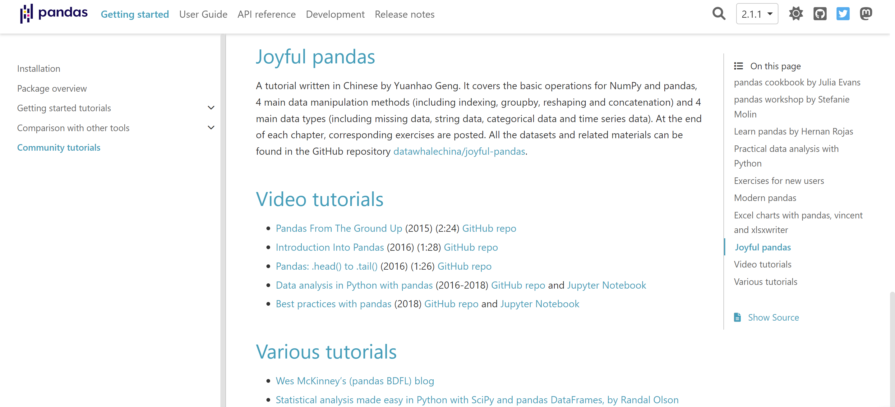
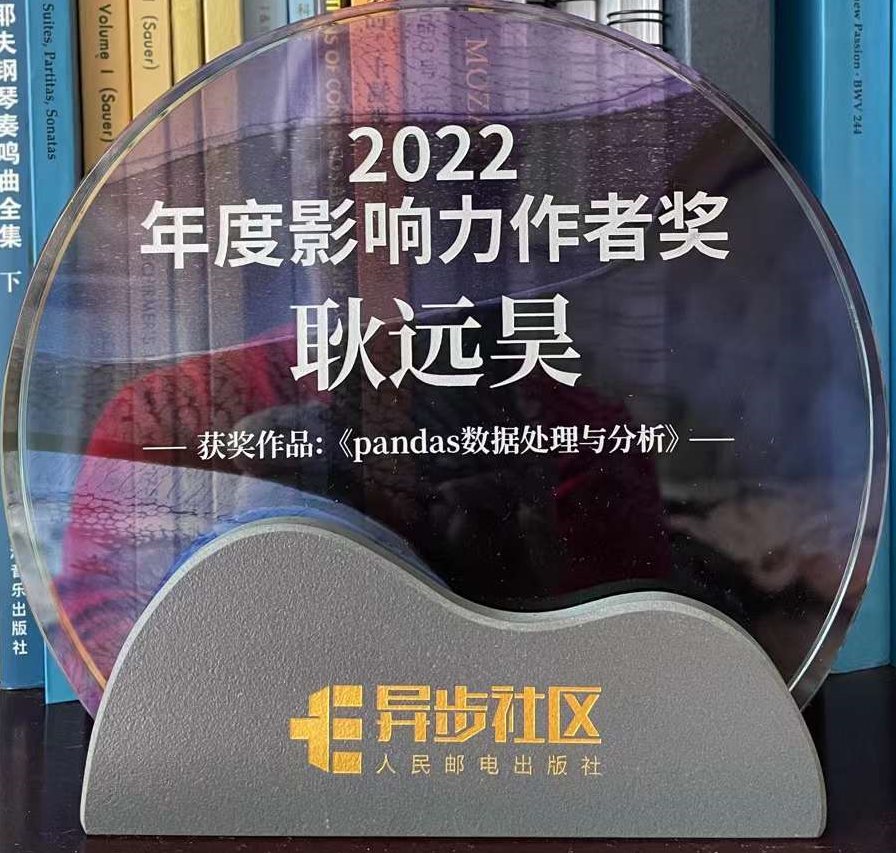
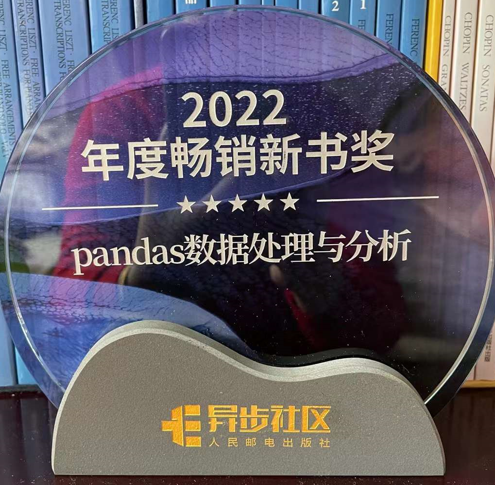

## परिचय

यह पुस्तक युआनहाओ गेंग द्वारा लिखी गई है और इसमें लगभग 325 पृष्ठ हैं। यह पायथन पांडा लाइब्रेरी पर केंद्रित है और इसमें विभिन्न डेटा प्रोसेसिंग और विश्लेषण विधियों को शामिल किया गया है। पहला भाग नम्पी और पांडा की मूल बातों का परिचय देता है भाग पांडा लाइब्रेरी में चार प्रकार के ऑपरेशनों को शामिल करता है, जिसमें अनुक्रमण, समूहीकरण, पुनः आकार देना और विलय शामिल है। तीसरा भाग पांडा में चार प्रकार के डेटा पर चर्चा करता है, जिसमें लापता डेटा, टेक्स्ट डेटा शामिल है, श्रेणीबद्ध डेटा, और समय श्रृंखला डेटा, इन डेटा प्रकारों को संभालने के तरीकों के साथ चौथा भाग डेटा अवलोकन, फीचर इंजीनियरिंग और प्रदर्शन अनुकूलन से संबंधित विषयों पर चर्चा करता है।

पुस्तक की विशेषता समृद्ध अभ्यास हैं। प्रत्येक अध्याय अभ्यासों के साथ समाप्त होता है, और पूरी पुस्तक में कई अभ्यास हैं। पाठक इन अभ्यासों के माध्यम से डेटा विज्ञान की अपनी स्थूल समझ को लागू कर सकते हैं। यह पुस्तक ओडी के क्षेत्र में अभ्यासकर्ताओं या शोधकर्ताओं के लिए उपयुक्त हैएटीए विज्ञान जिनके पास पायथन प्रोग्रामिंग में एक निश्चित आधार है और डेटा प्रोसेसिंग और विश्लेषण के लिए पांडा का उपयोग करना चाहते हैं।

## ओपन सोर्स योगदान

लेखन प्रक्रिया के दौरान, युआनहाओ गेंग ने पांडा लाइब्रेरी के ओपन-सोर्स विकास में सक्रिय रूप से योगदान दिया, उन्होंने 1.0 से 2.0 तक के सभी छोटे संस्करणों के लिए योगदान में भाग लिया, जिसमें लगभग 30 पुल अनुरोधों को आधिकारिक टीम द्वारा विलय कर दिया गया , कॉडसंपूर्ण सूची के लिए प्रदर्शन अनुकूलन और फ़ंक्शन ऑपरेटरों का कार्यान्वयन देखें। उनके योगदान के लिए और [यहां](https://pandas.pydata.org/docs/search.html?q=yuanhao) पांडा के लघु रिलीज योगदानकर्ताओं के लॉग के लिए।

## पुरस्कार और मान्यताएँ

इस पुस्तक को पांडा की आधिकारिक वेबसाइट पर एकमात्र आधिकारिक अनुशंसित चीनी ट्यूटोरियल के रूप में मान्यता दी गई हैचीन की सबसे बड़ी पुस्तक रेटिंग वेबसाइट [डौबन] (https://book.douban.com/subject/35998391/) पर इसी तरह की पुस्तकों की हेरेटिंग सूची, 10 में से 9.2 के स्कोर के साथ। पाठकों ने पुस्तक की व्यापक रूप से प्रशंसा की है।

इस पुस्तक की सफलता के कारण 2022 में, युआनहाओ गेंग को पोस्ट एंड टेलीकॉम प्रेस द्वारा प्रभावशाली लेखक पुरस्कार और बेस्टसेलिंग पुस्तक पुरस्कार से सम्मानित किया गया था।

