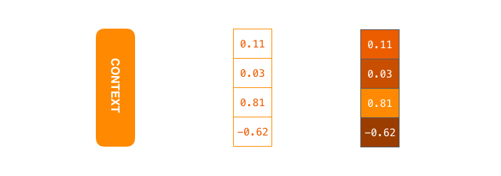

## Attention diagram
Content organization:
- Attention diagram
- seq2seq framework
- seq2seq details
- Attention
- Acknowledgements

In Chapter 1, we gave an overview of the rise of Transformers in NLP. The learning path of this tutorial is: Attention->Transformer->BERT->NLP application. Therefore, this chapter will start with attention and gradually explain the knowledge involved in the Transformer structure in depth, hoping to give readers a vivid description.

Question: What is the reason for the emergence of Attention?
Potential answer: Seq2seq models based on recurrent neural networks (RNNs) encounter challenges when processing long texts, and paying attention to information at different positions in long texts helps improve the model effect of RNNs.

So the learning questions are broken down into: 1. What is a seq2seq model? 2. How does the seq2seq model based on RNN process text/long text sequences? 3. What problems did the seq2seq model encounter when processing long text sequences? 4. How to combine attention with the RNN-based seq2seq model to improve the model effect?

## seq2seq framework

seq2seq is a common NLP model structure, the full name isIt is: sequence to sequence, translated as "sequence to sequence". As the name implies: get a new text sequence from a text sequence. Typical tasks include: machine translation task, text summarization task. Google Translate began to use the seq2seq model at the end of 2016 and published two groundbreaking papers: [Sequence to Sequence Learning
with Neural Networks](https://papers.nips.cc/paper/5346-sequence-to-sequence-learning-with-neural-networks.pdf) published by Sutskever et al. in 2014 and [Learning Phrase Representations using RNN Encoder–Decoder
for Statistical Machine Translation](http://emnlp2014.org/papers/pdf/EMNLP2014179.pdf) published by Cho et al. in 2014. Interested readers can read the original text for learning.

Regardless of whether you have read the above two Google articles, it is not easy for NLP beginners to fully understand and implement the seq2seq model.. Because we need to disassemble a series of related NLP concepts, and these NLP concepts are progressive, it is not easy to have a clear understanding of the seq2seq model. However, if these complex and awkward NLP concepts can be visualized, it is actually easier to understand. Therefore, this article hopes to help NLP beginners learn seq2seq and attention-related concepts and knowledge through a series of pictures and dynamic pictures.

First, let's look at what seq2seq does? The input of the seq2seq model can be a sequence of (words, letters or image features), and the output is another sequence of (words, letters or image features). A trained seq2seq model is shown in the figure below (Note: Put the mouse on the picture and the picture will move):

Dynamic picture: seq2seq

As shown in the figure below, taking the machine translation task in NLP as an example, the sequence refers to a series of words, and the output is also a series of words.
Dynamic image: translation

## seq2seq details
Disassemble the blue seq2seq model in the above figure, as shown in the following figure: The seq2seq model consists of an encoder and a decoder.(Decoder). The green encoder processes each element in the input sequence and obtains input information, which is converted into a yellow vector (called context vector). When we process the entire input sequence, the encoder sends the context vector to the purple decoder, which outputs the new sequence element by element through the information in the context vector.

Dynamic graph: encoder-decoder in seq2seq

Since the seq2seq model can be used to solve the machine translation task, the process of machine translation being solved by the seq2seq model is shown in the figure below, and is studied as a specific example of the seq2seq model.

Dynamic graph: encoder-decoder in seq2seq, an example of machine translation

In-depth study of the seq2seq model in the machine translation task, as shown in the figure below. The encoder and decoder in the seq2seq model generally use recurrent neural networks (RNNs) (in the past when the Transformer model did not exist). The encoder encodes the input French word sequence into a context vector (in the green encoder and the purple decoder), and then the decoder decodes the English word sequence according to the context vector. *For recurrent neural networks, this article recommends reading [Luis Serrano's wonderful introduction to recurrent neural networks](https://www.youtube.com/watch?v=UNmqTiOnRfg).*

Figure: The context vector corresponds to the middle floating point vector in the above figure. In the following, we will visualize these digital vectors, using brighter colors to represent higher values, as shown on the right side of the above figure

As shown in the above figure, let's take a look at what the yellow context vector is? It is essentially a set of floating point numbers. The length of this context array is based on the number of hidden layer neurons of the encoder RNN. The figure above shows a context vector of length 4, but in actual applications, the length of the context vector is customized, such as 256, 512 or 1024.

So how does RNN specifically process the input sequence?

1. Assume that the sequence input is a sentence, which can be represented by $n$ words: $sentence = \{w_1, w_2,...,w_n\}$.
2. RNN first maps each word in the sentence into a vector to obtain a vector sequence: $X = \{x_1, x_2,...,x_n\}$. The vector obtained by mapping each word is usually called: word embedding.
3. Then when processing the sequence input $x_t$ of the $t \in [1,n]$th time step, the input and output of the RNN network can be expressed as: $h_{t} = RNN(x_t, h_{t-1})$

- Input: One of the inputs of RNN at time step $t$ is the vector $x_t$ obtained by mapping the word $w_t$.
- Input: Another input of RNN is the hidden state vector $h_{t-1}$ obtained at the previous time step $t-1$, which is also a vector.
- Output: The output of RNN at time step $t$ is the $h_t$ hidden state vector.

 Figure: Word embedding example. Before we process words, we need to map them into vectors, which is usually done using the word embedding algorithm. Generally speaking, we can use pre-trained word embeddings or train word embedding on our own datasets. For simplicity, the word embedding dimension shown in the figure above is 4. After each word on the left side of the figure above passes through the word embedding algorithm, a corresponding 4-dimensional vector in the middle is obtained.

Let's further visualize how the encoder in the RNN-based seq2seq model works at the first time step:

 Dynamic diagram: As shown in the figure, at the second time step, the RNN uses the hidden state#10 (hidden layer state) obtained at the first time step and the input vector input#1 of the second time step to obtain the new output hidden state#1.

Looking at the dynamic diagram below, let's take a closer look at how the encoder obtains the hidden state at each time step and transmits the final hidden state to the decoder., the decoder decodes the output sequence according to the last hidden state information given by the encoder. Note that the last hidden state is actually the context vector we mentioned above.
 Dynamic diagram: The encoder gradually obtains the hidden state and transmits the last hidden state to the decoder.

Next, let's take a look at how the decoder obtains the l of the output sequence step by step in conjunction with the encoder processing the input sequence. Similar to the encoder, the decoder also obtains the hidden state at each time step, and also needs to pass the hidden state from one time step to the next time step.

 Dynamic diagram: The encoder first encodes each French word in sequence according to the time step, and finally passes the last hidden state, that is, the context vector, to the decoder. The decoder gradually decodes the context vector to obtain the English output.

So far, I hope you have understood the first two questions raised at the beginning of this article: 1. What is the seq2seq model? 2. How does the seq2seq model process text/long text sequences? Then please think about the third and fourth questions: 3. seqWhat problems will the seq2seq model encounter when processing text sequences (especially long text sequences)? 4. How can the RNN-based seq2seq model combine attention to solve problem 3 and improve the model effect?

## Attention
The RNN-based seq2seq model encoder encodes all information into a context vector, which is the bottleneck of this type of model. On the one hand, it is difficult for a single vector to contain all the information of the text sequence. On the other hand, RNN recursively encodes the text sequence, which makes the model face great challenges when processing long texts (for example, when RNN processes the 500th word, it is difficult to contain all the information in words 1-499).

In response to the above problems, Bahdanau et al. published [Neural Machine Translation by Jointly Learning to Align and Translate](https://arxiv.org/abs/1409.0473) in 2014 and Luong et al. published [Effective Approaches to Attention-based Neural Machine Translation
](https://arxiv.org/abs/1508.04025) in 2015, which proposed a method calledAttention technology. Through attention technology, seq2seq models have greatly improved the quality of machine translation. The reason is that the attention mechanism allows the seq2seq model to focus on the input sequence in a discriminative and focused manner.

The following figure is still an example of machine translation:

 Figure: At the 7th time step, the attention mechanism allows the decoder to focus on the French input sequence: étudiant before generating the English translation student English translation. This discriminative attention to the important information of the input sequence makes the model have better results.

Let's continue to understand the seq2seq model with attention: An attention model is different from the classic seq2seq model in two main ways:

- A. First, the encoder passes more data to the decoder. The encoder passes the hidden state of all time steps to the decoder, andInstead of just passing the last hidden state, as shown in the following dynamic diagram:
 Dynamic diagram: More information is passed to the decoder

- B. The decoder of the attention model does an additional attention process before generating the output. As shown in the figure below, specifically:

- 1. Since each hidden state in the encoder corresponds to a word in the input sentence, the decoder needs to check all the received hidden states of the encoder.

- 2. Calculate a score for each hidden state (we will ignore the calculation process of this score for now).
- 3. The scores of all hidden states are normalized by softmax.
- 4. Multiply each hidden state by the corresponding score, so that the hidden state corresponding to the high score will be enlarged, and the hidden state corresponding to the low score will be reduced.
- 5. Perform weighted summation of all hidden states according to their corresponding scores to obtain the context vector of the corresponding time step. Animation: At the 4th time step, the encoder combines attention to get the 5 steps of the context vector.

So, attention can be simply understood as: an effective weighted summation technique, and the art lies in how to get the weights.

Now, let's combine everything into the following figure to see the full process of the seq2seq model decoder combined with attention. The animation shows the 4th time step:

1. The input of the decoder RNN of the attention model includes: a word embedding vector, and an initialized decoder hidden state, $h_{init}$ in the figure.

2. The RNN processes the above 2 inputs and produces an output and a new hidden state, h4 in the figure.

3. Attention steps: We use all the hidden state vectors of the encoder and the h4 vector to calculate the context vector (C4) for this time step.

4. We concatenate h4 and C4 to get an orange vector.
5. We input this orange vector into a feedforward neural network (this network is trained together with the entire model).
6. Get the output word based on the output vector of the feedforward neural network: Assume that there are N possible words in the output sequence,Then the output vector of this feedforward neural network is usually N-dimensional, with the subscript of each dimension corresponding to an output word, and the value of each dimension corresponding to the output probability of the word.
7. Repeat steps 1-6 at the next time step.
 Dynamic graph: The whole process of decoder combined with attention

So far, I hope you have the answers to questions 3 and 4 raised at the beginning of this article: 3. What are the challenges of seq2seq processing long text sequences? 4. How does seq2seq combine attention to solve the challenges in problem 3?

Finally, let's visualize the attention mechanism to see which parts of the input sequence the decoder pays attention to at each time step:
 Dynamic graph: Words that attention focuses on during the decoding step

It should be noted that the attention model does not unconsciously correspond the first word of the output to the first word of the input. It learns how to correspond words in two languages ​​(in our case, French and English) during the training phase.

The following figure also shows how accurate the attention mechanism is (picture from the paper mentioned above):
 Figure: You can see the attention distribution of the model when it outputs "European Economic Area". In French, the order of these words is reversed compared to English ("européenne économique zone"). The order of other words is similar.

After understanding the attention and seq2seq models, go to github and click **star** to check in~~

## Acknowledgements
This article is mainly translated by Zhang Xian from Harbin Institute of Technology (authorized by the original author [@JayAlammmar](https://twitter.com/JayAlammar)), and reorganized and sorted by Duoduo and datawhale learners. Finally, I look forward to your reading feedback and stars.