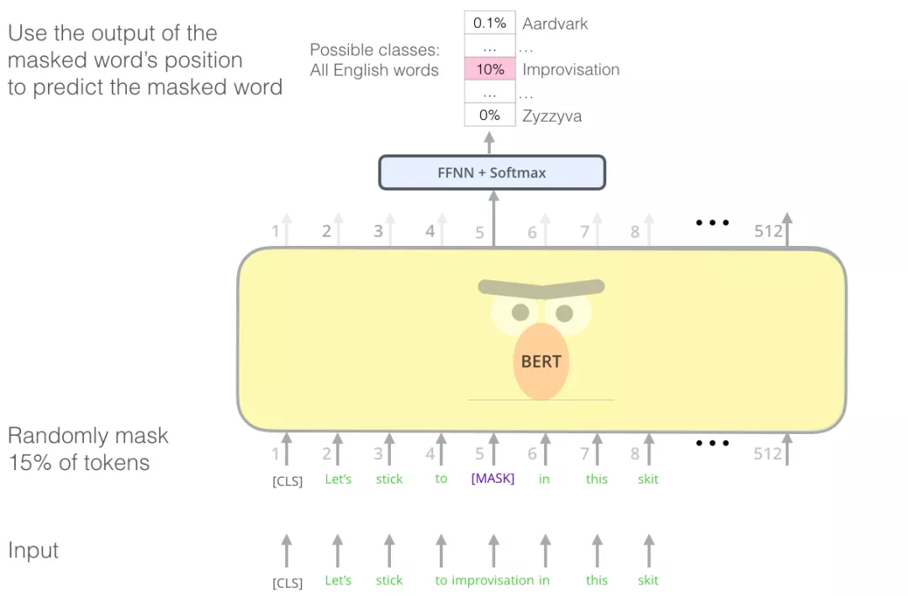
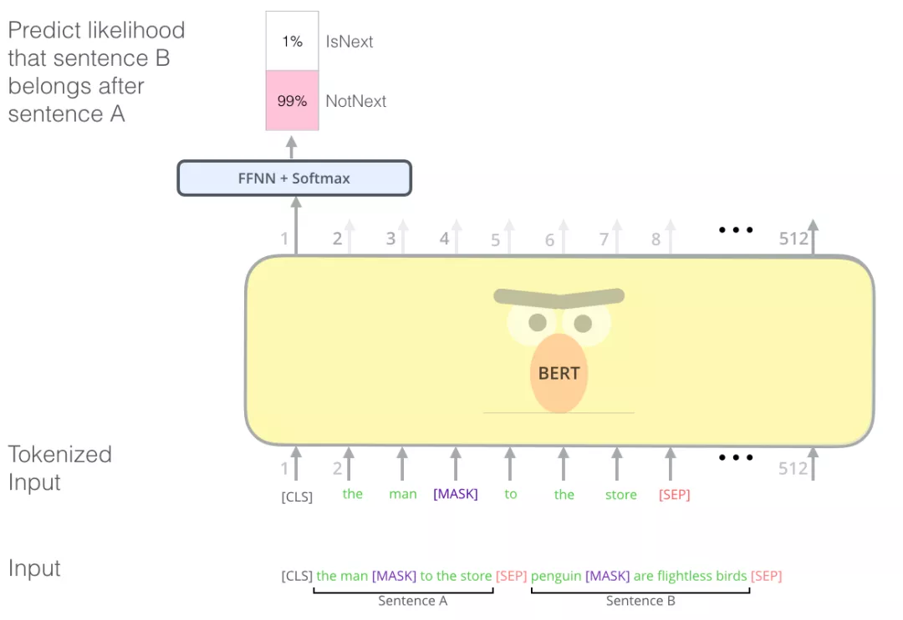
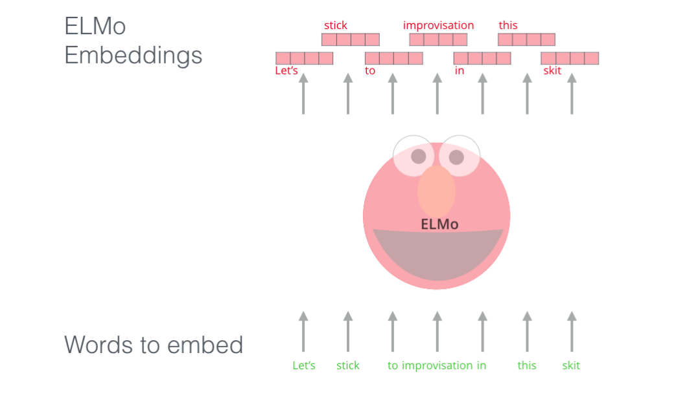
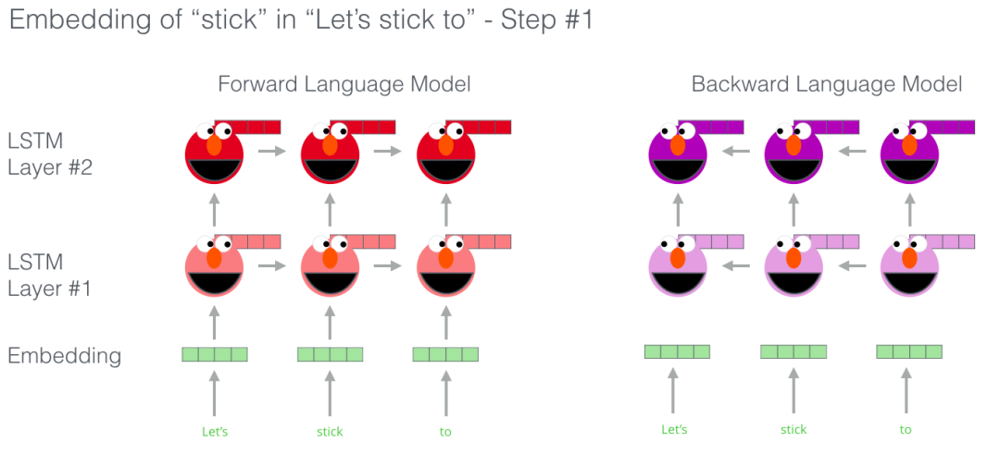
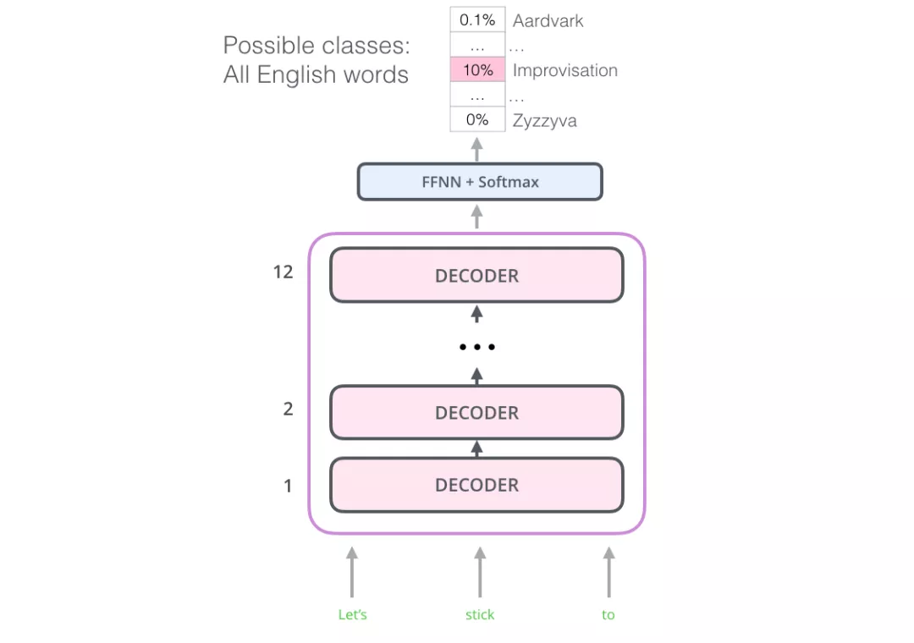

# ग्राफिक बर्ट

सामग्री संगठन;
- सचित्र बर्ट
  - बर्ट वाक्य वर्गीकरण
  - मॉडल संरचना
  - मॉडल इनपुट
  - मॉडल आउटपुट
  - पूर्व-प्रशिक्षण कार्य: नकाबपोश भाषा मॉडल
  - पूर्व-प्रशिक्षण कार्य: आसन्न वाक्य निर्णय
  - बीईआरटी का आवेदन
  - BERT सुविधा निष्कर्षण
  - विस्तारित पढ़ना
    - सीएनएन की तुलना करें
    - वर्ड एम्बेडिंग (एम्बेडिंग) प्रगति
      - शब्द एम्बेडिंग की समीक्षा करें
      - प्रासंगिक मुद्दे
      - ट्रांसफार्मर: LSTM से परे
      - ओपनएआई ट्रांसफार्मर: भाषा मॉडलिंग के लिए ट्रांसफार्मर डिकोडर को पूर्व-प्रशिक्षित करें
      - बर्ट: डिकोडर से एनकोडर
  - आभार

अध्याय 2.2 में ट्रांसफार्मर का अध्ययन करने के बाद, आइए एक क्लासिक मॉडल के बारे में जानें जो ट्रांसफार्मर मॉडल संरचना विकसित करता है: BERT।

2021 को देखते हुए, 2018 प्राकृतिक भाषा प्रसंस्करण प्रौद्योगिकी में एक महत्वपूर्ण मोड़ है। पाठ को संसाधित करने के लिए गहन शिक्षण तकनीक का उपयोग करने की क्षमता का पूर्व-प्रशिक्षण मॉडल के माध्यम से बहुत उपयोग किया गया है। साथ ही, एनएलपी ओपन सोर्स समुदाय के योगदान से, कई शक्तिशाली मॉडलों को घटकों में समाहित किया गया है, जिससे एनएलपी शुरुआती लोगों को अनुमति मिल सके।विभिन्न एनएलपी कार्यों पर बहुत अच्छे परिणाम प्राप्त करने के अवसर हैं। कई एनएलपी पूर्व-प्रशिक्षण मॉडलों में से, सबसे क्लासिक मॉडल बीईआरटी और जीपीटी हैं, इसलिए यह लेख बीईआरटी का अध्ययन शुरू करेगा (एक लेख का उद्धरण 20,000 के करीब है)।

BERT को 2018 में प्रस्तावित किया गया था, और BERT मॉडल ने सामने आते ही कई प्राकृतिक भाषा प्रसंस्करण कार्यों के सर्वोत्तम रिकॉर्ड तोड़ दिए। BERT के पेपर के जारी होने के तुरंत बाद, BERT टीम ने मॉडल के कोड का खुलासा किया और बड़े पैमाने पर नए पुस्तक डेटा सेट के आधार पर पूर्व-प्रशिक्षित मॉडल का डाउनलोड प्रदान किया। बीईआरटी के मॉडल कोड और मॉडल मापदंडों का खुला स्रोत किसी भी एनएलपी व्यवसायी को इस शक्तिशाली मॉडल घटक के आधार पर अपना स्वयं का एनएलपी सिस्टम बनाने की अनुमति देता है, जो भाषा प्रसंस्करण मॉडल को स्क्रैच से प्रशिक्षित करने के लिए आवश्यक समय, ऊर्जा, ज्ञान और समय की भी बचत करता है।

तो बर्ट ने वास्तव में क्या किया? जैसा कि नीचे दिए गए चित्र में दिखाया गया है, BERT को पहले बड़े पैमाने पर अप्रशिक्षित कॉर्पस पर पूर्व-प्रशिक्षित किया जाता है, फिर पूर्व-प्रशिक्षित मापदंडों के आधार पर एक कार्य-संबंधित तंत्रिका नेटवर्क परत जोड़ता है, और कार्य के डेटा पर फाइन-ट्यूनिंग प्रशिक्षण करता है। और अंततः प्रभावी उपलब्धि हासिल करता है। बीईआरटी की प्रशिक्षण प्रक्रिया को संक्षेप में इस प्रकार वर्णित किया जा सकता है: पूर्व-प्रशिक्षण + फाइन-ट्यूनिंग (फाइनट्यून), जो हाल के वर्षों में सबसे लोकप्रिय एनएलपी समाधान प्रतिमान बन गया है।

 चित्र: BERT प्रशिक्षण और फाइन-ट्यूनिंग

## बर्ट वाक्य वर्गीकरण
खूब सोचोBERT को अच्छी तरह से समझने के लिए, पहले BERT के उपयोग परिदृश्यों को समझना, इनपुट और आउटपुट को स्पष्ट करना और अंत में BERT की आंतरिक मॉडल संरचना और प्रशिक्षण विधियों का विस्तार से अध्ययन करना सबसे अच्छा है। इसलिए, मॉडल में शामिल बीईआरटी-संबंधित अवधारणाओं को पेश करने से पहले, आइए पहले देखें कि बीईआरटी को सीधे कैसे लागू किया जाए।
- बिना पर्यवेक्षित कॉर्पस पर पूर्व-प्रशिक्षित BERT मॉडल डाउनलोड करें, जो आम तौर पर 3 फ़ाइलों से मेल खाती है: BERT मॉडल कॉन्फ़िगरेशन फ़ाइल (ट्रांसफार्मर परतों की संख्या, छिपी परत आकार, आदि निर्धारित करने के लिए उपयोग की जाती है), BERT मॉडल पैरामीटर, और BERT शब्दावली (सभी) टोकन जिन्हें BERT संभाल सकता है)।
- विशिष्ट कार्य आवश्यकताओं के लिए, BERT मॉडल में एक कार्य-संबंधित तंत्रिका नेटवर्क, जैसे एक सरल क्लासिफायरियर जोड़ें, और फिर विशिष्ट कार्य पर्यवेक्षण डेटा पर फाइन-ट्यूनिंग प्रशिक्षण आयोजित करें। (फाइन-ट्यूनिंग की समझ: सीखने की दर छोटी है, प्रशिक्षण युगों की संख्या छोटी है, और मॉडल के समग्र मापदंडों को थोड़ा समायोजित किया गया है)

आइए सबसे पहले देखें कि वाक्य वर्गीकरण के लिए BERT का उपयोग कैसे करें।
मान लीजिए कि हमारा वाक्य वर्गीकरण कार्य यह निर्धारित करना है कि कोई ईमेल "स्पैम" है या "स्पैम नहीं" है, जैसा कि नीचे दिए गए चित्र में दिखाया गया है। बेशक, स्पैम निर्णय के अलावा, यह अन्य एनएलपी कार्य भी हो सकते हैं, जैसे:

- इनपुट: मूवी या उत्पाद समीक्षाएँ। आउटपुट: निर्धारित करें कि मूल्यांकन सकारात्मक है या नकारात्मक।
- इनपुट: दो वाक्य. आउटपुट: क्या दोनों वाक्यों का अर्थ समान है।

चित्र: स्पैम वर्गीकरण

जैसा कि नीचे दिए गए चित्र में दिखाया गया है, वाक्य वर्गीकरण के लिए BERT का उपयोग करने के लिए, हम BERT मॉडल में एक सरल क्लासिफायर परत जोड़ते हैं क्योंकि तंत्रिका नेटवर्क की इस परत के पैरामीटर नए जोड़े गए हैं, इसके मापदंडों को केवल शुरुआत में यादृच्छिक रूप से आरंभ किया जा सकता है , इसलिए हमें इस क्लासिफायरियर को प्रशिक्षित करने के लिए संबंधित पर्यवेक्षित डेटा का उपयोग करने की आवश्यकता है। चूंकि क्लासिफायरियर BERT मॉडल से जुड़ा है, इसलिए BERT मापदंडों को प्रशिक्षण के दौरान भी अपडेट किया जा सकता है।

 चित्र: BERT वाक्य वर्गीकरण

## मॉडल संरचना

उपरोक्त उदाहरण के माध्यम से, हमने सीखा कि BERT का उपयोग कैसे किया जाता है, आइए गहराई से देखें कि यह कैसे काम करता है। BERT के मूल पेपर में दो मॉडल प्रस्तावित हैं, BERT-बेस और BERT-बड़े। आधार के मापदंडों की संख्या बड़े की तुलना में छोटी है, जिसे नीचे दिए गए चित्र के रूप में स्पष्ट रूप से व्यक्त किया जा सकता है।

चित्र: BERT आधार और बड़ा

अध्याय 2.2 में ट्रांसफार्मर को देखते हुए, बीईआरटी मॉडल संरचना मूल रूप से ट्रांसफार्मर का एनकोडर हिस्सा 12-लेयर एनकोडर से मेल खाती है, और बीईआरटी-लार्ज से मेल खाती हैयह एक 24-लेयर एनकोडर है।

 चित्र: BERT-बेस एक 12-लेयर एनकोडर है

## मॉडल इनपुट

इसके बाद, मॉडल के इनपुट और आउटपुट पर एक नज़र डालें: BERT मॉडल इनपुट थोड़ा खास है क्योंकि यह एक वाक्य की शुरुआत में एक [CLS] टोकन को जोड़ता है, जैसा कि नीचे दिए गए चित्र में दिखाया गया है। इस विशेष [सीएलएस] टोकन के लिए बीईआरटी द्वारा प्राप्त वेक्टर प्रतिनिधित्व आमतौर पर वर्तमान वाक्य प्रतिनिधित्व के रूप में उपयोग किया जाता है। इस विशेष [सीएलएस] टोकन को छोड़कर, अन्य इनपुट शब्द अध्याय 2.2 में ट्रांसफार्मर के समान हैं। BERT शब्दों की एक श्रृंखला को इनपुट के रूप में लेता है, और ये शब्द मल्टी-लेयर एनकोडर में ऊपर की ओर प्रवाहित होते रहेंगे। प्रत्येक परत सेल्फ-अटेंशन और फीड-फॉरवर्ड न्यूरल नेटवर्क से होकर गुजरेगी।

चित्र: मॉडल इनपुट

## मॉडल आउटपुट

BERT द्वारा सभी टोकन इनपुट को BERT द्वारा एन्कोड किए जाने के बाद, प्रत्येक स्थिति मेंhidden_size (BERT-बेस में 768) आकार का एक वेक्टर आउटपुट होगा।

चित्र: BERT आउटपुट

के लिएऊपर उल्लिखित वाक्य वर्गीकरण के उदाहरण में, हम सीधे पहले स्थान पर वेक्टर आउटपुट का उपयोग करते हैं ([सीएलएस] के अनुरूप) और इसे क्लासिफायरियर नेटवर्क में पास करते हैं, और फिर वर्गीकरण कार्य करते हैं, जैसा कि नीचे दिए गए चित्र में दिखाया गया है।

 चित्र: बीईआरटी क्लासिफायर से जुड़ा है

## पूर्व-प्रशिक्षण कार्य: नकाबपोश भाषा मॉडल

अब जब हम मॉडल इनपुट, आउटपुट और ट्रांसफार्मर संरचना को जानते हैं, तो BERT बिना निगरानी के कैसे प्रशिक्षित होता है? जानकारी दर्शाने के लिए प्रभावी शब्द और वाक्य कैसे प्राप्त करें? अतीत में, एनएलपी पूर्व-प्रशिक्षण आमतौर पर भाषा मॉडल पर आधारित होता था, उदाहरण के लिए, भाषा मॉडल के पहले तीन शब्दों को देखते हुए, मॉडल को चौथे शब्द की भविष्यवाणी करने दें। हालाँकि, BERT को मास्क्ड भाषा मॉडल के आधार पर पूर्व-प्रशिक्षित किया गया है: इनपुट टेक्स्ट अनुक्रम में शब्दों का हिस्सा (15%) बेतरतीब ढंग से मास्क किया गया है, और BERT को इन मास्क्ड शब्दों की भविष्यवाणी करने की अनुमति है। जैसा कि नीचे दिया गया है:
चित्र: BERT मास्क

इस प्रशिक्षण पद्धति का पता Word2Vec युग से लगाया जा सकता है। विशिष्ट Word2Vec एल्गोरिदम शब्द C के दोनों ओर A, B और D और E शब्दों के आधार पर शब्द C की भविष्यवाणी करता है।
## पूर्व-प्रशिक्षण कार्य: आसन्न वाक्य निर्णय

नकाबपोश को छोड़करभाषा मॉडल, BERT ने पूर्व-प्रशिक्षण के दौरान एक नया कार्य भी पेश किया: यह निर्धारित करना कि क्या दो वाक्य आसन्न वाक्य हैं। जैसा कि नीचे दिए गए चित्र में दिखाया गया है: इनपुट वाक्य ए और वाक्य बी है। बीईआरटी एन्कोडिंग के बाद, [सीएलएस] टोकन के वेक्टर प्रतिनिधित्व का उपयोग यह अनुमान लगाने के लिए किया जाता है कि क्या दो वाक्य आसन्न वाक्य हैं।

चित्र: 2 वाक्य कार्य

ध्यान दें: इस आलेख में विवरण की सुविधा के लिए, पिछले विवरण में BERT टोकननाइज़ेशन की प्रक्रिया को छोड़ दिया गया है, लेकिन पाठकों को यह ध्यान देने की आवश्यकता है कि BERT वास्तव में वर्डपीस को सबसे छोटी प्रसंस्करण इकाई के रूप में उपयोग करता है (वर्डपीस एल्गोरिदम का उपयोग शब्द विभाजन के लिए किया जाता है): टोकन, शब्द का उपयोग करने के बजाय। वर्डपीस में, कुछ शब्दों को छोटे भागों में विभाजित किया जाता है। वर्डपीस शब्द विभाजन के संबंध में, यह लेख बहुत अधिक विस्तारित नहीं होगा। इच्छुक पाठक [सबवर्ड टोकननाइज़र](https://towardsdatascience.com/a-comdependent-guide-to-subword-tokenisers-4bbd3 Bad9a7c) पढ़ और सीख सकते हैं। इसके अलावा, यह निर्णय लेने का कार्य कि क्या दो वाक्य आसन्न हैं, बाद के शोधों में धीरे-धीरे कम कर दिया गया, जैसे किरोबर्टा मॉडल अब इस कार्य का उपयोग पूर्व-प्रशिक्षण के लिए नहीं करता है जब यह प्रस्तावित किया गया था।

## BERT का अनुप्रयोग

बीईआरटी पेपर विभिन्न कार्यों पर बीईआरटी के अनुप्रयोग को दर्शाता है, जैसा कि नीचे दिए गए चित्र में दिखाया गया है। इसका उपयोग यह निर्धारित करने के लिए किया जा सकता है कि क्या दो वाक्य समान हैं, एक वाक्य की भावना निर्धारित करें, निष्कर्षात्मक प्रश्न उत्तर दें और अनुक्रम एनोटेशन करें।

चित्र: BERT एप्लीकेशन

## BERT सुविधा निष्कर्षण

चूंकि BERT मॉडल इनपुट अनुक्रम के अनुरूप सभी टोकन का वेक्टर प्रतिनिधित्व प्राप्त कर सकता है, यह न केवल फाइन-ट्यूनिंग के लिए कार्य नेटवर्क से कनेक्ट करने के लिए BERT की अंतिम परत के आउटपुट का उपयोग कर सकता है, बल्कि सीधे इन वैक्टरों का उपयोग भी कर सकता है। सुविधाओं के रूप में टोकन। उदाहरण के लिए, एनकोडर की प्रत्येक परत के टोकन प्रतिनिधित्व को प्रशिक्षण के लिए मौजूदा कार्य-विशिष्ट तंत्रिका नेटवर्क में एक सुविधा और इनपुट के रूप में सीधे निकाला जा सकता है।

 चित्र: BERT सुविधा निष्कर्षण

तो क्या हमें अंतिम परत, पिछली परतों या दोनों के वेक्टर प्रतिनिधित्व का उपयोग करना चाहिए? नीचे दिया गया चित्र एक परीक्षण परिणाम दिखाता है:

 चित्र: BERT सुविधा चयन

## विस्तारित पढ़ना

### सीएनएन की तुलना करें

उन लोगों के लिए जिनके पास योजनाएं हैंकंप्यूटर विज़न पृष्ठभूमि वाले लोगों के लिए, BERT की एन्कोडिंग प्रक्रिया के अनुसार, वे वर्गीकरण कार्यों के लिए कंप्यूटर विज़न में कन्वेन्शनल न्यूरल नेटवर्क + पूरी तरह से कनेक्टेड नेटवर्क जैसे VGGNet के उपयोग के बारे में सोचेंगे, जैसा कि नीचे दिए गए चित्र में दिखाया गया है विधियाँ और प्रक्रियाएँ समान हैं।

चित्र: सीएनएन

### वर्ड एंबेडिंग (एम्बेडिंग) प्रगति

#### शब्द एम्बेडिंग की समीक्षा करें

शब्दों को सीधे मशीन लर्निंग मॉडल में नहीं डाला जा सकता है, लेकिन कुछ संख्यात्मक प्रतिनिधित्व की आवश्यकता होती है ताकि मॉडल गणना में उनका उपयोग कर सके। Word2Vec के साथ, हम किसी शब्द को सही ढंग से प्रस्तुत करने और शब्द के शब्दार्थ और शब्दों के बीच संबंध को पकड़ने के लिए एक वेक्टर (संख्याओं का एक सेट) का उपयोग कर सकते हैं (उदाहरण के लिए, चाहे शब्द समान हों या विपरीत हों, या "स्टॉकहोम" और "स्वीडन" जैसे हों) क्या ऐसे शब्दों के युग्म में "काहिरा" और "मिस्र" युग्म के समान संबंध है) और वाक्यात्मक और व्याकरणिक संबंध (उदाहरण के लिए, "था" और "है" के बीच का संबंध "था" के बीच के संबंध के समान है) "और "था" "है" का समान संबंध है)।

लोगों को जल्दी से एहसास हुआ कि छोटे पैमाने के डेटा सेट पर मॉडल के साथ शब्द एम्बेडिंग को प्रशिक्षित करने के बजाय, बड़े पैमाने पर टेक्स्ट डेटा पर शब्द एम्बेडिंग को पूर्व-प्रशिक्षित करना और फिर उनका उपयोग करना बेहतर तरीका है। इसलिए, हम Word2Vec और GloVe द्वारा पूर्व-प्रशिक्षित शब्द सूचियों को उनके शब्द एम्बेडिंग के साथ डाउनलोड कर सकते हैं। नीचेनिम्नलिखित शब्द "स्टिक" के लिए ग्लोव शब्द एम्बेडिंग वेक्टर का एक उदाहरण है (शब्द एम्बेडिंग वेक्टर लंबाई 200 है)।

चित्र: wroad वेक्टर

ग्लोव शब्द एम्बेडिंग वेक्टर शब्द "स्टिक" का प्रतिनिधित्व: 200 फ़्लोटिंग पॉइंट संख्याओं का एक वेक्टर (दो दशमलव स्थानों तक गोल)।

चूंकि ये वेक्टर लंबे हैं और सभी संख्याएं हैं, इसलिए मैं लेख में वेक्टर का प्रतिनिधित्व करने के लिए निम्नलिखित मूल आकृतियों का उपयोग करता हूं:

चित्र: वेक्टर

#### प्रासंगिक मुद्दे

यदि हम ग्लोव के शब्द एम्बेडिंग प्रतिनिधित्व का उपयोग करते हैं, तो "स्टिक" शब्द को संदर्भ की परवाह किए बिना केवल एक वेक्टर के रूप में दर्शाया जाता है। कुछ शोधकर्ता बताते हैं कि "छड़ी" जैसे शब्दों के कई अर्थ होते हैं। संबंधित शब्द एम्बेडिंग को उस संदर्भ के आधार पर क्यों नहीं सीखा जा सकता जिसमें इसका उपयोग किया गया है? यह शब्द की अर्थ संबंधी जानकारी और संदर्भ की अर्थ संबंधी जानकारी दोनों को कैप्चर कर सकता है। परिणामस्वरूप, प्रासंगिक शब्द एम्बेडिंग मॉडल अस्तित्व में आया: ईएलएमओ।

चित्र: ELMo

प्रासंगिक शब्द एम्बेडिंग वाक्य के संदर्भ में उनके अर्थ के आधार पर शब्दों को निर्दिष्ट कर सकता है।अलग-अलग शब्द एम्बेडिंग दिए गए हैं।

प्रत्येक शब्द के लिए एक निश्चित शब्द एम्बेडिंग का उपयोग करने के बजाय, ईएलएमओ पूरे वाक्य को देखता है और प्रत्येक शब्द के लिए एक शब्द एम्बेडिंग निर्दिष्ट करने से पहले प्रासंगिक जानकारी को जोड़ता है। यह एक विशिष्ट कार्य पर प्रशिक्षित द्विदिशात्मक LSTM का उपयोग करके इन शब्द एम्बेडिंग का निर्माण करता है।

चित्र: ELMO एम्बेडिंग

ईएलएमओ ने प्रासंगिक पूर्व-प्रशिक्षण की राह पर एक महत्वपूर्ण कदम उठाया है। ELMo LSTM को बड़े पैमाने पर डेटासेट पर प्रशिक्षित किया जाता है और फिर प्राकृतिक भाषा कार्यों को संभालने के लिए अन्य भाषा प्रसंस्करण मॉडल के हिस्से के रूप में उपयोग किया जा सकता है।

तो एल्मो का रहस्य क्या है?

एल्मो शब्दों के अनुक्रम में अगले शब्द की भविष्यवाणी करने के लिए प्रशिक्षित होकर भाषा समझने की क्षमता हासिल करता है, इस कार्य को भाषा मॉडलिंग कहा जाता है। ईएलएमओ को लागू करना सुविधाजनक है क्योंकि हमारे पास बहुत सारा टेक्स्ट डेटा है जिससे मॉडल अतिरिक्त लेबल की आवश्यकता के बिना सीख सकता है।

चित्र: ELMO प्रशिक्षण

ईएलएमओ पूर्व-प्रशिक्षण प्रक्रिया एक विशिष्ट भाषा मॉडल है: इनपुट के रूप में "लेट्स स्टिक टू" को लेते हुए, अगले सबसे संभावित शब्द की भविष्यवाणी की जाती है। जब हम बड़े पैमाने पर डेटा सेट पर प्रशिक्षण लेते हैं, तो मॉडल भाषा में पैटर्न सीखना शुरू कर देता है। उदाहरण के लिए, "में"हैंग" जैसे शब्दों के बाद, मॉडल "कैमरा" आउटपुट करने के बजाय "आउट" (क्योंकि "हैंग आउट" एक वाक्यांश है) की उच्च संभावना देगा।

उपरोक्त चित्र में, हम देख सकते हैं कि LSTM के प्रत्येक चरण की छिपी हुई परत स्थिति वेक्टर ELMo हेड के ऊपर प्रदर्शित होती है। इस पूर्व-प्रशिक्षण प्रक्रिया के पूरा होने के बाद, ये छिपी हुई परत स्थितियाँ शब्द एम्बेडिंग प्रक्रिया के दौरान काम में आती हैं।

चित्र: ELMO प्रशिक्षण

ईएलएमओ किसी तरह से एलएसटीएम मॉडल के छिपे हुए परत प्रतिनिधित्व वैक्टर (साथ ही प्रारंभिक शब्द एम्बेडिंग) को जोड़कर प्रासंगिक शब्द एम्बेडिंग प्राप्त करता है (वेक्टर संयोजन के बाद भारित योग)।

चित्र: ELMO प्रशिक्षण

#### ट्रांसफार्मर: LSTM से परे

ट्रांसफॉर्मर पेपर्स और कोड के जारी होने के साथ-साथ मशीनी अनुवाद जैसे कार्यों में इसके परिणामों के साथ, लोग इसे LSTM के प्रतिस्थापन के रूप में सोचने लगे। इसके कुछ कारण हैं: 1. क्योंकि ट्रांसफार्मर LSTM की तुलना में दीर्घकालिक निर्भरता को बेहतर ढंग से संभाल सकता है, और 2. ट्रांसफार्मर इनपुट पर समानांतर संचालन कर सकता है।

2017, ट्रांसफॉर्म पर आधारितएर का एनकोडर-डिकोडर मशीनी अनुवाद में अपनी शक्ति प्रदर्शित करता है। लेकिन हम इसका उपयोग पाठ वर्गीकरण के लिए कैसे कर सकते हैं? आप इसका उपयोग किसी भाषा मॉडल को पूर्व-प्रशिक्षित करने और अन्य कार्यों पर इसे ठीक करने में कैसे सक्षम हो सकते हैं (डाउनस्ट्रीम कार्य वे पर्यवेक्षित शिक्षण कार्य हैं जो पूर्व-प्रशिक्षित मॉडल का लाभ उठा सकते हैं)?

#### ओपनएआई ट्रांसफार्मर: भाषा मॉडलिंग के लिए ट्रांसफार्मर डिकोडर को पूर्व-प्रशिक्षित करें

LSTM भाषा मॉडल पूर्व-प्रशिक्षण के पथ का अनुसरण करते हुए, LSTM को ट्रांसफार्मर संरचना (समकक्ष) के साथ बदलने के बाद, प्रत्यक्ष भाषा मॉडल पूर्व-प्रशिक्षण के मापदंडों को ट्रांसफार्मर की तुलना में डाउनस्ट्रीम कार्य पर्यवेक्षण डेटा को दिया जाता है मूल रूप से seq2seq का अनुवाद करने के लिए उपयोग किया जाता है, यह केवल डिकोडर भाग का उपयोग करने के बराबर है। ट्रांसफॉर्मर संरचना और भाषा मॉडल कार्य डिज़ाइन के साथ, बड़े पैमाने पर बिना लेबल वाले डेटा का उपयोग सीधे अगले शब्द की भविष्यवाणी करने के लिए किया जा सकता है: बस 7,000 पुस्तकों के पाठ को क्रम में मॉडल में फेंक दें, और फिर इसे लगातार अगला शब्द उत्पन्न करने के लिए सीखने दें .

 चित्र: ओपन एआई मॉडल अगले शब्द की भविष्यवाणी करता है

अब, OpenAI ट्रांसफार्मर को पूर्व-प्रशिक्षित किया गया है, और इसके नेटवर्क परत संग्रह को वैक्टर द्वारा अच्छी तरह से प्रस्तुत करने के लिए कई बार समायोजित किया गया है।text, हमने डाउनस्ट्रीम कार्यों को संभालने के लिए इसका उपयोग करना शुरू कर दिया। आइए सबसे पहले वाक्य वर्गीकरण कार्य को देखें (ईमेल को "स्पैम" या "स्पैम नहीं" के रूप में वर्गीकृत करना):

 चित्र: वाक्य वर्गीकरण के लिए एआई मॉडल खोलें

विभिन्न एनएलपी कार्यों के लिए, ओपनएआई का पेपर इनपुट परिवर्तन विधियों की एक श्रृंखला सूचीबद्ध करता है जो विभिन्न कार्य प्रकारों के इनपुट को संभाल सकते हैं। नीचे दी गई तस्वीर पेपर से ली गई है और विभिन्न कार्यों को संभालने के लिए मॉडल संरचना और संबंधित इनपुट परिवर्तन दिखाती है।

चित्र: एआई फाइन-ट्यूनिंग खोलें

#### BERT: डिकोडर से एनकोडर

OpenAI ट्रांसफार्मर हमें ट्रांसफार्मर-आधारित पूर्व-प्रशिक्षित नेटवर्क प्रदान करता है। लेकिन LSTM को ट्रांसफार्मर से बदलने की प्रक्रिया में, कुछ खो गया है। उदाहरण के लिए, पिछला ईएलएमओ भाषा मॉडल द्विदिशात्मक था, लेकिन ओपनएआई ट्रांसफार्मर ने केवल फॉरवर्ड भाषा मॉडल को प्रशिक्षित किया। क्या हम एक ट्रांसफॉर्मर-आधारित भाषा मॉडल बना सकते हैं जो आगे और पीछे दोनों तरफ देखता है (तकनीकी शब्दों में - ऊपर और नीचे से जानकारी को जोड़ता है)? उत्तरयह BERT है: एक द्विदिश ट्रांसफार्मर पर आधारित एनकोडर, मास्क्ड भाषा मॉडल पर पूर्व-प्रशिक्षित, और अंततः कई एनएलपी डाउनस्ट्रीम कार्यों में SOTA परिणाम प्राप्त किया।

## आभार
इसका मुख्य रूप से अनुवाद और लेखन हार्बिन इंस्टीट्यूट ऑफ टेक्नोलॉजी (मूल लेखक द्वारा अधिकृत) के झांग जियान द्वारा किया गया है, और डुओदुओ द्वारा पुनर्गठित और व्यवस्थित किया गया है। इस लेख के पुराने संस्करण पर प्रतिक्रिया प्रदान करने के लिए जैकब डेवलिन, मैट गार्डनर, केंटन ली, मार्क न्यूमैन और [मैथ्यू पीटर्स](https://twitter.com/mattthemathman) को धन्यवाद।