# ग्राफिक जीपीटी
सामग्री संगठन:
- सचित्र जीपीटी
  - भाषा मॉडल क्या है?
    - ऑटो-एनकोडर भाषा मॉडल
    - ऑटो-रिग्रेसिव भाषा मॉडल
  - ट्रांसफार्मर-आधारित भाषा मॉडल
  - ट्रांसफार्मर विकास
  - GPT2 सिंहावलोकन
  - GPT2 की विस्तृत व्याख्या
    - कोड दर्ज करें
    - मल्टी-लेयर डिकोडर
    - डिकोडर में आत्म-ध्यान
  - आत्म-ध्यान की विस्तृत व्याख्या
    - आत्म-ध्यान की कल्पना करना
    - चित्रण नकाबपोश आत्म-ध्यान
    - GPT2 में आत्म-ध्यान
    - GPT2 पूरी तरह से कनेक्टेड न्यूरल नेटवर्क
  - भाषा मॉडल अनुप्रयोग
    - मशीन अनुवाद
    - सारांश उत्पन्न करें
    - स्थानांतरण सीखना
    - संगीत पीढ़ी
  - संक्षेप
  - आभार

बीईआरटी के अलावा, एक अन्य प्री-ट्रेनिंग मॉडल जीपीटी ने भी एनएलपी क्षेत्र में बहुत उत्साह लाया है। यह खंड जीपीटी का विस्तृत विवरण भी प्रदान करता है।

OpenAI द्वारा प्रस्तावित GPT-2 मॉडल (https://openai.com/blog/bet)।ter-भाषा-मॉडल/) सुसंगत और उच्च गुणवत्ता वाले लेख लिख सकते हैं, जो पिछले भाषा मॉडल की तुलना में काफी बेहतर है। GPT-2 को ट्रांसफॉर्मर पर आधारित बनाया गया है। पिछले एनएलपी भाषा मॉडल की तुलना में, अंतर यह है कि यह ट्रांसफॉर्मर बड़े मॉडल पर आधारित है और एक विशाल डेटा सेट पर पूर्व-प्रशिक्षित है। इस अध्याय में, हम GPT-2 की संरचना का विश्लेषण करेंगे, GPT-2 के अनुप्रयोग को सीखेंगे, और इसमें शामिल आत्म-ध्यान संरचना का भी गहराई से विश्लेषण करेंगे। इस आलेख को अध्याय 2.2 ग्राफिकल ट्रांसफार्मर और 2.3 ग्राफिकल बीईआरटी के पूरक के रूप में देखा जा सकता है।

यह लेख [GPT2](http://jalammar.github.io/ Illustrator-gpt2) से अनुवादित है।

## भाषा मॉडल और GPT-2

### भाषा मॉडल क्या है?
यह आलेख मुख्य रूप से दो भाषा मॉडलों का वर्णन और तुलना करता है:
- ऑटो-एनकोडर भाषा मॉडल
- ऑटो-रिग्रेसिव भाषा मॉडल


आइए पहले ऑटोएन्कोडिंग भाषा मॉडल को देखें।
स्व-एन्कोडिंग भाषा मॉडल का एक विशिष्ट प्रतिनिधि BERT है जिसका वर्णन अध्याय 2.3 में किया गया है। जैसा कि नीचे दिए गए चित्र में दिखाया गया है, ऑटोएन्कोडिंग भाषा मॉडल यादृच्छिक मास्क के माध्यम से कुछ शब्दों को इनपुट करता है, और फिर पूर्व-प्रशिक्षण लक्ष्य नकाबपोश शब्दों की भविष्यवाणी करना है, जो न केवल उपरोक्त जानकारी को एकीकृत कर सकता है, बल्कि स्वाभाविक रूप से निम्नलिखित जानकारी को भी एकीकृत कर सकता है।चित्र: BERT मास्क

ऑटोएन्कोडिंग भाषा मॉडल के फायदे और नुकसान:
- लाभ: स्वाभाविक रूप से द्विदिश भाषा मॉडल में एकीकृत करें, और एक ही समय में अनुमानित शब्द का संदर्भ और संदर्भ देखें
- नुकसान: प्रशिक्षण और भविष्यवाणी असंगत हैं। [मास्क] चिह्न को प्रशिक्षण के दौरान इनपुट में पेश किया जाता है, लेकिन यह [मास्क] चिह्न अक्सर भविष्यवाणी चरण में मौजूद नहीं होता है, जिसके परिणामस्वरूप पूर्व-प्रशिक्षण चरण और फाइन-ट्यूनिंग चरण के बीच असंगतता होती है।

आगे, आइए देखें कि आमतौर पर इस्तेमाल किया जाने वाला ऑटो-रिग्रेसिव भाषा मॉडल क्या है: एक भाषा मॉडल इनपुट वाक्य के पाठ के भाग के आधार पर अगले शब्द की भविष्यवाणी करता है। दैनिक जीवन में सबसे आम भाषा मॉडल इनपुट विधि संकेत है, जो आपके इनपुट के आधार पर अगले शब्द का संकेत दे सकता है।

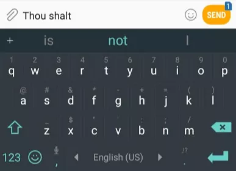

चित्र: इनपुट संकेत

ऑटोरेग्रेसिव भाषा मॉडल के फायदे और नुकसान:
- लाभ: जेनेरिक एनएलपी कार्यों के लिए, जैसे कि पाठ सारांश, मशीन अनुवाद, आदि, बाएं से दाएं सामग्री उत्पन्न करना स्वाभाविक रूप से ऑटोरेग्रेसिव भाषा मॉडल के साथ संगत है।
- नुकसान: चूंकि यह आम तौर पर बाएं से दाएं होता है (बेशक यह दाएं से बाएं भी हो सकता है), आप केवल ऊपर या नीचे की जानकारी का उपयोग कर सकते हैं, लेकिन एक ही समय में नहीं।

GPT-2 मोबाइल ऐप, GPT-2 पर इनपुट संकेतों की तुलना में एक ऑटोरेग्रेसिव भाषा मॉडल है2 अधिक जटिल और अधिक शक्तिशाली है. क्योंकि, OpenAI शोधकर्ताओं ने इंटरनेट से 40GB वेबटेक्स्ट डेटा सेट को क्रॉल किया और GPT-2 मॉडल को प्रशिक्षित करने के लिए इस डेटा सेट का उपयोग किया। हम GPT-2 मॉडल को सीधे [AllenAI GPT-2 Explorer वेबसाइट](https://gpt2.apps.allenai.org/?text=Joel) पर आज़मा सकते हैं।
 चित्र: ऑटोरेग्रेसिव GPT-2

चित्र: विभिन्न GPT मॉडल
### ट्रांसफार्मर-आधारित भाषा मॉडल

जैसा कि हमने डायग्राम ट्रांसफार्मर में सीखा, मूल ट्रांसफार्मर मॉडल एक एनकोडर भाग और एक डिकोडर भाग से बना होता है, जो दोनों ट्रांसफार्मर की कई परतों द्वारा स्टैक्ड होते हैं। मूल ट्रांसफार्मर की seq2seq संरचना मशीनी अनुवाद के लिए बहुत उपयुक्त है, क्योंकि मशीनी अनुवाद वास्तव में किसी पाठ अनुक्रम का किसी अन्य भाषा के पाठ अनुक्रम में अनुवाद है।

 चित्र: मूल ट्रांसफार्मर संरचना

लेकिन यदि आप भाषा मॉडल कार्यों को हल करने के लिए ट्रांसफार्मर का उपयोग करना चाहते हैं, तो आपको पूर्ण एनकोडर भाग और डिकोडर भाग की आवश्यकता नहीं है, इसलिए, मूल ट्रांसफार्मर के बाद कई शोध कार्यों में, लोगों ने केवल ट्रांसफार्मर एनकोडर या डिकोडर का उपयोग करने की कोशिश की, और उन्हें ढेर कर दिया। जितनी संभव हो उतनी परतें। संभवतः उच्च, और फिर एक बड़े प्रशिक्षण कोष और बहुत सारे कंप्यूटिंग संसाधनों (इन मॉडलों को प्रशिक्षित करने के लिए सैकड़ों हजारों डॉलर) का उपयोग करके पूर्व-प्रशिक्षित किया गया। उदाहरण के लिए, BERT केवल मास्क्ड भाषा मॉडल (ऑटो-एन्कोडिंग) प्रशिक्षण के लिए एनकोडर भाग का उपयोग करता है, और GPT-2 केवल ऑटोरेग्रेसिव (ऑटो-रिग्रेसिव) भाषा मॉडल प्रशिक्षण के लिए डिकोडर भाग का उपयोग करता है।
चित्र: GPT, BERT, ट्रांसफार्मर-XL

 चित्र: अधिक से अधिक परतों वाला GPT2 मॉडल


### ट्रांसफार्मर विकास
ट्रांसफार्मर का एनकोडर BERT में विकसित हुआ, और डिकोडर GPT2 में विकसित हुआ।

आइए पहले एनकोडर भाग को देखें।


चित्र: एनकोडर

मूल ट्रांसफार्मर पेपर में एनकोडर भाग एक विशिष्ट लंबाई (जैसे 512 टोकन) के इनपुट को स्वीकार करता है। यदि कोई इनपुट अनुक्रम इस सीमा से छोटा है, तो हम शेष अनुक्रम को पैड करने के लिए पैड का उपयोग कर सकते हैं। जैसा कि अध्याय 2.3 में बताया गया है, बीईआरटी सीधे एनकोडर भाग का उपयोग करता है।

आइए डिकोडर भाग की फिर से समीक्षा करें
एनकोडर की तुलना में, डिकोडर भाग में एक अतिरिक्त एनकोडर-डिकोडर आत्म-ध्यान परत होती है, ताकि डिकोडर एनकोडर द्वारा एन्कोड की गई विशिष्ट जानकारी पर ध्यान दे सके।

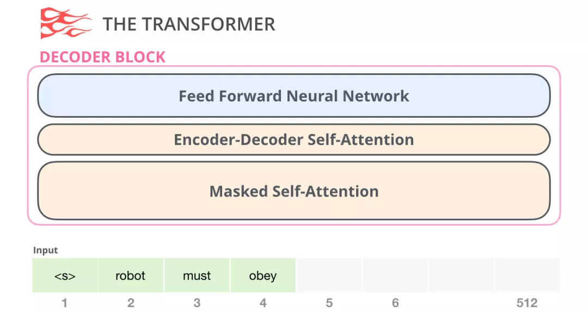चित्र: डिकोडर

डिकोडर में छिपा हुआ आत्म-ध्यान भविष्य के टोकन को अवरुद्ध कर देगा। विशेष रूप से, यह सीधे BERT की तरह इनपुट शब्द को बेतरतीब ढंग से मास्क में नहीं बदलता है, बल्कि सेल्फ-अटेंशन की गणना को बदलकर भविष्य की शब्द जानकारी को मास्क करता है।

उदाहरण के लिए, यदि हम स्थिति 4 पर ध्यान की गणना करना चाहते हैं, तो हमें केवल स्थिति 4 से पहले और स्थिति 4 पर टोकन देखने की अनुमति है।

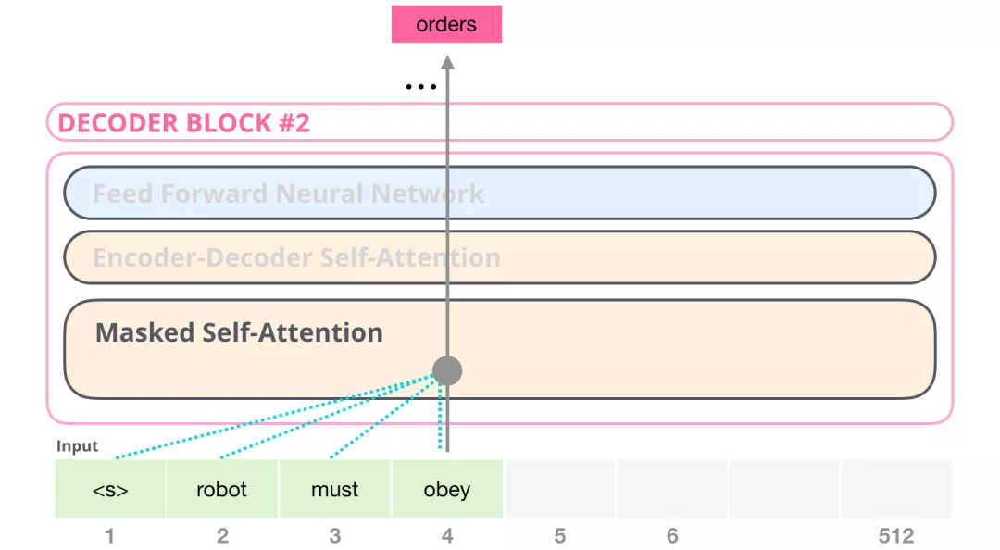 चित्र: डिकोडर केवल पिछले और वर्तमान टोकन देख सकता है

चूँकि GPT2 डिकोडर पर बनाया गया है, BERT और GPT के बीच एक महत्वपूर्ण अंतर आता है: चूँकि BERT एनकोडर पर बनाया गया है, BERT सेल्फ अटेंशन लेयर का उपयोग करता है, जबकि GPT2 डिकोडर पर बनाया गया है, और GPT-2 मास्क्ड सेल्फ अटेंशन का उपयोग करता है। एक सामान्य आत्म-ध्यान किसी स्थिति को उसके दोनों तरफ की जानकारी पर ध्यान देने की अनुमति देता है, जबकि नकाबपोश आत्म-ध्यान मॉडल को केवल बाईं ओर की जानकारी को देखने की अनुमति देता है:

चित्र: आत्म ध्यान बनाम मुखौटा आत्म ध्यान

तो GPT2 में डिकोडर कैसा दिखता है? सबसे पहले मैं लेख के बारे में बात करता हूं [लंबे अनुक्रमों को सारांशित करके विकिपीडिया बनाना](https://arxiv.org/pdf/1801.10198.pdf), जो पहले ट्रांसफार्मर-डिकोडर भाग के आधार पर भाषा मॉडल प्रशिक्षण का प्रस्ताव करता है। हटाने के कारणएनकोडर भाग हटा दिया गया है, इसलिए एनकोडर-डिकोडर पर स्वयं ध्यान देने की अब आवश्यकता नहीं है। नया ट्रांसफार्मर-डिकोडर मॉडल नीचे दिए गए चित्र में दिखाया गया है:

चित्र: ट्रांसफार्मर-डिकोडर

इसके बाद, OpenAI के GPT2 ने ऊपर दिखाए गए ट्रांसफार्मर-डिकोडर संरचना का भी उपयोग किया।

### GPT2 अवलोकन

आइए अब एक प्रशिक्षित GPT-2 को अलग करें और देखें कि यह कैसे काम करता है।

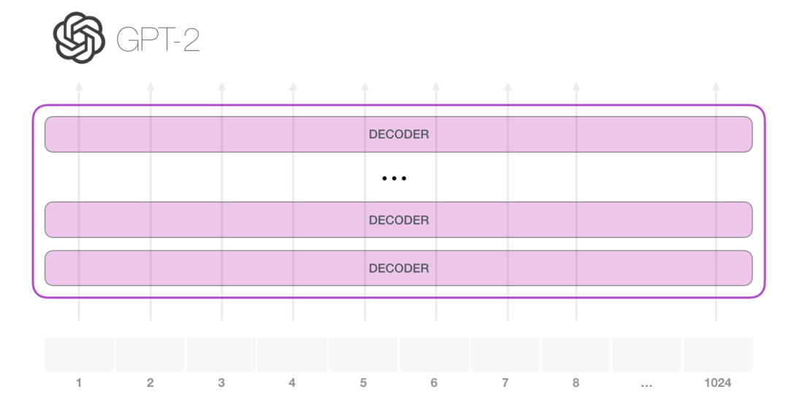 चित्र: GPT2 को अलग करना

GPT-2 1024 टोकन संभाल सकता है। प्रत्येक टोकन अपने पथ पर सभी डिकोडर परतों से होकर गुजरता है। किसी प्रशिक्षित GPT-2 मॉडल को आज़माने का सबसे आसान तरीका यह है कि इसे स्वयं पाठ उत्पन्न करने दिया जाए (इसे तकनीकी रूप से कहा जाता है: बिना शर्त पाठ उत्पन्न करना)। वैकल्पिक रूप से, हम इसे एक निश्चित विषय पर बात करने के लिए संकेत दे सकते हैं (अर्थात इंटरैक्टिव सशर्त नमूने उत्पन्न करें)।

लक्ष्यहीन स्थिति में, हम इसे बस एक विशेष \<s> प्रारंभिक टोकन खिला सकते हैं और इसे शब्द उत्पन्न करना शुरू कर सकते हैं। जैसा कि नीचे दिया गया है:


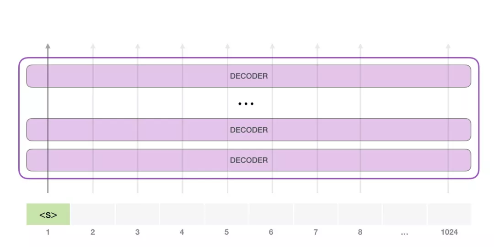 चित्र: GPT2 प्रारंभिक टोकन

चूँकि मॉडल में केवल एक इनपुट है, केवल एक सक्रिय पथ है। \<s> टोकन को सभी डिकोडर परतों में क्रमिक रूप से संसाधित किया जाता है, और पथ के साथ एक वेक्टर उत्पन्न होता है। इस वेक्टर और मॉडल की शब्दावली के आधार पर सभी संभावित शब्दों के लिए एक अंक की गणना की जाती है। नीचे दिए गए उदाहरण में, हमने सबसे अधिक संभावना वाले को चुना। इसके बाद, हम अपने इनपुट अनुक्रम में चरण एक का आउटपुट जोड़ते हैं और मॉडल को अपनी अगली भविष्यवाणी करने देते हैं।


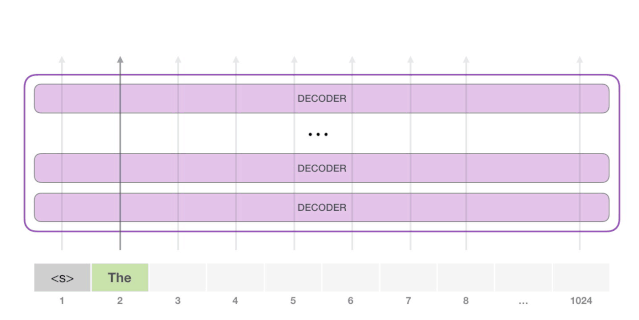 गतिशील चित्र: GPT2 को अलग करना

ध्यान दें कि इस गणना में दूसरा पथ ही एकमात्र सक्रिय पथ है। GPT-2 की प्रत्येक परत पहले टोकन के लिए एन्कोड की गई जानकारी को बरकरार रखती है और दूसरे टोकन को संसाधित करते समय सीधे इसका उपयोग करती है: GPT-2 दूसरे टोकन के आधार पर पहले टोकन की पुनर्गणना नहीं करता है।

अधिक शब्द उत्पन्न करने के लिए उपरोक्त चरणों को दोहराते रहें।


### GPT2 की विस्तृत व्याख्या
#### कोड दर्ज करें

आइए अब इनपुट से शुरू करके जीपीटी को और अधिक गहराई से समझें और सीखें। अन्य एनएलपी मॉडलों की तरह, जिनकी हमने पहले चर्चा की थी, जीपीटी-2 एम्बेडिंग मैट्रिक्स में इनपुट शब्द के संबंधित एम्बेडिंग वेक्टर की तलाश करता है। जैसा कि नीचे दिए गए चित्र में दिखाया गया है: प्रत्येक पंक्ति एक शब्द का एक एम्बेड हैडिंग: यह एक संख्यात्मक वेक्टर है जो एक शब्द का प्रतिनिधित्व कर सकता है और कुछ अर्थ पकड़ सकता है। इस वेक्टर का आकार विभिन्न GPT-2 मॉडल में भिन्न है। सबसे छोटा मॉडल 768 के एम्बेडिंग आकार का उपयोग करता है।

चित्र: टोकन एम्बेडिंग

तो शुरुआत में, हम एम्बेडिंग मैट्रिक्स में पहले टोकन \<s> की एम्बेडिंग की तलाश करेंगे। इस एम्बेडिंग को मॉडल के पहले मॉड्यूल में पास करने से पहले, हमें स्थितीय एन्कोडिंग को भी शामिल करने की आवश्यकता है (ट्रांसफॉर्मर की विस्तृत व्याख्या के लिए अध्याय 2.2 देखें)। यह स्थितीय एन्कोडिंग अनुक्रम में शब्दों के क्रम को इंगित कर सकती है।

 चित्र: स्थिति एन्कोडिंग

चित्र: टोकन+स्थिति

तो इनपुट प्रोसेसिंग: शब्द वेक्टर + स्थिति एन्कोडिंग प्राप्त करें

#### मल्टी-लेयर डिकोडर

डिकोडर की पहली परत अब \<s> टोकन के अनुरूप वेक्टर को संसाधित कर सकती है: पहले सेल्फ अटेंशन परत के माध्यम से, और फिर पूरी तरह से जुड़े तंत्रिका नेटवर्क के माध्यम से। एक बारट्रांसफ़ऑमर का पहला डिकोडर \<s> टोकन को संसाधित करता है और फिर भी एक वेक्टर प्राप्त कर सकता है। यह परिणाम वेक्टर फिर से डिकोडर की अगली परत पर भेजा जाएगा।

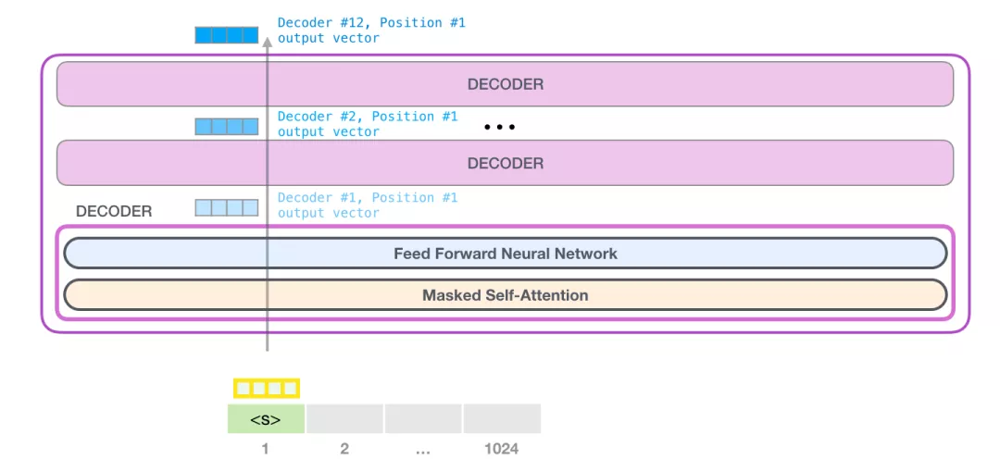चित्र: मल्टी-लेयर एन्कोडिंग

#### डिकोडर में आत्म-ध्यान

डिकोडर में मास्क्ड सेल्फ-अटेंशन शामिल है क्योंकि मास्क का संचालन स्वतंत्र रूप से किया जा सकता है, हम पहले सेल्फ-अटेंशन ऑपरेशन की स्वतंत्र रूप से समीक्षा करते हैं। भाषा बहुत हद तक संदर्भ पर निर्भर करती है। एक उदाहरण दें:

```
रोबोटिक्स का दूसरा नियम: एक रोबोट को मनुष्यों द्वारा दिए गए आदेशों का पालन करना चाहिए, सिवाय इसके कि जब आदेश पहले कानून से टकराता हो।
```

उदाहरण वाक्य में अनेक सर्वनाम हैं। इन शब्दों को उनके सन्दर्भ के बिना समझा या संसाधित नहीं किया जा सकता है। जब कोई मॉडल इस वाक्य को संसाधित करता है, तो उसे यह जानने में सक्षम होना चाहिए:

- यह रोबोट को संदर्भित करता है
- आदेश का तात्पर्य कानून के पिछले भाग से है, अर्थात उसे दिया गया आदेश
- पहला नियम रोबोटिक्स के पहले नियम को संदर्भित करता है

आत्म-ध्यान क्या करता है: यह वाक्य खंड में प्रत्येक शब्द की प्रासंगिकता को स्कोर करता है और प्रासंगिकता के अनुसार इन शब्दों के प्रतिनिधित्व वैक्टर को महत्व देता है और जोड़ता है, जिससे मॉडल को शब्द और अन्य संबंधित शब्द वैक्टर की जानकारी को एक साथ मिश्रित करने की अनुमति मिलती है। .उदाहरण के लिए, जैसा कि नीचे दिए गए चित्र में दिखाया गया है, शीर्ष-स्तरीय डिकोडर में सेल्फ अटेंशन परत `इट` शब्द को संसाधित करते समय `रोबोट` पर ध्यान देती है। तो बाद के तंत्रिका नेटवर्क पर आत्म-ध्यान द्वारा पारित `इट` वेक्टर तीन शब्दों और उनके संबंधित स्कोर के अनुरूप वैक्टर का भारित योग है।


चित्र: यह ध्यान है

**आत्म-ध्यान प्रक्रिया**

स्व-ध्यान वाक्य में प्रत्येक टोकन को संसाधित करता है, और इसके मुख्य घटकों में 3 वैक्टर शामिल हैं।

- क्वेरी: क्वेरी वेक्टर वर्तमान शब्द के वेक्टर प्रतिनिधित्व से प्राप्त किया जाता है और इसका उपयोग अन्य सभी शब्दों को स्कोर करने के लिए किया जाता है (इन शब्दों के मुख्य वैक्टर का उपयोग करके)।
- कुंजी: कुंजी वेक्टर वाक्य में सभी शब्दों के वेक्टर प्रतिनिधित्व से प्राप्त किया जाता है और इसे एक पहचान वेक्टर के रूप में माना जा सकता है।
- मूल्य: मूल्य वेक्टर वास्तव में आत्म-ध्यान में कुंजी वेक्टर के समान है।

चित्र: क्वेरी

एक मोटा सादृश्य इसे फाइलिंग कैबिनेट के अंदर खोज के रूप में सोचना है, जहां क्वेरी वेक्टर एक चिपचिपा नोट है जो बताता है कि आप खोज रहे हैंशोध का विषय, और कुंजी वेक्टर कैबिनेट में फ़ोल्डर के लेबल की तरह है। जब आप नोट्स को टैग से मिलाते हैं, तो हम उन मेल खाने वाले फ़ोल्डरों की सामग्री निकाल लेते हैं, और ये सामग्री वैल्यू वेक्टर होती हैं। लेकिन आप केवल एक वैल्यू वेक्टर की तलाश में नहीं हैं, आप वैल्यू वैक्टर की एक श्रृंखला की तलाश में हैं।

प्रत्येक फ़ोल्डर के कुंजी वेक्टर के साथ क्वेरी वेक्टर को गुणा करने से प्रत्येक फ़ोल्डर के लिए एक स्कोर उत्पन्न होता है (तकनीकी रूप से: डॉट उत्पाद के बाद सॉफ्टमैक्स)।

चित्र: स्कोर

हम प्रत्येक वैल्यू वेक्टर को संबंधित स्कोर से गुणा करते हैं और फिर सेल्फ अटेंशन का आउटपुट प्राप्त करने के लिए इसका योग करते हैं।

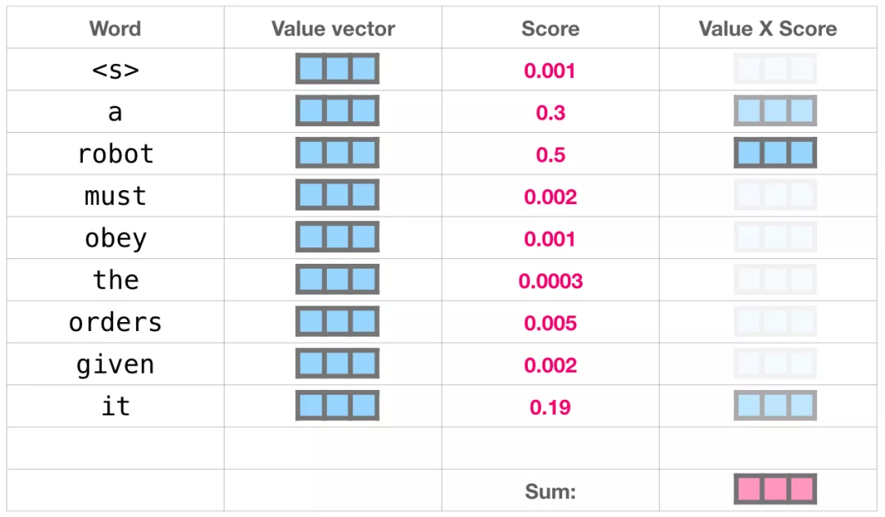 चित्र: सेल्फ अटेंशन आउटपुट

इन भारित मान वैक्टरों का परिणाम एक वेक्टर में होता है, जैसे कि ऊपर वाला, जो 50% ध्यान रोबोट शब्द पर, 30% शब्द ए पर और 19% ध्यान शब्द पर डालता है।

तथाकथित नकाबपोश आत्म-ध्यान का तात्पर्य है: मुखौटे की स्थिति के अनुरूप ध्यान स्कोर को बहुत कम संख्या में बदलना।शब्द या 0, आत्म-ध्यान (जब भारित योग) होने पर अन्य शब्दों पर विचार नहीं किया जाता है।

**मॉडल आउटपुट**

जब मॉडल के शीर्ष पर डिकोडर परत एक आउटपुट वेक्टर उत्पन्न करती है (यह वेक्टर सेल्फ अटेंशन लेयर और न्यूरल नेटवर्क लेयर के माध्यम से प्राप्त किया जाता है), तो मॉडल इस वेक्टर को एक विशाल एम्बेडिंग मैट्रिक्स (वोकैब आकार x एम्बेडिंग आकार) से गुणा कर देगा। वेक्टर के योग की गणना करें सभी शब्द एम्बेडिंग वैक्टर का सहसंबंध स्कोर।

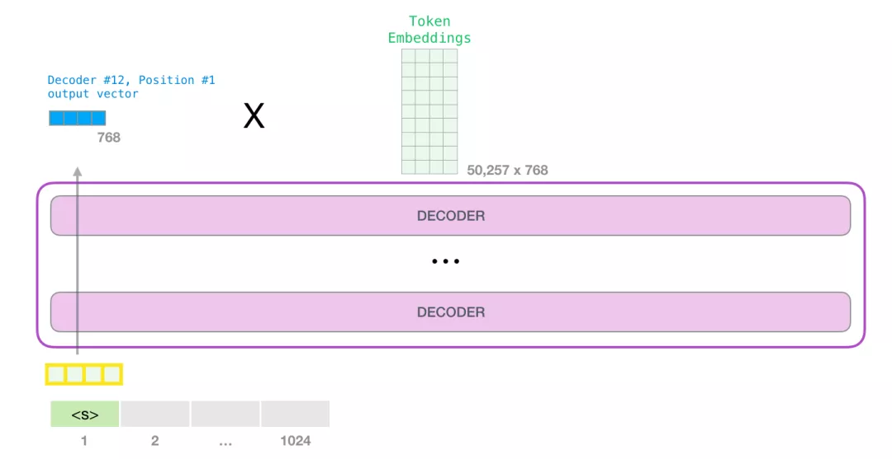 चित्र: शीर्ष मॉड्यूल आउटपुट उत्पन्न करता है

याद रखें कि एम्बेडिंग मैट्रिक्स में प्रत्येक पंक्ति मॉडल की शब्दावली में एक शब्द से मेल खाती है। इस गुणन का परिणाम, जिसे मॉडल शब्दावली में प्रत्येक शब्द के स्कोर के रूप में समझा जाता है, सॉफ्टमैक्स के बाद संभावना में बदल दिया जाता है।

 चित्र: टोकन संभावना

हम उच्चतम स्कोर (top_k=1) वाला टोकन चुन सकते हैं, या हम अन्य शब्दों (top k) पर भी विचार कर सकते हैं। यह मानते हुए कि k टोकन प्रत्येक स्थिति में आउटपुट हैं, और n टोकन कुल आउटपुट हैं, तो n शब्दों की संयुक्त संभावना के आधार पर चयनित आउटपुट अनुक्रम बेहतर होगा।

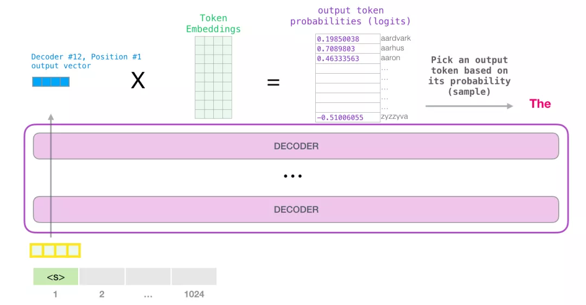 चित्र: शीर्ष 1 चयन आउटपुट

इस तरह, मॉडल एक पुनरावृत्ति पूरा करता है और एक शब्द आउटपुट करता है। मॉडल तब तक दोहराता रहता है जब तक कि सभी शब्द उत्पन्न नहीं हो जाते, या जब तक वाक्य के अंत का प्रतिनिधित्व करने वाला टोकन आउटपुट नहीं हो जाता।

## आत्म-ध्यान की विस्तृत व्याख्या

अब हम मूल रूप से जानते हैं कि GPT-2 कैसे काम करता है। यदि आप जानना चाहते हैं कि सेल्फ अटेंशन लेयर के अंदर वास्तव में क्या होता है, तो लेख का निम्नलिखित अतिरिक्त भाग आपके लिए है, मैंने सेल्फ अटेंशन को अधिक विज़ुअलाइज़ेशन के साथ समझाने के लिए इस अतिरिक्त भाग को जोड़ा है।

यहां लेख में कुछ अत्यधिक सरलीकृत कथन दिए गए हैं:

- मैं पाठ में टोकन और शब्द का परस्पर उपयोग करता हूं। लेकिन वास्तव में, GPT-2 शब्दावली में टोकन बनाने के लिए बाइट पेयर एन्कोडिंग का उपयोग करता है। इसका मतलब यह है कि टोकन आमतौर पर शब्दों के भाग होते हैं।
- हमारे द्वारा दिखाए गए उदाहरण अनुमान मोड में चलाए जाते हैं। इसीलिए यह एक समय में केवल एक टोकन को संभालता है। प्रशिक्षण के दौरान, मॉडल को लंबे पाठ अनुक्रमों पर प्रशिक्षित किया जाएगा और एक साथ कई टोकन संसाधित किए जाएंगे। इसी तरह, प्रशिक्षण के समय, मॉडल को अनुमान के समय उपयोग किए गए 1 के बैच आकार के बजाय बड़े बैच आकार के साथ संसाधित किया जाता है।
- सिद्धांत को अधिक आसानी से समझाने के लिए, मैं आम तौर पर इस लेख में चित्रों में पंक्ति वैक्टर का उपयोग करता हूं। लेकिन कुछवेक्टर वास्तव में कॉलम वेक्टर हैं। कोड कार्यान्वयन में, आपको इन वैक्टरों के रूप पर ध्यान देने की आवश्यकता है।
- ट्रांसफार्मर बहुत अधिक परत सामान्यीकरण का उपयोग करता है, जो बहुत महत्वपूर्ण है। हमने ग्राफिकल ट्रांसफॉर्मर में पहले ही इसका कुछ उल्लेख किया है, लेकिन इस लेख में, हम सेल्फ अटेंशन पर अधिक ध्यान देंगे।
- कभी-कभी मुझे वेक्टर को दर्शाने के लिए अधिक बक्सों की आवश्यकता होती है, जैसे यह चित्र:

 चित्र: इनपुट और आउटपुट आयाम

### आत्म-ध्यान की कल्पना करना

इससे पहले इस लेख में, हमने यह दिखाने के लिए इस छवि का उपयोग किया था कि सेल्फ अटेंशन `इट` शब्द को कैसे संभालता है।

चित्र: यह ध्यान है

इस अनुभाग में, हम विस्तार से बताएंगे कि इसे कैसे प्राप्त किया जाए। कृपया ध्यान दें कि हम स्पष्ट रूप से बताते हैं कि प्रत्येक शब्द का क्या होता है। यही कारण है कि हम बहुत सारे एकल वैक्टर दिखाते हैं, लेकिन वास्तविक कोड कार्यान्वयन विशाल मैट्रिक्स गुणन द्वारा किया जाता है।

आइए एक साधारण ट्रांसफार्मर को देखें, यह मानते हुए कि यह एक समय में केवल 4 टोकन ही संभाल सकता है।

आत्म-ध्यान मुख्यइसे 3 चरणों में करें:

- प्रत्येक पथ के लिए क्वेरी, कुंजी, मान मैट्रिक्स बनाएं।
- प्रत्येक इनपुट टोकन के लिए, अन्य सभी कुंजी वैक्टर को स्कोर करने के लिए उसके क्वेरी वेक्टर का उपयोग करें।
- मान सदिशों को उनके संगत भिन्नों से गुणा करके योग करें।

चित्र: 3 चरण

(1) क्वेरी, कुंजी और वैल्यू वैक्टर बनाएं

आइए पहले रास्ते पर ध्यान केंद्रित करें। हम इसके क्वेरी वेक्टर का उपयोग करेंगे और सभी प्रमुख वैक्टर की तुलना करेंगे। यह प्रत्येक कुंजी वेक्टर के लिए एक अंक उत्पन्न करता है। सेल्फ अटेंशन का पहला चरण प्रत्येक टोकन के पथ के लिए 3 वैक्टर की गणना करना है।

चित्र: चरण 1

(2) अंकों की गणना करें

अब जब हमारे पास ये वेक्टर हैं, तो हम चरण 2 के लिए क्वेरी वेक्टर और वैल्यू वेक्टर का उपयोग करते हैं। चूँकि हम पहले टोकन के वेक्टर में रुचि रखते हैं, इसलिए हम 4 टोकन का स्कोर प्राप्त करने के लिए पहले टोकन के क्वेरी वेक्टर और अन्य सभी टोकन के कुंजी वेक्टर को गुणा करते हैं।

चित्र: चरण 2

(3) योग की गणना करें

अब हम इन भिन्नों और मान वेक्टर को गुणा कर सकते हैं। जब हम उन्हें एक साथ जोड़ते हैं, तो उच्च स्कोर वाला एक वैल्यू वेक्टर परिणामी वेक्टर के एक बड़े हिस्से पर कब्जा कर लेगा।

चित्र: चरण 3

स्कोर जितना कम होगा, वैल्यू वेक्टर उतना ही अधिक पारदर्शी होगा। इसका मतलब यह है कि एक छोटी संख्या से गुणा करने पर वैल्यू वेक्टर पतला हो जाएगा।

यदि हम प्रत्येक पथ के लिए समान ऑपरेशन करते हैं, तो हमें एक वेक्टर मिलेगा जो प्रत्येक टोकन का प्रतिनिधित्व कर सकता है और प्रत्येक टोकन के लिए उपयुक्त प्रासंगिक जानकारी शामिल कर सकता है। इन वैक्टरों को ट्रांसफार्मर मॉड्यूल (फीडफॉरवर्ड न्यूरल नेटवर्क) की अगली उप-परत में फीड किया जाता है।

चित्र: सारांश


### चित्रण नकाबपोश आत्म-ध्यान

अब जब हम ट्रांसफार्मर के सेल्फ अटेंशन चरण को समझ गए हैं, तो आइए मास्क्ड सेल्फ अटेंशन की ओर बढ़ें। चरण 2 को छोड़कर, मास्क्ड सेल्फ अटेंशन और सेल्फ अटेंशन एक समान हैं।

अब यह मानते हुए कि मॉडल में इनपुट के रूप में 2 टोकन हैं, हम (पर) देख रहे हैंप्रबंधन) दूसरा टोकन। इस मामले में, अंतिम 2 टोकन छिपे हुए हैं। इसलिए मॉडल स्कोरिंग चरण में हस्तक्षेप करेगा। यह हमेशा भविष्य के टोकन स्कोर को 0 पर सेट करता है, इसलिए मॉडल भविष्य के शब्दों को नहीं देख सकता है, जैसा कि नीचे दिखाया गया है:

चित्र: नकाबपोश आत्म-ध्यान

यह मास्किंग अक्सर एक मैट्रिक्स का उपयोग करके कार्यान्वित की जाती है, जिसे अटेंशन मास्क मैट्रिक्स कहा जाता है। फिर भी उदाहरण के तौर पर 4 शब्दों का क्रम ले रहा हूं (उदाहरण के लिए: रोबोट को आदेश का पालन करना होगा)। भाषा मॉडलिंग परिदृश्य में, इस अनुक्रम को 4 चरणों में संसाधित किया जाएगा: प्रत्येक चरण एक शब्द को संसाधित करता है (यह मानते हुए कि प्रत्येक शब्द अब एक टोकन है)। इसके अलावा, चूंकि मॉडल बैच आकार के रूप में काम करता है, हम मान सकते हैं कि इस सरल मॉडल का बैच आकार 4 है, और यह 4 अनुक्रम पीढ़ी कार्यों को एक बैच के रूप में संसाधित करेगा, जैसा कि नीचे दिए गए चित्र में दिखाया गया है, बाईं ओर है इनपुट और दाईं ओर लेबल है।

 चित्र: बैच फॉर्म में इनपुट और आउटपुट

मैट्रिक्स रूप में, हम क्वेरी मैट्रिक्स का उपयोग करते हैं औरभिन्न की गणना करने के लिए मुख्य आव्यूहों को एक साथ गुणा किया जाता है। इसे इस प्रकार विज़ुअलाइज़ करें. लेकिन ध्यान दें कि शब्दों को सीधे मैट्रिक्स ऑपरेशन के अधीन नहीं किया जा सकता है, इसलिए नीचे दी गई तस्वीर में शब्दों को एक वेक्टर के अनुरूप होना चाहिए।

 चित्र: क्वेरी और कुंजियों के बीच सहसंबंध मैट्रिक्स

गुणा करने के बाद, हम त्रिकोणीय ध्यान मुखौटा जोड़ते हैं। यह उन कोशिकाओं को सेट करता है जिन्हें हम ऋणात्मक अनन्तता या बहुत बड़ी ऋणात्मक संख्या (जैसे GPT-2 में ऋणात्मक अरब) पर छिपाना चाहते हैं:

 चित्र: अटेटनियन का मास्क जोड़ें

फिर प्रत्येक पंक्ति में सॉफ्टमैक्स लगाने से वास्तविक स्कोर प्राप्त होंगे, जिनका उपयोग हम सेल्फ अटेंशन के लिए करेंगे।

चित्र: सॉफ्टमैक्स

इस अंक तालिका का अर्थ इस प्रकार है:

- जब मॉडल डेटासेट (पंक्ति 1) में पहले डेटा को संसाधित करता है, जिसमें केवल एक शब्द (रोबोट) होता है, तो यह अपना 100% ध्यान इस शब्द पर केंद्रित करता है।
- जब मॉडल डेटासेट (पंक्ति 2) में दूसरे डेटा को संसाधित करता है, तो इसमें शब्द (रोबोट अवश्य) शामिल होता है। जब मॉडल शब्दों को संसाधित करता हैअवश्य, जो 48% ध्यान रोबोट पर और 52% ध्यान मस्ट पर केंद्रित करता है।
- और इसी तरह, निम्नलिखित शब्दों को संसाधित करना जारी रखें।

अब तक, हमने मास्क सेल्फ अटेंशन का पता लगा लिया है।

### GPT2 में आत्म-ध्यान

आइए GPT-2 के छिपे हुए आत्म-ध्यान पर करीब से नज़र डालें।

*जब मॉडल भविष्यवाणी करता है: एक समय में एक टोकन संसाधित करें*

लेकिन जब हम भविष्यवाणी के लिए मॉडल का उपयोग करते हैं, तो मॉडल प्रत्येक पुनरावृत्ति के बाद केवल एक नया शब्द जोड़ता है, इसलिए संसाधित किए गए टोकन के लिए, पिछले पथ के साथ सेल्फ अटेंशन की पुनर्गणना करना अक्षम है। तो GPT-2 कुशल प्रसंस्करण कैसे प्राप्त करता है?

पहले टोकन को पहले प्रोसेस करें, जैसा कि नीचे दिए गए चित्र में दिखाया गया है (अभी के लिए \<s> को अनदेखा करें)।

चित्र: gpt2 पहला टोकन

GPT-2 टोकन `ए` के कुंजी वेक्टर और वैल्यू वेक्टर को सहेजता है। प्रत्येक सेल्फ अटेंशन परत इस टोकन के अनुरूप कुंजी वेक्टर और वैल्यू वेक्टर रखती है:

 चित्र: जीपीटी2 का शब्द ए

अब अगले पुनरावृत्ति में, जब मॉडल रोबोट शब्द को संसाधित करता है, तो उसे टोकन ए के लिए क्वेरी, वैल्यू और कुंजी वैक्टर उत्पन्न करने की आवश्यकता नहीं होती है। इसे केवल पहले पुनरावृत्ति में सहेजे गए संबंधित वेक्टर का पुन: उपयोग करने की आवश्यकता है:

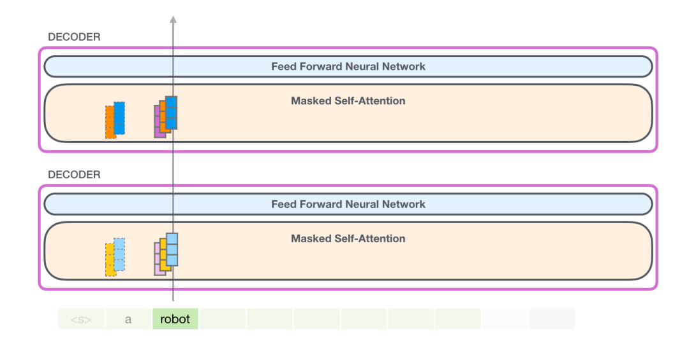 चित्र: gpt2 का शब्द रोबोट

`(1) क्वेरी, कुंजी और वैल्यू मैट्रिक्स बनाएं`

आइए मान लें कि मॉडल `इट` शब्द को संसाधित कर रहा है। डिकोडर में प्रवेश करने से पहले, इस टोकन से संबंधित इनपुट `इट` प्लस 9वीं स्थिति का स्थिति कोड एम्बेड करना है:

चित्र: इसे प्रोसेस करें

ट्रांसफार्मर में प्रत्येक परत का अपना पैरामीटर मैट्रिक्स होता है (इसे अलग करके बाद में दिखाया जाएगा)। एम्बेडिंग वैक्टर पहला वेट मैट्रिक्स जिसका हम सामना करते हैं उसका उपयोग क्वेरी, कुंजी और वैल्यू वैक्टर बनाने के लिए किया जाता है।

चित्र: इसे प्रोसेस करें

सेल्फ-अटेंशन अपने इनपुट को वेट मैट्रिक्स से गुणा करता है (और एक बायस वेक्टर जोड़ता है, जो यहां नहीं दिखाया गया है)इस गुणन के परिणामस्वरूप एक वेक्टर बनता है जो क्वेरी, कुंजी और वैल्यू वैक्टर का संयोजन है।
 चित्र: क्वेरी, कुंजी और मान


क्वेरी, कुंजी और वैल्यू वैक्टर प्राप्त करने के बाद, हम उन्हें मल्टी-हेड में विभाजित करते हैं, जैसा कि नीचे दिए गए चित्र में दिखाया गया है। वास्तव में, यह अनिवार्य रूप से एक बड़े वेक्टर को कई छोटे वेक्टर में विभाजित कर रहा है।

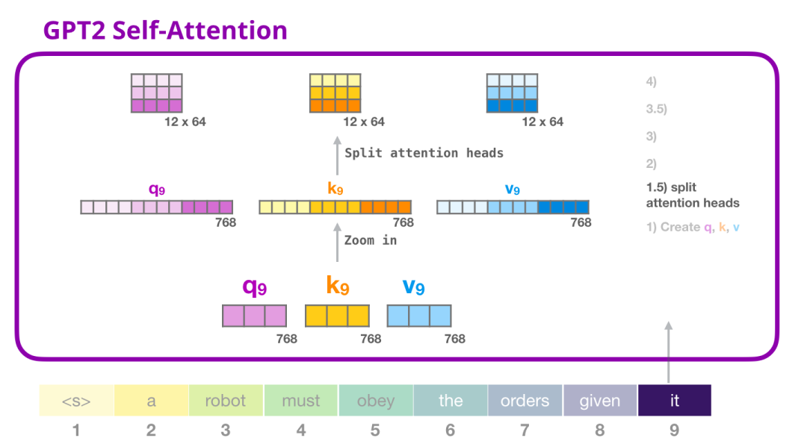चित्र: मल्टी हेड

मल्टी हेड को बेहतर ढंग से समझने के लिए, हम इसे इस प्रकार दिखाएंगे:


 चित्र: मल्टी हेड

`(2) रेटिंग`

अब हम स्कोरिंग जारी रख सकते हैं, यह मानते हुए कि हम केवल एक ध्यान शीर्ष पर ध्यान केंद्रित करते हैं (अन्य ध्यान प्रमुख समान कार्य कर रहे हैं)।

चित्र: स्कोर

अब, इस टोकन को अन्य सभी टोकन के कुंजी वैक्टर के आधार पर स्कोर किया जा सकता है (इन कुंजी वैक्टर की गणना पिछले पुनरावृत्ति में पहले ध्यान शीर्ष द्वारा की जाती है)का):

चित्र: भारित योग

`(3) योग`

जैसा कि हमने पहले देखा, अब हम प्रत्येक वैल्यू वेक्टर को संबंधित स्कोर से गुणा करते हैं और फिर पहले ध्यान शीर्ष के लिए स्व-ध्यान परिणाम प्राप्त करने के लिए उन्हें जोड़ते हैं:

 चित्र:

`ध्यान प्रमुखों को मिलाएँ`

मल्टी हेड कई भारित योग वैक्टर से मेल खाता है, और हम उन सभी को फिर से एक साथ जोड़ते हैं:

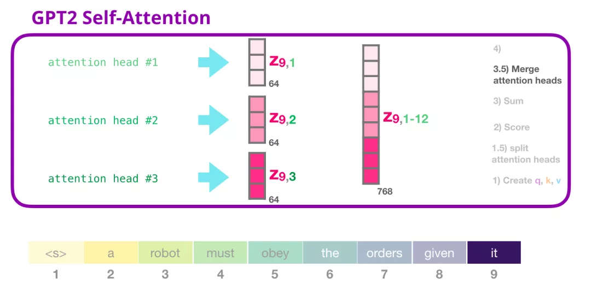 चित्र: मल्टी हेड के एकाधिक भारित योग वैक्टर को जोड़ना

प्राप्त वेक्टर को वांछित आयाम प्राप्त करने के लिए एक रैखिक मानचित्रण के अधीन किया जाता है, और फिर पूरी तरह से जुड़े नेटवर्क में इनपुट किया जाता है।

`(4) मैपिंग (प्रक्षेपण)`

हम मॉडल को यह सीखने देंगे कि समेकित सेल्फ अटेंशन परिणामों को इनपुट में कैसे परिवर्तित किया जाए जिसे फीडफॉरवर्ड न्यूरल नेटवर्क प्रोसेस कर सके। यहां, हम सेल्फ अटेंशन सबलेयर के आउटपुट वेक्टर पर ध्यान प्रमुखों के परिणामों को मैप करने के लिए दूसरे विशाल वेट मैट्रिक्स का उपयोग करते हैं:

चित्र: मैपिंगउपरोक्त चरणों के माध्यम से, हम एक वेक्टर उत्पन्न करते हैं, जिसे हम अगली परत तक पहुंचा सकते हैं:

 चित्र: अगली परत पर जाएँ

### GPT-2 पूरी तरह से कनेक्टेड न्यूरल नेटवर्क

`टियर 1`

सेल्फ अटेंशन लेयर के आउटपुट को प्रोसेस करने के लिए एक पूरी तरह से कनेक्टेड न्यूरल नेटवर्क का उपयोग किया जाता है, और इस आउटपुट के प्रतिनिधित्व में उचित संदर्भ शामिल होता है। पूरी तरह से जुड़े तंत्रिका नेटवर्क में दो परतें होती हैं। पहली परत मॉडल के आकार का 4 गुना है (चूंकि GPT-2 छोटा 768 है, इस नेटवर्क में 3072 न्यूरॉन्स होंगे)।


 गतिशील चित्र: पूरी तरह से जुड़ी हुई परत

पूर्वाग्रह वेक्टर नहीं दिखाया गया

`परत 2. मॉडल आयामों के लिए वैक्टर को मैप करें`

परत 2 पहली परत से परिणामों को मॉडल के आयामों (जीपीटी-2 छोटे में 768) तक मैप करती है। इस गुणन का परिणाम इस टोकन के लिए ट्रांसफार्मर का आउटपुट है।

 चित्र: पूरी तरह से जुड़ी हुई परत

पूर्वाग्रह वेक्टर नहीं दिखाया गया

संक्षेप में कहें तो, हमारा इनपुट निम्नलिखित वजन मैट्रिक्स का सामना करेगा:

चित्र: सारांश

प्रत्येक मॉड्यूल में हैइसका अपना वजन है. दूसरी ओर, मॉडल में केवल एक टोकन एम्बेडिंग मैट्रिक्स और एक स्थिति एन्कोडिंग मैट्रिक्स होता है।


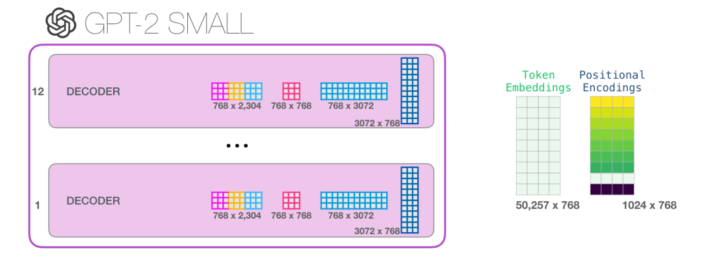चित्र: सारांश

यदि आप मॉडल के सभी पैरामीटर देखना चाहते हैं, तो मैंने उनका मिलान यहां किया है:

चित्र: सारांश
किसी कारण से उनका योग 124M होता है, 117M नहीं। मुझे यकीन नहीं है कि ऐसा क्यों है, लेकिन यह पोस्ट किए गए कोड में दिखाया गया आकार है (यदि मैं गलत हूं तो कृपया मुझे सुधारें)।

## भाषा मॉडल अनुप्रयोग

केवल डिकोडर के ट्रांसफार्मर ने भाषा मॉडल के बाहर हमेशा अच्छे परिणाम दिखाए हैं। इसका कई अनुप्रयोगों में सफलतापूर्वक उपयोग किया गया है, और हम इन सफल अनुप्रयोगों का वर्णन उपरोक्त जैसे विज़ुअलाइज़ेशन के साथ कर सकते हैं। आइए इस लेख को समाप्त करने के लिए इन अनुप्रयोगों पर नजर डालें।

### मशीन अनुवाद

मशीनी अनुवाद करते समय एनकोडर आवश्यक नहीं है। हम उसी कार्य को केवल डिकोडर वाले ट्रांसफार्मर के साथ हल कर सकते हैं:

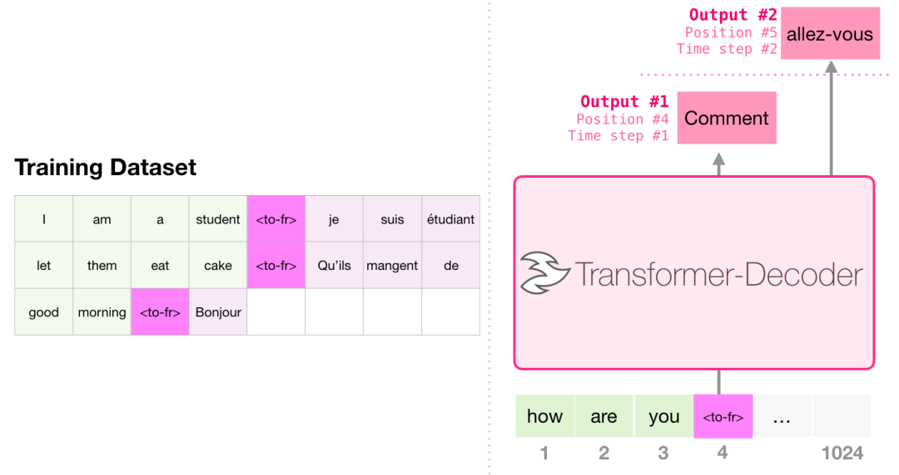चित्र: अनुवाद

### सारांश उत्पन्न करें

यह केवल डिकोडर के ट्रांसफार्मर का उपयोग करके प्रशिक्षित किया जाने वाला पहला कार्य है। इसे आयामी पढ़ने के लिए प्रशिक्षित किया जाता हैबुनियादी विश्वकोश लेख (शुरुआती भाग सामग्री की तालिका से हटा दिया जाता है), और फिर एक सारांश तैयार किया जाता है। लेख की वास्तविक शुरुआत का उपयोग प्रशिक्षण डेटा के लेबल के रूप में किया जाता है:
चित्र:

पेपर में, मॉडल को विकिपीडिया लेखों पर प्रशिक्षित किया गया था, इसलिए मॉडल लेखों को सारांशित कर सकता है और सार तैयार कर सकता है:

चित्र: सार

### सीखने का स्थानांतरण

एकल पूर्व-प्रशिक्षित ट्रांसफार्मर (https://arxiv.org/abs/1905.08836) का उपयोग करके नमूना कुशल पाठ सारांश में, केवल डिकोडर वाले ट्रांसफार्मर को पहले भाषा मॉडल पर पूर्व-प्रशिक्षित किया जाता है और फिर सारांश उत्पन्न करने के लिए ठीक किया जाता है। नतीजे बताते हैं कि डेटा की मात्रा सीमित होने पर यह पूर्व-प्रशिक्षित एनकोडर-डिकोडर ट्रांसफार्मर की तुलना में बेहतर परिणाम प्राप्त कर सकता है।

GPT-2 पेपर भाषा मॉडल को पूर्व-प्रशिक्षित करके सारांश तैयार करने के परिणाम भी दिखाता है।

### संगीत पीढ़ी

संगीत ट्रांसफार्मर(https://magenta.tensorflow.org/music-transformएर) पेपर अभिव्यंजक समय और गतिशीलता के साथ संगीत उत्पन्न करने के लिए केवल-डिकोडर ट्रांसफार्मर का उपयोग करता है। संगीत मॉडलिंग बिल्कुल भाषा मॉडलिंग की तरह है, बस मॉडल को बिना पर्यवेक्षित तरीके से संगीत सीखने दें, और फिर उसे आउटपुट का नमूना लेने दें (हमने इसे पहले कहा था)।

आप सोच रहे होंगे कि इस दृश्य में संगीत कैसे बजता है। याद रखें, भाषा मॉडलिंग वर्णों, शब्दों या शब्दों के कुछ हिस्सों (टोकन) को वैक्टर के रूप में प्रस्तुत कर सकता है। संगीत प्रदर्शन में (आइए पियानो के बारे में सोचें), हमें न केवल नोट्स, बल्कि गति का भी प्रतिनिधित्व करना होता है - यह एक माप है कि पियानो कुंजी को कितनी जोर से दबाया जाता है।

 पिक्चर: म्यूजिक जेनरेशन

एक प्रदर्शन एक-हॉट वैक्टर की एक श्रृंखला है। एक मिडी फ़ाइल को निम्नलिखित प्रारूप में परिवर्तित किया जा सकता है। पेपर एक उदाहरण के रूप में निम्नलिखित इनपुट अनुक्रम का उपयोग करता है:

 चित्र: म्यूजिक जेनरेशन


इस इनपुट श्रृंखला का एक-हॉट वेक्टर प्रतिनिधित्व इस प्रकार है:

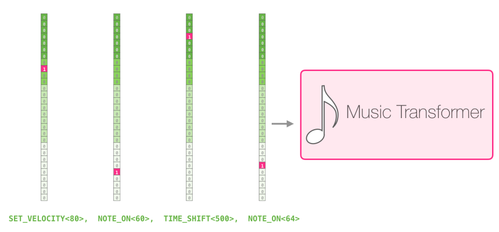 चित्र: म्यूजिक जेनरेशन

मुझे पेपर में म्यूजिक ट्रांसफॉर्मर द्वारा दिखाया गया सेल्फ अटेंशन का दृश्य पसंद है। मैंने इसके शीर्ष पर कुछ टिप्पणियाँ जोड़ीं:

 चित्र: संगीत पीढ़ी

संगीत के इस टुकड़े में एक आवर्ती त्रिकोणीय रूपरेखा है। क्वेरी मैट्रिक्स एक शिखर के पीछे है और यह संगीत की शुरुआत जानने के लिए पिछले सभी शिखरों के उच्च नोट्स को नोटिस करता है। यह छवि एक क्वेरी वेक्टर (सभी ध्यान रेखाओं का स्रोत) और पहले से मौजूद यादें दिखाती है (वे हाइलाइट किए गए नोट्स अधिक सॉफ्टमैक्स संभावना के अधीन हैं)। ध्यान रेखा का रंग अलग-अलग ध्यान प्रमुखों से मेल खाता है, और चौड़ाई सॉफ्टमैक्स संभावना के वजन से मेल खाती है।

## संक्षेप

अब हम GPT-2 और इसके मूल मॉडल, डिकोडर-ओनली ट्रांसफार्मर के साथ अपनी यात्रा समाप्त करते हैं। मुझे उम्मीद है कि इस लेख को पढ़ने के बाद आपको सेल्फ अटेंशन की बेहतर समझ होगी, और मुझे उम्मीद है कि आपको ट्रांसफार्मर के अंदर क्या चल रहा है इसकी भी बेहतर समझ होगी।


## आभार
इसका मुख्य रूप से अनुवाद और लेखन हार्बिन इंस्टीट्यूट ऑफ टेक्नोलॉजी (मूल लेखक द्वारा अधिकृत) के झांग जियान द्वारा किया गया था, और डुओडुओ द्वारा व्यवस्थित और संकलित किया गया था।